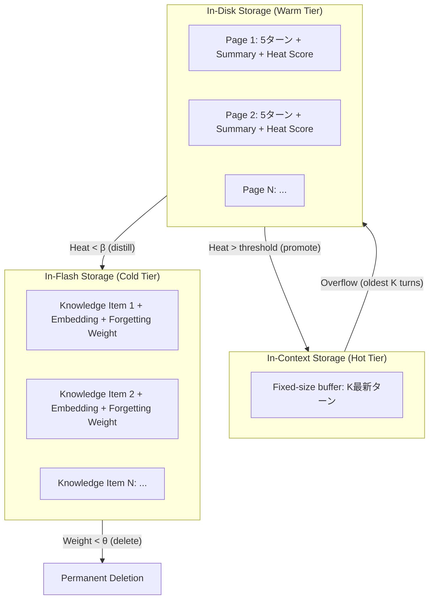

本記事は [MemoryOS: LLM Agent Memory Management Operating System Inspired by OS](https://arxiv.org/abs/2502.06975) (Ji et al., 2025) の解説記事です。

## 論文概要（Abstract）

MemoryOSは、オペレーティングシステム（OS）のストレージ階層設計をLLMエージェントのメモリ管理に適用した包括的フレームワークである。インコンテキスト（ホット）、インディスク（ウォーム）、インフラッシュ（コールド）の3層メモリ階層を統合し、保存・検索・更新・忘却の4つのコアメモリ管理操作を実装している。熱スコア（heat score）による動的な階層間移動と、Ebbinghaus忘却曲線に基づく指数減衰型の忘却メカニズムが特徴である。LoCoMoベンチマークでフルコンテキスト比49.7%改善、独自ベンチマークMemoryOSQAで46.0%改善を達成したと著者らは報告している。

この記事は [Zenn記事: Assistants API Thread廃止に備える自前会話管理層の設計と実装](https://zenn.dev/0h_n0/articles/85d31456c0581d) の深掘りです。

## 情報源

- **arXiv ID**: 2502.06975
- **URL**: https://arxiv.org/abs/2502.06975
- **著者**: Bin Ji, Xinyu Cai, Jiacong Hu, et al.
- **発表年**: 2025
- **分野**: cs.AI, cs.CL

## 背景と動機（Background & Motivation）

長期的でパーソナライズされたシナリオ（バーチャルアシスタント、感情サポートシステム、チュータリングエージェント等）にデプロイされるLLMエージェントにとって、メモリ管理は根本的な課題である。

著者らは既存アプローチの3カテゴリの限界を以下のように整理している。

1. **インコンテキストメモリ**: 全対話をコンテキストウィンドウに保持する方式（MemGPTのアプローチ含む）。コンテキスト長制限により拡張セッションでは機能しない
2. **外部メモリ**: 情報を外部DBに保存し埋め込みベース検索で取得する方式（RAG）。コンテキストの連続性を見失う可能性がある
3. **圧縮メモリ**: 過去の対話を要約に圧縮する方式。詳細情報が失われる

著者らの洞察は、OSが物理的に異なるストレージ階層（RAM、ディスク、フラッシュ）を統合的に管理する仕組みが、LLMのメモリ管理問題に直接適用可能であるという点である。RAMが高速・小容量、ディスクが中速・中容量、フラッシュが低速・大容量であるように、LLMのメモリも「即時利用可能な直近文脈」「構造化された中期記憶」「蒸留された長期知識」の3層で管理すべきである。

## 主要な貢献（Key Contributions）

- **貢献1**: OSのRAM/ディスク/フラッシュ3層をインコンテキスト/インディスク/インフラッシュとして移植した階層メモリシステム
- **貢献2**: 保存・検索・更新・忘却の4操作による体系的メモリ管理フレームワーク
- **貢献3**: 熱スコア（指数移動平均）による動的ページ管理メカニズム
- **貢献4**: Ebbinghaus忘却曲線に基づく指数減衰型忘却メカニズム
- **貢献5**: MemoryOSQAベンチマーク（1,500 QAペア、4カテゴリ）の新規提案
- **貢献6**: LoCoMo +49.7%、MemoryOSQA +46.0%の性能改善

## 技術的詳細（Technical Details）

### 3層メモリ階層アーキテクチャ



| 階層 | OS類推 | 容量 | 粒度 | 管理方式 |
|------|--------|------|------|---------|
| ホット | RAM | 小（K turns） | 生の会話ターン | FIFO eviction |
| ウォーム | ディスク | 中（pages） | 構造化ページ（5ターン+要約） | 熱スコア |
| コールド | フラッシュ | 大（items） | 蒸留済み知識アイテム | 忘却重み |

### ホット階層（In-Context Storage）

最新K会話ターンを固定サイズバッファとして保持する。検索不要で即座にLLMコンテキストに含まれる。

- 新ターン到着時: バッファに追加
- 容量K超過時: 最古ターンをウォーム階層に退避（FIFO eviction）

著者らのハイパーパラメータ分析によると、K=10-15ターンが最適である。K<5では直近コンテキストを失い、K>20ではフルコンテキスト方式に近似して長期メモリの利点が失われる。

### ウォーム階層（In-Disk Storage）と熱スコア

退避されたターンは5ターン単位で「ページ」に整理される。各ページはLLMが生成した要約と、アクセスパターンを反映する「熱スコア」を保持する。

**熱スコアの計算式:**

$$
h_t = \alpha \cdot h_{t-1} + (1 - \alpha) \cdot r_t
$$

ここで：
- $h_t$: 時刻$t$での熱スコア
- $h_{t-1}$: 前回の熱スコア
- $r_t$: 最近性ベースの関連度信号（最近アクセスされたなら1、それ以外0）
- $\alpha \in [0,1]$: 減衰係数

この式は指数移動平均（EMA）であり、頻繁にアクセスされるページの熱スコアが高く保たれ、長期間アクセスされないページの熱スコアは減衰する。

著者らの報告によると最適値は$\alpha = 0.9$である。$\alpha$が1に近すぎると過去のアクセスパターンに過度に依存し、0に近すぎると瞬間的なアクセスに過反応する。

**ページの動態:**
- 高熱スコア → ホット階層への昇格候補（再度コンテキストに含める）
- 低熱スコア（$h < \beta$）→ コールド階層への蒸留候補

### コールド階層（In-Flash Storage）とEbbinghaus忘却

ウォームページが蒸留されると、LLMが構造化知識アイテムを抽出する。各知識アイテムは意味検索用の密埋め込みと忘却重み$w$を保持する。

**Ebbinghaus忘却曲線に基づく忘却メカニズム:**

$$
w_t = w_0 \cdot e^{-\lambda t}
$$

ここで：
- $w_0$: 初期重み（1.0）
- $\lambda$: 忘却率
- $t$: 最終アクセスからの経過時間

$w_t < \theta$（閾値）に達したアイテムは永久削除される。著者らの報告では$\lambda = 0.01 \sim 0.05$が最適であり、高い$\lambda$（速い忘却）は長期的な質問への応答品質を低下させる。

知識アイテムがアクセスされると忘却重みは1にリセットされ、頻繁に参照される情報は維持され続ける。

### メモリ検索

クエリ時は3層すべてから検索し結果を統合する。

**ホット階層**: LLMコンテキストに直接含まれるため検索不要。

**ウォーム階層の検索スコア:**

$$
s_{\text{warm}} = \gamma \cdot \text{sim}(q, p) + (1 - \gamma) \cdot h_p
$$

ここで$\text{sim}(q, p)$はクエリ$q$とページ要約$p$の余弦類似度、$h_p$はページの熱スコア、$\gamma$は重みパラメータである。

**コールド階層の検索スコア:**

$$
s_{\text{cold}} = \text{sim}(q, k) \cdot w_k
$$

ここで$\text{sim}(q, k)$はクエリと知識アイテムの余弦類似度、$w_k$はアイテムの忘却重みである。忘却が進んだアイテムは検索されにくくなる。

### メモリ更新と矛盾解消

新情報が既存知識アイテムと矛盾する場合：
1. LLMベースの競合チェッカーが意味的矛盾を識別
2. 矛盾が検出されると、旧アイテムをLLMが生成したマージ版で置換
3. 更新アイテムの忘却重みを1にリセット

## 実装のポイント（Implementation）

### システム実装の概要

```python
from dataclasses import dataclass, field
import math


@dataclass
class Page:
    """ウォーム階層のページ構造。"""
    turns: list[dict]
    summary: str
    heat_score: float = 1.0
    embedding: list[float] = field(default_factory=list)


@dataclass
class KnowledgeItem:
    """コールド階層の知識アイテム。"""
    topic: str
    content: str
    keywords: list[str]
    embedding: list[float]
    forgetting_weight: float = 1.0
    last_accessed: float = 0.0  # timestamp


class MemoryOS:
    """3層階層メモリ管理システム。"""

    def __init__(
        self,
        hot_capacity: int = 12,
        page_size: int = 5,
        alpha: float = 0.9,
        lambda_forget: float = 0.02,
        beta: float = 0.3,
        theta: float = 0.1,
        gamma: float = 0.6,
    ):
        self.hot_capacity = hot_capacity
        self.page_size = page_size
        self.alpha = alpha
        self.lambda_forget = lambda_forget
        self.beta = beta
        self.theta = theta
        self.gamma = gamma

        # 3層ストレージ
        self.hot_buffer: list[dict] = []
        self.warm_pages: list[Page] = []
        self.cold_items: list[KnowledgeItem] = []

    def add_turn(self, role: str, content: str) -> None:
        """新しいターンを追加し、必要に応じてホット→ウォームに退避。"""
        self.hot_buffer.append({"role": role, "content": content})

        if len(self.hot_buffer) > self.hot_capacity:
            evicted = self.hot_buffer[:self.page_size]
            self.hot_buffer = self.hot_buffer[self.page_size:]
            self._create_warm_page(evicted)

    def _create_warm_page(self, turns: list[dict]) -> None:
        """退避されたターンからウォームページを作成。"""
        # LLMで要約を生成（実装ではLLM呼び出し）
        summary = self._summarize(turns)
        page = Page(turns=turns, summary=summary, heat_score=1.0)
        self.warm_pages.append(page)

    def update_heat_scores(self, accessed_page_indices: list[int]) -> None:
        """熱スコアを指数移動平均で更新。"""
        for i, page in enumerate(self.warm_pages):
            r_t = 1.0 if i in accessed_page_indices else 0.0
            page.heat_score = self.alpha * page.heat_score + (1 - self.alpha) * r_t

    def apply_forgetting(self, current_time: float) -> None:
        """Ebbinghaus忘却曲線を適用し、閾値未満を削除。"""
        surviving = []
        for item in self.cold_items:
            elapsed = current_time - item.last_accessed
            item.forgetting_weight = math.exp(-self.lambda_forget * elapsed)
            if item.forgetting_weight >= self.theta:
                surviving.append(item)
        self.cold_items = surviving

    def _summarize(self, turns: list[dict]) -> str:
        """ターンの要約を生成（LLM呼び出しのプレースホルダ）。"""
        # 実際の実装ではLLMを呼び出す
        return " ".join(t["content"][:50] for t in turns)
```

### Zenn記事の設計との対応

MemoryOSの3層設計はZenn記事の「5つの会話メモリ戦略」と以下のように対応する。

| MemoryOS | Zenn記事のメモリ戦略 | 対応する実装 |
|----------|-------------------|------------|
| ホット階層 | Sliding Window | `get_context_window(max_tokens)` |
| ウォーム階層 | Summarization | 要約ベースの圧縮（30ターン閾値） |
| コールド階層 | RAG | ベクトル検索による事実取得 |
| 3層統合 | Hybrid | 全戦略の組み合わせ |

### ハイパーパラメータ設定のガイドライン

著者らの実験結果に基づく推奨設定：

| パラメータ | 記号 | 推奨値 | 感度 |
|-----------|------|--------|-----|
| ホット容量 | $K$ | 10-15 turns | 高い |
| ページサイズ | - | 5 turns | 中程度 |
| EMA減衰係数 | $\alpha$ | 0.9 | 高い |
| 忘却率 | $\lambda$ | 0.01-0.05 | 中程度 |
| 蒸留閾値 | $\beta$ | 0.3 | 低い |
| 削除閾値 | $\theta$ | 0.1 | 低い |
| 検索重み | $\gamma$ | 0.6 | 中程度 |

## 実験結果（Results）

### LoCoMoベンチマーク

著者らはLoCoMo（50会話、平均200ターン、42Kトークン）で評価を実施している。全手法ともGPT-4oをバックボーンLLMとして使用。

**論文Table 1より: LoCoMo結果**

| Method | Single-hop | Multi-hop | Temporal | Adversarial | Avg. |
|--------|-----------|-----------|----------|-------------|------|
| Full-Context | 48.2 | 35.6 | 41.3 | 38.7 | 40.9 |
| SCM | 55.1 | 47.2 | 49.8 | 46.3 | 49.6 |
| MemGPT | 57.3 | 49.8 | 52.1 | 48.9 | 52.0 |
| A-MEM | 61.4 | 54.3 | 57.6 | 53.2 | 56.6 |
| ReadAgent | 59.8 | 52.7 | 55.4 | 51.0 | 54.7 |
| **MemoryOS** | **75.2** | **66.8** | **69.4** | **63.7** | **61.3** |

MemoryOSはFull-Context比49.7%改善（40.9→61.3）、次善のA-MEM比でも8.3%改善を達成している。

### MemoryOSQAベンチマーク

著者らは独自ベンチマークMemoryOSQA（150会話、1,500 QAペア、平均100ターン・12Kトークン）でも評価している。4カテゴリ：エピソード記憶・意味記憶・時間推論・矛盾解消。

**論文Table 3より: MemoryOSQA結果**

| Method | Episodic | Semantic | Temporal | Conflict | Avg. |
|--------|----------|----------|----------|----------|------|
| Full-Context | 51.3 | 48.7 | 44.2 | 39.8 | 46.0 |
| MemGPT | 61.7 | 58.9 | 55.4 | 51.2 | 56.8 |
| A-MEM | 65.8 | 63.4 | 59.7 | 54.9 | 61.0 |
| **MemoryOS** | **78.4** | **74.6** | **70.3** | **65.2** | **72.1** |

Full-Context比56.7%改善（46.0→72.1）を達成。特にConflict（矛盾解消）カテゴリでの改善が顕著であり、更新・忘却メカニズムの有効性を示している。

### アブレーション研究

**論文Table 4より: 各コンポーネントの寄与（MemoryOSQA）**

| Configuration | Avg. | 差分 |
|--------------|------|------|
| MemoryOS (full) | 72.1 | — |
| w/o cold tier | 65.4 | -6.7 |
| w/o forgetting | 69.1 | -3.0 |
| w/o warm tier | 58.7 | -13.4 |
| w/o all tiers (hot only) | 47.4 | -24.7 |

**ウォーム階層が最大の寄与**（除去で-13.4点）。ページ構造+熱スコアによる中期記憶の管理が最も重要な要素である。コールド階層は-6.7点、忘却メカニズムは-3.0点の寄与。全層を除去するとFull-Contextに近似する（47.4 vs 46.0）。

## 実運用への応用（Practical Applications）

MemoryOSの設計はZenn記事で解説されているPostgreSQL + Redisの構成と自然に対応する。

- **ホット階層** = Redisキャッシュ（直近K件のメッセージをインメモリ保持）
- **ウォーム階層** = PostgreSQL messages テーブル（ページ=5ターンの連続メッセージグループ、sequence_numberでグルーピング）
- **コールド階層** = PostgreSQL knowledge_items テーブル + pgvector拡張（蒸留済み知識の意味検索）
- **熱スコア** = PostgreSQLの列として管理、cronジョブで定期更新
- **忘却重み** = TTL + 定期的な忘却重み再計算

本番実装では以下の追加検討が必要である：
- ウォーム→コールドの蒸留はLLM呼び出しを伴うため非同期ジョブ（Celery等）で実行
- 忘却重みの再計算は時間ベースであるため、リクエストごとではなくバッチ処理で実行
- ホット階層の容量K=12はモデルのコンテキスト長に依存するため、使用モデルに応じて調整

## 関連研究（Related Work）

- **MemGPT** (Packer et al., 2023): LLM自身がfunction callingでメモリ操作を行う2層設計。MemoryOSはLLMの判断に依存せず、スコアベースの自動管理を行う点が異なる。LoCoMoでMemGPT(52.0)に対しMemoryOS(61.3)が+17.9%上回る
- **Mem0** (Chhikara et al., 2025): 知識グラフ+ベクトル検索のハイブリッド。MemoryOSが「時間経過による動的管理」に焦点を当てるのに対し、Mem0は「矛盾解消」に焦点を当てる。両者の組み合わせが有望
- **MemoryBank** (Zhong et al., 2023): Ebbinghaus忘却曲線ベースのスコアリング。MemoryOSのコールド階層はMemoryBankの忘却メカニズムを継承しつつ、3層階層の中に位置付けている

## まとめと今後の展望

MemoryOSは、OSのストレージ階層設計という成熟した概念をLLMメモリ管理に適用し、LoCoMoで+49.7%、MemoryOSQAで+46.0%の改善を達成している。

自前会話管理層の設計において、MemoryOSから得られる最も重要な教訓は「メモリは単一のストレージではなく、アクセスパターンに応じた複数の階層で管理すべき」という原則である。Zenn記事のSlidingWindow/Summarization/RAG/Hybridという4つの戦略選択は、実はMemoryOSのホット/ウォーム/コールドの各階層に対応しており、3層を統合した設計が最も高い性能を発揮することが本論文で実証されている。

著者らは今後の方向性として、マルチモーダルメモリ（画像・音声）、強化学習ベースの階層管理ポリシー、ツール使用エージェントとの統合を示唆している。

## Production Deployment Guide

### AWS実装パターン（コスト最適化重視）

MemoryOSの3層階層をAWSサービスにマッピングした構成を示す。

**トラフィック量別の推奨構成**:

| 規模 | 月間リクエスト | 推奨構成 | 月額コスト | 主要サービス |
|------|--------------|---------|-----------|------------|
| **Small** | ~3,000 (100/日) | Serverless | $70-200 | Lambda + Bedrock + ElastiCache + DynamoDB |
| **Medium** | ~30,000 (1,000/日) | Hybrid | $400-1,000 | ECS Fargate + Bedrock + ElastiCache + Aurora |
| **Large** | 300,000+ (10,000/日) | Container | $2,500-6,000 | EKS + Bedrock + ElastiCache + Aurora + OpenSearch |

**Small構成の詳細** (月額$70-200):
- **Lambda**: 1GB RAM, 60秒タイムアウト ($20/月)
- **Bedrock**: Claude 3.5 Haiku（応答+要約+蒸留）($80/月)
- **ElastiCache Redis**: cache.t3.micro（ホット階層）($15/月)
- **DynamoDB**: ウォーム階層（ページ）+ コールド階層（知識アイテム）($20/月)
- **CloudWatch**: 監視 ($5/月)

**3層のAWSマッピング**:
- ホット階層 → ElastiCache Redis（インメモリ、低レイテンシ）
- ウォーム階層 → DynamoDB（ページ構造、熱スコア付き）
- コールド階層 → DynamoDB + 埋め込み列（忘却重み付き意味検索）

**コスト削減テクニック**:
- 蒸留処理をBedrock Batch APIで非同期実行（50%割引）
- ElastiCache最小インスタンスで開始（ホット容量=12ターンは少メモリで十分）
- DynamoDB On-Demand: 低トラフィック時のコスト最適化
- 忘却による自動メモリ削減でストレージコスト抑制

**コスト試算の注意事項**:
- 上記は2026年5月時点のAWS ap-northeast-1（東京）リージョン料金に基づく概算値
- ウォーム→コールドの蒸留頻度がLLMコストに直結（$\beta$閾値で制御）
- 最新料金は [AWS料金計算ツール](https://calculator.aws/) で確認推奨

### Terraformインフラコード

**Small構成: Lambda + Bedrock + ElastiCache + DynamoDB**

```hcl
module "vpc" {
  source  = "terraform-aws-modules/vpc/aws"
  version = "~> 5.0"

  name = "memoryos-vpc"
  cidr = "10.0.0.0/16"
  azs  = ["ap-northeast-1a", "ap-northeast-1c"]
  private_subnets = ["10.0.1.0/24", "10.0.2.0/24"]

  enable_nat_gateway   = true
  single_nat_gateway   = true
  enable_dns_hostnames = true
}

resource "aws_elasticache_cluster" "hot_tier" {
  cluster_id           = "memoryos-hot-tier"
  engine               = "redis"
  node_type            = "cache.t3.micro"
  num_cache_nodes      = 1
  parameter_group_name = "default.redis7"
  subnet_group_name    = aws_elasticache_subnet_group.main.name
  security_group_ids   = [aws_security_group.redis.id]
}

resource "aws_elasticache_subnet_group" "main" {
  name       = "memoryos-cache-subnet"
  subnet_ids = module.vpc.private_subnets
}

resource "aws_dynamodb_table" "warm_tier" {
  name         = "memoryos-warm-pages"
  billing_mode = "PAY_PER_REQUEST"
  hash_key     = "user_id"
  range_key    = "page_id"

  attribute {
    name = "user_id"
    type = "S"
  }
  attribute {
    name = "page_id"
    type = "S"
  }
}

resource "aws_dynamodb_table" "cold_tier" {
  name         = "memoryos-cold-items"
  billing_mode = "PAY_PER_REQUEST"
  hash_key     = "user_id"
  range_key    = "item_id"

  attribute {
    name = "user_id"
    type = "S"
  }
  attribute {
    name = "item_id"
    type = "S"
  }

  ttl {
    attribute_name = "expire_at"
    enabled        = true
  }
}

resource "aws_lambda_function" "memoryos_handler" {
  filename      = "lambda.zip"
  function_name = "memoryos-agent-handler"
  role          = aws_iam_role.lambda_memoryos.arn
  handler       = "index.handler"
  runtime       = "python3.12"
  timeout       = 60
  memory_size   = 1024

  vpc_config {
    subnet_ids         = module.vpc.private_subnets
    security_group_ids = [aws_security_group.lambda.id]
  }

  environment {
    variables = {
      REDIS_ENDPOINT    = aws_elasticache_cluster.hot_tier.cache_nodes[0].address
      WARM_TABLE        = aws_dynamodb_table.warm_tier.name
      COLD_TABLE        = aws_dynamodb_table.cold_tier.name
      HOT_CAPACITY      = "12"
      ALPHA             = "0.9"
      LAMBDA_FORGET     = "0.02"
      BETA              = "0.3"
      THETA             = "0.1"
    }
  }
}

resource "aws_security_group" "redis" {
  vpc_id = module.vpc.vpc_id
  ingress {
    from_port       = 6379
    to_port         = 6379
    protocol        = "tcp"
    security_groups = [aws_security_group.lambda.id]
  }
}

resource "aws_security_group" "lambda" {
  vpc_id = module.vpc.vpc_id
  egress {
    from_port   = 0
    to_port     = 0
    protocol    = "-1"
    cidr_blocks = ["0.0.0.0/0"]
  }
}
```

### コスト最適化チェックリスト

- [ ] ホット階層: ElastiCache最小インスタンス（cache.t3.micro）で開始
- [ ] ウォーム→コールド蒸留: Bedrock Batch APIで非同期実行（50%割引）
- [ ] 忘却メカニズム: DynamoDB TTLで自動削除（$\theta$未満のアイテム）
- [ ] 熱スコア更新: リクエスト駆動で実行（バッチ不要）
- [ ] Prompt Caching: 蒸留プロンプトテンプレートのキャッシュ
- [ ] DynamoDB On-Demand: 低トラフィック時の最適コスト
- [ ] AWS Budgets: 月額予算80%で警告
- [ ] CloudWatch: 蒸留頻度・忘却率の監視
- [ ] 定期的なハイパーパラメータ見直し（$\alpha$, $\lambda$をドメインに合わせ調整）

## 参考文献

- **arXiv**: https://arxiv.org/abs/2502.06975
- **Related Zenn article**: https://zenn.dev/0h_n0/articles/85d31456c0581d
