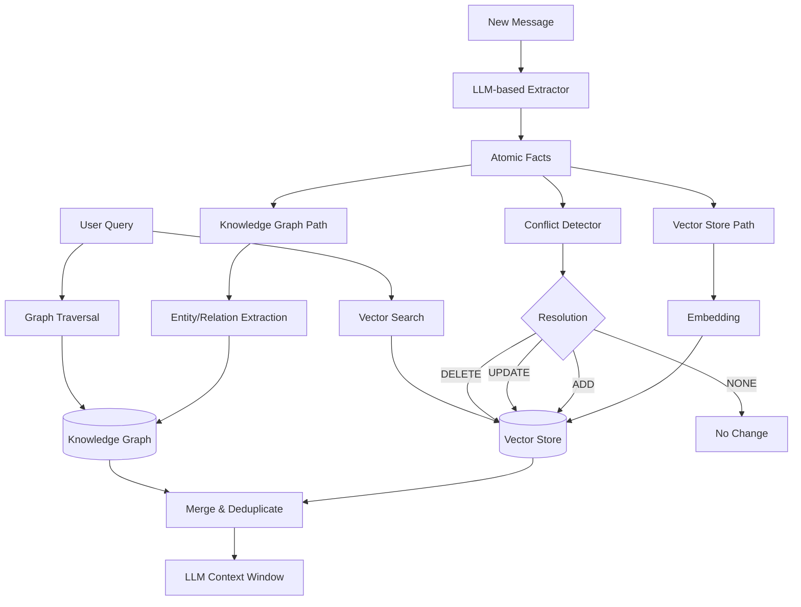

本記事は [Mem0: Building Production-Ready AI Agents with Scalable Long-Term Memory](https://arxiv.org/abs/2504.19413) (Chhikara et al., 2025) の解説記事です。

## 論文概要（Abstract）

Mem0は、AIエージェント・アシスタント向けのスケーラブルなメモリ層である。純粋なベクトル類似度検索やフルコンテキスト方式とは異なり、意味検索と知識グラフを組み合わせたハイブリッドメモリアーキテクチャを採用している。LLM駆動の抽出により会話から原子的事実を蒸留し、矛盾検出・解消を行い、一貫した長期メモリを維持する。LOCOMOベンチマーク（400会話、平均16Kトークン）での評価で、OpenAI Memory比26%高精度、フルコンテキスト比91%高精度を達成し、同時にトークン使用量を91%削減している。

この記事は [Zenn記事: Assistants API Thread廃止に備える自前会話管理層の設計と実装](https://zenn.dev/0h_n0/articles/85d31456c0581d) の深掘りです。

## 情報源

- **arXiv ID**: 2504.19413
- **URL**: https://arxiv.org/abs/2504.19413
- **著者**: Prateek Chhikara, Dev Khant, Saket Aryan, Taranjeet Singh, Deshraj Yadav（Mem0 AI）
- **発表年**: 2025
- **分野**: cs.AI, cs.CL
- **コードリポジトリ**: https://github.com/mem0ai/mem0

## 背景と動機（Background & Motivation）

長期的なパーソナライズが求められるAIエージェントにとって、会話を跨いだメモリ管理は根本的な課題である。著者らは既存のアプローチの限界を以下のように整理している。

**フルコンテキスト方式の問題**: 全会話履歴をプロンプトに含める方式は、(1) コンテキスト長に比例するトークンコストの増大、(2) Liu et al. (2024) が実証した"Lost in the Middle"問題による長コンテキストでの情報想起精度の劣化、(3) 推論品質の低下を引き起こす。

**RAGの問題**: 会話チャンクをベクターDBに保存しクエリ時に取得するRAGは、(1) 関連する事実の統合（synthesis）を行わず断片的な情報を返す、(2) チャンク間の矛盾を検出・解消する機構がない、(3) 時間経過に伴う情報の更新ができない。

**OpenAI Memoryの問題**: OpenAIの組み込みメモリ機能は構造化されたユーザー事実のフラットリストを保持するが、(1) 関係の深さがない平坦な表現、(2) エンティティ間の関連性を表現できない、(3) カスタマイズ性が限定されている。

Mem0はこれらのギャップを埋めるために、ベクトルストアと知識グラフのデュアルバックエンドを採用し、LLM駆動の矛盾解消を組み合わせたハイブリッドアーキテクチャを提案している。

## 主要な貢献（Key Contributions）

- **貢献1**: ベクトルストアと知識グラフの組み合わせによる意味検索と関係推論の両立
- **貢献2**: ADD/UPDATE/DELETE/NONEの4分類による一貫した長期メモリの矛盾解消
- **貢献3**: LOCOMOベンチマーク（400会話・平均16Kトークン）の適応版を用いた包括的評価
- **貢献4**: フルコンテキスト比91%のトークン削減と精度向上の同時達成

## 技術的詳細（Technical Details）

### ハイブリッドメモリアーキテクチャ

Mem0の全体アーキテクチャは以下のとおりである。



### メモリ抽出（Memory Extraction）

会話メッセージを受信すると、LLMベースの抽出器が原子的事実を蒸留する。著者らはこのプロセスを「グラフ対応抽出パイプライン」と呼んでいる。

抽出器のプロンプトには以下の情報が含まれる：
- 会話参加者の役割（user/assistant）
- 既存のメモリ事実一覧
- 現在のメッセージ
- 重複排除のためのメタ指示

出力形式は原子的事実のリストである。

```json
[
  {"memory": "User prefers Python over JavaScript", "event": "ADD"},
  {"memory": "User works at a startup with 50 employees", "event": "ADD"},
  {"memory": "User's preferred IDE is VS Code", "event": "UPDATE"}
]
```

さらに各事実について、知識グラフ用のエンティティ（ノード）と関係（エッジ）を追加抽出する。同一情報がベクトル埋め込みと構造化グラフトリプレットの両方としてインデックスされる。

### 矛盾検出と解消（Conflict Detection & Resolution）

Mem0の中核的な技術要素は、4段階の矛盾解消機構である。

新事実が抽出されると、ベクトルストアからtop-k（著者らの実装ではk=5）の類似既存メモリを検索し、LLMベースの競合リゾルバに渡す。リゾルバは各ペアを以下に分類する。

| 分類 | 意味 | 実行アクション |
|------|------|-------------|
| **ADD** | 新事実は新規情報 | 変更なしで追加 |
| **UPDATE** | 新事実が既存事実を上書き | 既存メモリを置換 |
| **DELETE** | 新事実が既存事実を無効化 | 既存メモリを削除 |
| **NONE** | 矛盾なし | 既存メモリ変更不要 |

この分類により、ユーザーの好みや状況が変化した場合にメモリが自動的に更新される。例えば「Pythonが好き」→「最近Rustに移行した」という会話があった場合、UPDATEが発火し古いメモリが新しい情報で置き換えられる。

### メモリ検索（Memory Retrieval）

クエリ時は両バックエンドから並行検索し結果をマージする。

**ベクトル検索**: クエリを埋め込み、ベクトルストアからtop-k最近傍を取得する。意味的に類似した記憶を広くカバーする。

**グラフ検索**: クエリ内の固有名詞（Named Entity）を抽出し、知識グラフをトラバースする。エンティティ間の関係を辿ることで、直接的な意味類似度では拾えない関連情報を取得できる。

両バックエンドの結果はマージ・重複除去・ランキングされてLLMのコンテキストウィンドウに注入される。

### ストレージスキーマ

ベクトルストア内の各メモリは以下のフィールドを持つ。

```python
@dataclass
class MemoryEntry:
    memory_id: str          # ユニーク識別子
    content: str            # 抽出された事実テキスト
    embedding: list[float]  # 密ベクトル表現
    user_id: str            # ユーザーレベル分離
    conversation_id: str    # ソース会話ID
    created_at: datetime    # 作成タイムスタンプ
    updated_at: datetime    # 更新タイムスタンプ
```

知識グラフでは各エンティティがタイプラベルとプロパティマップを持つノード、各関係が有向型エッジとして表現される。

## 実装のポイント（Implementation）

### スケーラビリティ設計

Mem0はプロダクション環境向けに以下の設計を採用している。

1. **ユーザーレベル分離**: メモリはuser_idでパーティションされ、データプライバシーと効率的なアクセスパターンを確保
2. **非同期処理**: メモリ抽出とグラフ更新は非同期で実行され、メインの推論ループをブロックしない
3. **設定可能バックエンド**: ベクトルストア（Qdrant, Pinecone, Chroma）とグラフストア（Neo4j, Memgraph）を設定で切り替え可能

### 実装例（Python）

```python
from mem0 import Memory

# Mem0の初期化（設定可能なバックエンド）
config = {
    "vector_store": {
        "provider": "qdrant",
        "config": {"collection_name": "memories", "host": "localhost", "port": 6333}
    },
    "graph_store": {
        "provider": "neo4j",
        "config": {"url": "bolt://localhost:7687", "username": "neo4j"}
    },
    "llm": {
        "provider": "openai",
        "config": {"model": "gpt-4o", "temperature": 0}
    }
}

memory = Memory.from_config(config)

# メモリの追加（自動抽出・矛盾解消）
result = memory.add(
    messages=[
        {"role": "user", "content": "I just moved to Tokyo for my new job at a startup"},
        {"role": "assistant", "content": "Congratulations on the move! How's Tokyo?"}
    ],
    user_id="user_123",
)

# メモリの検索（ハイブリッド検索）
results = memory.search(
    query="Where does the user live?",
    user_id="user_123",
)
# → [{"memory": "User lives in Tokyo", "score": 0.95}]
```

## 実験結果（Results）

### LOCOMOベンチマーク

著者らはLOCOMO（Long-Context Model Benchmark）の適応版で評価を実施している。400件の拡張会話（平均16Kトークン）を含み、4種類の質問タイプで評価する。

**論文Table 1より: LOCOMOベンチマーク全体結果**

| System | LLM-as-Judge | BLEU | ROUGE-1 |
|--------|-------------|------|---------|
| Full-Context | 0.3951 | 0.1306 | 0.2817 |
| RAG | 0.5671 | 0.1857 | 0.3215 |
| OpenAI Memory | 0.5981 | 0.1719 | 0.3136 |
| **Mem0** | **0.7534** | **0.2200** | **0.3792** |

Mem0はLLM-as-Judge指標（GPT-4oによる1-10スケール評価）で0.7534を達成し、OpenAI Memory（0.5981）比で約26%、Full-Context（0.3951）比で約91%の改善を示している。

**論文Table 2より: 質問タイプ別のLLM-as-Judgeスコア**

| System | Single-hop | Multi-hop | Temporal | Adversarial |
|--------|-----------|-----------|----------|-------------|
| Full-Context | 0.4442 | 0.3826 | 0.3565 | 0.3969 |
| RAG | 0.5843 | 0.5471 | 0.5628 | 0.5741 |
| OpenAI Memory | 0.5951 | 0.5892 | 0.6095 | 0.6072 |
| **Mem0** | **0.7901** | **0.7312** | **0.7608** | **0.7315** |

特にSingle-hop（OpenAI Memory比+33%）とTemporal（+25%）で顕著な改善がある。Multi-hopの改善はグラフ検索による関係推論が寄与していると著者らは分析している。

**論文Table 3より: トークン効率**

| System | 平均トークン/クエリ |
|--------|-----------------|
| Full-Context | 37,838 |
| RAG | 7,012 |
| OpenAI Memory | 5,219 |
| **Mem0** | **3,425** |

Mem0はクエリあたり平均3,425トークンで動作し、Full-Context比91%のトークン削減を実現している。これはAPI費用の大幅削減を意味する。

### アブレーション研究

**論文Table 4より: 各コンポーネントの寄与**

| Configuration | LLM-as-Judge |
|--------------|-------------|
| Mem0 (full) | 0.7534 |
| w/o knowledge graph | 0.6821 (-9.5%) |
| w/o conflict resolution | 0.6490 (-13.9%) |
| w/o both | 0.5843 (= RAG相当) |

矛盾解消の除去（-13.9%）が知識グラフの除去（-9.5%）より大きな影響を持つ。両方を除去するとRAGベースラインと同等になり、Mem0の性能向上がこの2つのコンポーネントに帰属することを著者らは確認している。

## 実運用への応用（Practical Applications）

Mem0のアーキテクチャはZenn記事で解説されている自前会話管理層と直接的に対応する。

- **Zenn記事のPostgreSQL + conversationsテーブル** → Mem0のVector Store + メタデータストレージに対応
- **Zenn記事のmessagesテーブル（sequence_number付き）** → Mem0のメモリ抽出元の会話ログに対応
- **Zenn記事のプロバイダ抽象化** → Mem0の設定可能バックエンド（provider切り替え）に対応
- **Zenn記事のSlidingWindow + Summarization戦略** → Mem0のLLM駆動抽出 + 矛盾解消に対応（より洗練された実装）

特にMem0の矛盾解消機構は、Zenn記事では明示的に扱われていない「メモリの更新・削除」という重要な課題に対する解決策を提供する。ユーザーの好みや状況が変化した場合に、古い情報を自動的に更新する機構は、本番環境で長期間運用するチャットボットにおいて不可欠である。

## 関連研究（Related Work）

- **MemGPT** (Packer et al., 2023): OS型仮想コンテキスト管理。Mem0と異なりLLM自身がメモリ操作を能動的に判断するのに対し、Mem0はメモリ抽出を自動パイプラインとして実装し、LLMの判断負荷を軽減
- **A-MEM** (Xu et al., 2025): Zettelkasten原理に基づくエージェント型メモリネットワーク。ノート間のリンクで知識を組織化する点はMem0の知識グラフに類似するが、矛盾解消機構を持たない
- **GraphRAG** (Edge et al., 2024): 知識グラフベースの検索。Mem0がメモリの動的更新（ADD/UPDATE/DELETE）を行うのに対し、GraphRAGは静的なグラフ構築に留まる

## まとめと今後の展望

Mem0は「ベクトル検索 + 知識グラフ + 矛盾解消」の3要素を組み合わせたハイブリッドメモリ層として、LOCOMOベンチマークでOpenAI Memory比26%、Full-Context比91%の精度改善と91%のトークン削減を同時に達成している。

自前会話管理層を構築する際の実務への示唆として、(1) 生のメッセージをそのまま保存するのではなくLLMで原子的事実に蒸留すること、(2) ベクトル検索だけでなく構造化された関係推論を組み合わせること、(3) 時間経過に伴うメモリの矛盾を自動解消する機構を組み込むことが、Mem0の成功要因として挙げられる。

## Production Deployment Guide

### AWS実装パターン（コスト最適化重視）

Mem0のハイブリッドメモリ層をAWSにデプロイする場合の構成を示す。

**トラフィック量別の推奨構成**:

| 規模 | 月間リクエスト | 推奨構成 | 月額コスト | 主要サービス |
|------|--------------|---------|-----------|------------|
| **Small** | ~3,000 (100/日) | Serverless | $100-250 | Lambda + Bedrock + OpenSearch Serverless + Neptune Serverless |
| **Medium** | ~30,000 (1,000/日) | Hybrid | $500-1,200 | ECS Fargate + OpenSearch + Neptune |
| **Large** | 300,000+ (10,000/日) | Container | $3,000-7,000 | EKS + OpenSearch + Neptune + ElastiCache |

**Small構成の詳細** (月額$100-250):
- **Lambda**: 1GB RAM, 90秒タイムアウト（抽出+矛盾解消に対応）($30/月)
- **Bedrock**: Claude 3.5 Haiku（メモリ抽出・矛盾解消用）($80/月)
- **OpenSearch Serverless**: ベクトル検索バックエンド ($50/月)
- **Neptune Serverless**: 知識グラフストレージ ($40/月)
- **DynamoDB**: メタデータ・セッション管理 ($10/月)

**コスト削減テクニック**:
- メモリ抽出の非同期バッチ処理でLLM呼び出し回数を削減
- 矛盾解消のtop-k検索を5に制限しLLM呼び出しを最小化
- OpenSearch Serverlessの自動スケーリングで低トラフィック時のコスト削減
- 頻繁にアクセスされるメモリのElastiCacheキャッシュ

**コスト試算の注意事項**:
- 上記は2026年5月時点のAWS ap-northeast-1（東京）リージョン料金に基づく概算値
- Mem0はメモリ抽出と矛盾解消にLLM呼び出しを行うため、通常のRAGより費用が高い
- 最新料金は [AWS料金計算ツール](https://calculator.aws/) で確認推奨

### Terraformインフラコード

**Small構成 (Serverless): Lambda + Bedrock + OpenSearch Serverless + Neptune**

```hcl
module "vpc" {
  source  = "terraform-aws-modules/vpc/aws"
  version = "~> 5.0"

  name = "mem0-vpc"
  cidr = "10.0.0.0/16"
  azs  = ["ap-northeast-1a", "ap-northeast-1c"]
  private_subnets = ["10.0.1.0/24", "10.0.2.0/24"]

  enable_nat_gateway   = true
  single_nat_gateway   = true
  enable_dns_hostnames = true
}

resource "aws_iam_role" "lambda_mem0" {
  name = "lambda-mem0-role"
  assume_role_policy = jsonencode({
    Version = "2012-10-17"
    Statement = [{
      Action = "sts:AssumeRole"
      Effect = "Allow"
      Principal = { Service = "lambda.amazonaws.com" }
    }]
  })
}

resource "aws_iam_role_policy" "mem0_services" {
  role = aws_iam_role.lambda_mem0.id
  policy = jsonencode({
    Version = "2012-10-17"
    Statement = [
      {
        Effect   = "Allow"
        Action   = ["bedrock:InvokeModel"]
        Resource = "arn:aws:bedrock:ap-northeast-1::foundation-model/anthropic.claude-3-5-haiku*"
      },
      {
        Effect   = "Allow"
        Action   = ["aoss:APIAccessAll"]
        Resource = "*"
      },
      {
        Effect   = "Allow"
        Action   = ["neptune-db:*"]
        Resource = "arn:aws:neptune-db:ap-northeast-1:*:*/database"
      }
    ]
  })
}

resource "aws_lambda_function" "mem0_handler" {
  filename      = "lambda.zip"
  function_name = "mem0-memory-handler"
  role          = aws_iam_role.lambda_mem0.arn
  handler       = "index.handler"
  runtime       = "python3.12"
  timeout       = 90
  memory_size   = 1024

  vpc_config {
    subnet_ids         = module.vpc.private_subnets
    security_group_ids = [aws_security_group.lambda.id]
  }

  environment {
    variables = {
      BEDROCK_MODEL_ID      = "anthropic.claude-3-5-haiku-20241022-v1:0"
      OPENSEARCH_ENDPOINT   = aws_opensearchserverless_collection.vectors.collection_endpoint
      NEPTUNE_ENDPOINT      = aws_neptune_cluster.graph.endpoint
      CONFLICT_TOP_K        = "5"
      ASYNC_EXTRACTION      = "true"
    }
  }
}

resource "aws_security_group" "lambda" {
  vpc_id = module.vpc.vpc_id
  egress {
    from_port   = 0
    to_port     = 0
    protocol    = "-1"
    cidr_blocks = ["0.0.0.0/0"]
  }
}

resource "aws_opensearchserverless_collection" "vectors" {
  name = "mem0-vectors"
  type = "VECTORSEARCH"
}

resource "aws_cloudwatch_metric_alarm" "mem0_cost" {
  alarm_name          = "mem0-extraction-cost-spike"
  comparison_operator = "GreaterThanThreshold"
  evaluation_periods  = 1
  metric_name         = "Invocations"
  namespace           = "AWS/Lambda"
  period              = 3600
  statistic           = "Sum"
  threshold           = 500
  alarm_description   = "Mem0 extraction invocations spike (cost alert)"
}
```

### セキュリティベストプラクティス

- ユーザーメモリのパーティション分離（user_id単位のアクセス制御）
- Neptune: VPC内配置、IAM認証有効化
- OpenSearch Serverless: データアクセスポリシーでコレクション単位のアクセス制御
- KMS暗号化: OpenSearch・Neptune・DynamoDB全て有効化
- Lambda: VPC内配置、最小権限IAMロール

### コスト最適化チェックリスト

- [ ] メモリ抽出の非同期バッチ処理（リアルタイム不要な場合）
- [ ] 矛盾解消top-k=5に制限（LLM呼び出し最小化）
- [ ] OpenSearch Serverless: 低トラフィック時の自動スケールダウン
- [ ] Neptune Serverless: 最小キャパシティ設定（1 NCU）
- [ ] Bedrock Batch API: 非リアルタイムのメモリ整理に50%割引適用
- [ ] Prompt Caching: 抽出プロンプトテンプレートのキャッシュ
- [ ] DynamoDB TTL: 期限切れメタデータの自動削除
- [ ] AWS Budgets: 月額予算80%で警告
- [ ] Cost Anomaly Detection: 有効化

## 参考文献

- **arXiv**: https://arxiv.org/abs/2504.19413
- **Code**: https://github.com/mem0ai/mem0
- **Related Zenn article**: https://zenn.dev/0h_n0/articles/85d31456c0581d
