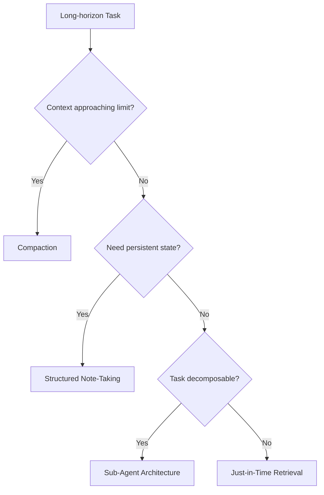

本記事は [Effective context engineering for AI agents](https://www.anthropic.com/engineering/effective-context-engineering-for-ai-agents)（Anthropic Applied AI team, 2025年9月）の解説記事です。

## ブログ概要（Summary）

Anthropicの応用AIチームが発表した本ブログポストは、「コンテキストエンジニアリング」という概念を体系化した実践ガイドである。プロンプトエンジニアリング（初期プロンプトの最適化）から一歩進み、推論時のトークンエコシステム全体——システムプロンプト、ツール定義、MCP（Model Context Protocol）データ、外部情報、メッセージ履歴——を最適化する規律として定義している。長時間稼働するエージェントが数百ターンにわたり一貫した行動を維持するための具体的な設計パターンとして、コンパクション（圧縮）、構造化ノートテイキング、サブエージェント分離、Just-in-Time検索の4戦略を詳述している。

この記事は [Zenn記事: Assistants API Thread廃止に備える自前会話管理層の設計と実装](https://zenn.dev/0h_n0/articles/85d31456c0581d) の深掘りです。

## 情報源

- **種別**: 企業テックブログ
- **URL**: https://www.anthropic.com/engineering/effective-context-engineering-for-ai-agents
- **組織**: Anthropic Applied AI team（Prithvi Rajasekaran, Ethan Dixon, Carly Ryan, Jeremy Hadfield）
- **発表日**: 2025年9月29日

## 技術的背景（Technical Background）

### プロンプトエンジニアリングからコンテキストエンジニアリングへ

従来のプロンプトエンジニアリングは「最初のシステムプロンプトをどう書くか」に焦点を当てていた。しかし、数百ターンを超えるエージェント対話では、初期プロンプトの品質だけでは一貫した行動を維持できない。

Anthropicのチームはコンテキストエンジニアリングを以下のように定義している。

> コンテキストエンジニアリングとは、LLMの固有制約に対してトークンの有用性を最適化する規律である。「どのようなコンテキスト構成が望ましい行動を生成する確率を最大化するか」という問いに答えるものである。

ここで管理対象となるのは以下のすべてである。

- システムプロンプト（行動規則・ペルソナ）
- ツール定義（function calling仕様）
- MCPデータ（Model Context Protocolで取得した外部情報）
- メッセージ履歴（過去の会話ターン）
- 外部検索結果（RAG出力）

### Context Rot（コンテキスト腐敗）問題

ブログで最も重要な技術的知見として「Context Rot」の概念が提示されている。これは、コンテキストウィンドウ内のトークン数が増加するにつれて、モデルの情報想起精度が劣化する現象である。

著者らによると、これはTransformerアーキテクチャに起因する。$n$トークンのコンテキストでは$n^2$のペアワイズアテンション関係が生じ、関連情報への注意が希薄化する。これはハードクリフ（閾値での崩壊）ではなく、パフォーマンス勾配として現れる。

$$
\text{Recall}(n) \propto \frac{1}{n^{\alpha}}, \quad \alpha > 0
$$

上記は筆者の解釈に基づく定式化であり、論文中の具体的な数式ではない。重要なのは、コンテキスト長が長くなるほど、中間部に配置された情報の想起精度が低下するという実験的知見（"Lost in the Middle"問題、Liu et al., 2024）である。

### アテンション予算の概念

著者らは「アテンション予算（Attention Budget）」という概念を導入している。LLMは有限の注意資源（人間のワーキングメモリ容量に相当）を持ち、追加されるトークンごとにこの予算が消費される。したがって、コンテキストに含めるトークンは厳密にキュレーションする必要がある。

## 実装アーキテクチャ（Architecture）

### 4つの長期タスク管理戦略

ブログでは長時間稼働するエージェントのための4つのコンテキスト管理戦略を提示している。



### 戦略1: コンパクション（Compaction）

コンテキストが上限に近づいたとき、会話履歴を要約し不要な詳細を破棄する戦略である。著者らは段階的アプローチを推奨している。

**レベル1: ツール結果クリアリング（最軽量）**

ツール呼び出しの結果（コード実行出力、検索結果等）を、ツール使用後に短い要約で置換する。これは情報損失が最小限でありながら、大幅なトークン削減を実現する。

**レベル2: 会話要約コンパクション**

古いメッセージを要約に置換する。ただし、以下の情報は保持すべきであると著者らは強調している。

- アーキテクチャ上の意思決定事項
- 未解決の課題・ブロッカー
- ユーザーの明示的な指示・制約

**実装上のガイダンス**: 著者らは「最初はRecallを優先し（情報を多く残す）、次にPrecision（不要な情報を削る）を改善する」というアプローチを推奨している。

### 戦略2: 構造化ノートテイキング

エージェントが外部メモリ（ファイル等）に進捗ノートを維持する戦略である。Claude Codeの実装では、エージェントがTODOリストをNOTES.mdファイルとして作成・更新する。

ブログで引用されているClaude Pokémon実験では、数千ゲームステップにわたるタスクの正確な状態追跡がこの機構により実現されている。

**Zenn記事との対応**: Zenn記事で解説されているPostgreSQLへのメッセージ永続化とRedisキャッシュは、この構造化ノートテイキングの実装パターンの一つと位置付けられる。データベースが「ノート」の永続ストレージとして機能し、Redisが「アクティブノート」のキャッシュとして機能する。

### 戦略3: サブエージェントアーキテクチャ

複雑なタスクを専門エージェントに分割し、各エージェントがクリーンなコンテキストウィンドウで処理する設計である。

著者らによると、サブエージェントは「数万トークンを消費して」集中的な作業を行い、結果を1,000-2,000トークンの凝縮サマリーとして親エージェントに返す。これにより親エージェントのコンテキストが詳細な検索結果で汚染されることを防ぐ。

**コスト効率の含意**: 各サブエージェントは独立したコンテキストウィンドウを持つため、LLM呼び出し回数は増加する。しかし、各呼び出しのコンテキストサイズは小さいため、総トークン使用量は単一エージェントで全情報を保持する場合より少なくなる場合がある。

### 戦略4: Just-in-Time検索

事前にすべてのデータをコンテキストにロードするのではなく、軽量な識別子（ファイルパス、クエリ、URL）をメモリに保持し、必要時にツール呼び出しで動的にデータをロードする戦略である。

Claude Codeの実装では、エージェントはターゲットを特定するクエリを作成し、Bashコマンド（head, tail, grep等）で必要な部分のみを分析する。フルファイルの内容をコンテキストにロードせず、必要最小限のデータのみを取得する。

## パフォーマンス最適化（Performance）

### 定量的効果

ブログ中で言及されている定量的効果は以下のとおりである。

| 戦略 | トークン削減効果 | 適用条件 |
|------|---------------|---------|
| ツール結果クリアリング | 中〜高（ツール出力サイズに依存） | ツール呼び出しが頻繁なエージェント |
| 構造化ノートテイキング | 高（1,000-2,000トークンに圧縮） | 数千ステップの長期タスク |
| サブエージェント | 高（結果のみ返却） | タスクが分解可能な場合 |
| Just-in-Time検索 | 非常に高 | データが大きく部分参照で十分な場合 |

Anthropicのコンテキスト管理機能（パブリックベータ）では、**100ターン評価でコンテキスト編集によりトークン消費量を84%削減**したと別のブログ記事（[Managing Context on the Claude Developer Platform](https://www.anthropic.com/news/context-management)）で報告されている。

### システムプロンプト設計の原則

著者らは「適切な抽象度（Right Altitude）」を達成することを強調している。

- **高すぎる抽象度**: 「ユーザーを助けてください」→ 具体的行動を生成できない
- **低すぎる抽象度**: すべてのエッジケースを列挙 → コンテキストを圧迫し、汎化能力を阻害
- **適切な抽象度**: 行動指針として十分具体的であり、かつ柔軟なヒューリスティックとして機能する

組織にはXMLタグ（`<background_information>`、`<instructions>`等）またはMarkdownヘッダーを使用した明確なセクション分けを推奨している。

## 運用での学び（Production Lessons）

### ツール設計のベストプラクティス

著者らが本番運用から得た知見として、以下のツール設計原則が示されている。

1. **機能重複の最小化**: 類似ツールが複数あるとモデルの選択精度が低下する
2. **一義的な利用判断**: ツールをいつ使うべきかが曖昧だとエージェントが誤った判断をする
3. **トークン効率の高い返却値**: ツール結果が冗長だとコンテキストを圧迫する
4. **明確な入力パラメータ記述**: パラメータの意味と期待値を具体的に記述する
5. **ツールセットの肥大化回避**: ツール数が増えるほど判断の曖昧さが増す

### Few-Shotプロンプティング戦略

すべてのエッジケースをドキュメント化するのではなく、「期待される行動を効果的に描写する多様で標準的な例」をキュレーションすることを推奨している。著者らの言葉を借りれば、「例は千の言葉に値する画像である」。

### モデル進化への適応

著者らは重要な洞察として、モデルの能力が向上するにつれて「規範的なエンジニアリングを減らし、より大きな自律性を許可する」方向に設計を進化させるべきと述べている。過度に制約的なプロンプトは、より高性能なモデルの能力を活かしきれない。

## 学術研究との関連（Academic Connection）

本ブログポストは以下の学術研究を基盤としている。

- **Transformer原論文** (Vaswani et al., 2017, arXiv:1706.03762): アテンション機構の$O(n^2)$計算量がContext Rotの根本原因
- **Position Encoding Interpolation** (Chen et al., 2023, arXiv:2306.15595): コンテキスト長拡張の手法。ブログでは拡張だけでは解決しないことを指摘
- **Lost in the Middle** (Liu et al., 2024, arXiv:2307.09288): 長コンテキストでの情報想起の位置依存性を実証した研究
- **Human Working Memory** (Cowan, 2001): 人間のワーキングメモリ容量7±2の制約。アテンション予算の類推元

ブログの独自の貢献は、これらの学術的知見を「本番環境のエージェント設計」に翻訳した点にある。学術論文がベンチマーク上の性能改善を追求するのに対し、本ブログはコスト・レイテンシ・信頼性のバランスが求められる実運用環境での設計指針を提供している。

## まとめと実践への示唆

Anthropicのコンテキストエンジニアリングガイドは、Zenn記事で解説されている「自前会話管理層」の設計判断に直接的な示唆を与える。

- **Sliding Window戦略** = コンパクション戦略のレベル2に相当
- **要約ベースのメモリ** = コンパクション + 構造化ノートテイキングの組み合わせ
- **プロバイダ抽象化レイヤー** = サブエージェントアーキテクチャで各プロバイダを分離するパターン

最も重要な実践的教訓は「コンテキストは貴重で有限なリソースである」という原則である。自前会話管理層を構築する際は、何をコンテキストに含め何を外部に退避するかの判断ロジックが、システム全体の品質を決定する。

## Production Deployment Guide

### AWS実装パターン（コスト最適化重視）

コンテキストエンジニアリングの4戦略をAWS上で実装する場合の構成を示す。

**トラフィック量別の推奨構成**:

| 規模 | 月間リクエスト | 推奨構成 | 月額コスト | 主要サービス |
|------|--------------|---------|-----------|------------|
| **Small** | ~3,000 (100/日) | Serverless | $60-180 | Lambda + Bedrock + S3 |
| **Medium** | ~30,000 (1,000/日) | Hybrid | $350-900 | Lambda + ECS Fargate + ElastiCache |
| **Large** | 300,000+ (10,000/日) | Container | $2,000-5,000 | EKS + Karpenter + EC2 Spot |

**Small構成の詳細** (月額$60-180):
- **Lambda**: 512MB RAM, 30秒タイムアウト ($15/月)
- **Bedrock**: Claude 3.5 Haiku + Prompt Caching ($80/月)
- **S3**: 構造化ノート保存 ($5/月)
- **DynamoDB**: 会話状態・コンパクション結果保存 ($10/月)
- **CloudWatch**: 基本監視 ($5/月)

**コスト削減テクニック**:
- Prompt Caching: システムプロンプト+ツール定義のキャッシュで30-90%削減
- ツール結果クリアリング: 不要なツール出力を除去しコンテキストサイズ削減
- サブエージェント分離: 各サブエージェントの小さなコンテキストで個別課金を最適化
- S3 Intelligent-Tiering: 構造化ノートの自動階層化

**コスト試算の注意事項**:
- 上記は2026年5月時点のAWS ap-northeast-1（東京）リージョン料金に基づく概算値
- コンパクション処理自体にもLLM呼び出しが必要（追加コスト要考慮）
- 最新料金は [AWS料金計算ツール](https://calculator.aws/) で確認推奨

### Terraformインフラコード

**Small構成 (Serverless): Lambda + Bedrock + S3 + DynamoDB**

```hcl
module "vpc" {
  source  = "terraform-aws-modules/vpc/aws"
  version = "~> 5.0"

  name = "context-eng-vpc"
  cidr = "10.0.0.0/16"
  azs  = ["ap-northeast-1a", "ap-northeast-1c"]
  private_subnets = ["10.0.1.0/24", "10.0.2.0/24"]

  enable_nat_gateway   = false
  enable_dns_hostnames = true
}

resource "aws_iam_role" "lambda_context" {
  name = "lambda-context-engineering-role"
  assume_role_policy = jsonencode({
    Version = "2012-10-17"
    Statement = [{
      Action = "sts:AssumeRole"
      Effect = "Allow"
      Principal = { Service = "lambda.amazonaws.com" }
    }]
  })
}

resource "aws_iam_role_policy" "bedrock_s3" {
  role = aws_iam_role.lambda_context.id
  policy = jsonencode({
    Version = "2012-10-17"
    Statement = [
      {
        Effect   = "Allow"
        Action   = ["bedrock:InvokeModel"]
        Resource = "arn:aws:bedrock:ap-northeast-1::foundation-model/anthropic.claude-*"
      },
      {
        Effect   = "Allow"
        Action   = ["s3:GetObject", "s3:PutObject"]
        Resource = "${aws_s3_bucket.notes.arn}/*"
      }
    ]
  })
}

resource "aws_s3_bucket" "notes" {
  bucket = "context-eng-structured-notes"
}

resource "aws_s3_bucket_lifecycle_configuration" "notes_lifecycle" {
  bucket = aws_s3_bucket.notes.id
  rule {
    id     = "archive-old-notes"
    status = "Enabled"
    transition {
      days          = 30
      storage_class = "INTELLIGENT_TIERING"
    }
  }
}

resource "aws_lambda_function" "context_manager" {
  filename      = "lambda.zip"
  function_name = "context-engineering-manager"
  role          = aws_iam_role.lambda_context.arn
  handler       = "index.handler"
  runtime       = "python3.12"
  timeout       = 60
  memory_size   = 512

  environment {
    variables = {
      BEDROCK_MODEL_ID   = "anthropic.claude-3-5-haiku-20241022-v1:0"
      NOTES_BUCKET       = aws_s3_bucket.notes.id
      DYNAMODB_TABLE     = aws_dynamodb_table.state.name
      COMPACTION_THRESHOLD = "80000"
    }
  }
}

resource "aws_dynamodb_table" "state" {
  name         = "context-conversation-state"
  billing_mode = "PAY_PER_REQUEST"
  hash_key     = "conversation_id"

  attribute {
    name = "conversation_id"
    type = "S"
  }

  ttl {
    attribute_name = "expire_at"
    enabled        = true
  }
}
```

### セキュリティベストプラクティス

- IAMロール: Bedrockモデル呼び出しを特定モデルファミリーに制限
- S3: バケットポリシーでパブリックアクセス完全遮断、KMS暗号化有効
- DynamoDB: 保管時暗号化（AES-256）有効化
- Lambda: VPC内配置推奨（外部API呼び出し時はNAT Gateway経由）
- CloudTrail: 全API呼び出しの監査ログ

### 運用・監視設定

**CloudWatch Logs Insights クエリ**:

```sql
fields @timestamp, conversation_id, context_tokens, compaction_triggered
| filter compaction_triggered = true
| stats count() as compactions, avg(context_tokens) as avg_tokens_at_compaction by bin(1h)
```

**コスト最適化チェックリスト**:

- [ ] Prompt Caching: システムプロンプト+ツール定義をキャッシュ（30-90%削減）
- [ ] ツール結果クリアリング: 不要出力の自動除去
- [ ] コンパクション閾値: コンテキストの80%到達で自動コンパクション
- [ ] サブエージェント分離: 重い検索はサブエージェントに委譲
- [ ] S3 Intelligent-Tiering: 古いノートの自動階層化
- [ ] DynamoDB TTL: 期限切れ会話の自動削除
- [ ] AWS Budgets: 月額予算80%で警告アラート
- [ ] CloudWatch: コンパクション頻度の異常検知
- [ ] Cost Anomaly Detection: 機械学習ベース異常検知

## 参考文献

- **Blog URL**: https://www.anthropic.com/engineering/effective-context-engineering-for-ai-agents
- **Related**: https://www.anthropic.com/news/context-management（コンテキスト管理機能）
- **Related Papers**: arXiv:1706.03762（Transformer）、arXiv:2307.09288（Lost in the Middle）
- **Related Zenn article**: https://zenn.dev/0h_n0/articles/85d31456c0581d
