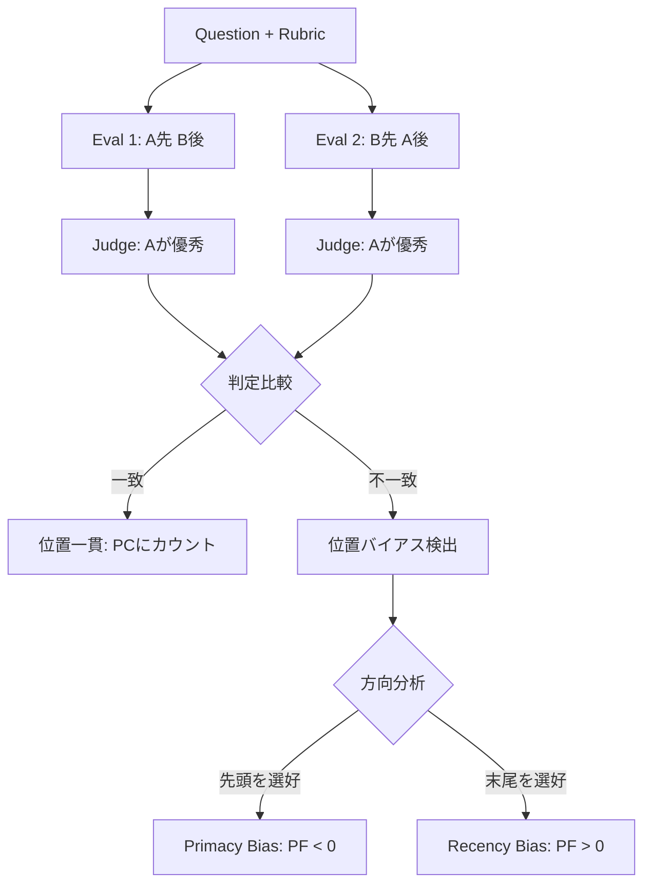
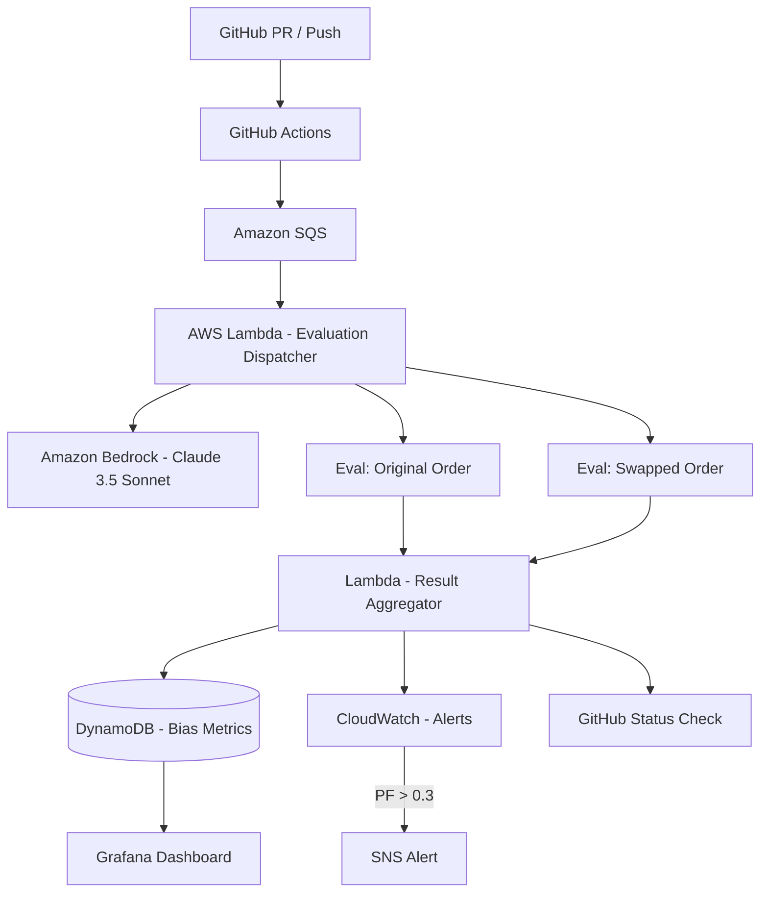

本記事は [Judging the Judges: A Systematic Study of Position Bias in Pairwise Evaluation with LLM-as-a-Judge](https://arxiv.org/abs/2406.07791) (Shi et al., 2024) の解説記事です。

この記事は [Zenn記事: LangSmithで本番エージェント障害を分析しCI/CDテストを自動化する](https://zenn.dev/0h_n0/articles/388cece782e5b6) の深掘りです。LLM-as-JudgeをCI/CDパイプラインに組み込む際に、ポジションバイアスがどの程度品質ゲートの信頼性を損なうかを理解するための基礎研究として位置づけられる。

## 論文概要（Abstract）

LLM-as-a-Judgeは、人間評価の代替として多様なタスクで活用が進んでいる。しかし、プロンプト内でのソリューションの提示順序に依存して評価が変わるポジションバイアスが、その信頼性を損なっている。著者らは、ペアワイズおよびリストワイズ比較設定において、ポジションバイアスを測定する3つの指標（反復安定性、位置一貫性、選好公平性）を導入し、15種のLLMジャッジを用いてMTBenchとDevBenchの22タスク・約40モデルにわたる15万件以上の評価インスタンスで実験を行った。その結果、ポジションバイアスはランダムな変動ではなく体系的な傾向であり、ジャッジやタスクによって大きく異なること、品質差に強く影響されることが明らかにされた。

## 情報源

- **arXiv ID**: 2406.07791
- **URL**: [https://arxiv.org/abs/2406.07791](https://arxiv.org/abs/2406.07791)
- **著者**: Lin Shi, Chiyu Ma, Wenhua Liang, Xingjian Diao, Weicheng Ma, Soroush Vosoughi（Dartmouth College）
- **発表**: AACL-IJCNLP 2025（ACL系列カンファレンス）
- **初回投稿**: 2024年6月12日（v9: 2025年11月11日）
- **分野**: cs.CL, cs.AI

## 背景と動機（Background & Motivation）

LLM-as-a-Judgeは、GPT-4やClaude-3などの大規模言語モデルに対して、2つ以上のモデル出力を比較させ、どちらが優れているかを判定させる評価手法である。人間評価のコスト（時間・費用・スケーラビリティ）を回避でき、MTBench (Zheng et al., 2024) やChatbot Arena (Chiang et al., 2024) など広く普及している。

しかし、この評価手法には本質的な問題がある。プロンプト内でソリューションAを先に、ソリューションBを後に配置した場合と、その逆の場合で、ジャッジの判定が変わることがある。これがポジションバイアスである。

CI/CDパイプラインにLLM-as-Judgeを品質ゲートとして組み込む場合（Zenn記事で解説したLangSmithの評価機能など）、ポジションバイアスは偽陽性（順序の偶然で合格）、偽陰性（順序のために不合格）、非再現性（実行ごとに判定が変わる）のリスクをもたらす。従来研究ではポジションバイアスの存在は報告されていたが、定量的な指標は提案されていなかった。

## 主要な貢献（Key Contributions）

- **貢献1**: ポジションバイアスを定量化する3つの指標（反復安定性・位置一貫性・選好公平性）の提案
- **貢献2**: 15種のLLMジャッジ（GPT系・Claude系・Gemini系・Llama系）を対象とした大規模実験
- **貢献3**: MTBenchとDevBenchの22タスクにわたる15万件以上の評価インスタンスの分析
- **貢献4**: ポジションバイアスの主要因が品質差（quality gap）にあることの発見
- **貢献5**: Swap augmentationによるバイアス緩和手法の有効性の実証

## 技術的詳細（Technical Details）

### 3つの評価指標

著者らは、ポジションバイアスを多角的に捉えるために3つの指標を導入した。

#### 反復安定性（Repetition Stability, RS）

同一の入力に対して複数回評価を行ったとき、判定がどの程度一致するかを測定する。

$$
RS = \frac{1}{N} \sum_{j=1}^{N} \frac{1}{n_j} \max_k |C_k^j|
$$

ここで、$N$ は評価対象のインスタンス数、$n_j$ はインスタンス$j$に対する繰り返し試行回数、$C_k^j$ はインスタンス$j$で候補$k$が選ばれた回数の集合である。RSは0から1の範囲をとり、1.0はすべての試行で同一の判定が得られることを意味する。RSが低い場合、判定のばらつきはランダムな変動であり、ポジションバイアスとは別の問題であることを示唆する。

#### 位置一貫性（Position Consistency, PC）

ソリューションの提示順序を入れ替えても、同じ勝者を選択するかどうかを測定する。

$$
PC = \frac{1}{n} \sum_{j=1}^{n} \mathbb{1}\{(C_1^j, \ldots, C_p^j) \in V\}
$$

ここで、$n$ は評価ペア数、$p$ は候補数（ペアワイズでは$p=2$）、$V$ は位置入れ替え後も一貫した判定が得られるパターンの集合である。PCが1.0であれば、順序に関係なく常に同じ勝者を選んでおり、ポジションバイアスがない。PCが0.5に近い場合、順序の入れ替えで判定が反転する割合が高い。

#### 選好公平性（Preference Fairness, PF）

バイアスの方向性（先頭を好むprimacy biasか、末尾を好むrecency biasか）を定量化する。

$$
PF_{raw} = rcn \times irr - pcn \times ipr
$$

$$
PF = \frac{PF_{raw} - S_{min}^{-}}{S_{max}^{+} - S_{min}^{-}} \times 2 - 1
$$

各変数の定義は以下のとおりである。

- $pcn$（primacy count normalized）: 位置不一致ペアのうち、先頭のソリューションを選好した割合
- $rcn$（recency count normalized）: 位置不一致ペアのうち、末尾のソリューションを選好した割合
- $ipr$（inconsistent primacy rate）: 位置不一致ペアにおける先頭選好の比率
- $irr$（inconsistent recency rate）: 位置不一致ペアにおける末尾選好の比率（$ipr + irr = 1$）

PFは$-1$から$+1$の範囲をとり、$-1$は完全なprimacy bias、$0$は公平、$+1$は完全なrecency biasを示す。

### 品質差（Quality Gap）

著者らは、2つのソリューション間の品質差がポジションバイアスに与える影響を分析するために、品質差$\delta_q$を以下のように定義した。

$$
\delta_q = \left| owr - \frac{1}{p} \right|
$$

$$
owr = \frac{1}{n} \left[ C_w + \frac{1}{p}(C_t + C_I) \right]
$$

ここで、$owr$（overall win rate）は全体勝率、$C_w$ は一貫した勝利数、$C_t$ はタイ判定数、$C_I$ は不一致判定数、$p$ は候補数である。$\delta_q$が大きいほど2つのソリューション間に明確な品質差があることを意味する。

### 評価プロトコル: Swap Augmentation

ポジションバイアスを測定するための核となる手法が、position swapping（スワップ拡張）である。



**ペアワイズ比較の場合**: ソリューションAとBの2つを提示し、まず「A, B」の順序で評価させ、次に「B, A」の順序で評価させる。両方で同じ勝者を選べば位置一貫性がある。

**リストワイズ比較の場合**: $p$個の候補に対して$p$通りの順列を生成し、各候補がすべての位置に正確に1回ずつ出現するようにする。すべての順列で同一の順位を返せば位置一貫性がある。

### Swap Augmentationの実装

以下は、ペアワイズ評価におけるswap augmentationの実装例である。

```python
from dataclasses import dataclass
from enum import Enum
from typing import Any


class Winner(Enum):
    SOLUTION_A = "A"
    SOLUTION_B = "B"
    TIE = "tie"


@dataclass(frozen=True)
class SwapAugmentedResult:
    """Swap augmentation後の統合結果."""
    original_winner: Winner
    swapped_winner: Winner  # 元の座標系にマッピング済み
    is_position_consistent: bool
    bias_direction: str | None  # "primacy", "recency", or None


def run_swap_augmented_eval(
    judge_fn: Any,
    question: str,
    solution_a: str,
    solution_b: str,
    rubric: str,
) -> SwapAugmentedResult:
    """Swap augmentationを適用したペアワイズ評価を実行する.

    Args:
        judge_fn: LLMジャッジ関数 (question, first, second, rubric) -> Winner
        question: 評価対象の質問
        solution_a: ソリューションA
        solution_b: ソリューションB
        rubric: 評価基準
    """
    original = judge_fn(question, solution_a, solution_b, rubric)
    swapped_raw = judge_fn(question, solution_b, solution_a, rubric)

    # スワップ結果を元の座標系に変換
    swapped_mapped = {
        Winner.SOLUTION_A: Winner.SOLUTION_B,
        Winner.SOLUTION_B: Winner.SOLUTION_A,
        Winner.TIE: Winner.TIE,
    }[swapped_raw]

    is_consistent = original == swapped_mapped
    bias_direction = None
    if not is_consistent and original != Winner.TIE and swapped_raw != Winner.TIE:
        if original == Winner.SOLUTION_A and swapped_raw == Winner.SOLUTION_A:
            bias_direction = "primacy"  # 両方とも先頭を選択
        elif original == Winner.SOLUTION_B and swapped_raw == Winner.SOLUTION_B:
            bias_direction = "recency"  # 両方とも末尾を選択

    return SwapAugmentedResult(
        original_winner=original,
        swapped_winner=swapped_mapped,
        is_position_consistent=is_consistent,
        bias_direction=bias_direction,
    )
```

### バイアス指標の算出

```python
from collections import Counter
from dataclasses import dataclass


@dataclass(frozen=True)
class BiasMetrics:
    """ポジションバイアスの3指標."""
    repetition_stability: float
    position_consistency: float
    preference_fairness: float  # -1 (primacy) to +1 (recency)


def compute_bias_metrics(results: list[SwapAugmentedResult]) -> BiasMetrics:
    """Swap augmentation結果群からバイアス指標を算出する."""
    n = len(results)
    if n == 0:
        raise ValueError("results must not be empty")

    consistent_count = sum(1 for r in results if r.is_position_consistent)
    pc = consistent_count / n

    inconsistent = [r for r in results if not r.is_position_consistent]
    if not inconsistent:
        pf = 0.0
    else:
        counts = Counter(r.bias_direction for r in inconsistent)
        primacy, recency = counts.get("primacy", 0), counts.get("recency", 0)
        total = primacy + recency
        pf = (recency - primacy) / total if total > 0 else 0.0

    return BiasMetrics(
        repetition_stability=pc,  # swap 2回ではPCと同値
        position_consistency=pc,
        preference_fairness=pf,
    )
```

## Production Deployment Guide

### アーキテクチャ概要

ポジションバイアスを緩和したLLM-as-Judge評価をCI/CDパイプラインに組み込むための本番デプロイメント構成を示す。本論文の知見を踏まえ、swap augmentationの適用とバイアス指標のモニタリングを中心に設計する。

### AWS構成



### Step 1: 評価ディスパッチャー（Lambda）

CI/CDトリガーからSQSメッセージを受け取り、swap augmentationの2回分の評価をBedrock APIに並列発行する。

```python
import json
from typing import Any

import boto3

bedrock = boto3.client("bedrock-runtime", region_name="ap-northeast-1")


def dispatch_swap_evaluation(
    question: str,
    solution_a: str,
    solution_b: str,
    model_id: str = "anthropic.claude-sonnet-4-20250514-v1:0",
) -> dict[str, Any]:
    """Swap augmentation用の2回評価を並列ディスパッチする."""
    prompt_tpl = (
        "質問に対する2つの回答を比較し判定してください。\n\n"
        "質問: {question}\n回答1:\n{first}\n回答2:\n{second}\n"
        'JSON: {{"winner": "1"|"2"|"tie", "reasoning": "..."}}'
    )
    original = _invoke_bedrock(model_id, prompt_tpl.format(
        question=question, first=solution_a, second=solution_b))
    swapped = _invoke_bedrock(model_id, prompt_tpl.format(
        question=question, first=solution_b, second=solution_a))

    # 一貫性: 元で1番勝ち & スワップで2番勝ち = 同じソリューション
    ow, sw = original.get("winner"), swapped.get("winner")
    is_consistent = (
        (ow == "tie" and sw == "tie")
        or (ow == "1" and sw == "2")
        or (ow == "2" and sw == "1")
    )
    return {"original": original, "swapped": swapped, "is_consistent": is_consistent}
```

### Step 2: バイアスモニタリング

DynamoDBにバイアス指標を蓄積し、CloudWatch Metricsでアラートを設定する。PCが0.6未満のジャッジ・タスク組み合わせは信頼性が低く、PFの絶対値が0.3を超える場合は方向性バイアスが強いことを示す。

```python
import time

import boto3

cloudwatch = boto3.client("cloudwatch")
dynamodb = boto3.resource("dynamodb")
table = dynamodb.Table("llm-judge-bias-metrics")


def record_bias_metrics(
    eval_id: str, judge_model: str, task_type: str, pc: float, pf: float
) -> None:
    """バイアス指標をDynamoDBに記録しCloudWatchに発行する."""
    table.put_item(Item={
        "eval_id": eval_id, "judge_model": judge_model,
        "task_type": task_type, "pc": pc, "pf": pf,
        "timestamp": int(time.time()),
    })
    cloudwatch.put_metric_data(
        Namespace="LLMJudge/Bias",
        MetricData=[
            {"MetricName": "PositionConsistency", "Value": pc,
             "Dimensions": [{"Name": "JudgeModel", "Value": judge_model},
                            {"Name": "TaskType", "Value": task_type}]},
            {"MetricName": "PreferenceFairness", "Value": abs(pf),
             "Dimensions": [{"Name": "JudgeModel", "Value": judge_model},
                            {"Name": "TaskType", "Value": task_type}]},
        ],
    )
```

### Step 3: 運用上のポイント

1. **ジャッジモデルの選択**: Claude-3.5-Sonnet（PC=0.82）やGPT-4（PC=0.82）など位置一貫性の高いモデルを選択する
2. **コスト管理**: Swap augmentationはAPI呼び出しが2倍になるため、キャッシュやバッチ評価でコストを最適化する
3. **閾値設定**: PC < 0.6の場合は人間レビューにエスカレーションする
4. **タスク依存性**: コーディングタスクではPCが高い傾向にあるが、創造的タスクではPCが低下するためタスク種別ごとに閾値を調整する

## 実験結果（Experimental Results）

### 実験設定

著者らは以下の設定で大規模実験を実施した。

| 項目 | MTBench | DevBench |
|------|---------|----------|
| タスク数 | 8 | 14 |
| 質問数/タスク | 10 | 8 |
| 候補モデル数 | 約30 | 約10 |
| 比較モード | Two-option | Three-option |
| タスク種別 | coding, extraction, humanities, math, reasoning, roleplay, STEM, writing | UML class (4), UML sequence (5), architecture design (5) |

### 15種のLLMジャッジの性能

著者らは15種のLLMジャッジについて3指標を測定した。以下はMTBench/DevBenchでの主要な結果である。

| ジャッジ | RS (MTB/Dev) | PC (MTB/Dev) | PF (MTB/Dev) |
|---------|-------------|-------------|--------------|
| GPT-4 | 0.97/0.97 | 0.82/0.83 | 0.02/-0.13 |
| GPT-4o | 1.00/0.98 | 0.76/0.80 | -0.12/-0.12 |
| Claude-3.5-Sonnet | 0.96/0.95 | 0.82/0.76 | 0.01/0.22 |
| Llama-3.3-70B | 0.96/0.99 | 0.80/0.89 | -0.05/-0.03 |

（RS: 反復安定性、PC: 位置一貫性、PF: 選好公平性。MTB: MTBench、Dev: DevBench）

### 主要な知見

**知見1: ポジションバイアスはランダムではない.** 著者らは、高性能なジャッジがRS 0.95以上を達成することを報告している。これは、判定のばらつきがランダムな変動ではなく、体系的なパターンであることを示している。

**知見2: バイアスはジャッジとタスクに依存する.** 著者らは、PCとPFがジャッジやタスクの種類によって大きく異なることを報告している。例えば、GPT-4oはコーディングタスクでは高い位置一貫性を示す一方、他のタスクではそれほど一貫しないことが観測された。

**知見3: 品質差がバイアスに強く影響する.** 著者らは、品質差$\delta_q$と位置一貫性PCの間に有意な放物線的関係（parabolic shape）があることを報告している。品質差が大きい場合、ジャッジは順序に関係なく正しい勝者を選択できるが、品質差が小さい場合にポジションバイアスが顕著になる。

**知見4: プロンプト長の影響は弱い.** AICを用いた双方向ステップワイズ回帰により、タスク出力長はPFに対して弱い有意な影響を示すが、入力長はほぼ無関係であることが報告された。これは、バイアスの主因が長さではなく品質差であることを裏付けている。

**知見5: ジャッジ間の合意パターン.** 著者らは、MTBenchのインスタンスの50%以上で80%以上のジャッジが合意しており、2%未満のインスタンスのみが「判定困難」であったと報告している。同一ファミリーのモデル（GPT-4系列、Claude系列）は相互に70%以上の合意率を示す傾向がある。

### ペアワイズ vs リストワイズ

著者らは、ペアワイズからリストワイズへの移行時の挙動の違いを分析した。高性能なモデル（GPT-4、Claude-3.5-Sonnet、Llama-3.3-70Bなど）は候補数が増えても位置一貫性を維持するが、低性能なモデル（GPT-3.5-Turbo、Gemini-1.0-proなど）は候補数の増加に対してより敏感であることが報告されている。

### データセット間のバイアス方向の変化

興味深い知見として、著者らはGPT-4とGPT-3.5-TurboがMTBenchではrecency bias（末尾選好）を示す一方、DevBenchではprimacy bias（先頭選好）を示すことを報告している。これは、バイアスの方向がタスクの性質にも依存することを示唆する重要な発見である。

## 実運用への応用（Practical Applications）

### LangSmith CI/CDパイプラインへの直接的な影響

Zenn記事で構築したLangSmithベースのCI/CDパイプラインに対して、本論文の知見は以下の改善を示唆する。

1. **Swap augmentationの必須化**: すべてのLLM-as-Judge評価でswap augmentationを適用し、位置一貫性が確認された判定のみを採用する
2. **ジャッジモデルの選択基準**: PC > 0.8のモデル（Claude-3.5-Sonnet、GPT-4、Llama-3.3-70B）を優先的に選択する
3. **品質差が小さい場合の対処**: $\delta_q$が小さい（品質が拮抗する）ケースでは、ポジションバイアスが発生しやすいため、複数ジャッジのアンサンブルやtie判定の閾値を拡大する
4. **タスク種別ごとの閾値調整**: コーディングタスクとライティングタスクではバイアス特性が異なるため、タスクに応じたPC/PF閾値を設定する
5. **バイアスドリフトのモニタリング**: ジャッジモデルのバージョン更新に伴うバイアス特性の変化を継続的に監視する

### 品質ゲートの設計指針

swap augmentationで位置一貫性が確認され改善版が勝利した場合のみ合格、位置不一致の場合は要確認、品質差が小さい場合（$\delta_q < 0.1$）で不一致の場合は人間レビュー必須とする設計が推奨される。

## 関連研究（Related Work）

- **Zheng et al. (2024)** - MTBench/Chatbot Arenaを通じたLLMジャッジの評価フレームワーク。本論文はMTBenchをベンチマークとして採用
- **Wang et al. (2024)** - ペアワイズ比較バイアスの探索的研究。存在を報告したが定量的指標は未提案
- **Li et al. (2024)** - リストワイズ評価の有効性を検証。本論文はペアワイズとリストワイズの両方をカバー
- **Koo et al. (2024)** - キャリブレーションによるバイアス緩和。swap augmentationと相補的

## まとめと今後の展望

本論文は、LLM-as-Judgeにおけるポジションバイアスを3つの定量的指標で体系的に測定し、15種のジャッジ×22タスク×15万件の評価から、バイアスがランダムではなくジャッジ・タスク依存の体系的傾向であること、品質差が主因であること、swap augmentationが有効な緩和策であることを示した。

CI/CDパイプラインにLLM-as-Judgeを導入する際、swap augmentationの適用は必須の対策である。今後はモデル更新に伴うバイアス変化の追跡や、複数ジャッジのアンサンブルによるさらなるバイアス低減が課題として挙げられる。

## 参考文献

1. Shi et al. (2024). Judging the Judges: Position Bias in Pairwise Comparative Assessments by LLMs. arXiv:2406.07791.
2. Zheng et al. (2024). Judging LLM-as-a-Judge with MT-Bench and Chatbot Arena. NeurIPS 2023.
3. Wang et al. (2024). Large Language Models are not Fair Evaluators. ACL 2024.
4. Li et al. (2024). Leveraging Large Language Models for NLG Evaluation. arXiv:2401.07103.
5. Koo et al. (2024). Benchmarking Cognitive Biases in LLMs as Evaluators. arXiv:2309.17012.
6. Liu et al. (2024). Lost in the Middle: How Language Models Use Long Contexts. TACL 2024.
