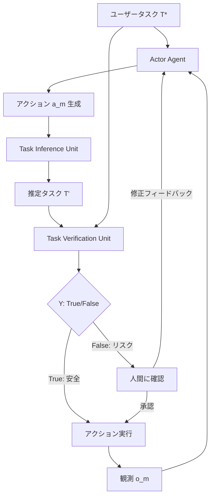

## 論文概要

本記事は [https://arxiv.org/abs/2407.11843](https://arxiv.org/abs/2407.11843) の解説記事です。

InferActは、LLMベースのエージェントが実行するアクションを事前に評価し、リスクの高いアクションを人間に確認させることで安全性を確保するフレームワークである。従来のアプローチがアクション実行後のエラー検出に依存していたのに対し、InferActはTheory-of-Mind（心の理論）に基づく信念推論を用いて、アクション実行前にリスクを判定する。著者らは、9つの設定のうち8つで既存手法を上回り、最大20%のMacro-F1改善を達成したと報告している。

この記事は [Zenn記事: LangSmithで本番エージェント障害を分析しCI/CDテストを自動化する](https://zenn.dev/0h_n0/articles/388cece782e5b6) の深掘りです。Zenn記事がLangSmithによる事後的な障害分析を扱うのに対し、本論文はアクション実行前のリスク評価による障害予防を提案しており、両者は相補的な関係にある。

## 情報源

- **arXiv ID**: 2407.11843
- **URL**: [https://arxiv.org/abs/2407.11843](https://arxiv.org/abs/2407.11843)
- **著者**: Haishuo Fang, Xiaodan Zhu, Iryna Gurevych
- **所属**: Technical University of Darmstadt (UKP Lab), Queen's University
- **発表年**: 2024（EMNLP 2025採択）
- **分野**: cs.CL, cs.AI
- **コードリポジトリ**: [https://github.com/UKPLab/emnlp2025-inferact](https://github.com/UKPLab/emnlp2025-inferact)

## 背景と動機

LLMベースのエージェントは、WebShopでの商品購入やHotPotQAでの情報検索など、実世界のタスクを自律的に遂行できるようになっている。しかし、エージェントが誤ったアクションを実行した場合、不可逆的な結果（誤った商品の購入、データの削除など）を引き起こす可能性がある。

従来の安全性確保手法には以下の課題があった。

- **事後検出の限界**: アクション実行後にエラーを検出しても、不可逆な操作は取り消せない
- **全アクション確認の非効率性**: すべてのアクションに人間の確認を要求すると、自律性のメリットが失われる
- **既存の不確実性推定手法の不十分さ**: Token EntropyやSelf-Consistencyなどの手法は、アクションの文脈的リスクを十分に捉えられない

InferActはこれらの課題に対し、Theory-of-Mindに基づく信念推論で「エージェントがタスクをどう解釈しているか」を推定し、ユーザーの意図との乖離を検出するアプローチを提案している。

## 主要な貢献

- **Theory-of-Mindに基づく事前評価フレームワーク**: アクション実行前に、エージェントの信念とユーザー意図の整合性を検証するTask Inference + Task Verificationの2段階アーキテクチャを提案
- **9設定中8設定で既存手法を上回る性能**: 3タスク（WebShop, HotPotQA, ALFWorld）× 3 LLMバックボーンの組み合わせで、最大20%のMacro-F1改善を達成
- **効率的な人間介入**: 全アクション確認と比較して50%のアノテーション予算で、成功率の差を3.5-7%に抑制
- **キャリブレーション特性の改善**: 既存手法と比べて推定キャリブレーション誤差（ECE）を大幅に低減

## 技術的詳細

### InferActアーキテクチャ

InferActは、Actorエージェントの各アクションを実行前に評価するEvaluatorモジュールで構成される。Evaluatorは2つのユニットから成る。



### Task Inference Unit（タスク推論ユニット）

Task Inference Unitは、エージェントの過去のアクション系列からエージェントが解釈しているタスクを推論する。これはTheory-of-Mindにおける信念推論（belief reasoning）に相当する。

$$
T' = \text{LLM}(P^{i}, S)
$$

ここで、各変数は以下の通りである。

- $T'$: エージェントが解釈していると推定されるタスク
- $P^{i}$: Task Inferenceプロンプト
- $S = \{a_1, o_1, \ldots, a_m, o_m\}$: これまでのアクションと観測の系列

このユニットは、エージェントの行動パターンから「エージェントが何を達成しようとしているのか」を逆推定する。例えばWebShopタスクにおいて、エージェントが「赤い靴」を検索しているにもかかわらず、ユーザーが「青い靴」を要求していた場合、$T'$と$T^*$の間に乖離が生じる。

### Task Verification Unit（タスク検証ユニット）

Task Verification Unitは、推定タスク$T'$とユーザーの実際のタスク$T^*$を比較し、整合性を判定する。

$$
Y = \text{LLM}(P^{v}, S, T^*, T')
$$

ここで、各変数は以下の通りである。

- $Y \in \{\text{True}, \text{False}\}$: アクションの安全性判定
- $P^{v}$: Task Verificationプロンプト
- $T^*$: ユーザーの元のタスク指示

### 出力形式のバリアント

InferActには2つの出力形式がある。

| バリアント | 出力 | 閾値 | 特徴 |
|-----------|------|------|------|
| **InferAct-verb** | True / False（直接出力） | 不要 | 閾値チューニング不要、導入が容易 |
| **InferAct-prob** | 確率スコア $p \in [0, 1]$ | 必要 | 閾値調整で精度-再現率トレードオフを制御可能 |

InferAct-probでは、LLMの出力トークン確率を利用して連続的なリスクスコアを算出する。

### アルゴリズム擬似コード

以下は、InferActの評価ループの擬似コードである。

```python
from dataclasses import dataclass
from typing import Literal


@dataclass
class ActionObservation:
    """エージェントのアクションと環境からの観測のペア."""

    action: str
    observation: str


@dataclass
class EvaluationResult:
    """InferActの評価結果."""

    is_safe: bool
    inferred_task: str
    confidence: float


def infer_task(
    prompt_inference: str,
    action_history: list[ActionObservation],
) -> str:
    """Task Inference Unit: アクション履歴からエージェントの推定タスクを推論する.

    Args:
        prompt_inference: タスク推論用プロンプトテンプレート
        action_history: これまでのアクション-観測ペアの系列

    Returns:
        エージェントが解釈していると推定されるタスクの記述
    """
    history_text = "\n".join(
        f"Action: {ao.action}\nObservation: {ao.observation}"
        for ao in action_history
    )
    # LLM呼び出しでタスク推論を実行
    inferred_task: str = llm_call(
        prompt=prompt_inference,
        context=history_text,
    )
    return inferred_task


def verify_task(
    prompt_verification: str,
    user_task: str,
    inferred_task: str,
    action_history: list[ActionObservation],
) -> tuple[bool, float]:
    """Task Verification Unit: 推定タスクとユーザータスクの整合性を検証する.

    Args:
        prompt_verification: タスク検証用プロンプトテンプレート
        user_task: ユーザーが指定した元のタスク
        inferred_task: Task Inference Unitが推定したタスク
        action_history: これまでのアクション-観測ペアの系列

    Returns:
        (is_safe, confidence) のタプル
    """
    result, prob = llm_call_with_prob(
        prompt=prompt_verification,
        context={
            "user_task": user_task,
            "inferred_task": inferred_task,
            "history": action_history,
        },
    )
    return result == "True", prob


def inferact_evaluate(
    user_task: str,
    action_history: list[ActionObservation],
    threshold: float = 0.5,
) -> EvaluationResult:
    """InferActによるアクション事前評価のメインループ.

    Args:
        user_task: ユーザーが指定した元のタスク
        action_history: これまでのアクション-観測ペアの系列
        threshold: InferAct-prob用の判定閾値

    Returns:
        EvaluationResult: 安全性判定、推定タスク、信頼度
    """
    # Step 1: Task Inference - エージェントの信念を推定
    inferred_task = infer_task(
        prompt_inference=TASK_INFERENCE_PROMPT,
        action_history=action_history,
    )

    # Step 2: Task Verification - ユーザー意図との整合性を検証
    is_safe, confidence = verify_task(
        prompt_verification=TASK_VERIFICATION_PROMPT,
        user_task=user_task,
        inferred_task=inferred_task,
        action_history=action_history,
    )

    # InferAct-prob: 閾値ベースの判定
    is_safe_final = confidence >= threshold

    return EvaluationResult(
        is_safe=is_safe_final,
        inferred_task=inferred_task,
        confidence=confidence,
    )
```

### ベースライン手法との比較

InferActの設計を理解するため、比較対象となるベースライン手法を整理する。

| 手法 | アプローチ | 閾値 | 制約 |
|------|----------|------|------|
| Direct Prompt | 1ステップでTrue/Falseを直接出力 | 不要 | 文脈的リスク判定が不十分 |
| Token Entropy | $H(p) = -p \log p - (1-p) \log(1-p)$ で不確実性を測定 | 必要 | 確率分布へのアクセスが必要 |
| Token Probability | $P(\text{False})$ のフォーマットベースキャリブレーション | 必要 | 出力フォーマットに依存 |
| Self-Consistency | 5サンプルの多数決 | 不要 | 計算コスト5倍 |
| Multi-step | ステップバイステップ評価 + 集約（Min/Max/Mean/Product） | 集約方法依存 | 集約関数の選択が性能に影響 |

## 実装のポイント

### 既存エージェントフレームワークとの統合

InferActは、LangGraphやLangChainなどの既存エージェントフレームワークにミドルウェアとして統合できる。以下はLangGraphのノードとしてInferAct評価を組み込む例である。

```python
from typing import Any, TypedDict

from langchain_core.messages import HumanMessage
from langchain_openai import ChatOpenAI
from langgraph.graph import END, StateGraph


class AgentState(TypedDict):
    """エージェントの状態を表す型定義."""

    task: str
    action_history: list[dict[str, str]]
    current_action: str
    risk_score: float
    needs_human_review: bool


def inferact_evaluator_node(state: AgentState) -> dict[str, Any]:
    """InferAct評価をLangGraphノードとして実装する.

    Args:
        state: 現在のエージェント状態

    Returns:
        更新された状態（risk_score, needs_human_review）
    """
    evaluator_llm = ChatOpenAI(model="gpt-4o", temperature=0)

    # Task Inference: アクション履歴からエージェントの推定タスクを推論
    inference_prompt = f"""以下のアクション履歴から、エージェントが達成しようとしている
タスクを推論してください。

アクション履歴:
{_format_history(state["action_history"])}

現在のアクション: {state["current_action"]}

推定タスク:"""

    inferred_task = evaluator_llm.invoke(
        [HumanMessage(content=inference_prompt)]
    ).content

    # Task Verification: ユーザータスクとの整合性を検証
    verification_prompt = f"""ユーザーのタスクとエージェントの推定タスクを比較し、
現在のアクションが安全かどうかを判定してください。

ユーザータスク: {state["task"]}
エージェント推定タスク: {inferred_task}
現在のアクション: {state["current_action"]}

判定（True=安全, False=リスク）:"""

    result = evaluator_llm.invoke(
        [HumanMessage(content=verification_prompt)]
    )

    # logprobsからリスクスコアを算出
    risk_score = _extract_risk_score(result)
    threshold = 0.7

    return {
        "risk_score": risk_score,
        "needs_human_review": risk_score < threshold,
    }


def _format_history(history: list[dict[str, str]]) -> str:
    """アクション履歴をプロンプト用にフォーマットする."""
    return "\n".join(
        f"Step {i+1}: Action={h['action']}, Observation={h['observation']}"
        for i, h in enumerate(history)
    )


def _extract_risk_score(result: Any) -> float:
    """LLM出力からリスクスコアを抽出する."""
    content = result.content.strip().lower()
    if "true" in content:
        return 0.9
    elif "false" in content:
        return 0.2
    return 0.5


def build_agent_with_inferact() -> StateGraph:
    """InferAct評価付きエージェントグラフを構築する.

    Returns:
        InferAct評価ノードを含むStateGraph
    """
    workflow = StateGraph(AgentState)

    workflow.add_node("plan_action", plan_action_node)
    workflow.add_node("inferact_evaluate", inferact_evaluator_node)
    workflow.add_node("execute_action", execute_action_node)
    workflow.add_node("human_review", human_review_node)

    workflow.set_entry_point("plan_action")
    workflow.add_edge("plan_action", "inferact_evaluate")
    workflow.add_conditional_edges(
        "inferact_evaluate",
        lambda state: "human_review" if state["needs_human_review"] else "execute_action",
    )
    workflow.add_edge("human_review", "execute_action")
    workflow.add_edge("execute_action", END)

    return workflow.compile()
```

## Production Deployment Guide

InferActを本番環境にデプロイする際の構成パターンと運用設計を示す。

### アーキテクチャ規模別パターン

| 構成 | 月間アクション数 | 推定月額コスト (2026年5月) | ユースケース |
|------|----------------|--------------------------|------------|
| Small | ~10,000 | $150-300 | 社内ツール、PoCフェーズ |
| Medium | ~100,000 | $800-2,000 | 部門導入、限定公開サービス |
| Large | 1,000,000+ | $3,000-8,000 | 全社SaaS、高頻度エージェント |

### Small構成: Lambda + DynamoDB

開発チーム向けの軽量構成。InferAct EvaluatorをLambda関数として実装し、アクション履歴をDynamoDBに保持する。

```hcl
# terraform/small/main.tf

resource "aws_lambda_function" "inferact_evaluator" {
  function_name = "inferact-evaluator"
  runtime       = "python3.12"
  handler       = "handler.evaluate"
  timeout       = 30
  memory_size   = 512

  environment {
    variables = {
      EVALUATOR_MODEL    = "gpt-4o-mini"
      RISK_THRESHOLD     = "0.7"
      DYNAMODB_TABLE     = aws_dynamodb_table.action_history.name
      HUMAN_REVIEW_QUEUE = aws_sqs_queue.human_review.url
    }
  }
}

resource "aws_dynamodb_table" "action_history" {
  name         = "inferact-action-history"
  billing_mode = "PAY_PER_REQUEST"
  hash_key     = "session_id"
  range_key    = "step_number"

  attribute {
    name = "session_id"
    type = "S"
  }

  attribute {
    name = "step_number"
    type = "N"
  }

  ttl {
    attribute_name = "expires_at"
    enabled        = true
  }
}

resource "aws_sqs_queue" "human_review" {
  name                       = "inferact-human-review"
  visibility_timeout_seconds = 300
  message_retention_seconds  = 86400
}

resource "aws_cloudwatch_metric_alarm" "high_risk_rate" {
  alarm_name          = "inferact-high-risk-rate"
  comparison_operator = "GreaterThanThreshold"
  evaluation_periods  = 3
  metric_name         = "HighRiskActionCount"
  namespace           = "InferAct"
  period              = 300
  statistic           = "Sum"
  threshold           = 50
  alarm_description   = "High risk action rate exceeded threshold"
  alarm_actions       = [aws_sns_topic.alerts.arn]
}
```

### Large構成: ECS Fargate + Aurora + Step Functions

高スループット環境向けの構成。Step Functionsでワークフローを管理し、ECS Fargateで評価を並列処理する。

```hcl
# terraform/large/main.tf

resource "aws_ecs_service" "inferact_evaluator" {
  name            = "inferact-evaluator"
  cluster         = aws_ecs_cluster.main.id
  task_definition = aws_ecs_task_definition.evaluator.arn
  desired_count   = 3
  launch_type     = "FARGATE"

  network_configuration {
    subnets          = var.private_subnets
    security_groups  = [aws_security_group.evaluator.id]
    assign_public_ip = false
  }

  service_registries {
    registry_arn = aws_service_discovery_service.evaluator.arn
  }
}

resource "aws_ecs_task_definition" "evaluator" {
  family                   = "inferact-evaluator"
  requires_compatibilities = ["FARGATE"]
  network_mode             = "awsvpc"
  cpu                      = 1024
  memory                   = 2048

  container_definitions = jsonencode([
    {
      name  = "evaluator"
      image = "${aws_ecr_repository.evaluator.repository_url}:latest"
      portMappings = [{ containerPort = 8080, protocol = "tcp" }]
      environment = [
        { name = "EVALUATOR_MODEL", value = "gpt-4o" },
        { name = "RISK_THRESHOLD", value = "0.7" },
        { name = "DB_SECRET_ARN", value = aws_secretsmanager_secret.db.arn },
        { name = "OTEL_EXPORTER_OTLP_ENDPOINT", value = "http://otel-collector:4317" },
      ]
      logConfiguration = {
        logDriver = "awslogs"
        options = {
          "awslogs-group"         = aws_cloudwatch_log_group.evaluator.name
          "awslogs-region"        = var.region
          "awslogs-stream-prefix" = "evaluator"
        }
      }
    }
  ])
}

resource "aws_sfn_state_machine" "inferact_workflow" {
  name     = "inferact-evaluation-workflow"
  role_arn = aws_iam_role.step_functions.arn

  definition = jsonencode({
    StartAt = "InferTask"
    States = {
      InferTask = {
        Type     = "Task"
        Resource = "arn:aws:states:::ecs:runTask.sync"
        Parameters = {
          LaunchType     = "FARGATE"
          Cluster        = aws_ecs_cluster.main.arn
          TaskDefinition = aws_ecs_task_definition.evaluator.arn
        }
        Next = "VerifyTask"
      }
      VerifyTask = {
        Type     = "Task"
        Resource = "arn:aws:states:::ecs:runTask.sync"
        Next     = "RiskDecision"
      }
      RiskDecision = {
        Type = "Choice"
        Choices = [
          {
            Variable           = "$.risk_score"
            NumericLessThan    = 0.7
            Next               = "HumanReview"
          }
        ]
        Default = "ExecuteAction"
      }
      HumanReview = {
        Type     = "Task"
        Resource = "arn:aws:states:::sqs:sendMessage.waitForTaskToken"
        Next     = "ExecuteAction"
      }
      ExecuteAction = {
        Type = "Task"
        End  = true
      }
    }
  })
}

resource "aws_rds_cluster" "action_history" {
  cluster_identifier = "inferact-history"
  engine             = "aurora-postgresql"
  engine_version     = "16.4"
  engine_mode        = "provisioned"
  database_name      = "inferact"

  serverlessv2_scaling_configuration {
    min_capacity = 0.5
    max_capacity = 8.0
  }
}
```

### モニタリング設計

CloudWatchとX-Rayを用いた監視設計の要点を示す。

```python
import time
from dataclasses import dataclass, field

import boto3
from aws_xray_sdk.core import patch_all, xray_recorder

patch_all()

cloudwatch = boto3.client("cloudwatch")


@dataclass
class InferActMetrics:
    """InferAct評価のメトリクス収集."""

    namespace: str = "InferAct/Production"
    _start_time: float = field(default_factory=time.time, init=False)

    def emit_evaluation(
        self,
        risk_score: float,
        is_safe: bool,
        latency_ms: float,
        task_type: str,
    ) -> None:
        """評価結果のメトリクスを送信する.

        Args:
            risk_score: リスクスコア [0, 1]
            is_safe: 安全性判定結果
            latency_ms: 評価にかかった時間（ミリ秒）
            task_type: タスクの種類（webshop, qa, householdなど）
        """
        dimensions = [{"Name": "TaskType", "Value": task_type}]

        cloudwatch.put_metric_data(
            Namespace=self.namespace,
            MetricData=[
                {
                    "MetricName": "RiskScore",
                    "Value": risk_score,
                    "Unit": "None",
                    "Dimensions": dimensions,
                },
                {
                    "MetricName": "EvaluationLatency",
                    "Value": latency_ms,
                    "Unit": "Milliseconds",
                    "Dimensions": dimensions,
                },
                {
                    "MetricName": "HighRiskActionCount",
                    "Value": 0.0 if is_safe else 1.0,
                    "Unit": "Count",
                    "Dimensions": dimensions,
                },
            ],
        )


@xray_recorder.capture("inferact_evaluate")
def evaluate_with_tracing(
    user_task: str,
    action_history: list[dict[str, str]],
    current_action: str,
) -> dict:
    """X-Rayトレーシング付きInferAct評価.

    Args:
        user_task: ユーザーの元タスク
        action_history: アクション履歴
        current_action: 評価対象のアクション

    Returns:
        評価結果を含む辞書
    """
    subsegment = xray_recorder.current_subsegment()
    subsegment.put_annotation("task_type", "webshop")
    subsegment.put_metadata("action", current_action)

    start = time.time()
    result = inferact_evaluate(user_task, action_history)
    latency_ms = (time.time() - start) * 1000

    metrics = InferActMetrics()
    metrics.emit_evaluation(
        risk_score=result.confidence,
        is_safe=result.is_safe,
        latency_ms=latency_ms,
        task_type="webshop",
    )

    return {
        "is_safe": result.is_safe,
        "risk_score": result.confidence,
        "inferred_task": result.inferred_task,
        "latency_ms": latency_ms,
    }
```

### コスト最適化チェックリスト

- **モデル選択の階層化**: 低リスクアクション（検索、閲覧）はGPT-4o-mini、高リスクアクション（購入、削除）はGPT-4oで評価する2段階構成
- **アクション履歴の圧縮**: 直近N件のアクションのみを評価対象とし、プロンプトトークン数を削減（論文ではアクション系列全体を使用しているが、実運用ではウィンドウサイズの調整が有効）
- **キャッシュ活用**: 同一タスクパターンの評価結果をDynamoDB TTL付きでキャッシュし、LLM呼び出し回数を削減
- **バッチ評価**: 非リアルタイムのワークフローでは、複数アクションをバッチでまとめて評価しAPI呼び出しを集約
- **閾値の動的調整**: タスク種別ごとに閾値を設定し、低リスクタスクでは閾値を下げて人間介入頻度を抑制

## 実験結果

### 安全アクション検出性能（Macro-F1）

著者らは、3タスク × 3 LLMバックボーンの9設定で実験を行い、以下の結果を報告している。

**論文Table 1より（Macro-F1スコア）：**

| 手法 | WebShop | HotPotQA | ALFWorld |
|------|---------|----------|----------|
| Direct Prompt (GPT-4) | 0.400 | 0.612 | 0.609 |
| Token Entropy (GPT-4) | 0.536 | 0.607 | 0.551 |
| Token Probability (GPT-4) | 0.540 | 0.613 | 0.749 |
| Self-Consistency (GPT-4) | 0.523 | 0.400 | 0.462 |
| Multi-step (GPT-4) | 0.531 | 0.624 | 0.628 |
| **InferAct-prob (GPT-4)** | **0.570** | **0.657** | **0.719** |

著者らは、InferActが9つの設定のうち8つで既存手法を上回り、平均8%のMacro-F1改善を達成したと報告している。Direct Promptと比較すると、WebShopで+17.0ポイント、HotPotQAで+4.5ポイントの改善が見られる。

### キャリブレーション性能

推定キャリブレーション誤差（ECE）は、予測確率と実際の正解率の乖離を測定する指標である。ECEが低いほど、モデルの出力確率が信頼できることを意味する。

**論文Table 2より（ECE、低いほど良好）：**

| 手法 | WebShop | HotPotQA | ALFWorld |
|------|---------|----------|----------|
| Token Prob (GPT-3.5) | 0.345 | 0.195 | 0.583 |
| Multi-step (GPT-3.5) | 0.327 | 0.125 | 0.499 |
| **InferAct-prob (GPT-3.5)** | **0.187** | 0.240 | **0.116** |

著者らは、InferAct-probがALFWorldタスクでECE 0.116を達成し、Token Probabilityの0.583と比較して大幅に改善していると報告している。キャリブレーション性能の向上は、閾値ベースの判定において重要な意味を持つ。

### 人間フィードバックとの協調結果

著者らは、InferActの判定結果に基づいて人間が介入する協調実験も行っている。

**論文Table 3より（タスク成功率）：**

| 手法 | WebShop (Binary) | WebShop (NL) | HotPotQA (NL) | ALFWorld (NL) |
|------|-----------------|--------------|---------------|---------------|
| ベースライン (N=0) | 30.0% | - | 57.3% | 64.9% |
| Multi-step | 33.3% | 37.7% | 60.7% | 77.6% |
| Token Entropy | 32.3% | 42.7% | 66.0% | 81.3% |
| **InferAct-prob** | **35.7%** | **47.7%** | **70.7%** | **85.1%** |
| Full Validation | 39.3% | 57.0% | 80.6% | 87.3% |

著者らは、InferAct-probが50%のアノテーション予算でFull Validation（全アクション確認）との差を3.5%（Binaryフィードバック）および7%（自然言語フィードバック）に抑えたと報告している。自然言語フィードバックはBinaryフィードバックと比較してWebShopで+12.0ポイントの改善を示しており、修正指示の質がエージェント性能に影響することが確認された。

### 計算コスト

**論文Table 4より（GPT-4-Turbo、1アクションあたり）：**

| 手法 | レイテンシ | コスト |
|------|----------|--------|
| Direct Prompt | 1.2 秒 | $0.0032 |
| Token Probability | 2.3 秒 | $0.0021 |
| **InferAct** | **4.1 秒** | **$0.0122** |
| Self-Consistency | 6.0 秒 | $0.0128 |

著者らは、InferActのコストはDirect Promptの約3.8倍であるが、Self-Consistencyと同等水準であると報告している。2段階のLLM呼び出し（Task Inference + Task Verification）によるレイテンシ増加は、安全性の向上とのトレードオフとして許容可能な範囲であると述べている。

### モデルスケーリング分析

著者らは、Qwen 2.5シリーズ（3B, 7B, 14B, 32B, 72B）を用いたスケーリング分析も実施している。その結果、モデルサイズの増大が必ずしも性能向上につながらないことが確認された。著者らは「モデルサイズの増加がInferActやDirect Promptの性能向上を保証するわけではない」とし、過度な推論や内在するバイアスがスケーリング効果を打ち消す可能性を指摘している。

## 実運用への応用

### LangSmithとの統合

Zenn記事で取り上げたLangSmithの障害分析機能と、InferActの事前リスク評価を組み合わせることで、エージェントの安全性を多層的に強化できる。

| レイヤー | ツール | タイミング | 目的 |
|---------|--------|----------|------|
| 事前評価 | InferAct | アクション実行前 | リスクの高いアクションを検出・人間に確認 |
| 実行時トレーシング | LangSmith Tracing | アクション実行中 | 実行パスの記録、レイテンシ監視 |
| 事後分析 | LangSmith Automations | アクション実行後 | 障害パターンの検出、自動テスト生成 |

### InferActリスクスコアのLangSmith連携

InferActの評価結果をLangSmithのメタデータとして記録することで、リスクスコアの分布や人間介入の頻度をLangSmithダッシュボードで可視化できる。具体的には以下のフローが考えられる。

1. **リスクスコアのラベル付き記録**: 各アクションのリスクスコアをLangSmithのrunメタデータに付与し、高リスクアクションのフィルタリングを可能にする
2. **人間介入パターンの蓄積**: 人間が修正したアクションとその理由をLangSmithのfeedbackとして記録し、InferActの閾値チューニングに活用する
3. **Automationsとの連動**: リスクスコアが特定の閾値を超えた場合にLangSmith Automationsでアラートを発火し、CI/CDパイプラインでの回帰テストを自動生成する

この統合により、Zenn記事で解説したLangSmithの事後分析に加え、InferActによる事前防止の層を追加できる。

## 関連研究

- **Tian et al. (2023)** - "Just Ask for Calibration": LLMの自己評価精度の改善手法。InferActはこのキャリブレーション研究を基盤として、エージェントのアクション安全性判定に応用している
- **Kadavath et al. (2022)** - "Language Models (Mostly) Know What They Know": LLMの自己認識能力に関する研究。InferActのToken Probabilityベースラインの理論的基盤を提供している
- **Xiong et al. (2024)** - "Can LLMs Express Their Uncertainty?": LLMの不確実性表現能力の限界を分析。InferActがToken Entropyなど単純な不確実性指標を超える必要性を示唆している
- **Ruan et al. (2024)** - Tool-Augmented LLMの安全性に関するベンチマーク。InferActが対象とするリスク評価の問題設定に近い

## まとめと今後の展望

InferActは、Theory-of-Mindに基づく信念推論をLLMエージェントの安全性評価に応用した研究であり、アクション実行前のリスク判定という実用的なアプローチを提案している。9設定中8設定で既存手法を上回る性能と、50%のアノテーション予算でFull Validationに近い成功率を達成した点は、実運用での導入判断に有用な定量的根拠となる。今後の課題として、より多様なタスクへの汎化、リアルタイム性の改善、マルチモーダルエージェントへの拡張が考えられる。

## 参考文献

1. Fang, H., Zhu, X., & Gurevych, I. (2024). InferAct: Inferring Safe Actions for LLM-Based Agents Through Preemptive Evaluation and Human Feedback. *arXiv preprint arXiv:2407.11843*. EMNLP 2025.
2. Tian, K., et al. (2023). Just Ask for Calibration: Strategies for Eliciting Calibrated Confidence Scores from Language Models. *EMNLP 2023*.
3. Kadavath, S., et al. (2022). Language Models (Mostly) Know What They Know. *arXiv preprint arXiv:2207.05221*.
4. Xiong, M., et al. (2024). Can LLMs Express Their Uncertainty? An Empirical Evaluation of Confidence Elicitation in LLMs. *ICLR 2024*.
5. Ruan, Y., et al. (2024). Identifying the Risks of LM Agents with an LM-Emulated Sandbox. *ICLR 2024*.
