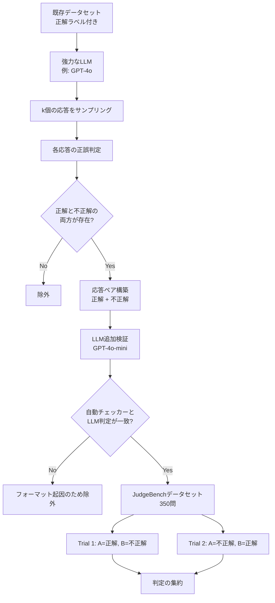
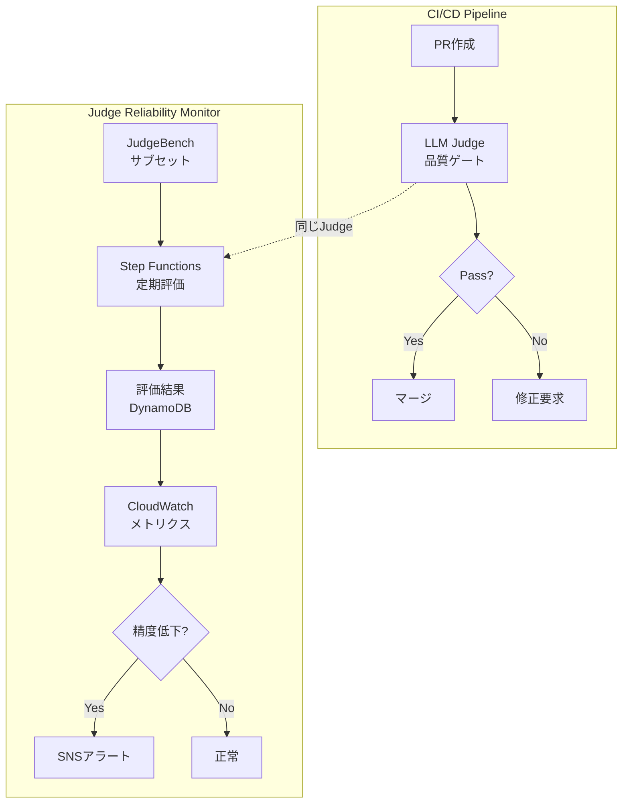

本記事は [arXiv:2410.12784](https://arxiv.org/abs/2410.12784) の解説記事です。

## 論文概要（Abstract）

Tan, Zhuang, Montgomery ら（UC Berkeley / Washington University in St. Louis, 2024）は、LLM-based Judgeの信頼性を客観的に評価するベンチマーク **JudgeBench** を提案した。既存のベンチマークが人間の主観的な選好との一致度を測定していたのに対し、JudgeBenchは事実的・論理的正確性に基づく客観的な正解ラベルを持つ困難な応答ペアを構築する。著者らは、prompted judge、fine-tuned judge、multi-agent judge、reward modelの4種類の評価者を包括的にテストし、GPT-4oですらVanillaプロンプトではランダム推測（50%）と同程度の精度にとどまることを報告している。汎用モデルの中ではClaude-3.5-Sonnetが64.29%で最高精度を達成したが、依然として改善の余地が大きい。本研究はICLR 2025に採択された。

この記事は [Zenn記事: LangSmithで本番エージェント障害を分析しCI/CDテストを自動化する](https://zenn.dev/0h_n0/articles/388cece782e5b6) の深掘りです。

## 情報源

- **arXiv ID**: 2410.12784
- **URL**: [https://arxiv.org/abs/2410.12784](https://arxiv.org/abs/2410.12784)
- **著者**: Sijun Tan, Siyuan Zhuang, Kyle Montgomery, William Y. Tang, Alejandro Cuadron, Chenguang Wang, Raluca Ada Popa, Ion Stoica
- **所属**: UC Berkeley / Washington University in St. Louis
- **発表**: ICLR 2025
- **コード**: [https://github.com/ScalerLab/JudgeBench](https://github.com/ScalerLab/JudgeBench)

## 背景と動機（Background & Motivation）

LLM-based Judge（LLMを評価者として活用する手法）は、モデルのランキング、RLHFの報酬信号、推論時のベスト応答選択など、AI開発の多くの場面で利用されている。しかし、その評価者自体の信頼性を体系的に検証した研究は限られていた。

既存のベンチマーク（MTBench、LLMEval、FairEval）はクラウドソーシングによる人間の選好との一致度を測定していたが、ここには根本的な問題がある。タスクの難易度が上がると、人間の評価者自体が正確に判断できなくなるのである。数学の証明検証やコードのバグ検出のように高度な専門知識を要するタスクでは、人間の評価者は正しい回答よりも「もっともらしく見える」回答や「長い」回答を選好する傾向がある。

著者らはこの問題に対し、3つの階層的原則を提案している。LLM評価者は (1) 指示への忠実度、(2) 事実的・論理的正確性、(3) スタイル的選好 の順に優先して判断すべきである。既存のベンチマークが主に(1)と(3)を評価していたのに対し、JudgeBenchは最も困難かつ重要な(2)に焦点を当てている。

## 主要な貢献（Key Contributions）

- **階層的評価フレームワーク**: 指示忠実度 > 事実的正確性 > スタイル選好の優先順位に基づくLLM評価者の評価原則を体系化。将来のベンチマーク設計に対する理論的指針を提供
- **汎用パイプライン**: 正解ラベル付きの既存データセットを、LLM評価者用の困難な応答ペアに変換する再現可能なパイプラインを構築。新しいドメインへの拡張が容易
- **包括的な実証評価**: prompted judge、fine-tuned judge、multi-agent judge、reward modelの4カテゴリにわたる評価を実施し、現行のLLM評価者が困難なケースで著しく信頼性に欠けることを定量的に実証
- **Solver-Judge相関の発見**: モデルが問題を解く能力と判定する能力が高い相関を持つことを示し、評価者の推論能力向上が次のフロンティアであることを指摘

## 技術的詳細（Technical Details）

### JudgeBenchパイプライン

JudgeBenchの核心は、「モデルが正解を安定的に生成できない困難な問題では、正解と不正解の応答を区別するのも困難である」という洞察に基づいている。このパイプラインの全体像を以下に示す。



パイプラインの手順は以下の通りである。

1. **応答サンプリング**: 正解ラベル付きの既存データセット（MMLU-Pro、LiveBench、LiveCodeBench）から問題を取得し、強力なLLM（GPT-4o）で $k$ 個の応答を生成する
2. **正誤判定**: 各応答をデータセット固有の検証アルゴリズムで採点する
3. **フィルタリング**: $k$ 個すべてが正解、またはすべてが不正解の問題を除外し、正解と不正解の両方が含まれる問題のみを保持する
4. **追加検証**: フォーマットの不一致による誤判定を除外するため、GPT-4o-miniによる追加の正誤チェックを実施し、自動チェッカーとLLM判定が不一致のケースを除外する
5. **応答ペア構築**: 正解応答と不正解応答をペアにし、位置バイアスを排除するため2回（順序を入れ替えて）評価する

### データセット構成

最終的なデータセットは350問で構成され、以下の4カテゴリに分類される。

| カテゴリ | 問題数 | ソースデータセット | 検証方法 |
|----------|--------|-------------------|----------|
| Knowledge（知識） | 154 | MMLU-Pro | 正規表現マッチング + LLM検証 |
| Reasoning（推論） | 98 | LiveBench（Big-Bench Hard, Zebra Puzzles） | 自動解答チェック + LLM検証 |
| Mathematics（数学） | 56 | LiveBench（AMC12, USAMO） | 数値一致 + LLM検証 |
| Coding（コーディング） | 42 | LiveCodeBench（LeetCode, AtCoder, Codeforces） | テストケース実行 |

### 評価プロトコル

位置バイアスの影響を排除するため、各応答ペアは順序を入れ替えた2回のトライアルで評価される。判定結果の集約ルールは以下の通りである。

$$
\text{Verdict} = \begin{cases}
A > B & \text{両トライアルで } A > B \text{ または 1回が } A > B \text{ で1回が } A = B \\
A < B & \text{両トライアルで } A < B \text{ または 1回が } A < B \text{ で1回が } A = B \\
\text{Incorrect} & \text{矛盾する判定（} A > B \text{ と } A < B \text{）または両方 } A = B
\end{cases}
$$

矛盾する判定（一方のトライアルで $A > B$、他方で $A < B$）は、評価者が推測に依存しているか、応答を確実に区別できないことを示すため、不正解として扱われる。

### 単一モデルによる応答生成の設計意図

従来のアプローチでは複数のモデルで応答を生成していたが、これには3つの問題がある。(1) モデル間の能力差により不正解応答が容易に識別可能になる、(2) モデル固有のスタイル差が手がかりとなり事実的正確性の評価を阻害する、(3) 自己強化バイアス（self-enhancement bias）の制御が困難になる。JudgeBenchでは単一モデル（GPT-4o）で全応答を生成することで、スタイルの均一性を確保し、これらの問題を緩和している。

## 実装のポイント（Implementation Guide）

JudgeBenchを使用して自社のLLM評価パイプラインの信頼性を検証する実装例を示す。

```python
"""JudgeBenchを用いたLLM Judge信頼性評価パイプライン."""

from __future__ import annotations

import json
from dataclasses import dataclass, field
from enum import Enum
from pathlib import Path
from typing import Any


class Verdict(Enum):
    """評価者の判定結果."""

    A_WINS = "A>B"
    B_WINS = "A<B"
    TIE = "A=B"


@dataclass(frozen=True)
class JudgePair:
    """JudgeBenchの1つの応答ペア.

    Attributes:
        pair_id: ペアの一意識別子
        category: knowledge / reasoning / math / coding
        question: 評価対象の質問テキスト
        correct_response: 正解応答
        incorrect_response: 不正解応答
    """

    pair_id: str
    category: str
    question: str
    correct_response: str
    incorrect_response: str


@dataclass
class TrialResult:
    """1トライアルの結果.

    Attributes:
        pair_id: 対象ペアのID
        trial_order: "original" or "swapped"
        verdict: 判定結果
        reasoning: 評価者の推論テキスト
    """

    pair_id: str
    trial_order: str
    verdict: Verdict
    reasoning: str


@dataclass
class AggregatedResult:
    """2トライアルの集約結果.

    Attributes:
        pair_id: 対象ペアのID
        category: カテゴリ名
        is_correct: 正解応答を選択できたか
        trial1: トライアル1の結果
        trial2: トライアル2の結果
    """

    pair_id: str
    category: str
    is_correct: bool
    trial1: TrialResult
    trial2: TrialResult


@dataclass
class BenchmarkReport:
    """ベンチマーク評価レポート.

    Attributes:
        judge_name: 評価対象のjudge名
        overall_accuracy: 全体の正解率
        category_accuracy: カテゴリ別正解率
        results: 各ペアの集約結果リスト
    """

    judge_name: str
    overall_accuracy: float
    category_accuracy: dict[str, float]
    results: list[AggregatedResult] = field(default_factory=list)


def aggregate_trials(
    trial1: TrialResult,
    trial2: TrialResult,
) -> bool:
    """2回のトライアル結果を集約し正解かどうかを判定する.

    JudgeBenchの評価プロトコルに従い、位置バイアスを排除した
    集約判定を行う。

    Args:
        trial1: 元の順序でのトライアル結果
        trial2: 順序を入れ替えたトライアル結果

    Returns:
        正解応答を正しく選択できた場合True
    """
    # Trial 1: A=正解, B=不正解 -> A>Bが正解
    # Trial 2: A=不正解, B=正解 -> B>A (= A<B)が正解
    t1_correct = trial1.verdict == Verdict.A_WINS
    t2_correct = trial2.verdict == Verdict.B_WINS

    # 両方正解、または一方が正解で他方がtie
    if t1_correct and t2_correct:
        return True
    if t1_correct and trial2.verdict == Verdict.TIE:
        return True
    if trial1.verdict == Verdict.TIE and t2_correct:
        return True

    return False


def compute_category_accuracy(
    results: list[AggregatedResult],
) -> dict[str, float]:
    """カテゴリ別の正解率を算出する.

    Args:
        results: 集約済み結果のリスト

    Returns:
        カテゴリ名をキー、正解率(0.0-1.0)を値とする辞書
    """
    category_counts: dict[str, dict[str, int]] = {}

    for result in results:
        if result.category not in category_counts:
            category_counts[result.category] = {"correct": 0, "total": 0}
        category_counts[result.category]["total"] += 1
        if result.is_correct:
            category_counts[result.category]["correct"] += 1

    return {
        cat: counts["correct"] / counts["total"]
        for cat, counts in category_counts.items()
        if counts["total"] > 0
    }
```

上記のコードは、JudgeBenchの評価プロトコルに準拠した集約ロジックを提供する。実際に使用する際は、`run_judge.py`（公式リポジトリ提供）を通じてArena-Hard Judgeなどの評価手法を実行し、結果をこのフレームワークで分析できる。

## Production Deployment Guide

JudgeBench の知見を活かし、LLM-as-Judge の信頼性を継続的にモニタリングする本番パイプラインを AWS 上に構築する方法を示す。CI/CD パイプラインで LLM 評価者を品質ゲートとして利用する場合、その評価者自体の精度を定期的に検証することが不可欠である。

### アーキテクチャ概要



### Terraform 構成

```hcl
# modules/judge_monitor/main.tf

# ---------- DynamoDB: 評価結果の永続化 ----------
resource "aws_dynamodb_table" "judge_results" {
  name         = "${var.project}-judge-reliability"
  billing_mode = "PAY_PER_REQUEST"
  hash_key     = "judge_name"
  range_key    = "evaluated_at"

  attribute {
    name = "judge_name"
    type = "S"
  }

  attribute {
    name = "evaluated_at"
    type = "S"
  }

  ttl {
    attribute_name = "ttl"
    enabled        = true
  }

  tags = var.common_tags
}

# ---------- Lambda: JudgeBench評価実行 ----------
resource "aws_lambda_function" "judge_evaluator" {
  function_name = "${var.project}-judge-evaluator"
  runtime       = "python3.12"
  handler       = "handler.evaluate"
  timeout       = 900
  memory_size   = 512

  filename         = data.archive_file.lambda_zip.output_path
  source_code_hash = data.archive_file.lambda_zip.output_base64sha256

  role = aws_iam_role.lambda_role.arn

  environment {
    variables = {
      DYNAMODB_TABLE   = aws_dynamodb_table.judge_results.name
      SAMPLE_SIZE      = var.sample_size
      ALARM_THRESHOLD  = var.accuracy_threshold
    }
  }

  tags = var.common_tags
}

# ---------- EventBridge: 週次スケジュール ----------
resource "aws_scheduler_schedule" "weekly_eval" {
  name       = "${var.project}-weekly-judge-eval"
  group_name = "default"

  flexible_time_window {
    mode = "OFF"
  }

  schedule_expression = "rate(7 days)"

  target {
    arn      = aws_lambda_function.judge_evaluator.arn
    role_arn = aws_iam_role.scheduler_role.arn

    input = jsonencode({
      judge_names = var.judge_names
      categories  = ["knowledge", "reasoning", "math", "coding"]
    })
  }
}

# ---------- CloudWatch Alarm: 精度低下検知 ----------
resource "aws_cloudwatch_metric_alarm" "judge_accuracy_drop" {
  alarm_name          = "${var.project}-judge-accuracy-below-threshold"
  comparison_operator = "LessThanThreshold"
  evaluation_periods  = 1
  metric_name         = "JudgeAccuracy"
  namespace           = var.project
  period              = 604800 # 7日
  statistic           = "Average"
  threshold           = var.accuracy_threshold
  alarm_description   = "LLM Judge精度が閾値${var.accuracy_threshold}%を下回った"
  alarm_actions       = [aws_sns_topic.alerts.arn]

  tags = var.common_tags
}

resource "aws_sns_topic" "alerts" {
  name = "${var.project}-judge-alerts"
  tags = var.common_tags
}
```

### Lambda ハンドラ

```python
"""JudgeBench定期評価Lambda.

週次でLLM Judgeの信頼性を測定し、精度低下を検知する。
"""

from __future__ import annotations

import json
import os
import random
from datetime import datetime, timezone
from typing import Any

import boto3

dynamodb = boto3.resource("dynamodb")
cloudwatch = boto3.client("cloudwatch")
TABLE_NAME = os.environ["DYNAMODB_TABLE"]
SAMPLE_SIZE = int(os.environ.get("SAMPLE_SIZE", "50"))


def evaluate(event: dict[str, Any], context: Any) -> dict[str, Any]:
    """JudgeBenchサブセットでLLM Judgeを評価する.

    Args:
        event: judge_names と categories を含むイベント
        context: Lambda コンテキスト

    Returns:
        評価結果のサマリ
    """
    judge_names: list[str] = event["judge_names"]
    categories: list[str] = event.get(
        "categories",
        ["knowledge", "reasoning", "math", "coding"],
    )

    # JudgeBenchデータセットからサンプリング
    pairs = _load_judgebench_sample(categories, SAMPLE_SIZE)
    table = dynamodb.Table(TABLE_NAME)
    results: list[dict[str, Any]] = []

    for judge_name in judge_names:
        correct_count = 0
        category_counts: dict[str, dict[str, int]] = {}

        for pair in pairs:
            cat = pair["category"]
            if cat not in category_counts:
                category_counts[cat] = {"correct": 0, "total": 0}

            is_correct = _run_judge_trial(judge_name, pair)
            category_counts[cat]["total"] += 1
            if is_correct:
                correct_count += 1
                category_counts[cat]["correct"] += 1

        accuracy = correct_count / len(pairs) if pairs else 0.0
        now = datetime.now(tz=timezone.utc).isoformat()

        # DynamoDB に記録
        table.put_item(Item={
            "judge_name": judge_name,
            "evaluated_at": now,
            "overall_accuracy": str(round(accuracy * 100, 2)),
            "category_accuracy": json.dumps({
                cat: round(c["correct"] / c["total"] * 100, 2)
                for cat, c in category_counts.items()
                if c["total"] > 0
            }),
            "sample_size": len(pairs),
            "ttl": int(datetime.now(tz=timezone.utc).timestamp()) + 90 * 86400,
        })

        # CloudWatch メトリクス送信
        cloudwatch.put_metric_data(
            Namespace=os.environ.get("PROJECT", "JudgeMonitor"),
            MetricData=[{
                "MetricName": "JudgeAccuracy",
                "Dimensions": [
                    {"Name": "JudgeName", "Value": judge_name},
                ],
                "Value": accuracy * 100,
                "Unit": "Percent",
            }],
        )

        results.append({
            "judge_name": judge_name,
            "accuracy": round(accuracy * 100, 2),
            "category_accuracy": {
                cat: round(c["correct"] / c["total"] * 100, 2)
                for cat, c in category_counts.items()
                if c["total"] > 0
            },
        })

    return {"statusCode": 200, "body": json.dumps(results)}


def _load_judgebench_sample(
    categories: list[str],
    sample_size: int,
) -> list[dict[str, Any]]:
    """JudgeBenchデータセットからランダムサンプルを取得する.

    Args:
        categories: 対象カテゴリのリスト
        sample_size: サンプル数

    Returns:
        応答ペアのリスト
    """
    # S3 or ローカルからデータセットをロード
    all_pairs: list[dict[str, Any]] = []
    for cat in categories:
        path = f"data/judgebench_{cat}.jsonl"
        try:
            with open(path) as f:
                for line in f:
                    pair = json.loads(line)
                    pair["category"] = cat
                    all_pairs.append(pair)
        except FileNotFoundError:
            continue

    if len(all_pairs) > sample_size:
        return random.sample(all_pairs, sample_size)
    return all_pairs


def _run_judge_trial(
    judge_name: str,
    pair: dict[str, Any],
) -> bool:
    """2回のトライアルでJudgeを評価する.

    Args:
        judge_name: 評価手法名
        pair: 応答ペアデータ

    Returns:
        正解応答を正しく選択できた場合True
    """
    # 実装はJudgeBench公式リポジトリのrun_judge.pyを参照
    raise NotImplementedError(
        "実際のLLM API呼び出しは環境に応じて実装する"
    )
```

### コスト最適化

JudgeBench全350問を毎回評価するとAPIコストが高くなるため、以下の戦略を推奨する。

- **層化サンプリング**: 4カテゴリから均等にサンプリングし、50問程度で週次評価を実施。JudgeBenchの論文で報告されたカテゴリ間の精度差を考慮し、各カテゴリの代表性を確保する
- **差分評価**: モデルバージョン更新時のみフル評価（350問）を実施し、定期モニタリングはサブセットで運用する
- **Bedrock活用**: AWS Bedrock経由でClaude-3.5-Sonnetを利用する場合、プロビジョニングスループットを活用してコストを抑制する

## 実験結果（Experimental Results）

### LLM-based Judgeの評価結果

著者らは、3カテゴリの評価手法（prompted judge、fine-tuned judge、multi-agent judge）を評価している（Table 1）。

| 評価手法 | Knowledge | Reasoning | Math | Coding | Overall |
|----------|-----------|-----------|------|--------|---------|
| **Prompted Judges** | | | | | |
| Vanilla (GPT-4o) | 44.16 | 47.96 | 66.07 | 61.90 | 50.86 |
| Arena-Hard Judge (GPT-4o) | 50.65 | 54.08 | 75.00 | 59.52 | 56.57 |
| VertexAI Evaluation (Gemini-1.5-pro) | 45.45 | 44.90 | 53.57 | 28.57 | 44.57 |
| **Fine-tuned Judges** | | | | | |
| PandaLM | 9.09 | 21.43 | 7.14 | 16.67 | 13.14 |
| Prometheus2-8x7b | 41.56 | 39.80 | 50.00 | 23.81 | 40.29 |
| JudgeLM-33B | 32.47 | 48.98 | 33.93 | 19.05 | 35.71 |
| Skywork-LLaMA-3.1B-70B | 55.84 | 55.10 | 73.21 | 47.62 | 57.43 |
| **Multi-Agent Judges** | | | | | |
| ChatEval | 32.47 | 31.63 | 44.64 | 30.95 | 34.00 |

著者らはTable 1について以下の知見を報告している。GPT-4oをVanillaプロンプトで使用した場合のOverall精度は50.86%であり、ランダム推測（50%）とほぼ同等である。Arena-Hardプロンプトを使用すると56.57%に改善するが、依然として低い水準にとどまる。Fine-tuned judgeの中ではSkywork-LLaMA-3.1B-70Bが57.43%で最高精度を達成し、ベースモデルのLlama-3.1-70B（52.29%）から約5ポイント改善した。一方、PandaLMは13.14%とランダム以下の精度であり、fine-tuningに使用した選好データセットの品質が結果を大きく左右することが示唆される。

### モデル別評価結果

Arena-Hard Judgeのプロンプトを固定し、異なる基盤モデルで評価した結果を以下に示す（Table 2）。

| モデル | Knowledge | Reasoning | Math | Coding | Overall |
|--------|-----------|-----------|------|--------|---------|
| GPT-4o | 50.65 | 54.08 | 75.00 | 59.52 | 56.57 |
| GPT-4o-mini | 48.05 | 43.88 | 69.64 | 45.24 | 50.00 |
| o1-preview | 66.23 | 79.59 | 85.71 | 85.71 | 75.43 |
| o1-mini | 58.44 | 62.24 | 82.14 | 78.57 | 65.71 |
| o3-mini (high) | 67.53 | 89.80 | 87.50 | 100.0 | 80.86 |
| o3-mini (medium) | 62.34 | 86.73 | 85.71 | 92.86 | 76.57 |
| Claude-3.5-Sonnet | 62.34 | 66.33 | 66.07 | 64.29 | 64.29 |
| Claude-3-Haiku | 35.06 | 34.69 | 33.93 | 21.43 | 33.14 |
| Llama-3.1-405B | 55.84 | 54.08 | 69.64 | 50.00 | 56.86 |
| Llama-3.1-70B | 51.30 | 48.98 | 60.71 | 52.38 | 52.29 |
| Gemini-1.5-pro | 49.35 | 42.86 | 64.29 | 26.19 | 47.14 |
| DeepSeek-R1 | 59.09 | 82.65 | 80.36 | 92.86 | 73.14 |

著者らはTable 2の結果から、以下の傾向を報告している。推論強化モデル（o1-preview、o3-mini、DeepSeek-R1）が通常モデルを大幅に上回り、o3-mini (high)が80.86%で最高精度を達成した。特にCodingカテゴリではo3-mini (high)が100%を達成している。これはテスト時計算量のスケーリング（test-time compute scaling）がLLM評価者の推論能力向上に有効であることを示している。汎用モデルではClaude-3.5-Sonnetが64.29%で最高だが、同じプロバイダのClaude-3-Haikuは33.14%にとどまり、モデルサイズの影響が顕著である。

### Reward Modelの評価結果

著者らはRewardBenchリーダーボード上位のreward modelも評価している（Table 3）。

| Reward Model | Knowledge | Reasoning | Math | Coding | Overall |
|-------------|-----------|-----------|------|--------|---------|
| Skywork-Reward-Gemma-2-27B | 59.74 | 66.33 | 83.93 | 50.00 | 64.29 |
| Skywork-Reward-Llama-3.1-8B | 59.09 | 64.29 | 76.79 | 50.00 | 62.29 |
| InternLM2-20B-Reward | 62.34 | 69.39 | 66.07 | 50.00 | 63.43 |
| InternLM2-7B-Reward | 56.49 | 61.22 | 71.43 | 50.00 | 59.43 |
| GRM-Gemma-2B | 62.99 | 53.06 | 64.29 | 54.76 | 59.43 |

著者らは、27Bパラメータのreward model（Skywork-Reward-Gemma-2-27B）がClaude-3.5-Sonnetと同等の64.29%を達成した点を注目している。また、8BパラメータのSkywork-Reward-Llama-3.1-8Bは62.29%であり、ベースモデルのLlama-3.1-8B-Instruct（40.86%）から21ポイント以上の改善を示している。これは、弱いモデルから専門的なverifierを訓練し、強いモデルの出力を判定することが可能であることを示唆する重要な知見である。

### Solver vs. Judge の比較

著者らはablation studyとして、モデルが問題を直接解く能力（Solver）と応答ペアを判定する能力（Judge）を比較している（Table 4）。全体的にSolverとJudgeの精度は高い相関を示すが、カテゴリ別には興味深い差異がある。Codingカテゴリでは全モデルでSolverがJudgeを上回り（例: Claude-3.5-Sonnet Solver 88.10% vs. Judge 64.29%）、コードの正確性を検証することの困難さが示された。一方、Mathカテゴリでは逆にJudgeがSolverを上回る傾向にあり（例: GPT-4o Solver 58.93% vs. Judge 75.00%）、数学的な論理エラーは候補解を比較する際に検出しやすいことが示唆される。

## 実運用への応用（Practical Implications）

### LangSmith CI/CDパイプラインへの示唆

関連するZenn記事では、LangSmithを用いたCI/CDパイプラインでLLM-as-Judgeによる品質ゲートを構築する手法が紹介されている。JudgeBenchの結果は、このアプローチに以下の重要な示唆を与える。

**品質ゲートの盲点**: GPT-4oをVanillaプロンプトでJudgeとして使用した場合の精度は50.86%であり、困難なケースではほぼランダムに判定している。CI/CDパイプラインで品質ゲートとして使用する場合、容易なケースでは高精度だが、微妙な推論エラーやコードのバグは見逃す可能性が高い。

**プロンプト設計の重要性**: Arena-Hard Judgeプロンプト（評価者自身がまず参照回答を生成してから判定する方式）は、Vanillaプロンプトと比較して約6ポイントの精度向上を達成している。CI/CDの品質ゲートでは、単純な比較プロンプトではなく、参照回答生成を含む多段階プロンプトの採用が推奨される。

**カテゴリ別の信頼性差**: Codingカテゴリでの精度が特に低い（GPT-4o Judge: 59.52%、Claude-3.5-Sonnet Judge: 64.29%）ことは、コードレビューをLLM Judgeに委ねる際の限界を明示している。コーディングタスクの品質検証には、テスト実行やlintなどの確定的検証手法を併用すべきである。

**Reward Modelの活用可能性**: 小規模なreward model（8Bパラメータ）でもfine-tuningにより大規模LLM（405B）と同等以上の精度を達成できることは、CI/CDパイプラインのコスト最適化に有用な知見である。

## 関連研究（Related Work）

- **LLMBar** (Zeng et al., 2023): 指示忠実度に基づくLLM Judge評価ベンチマーク。JudgeBenchが事実的正確性に焦点を当てるのに対し、LLMBarは応答が指示に従っているかどうかの判定能力を評価する。Adversarialサブセットでは33%の性能差を示し、分離可能性はJudgeBenchと同等であるが、タスク難易度はJudgeBenchの方が高い
- **RewardBench** (Lambert et al., 2024): Reward Modelの包括的評価ベンチマーク。安全性、チャット、推論のサブカテゴリを含む。推論カテゴリでは最高精度97%とほぼ飽和しており、学習データの汚染が示唆される。JudgeBenchでは同じreward modelが64%にとどまり、より識別力の高いベンチマークとなっている
- **MTBench / FairEval** (Zheng et al., 2024; Wang et al., 2023a): クラウドソーシングによる人間選好との一致度を測定するベンチマーク。5モデルでの比較評価において、JudgeBenchの最高精度は64%であるのに対し、MTBench/FairEvalでは80%以上の精度が得られ、JudgeBenchがより困難なベンチマークであることが確認されている

## まとめと今後の展望

JudgeBenchは、LLM-based Judgeの信頼性を事実的・論理的正確性の観点から客観的に評価する初の体系的ベンチマークである。本研究の主要な知見は以下の通りである。

1. **現行のLLM Judgeは困難なケースで信頼性が低い**: GPT-4oですらVanillaプロンプトでは50.86%（ランダム推測と同等）、Arena-Hardプロンプトでも56.57%にとどまる
2. **推論強化モデルが有望**: o3-mini (high)が80.86%を達成し、test-time compute scalingがJudge能力向上に有効であることを示した
3. **専門的なreward modelは大規模LLMに匹敵**: 27Bパラメータのreward modelがClaude-3.5-Sonnetと同等の精度を達成し、弱いモデルからの効率的なverifier訓練の可能性を示した
4. **SolverとJudgeの能力は高い相関を持つ**: ただしCodingでは検証が特に困難、Mathでは比較的容易という非対称性がある

今後の方向性として、著者らはtest-time compute scalingによるJudge推論能力の強化、カテゴリ特化型Judgeの構築、および動的に更新されるベンチマーク（データ汚染の回避）を挙げている。LLM-as-Judgeを品質ゲートとして利用するCI/CDパイプラインにとって、JudgeBenchは自社の評価者がどの程度信頼できるかを定量的に測定するための貴重なツールとなる。

## 参考文献

- Tan, S., Zhuang, S., Montgomery, K., Tang, W. Y., Cuadron, A., Wang, C., Popa, R. A., & Stoica, I. (2024). JudgeBench: A Benchmark for Evaluating LLM-based Judges. arXiv:2410.12784. ICLR 2025.
- Zheng, L., et al. (2024). Judging LLM-as-a-Judge with MT-Bench and Chatbot Arena. NeurIPS 2023.
- Lambert, N., et al. (2024). RewardBench: Evaluating Reward Models for Language Modeling. arXiv:2403.13787.
- Zeng, Z., et al. (2023). Evaluating Large Language Models at Evaluating Instruction Following. arXiv:2310.07641.
- Wang, P., et al. (2023a). Large Language Models are not Fair Evaluators. arXiv:2305.17926.
- Li, T., et al. (2024). Crowdsourced Data Quality Evaluation: Arena-Hard. arXiv:2406.11939.
- Kim, S., et al. (2024b). Prometheus 2: An Open Source Language Model Specialized in Evaluating Other Language Models. arXiv:2405.01535.
