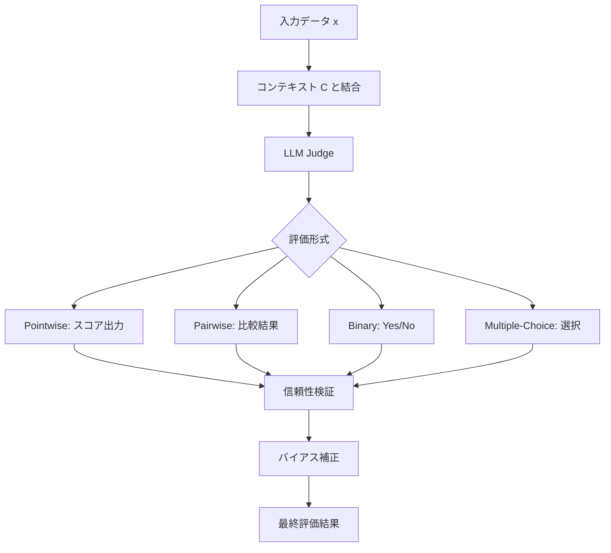
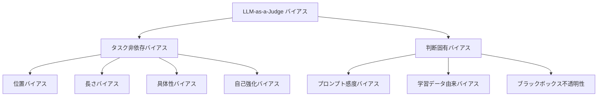
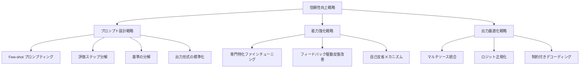

## 論文概要（Abstract）

本論文は、LLM（大規模言語モデル）を評価者として活用する「LLM-as-a-Judge」パラダイムに関する包括的サーベイである。著者らは、評価形式（pointwise/pairwise/binary/multiple-choice）、バイアスの分類（位置バイアス・冗長性バイアス・自己強化バイアスなど）、信頼性向上のための戦略（プロンプト設計・能力強化・出力最適化）を体系的に整理し、実世界での展開における課題と今後の方向性を論じている。v6（2025年10月版）では新たなベンチマークの提案も含まれている。

この記事は [Zenn記事: LangSmithで本番エージェント障害を分析しCI/CDテストを自動化する](https://zenn.dev/0h_n0/articles/388cece782e5b6) の深掘りです。Zenn記事ではLLM-as-JudgeをOnline Evaluationに活用しているが、本サーベイはその理論的基盤を提供する。

本記事は [https://arxiv.org/abs/2411.15594](https://arxiv.org/abs/2411.15594) の解説記事です。

## 情報源

| 項目 | 内容 |
|------|------|
| arXiv ID | 2411.15594 (v6) |
| URL | [https://arxiv.org/abs/2411.15594](https://arxiv.org/abs/2411.15594) |
| 著者 | Jiawei Gu, Xuhui Jiang, Zhichao Shi, et al. (16名) |
| 年 | 2024年11月初版 / 2025年10月v6 |
| カテゴリ | cs.CL, cs.AI |
| ライセンス | CC0 1.0 (Public Domain) |
| プロジェクトページ | [awesome-llm-as-a-judge.github.io](https://awesome-llm-as-a-judge.github.io) |

## 背景と動機

人間による評価は正確性と一貫性の面で高い品質を持つが、コスト・スケーラビリティ・再現性の課題がある。特にLLMの出力品質を評価するタスクでは、評価者間の一致率が低く、主観性が排除しにくい。従来の自動評価指標（BLEU、ROUGEなど）は表層的な一致度しか測定できず、意味的な品質評価には限界がある。

著者らは、LLMが人間評価者に匹敵する評価能力を発揮しうることに着目し、LLM-as-a-Judgeパラダイムの体系的な整理を行った。このアプローチは、テキスト生成の品質評価だけでなく、コード生成・対話システム・要約・翻訳など多岐にわたるタスクで適用が広がっている。しかし、LLM評価者にはバイアスや一貫性の課題が存在するため、信頼性の向上が不可欠である。

## 主要な貢献

著者らの主要な貢献は以下の通りである。

- **評価形式の体系的分類**: Pointwise、Pairwise、Binary（Yes/No）、Multiple-Choiceの4形式を整理し、それぞれの特性と適用場面を明確化した
- **バイアスの包括的分類**: タスク非依存バイアス（位置・長さ・具体性・自己強化）と判断固有バイアスを分類し、各バイアスの発生メカニズムと対策を整理した
- **信頼性向上戦略の3層フレームワーク**: プロンプト設計戦略・能力強化戦略・出力最適化戦略の3層で信頼性向上手法を体系化した
- **ベンチマーク・メタ評価の整理**: LLM評価者の評価（メタ評価）に用いるベンチマークと指標を網羅的に整理した

## 技術的詳細

### 評価の基本定式化

著者らは、LLM-as-a-Judgeの評価プロセスを以下のように定式化している。

$$
\mathcal{E} \leftarrow \mathcal{P}_{\text{LLM}}(x \oplus \mathcal{C})
$$

ここで各変数は以下を意味する。

- $\mathcal{E}$: 評価出力（スコア、選択、ラベル、または文章）
- $\mathcal{P}_{\text{LLM}}$: LLMの確率関数
- $x$: 入力データ（評価対象のテキスト）
- $\mathcal{C}$: コンテキスト（プロンプト、評価基準、参照情報など）
- $\oplus$: 入力とコンテキストの結合操作

### 評価形式の比較

著者らは4つの主要な評価形式を定義している。

| 評価形式 | 出力 | 特徴 | 主な用途 |
|----------|------|------|----------|
| Pointwise（スコアベース） | 離散スコア（1-5）または連続スコア（0-1） | 絶対評価、複数次元対応 | テキスト品質、要約、翻訳 |
| Pairwise（比較ベース） | Win/Tie/Loss | 相対評価、一貫性が高い | モデル比較、RLHF報酬モデル |
| Binary（Yes/No） | 二値判定 | 事実正確性の検証に適する | ファクトチェック、安全性評価 |
| Multiple-Choice | 選択肢から選択 | 幅広い評価が可能 | 理解度テスト、多段階評価 |

#### Pointwise評価の定式化

Pointwise評価では、評価対象 $r$ に対してスコア $s$ を直接付与する。

$$
s = f_{\text{judge}}(q, r, \mathcal{C}_{\text{criteria}})
$$

ここで $q$ は質問・プロンプト、$r$ は応答、$\mathcal{C}_{\text{criteria}}$ は評価基準である。多次元評価の場合、各次元 $d_i$ について個別にスコアリングし、集約する。

$$
s_{\text{overall}} = \sum_{i=1}^{D} w_i \cdot s_{d_i}, \quad \sum_{i=1}^{D} w_i = 1
$$

$w_i$ は各次元の重み、$D$ は次元数である。G-Evalなどのフレームワークでは、accuracy、coherence、factuality、comprehensivenessの各次元を1-3のLikert尺度で評価し、1-5の総合スコアに集約する方式が採用されている。

#### Pairwise評価の定式化

Pairwise評価では、2つの応答 $r_A, r_B$ を比較し、優劣を判定する。

$$
\text{result} = g_{\text{judge}}(q, r_A, r_B, \mathcal{C}_{\text{criteria}}) \in \{\text{Win}_A, \text{Tie}, \text{Win}_B\}
$$

著者らは、Pairwise評価がPointwise評価と比較して人間の判断との一致率が高く、一貫性に優れると報告している。これは人間にとっても2つの選択肢を比較する方がスコアを付けるよりも容易であることと整合的である。

### 評価形式の全体像

以下の図は、LLM-as-a-Judgeの評価プロセスの全体構造を示す。



## バイアスの分類と対策

### バイアスの分類体系

著者らは、LLM-as-a-Judgeにおけるバイアスを大きく2つのカテゴリに分類している。



#### 位置バイアス（Position Bias）

Pairwise評価において、応答の提示順序が判定結果に影響を与える現象である。例えば、先に提示された応答（Position 1）が優先的に高く評価される傾向がある。

**対策: スワップ拡張（Swap Augmentation）**

位置バイアスを緩和する基本的な手法として、スワップ拡張がある。同じペアについて提示順序を入れ替えた2回の評価を行い、結果を集約する。

$$
\text{result}_{\text{final}} = \text{Aggregate}\bigl(g(q, r_A, r_B), \; g(q, r_B, r_A)\bigr)
$$

一致する場合はその結果を採用し、不一致の場合はTie（引き分け）とする。

```python
from dataclasses import dataclass
from enum import Enum
from typing import Protocol


class JudgeResult(Enum):
    """LLM-as-a-Judge の判定結果。"""
    WIN_A = "win_a"
    WIN_B = "win_b"
    TIE = "tie"


class LLMJudge(Protocol):
    """LLM評価者のプロトコル。"""
    def evaluate(self, query: str, response_a: str, response_b: str) -> JudgeResult:
        """2つの応答を比較し判定結果を返す。"""
        ...


@dataclass
class SwapAugmentedResult:
    """スワップ拡張による補正済み結果。"""
    original: JudgeResult
    swapped: JudgeResult
    final: JudgeResult


def swap_augmented_judge(
    judge: LLMJudge,
    query: str,
    response_a: str,
    response_b: str,
) -> SwapAugmentedResult:
    """スワップ拡張で位置バイアスを緩和した評価を行う。

    Args:
        judge: LLM評価者インスタンス
        query: 評価対象の質問
        response_a: 応答A
        response_b: 応答B

    Returns:
        スワップ拡張による補正済み結果
    """
    original = judge.evaluate(query, response_a, response_b)

    swapped_raw = judge.evaluate(query, response_b, response_a)
    swapped = _invert_result(swapped_raw)

    if original == swapped:
        final = original
    else:
        final = JudgeResult.TIE

    return SwapAugmentedResult(
        original=original,
        swapped=swapped,
        final=final,
    )


def _invert_result(result: JudgeResult) -> JudgeResult:
    """判定結果を反転する（AとBを入れ替え）。"""
    if result == JudgeResult.WIN_A:
        return JudgeResult.WIN_B
    elif result == JudgeResult.WIN_B:
        return JudgeResult.WIN_A
    return JudgeResult.TIE
```

#### 長さバイアス（Length/Verbosity Bias）

LLM評価者が、内容の質に関わらず長い応答を高く評価する傾向である。著者らは、この傾向がLLMの学習データにおける「長い回答 = 詳細な回答」という暗黙の仮定に起因すると指摘している。対策としては、評価基準に「簡潔さ」を明示的に含める方法や、長さを正規化した上で評価する方法がある。

#### 自己強化バイアス（Self-Enhancement Bias）

LLMが自身の生成した出力を他のモデルの出力よりも高く評価する傾向である。例えば、GPT-4をJudgeとして使用した場合、GPT-4が生成した応答を他のモデルの応答より高く評価する可能性がある。この問題は、モデル選択の公平性に直接影響するため、対策が不可欠である。

#### 具体性バイアス（Concreteness Bias）

具体的な記述を含む応答が、抽象的な記述よりも高く評価される傾向である。数値やコード例を含む応答が、概念的な説明よりも優先される場合がある。

### バイアスの発生メカニズム

著者らは、バイアスの発生源として以下の3つを挙げている。

1. **学習データの偏り**: 事前学習データに含まれる評価パターンの偏りが、評価行動に反映される
2. **プロンプトへの感度**: 評価プロンプトの微小な変更が評価結果に大きく影響する（論文ではminor prompt changesと表現）
3. **生成の確率的性質**: LLMの確率的な生成過程に由来する評価のばらつき

## 信頼性向上戦略

著者らは、信頼性向上戦略を3つの層に分類している。

### A. プロンプト設計戦略（Prompt Design Strategy）

入力段階での改善を行う手法群である。

**タスク理解の向上**:
- **Few-shot プロンプティング**: FActScore、GPTScoreなどで採用されている手法。評価例を数件提示し、評価基準の解釈を明確にする
- **評価ステップの分解**: G-Evalフレームワークでは、評価プロセスをchain-of-thought的に複数ステップに分解する。これにより、単一の直感的判断ではなく、構造化された推論に基づく評価が可能になる
- **基準の分解**: HD-Evalでは、階層的に評価基準を分解し、各基準を個別に評価した後に集約する

**出力形式の標準化**:
- 構造化された出力形式の強制（JSON、特定のフレーズで開始する制約など）
- 評価理由の明示を必須とする設計
- Few-shotによる期待される出力形式の提示

### B. 能力強化戦略（Capability Enhancement Strategy）

モデル自体の評価能力を向上させる手法群である。

**専門特化ファインチューニング**:

著者らは、LLM評価者の能力を向上させるためのファインチューニング手法を複数紹介している。

| モデル名 | ベースモデル | 学習データ | 特徴 |
|----------|-------------|-----------|------|
| PandaLM | LLaMA | Alpaca + GPT-3.5アノテーション | ペアワイズ比較に特化 |
| JudgeLM | 非公開 | 人間アノテーション + LLMアノテーション | 多次元評価対応 |
| Auto-J | 非公開 | 多様なタスクの評価データ | 汎用評価能力 |
| Prometheus | Llama系 | GPT-4による数千の評価基準 | 細粒度フィードバック生成 |

Prometheusは特筆すべきアプローチであり、著者らによると「数千の評価基準を定義し、GPT-4に基づくフィードバックデータセットを構築して、細粒度の評価モデルをファインチューニングする」手法である。これにより、汎用LLMよりも安定した評価が可能になるとされている。

**フィードバック駆動反復改善**:
- Self-taught evaluator: 合成データを活用した自己学習型評価者
- Reflexionフレームワーク: 自己反省メカニズムによる反復的改善

### C. 出力最適化戦略（Final Output Optimization Strategy）

評価出力の後処理による改善手法群である。

**マルチソース統合**:

複数のLLM評価者の結果を統合することで、個別の評価者のバイアスを緩和する。

$$
s_{\text{ensemble}} = \frac{1}{N} \sum_{j=1}^{N} s_j
$$

ここで $s_j$ は $j$ 番目のLLM評価者のスコア、$N$ は評価者数である。単純平均のほか、重み付き集約や多数決なども適用可能である。

**ロジット正規化**:

出力ロジットを0-1の確率範囲に正規化し、トークンレベルの確率から評価スコアを構成する手法である。G-Evalでは、各評価ステップの出力トークンの確率を用いて、より安定したスコアリングを実現している。

$$
P(s = k) = \frac{\exp(z_k)}{\sum_{k'} \exp(z_{k'})}
$$

$$
s_{\text{calibrated}} = \sum_{k=1}^{K} k \cdot P(s = k)
$$

ここで $z_k$ はスコア $k$ に対応するトークンのロジット値、$K$ はスコアの最大値である。この手法により、離散的なスコアではなく連続的な期待値としてスコアを算出でき、評価の安定性が向上する。

**制約付きデコーディング**:

DOMINO、XGrammar、SGLangなどのフレームワークでは、有効なJSON形式や所定の構造化出力を保証する制約付きデコーディングを採用し、パース不能な出力の発生を防いでいる。

### 信頼性向上戦略の全体像



## 実験結果

### 評価形式間の比較

著者らは、Pairwise評価がPointwise評価と比較して人間の判断との一致率が高いと報告している。これは、相対的な比較が絶対的なスコアリングよりも判断の一貫性を維持しやすいためである。

### モデル性能の観察

著者らは以下の傾向を報告している。

- **GPT-4ベース評価者**: 専門的な人間評価者と比較して高い一致率を示す。特にPairwise評価形式において顕著である
- **ファインチューニングモデル**: 学習データの範囲内では高い性能を示すが、学習データ外の領域への汎化性能が低い傾向がある
- **オープンソースモデル**: 商用モデルと比較して一貫性に課題があり、人間の判断との不一致が見られる場合がある

### スコアベース評価の課題

著者らは、スコアベース評価（Pointwise）における課題として、「inconsistent inter-rater reliability（評価者間信頼性の不一致）」を挙げている。同一の評価対象に対して、異なる実行で異なるスコアが付与される問題である。この問題は、ロジット正規化やマルチソース統合によって緩和可能であるとされている。

### メタ評価の重要性

著者らは、LLM評価者を評価するための「メタ評価」ベンチマークが未だ発展途上であることを指摘している。評価者の時間的安定性（モデルバージョン間での一貫性）やドメイン固有の信頼性要件が十分に検証されていないことが課題である。

## 実運用への応用

### LangSmith CI/CDとの接続

本サーベイの知見は、[Zenn記事](https://zenn.dev/0h_n0/articles/388cece782e5b6)で紹介されているLangSmithを用いたOnline Evaluationの設計に直接的に関連する。

**評価形式の選択**: Zenn記事ではLLM-as-Judgeを本番エージェントの品質評価に使用している。本サーベイの知見に基づくと、CI/CDパイプラインでの回帰テストにはPointwise評価（合格/不合格の閾値判定）が適しており、モデル更新時の比較にはPairwise評価が適している。

**バイアス対策の実装**: 本番環境でのLLM-as-Judge運用では、位置バイアスへのスワップ拡張や、複数モデルによるアンサンブル評価を組み込むことで信頼性を向上できる。LangSmithのカスタム評価関数にこれらの手法を実装することが可能である。

**信頼性モニタリング**: 本サーベイが指摘するメタ評価の重要性は、LangSmithでの評価結果の継続的モニタリングに該当する。評価者自体のドリフト（モデルバージョン変更やAPIの変動による評価基準の変化）を検出する仕組みが推奨される。

```python
from dataclasses import dataclass


@dataclass
class EvaluationConfig:
    """LLM-as-a-Judge の評価設定。

    本サーベイの知見に基づき、CI/CDパイプラインでの
    評価戦略を構成する。
    """
    evaluation_format: str  # "pointwise" or "pairwise"
    use_swap_augmentation: bool = True
    ensemble_size: int = 3
    score_threshold: float = 0.7
    require_explanation: bool = True

    def to_prompt_suffix(self) -> str:
        """評価プロンプトの末尾に追加する制約文を生成する。"""
        parts: list[str] = []
        if self.require_explanation:
            parts.append(
                "評価理由を先に述べ、最後の行でスコアを出力してください。"
            )
        if self.evaluation_format == "pointwise":
            parts.append(
                f"スコアは0.0-1.0の範囲で、{self.score_threshold}以上を合格とします。"
            )
        return "\n".join(parts)
```

### 設計上の推奨事項

本サーベイから導出される実運用への推奨事項は以下の通りである。

1. **評価基準の明示化**: 曖昧な基準は評価のばらつきを増大させる。G-Evalのように基準を分解し、各基準に具体的なスコアリング指針を設ける
2. **スワップ拡張の標準採用**: Pairwise評価を使用する場合、スワップ拡張を標準的に適用し、位置バイアスを緩和する
3. **アンサンブル評価**: 重要な判定には複数モデルによる評価を行い、一致率をモニタリングする
4. **継続的なメタ評価**: 評価者自体の品質を定期的に検証し、人間評価とのキャリブレーションを実施する

## 関連研究

本サーベイに関連する主要な研究を以下に示す。

- **G-Eval (Liu et al., 2023)**: GPT-4を用いた自然言語生成の評価フレームワーク。chain-of-thoughtに基づく評価ステップ分解と、トークン確率による連続スコアリングを提案した。LLM-as-a-Judgeの代表的な実装の1つである
- **Prometheus (Kim et al., 2024)**: GPT-4による数千の評価基準とフィードバックデータセットを構築し、オープンソースの細粒度評価モデルをファインチューニングした。商用APIに依存しない評価者の構築を目指す研究である
- **Chatbot Arena / MT-Bench (Zheng et al., 2023)**: LLM-as-a-Judgeの有効性を大規模に検証したプラットフォームとベンチマーク。Pairwise評価による人間とLLMの一致率を体系的に分析し、LLM-as-a-Judgeの実用性を示した

## まとめと今後の展望

本サーベイは、LLM-as-a-Judgeの評価形式・バイアス・信頼性向上戦略を3層のフレームワークとして整理した点に学術的価値がある。特に、バイアスの体系的分類と対策の整理は、実運用での評価システム設計に有用である。著者らは今後の課題として、メタ評価ベンチマークの発展、モデルバージョン間の時間的安定性の検証、ドメイン固有の信頼性基準の策定を挙げている。LangSmithなどのプラットフォームでLLM-as-a-Judgeを運用する際には、本サーベイの知見を活用してバイアス対策と信頼性モニタリングを設計に組み込むことが推奨される。

## 参考文献

- Gu, J., Jiang, X., Shi, Z., et al. (2024). "A Survey on LLM-as-a-Judge." arXiv:2411.15594. [https://arxiv.org/abs/2411.15594](https://arxiv.org/abs/2411.15594)
- Zenn記事: LangSmithで本番エージェント障害を分析しCI/CDテストを自動化する. [https://zenn.dev/0h_n0/articles/388cece782e5b6](https://zenn.dev/0h_n0/articles/388cece782e5b6)
- Liu, Y., et al. (2023). "G-Eval: NLG Evaluation using GPT-4 with Better Human Alignment." arXiv:2303.16634.
- Kim, S., et al. (2024). "Prometheus: Inducing Fine-grained Evaluation Capability in Language Models." arXiv:2310.08491.
- Zheng, L., et al. (2023). "Judging LLM-as-a-Judge with MT-Bench and Chatbot Arena." arXiv:2306.05685.
