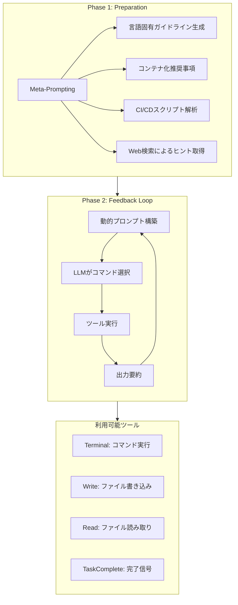
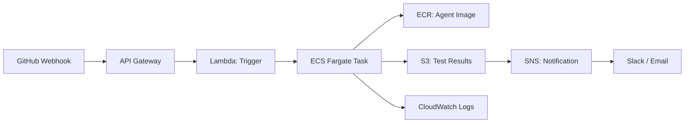

本記事は [You Name It, I Run It: An LLM Agent to Execute Tests of Arbitrary Projects](https://arxiv.org/abs/2412.10133) (Isaku et al., 2024) の解説記事です。

この記事は [Zenn記事: LangSmithで本番エージェント障害を分析しCI/CDテストを自動化する](https://zenn.dev/0h_n0/articles/388cece782e5b6) の深掘りです。Zenn記事ではLangSmithを活用したCI/CDテスト自動化を扱っていますが、本論文はその前段階であるテスト実行基盤そのものをLLMエージェントで自動構築するアプローチを提案しています。

## 情報源

- **arXiv ID**: 2412.10133
- **URL**: [https://arxiv.org/abs/2412.10133](https://arxiv.org/abs/2412.10133)
- **著者**: Isaku et al.
- **発表年**: 2024年12月
- **分野**: cs.SE (Software Engineering)

## 背景と動機（Background & Motivation）

ソフトウェアプロジェクトのテスト実行は、一見単純に見えて実際には多くの暗黙知を必要とする作業である。プロジェクトごとにビルドシステム（Maven, Gradle, CMake, Makefile等）、パッケージマネージャ（pip, npm, cargo等）、ランタイムバージョン、そしてOS固有の依存関係が異なり、テストを実行するためだけに相当な環境構築の手間がかかる。

この問題は特に以下の場面で顕著になる。

1. **研究目的のテスト再現**: ソフトウェア工学研究では多数のOSSプロジェクトを対象にテストを実行する必要があるが、プロジェクトごとの環境構築が研究のボトルネックになる
2. **CI/CDパイプラインの初期構築**: 新規プロジェクトやフォークしたリポジトリでテスト実行環境を一から構築する際、ドキュメントが不十分なプロジェクトでは試行錯誤が避けられない
3. **多言語・多フレームワーク環境**: マイクロサービスアーキテクチャでは、異なる言語・フレームワークのサービスそれぞれにテスト環境を構築する必要がある

従来のアプローチとしては、言語固有のツール（Pythonの`tox`、Javaの`Maven Surefire Plugin`等）やCI/CDテンプレートが存在するが、これらは特定の言語・ビルドシステムに限定されており、汎用的なソリューションにはなり得ない。Flapyのようなテスト実行フレームワークもPython専用であり、他言語への適用は困難である。

著者らは、この「任意のプロジェクトのテストを自動実行する」という課題に対し、LLMエージェントによる自律的な環境構築・テスト実行というアプローチを提案している。

## 主要な貢献（Key Contributions）

- **貢献1**: 14言語・50プロジェクトを対象に、ビルドシステムの認識からテスト実行までを自律的に行うLLMエージェント「ExecutionAgent」を設計・実装
- **貢献2**: 事前準備フェーズ（メタプロンプティングによる言語固有ガイドライン生成）とフィードバックループフェーズ（反復的なコマンド実行・エラー修正）の2段階アーキテクチャを提案
- **貢献3**: 50プロジェクト中33プロジェクト（66%）でテスト実行に成功し、次善のベースライン（LLM生成スクリプト: 5/50）を6.6倍上回る性能を実証
- **貢献4**: アブレーション実験により、事前準備フェーズとフィードバックループの両方がテスト実行成功に不可欠であることを定量的に検証

## 技術的詳細（Technical Details）

### アーキテクチャ概要

ExecutionAgentは2つのフェーズから構成される。Phase 1（Preparation）でプロジェクト固有の情報を収集し、Phase 2（Feedback Loop）で実際のコマンド実行と結果に基づく反復的な修正を行う。



### Phase 1: Preparation（事前準備）

事前準備フェーズでは、ハードコードされたルールに頼らず、メタプロンプティングによってLLMに対象プロジェクトの言語・フレームワークに応じたガイドラインを動的に生成させる。

具体的には以下の4つの情報を収集する。

| 収集項目 | 説明 | 例 |
|---------|------|-----|
| 言語固有ガイドライン | ビルド・テスト実行手順の一般的知識 | "Javaプロジェクトでは`mvn test`を実行" |
| コンテナ化推奨事項 | Docker環境での実行に関する注意点 | ベースイメージ選択、権限設定 |
| CI/CDスクリプト位置 | 既存のCI設定ファイルの特定 | `.github/workflows/`, `.travis.yml` |
| Web検索ヒント | プロジェクト固有のビルド手順 | READMEに記載されていない依存関係 |

この「メタプロンプティング」アプローチにより、新しい言語やフレームワークが登場してもエージェント自体のコードを変更する必要がない。LLMの持つ最新の知識がそのまま活用される。

### Phase 2: Feedback Loop（フィードバックループ）

フィードバックループは内側ループと外側ループのネスト構造で構成される。

$$
\text{Total Budget} = N_{\text{outer}} \times N_{\text{inner}}
$$

ここで、$N_{\text{outer}}$ は外側ループの最大試行回数（デフォルト3回）、$N_{\text{inner}}$ は内側ループの最大コマンド数（デフォルト40回）を表す。

内側ループの各ステップでは以下が実行される。

1. **コマンド選択**: LLMが現在のプロンプト（プロジェクト情報 + 過去のコマンド履歴 + エラーログ）に基づいて次のコマンドを決定
2. **ツール実行**: Terminal、Write、Read、TaskCompleteの4つのツールから適切なものを呼び出す
3. **出力要約**: 冗長なコマンド出力をLLMで要約し、プロンプト長の肥大化を防止

外側ループでは、内側ループが失敗した場合に過去の試行から「教訓」を抽出し、次の試行に反映させる。

### アルゴリズム（擬似コード）

```python
from dataclasses import dataclass, field
from typing import Optional


@dataclass
class AttemptHistory:
    """1回の試行の履歴を保持する。"""
    commands: list[dict] = field(default_factory=list)
    lessons_learned: str = ""


def execution_agent(
    project_path: str,
    max_outer: int = 3,
    max_inner: int = 40,
) -> Optional[str]:
    """ExecutionAgentのメインループ。

    Args:
        project_path: 対象プロジェクトのルートパス
        max_outer: 外側ループの最大試行回数
        max_inner: 内側ループの最大コマンド数

    Returns:
        テスト実行結果の文字列。失敗時はNone
    """
    # Phase 1: Preparation
    context = compile_context(
        meta_prompt_guidelines(project_path),
        locate_ci_scripts(project_path),
        search_web_hints(project_path),
    )
    histories: list[AttemptHistory] = []

    # Phase 2: Feedback Loop (outer)
    for _ in range(max_outer):
        history = AttemptHistory()
        prompt = build_dynamic_prompt(context, histories)

        for _ in range(max_inner):
            action = llm_select_action(prompt)
            if action.tool_type == "task_complete":
                return action.output
            result = execute_tool(action)
            history.commands.append(result)
            prompt = update_prompt(prompt, result, summarize_output(result))

        history.lessons_learned = extract_lessons(history)
        histories.append(history)
    return None
```

### ツール使用パターンの分析

著者らは、50プロジェクトに対するExecutionAgentの実行軌跡を分析し、ツール呼び出しの分布を報告している。

| ツール種別 | 全呼び出しに占める割合 |
|-----------|---------------------|
| Terminal（コマンド実行） | 74.8% |
| Write（ファイル書き込み） | 16.0% |
| Read（ファイル読み取り） | 8.2% |
| TaskComplete（完了通知） | 1.0% |

Terminalコマンドの内訳としては、パッケージインストール（`apt`、`pip`、`npm`等）が21%、ファイル・ディレクトリ探索（`ls`、`cd`、`pwd`等）が33%、その他の専門的操作が46%であると報告されている。

1プロジェクトあたりの平均コマンド数は16（範囲: 7--31）であり、人間の開発者がプロジェクトをセットアップする際の典型的な手順（ドキュメント確認 -> 依存関係インストール -> テスト実行・検証）と類似したパターンが観察されている。

## 実装のポイント（Implementation Notes）

### ビルドシステム認識の実装例

ExecutionAgentの核となるのは、プロジェクトのディレクトリ構造からビルドシステムを動的に認識する能力である。以下に、この考え方を実装するコード例を示す。

```python
from dataclasses import dataclass
from pathlib import Path


@dataclass(frozen=True)
class BuildSystemInfo:
    """ビルドシステムの検出結果を表現する。"""
    name: str
    config_file: str
    test_command: str
    install_command: str
    language: str


BUILD_SYSTEM_SIGNATURES: dict[str, BuildSystemInfo] = {
    "pom.xml": BuildSystemInfo("Maven", "pom.xml", "mvn test", "mvn install -DskipTests", "Java"),
    "package.json": BuildSystemInfo("npm", "package.json", "npm test", "npm install", "JavaScript"),
    "pyproject.toml": BuildSystemInfo("Python", "pyproject.toml", "pytest", "pip install -e '.[dev]'", "Python"),
    "Cargo.toml": BuildSystemInfo("Cargo", "Cargo.toml", "cargo test", "cargo build", "Rust"),
    "CMakeLists.txt": BuildSystemInfo("CMake", "CMakeLists.txt", "ctest", "cmake --build build", "C/C++"),
}


def detect_build_systems(project_root: Path) -> list[BuildSystemInfo]:
    """プロジェクトルートからビルドシステムを検出する。

    Args:
        project_root: プロジェクトのルートディレクトリ

    Returns:
        検出されたビルドシステム情報のリスト
    """
    return [
        info for sig, info in BUILD_SYSTEM_SIGNATURES.items()
        if (project_root / sig).exists()
    ]
```

### 動的プロンプト構築

フィードバックループでは、各ステップの結果を踏まえてプロンプトを動的に更新する。出力の要約により、プロンプト長の膨張を抑制しつつ必要な情報を保持する。

```python
@dataclass
class DynamicPrompt:
    """フィードバックループ用の動的プロンプトを管理する。"""
    preparation_context: str
    command_history: list[str]
    current_errors: list[str]
    lessons_from_previous: list[str]
    max_history_length: int = 20

    def build(self) -> str:
        """LLMに送信するプロンプト文字列を構築する。"""
        sections = [f"## Project Context\n{self.preparation_context}"]
        if self.lessons_from_previous:
            lessons = "\n".join(f"- {l}" for l in self.lessons_from_previous)
            sections.append(f"## Lessons from Previous Attempts\n{lessons}")
        recent = self.command_history[-self.max_history_length:]
        sections.append(f"## Recent Command History\n" + "\n".join(recent))
        if self.current_errors:
            sections.append(f"## Current Errors\n" + "\n".join(self.current_errors[-5:]))
        return "\n\n".join(sections)
```

## Production Deployment Guide

ExecutionAgentのアプローチをCI/CDパイプラインに統合し、本番環境で安全に運用するためのガイドを示す。

### アーキテクチャ設計

AWSを基盤とした構成例を以下に示す。ExecutionAgentをコンテナ化し、GitHub Webhookトリガーで起動する構成とする。



### コンテナ構成

ExecutionAgentはDocker-in-Docker（DinD）パターンまたはSysbox等のセキュアコンテナランタイムで実行する。エージェントが任意のコマンドを実行する特性上、セキュリティの隔離が重要である。

コンテナ設定としては、ベースイメージに`ubuntu:22.04`、メモリ上限4GB、CPU 2コア、タイムアウト2時間を推奨する。隔離レベルにはSysboxを採用し、ネットワークポリシーでパッケージレジストリ（PyPI、npm、Maven Central、crates.io）のみアクセスを許可する。コスト上限は1実行あたり$1.0とし、外側ループ3回・内側ループ40コマンドの予算制約をそのまま適用する。

### セキュリティ対策

エージェントが任意のコマンドを実行するため、以下のセキュリティレイヤーを設ける。

1. **ネットワーク制限**: パッケージレジストリ（PyPI、npm、Maven Central等）へのアクセスのみ許可し、それ以外のアウトバウンド通信をブロック
2. **ファイルシステム隔離**: プロジェクトディレクトリ以外への書き込みを禁止。`/etc`、`/usr`等のシステムディレクトリは読み取り専用マウント
3. **リソース制限**: メモリ、CPU、ディスクI/O、実行時間に上限を設定し、リソース枯渇攻撃を防止
4. **コスト制御**: LLM API呼び出しのコストを監視し、閾値（論文の結果から1実行あたり$1.0を推奨）を超えた場合に自動停止

実装としては、ブロック対象コマンドリスト（`rm -rf /`、`curl | bash`等）を保持する`SecurityPolicy`クラスでコマンド発行前の検証を行い、ファイルサイズ上限（100MB）とディスク使用量上限（5GB）を設ける構成が有効である。

### コスト最適化

著者らの報告によると、ExecutionAgentの1プロジェクトあたりの平均コストは$0.16、平均実行時間は74分である。本番運用では以下の最適化が有効である。

- **キャッシュ層の導入**: 同一プロジェクトの再実行時に、前回成功したコマンド列をキャッシュとして再利用する。環境構築ステップ（依存関係インストール等）のスキップにより、コストと時間の両方を削減できる
- **段階的実行**: まず低コストのルールベース手法（Dockerfileの有無確認、CI設定ファイルの解析等）を試行し、失敗した場合のみLLMエージェントにフォールバックする
- **バッチ処理**: 複数プロジェクトのテスト実行をバッチ化し、ECS Fargateのスポットインスタンスを活用してコンピュート費用を抑制する

### モニタリングとオブザーバビリティ

実行結果の追跡には構造化ログを採用する。各ステップで`event`、`level`、`ts`、`request_id`、`duration_ms`を含むJSON形式のログを出力し、CloudWatch Logs InsightsやLangSmithと連携してコスト・成功率・実行時間のダッシュボードを構築する。失敗時には`error_type`、`error_message`を記録し、コマンド繰り返しパターンの検出やフィードバックループの改善に活用する。

## 実験結果（Experimental Results）

### 評価データセット

著者らは、14のプログラミング言語にまたがる50のオープンソースプロジェクトを評価対象として選定している。Java、Python、C、C++、JavaScriptが主要な対象言語であり、プロジェクトの規模やビルドシステムの複雑さは多様である。

### テスト実行成功率

著者らは、ExecutionAgentが50プロジェクト中33プロジェクト（66%）でテスト実行に成功したと報告している。段階的な成功率は以下の通りである。

| 段階 | 成功数/全体 | 成功率 |
|------|-----------|--------|
| ビルド・インストール完了 | 41/50 | 82% |
| テスト実行完了 | 33/50 | 66% |
| Ground Truthと一致 | 29/50 | 58% |

テスト実行に成功した33プロジェクトのうち、17プロジェクトでは手動実行と完全に同一の結果が得られている。残りの16プロジェクトでは平均15.4%の結果差異が生じたと報告されている。

### 言語別の成功率

| 言語 | テスト実行成功率 | 備考 |
|------|----------------|------|
| Java | 100% (5/5) | Maven/Gradleの標準化が寄与 |
| Python | 60% (6/10) | 仮想環境・依存関係の複雑さ |
| JavaScript | 40% (2/5) | ランタイムバージョン問題 |
| C/C++ | 低い | 非標準化ビルドプロセスが障壁 |

著者らは、Javaの高い成功率について、MavenやGradleといった標準化されたビルドシステムが広く採用されていることが要因であると分析している。一方、C/C++プロジェクトではMakefile、CMake、Autotools等の多様なビルドシステムが混在し、OS固有の依存関係（共有ライブラリ等）の解決も求められるため、成功率が低くなると報告されている。

### ベースラインとの比較

| 手法 | ビルド成功 | テスト実行成功 |
|------|----------|--------------|
| ExecutionAgent | 41/50 | 33/50 |
| LLM生成スクリプト | 29/50 | 5/50 |
| AutoGPT | 9/50 | 4/50 |
| Flapy (Python専用) | 6/10 | 0/10 |

著者らは、ExecutionAgentが次善のベースライン（LLM生成スクリプト）と比較して、テスト実行成功数で6.6倍の性能を達成したと報告している。LLM生成スクリプトはビルドまでは29/50で成功するものの、テスト実行の段階で大幅に失敗する。これは、テスト実行に必要な追加の設定（テスト用データベースの起動、環境変数の設定等）がスクリプト生成時に考慮されないためであると分析されている。

AutoGPTはビルド段階から9/50と低い成功率であり、汎用エージェントフレームワークでは本タスクに必要な専門的なワークフロー（CI/CDスクリプトの解析、言語固有のビルド手順等）を効率的に実行できないことが示されている。

### アブレーション実験

10プロジェクトのサブセットに対するアブレーション実験の結果を著者らは報告している。

| 構成 | ビルド成功 | テスト実行成功 |
|------|----------|--------------|
| Full ExecutionAgent | 8/10 | 7/10 |
| Preparationなし | 1/10 | 0/10 |
| Feedback Loopなし | 7/10 | 1/10 |

Preparationフェーズを除去すると、ビルド自体がほぼ不可能になる（1/10）。これは、メタプロンプティングによる言語固有ガイドラインがなければ、エージェントが適切なビルドコマンドを選択できないことを意味する。Feedback Loopを除去するとビルドは可能（7/10）だが、テスト実行は1/10まで低下する。ビルドエラーやテスト設定の不足を反復的に修正するフィードバック機構が不可欠であることが確認されている。

### コスト分析

| 項目 | 値 |
|------|-----|
| 平均実行時間 | 74分/プロジェクト |
| 平均LLMコスト | $0.16/プロジェクト |
| 成功時の平均コスト | $0.10/プロジェクト |
| 失敗時の平均コスト | $0.34/プロジェクト |

著者らは、失敗時のコストが成功時の約3.4倍になると報告している。これは、失敗時に外側ループの再試行が発生し、LLM呼び出し回数が増加するためである。

### 失敗分析

著者らは、失敗プロジェクトの軌跡分析から以下のパターンを特定している。

1. **コマンド繰り返し**: エージェントが同一の失敗コマンド（例: 権限のない環境での`sudo`の繰り返し実行）を再試行し続ける問題
2. **環境設定の不完全さ**: 新しいバージョンのランタイム（Node.js、GCC等）をインストールした後、それをデフォルトとして設定し忘れるケース
3. **プロジェクト固有の複雑さ**: テスト用データベースの起動、外部サービスのモック設定、特殊なテスト前処理スクリプトの実行が必要なプロジェクトでの失敗

## 実運用への応用（Practical Applications）

### LangSmith CI/CDとの補完関係

関連するZenn記事で解説されているLangSmithベースのCI/CDテスト自動化と、ExecutionAgentは相互補完的な関係にある。

- **ExecutionAgent**: テスト実行基盤の自動構築（「テストをどう実行するか」の自動化）
- **LangSmith CI/CD**: テスト結果の分析・障害検知（「テスト結果をどう活用するか」の自動化）

両者を組み合わせることで、テスト基盤構築からテスト実行、結果分析、障害対応までのエンドツーエンドの自動化が実現可能である。

### 適用が想定されるシナリオ

1. **マイクロサービスのテスト統合**: 異なる言語で書かれた複数のサービスに対して、ExecutionAgentで統一的にテスト環境を構築し、LangSmithで横断的にテスト結果を追跡する
2. **OSSライブラリのセキュリティ監査**: 依存ライブラリのテストを自動実行し、バージョンアップ時のリグレッションを検出する
3. **レガシーシステムの移行**: ドキュメントが不十分なレガシープロジェクトのテスト環境を自動再構築し、リファクタリングの安全網とする

### 現時点の制約

- 単一構成のテスト（1つのOS、1つのランタイムバージョン）にのみ対応しており、マトリクステスト（複数バージョン・複数OS）への拡張は未対応
- エージェントのコマンド実行にはセキュリティリスクが伴うため、適切な隔離環境が必須
- C/C++プロジェクトのように、ビルドプロセスが高度に非標準化された領域では成功率に改善の余地がある

## 関連研究（Related Work）

- **SWE-bench** (Jimenez et al., 2024): GitHubのIssueからバグ修正を行うLLMエージェントのベンチマーク。テスト実行そのものではなく、テスト内容（バグ修正コード）の生成に焦点を置いている点でExecutionAgentと相補的である
- **AutoGPT** (Significant Gravitas, 2023): 汎用的なLLMエージェントフレームワーク。本論文のベースラインとして比較されており、テスト実行という専門タスクではExecutionAgentが大幅に優れた性能を示している
- **Flapy** (Gruber et al., 2021): Python専用のflaky test検出フレームワーク。テスト実行の自動化を試みているが、Pythonに限定されており、他言語のプロジェクトには適用できない
- **LDB** (Zhong et al., 2024): LLMを活用したデバッグエージェント。テスト失敗時のデバッグに焦点を置いており、テスト実行環境の構築は前提としている点でExecutionAgentとは対象範囲が異なる

## まとめと今後の展望

ExecutionAgentは、LLMエージェントの自律的な計画立案能力とツール使用能力を活用し、任意のソフトウェアプロジェクトのテスト実行を自動化する手法を示した。メタプロンプティングによる事前準備と反復的フィードバックループの2段階アーキテクチャにより、14言語・50プロジェクトの66%でテスト実行に成功している。

今後の研究方向としては以下が考えられる。

- **マトリクステストへの拡張**: 複数のランタイムバージョン・OS環境でのテスト実行を自動化するための戦略的な環境構成の探索
- **コマンド繰り返しの回避**: 失敗コマンドの検出と代替戦略への自動切り替え機構の実装
- **ビルドキャッシュの活用**: 類似プロジェクトの過去の成功パターンを転用し、初回成功率の向上とコスト削減を両立する
- **セキュリティの強化**: サンドボックス環境の改善と、エージェントが実行するコマンドのリアルタイム検証機構の導入

## 参考文献

1. Isaku et al., "You Name It, I Run It: An LLM Agent to Execute Tests of Arbitrary Projects," arXiv:2412.10133, 2024.
2. C. E. Jimenez et al., "SWE-bench: Can Language Models Resolve Real-World GitHub Issues?," ICLR 2024.
3. Significant Gravitas, "AutoGPT," GitHub, 2023. [https://github.com/Significant-Gravitas/AutoGPT](https://github.com/Significant-Gravitas/AutoGPT)
4. M. Gruber et al., "An Empirical Study of Flaky Tests in Python," ICSE 2021.
5. R. Zhong et al., "LDB: A Large Language Model Debugger via Verifying Runtime Execution Step by Step," arXiv:2402.16906, 2024.
