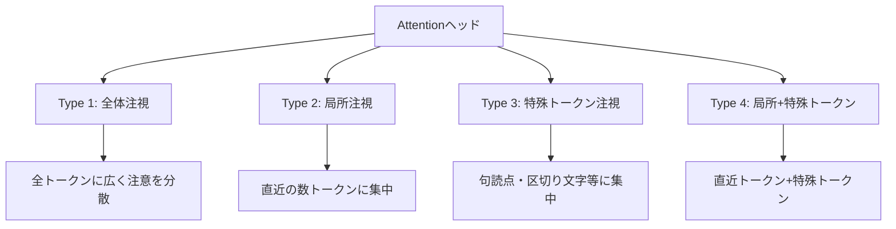
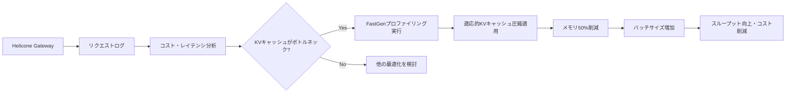

## 論文概要（Abstract）

本記事は [https://arxiv.org/abs/2310.01801](https://arxiv.org/abs/2310.01801) の解説記事です。

大規模言語モデル（LLM）の推論時に生成されるKey-Value（KV）キャッシュは、長いコンテキストや大きなバッチサイズにおいてGPUメモリの主要なボトルネックとなる。著者らは、Attentionモジュールの内部構造をプロファイリングし、その結果に基づいてKVキャッシュを適応的に圧縮する手法「FastGen」を提案している。従来のKVキャッシュ圧縮が全てのAttentionヘッドに一律の圧縮を適用するのに対し、FastGenはヘッドごとの注意パターンを分析し、最適な圧縮戦略を個別に適用する「profile-then-edit」パラダイムを採用する。著者らの報告によると、ファインチューニングや再学習なしでKVキャッシュメモリを最大50%削減し、生成品質の低下は無視できるレベルに抑えられている。

この記事は [Zenn記事: Heliconeセルフホストで始めるLLMコスト可視化と最適化](https://zenn.dev/0h_n0/articles/8ede678e9e4cd2) の深掘りです。Heliconeがリクエスト単位のコスト・レイテンシを可視化するのに対し、FastGenはモデル内部のAttention構造を「プロファイリング」（観測）し、その結果を最適化に直結させる手法であり、observabilityが実際のコスト削減に結びつく具体例として位置づけられる。

## 情報源

- **arXiv ID**: 2310.01801
- **URL**: [https://arxiv.org/abs/2310.01801](https://arxiv.org/abs/2310.01801)
- **著者**: Suyu Ge, Yunan Zhang, Liyuan Liu, Minjia Zhang, Jiawei Han, Jianfeng Gao（Microsoft Research / UIUC）
- **発表年**: 2023（ICLR 2024採択、Outstanding Paper Honorable Mention）
- **分野**: cs.CL, cs.LG
- **コード**: [https://github.com/machilusZ/FastGen](https://github.com/machilusZ/FastGen)

## 背景と動機（Background & Motivation）

LLMの自己回帰的な生成プロセスでは、過去のトークンに対するAttention計算の再実行を避けるため、各層のKey・Valueベクトルをキャッシュとして保持する。このKVキャッシュのメモリ消費量は、コンテキスト長 $n$、層数 $L$、ヘッド数 $H$、ヘッド次元 $d$ に対して以下のように増大する。

$$
\text{KVメモリ} = 2 \times L \times H \times n \times d \times \text{sizeof(dtype)}
$$

著者らは論文中で、Llama 1-65Bモデルの場合、単一のリクエストで最大320GBのKVキャッシュメモリが必要になりうると指摘している。この膨大なメモリ消費は、バッチサイズの制限、スループットの低下、そしてGPUコストの増大に直結する。

従来のKVキャッシュ削減手法には、量子化（KIVI等）やトークン削除（H2O等）があるが、これらは全てのAttentionヘッドに同一の圧縮戦略を適用する。著者らは、Attentionヘッドごとに注意パターンが大きく異なるという観察に基づき、画一的な圧縮は最適ではないと主張している。

## 主要な貢献（Key Contributions）

- **貢献1**: Attentionモジュールの内部構造が4つの異なるパターンに分類できることを発見し、体系的に分析した
- **貢献2**: 「profile-then-edit」パラダイムを提案し、軽量なプロファイリングに基づく適応的KVキャッシュ圧縮を実現した
- **貢献3**: ファインチューニングや再学習を一切必要とせず、既存モデルにプラグインとして適用可能な手法を設計した
- **貢献4**: Llama 1シリーズ（7B〜65B）での評価において、メモリを最大50%削減しつつ生成品質を維持することを実証した

## 技術的詳細（Technical Details）

### Attentionパターンの4分類

著者らはLLMのAttentionヘッドを解析し、以下の4つのパターンを特定している。



各パターンに対する最適な圧縮戦略は以下の通りである。

| パターン | 注意分布の特徴 | 最適な圧縮戦略 | 削減可能率 |
|---------|-------------|-------------|----------|
| Type 1: 全体注視 | 全トークンに均等分散 | 圧縮不可（完全KVキャッシュ保持） | 0% |
| Type 2: 局所注視 | 直近 $w$ トークンに集中 | 長距離コンテキストのKVを削除 | 高 |
| Type 3: 特殊トークン | 句読点等に集中 | 非特殊トークンのKVを削除 | 高 |
| Type 4: 局所+特殊 | Type 2とType 3の複合 | 直近 $w$ トークン + 特殊トークンのみ保持 | 中〜高 |

### Profile-then-Editパラダイム

FastGenの処理は2つのフェーズで構成される。

**Phase 1: プロファイリング**

少量のキャリブレーションデータ（論文では数百トークン）を用いて、各Attentionヘッドの注意パターンを分析する。具体的には、Attention重み行列 $A \in \mathbb{R}^{n \times n}$ を計算し、各ヘッドの注意分布の特性を判定する。

各ヘッド $h$ について、以下の指標を計算する。

$$
\text{LocalScore}(h) = \frac{1}{n} \sum_{i=1}^{n} \sum_{j=\max(1, i-w)}^{i} A_{ij}^{(h)}
$$

$$
\text{SpecialScore}(h) = \frac{1}{n} \sum_{i=1}^{n} \sum_{j \in \mathcal{S}} A_{ij}^{(h)}
$$

ここで、
- $n$: シーケンス長
- $w$: ローカルウィンドウサイズ
- $A_{ij}^{(h)}$: ヘッド $h$ における位置 $i$ から位置 $j$ へのAttention重み
- $\mathcal{S}$: 特殊トークン（句読点、区切り文字等）の位置集合

これらのスコアの閾値判定により、各ヘッドを4タイプのいずれかに分類する。

**Phase 2: 適応的KVキャッシュ構築**

プロファイリング結果に基づき、推論時にヘッドごとの圧縮ポリシーを適用する。

```python
from dataclasses import dataclass
from enum import Enum
from typing import Optional

import torch


class AttentionType(Enum):
    """Attentionヘッドの注意パターン分類"""
    FULL = "full"
    LOCAL = "local"
    SPECIAL = "special"
    LOCAL_SPECIAL = "local_special"


@dataclass
class HeadProfile:
    """各Attentionヘッドのプロファイル結果"""
    layer_idx: int
    head_idx: int
    attention_type: AttentionType
    local_score: float
    special_score: float


def classify_head(
    attention_weights: torch.Tensor,
    window_size: int = 64,
    special_positions: Optional[torch.Tensor] = None,
    local_threshold: float = 0.7,
    special_threshold: float = 0.3,
) -> AttentionType:
    """Attentionヘッドのパターンを分類する

    Args:
        attention_weights: Attention重み (seq_len, seq_len)
        window_size: ローカルウィンドウサイズ
        special_positions: 特殊トークンの位置
        local_threshold: 局所注視の閾値
        special_threshold: 特殊トークン注視の閾値

    Returns:
        分類されたAttentionタイプ
    """
    seq_len = attention_weights.size(0)

    local_mask = torch.zeros(seq_len, seq_len, device=attention_weights.device)
    for i in range(seq_len):
        start = max(0, i - window_size)
        local_mask[i, start:i + 1] = 1.0

    local_score = (attention_weights * local_mask).sum() / seq_len

    special_score = 0.0
    if special_positions is not None and len(special_positions) > 0:
        special_score = attention_weights[:, special_positions].sum() / seq_len

    is_local = local_score > local_threshold
    is_special = special_score > special_threshold

    if is_local and is_special:
        return AttentionType.LOCAL_SPECIAL
    elif is_local:
        return AttentionType.LOCAL
    elif is_special:
        return AttentionType.SPECIAL
    else:
        return AttentionType.FULL
```

### KVキャッシュの適応的圧縮

分類結果に基づき、各ヘッドのKVキャッシュを以下のように構築する。

$$
\text{KV}_{\text{compressed}}^{(h)} = \begin{cases}
\text{KV}_{\text{full}}^{(h)} & \text{if type}(h) = \text{FULL} \\
\text{KV}_{[i-w:i]}^{(h)} & \text{if type}(h) = \text{LOCAL} \\
\text{KV}_{\mathcal{S}}^{(h)} & \text{if type}(h) = \text{SPECIAL} \\
\text{KV}_{[i-w:i] \cup \mathcal{S}}^{(h)} & \text{if type}(h) = \text{LOCAL\_SPECIAL}
\end{cases}
$$

ここで $\text{KV}_{[i-w:i]}^{(h)}$ はヘッド $h$ における直近 $w$ トークン分のKVキャッシュ、$\text{KV}_{\mathcal{S}}^{(h)}$ は特殊トークン位置のKVキャッシュを表す。

この適応的な構築により、ヘッドごとに異なるKVキャッシュサイズが許容され、全体として大幅なメモリ削減が実現される。

## 実装のポイント（Implementation）

FastGenを実際に実装する際の重要な注意点を整理する。

**プロファイリングのコスト**: プロファイリングは推論開始前に一度だけ実行すればよい。著者らによると、数百トークンのキャリブレーションデータで安定したヘッド分類が得られる。この処理は数秒で完了し、結果をJSONファイルとして保存・再利用できる。

**ウィンドウサイズの選択**: ローカルウィンドウサイズ $w$ はタスク依存のハイパーパラメータである。著者らは $w = 64$ をデフォルト値として使用しているが、長い文脈依存性が重要なタスクでは $w$ を大きく設定する必要がある。

**特殊トークンの定義**: 特殊トークンの集合 $\mathcal{S}$ はトークナイザに依存する。一般的にはBOS/EOS、改行、句読点が含まれる。この定義がヘッド分類の精度に直接影響するため、対象ドメインに合わせた調整が推奨される。

**既存フレームワークとの統合**: FastGenはHugging Face Transformersのモデルに対してモンキーパッチ形式で適用できる。vLLMやTensorRT-LLMとの統合には、各フレームワークのKVキャッシュ管理APIに合わせたアダプタ実装が必要となる。

```python
import json
from pathlib import Path
from typing import Dict, List

import torch


def profile_model(
    model: torch.nn.Module,
    calibration_input_ids: torch.Tensor,
    window_size: int = 64,
) -> Dict[str, List[HeadProfile]]:
    """モデル全体のAttentionヘッドをプロファイリングする

    Args:
        model: LLMモデル
        calibration_input_ids: キャリブレーション用入力 (1, seq_len)
        window_size: ローカルウィンドウサイズ

    Returns:
        層ごとのHeadProfileリスト
    """
    profiles: Dict[str, List[HeadProfile]] = {}

    with torch.no_grad():
        outputs = model(
            calibration_input_ids,
            output_attentions=True,
        )

    for layer_idx, attn_weights in enumerate(outputs.attentions):
        layer_profiles = []
        num_heads = attn_weights.size(1)

        for head_idx in range(num_heads):
            head_attn = attn_weights[0, head_idx]
            attn_type = classify_head(
                head_attn,
                window_size=window_size,
            )
            layer_profiles.append(HeadProfile(
                layer_idx=layer_idx,
                head_idx=head_idx,
                attention_type=attn_type,
                local_score=0.0,
                special_score=0.0,
            ))

        profiles[f"layer_{layer_idx}"] = layer_profiles

    return profiles


def save_profiles(profiles: Dict[str, List[HeadProfile]], path: Path) -> None:
    """プロファイル結果をJSONとして永続化"""
    data = {}
    for layer_name, heads in profiles.items():
        data[layer_name] = [
            {
                "head_idx": h.head_idx,
                "type": h.attention_type.value,
            }
            for h in heads
        ]

    path.write_text(json.dumps(data, indent=2))
```

## Production Deployment Guide

本論文にはKVキャッシュ圧縮の具体的な実装が含まれるため、プロダクション環境での展開ガイドを記載する。

### AWS実装パターン（コスト最適化重視）

**トラフィック量別の推奨構成**:

| 規模 | 月間リクエスト | 推奨構成 | 月額コスト | 主要サービス |
|------|------------|---------|-----------|------------|
| **Small** | ~3,000 (100/日) | Serverless | $50-150 | Lambda + Bedrock + DynamoDB |
| **Medium** | ~30,000 (1,000/日) | Hybrid | $300-800 | Lambda + ECS Fargate + ElastiCache |
| **Large** | 300,000+ (10,000/日) | Container | $2,000-5,000 | EKS + Karpenter + EC2 Spot |

**Small構成の詳細** (月額$50-150):
- **Lambda**: 1GB RAM, 30秒タイムアウト ($20/月)
- **Bedrock**: Claude 3.5 Haiku, Prompt Caching有効 ($80/月)
- **DynamoDB**: On-Demand, プロファイル結果キャッシュ ($10/月)
- **CloudWatch**: 基本監視 ($5/月)

**Medium構成の詳細** (月額$300-800):
- **ECS Fargate**: 0.5 vCPU, 1GB RAM × 2タスク ($120/月)
- **Bedrock**: Claude 3.5 Sonnet, Batch API活用 ($400/月)
- **ElastiCache Redis**: cache.t3.micro, プロファイル結果共有 ($15/月)
- **ALB**: ($20/月)

**Large構成の詳細** (月額$2,000-5,000):
- **EKS**: コントロールプレーン ($72/月)
- **EC2 Spot**: g5.xlarge × 2-4台, vLLM + FastGen統合 (平均$800/月)
- **Karpenter**: 自動スケーリング（追加コストなし）
- **S3**: プロファイル結果・モデルアーティファクト保存 ($20/月)

**コスト削減テクニック**:
- Spot Instances使用で最大90%削減（EKS + Karpenter）
- Reserved Instances購入で最大72%削減（1年コミット）
- FastGenによるKVキャッシュ50%削減でGPUメモリ効率化 → バッチサイズ増加 → スループット向上
- Prompt Caching有効化で30-90%削減

**コスト試算の注意事項**:
上記は2026年5月時点のAWS ap-northeast-1（東京）リージョン料金に基づく概算値です。実際のコストはトラフィックパターン、リージョン、バースト使用量により変動します。最新料金は [AWS料金計算ツール](https://calculator.aws/) で確認してください。

### Terraformインフラコード

**Small構成 (Serverless): Lambda + Bedrock + DynamoDB**

```hcl
module "vpc" {
  source  = "terraform-aws-modules/vpc/aws"
  version = "~> 5.0"

  name = "fastgen-vpc"
  cidr = "10.0.0.0/16"
  azs  = ["ap-northeast-1a", "ap-northeast-1c"]
  private_subnets = ["10.0.1.0/24", "10.0.2.0/24"]

  enable_nat_gateway   = false
  enable_dns_hostnames = true
}

resource "aws_iam_role" "lambda_fastgen" {
  name = "lambda-fastgen-role"

  assume_role_policy = jsonencode({
    Version = "2012-10-17"
    Statement = [{
      Action = "sts:AssumeRole"
      Effect = "Allow"
      Principal = { Service = "lambda.amazonaws.com" }
    }]
  })
}

resource "aws_iam_role_policy" "bedrock_invoke" {
  role = aws_iam_role.lambda_fastgen.id
  policy = jsonencode({
    Version = "2012-10-17"
    Statement = [{
      Effect   = "Allow"
      Action   = ["bedrock:InvokeModel", "bedrock:InvokeModelWithResponseStream"]
      Resource = "arn:aws:bedrock:ap-northeast-1::foundation-model/anthropic.claude-3-5-haiku*"
    }]
  })
}

resource "aws_lambda_function" "fastgen_handler" {
  filename      = "lambda.zip"
  function_name = "fastgen-inference-handler"
  role          = aws_iam_role.lambda_fastgen.arn
  handler       = "index.handler"
  runtime       = "python3.12"
  timeout       = 60
  memory_size   = 1024

  environment {
    variables = {
      BEDROCK_MODEL_ID    = "anthropic.claude-3-5-haiku-20241022-v1:0"
      DYNAMODB_TABLE      = aws_dynamodb_table.profile_cache.name
      ENABLE_PROMPT_CACHE = "true"
    }
  }
}

resource "aws_dynamodb_table" "profile_cache" {
  name         = "fastgen-profile-cache"
  billing_mode = "PAY_PER_REQUEST"
  hash_key     = "model_id"
  range_key    = "layer_head"

  attribute {
    name = "model_id"
    type = "S"
  }
  attribute {
    name = "layer_head"
    type = "S"
  }

  ttl {
    attribute_name = "expire_at"
    enabled        = true
  }
}

resource "aws_cloudwatch_metric_alarm" "lambda_cost" {
  alarm_name          = "fastgen-lambda-cost-spike"
  comparison_operator = "GreaterThanThreshold"
  evaluation_periods  = 1
  metric_name         = "Duration"
  namespace           = "AWS/Lambda"
  period              = 3600
  statistic           = "Sum"
  threshold           = 100000
  alarm_description   = "Lambda実行時間異常（コスト急増の可能性）"
  dimensions = {
    FunctionName = aws_lambda_function.fastgen_handler.function_name
  }
}
```

**Large構成 (Container): EKS + Karpenter + Spot Instances**

```hcl
module "eks" {
  source  = "terraform-aws-modules/eks/aws"
  version = "~> 20.0"

  cluster_name    = "fastgen-inference-cluster"
  cluster_version = "1.31"
  vpc_id          = module.vpc.vpc_id
  subnet_ids      = module.vpc.private_subnets

  cluster_endpoint_public_access           = true
  enable_cluster_creator_admin_permissions  = true
}

resource "kubectl_manifest" "karpenter_provisioner" {
  yaml_body = <<-YAML
    apiVersion: karpenter.sh/v1
    kind: NodePool
    metadata:
      name: gpu-spot-pool
    spec:
      template:
        spec:
          requirements:
            - key: karpenter.sh/capacity-type
              operator: In
              values: ["spot"]
            - key: node.kubernetes.io/instance-type
              operator: In
              values: ["g5.xlarge", "g5.2xlarge"]
          limits:
            cpu: "32"
            memory: "128Gi"
      disruption:
        consolidationPolicy: WhenEmptyOrUnderutilized
        consolidateAfter: 30s
  YAML
}

resource "aws_budgets_budget" "fastgen_monthly" {
  name         = "fastgen-monthly-budget"
  budget_type  = "COST"
  limit_amount = "5000"
  limit_unit   = "USD"
  time_unit    = "MONTHLY"

  notification {
    comparison_operator        = "GREATER_THAN"
    threshold                  = 80
    threshold_type             = "PERCENTAGE"
    notification_type          = "ACTUAL"
    subscriber_email_addresses = ["ops@example.com"]
  }
}
```

### セキュリティベストプラクティス

- **IAMロール**: 最小権限の原則。Bedrock InvokeModelのみ許可
- **ネットワーク**: EKSのパブリックアクセスは本番では無効化、VPN経由に変更
- **シークレット管理**: AWS Secrets Manager使用、環境変数へのハードコード禁止
- **暗号化**: S3/DynamoDB/EBS全てKMS暗号化、TLS 1.2以上必須
- **監査**: CloudTrail全リージョン有効化、GuardDuty脅威検知有効化

### 運用・監視設定

```python
import boto3
import json

cloudwatch = boto3.client("cloudwatch")


def setup_fastgen_alarms() -> None:
    """FastGen推論サービスの監視アラームを設定"""
    cloudwatch.put_metric_alarm(
        AlarmName="fastgen-memory-usage",
        ComparisonOperator="GreaterThanThreshold",
        EvaluationPeriods=2,
        MetricName="GPUMemoryUtilization",
        Namespace="Custom/FastGen",
        Period=300,
        Statistic="Average",
        Threshold=85.0,
        ActionsEnabled=True,
        AlarmActions=["arn:aws:sns:ap-northeast-1:123456789:ops-alerts"],
        AlarmDescription="GPU メモリ使用率85%超過",
    )

    cloudwatch.put_metric_alarm(
        AlarmName="fastgen-kv-cache-compression-ratio",
        ComparisonOperator="LessThanThreshold",
        EvaluationPeriods=3,
        MetricName="KVCacheCompressionRatio",
        Namespace="Custom/FastGen",
        Period=300,
        Statistic="Average",
        Threshold=0.3,
        AlarmDescription="KVキャッシュ圧縮率が30%未満（プロファイル再実行を検討）",
    )
```

```sql
-- CloudWatch Logs Insights: KVキャッシュ圧縮効果の分析
fields @timestamp, model_id, original_kv_size_mb, compressed_kv_size_mb
| stats avg(1 - compressed_kv_size_mb / original_kv_size_mb) as avg_compression_ratio by bin(1h)
| filter avg_compression_ratio < 0.3

-- レイテンシ分析: プロファイリング有無での比較
fields @timestamp, profiling_enabled, ttft_ms, generation_tps
| stats pct(ttft_ms, 95) as p95_ttft, avg(generation_tps) as avg_tps by profiling_enabled
```

### コスト最適化チェックリスト

**アーキテクチャ選択**:
- [ ] ~100 req/日 → Lambda + Bedrock (Serverless) - $50-150/月
- [ ] ~1000 req/日 → ECS Fargate + Bedrock (Hybrid) - $300-800/月
- [ ] 10000+ req/日 → EKS + Spot Instances (Container) - $2,000-5,000/月

**リソース最適化**:
- [ ] EC2: Spot Instances優先（最大90%削減、Karpenter自動管理）
- [ ] Reserved Instances: 1年コミットで72%削減（予測可能な負荷）
- [ ] Savings Plans: Compute Savings Plans検討（柔軟性高）
- [ ] Lambda: メモリサイズ最適化（CloudWatch Insights分析）
- [ ] ECS/EKS: アイドルタイムのスケールダウン（夜間0台）

**FastGen固有の最適化**:
- [ ] プロファイル結果のキャッシュ（DynamoDB/S3で永続化、モデル更新時のみ再実行）
- [ ] ウィンドウサイズ $w$ のタスク別チューニング（RAG: 128、チャット: 64）
- [ ] バッチサイズ増加によるスループット向上（KVキャッシュ50%削減の恩恵）
- [ ] 圧縮率モニタリング（30%未満ならプロファイル再実行）

**LLMコスト削減**:
- [ ] Bedrock Batch API: 50%割引（非リアルタイム処理）
- [ ] Prompt Caching: 30-90%削減（システムプロンプト固定）
- [ ] モデル選択: Haiku ($0.25/MTok) vs Sonnet ($3/MTok) の使い分け
- [ ] トークン数制限: max_tokens設定で過剰生成防止

**監視・アラート**:
- [ ] AWS Budgets: 月額予算設定（80%で警告、100%でアラート）
- [ ] CloudWatch: GPU メモリ使用率、KVキャッシュ圧縮率
- [ ] Cost Anomaly Detection: 自動異常検知
- [ ] 日次コストレポート: SNS/Slackへ自動送信

**リソース管理**:
- [ ] 未使用リソース削除: Lambda Insights, Trusted Advisor活用
- [ ] タグ戦略: 環境別・プロジェクト別でコスト可視化
- [ ] プロファイル結果のライフサイクル管理（モデルバージョンと紐付け）
- [ ] 開発環境のGPUインスタンス: 夜間停止

## 実験結果（Results）

著者らはLlama 1シリーズ（7B, 13B, 30B, 65B）を用いて評価を行っている。

### メモリ削減と品質のトレードオフ

| モデル | メモリ削減率 | Win Rate（品質指標） | 備考 |
|-------|-----------|-------------------|------|
| Llama 1-7B | ~20% | >45% | 論文Figure 4より |
| Llama 1-13B | ~30% | >45% | 論文Figure 4より |
| Llama 1-30B | ~35% | >45% | 論文Figure 4より |
| Llama 1-65B | ~40% | >45% | 論文Figure 4より |

著者らの報告によると、Win Rateが45%を超えている場合、生成品質の劣化は実用上無視できるレベルである。モデルサイズが大きいほど、Attentionヘッドの多様性が増し、圧縮可能なヘッドの割合が高くなる傾向がある。

### ヘッドタイプの分布

論文の分析結果から、大規模モデルほどType 2（局所注視）およびType 3（特殊トークン注視）のヘッドが多くなることが示されている。Llama 1-65Bでは、全Attentionヘッドの約60%が圧縮可能なタイプ（Type 2, 3, 4）に分類されると著者らは報告している。

### 従来手法との比較

著者らはFastGenを、全ヘッドに同一のKVキャッシュ削減を適用する手法（Uniform Compression）と比較している。同じメモリ削減率において、FastGenはUniform Compressionよりも一貫して高いWin Rateを達成しており、適応的な圧縮の有効性が示されている。

## 実運用への応用（Practical Applications）

FastGenの「profile-then-edit」パラダイムは、Heliconeのようなobservabilityプラットフォームと組み合わせることで、以下のような運用最適化フローを構築できる。



**セルフホストLLM環境**: vLLMやTensorRT-LLMでモデルをセルフホストしている場合、FastGenの適用によりKVキャッシュメモリの半減が見込め、同一GPUでのバッチサイズを増加させることでスループットを向上できる。

**マルチテナント環境**: 複数のユーザーが同一モデルにリクエストを送る環境では、KVキャッシュメモリの削減がバッチ処理能力の向上に直結し、ユーザーあたりのコストを削減できる。

**長コンテキスト推論**: RAGやドキュメントQ&Aのように長いコンテキストを扱うタスクでは、KVキャッシュメモリがGPU容量を圧迫する。FastGenにより、より長いコンテキストを同一ハードウェアで処理可能になる。

## 関連研究（Related Work）

- **vLLM (Kwon et al., SOSP 2023)**: PagedAttentionによるKVキャッシュのメモリ断片化解消。FastGenとは相補的であり、PagedAttentionのメモリ管理の上にFastGenの適応的圧縮を重ねることで、さらなるメモリ効率化が期待される
- **H2O (Zhang et al., NeurIPS 2023)**: Heavy Hitter Oracleによるトークン重要度に基づくKVキャッシュ削減。FastGenがヘッドレベルで圧縮戦略を決定するのに対し、H2Oはトークンレベルで削減対象を選択する
- **KIVI (Liu et al., ICML 2024)**: KVキャッシュの非対称2bit量子化。FastGenの構造的圧縮とKIVIの量子化は独立に適用可能であり、組み合わせることでさらなる削減が見込める
- **Prompt Cache (Gim et al., MLSys 2024)**: プロンプトのKV状態をモジュール単位で再利用。FastGenの圧縮とPrompt Cacheの再利用は異なる次元の最適化であり、併用が可能

## まとめと今後の展望

FastGenは、LLMのAttentionヘッドが持つ多様な注意パターンを軽量なプロファイリングで特定し、ヘッドごとに最適なKVキャッシュ圧縮戦略を適用する手法である。著者らの報告によると、ファインチューニングなしでKVキャッシュメモリを最大50%削減し、生成品質を維持することが実証されている。

Heliconeのようなobservabilityツールが「何にコストがかかっているか」を可視化するのに対し、FastGenはモデル内部の「Attentionの挙動」を可視化（プロファイリング）し、その知見を直接的なメモリ・コスト削減に結びつける。両者を組み合わせることで、LLM運用における包括的なコスト最適化パイプラインを構築できる。

今後の展望として、FastGenのプロファイリング手法をリアルタイムのオンラインプロファイリングに拡張し、入力データの分布変化に応じて圧縮戦略を動的に調整する方向性が考えられる。

## 参考文献

- **arXiv**: [https://arxiv.org/abs/2310.01801](https://arxiv.org/abs/2310.01801)
- **Code**: [https://github.com/machilusZ/FastGen](https://github.com/machilusZ/FastGen)
- **ICLR 2024**: [https://openreview.net/forum?id=uNrFpDPMyo](https://openreview.net/forum?id=uNrFpDPMyo)
- **Microsoft Research**: [https://www.microsoft.com/en-us/research/blog/llm-profiling-guides-kv-cache-optimization/](https://www.microsoft.com/en-us/research/blog/llm-profiling-guides-kv-cache-optimization/)
- **Related Zenn article**: [https://zenn.dev/0h_n0/articles/8ede678e9e4cd2](https://zenn.dev/0h_n0/articles/8ede678e9e4cd2)
