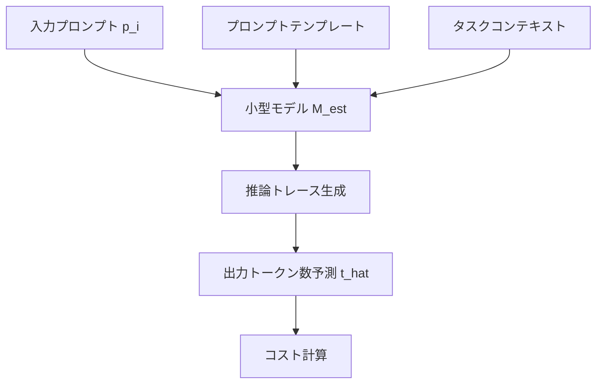
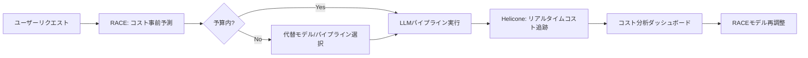

## 論文概要（Abstract）

本記事は [https://arxiv.org/abs/2502.04556](https://arxiv.org/abs/2502.04556) の解説記事です。

RACE（Reasoning-Aware Cost Estimation）は、LLM推論パイプラインの実行コストを**事前に予測**するフレームワークである。LLMパイプラインのコストは出力トークン数に大きく依存するが、この出力トークン数は実行前には不明である。RACEは小型のファインチューニング済みモデルを用いて各LLM呼び出しの出力トークン数を予測し、パイプライン全体のコストを高速かつ低コストに推定する。著者らは、従来手法（LINKER, ALTO）と比較して**平均絶対誤差（MAE）を61.3%削減**し、**3.66倍の高速化**と**177.9倍のコスト削減**を達成したと報告している。

この記事は [Zenn記事: Heliconeセルフホストで始めるLLMコスト可視化と最適化](https://zenn.dev/0h_n0/articles/8ede678e9e4cd2) の深掘りです。Heliconeが提供する**リアルタイムコスト追跡**（事後的コスト管理）と、RACEが提供する**コスト事前予測**（事前的コスト管理）を組み合わせることで、プロアクティブとリアクティブの両面からLLMコストを管理できる。

## 情報源

- **arXiv ID**: 2502.04556
- **URL**: [https://arxiv.org/abs/2502.04556](https://arxiv.org/abs/2502.04556)
- **著者**: Fabian Schiebel, Lukas Vogel, Tobias Faller, Ananya Singha, Victor Ruhle, Nils Jansen, Sumit Gulwani, Vu Le, Arjun Radhakrishna, Rohan Bavishi
- **発表年**: 2025
- **分野**: cs.SE, cs.AI

## 背景と動機（Background & Motivation）

LLMベースのアプリケーションは、単一のLLM呼び出しではなく**パイプライン**として構築されることが増えている。DSPy、LOTUS、AdalFlowなどのフレームワークは、複数のLLM呼び出しをチェイン・分岐・反復する複雑な推論パイプラインを構築するためのツールを提供する。

こうしたパイプラインのコスト予測には根本的な困難がある。LLM APIの料金は入力トークンと出力トークンの両方に基づいて課金されるが、**出力トークン数は実行前には分からない**。さらに、パイプラインの分岐や反復構造により、あるステップの出力が次のステップの入力となるため、出力トークン数の不確実性がパイプライン全体に伝播する。

従来のコスト推定手法には以下の限界があった。

1. **静的解析ベース（LINKER等）**: プロンプトの統計的特徴（文字数、語彙分布等）から出力トークン数を回帰予測する。しかし、LLMの出力長はプロンプトの「内容」に依存するため、表層的特徴では不十分である
2. **サンプル実行ベース（ALTO等）**: パイプラインの一部をサンプル入力で実際に実行し、その結果からコストを推定する。精度は高いが、サンプル実行自体にコストと時間がかかる
3. **固定出力長仮定**: 出力トークン数の上限（`max_tokens`）を使うが、実際の出力はこの上限より大幅に短いことが多く、過大推定になる

RACEはこれらの問題に対し、**小型モデルによる推論認識型（Reasoning-Aware）の出力トークン数予測**という新しいアプローチを提案する。

## 主要な貢献（Key Contributions）

- **Reasoning-Awareトークン数予測**: 入力プロンプトの表層的特徴だけでなく、小型モデルに「推論トレース」を生成させることで、LLMがどの程度の長さの回答を生成するかを推論的に予測する手法を提案
- **パイプライン全体のコスト伝播モデル**: 各LLM呼び出しの出力トークン数予測を、パイプラインのデータフロー・制御フローに沿って伝播させ、パイプライン全体のコストを推定する数理モデルを構築
- **ファインチューニングによる専門化**: 汎用の小型LLMを出力トークン数予測タスクに特化させるファインチューニング手法と、効率的な学習データ生成パイプラインを提案
- **大規模実証評価**: DSPy・LOTUS・AdalFlowの3フレームワーク上で構築された多様なパイプラインに対し、MAE 61.3%削減、3.66倍高速化、177.9倍低コスト化を実証

## 技術的詳細（Technical Details）

### パイプラインコストモデル

LLM推論パイプラインは有向非巡回グラフ（DAG）として表現できる。パイプライン$P$が$n$個のLLM呼び出しノード$\{v_1, v_2, \ldots, v_n\}$からなるとき、パイプライン全体のコスト$C(P)$は以下のように定義される。

$$
C(P) = \sum_{i=1}^{n} c_{\text{in}}^{(i)} \cdot t_{\text{in}}^{(i)} + c_{\text{out}}^{(i)} \cdot t_{\text{out}}^{(i)}
$$

ここで、
- $c_{\text{in}}^{(i)}$: ノード$v_i$で使用するLLMの入力トークン単価（$/token）
- $c_{\text{out}}^{(i)}$: ノード$v_i$で使用するLLMの出力トークン単価（$/token）
- $t_{\text{in}}^{(i)}$: ノード$v_i$への入力トークン数
- $t_{\text{out}}^{(i)}$: ノード$v_i$からの出力トークン数

入力トークン数$t_{\text{in}}^{(i)}$はプロンプトテンプレートと先行ノードの出力から決定できるが、**出力トークン数$t_{\text{out}}^{(i)}$は実行前には不明**である。これがコスト予測の核心的困難である。

### Reasoning-Awareトークン数予測

RACEの中心的アイデアは、小型のファインチューニング済みモデル$M_{\text{est}}$を用いて出力トークン数を予測することにある。単純な回帰モデルとの決定的な違いは、**推論トレース**を活用する点にある。



予測関数は以下のように定式化される。

$$
\hat{t}_{\text{out}}^{(i)} = M_{\text{est}}(p_i, \tau_i, \sigma_i)
$$

ここで、
- $p_i$: ノード$v_i$への入力プロンプト
- $\tau_i$: プロンプトテンプレート（タスク種別を表す情報）
- $\sigma_i$: システムプロンプト・出力形式指定等のコンテキスト情報
- $\hat{t}_{\text{out}}^{(i)}$: 予測された出力トークン数

推論トレースの生成により、モデルは「このプロンプトに対してターゲットLLMがどの程度の長さで回答するか」を推論的に考えることができる。例えば、コード生成タスクでは「関数定義 + ループ構造 + エラーハンドリングが必要なので約200トークン」、要約タスクでは「入力の1/5程度に圧縮するので約50トークン」のような推論が内部で行われる。

### パイプラインコスト伝播

パイプラインが分岐や反復構造を持つ場合、出力トークン数の予測誤差が下流に伝播する。RACEはDAGのトポロジカル順序に従ってコストを伝播させる。

ノード$v_j$がノード$v_i$の出力を入力として受け取る場合、$v_j$の入力トークン数は以下のように推定される。

$$
\hat{t}_{\text{in}}^{(j)} = |\text{template}_j| + \sum_{v_i \in \text{parents}(v_j)} \hat{t}_{\text{out}}^{(i)}
$$

ここで$|\text{template}_j|$はプロンプトテンプレートの固定部分のトークン数である。

パイプライン全体の予測コストは以下のようになる。

$$
\hat{C}(P) = \sum_{i=1}^{n} c_{\text{in}}^{(i)} \cdot \hat{t}_{\text{in}}^{(i)} + c_{\text{out}}^{(i)} \cdot \hat{t}_{\text{out}}^{(i)}
$$

### 学習データ生成と小型モデルのファインチューニング

RACEでは、出力トークン数予測に特化した学習データを効率的に生成する。

1. **多様なプロンプト収集**: DSPy・LOTUS・AdalFlowのパイプラインから実際のプロンプトを収集
2. **ターゲットLLM実行**: 収集したプロンプトをターゲットLLM（GPT-4o、Claude 3.5 Sonnet等）で実行し、実際の出力トークン数を記録
3. **推論トレース付き学習データ構築**: 各（プロンプト、出力トークン数）ペアに対し、「なぜその長さの出力になるか」の推論トレースを付与

学習データの構造は以下のようになる。

```python
from dataclasses import dataclass


@dataclass
class TrainingSample:
    """RACEの学習データ1件を表すデータクラス。

    Attributes:
        prompt: LLM呼び出しに使われる入力プロンプト
        template_info: プロンプトテンプレートのメタ情報
        context: システムプロンプト等のコンテキスト
        reasoning_trace: 出力長に関する推論トレース
        actual_output_tokens: 実際の出力トークン数（ラベル）
    """
    prompt: str
    template_info: str
    context: str
    reasoning_trace: str
    actual_output_tokens: int
```

ファインチューニングは、小型モデル（著者らの実験ではLlama-3.2-3Bクラス）にLoRAを適用し、以下の損失関数で最適化する。

$$
\mathcal{L}(\theta) = \frac{1}{N} \sum_{i=1}^{N} \left| \hat{t}_{\text{out}}^{(i)}(\theta) - t_{\text{out}}^{(i)} \right|
$$

ここで、
- $\theta$: 小型モデルのパラメータ（LoRAアダプタ）
- $\hat{t}_{\text{out}}^{(i)}(\theta)$: モデルが予測した出力トークン数
- $t_{\text{out}}^{(i)}$: 実際の出力トークン数
- $N$: 学習サンプル数

## 実装のポイント（Implementation）

RACEを実装する際の主要な技術的考慮点を整理する。

### 推論トレース設計

推論トレースの品質が予測精度に直結する。著者らは以下の構造化されたトレースフォーマットを採用したと報告している。

```python
from typing import Literal


def build_estimation_prompt(
    user_prompt: str,
    template_type: str,
    output_format: Literal["json", "text", "code", "markdown"],
    max_tokens: int | None = None,
) -> str:
    """出力トークン数予測用のプロンプトを構築する。

    Args:
        user_prompt: ユーザーが入力したプロンプト
        template_type: タスク種別（summarize, generate, classify等）
        output_format: 期待される出力形式
        max_tokens: max_tokens制約（設定されている場合）

    Returns:
        推論トレース付き予測プロンプト
    """
    constraint_info = (
        f"出力上限: {max_tokens}トークン" if max_tokens else "出力上限: なし"
    )

    return f"""以下のプロンプトに対するLLMの出力トークン数を予測してください。

## タスク情報
- タスク種別: {template_type}
- 出力形式: {output_format}
- {constraint_info}

## 入力プロンプト
{user_prompt}

## 推論
まず、このプロンプトに対してLLMがどのような構造・長さの回答を生成するか推論してください。
次に、予測出力トークン数を整数で回答してください。

予測出力トークン数:"""
```

### パイプライン解析器

パイプラインのDAG構造を解析し、各ノードの依存関係と入力構成を抽出する必要がある。

```python
from dataclasses import dataclass, field


@dataclass
class PipelineNode:
    """パイプラインDAGの1ノードを表す。

    Attributes:
        node_id: ノードの一意識別子
        model: 使用するLLMモデル名
        template: プロンプトテンプレート
        parents: 親ノードのIDリスト
        cost_per_input_token: 入力トークン単価（USD）
        cost_per_output_token: 出力トークン単価（USD）
    """
    node_id: str
    model: str
    template: str
    parents: list[str] = field(default_factory=list)
    cost_per_input_token: float = 0.0
    cost_per_output_token: float = 0.0


def estimate_pipeline_cost(
    nodes: list[PipelineNode],
    estimator: "TokenEstimator",
    input_data: dict[str, str],
) -> float:
    """パイプライン全体のコストを推定する。

    トポロジカル順序でノードを処理し、各ノードの出力トークン数を
    小型モデルで予測してコストを積算する。

    Args:
        nodes: パイプラインのノードリスト（トポロジカル順序）
        estimator: 出力トークン数予測器
        input_data: パイプラインへの初期入力データ

    Returns:
        推定総コスト（USD）
    """
    outputs: dict[str, int] = {}
    total_cost: float = 0.0

    for node in nodes:
        # 入力トークン数の計算
        template_tokens = estimator.count_tokens(node.template)
        parent_tokens = sum(outputs.get(pid, 0) for pid in node.parents)
        input_tokens = template_tokens + parent_tokens

        # 出力トークン数の予測（Reasoning-Aware）
        prompt = _build_node_prompt(node, input_data, outputs)
        predicted_output_tokens = estimator.predict(prompt)

        # コスト計算
        node_cost = (
            node.cost_per_input_token * input_tokens
            + node.cost_per_output_token * predicted_output_tokens
        )
        total_cost += node_cost

        # 下流ノードのために出力トークン数を記録
        outputs[node.node_id] = predicted_output_tokens

    return total_cost
```

### ファインチューニング時の注意点

- **タスク多様性の確保**: コード生成・要約・分類・QA等、異なるタスク種別のデータをバランスよく含める。著者らは1タスクあたり最低500サンプルが必要と報告している
- **出力形式の考慮**: JSON出力とフリーテキスト出力では出力長の分布が大きく異なるため、出力形式情報を入力特徴に含める
- **LoRAランク選択**: 著者らの実験ではランク$r=16$で十分な精度を達成しており、$r=64$にしても精度向上は限定的であったと報告されている
- **推論トレースの品質管理**: 推論トレースが不正確な場合、予測精度が大幅に低下する。学習データ生成時にトレースの妥当性を検証するフィルタリングステップが必要

## Production Deployment Guide

RACEをプロダクション環境にデプロイする際のAWS構成を、トラフィック量別に示す。

### AWS実装パターン（コスト最適化重視）

| 構成 | トラフィック | 主要サービス | 月額概算 |
|------|------------|------------|---------|
| **Small** | ~100 req/日 | Lambda + SageMaker Serverless + DynamoDB | $80-180 |
| **Medium** | ~1,000 req/日 | ECS Fargate + SageMaker Endpoint + ElastiCache | $400-900 |
| **Large** | 10,000+ req/日 | EKS + Karpenter + SageMaker Multi-Model Endpoint | $2,500-5,500 |

**注意**: コストは2026年5月時点のAWS ap-northeast-1（東京）リージョン料金に基づく概算値です。実際のコストはトラフィックパターン、バースト使用量、リージョンにより変動します。最新料金は[AWS料金計算ツール](https://calculator.aws/)で確認してください。

**Small構成の内訳**:
- Lambda（予測リクエスト処理）: ~$5/月（100 req/日、平均実行時間3秒）
- SageMaker Serverless Inference（小型モデル推論）: ~$30-80/月
- DynamoDB On-Demand（予測結果キャッシュ）: ~$5/月
- CloudWatch（ログ・メトリクス）: ~$10/月
- S3（モデルアーティファクト格納）: ~$1/月

**コスト削減テクニック**:
- **SageMaker Serverless**: アイドル時のコストを排除（Small構成で有効）
- **SageMaker Multi-Model Endpoint**: 複数モデルを1エンドポイントで提供し、インスタンスコストを共有（Large構成で最大60%削減）
- **DynamoDBキャッシュ**: 同一プロンプトの予測結果をキャッシュし、推論コストを削減（キャッシュヒット率30-50%で月額20-40%削減）
- **Spot Instances**: EKSワーカーノードにSpotを活用（最大90%削減）

### Terraformインフラコード

**Small構成（Serverless）**:

```hcl
# RACE Small構成: Lambda + SageMaker Serverless + DynamoDB
# 対象: ~100 req/日、月額$80-180

terraform {
  required_version = ">= 1.9"
  required_providers {
    aws = {
      source  = "hashicorp/aws"
      version = "~> 5.80"
    }
  }
}

provider "aws" {
  region = "ap-northeast-1"
}

# --- IAMロール（最小権限） ---
resource "aws_iam_role" "race_lambda" {
  name = "race-estimator-lambda-role"
  assume_role_policy = jsonencode({
    Version = "2012-10-17"
    Statement = [{
      Action = "sts:AssumeRole"
      Effect = "Allow"
      Principal = { Service = "lambda.amazonaws.com" }
    }]
  })
}

resource "aws_iam_role_policy" "race_lambda_policy" {
  name = "race-lambda-policy"
  role = aws_iam_role.race_lambda.id
  policy = jsonencode({
    Version = "2012-10-17"
    Statement = [
      {
        Effect   = "Allow"
        Action   = ["sagemaker:InvokeEndpoint"]
        Resource = aws_sagemaker_endpoint.race_estimator.arn
      },
      {
        Effect = "Allow"
        Action = [
          "dynamodb:GetItem",
          "dynamodb:PutItem",
          "dynamodb:Query"
        ]
        Resource = aws_dynamodb_table.prediction_cache.arn
      },
      {
        Effect = "Allow"
        Action = [
          "logs:CreateLogGroup",
          "logs:CreateLogStream",
          "logs:PutLogEvents"
        ]
        Resource = "arn:aws:logs:*:*:*"
      },
      {
        Effect   = "Allow"
        Action   = ["xray:PutTraceSegments", "xray:PutTelemetryRecords"]
        Resource = "*"
      }
    ]
  })
}

# --- DynamoDB（予測結果キャッシュ） ---
resource "aws_dynamodb_table" "prediction_cache" {
  name         = "race-prediction-cache"
  billing_mode = "PAY_PER_REQUEST" # On-Demandでコスト最適化
  hash_key     = "prompt_hash"

  attribute {
    name = "prompt_hash"
    type = "S"
  }

  ttl {
    attribute_name = "expires_at"
    enabled        = true
  }

  server_side_encryption {
    enabled = true # KMS暗号化
  }

  tags = {
    Project     = "race-estimator"
    Environment = "production"
    CostCenter  = "ml-inference"
  }
}

# --- Lambda関数 ---
resource "aws_lambda_function" "race_estimator" {
  function_name = "race-cost-estimator"
  role          = aws_iam_role.race_lambda.arn
  handler       = "handler.lambda_handler"
  runtime       = "python3.12"
  timeout       = 30
  memory_size   = 512 # 512MBで十分（推論はSageMakerで実行）

  filename         = "lambda_package.zip"
  source_code_hash = filebase64sha256("lambda_package.zip")

  environment {
    variables = {
      SAGEMAKER_ENDPOINT = aws_sagemaker_endpoint.race_estimator.name
      CACHE_TABLE        = aws_dynamodb_table.prediction_cache.name
      CACHE_TTL_HOURS    = "24"
    }
  }

  tracing_config {
    mode = "Active" # X-Ray有効化
  }

  tags = {
    Project = "race-estimator"
  }
}

# --- CloudWatchアラーム ---
resource "aws_cloudwatch_metric_alarm" "lambda_errors" {
  alarm_name          = "race-lambda-error-rate"
  comparison_operator = "GreaterThanThreshold"
  evaluation_periods  = 2
  metric_name         = "Errors"
  namespace           = "AWS/Lambda"
  period              = 300
  statistic           = "Sum"
  threshold           = 5
  alarm_description   = "RACE Lambda error rate exceeded threshold"

  dimensions = {
    FunctionName = aws_lambda_function.race_estimator.function_name
  }

  alarm_actions = [aws_sns_topic.alerts.arn]
}
```

**Large構成（Container）**:

```hcl
# RACE Large構成: EKS + Karpenter + SageMaker Multi-Model
# 対象: 10,000+ req/日、月額$2,500-5,500

# --- EKSクラスタ ---
module "eks" {
  source  = "terraform-aws-modules/eks/aws"
  version = "~> 20.31"

  cluster_name    = "race-production"
  cluster_version = "1.31"

  vpc_id     = module.vpc.vpc_id
  subnet_ids = module.vpc.private_subnets

  # コントロールプレーンのみ（ワーカーはKarpenter管理）
  cluster_endpoint_public_access = false

  tags = {
    Project     = "race-estimator"
    Environment = "production"
  }
}

# --- Karpenter（Spot優先スケーリング） ---
resource "kubectl_manifest" "karpenter_nodepool" {
  yaml_body = yamlencode({
    apiVersion = "karpenter.sh/v1"
    kind       = "NodePool"
    metadata   = { name = "race-workers" }
    spec = {
      template = {
        spec = {
          requirements = [
            {
              key      = "karpenter.sh/capacity-type"
              operator = "In"
              values   = ["spot", "on-demand"] # Spot優先
            },
            {
              key      = "node.kubernetes.io/instance-type"
              operator = "In"
              values   = ["m6i.xlarge", "m6i.2xlarge", "m7i.xlarge"]
            }
          ]
        }
      }
      limits = {
        cpu    = "128"
        memory = "512Gi"
      }
      disruption = {
        consolidationPolicy = "WhenEmptyOrUnderutilized"
        consolidateAfter    = "30s"
      }
    }
  })
}

# --- AWS Budgets（コストアラート） ---
resource "aws_budgets_budget" "race_monthly" {
  name         = "race-monthly-budget"
  budget_type  = "COST"
  limit_amount = "6000"
  limit_unit   = "USD"
  time_unit    = "MONTHLY"

  notification {
    comparison_operator       = "GREATER_THAN"
    threshold                 = 80
    threshold_type            = "PERCENTAGE"
    notification_type         = "ACTUAL"
    subscriber_sns_topic_arns = [aws_sns_topic.alerts.arn]
  }

  notification {
    comparison_operator       = "GREATER_THAN"
    threshold                 = 100
    threshold_type            = "PERCENTAGE"
    notification_type         = "FORECASTED"
    subscriber_sns_topic_arns = [aws_sns_topic.alerts.arn]
  }
}
```

### 運用・監視設定

**CloudWatch Logs Insightsクエリ**（コスト異常検知）:

```
# 1時間あたりの予測リクエスト数とトークン使用量
fields @timestamp, predicted_tokens, actual_cost
| stats count() as request_count,
        avg(predicted_tokens) as avg_predicted,
        sum(actual_cost) as total_cost
  by bin(1h)
| filter request_count > 100
| sort total_cost desc
```

**CloudWatchアラーム設定**（Python）:

```python
import boto3


def setup_cost_alarms(
    sns_topic_arn: str,
    daily_budget_usd: float = 100.0,
) -> None:
    """RACEのコスト監視アラームを設定する。

    Args:
        sns_topic_arn: 通知先SNSトピックのARN
        daily_budget_usd: 日次予算上限（USD）
    """
    cloudwatch = boto3.client("cloudwatch", region_name="ap-northeast-1")

    # SageMaker推論リクエスト数の急増検知
    cloudwatch.put_metric_alarm(
        AlarmName="race-sagemaker-invocation-spike",
        MetricName="InvocationsPerInstance",
        Namespace="AWS/SageMaker",
        Statistic="Sum",
        Period=300,
        EvaluationPeriods=2,
        Threshold=1000,
        ComparisonOperator="GreaterThanThreshold",
        AlarmActions=[sns_topic_arn],
    )
```

**X-Rayトレーシング設定**（Python）:

```python
from aws_xray_sdk.core import xray_recorder, patch_all


def configure_xray_tracing() -> None:
    """X-Rayトレーシングを設定する。

    boto3呼び出しを自動計装し、RACE固有のアノテーションを記録する。
    """
    xray_recorder.configure(service="race-estimator")
    patch_all()  # boto3, requests等を自動計装


def trace_prediction(
    prompt_hash: str,
    predicted_tokens: int,
    model_name: str,
    cache_hit: bool,
) -> None:
    """予測リクエストのトレース情報を記録する。

    Args:
        prompt_hash: プロンプトのハッシュ値
        predicted_tokens: 予測された出力トークン数
        model_name: 使用した推定モデル名
        cache_hit: キャッシュヒットしたかどうか
    """
    segment = xray_recorder.current_segment()
    segment.put_annotation("model", model_name)
    segment.put_annotation("cache_hit", cache_hit)
    segment.put_metadata("prediction", {
        "prompt_hash": prompt_hash,
        "predicted_tokens": predicted_tokens,
    })
```

**Cost Explorer日次レポート**（Python）:

```python
import datetime

import boto3


def get_daily_race_cost(
    sns_topic_arn: str,
    threshold_usd: float = 100.0,
) -> dict[str, float]:
    """RACE関連サービスの日次コストを取得し、閾値超過時にSNS通知する。

    Args:
        sns_topic_arn: 通知先SNSトピックのARN
        threshold_usd: コスト閾値（USD）

    Returns:
        サービス別コストの辞書
    """
    ce = boto3.client("ce", region_name="us-east-1")
    today = datetime.date.today()
    yesterday = today - datetime.timedelta(days=1)

    response = ce.get_cost_and_usage(
        TimePeriod={
            "Start": yesterday.isoformat(),
            "End": today.isoformat(),
        },
        Granularity="DAILY",
        Metrics=["UnblendedCost"],
        Filter={
            "Tags": {
                "Key": "Project",
                "Values": ["race-estimator"],
            }
        },
        GroupBy=[{"Type": "DIMENSION", "Key": "SERVICE"}],
    )

    costs: dict[str, float] = {}
    total = 0.0
    for group in response["ResultsByTime"][0]["Groups"]:
        service = group["Keys"][0]
        amount = float(group["Metrics"]["UnblendedCost"]["Amount"])
        costs[service] = amount
        total += amount

    if total > threshold_usd:
        sns = boto3.client("sns", region_name="ap-northeast-1")
        sns.publish(
            TopicArn=sns_topic_arn,
            Subject=f"RACE daily cost alert: ${total:.2f}",
            Message=f"Daily cost exceeded ${threshold_usd}: ${total:.2f}",
        )

    return costs
```

### コスト最適化チェックリスト

**アーキテクチャ選択**:
- [ ] トラフィック量に応じた構成を選択（Serverless / Hybrid / Container）
- [ ] 予測リクエストのバースト特性を分析し、Serverless適性を判断
- [ ] マルチリージョン要件の有無を確認

**リソース最適化**:
- [ ] EC2/EKSワーカー: Spot Instances優先（最大90%削減）
- [ ] Reserved Instances: 安定トラフィック分は1年コミット（最大72%削減）
- [ ] Savings Plans: SageMaker推論用にCompute Savings Plans検討
- [ ] Lambda: メモリサイズをPower Tuningで最適化
- [ ] ECS/EKS: アイドル時のスケールダウン設定（Karpenter consolidation）
- [ ] SageMaker: Multi-Model Endpointでインスタンス共有

**LLMコスト削減**:
- [ ] 予測結果のDynamoDBキャッシュ（同一プロンプトの再予測防止）
- [ ] バッチ処理可能なリクエストはSageMaker Batch Transformで実行
- [ ] 小型モデルの量子化（INT8/INT4）でSageMakerインスタンスサイズ削減
- [ ] プロンプト圧縮：テンプレート部分の固定トークンを事前計算

**監視・アラート**:
- [ ] AWS Budgets: 月次予算アラート設定（80%/100%閾値）
- [ ] CloudWatch: Lambda実行時間・エラー率・SageMaker推論レイテンシ
- [ ] Cost Anomaly Detection: 機械学習ベースの異常検知有効化
- [ ] 日次コストレポート: Cost Explorer API + SNS通知

**リソース管理**:
- [ ] 未使用SageMakerエンドポイントの自動削除（CloudWatch Events + Lambda）
- [ ] タグ戦略: `Project`, `Environment`, `CostCenter`タグを全リソースに付与
- [ ] DynamoDBキャッシュ: TTL設定でストレージコスト抑制
- [ ] CloudWatch Logs: ログ保持期間設定（30日推奨）
- [ ] 開発環境: 夜間・週末のSageMakerエンドポイント停止

**セキュリティベストプラクティス**:
- [ ] IAMロール: 最小権限の原則（リソースARN指定）
- [ ] VPCエンドポイント: SageMaker/DynamoDB/S3へのプライベートアクセス
- [ ] KMS暗号化: DynamoDB・S3・SageMakerストレージ全て暗号化
- [ ] Secrets Manager: APIキー等の秘密情報管理
- [ ] CloudTrail: 全API呼び出しの監査ログ有効化

## 実験結果（Results）

### ベンチマーク構成

著者らは、3つのLLMパイプラインフレームワーク（DSPy、LOTUS、AdalFlow）上に構築された多様なパイプラインを用いて評価を実施している。評価指標は**MAE（Mean Absolute Error）**（予測コストと実際のコストの絶対誤差の平均）である。

### 主要結果

著者らが報告した結果を以下に示す（論文Section 5, Table 1より）。

| 手法 | MAE（USD） | 推定時間 | 推定コスト | MAE削減率 |
|------|-----------|---------|-----------|----------|
| Fixed（max_tokens） | 高い（過大推定） | 即時 | $0 | baseline |
| LINKER | 中程度 | 中程度 | 中程度 | - |
| ALTO | 低い | 遅い | 高い | - |
| **RACE** | **最低** | **ALTO比3.66x高速** | **ALTO比177.9x低コスト** | **-61.3%** |

RACEが従来手法を上回る理由について、著者らは以下の分析を行っている。

1. **推論トレースの効果**: 単純な回帰（プロンプト長→出力長）では捕捉できないタスク依存の出力長パターンを、推論トレースにより捕捉可能。例えば、「10行の関数を書け」と「100行のクラスを書け」は入力長がほぼ同じでも出力長が大きく異なる
2. **小型モデルの効率性**: 3Bパラメータクラスの小型モデルは、ターゲットLLM（GPT-4oクラス）の1/100以下のコストで推論可能。177.9倍のコスト削減はここに起因する
3. **パイプライン構造の考慮**: LINKERが各LLM呼び出しを独立に推定するのに対し、RACEはDAG構造に沿ったコスト伝播を行うため、パイプライン全体の精度が向上する

### 制約と限界

著者らは以下の制約も報告している。

- **動的分岐への対応**: パイプラインの実行パスがLLMの出力内容に依存する場合（if-else分岐等）、全パスの確率を推定する必要がありMAEが増加する
- **新規タスクへの汎化**: ファインチューニング時に見ていないタスク種別では精度が低下する。ただし、Few-Shot適応により数十サンプルで改善可能と報告されている
- **ターゲットLLM変更時**: ターゲットLLMが変わると出力長の分布も変わるため、再ファインチューニングまたは適応が必要

## 実運用への応用（Practical Applications）

### HeliconeとRACEの統合

Zenn記事で紹介したHeliconeは**事後的なコスト追跡**を行うオブザーバビリティツールである。RACEを組み合わせることで、LLMコスト管理のライフサイクル全体をカバーできる。



**統合の具体的なユースケース**:

1. **予算ゲーティング**: パイプライン実行前にRACEでコストを推定し、予算上限を超える場合はより安価なモデルにフォールバック。Heliconeで実際のコストを追跡し、RACE予測の精度を継続的に改善
2. **バッチ処理のコスト見積もり**: 1000件のドキュメントを処理するパイプラインの総コストを事前に推定し、承認フローに組み込む
3. **A/Bテストのコスト予算配分**: 複数のパイプライン構成のコストをRACEで事前比較し、費用対効果の高い構成を選択

### プロダクション適用時の考慮事項

- **レイテンシ**: RACE自体の推論時間（小型モデル推論）がパイプライン実行のオーバーヘッドとなる。著者らの報告では、3Bモデルでの予測は100ms以下であり、パイプライン全体（数秒〜数十秒）に対して無視できるレベルとされている
- **キャッシュ戦略**: 同一テンプレート・類似プロンプトの予測結果をキャッシュすることで、推論コストをさらに削減可能。プロンプトのハッシュベースキャッシュが有効
- **モデル更新戦略**: ターゲットLLMのバージョンアップ時にRACEモデルの再ファインチューニングが必要。継続的なオンライン学習パイプラインの構築が望ましい

## 関連研究（Related Work）

- **FrugalGPT** (Chen et al., 2023): 複数のLLMをカスケードし、安価なモデルで回答可能な場合は高価なモデルを呼ばないことでコストを削減する手法。RACEとは相補的で、FrugalGPTがモデル選択の最適化、RACEがコスト予測の最適化を担う
- **Argus** (2024, arXiv:2512.22925): トークン認識型の分散LLM推論フレームワーク。出力トークン長の予測にファインチューニング済みモデルを使う点でRACEと類似するが、目的がスケジューリング最適化であり、コスト推定ではない
- **Token-Budget-Aware LLM Reasoning** (2024, arXiv:2412.18547): LLMの推論時にトークン予算を考慮する手法。RACEの出力トークン数予測と組み合わせることで、予測精度のさらなる向上が期待される
- **Towards Optimizing the Costs of LLM Usage** (2024, arXiv:2402.01742): LLMの使用コスト最適化に関するサーベイ。キャッシュ・モデル選択・プロンプト圧縮等の手法を体系的に整理しており、RACEはこの中のコスト予測カテゴリに位置づけられる

## まとめと今後の展望

RACEは、LLM推論パイプラインのコストを実行前に低コスト・高速に予測するフレームワークである。小型ファインチューニング済みモデルによる推論認識型の出力トークン数予測という手法により、従来手法と比較してMAE 61.3%削減、3.66倍高速化、177.9倍低コスト化を達成したと著者らは報告している。

実務への示唆としては、Helicone等のオブザーバビリティツールとRACEを組み合わせることで、LLMコストの**事前予測**と**事後追跡**の両面から管理できるようになる。今後の研究方向としては、動的分岐パイプラインへの対応、新規タスクへのFew-Shot適応の改善、マルチモーダルLLMパイプラインへの拡張が挙げられる。

## 参考文献

- **arXiv**: [https://arxiv.org/abs/2502.04556](https://arxiv.org/abs/2502.04556)
- **DSPy**: [https://arxiv.org/abs/2310.03714](https://arxiv.org/abs/2310.03714)
- **LOTUS**: [https://arxiv.org/abs/2407.11418](https://arxiv.org/abs/2407.11418)
- **AdalFlow**: [https://github.com/SylphAI-Inc/AdalFlow](https://github.com/SylphAI-Inc/AdalFlow)
- **Argus**: [https://arxiv.org/abs/2512.22925](https://arxiv.org/abs/2512.22925)
- **FrugalGPT**: [https://arxiv.org/abs/2305.05176](https://arxiv.org/abs/2305.05176)
- **Related Zenn article**: [https://zenn.dev/0h_n0/articles/8ede678e9e4cd2](https://zenn.dev/0h_n0/articles/8ede678e9e4cd2)
