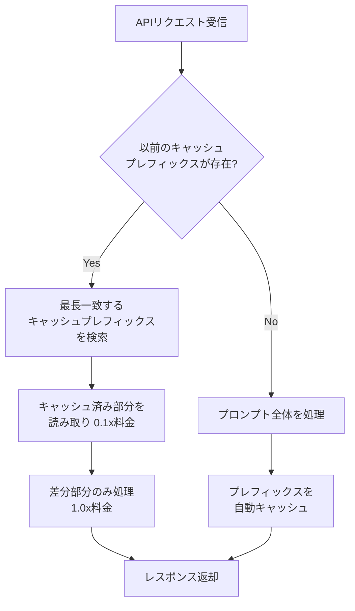

## ブログ概要（Summary）

本記事は [https://www.anthropic.com/news/token-saving-updates](https://www.anthropic.com/news/token-saving-updates) の解説記事です。

2025年3月13日、AnthropicはClaude APIにおけるトークン消費を削減する4つのアップデートを発表した。(1) **キャッシュ対応レート制限**（Cache-Aware Rate Limits）により、プロンプトキャッシュの読み取りトークンがITPM（Input Tokens Per Minute）の上限にカウントされなくなった。(2) **簡易プロンプトキャッシング**（Simplified Prompt Caching）により、手動でのキャッシュブレークポイント管理が不要になり、最大90%のコスト削減・85%のレイテンシ削減が可能になった。(3) **トークン効率的ツール使用**（Token-Efficient Tool Use）により、出力トークンが最大70%削減された。(4) **テキストエディタツール**（Text Editor Tool）により、ドキュメント全体の書き換えではなく差分ベースの編集が可能になった。

この記事は [Zenn記事: Heliconeセルフホストで始めるLLMコスト可視化と最適化](https://zenn.dev/0h_n0/articles/8ede678e9e4cd2) の深掘りです。Heliconeがゲートウェイ側のキャッシュ・可視化を担うのに対し、Anthropic APIのトークン節約機能はプロバイダ側の最適化であり、両者を組み合わせることでLLMコストの包括的な削減が実現できる。

## 情報源

- **種別**: 企業テックブログ
- **URL**: [https://www.anthropic.com/news/token-saving-updates](https://www.anthropic.com/news/token-saving-updates)
- **組織**: Anthropic
- **発表日**: 2025年3月13日
- **対象モデル**: Claude 3.7 Sonnet（主対象）

## 技術的背景（Technical Background）

### LLMコストの構造的課題

LLMの運用コストは、入力トークン数と出力トークン数に比例する従量課金モデルが一般的である。特にエージェント型アプリケーションでは、長いシステムプロンプトやツール定義を繰り返し送信するため、入力トークンコストが支配的になる。Anthropicの料金体系では、Claude 3.5 Sonnetの場合、入力トークンのベース料金は$3/MTok（100万トークンあたり3ドル）であるのに対し、キャッシュ読み取り時は$0.30/MTokと10分の1に抑えられる。

### プロンプトキャッシングの仕組み

プロンプトキャッシングとは、APIリクエスト間で共通するプロンプトプレフィックスをサーバー側にキャッシュし、再利用する技術である。キャッシュ書き込み時にはベース料金の1.25倍（5分間TTL）または2倍（1時間TTL）のコストが発生するが、2回目以降の読み取りではベース料金の0.1倍で済むため、繰り返し呼び出されるワークロードでは大幅なコスト削減が期待できる。

従来の課題は、開発者がキャッシュブレークポイントを手動で管理する必要があったことである。プロンプトのどの部分をキャッシュするかを明示的に指定し、プレフィックスの一致を手動で追跡する必要があった。これはコードの複雑性を増し、最適でないキャッシュ戦略につながることが多かった。

### レート制限とスループットの問題

ITPM（Input Tokens Per Minute）はAPIのスループットを制御するレート制限パラメータである。キャッシュされたトークンは実質的にはサーバー側で処理済みであるにもかかわらず、従来はITPM制限にカウントされていた。これにより、キャッシュを多用するアプリケーションではキャッシュの恩恵が打ち消され、スループットが制限される矛盾した状況が生じていた。

## 実装アーキテクチャ（Architecture）

Anthropicが発表した4つのアップデートについて、それぞれの技術的詳細を解説する。

### 1. キャッシュ対応レート制限（Cache-Aware Rate Limits）

Anthropicは、Claude 3.7 Sonnetにおいてプロンプトキャッシュの読み取りトークンをITPM制限から除外したと発表している。この変更により、キャッシュヒット率が高いアプリケーションでは実効的なスループットが向上する。

コスト削減効果を数式で表現すると、あるリクエストにおいて入力トークン総数を $T_{\text{input}}$、うちキャッシュヒットしたトークン数を $T_{\text{cached}}$ とした場合、従来の実効ITPM消費量は $T_{\text{input}}$ であったが、アップデート後は $T_{\text{input}} - T_{\text{cached}}$ となる。

$$
\text{ITPM}_{\text{effective}} = T_{\text{input}} - T_{\text{cached}}
$$

キャッシュヒット率 $r = T_{\text{cached}} / T_{\text{input}}$ が高いほどITPM消費が少なくなり、同じレート制限枠内でより多くのリクエストを処理できる。

### 2. 簡易プロンプトキャッシング（Simplified Prompt Caching）

従来のプロンプトキャッシングでは、開発者が明示的にキャッシュブレークポイントを設定する必要があった。Anthropicは、この手動管理を不要にする自動キャッシュ機構を導入したと発表している。新しい仕組みでは、APIが自動的に以前にキャッシュされた最長のプレフィックスからの読み取りを行う。



Anthropicによると、この機能により最大90%のコスト削減と85%のレイテンシ削減が実現できるとしている。

### 3. トークン効率的ツール使用（Token-Efficient Tool Use）

エージェント型アプリケーションにおいてツール定義やツール呼び出し結果のトークンは無視できないコスト要因である。Anthropicは、ツール使用時の出力トークンを最大70%削減する最適化を導入したと発表している。初期ユーザーの平均で14%の出力トークン削減が報告されている。

この機能はベータヘッダー `token-efficient-tools-2025-02-19` を指定することで有効化できる。

**Python（Anthropic SDK）での有効化例**:

```python
import anthropic
from anthropic.types import ToolParam


def create_token_efficient_client() -> anthropic.Anthropic:
    """Token-Efficient Tool Useを有効化したクライアントを生成する。

    Returns:
        ベータヘッダー付きのAnthropicクライアント
    """
    client = anthropic.Anthropic()
    return client


def call_with_efficient_tools(
    client: anthropic.Anthropic,
    messages: list[dict],
    tools: list[ToolParam],
    model: str = "claude-sonnet-4-20250514",
) -> anthropic.types.Message:
    """トークン効率的ツール使用でAPIを呼び出す。

    Args:
        client: Anthropicクライアント
        messages: メッセージ履歴
        tools: ツール定義リスト
        model: 使用するモデルID

    Returns:
        APIレスポンス
    """
    response = client.messages.create(
        model=model,
        max_tokens=4096,
        tools=tools,
        messages=messages,
        betas=["token-efficient-tools-2025-02-19"],
    )
    return response


# 使用例: ファイル検索ツールの定義
search_tool: ToolParam = {
    "name": "search_files",
    "description": "指定されたパターンでファイルを検索する",
    "input_schema": {
        "type": "object",
        "properties": {
            "pattern": {
                "type": "string",
                "description": "検索パターン（glob形式）",
            },
            "directory": {
                "type": "string",
                "description": "検索対象ディレクトリ",
            },
        },
        "required": ["pattern"],
    },
}

client = create_token_efficient_client()
result = call_with_efficient_tools(
    client=client,
    messages=[{"role": "user", "content": "srcディレクトリのPythonファイルを探して"}],
    tools=[search_tool],
)
print(f"入力トークン: {result.usage.input_tokens}")
print(f"出力トークン: {result.usage.output_tokens}")
```

**TypeScript（Anthropic SDK）での有効化例**:

```typescript
import Anthropic from "@anthropic-ai/sdk";
import type { Tool, Message } from "@anthropic-ai/sdk/resources/messages";

/** Token-Efficient Tool Useを有効化してツール呼び出しを実行する */
async function callWithEfficientTools(
  messages: Anthropic.MessageParam[],
  tools: Tool[],
  model: string = "claude-sonnet-4-20250514"
): Promise<Message> {
  const client = new Anthropic();

  const response = await client.messages.create({
    model,
    max_tokens: 4096,
    tools,
    messages,
    betas: ["token-efficient-tools-2025-02-19"],
  });

  return response;
}

// 使用例
const searchTool: Tool = {
  name: "search_files",
  description: "指定されたパターンでファイルを検索する",
  input_schema: {
    type: "object" as const,
    properties: {
      pattern: { type: "string", description: "検索パターン（glob形式）" },
      directory: { type: "string", description: "検索対象ディレクトリ" },
    },
    required: ["pattern"],
  },
};

(async () => {
  const result = await callWithEfficientTools(
    [{ role: "user", content: "srcディレクトリのPythonファイルを探して" }],
    [searchTool]
  );
  console.log(`入力トークン: ${result.usage.input_tokens}`);
  console.log(`出力トークン: ${result.usage.output_tokens}`);
})();
```

### 4. テキストエディタツール（Text Editor Tool）

テキストエディタツールは、ドキュメント全体を再出力する代わりに、差分ベースで特定箇所のみを編集できる組み込みツールである。従来のアプローチでは、AIが1000行のファイルの1行を修正する場合でも1000行分の出力トークンが発生していた。テキストエディタツールでは、変更対象の行とその置換内容のみを出力するため、トークン消費とレイテンシの両面で改善が期待できる。

```python
import anthropic


def use_text_editor_tool(
    client: anthropic.Anthropic,
    document: str,
    instruction: str,
    model: str = "claude-sonnet-4-20250514",
) -> anthropic.types.Message:
    """テキストエディタツールを使用してドキュメントを編集する。

    Args:
        client: Anthropicクライアント
        document: 編集対象のドキュメント全文
        instruction: 編集指示
        model: 使用するモデルID

    Returns:
        APIレスポンス（ツール呼び出し結果を含む）
    """
    response = client.messages.create(
        model=model,
        max_tokens=4096,
        tools=[
            {
                "type": "text_editor_20250124",
                "name": "str_replace_editor",
            }
        ],
        messages=[
            {
                "role": "user",
                "content": f"以下のファイルを編集してください。\n\n{instruction}\n\n```\n{document}\n```",
            }
        ],
    )
    return response
```

このツールにより、大規模ドキュメントの部分編集において出力トークンを大幅に削減できる。

## Production Deployment Guide

Anthropic APIのトークン節約機能を本番環境で活用するためのAWSデプロイメントガイドを示す。

### AWS実装パターン（コスト最適化重視）

以下の構成表は、Anthropic APIを利用するアプリケーションのトラフィック量別推奨構成である。コスト試算は2026年5月時点のAWS ap-northeast-1（東京）リージョンの概算値であり、実際のコストはトラフィックパターン・リージョン・バースト使用量により変動する。

| 構成 | トラフィック | アーキテクチャ | 月額コスト |
|------|------------|-------------|-----------|
| **Small** | ~100 req/日 | Lambda + API Gateway + DynamoDB | $50-150 |
| **Medium** | ~1,000 req/日 | ECS Fargate + ALB + ElastiCache | $300-800 |
| **Large** | 10,000+ req/日 | EKS + Karpenter + Spot + ElastiCache Cluster | $2,000-5,000 |

**Small構成の内訳**:
- Lambda（256MB, 平均3秒/回）: ~$5/月
- API Gateway: ~$3.50/月
- DynamoDB On-Demand（キャッシュメタデータ保存）: ~$5/月
- Anthropic API費用（キャッシュ活用時）: ~$30-130/月
- CloudWatch Logs: ~$5/月

**Large構成の内訳**:
- EKSコントロールプレーン: $73/月
- EC2 Spot Instances（m5.xlarge x 3, 平均70%割引）: ~$300/月
- ALB: ~$25/月
- ElastiCache（r6g.large）: ~$200/月
- Anthropic API費用（キャッシュ活用時）: ~$1,000-4,000/月
- CloudWatch / X-Ray: ~$50/月

**コスト削減テクニック**:
- **Spot Instances**: オンデマンド比で最大90%削減（Karpenter経由で自動フォールバック）
- **Reserved Instances**: EKSノードを1年コミットで最大72%削減
- **Prompt Caching**: Anthropic APIのキャッシュ読み取り活用で入力トークンコスト90%削減
- **Token-Efficient Tool Use**: ツール呼び出し応答の出力トークン最大70%削減

### Terraformインフラコード

**Small構成（Serverless）**:

```hcl
# small_serverless/main.tf
# Anthropic API Token-Saving Proxy - Serverless構成
# 2026-05時点のTerraform AWS Provider ~> 5.x / Lambda Runtime python3.12

terraform {
  required_version = ">= 1.7"
  required_providers {
    aws = { source = "hashicorp/aws", version = "~> 5.50" }
  }
}

provider "aws" { region = "ap-northeast-1" }

# --- IAMロール（最小権限） ---
resource "aws_iam_role" "lambda_exec" {
  name = "anthropic-proxy-lambda"
  assume_role_policy = jsonencode({
    Version = "2012-10-17"
    Statement = [{
      Action = "sts:AssumeRole"
      Effect = "Allow"
      Principal = { Service = "lambda.amazonaws.com" }
    }]
  })
}

resource "aws_iam_role_policy" "lambda_policy" {
  name = "anthropic-proxy-policy"
  role = aws_iam_role.lambda_exec.id
  policy = jsonencode({
    Version = "2012-10-17"
    Statement = [
      {
        Effect   = "Allow"
        Action   = ["logs:CreateLogGroup", "logs:CreateLogStream", "logs:PutLogEvents"]
        Resource = "arn:aws:logs:ap-northeast-1:*:*"
      },
      {
        Effect   = "Allow"
        Action   = ["dynamodb:GetItem", "dynamodb:PutItem", "dynamodb:UpdateItem"]
        Resource = aws_dynamodb_table.cache_metadata.arn
      },
      {
        Effect   = "Allow"
        Action   = ["secretsmanager:GetSecretValue"]
        Resource = aws_secretsmanager_secret.anthropic_api_key.arn
      }
    ]
  })
}

# --- Secrets Manager（APIキー管理） ---
resource "aws_secretsmanager_secret" "anthropic_api_key" {
  name                    = "anthropic-api-key"
  recovery_window_in_days = 7
}

# --- DynamoDB（キャッシュメタデータ、On-Demand） ---
resource "aws_dynamodb_table" "cache_metadata" {
  name         = "anthropic-cache-metadata"
  billing_mode = "PAY_PER_REQUEST"  # コスト最適化: On-Demandモード
  hash_key     = "request_hash"

  attribute {
    name = "request_hash"
    type = "S"
  }

  ttl {
    attribute_name = "expires_at"
    enabled        = true
  }

  server_side_encryption { enabled = true }  # KMS暗号化
}

# --- Lambda関数 ---
resource "aws_lambda_function" "anthropic_proxy" {
  function_name = "anthropic-token-saving-proxy"
  role          = aws_iam_role.lambda_exec.arn
  handler       = "handler.lambda_handler"
  runtime       = "python3.12"
  timeout       = 30
  memory_size   = 256

  filename         = "lambda.zip"
  source_code_hash = filebase64sha256("lambda.zip")

  environment {
    variables = {
      CACHE_TABLE_NAME   = aws_dynamodb_table.cache_metadata.name
      SECRET_NAME        = aws_secretsmanager_secret.anthropic_api_key.name
      ENABLE_CACHE_AWARE = "true"
      ENABLE_EFFICIENT_TOOLS = "true"
    }
  }

  tracing_config { mode = "Active" }  # X-Ray有効化
}

# --- CloudWatchアラーム（コスト監視） ---
resource "aws_cloudwatch_metric_alarm" "lambda_duration" {
  alarm_name          = "anthropic-proxy-high-duration"
  comparison_operator = "GreaterThanThreshold"
  evaluation_periods  = 3
  metric_name         = "Duration"
  namespace           = "AWS/Lambda"
  period              = 300
  statistic           = "Average"
  threshold           = 15000  # 15秒超過でアラート
  dimensions = {
    FunctionName = aws_lambda_function.anthropic_proxy.function_name
  }
}
```

**Large構成（Container）**:

```hcl
# large_container/main.tf
# Anthropic API Token-Saving Service - EKS + Spot構成
# 2026-05時点: EKS 1.31 / Karpenter v1.1

terraform {
  required_version = ">= 1.7"
  required_providers {
    aws  = { source = "hashicorp/aws",  version = "~> 5.50" }
    helm = { source = "hashicorp/helm", version = "~> 2.14" }
  }
}

provider "aws" { region = "ap-northeast-1" }

# --- EKSクラスタ ---
module "eks" {
  source  = "terraform-aws-modules/eks/aws"
  version = "~> 20.14"

  cluster_name    = "anthropic-service"
  cluster_version = "1.31"

  vpc_id     = var.vpc_id
  subnet_ids = var.private_subnet_ids

  cluster_endpoint_public_access = false  # セキュリティ: パブリックアクセス無効

  eks_managed_node_groups = {
    system = {
      instance_types = ["m5.large"]
      min_size       = 1
      max_size       = 2
      desired_size   = 1
      capacity_type  = "ON_DEMAND"  # システムノードはオンデマンド
    }
  }
}

# --- Karpenter（Spot優先、自動スケーリング） ---
resource "helm_release" "karpenter" {
  name       = "karpenter"
  repository = "oci://public.ecr.aws/karpenter"
  chart      = "karpenter"
  version    = "1.1.0"
  namespace  = "kube-system"

  set { name = "controller.clusterName";     value = module.eks.cluster_name }
  set { name = "controller.clusterEndpoint"; value = module.eks.cluster_endpoint }
}

# --- Karpenter NodePool（Spot優先でコスト90%削減） ---
resource "kubectl_manifest" "nodepool" {
  yaml_body = yamlencode({
    apiVersion = "karpenter.sh/v1"
    kind       = "NodePool"
    metadata   = { name = "anthropic-workers" }
    spec = {
      template = {
        spec = {
          requirements = [
            { key = "karpenter.sh/capacity-type", operator = "In", values = ["spot", "on-demand"] },
            { key = "node.kubernetes.io/instance-type", operator = "In",
              values = ["m5.xlarge", "m5a.xlarge", "m6i.xlarge", "m6a.xlarge"] },
          ]
          nodeClassRef = { name = "default" }
        }
      }
      limits   = { cpu = "64", memory = "256Gi" }
      disruption = { consolidationPolicy = "WhenEmptyOrUnderutilized" }
    }
  })
}

# --- AWS Budgets（月額予算アラート） ---
resource "aws_budgets_budget" "monthly" {
  name         = "anthropic-service-monthly"
  budget_type  = "COST"
  limit_amount = "5000"
  limit_unit   = "USD"
  time_unit    = "MONTHLY"

  notification {
    comparison_operator       = "GREATER_THAN"
    threshold                 = 80
    threshold_type            = "PERCENTAGE"
    notification_type         = "ACTUAL"
    subscriber_email_addresses = [var.alert_email]
  }
}
```

### 運用・監視設定

**CloudWatch Logs Insights クエリ**（トークン使用量異常検知）:

```
# 1時間あたりのAnthopic APIトークン使用量集計
fields @timestamp, input_tokens, output_tokens, cache_read_tokens, cache_creation_tokens
| filter event = "anthropic_api_call"
| stats sum(input_tokens) as total_input,
        sum(output_tokens) as total_output,
        sum(cache_read_tokens) as total_cache_read,
        avg(cache_read_tokens / input_tokens) as avg_cache_hit_rate
  by bin(1h) as time_bucket
| sort time_bucket desc
```

```
# レイテンシ分析（P95, P99）
fields @timestamp, duration_ms
| filter event = "anthropic_api_call"
| stats percentile(duration_ms, 95) as p95,
        percentile(duration_ms, 99) as p99,
        avg(duration_ms) as avg_latency
  by bin(1h)
```

**CloudWatch アラーム設定（Python boto3）**:

```python
import boto3
from typing import Any


def create_token_usage_alarm(
    cloudwatch: boto3.client,
    function_name: str,
    threshold: float = 1_000_000,
    sns_topic_arn: str = "",
) -> dict[str, Any]:
    """トークン使用量スパイク検知アラームを作成する。

    Args:
        cloudwatch: CloudWatch boto3クライアント
        function_name: Lambda関数名
        threshold: 閾値（トークン数/時間）
        sns_topic_arn: 通知先SNSトピックARN

    Returns:
        CloudWatch put_metric_alarm レスポンス
    """
    return cloudwatch.put_metric_alarm(
        AlarmName=f"{function_name}-token-spike",
        MetricName="TotalTokensUsed",
        Namespace="AnthropicProxy",
        Statistic="Sum",
        Period=3600,
        EvaluationPeriods=1,
        Threshold=threshold,
        ComparisonOperator="GreaterThanThreshold",
        AlarmActions=[sns_topic_arn] if sns_topic_arn else [],
        Dimensions=[{"Name": "FunctionName", "Value": function_name}],
    )
```

**X-Ray トレーシング設定（Python）**:

```python
from aws_xray_sdk.core import xray_recorder, patch_all
from aws_xray_sdk.core.models.subsegment import Subsegment

# boto3 / requests 等の自動計装
patch_all()


def trace_anthropic_call(
    model: str,
    input_tokens: int,
    output_tokens: int,
    cache_read_tokens: int,
) -> None:
    """Anthropic API呼び出しをX-Rayでトレースする。

    Args:
        model: 使用モデルID
        input_tokens: 入力トークン数
        output_tokens: 出力トークン数
        cache_read_tokens: キャッシュ読み取りトークン数
    """
    subsegment: Subsegment = xray_recorder.current_subsegment()
    if subsegment is None:
        return

    subsegment.put_annotation("model", model)
    subsegment.put_annotation("cache_hit", cache_read_tokens > 0)
    subsegment.put_metadata("token_usage", {
        "input_tokens": input_tokens,
        "output_tokens": output_tokens,
        "cache_read_tokens": cache_read_tokens,
        "cache_hit_rate": cache_read_tokens / max(input_tokens, 1),
    })
```

**Cost Explorer 自動レポート（Python）**:

```python
import boto3
import json
from datetime import date, timedelta
from typing import Any


def get_daily_cost_report(
    ce_client: boto3.client,
    sns_client: boto3.client,
    sns_topic_arn: str,
    daily_threshold_usd: float = 100.0,
) -> dict[str, Any]:
    """日次コストレポートを取得し、閾値超過時にSNS通知する。

    Args:
        ce_client: Cost Explorer boto3クライアント
        sns_client: SNS boto3クライアント
        sns_topic_arn: 通知先SNSトピックARN
        daily_threshold_usd: 日次コスト閾値（USD）

    Returns:
        コストレポート辞書
    """
    today = date.today()
    yesterday = today - timedelta(days=1)

    response = ce_client.get_cost_and_usage(
        TimePeriod={
            "Start": yesterday.isoformat(),
            "End": today.isoformat(),
        },
        Granularity="DAILY",
        Metrics=["UnblendedCost"],
        GroupBy=[{"Type": "DIMENSION", "Key": "SERVICE"}],
    )

    total_cost = sum(
        float(group["Metrics"]["UnblendedCost"]["Amount"])
        for result in response["ResultsByTime"]
        for group in result["Groups"]
    )

    if total_cost > daily_threshold_usd:
        sns_client.publish(
            TopicArn=sns_topic_arn,
            Subject=f"[ALERT] 日次コスト ${total_cost:.2f} が閾値 ${daily_threshold_usd} を超過",
            Message=json.dumps(response, indent=2, default=str),
        )

    return {"date": yesterday.isoformat(), "total_cost_usd": total_cost}
```

### コスト最適化チェックリスト

**アーキテクチャ選択**:
- [ ] トラフィック量に応じた構成を選択（~100 req/日: Serverless, ~1000: Hybrid, 10000+: Container）
- [ ] コールドスタート許容度を考慮（リアルタイム応答が不要ならLambdaで十分）

**リソース最適化**:
- [ ] EC2: Spot Instancesを優先（Karpenter経由で自動フォールバック）
- [ ] Reserved Instances: 安定ワークロードは1年コミットで最大72%削減
- [ ] Savings Plans: コンピュート使用量に対して柔軟な割引
- [ ] Lambda: メモリサイズをPower Tuningで最適化（256MB-1024MB）
- [ ] ECS/EKS: アイドル時間帯のスケールダウン設定
- [ ] NAT Gateway: 不要な場合は削除（VPCエンドポイント使用）

**LLMコスト削減**:
- [ ] Prompt Cachingの有効化（入力トークン最大90%削減）
- [ ] Token-Efficient Tool Use ベータヘッダーの設定（出力トークン最大70%削減）
- [ ] テキストエディタツールの活用（大規模ドキュメント編集時）
- [ ] 入力トークン数の事前チェックとトリミング
- [ ] レスポンスの`max_tokens`を適切に制限
- [ ] システムプロンプトの共通化（キャッシュヒット率向上）

**監視・アラート**:
- [ ] AWS Budgets: 月額予算アラート設定（80%/100%の2段階）
- [ ] CloudWatch アラーム: トークン使用量スパイク検知
- [ ] Cost Anomaly Detection: 自動異常検知有効化
- [ ] 日次コストレポート: Cost Explorer API + SNS通知
- [ ] X-Ray: API呼び出しのトレーシングとキャッシュヒット率記録

**リソース管理**:
- [ ] 未使用リソースの定期削除（月次レビュー）
- [ ] タグ戦略: `Environment`, `Service`, `CostCenter`の3タグ必須
- [ ] CloudWatch Logsライフサイクルポリシー（30日保持）
- [ ] 開発環境の夜間・休日自動停止
- [ ] ECRイメージのライフサイクルポリシー（最新10世代保持）

## パフォーマンス最適化（Performance）

### Anthropicが公表している効果指標

Anthropicのブログポストで報告されている各機能のパフォーマンス効果をまとめる。

| 機能 | 指標 | 効果 | 備考 |
|------|------|------|------|
| Simplified Prompt Caching | コスト削減 | 最大90% | キャッシュ読み取り料金 = ベースの0.1倍 |
| Simplified Prompt Caching | レイテンシ削減 | 最大85% | キャッシュ済みプレフィックスの再処理不要 |
| Token-Efficient Tool Use | 出力トークン削減 | 最大70% | ベータ機能、初期ユーザー平均14% |
| Cache-Aware Rate Limits | スループット向上 | キャッシュ比率依存 | ITPM制限からキャッシュ読み取り除外 |

### コスト試算例

長いシステムプロンプト（4000トークン）とツール定義（2000トークン）を持つエージェントアプリケーションを想定する。1日あたり1000回のAPI呼び出しで、平均出力500トークンとする。Claude 3.5 Sonnetの料金体系（入力$3/MTok、出力$15/MTok）で計算する。

**従来方式**（キャッシュなし、通常ツール使用）:

$$
\text{月額入力コスト} = 6000 \times 1000 \times 30 \times \frac{3}{10^6} = \$540
$$

$$
\text{月額出力コスト} = 500 \times 1000 \times 30 \times \frac{15}{10^6} = \$225
$$

$$
\text{月額合計} = \$765
$$

**最適化後**（キャッシュ + Token-Efficient Tool Use）:

キャッシュヒット率80%、出力トークン14%削減を仮定すると:

$$
\text{入力コスト}_{\text{cache\_hit}} = 6000 \times 0.8 \times 1000 \times 30 \times \frac{0.3}{10^6} = \$43.2
$$

$$
\text{入力コスト}_{\text{cache\_miss}} = 6000 \times 0.2 \times 1000 \times 30 \times \frac{3}{10^6} = \$108
$$

$$
\text{出力コスト} = 500 \times 0.86 \times 1000 \times 30 \times \frac{15}{10^6} = \$193.5
$$

$$
\text{月額合計} = \$43.2 + \$108 + \$193.5 = \$344.7
$$

この試算では月額約$420（約55%）の削減となる。キャッシュヒット率が高いワークロード（同一システムプロンプトの繰り返し）では、さらに大きな削減が見込まれる。

### キャッシュヒット率を高める設計パターン

キャッシュの恩恵を最大化するには、プロンプトの構造設計が重要である。

```python
from dataclasses import dataclass
from typing import Any


@dataclass(frozen=True)
class PromptStructure:
    """キャッシュヒット率を最大化するプロンプト構造。

    プロンプトを「静的部分」と「動的部分」に分離し、
    静的部分がキャッシュプレフィックスとして再利用されるよう設計する。

    Attributes:
        system_prompt: システムプロンプト（静的、全リクエスト共通）
        tool_definitions: ツール定義（静的、全リクエスト共通）
        context: コンテキスト情報（準静的、セッション単位で共通）
        user_message: ユーザーメッセージ（動的、毎回変化）
    """
    system_prompt: str
    tool_definitions: list[dict[str, Any]]
    context: str
    user_message: str


def build_messages(structure: PromptStructure) -> dict[str, Any]:
    """キャッシュ効率の高いメッセージ構造を構築する。

    静的部分 → 準静的部分 → 動的部分の順序で配置することで、
    最長プレフィックスのキャッシュヒットを実現する。

    Args:
        structure: プロンプト構造

    Returns:
        Anthropic API用のリクエストパラメータ
    """
    return {
        "system": structure.system_prompt,  # 最も静的（キャッシュ対象）
        "tools": structure.tool_definitions,  # 静的（キャッシュ対象）
        "messages": [
            {  # 準静的（セッション内キャッシュ対象）
                "role": "user",
                "content": f"コンテキスト:\n{structure.context}",
            },
            {
                "role": "assistant",
                "content": "コンテキストを理解しました。",
            },
            {  # 動的（毎回変化）
                "role": "user",
                "content": structure.user_message,
            },
        ],
    }
```

この設計では、`system_prompt`と`tool_definitions`が全リクエストで共通のプレフィックスとなり、高いキャッシュヒット率が期待できる。Anthropicの自動キャッシュ機構により、開発者は明示的なキャッシュブレークポイント設定なしにこの恩恵を受けられる。

## 運用での学び（Production Lessons）

### Cognition（Devin）の事例

Anthropicのブログポストでは、AIソフトウェアエンジニアリングツール「Devin」を提供するCognitionの事例が紹介されている。Devinはエージェント型アプリケーションの典型例であり、長いコンテキストとツール呼び出しを多用するため、トークン節約機能の恩恵が大きいとされている。

### キャッシュ戦略のアンチパターン

運用上の注意点として、以下のアンチパターンを挙げる。

**1. 動的コンテンツをプレフィックスに配置する**:
タイムスタンプやリクエストIDなど毎回変化する情報をシステムプロンプトの先頭に入れると、プレフィックス不一致によりキャッシュヒットしない。動的情報はメッセージの末尾に配置する。

**2. キャッシュTTLを考慮しないバッチ処理**:
Anthropicのキャッシュは5分間のTTLを持つ（1時間TTLはコストが2倍）。バッチ処理で5分以上間隔を空けるとキャッシュが失効するため、バッチのスケジューリングにはキャッシュTTLを考慮する必要がある。

**3. Token-Efficient Tool Useのベータ版リスク**:
この機能はベータ版であり、APIレスポンスのフォーマットが変更される可能性がある。ツール呼び出し結果のパース処理には、フォーマット変更に対する耐性を持たせるべきである。

### Heliconeとの併用戦略

Zenn記事で解説されているHeliconeのセルフホストキャッシュとAnthropic APIのプロンプトキャッシングは、異なるレイヤーで動作する補完的な機能である。

- **Anthropic Prompt Caching**: APIサーバー側でプレフィックス一致するプロンプトをキャッシュ。部分一致で動作し、入力トークンコストの削減に寄与する。
- **Helicone Gateway Caching**: ゲートウェイ層で完全一致するリクエスト/レスポンスをキャッシュ。完全一致時にAPI呼び出し自体を省略でき、レイテンシとコストの両方を削減する。

両者を組み合わせることで、完全一致の場合はHeliconeキャッシュで即座に応答し、部分一致の場合はAnthropicのプロンプトキャッシングでコストを削減するという多層キャッシュ戦略が実現できる。

## 学術研究との関連（Academic Connection）

### KVキャッシュとプロンプトキャッシングの関係

Anthropicのプロンプトキャッシングは、Transformerモデルにおける**KVキャッシュ**（Key-Value Cache）の概念を推論サービスレベルに拡張したものとみなせる。KVキャッシュはself-attention計算において過去のKey/Value行列を再利用する技術で、vLLM（Kwon et al., 2023）やPagedAttention等の研究で効率的な実装が提案されている。Anthropicのアプローチは、個別リクエスト内だけでなく、リクエスト間でもプレフィックスを共有するという点で、Prefix Sharing（Zheng et al., 2023, SGLang）の概念と共通する設計思想を持つ。

### ツール使用の効率化と構造化出力

Token-Efficient Tool Useは、LLMのツール呼び出し（Function Calling）における出力効率の最適化である。ToolFormer（Schick et al., 2023）やGorilla（Patil et al., 2023）といったツール使用に関する研究は、主にツール選択の精度に焦点を当てているが、Anthropicのアプローチはツール呼び出しの出力フォーマット自体を効率化するという異なる角度からの最適化である。

## まとめと実践への示唆

Anthropicが発表した4つのトークン節約アップデートは、いずれもLLMアプリケーションの運用コスト削減に直接寄与する実用的な機能である。特に、簡易プロンプトキャッシングとキャッシュ対応レート制限の組み合わせは、エージェント型アプリケーションにおいて大きな効果が期待できる。

**実践上のポイント**:
- プロンプト構造を「静的プレフィックス + 動的サフィックス」に設計し、キャッシュヒット率を最大化する
- Token-Efficient Tool Useはベータ機能であるため、レスポンスパーサーにフォールバック処理を実装する
- Helicone等のゲートウェイキャッシュと組み合わせることで多層的なコスト最適化が可能になる
- CloudWatch / X-Rayによるトークン使用量の継続的な監視が、コスト最適化の前提となる

これらの機能はClaude 3.7 Sonnetで利用可能であるが、今後の対応モデル拡大についてはAnthropicの公式ドキュメントを確認されたい。

## 参考文献

- **Blog URL**: [https://www.anthropic.com/news/token-saving-updates](https://www.anthropic.com/news/token-saving-updates)
- **Anthropic Prompt Caching Documentation**: [https://docs.anthropic.com/en/docs/build-with-claude/prompt-caching](https://docs.anthropic.com/en/docs/build-with-claude/prompt-caching)
- **Anthropic Tool Use Documentation**: [https://docs.anthropic.com/en/docs/build-with-claude/tool-use](https://docs.anthropic.com/en/docs/build-with-claude/tool-use)
- **vLLM (Kwon et al., 2023)**: [https://arxiv.org/abs/2309.06180](https://arxiv.org/abs/2309.06180)
- **SGLang (Zheng et al., 2023)**: [https://arxiv.org/abs/2312.07104](https://arxiv.org/abs/2312.07104)
- **Related Zenn article**: [https://zenn.dev/0h_n0/articles/8ede678e9e4cd2](https://zenn.dev/0h_n0/articles/8ede678e9e4cd2)
