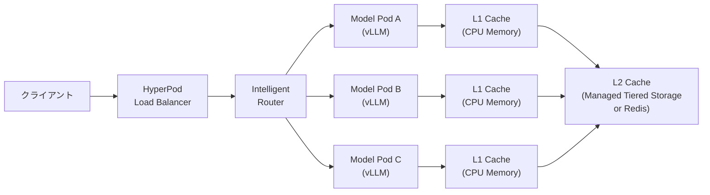
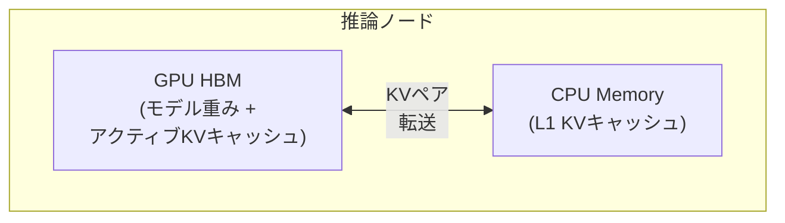
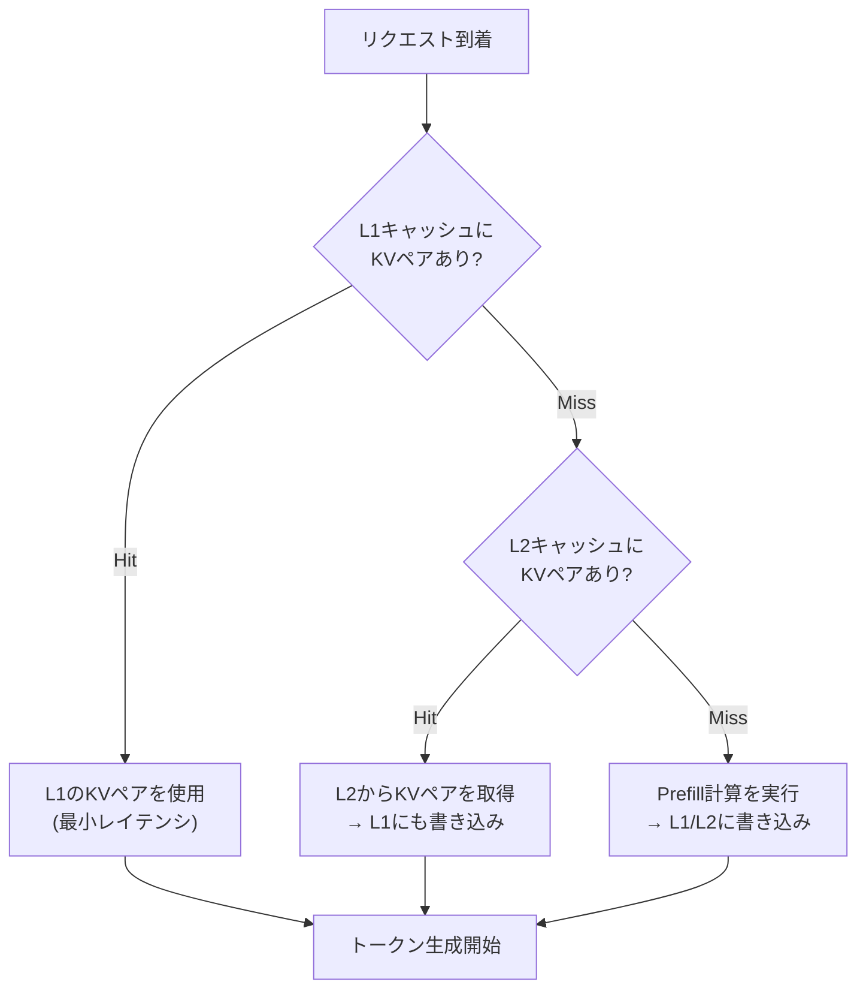
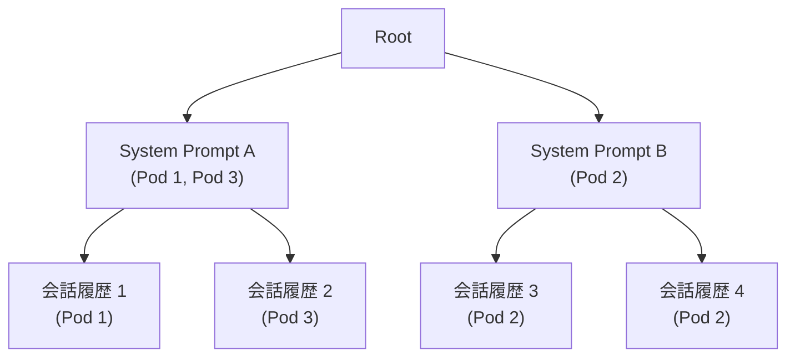
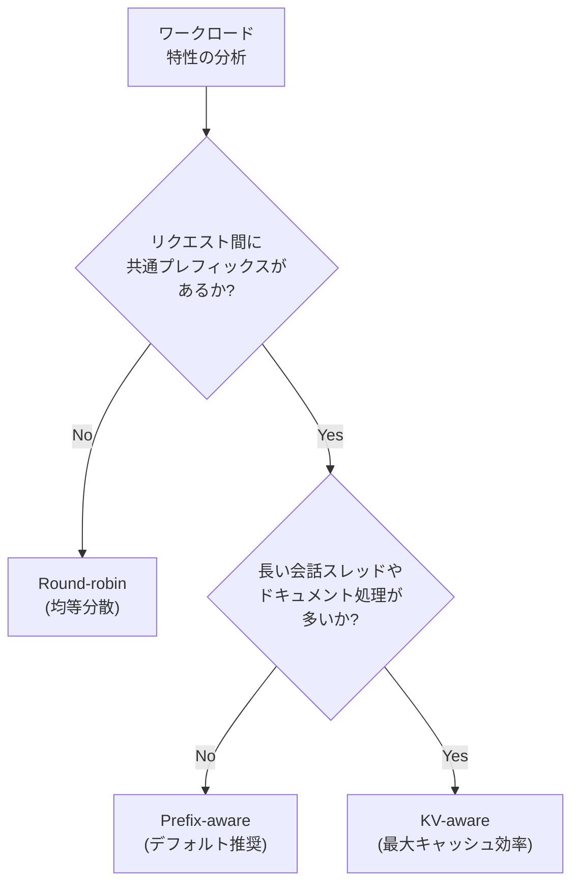
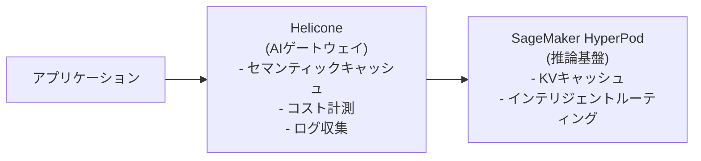

本記事は [https://aws.amazon.com/blogs/machine-learning/managed-tiered-kv-cache-and-intelligent-routing-for-amazon-sagemaker-hyperpod/](https://aws.amazon.com/blogs/machine-learning/managed-tiered-kv-cache-and-intelligent-routing-for-amazon-sagemaker-hyperpod/) の解説記事です。

## ブログ概要（Summary）

AWSは2025年11月、Amazon SageMaker HyperPod向けに「Managed Tiered KV Cache」と「Intelligent Routing」の2つの機能を発表した。大規模言語モデル（LLM）の推論において、Transformerのattention計算で生成されるKey-Valueペアを2階層（L1ローカル / L2分散）でキャッシュし、3種のルーティング戦略（Prefix-aware / KV-aware / Round-robin）を組み合わせることで、Time to First Token（TTFT）の削減、スループットの向上、推論コストの低減を同時に達成する仕組みである。ブログのベンチマーク結果より、Llama-3.1-70B-Instructモデルにおいて64Kトークンコンテキストでは TTFT P50で94%削減、スループット38%向上、コスト28%削減が報告されている。

この記事は [Zenn記事: Heliconeセルフホストで始めるLLMコスト可視化と最適化](https://zenn.dev/0h_n0/articles/8ede678e9e4cd2) の深掘りです。Heliconeがリクエストレベルのコスト可視化・最適化を担うAIゲートウェイである一方、本記事で扱うSageMaker HyperPodの階層型KVキャッシュは、Heliconeがプロキシする先のLLMサービング基盤そのものを最適化するインフラレベルの技術であり、両者は異なるレイヤーで補完的に機能する。

## 情報源

- **種別**: 企業テックブログ
- **URL**: [https://aws.amazon.com/blogs/machine-learning/managed-tiered-kv-cache-and-intelligent-routing-for-amazon-sagemaker-hyperpod/](https://aws.amazon.com/blogs/machine-learning/managed-tiered-kv-cache-and-intelligent-routing-for-amazon-sagemaker-hyperpod/)
- **組織**: AWS Machine Learning Blog
- **発表日**: 2025年11月26日

## 技術的背景（Technical Background）

### LLM推論におけるKVキャッシュの役割

Transformerモデルの推論では、各attention層でQuery（$Q$）、Key（$K$）、Value（$V$）の3つの行列を計算する。自己回帰的なテキスト生成では、新しいトークンを1つ生成するたびに過去のすべてのトークンに対するKey-Valueペアが必要になる。

$$
\text{Attention}(Q, K, V) = \text{softmax}\left(\frac{QK^T}{\sqrt{d_k}}\right)V
$$

ここで、
- $Q \in \mathbb{R}^{1 \times d_k}$: 現在のトークンのQuery（生成フェーズでは1トークンずつ）
- $K \in \mathbb{R}^{n \times d_k}$: 過去$n$トークン分のKey
- $V \in \mathbb{R}^{n \times d_v}$: 過去$n$トークン分のValue
- $d_k$: Keyの次元数

KVキャッシュの目的は、過去のトークンに対する$K$と$V$を再計算せずに保持することである。これにより、新しいトークン生成時の計算量は$O(n \cdot d)$で済む（再計算する場合は$O(n^2 \cdot d)$）。

### KVキャッシュのメモリ課題

70Bパラメータ規模のモデルでは、KVキャッシュのメモリ消費量が無視できない。Llama-3.1-70Bの場合、80層 x 8ヘッド x 128次元（GQAでKVヘッド数はQヘッド数より少ない）の構成で、64Kトークンのコンテキストに対するKVキャッシュは1リクエストあたり数GBに達する。GPU HBM（High Bandwidth Memory）は容量に限りがあり（NVIDIA H100で80GB）、モデルの重み自体がメモリの大半を占めるため、KVキャッシュに割り当て可能な領域は限られる。

この問題に対し、AWSは「GPUメモリの外側にKVキャッシュを階層的に配置する」アプローチを採用した。

### なぜプレフィックスの共有が有効なのか

実運用のLLMワークロードでは、多くのリクエストが共通のシステムプロンプト、テンプレート、あるいはマルチターン会話の過去の履歴を共有する。例えば、カスタマーサポートボットでは数百のリクエストが同じシステムプロンプトを持ち、コーディングアシスタントでは同一セッション内のリクエストが過去の会話コンテキストを共有する。これらの共通プレフィックスに対するKVキャッシュを再利用できれば、prefillフェーズの計算を大幅に削減できる。

## 実装アーキテクチャ（Architecture）

### 全体構成

AWSが提示するアーキテクチャは、ロードバランサー、インテリジェントルーター、モデルインスタンス群の3層で構成される。



リクエストフローは以下の順序で処理される:

1. クライアントがHyperPodロードバランサーにリクエストを送信
2. ロードバランサーがインテリジェントルーターにリクエストを転送
3. ルーターが選択されたルーティング戦略に基づき、最適なモデルインスタンスを決定
4. モデルインスタンスがL1キャッシュ → L2キャッシュの順にKVペアを検索
5. キャッシュヒットした部分はprefill計算をスキップし、キャッシュミスした部分のみ計算
6. 新たに計算されたKVペアをL1・L2に書き戻し

### 2階層KVキャッシュの設計

#### L1キャッシュ（ローカル層）

L1キャッシュは各推論ノードのCPUメモリ上に配置される。GPUのHBMではなくCPUメモリを使う点が重要で、HBMはモデルの重みとアクティブなリクエストのKVキャッシュに専念させる設計である。



AWSはL1キャッシュのメモリ割り当てとevictionポリシーを自動管理すると述べている。GPUとCPU間のデータ転送にはPCIe接続が使われるため、HBM内アクセスと比較してレイテンシは増加するが、再計算コストよりは大幅に低い。

#### L2キャッシュ（分散層）

L2キャッシュはクラスタ全体にまたがる分散ストレージであり、AWSは2つのバックエンドを提供している。

**Managed Tiered KV Cache（推奨）**: AWSが独自に開発した分散メモリソリューション。AWSはこのバックエンドについて、テラバイト規模のプールへのスケーラビリティ、低レイテンシ、AWSネットワーク最適化、GPU-aware設計によるゼロコピーサポート、大規模でのコスト効率を特徴として挙げている。

**Redis**: 小～中規模のワークロード向け。エコシステムのツール群が利用でき、セットアップが容易である。

AWSはブログのベンチマーク結果より、Managed Tiered StorageがRedisベースのL2キャッシュを全シナリオで上回ったと報告している。

#### キャッシュルックアップのフロー



### 3種のルーティング戦略

インテリジェントルーターは、リクエストをどのモデルインスタンスに振り分けるかを決定する。キャッシュヒット率を最大化するためのルーティング戦略がパフォーマンスに直結する。

#### Prefix-aware Routing（デフォルト）

ルーターが木構造（radix tree）を内部的に保持し、どのプレフィックスがどのエンドポイントにキャッシュされているかを追跡する。新しいリクエストが到着すると、リクエストのプロンプトを木構造と照合し、最長一致するプレフィックスを持つエンドポイントにルーティングする。



適するユースケースとして、AWSはマルチターン会話、共通テンプレートを持つカスタマーサービスボット、定型の挨拶やシステムプロンプトを共有するアプリケーションを挙げている。

#### KV-aware Routing

集中型コントローラーが、各エンドポイントのKVキャッシュの状態（どのKVペアがどこにあるか、メモリ使用量、eviction状態）をリアルタイムに追跡する。Prefix-awareがプレフィックスの一致のみを見るのに対し、KV-awareはキャッシュの実際の存在状況を把握しているため、evictionが発生した後でも正確なルーティングが可能である。

適するユースケースとして、長い会話スレッド、ドキュメント処理ワークフロー、拡張コーディングセッションなど、キャッシュ効率の最大化が求められるワークロードが挙げられている。

#### Round-robin Routing

リクエストを利用可能なワーカー間で均等に分配する。キャッシュの再利用は考慮しない。独立したリクエスト、バッチ推論、ステートレスなAPI呼び出し、負荷テストに適している。

### デプロイメント設定

AWSが提示するKubernetes Custom Resource Definitionは以下の形式である:

```yaml
apiVersion: inference.sagemaker.aws.amazon.com/v1
kind: InferenceEndpointConfig
metadata:
  name: ${NAME}
  namespace: ${NAMESPACE}
spec:
  kvCacheSpec:
    enableL1Cache: true
    enableL2Cache: true
    l2CacheSpec:
      l2CacheBackend: "tieredstorage"  # or "redis"
  intelligentRoutingSpec:
    enabled: true
    routingStrategy: prefixaware  # or "kvaware", "roundrobin"
  loadBalancer:
    healthCheckPath: /health
```

vLLMとの統合はモデル引数で制御される:

```yaml
# モデル引数（ブログに記載されたベンチマーク設定）
env:
  - name: OPTION_ROLLING_BATCH
    value: "vllm"
args:
  - "--max-model-len"
  - "20000"
  - "--tensor-parallel-size"
  - "4"
```

## Production Deployment Guide

SageMaker HyperPodの階層型KVキャッシュを自社のLLM推論基盤で活用するためのデプロイメントガイドを示す。HyperPodはマネージドサービスであるため、ここではHyperPodクラスタの構築・運用に焦点を当てる。本ガイドでは、ワークロード規模に応じた3段階の構成パターン、Terraformによるインフラ構築、運用監視設定、コスト最適化の4つの観点から解説する。

### AWS実装パターン（コスト最適化重視）

SageMaker HyperPodの階層型KVキャッシュは、GPUインスタンスを前提としたサービスであるため、ワークロード規模に応じたクラスタ構成を検討する。以下にSmall、Medium、Largeの3段階の構成パターンを示す。

| 構成 | レプリカ数 | インスタンスタイプ | 月額概算 | ユースケース |
|------|----------|------------------|---------|------------|
| Small | 2台 | ml.g5.2xlarge | $3,000-5,000 | 社内ツール、PoC |
| Medium | 4台 | ml.p4d.24xlarge | $30,000-50,000 | 中規模プロダクション |
| Large | 7台+ | ml.p5.48xlarge | $150,000-250,000 | 大規模本番サービス |

**Small構成（~100 req/日）**: ml.g5.2xlarge（NVIDIA A10G GPU x1）を2台使用する。L1キャッシュのみ有効化し、L2は無効にすることでオーバーヘッドを抑える。ルーティング戦略はPrefix-awareを推奨する。社内ツールやPoCでの検証に適しており、月額$3,000-5,000で運用可能である。KVキャッシュの効果を検証するための最小構成として位置づけられる。

**Medium構成（~1000 req/日）**: ml.p4d.24xlarge（NVIDIA A100 GPU x8）を4台使用する。L1/L2キャッシュの両方を有効化し、L2バックエンドにはRedisを選択する。Redisの運用が既にある組織ではElastiCacheとの統合が容易である。中規模のプロダクション環境向けで、月額$30,000-50,000を見込む。

**Large構成（10000+ req/日）**: ml.p5.48xlarge（NVIDIA H100 GPU x8）を7台以上使用する。AWSブログのベンチマーク構成と同等であり、L2バックエンドにはManaged Tiered Storageを選択する。テラバイト規模のKVキャッシュプールが必要な大規模本番サービス向けで、月額$150,000-250,000を見込む。KV-aware routingにより、eviction後も正確なルーティングが維持される。

コスト試算の注意: 上記は記事執筆時点（2026年5月）のus-east-1リージョンに基づく概算値である。HyperPod Savings Plansの適用、リージョン選択、実際のリクエストパターンにより変動する。最新の料金はAWS料金計算ツール（AWS Pricing Calculator）で確認を推奨する。

**コスト削減テクニック**:
- **HyperPod Savings Plans**: 1年コミットで最大64%削減。3年コミットではさらに割引率が上がるが、GPU世代の進化速度を考慮すると1年コミットが現実的である
- **階層型KVキャッシュ自体のコスト効果**: ブログのベンチマーク結果より、64Kコンテキストで28%のコスト削減。キャッシュヒット率が高いワークロードほど効果が大きい
- **Spot Instances for Worker Nodes**: 非推論ノード（データ前処理、ログ集約等）にSpot活用で最大90%削減。推論ノード自体はOn-Demandを推奨（GPU Spotは可用性が低い）
- **KVキャッシュによるGPU効率化**: prefill計算のスキップにより同一GPU数でより多くのリクエストを処理可能。スループット向上分（8Kで24%、64Kで38%）がそのままコスト効率に直結する

### Terraformインフラコード

以下にSmall構成とLarge構成のTerraformコードを示す。HyperPodはKubernetes Custom Resource Definition（CRD）でエンドポイントを管理するため、Terraform側ではVPC、IAM、監視リソースの構築を担う。HyperPodクラスタ自体の作成はSageMaker APIまたはAWS CLIで行い、クラスタ内の`InferenceEndpointConfig`リソースでKVキャッシュとルーティングを設定する。セキュリティ面では、IAMロールに最小権限の原則を適用し、VPCはプライベートサブネットのみの構成としている。

**HyperPodクラスタ構成（Small）**:

```hcl
# SageMaker HyperPod Cluster with Tiered KV Cache
# 注意: HyperPodはCloudFormation/Terraform対応が限定的。
# 以下はSageMaker APIを使った構成の参考例。

resource "aws_iam_role" "hyperpod_execution" {
  name = "hyperpod-kvcache-execution-role"

  assume_role_policy = jsonencode({
    Version = "2012-10-17"
    Statement = [{
      Action = "sts:AssumeRole"
      Effect = "Allow"
      Principal = {
        Service = "sagemaker.amazonaws.com"
      }
    }]
  })
}

resource "aws_iam_role_policy_attachment" "hyperpod_s3" {
  role       = aws_iam_role.hyperpod_execution.name
  policy_arn = "arn:aws:iam::aws:policy/AmazonS3ReadOnlyAccess"
}

resource "aws_iam_role_policy" "hyperpod_kvcache" {
  name = "hyperpod-kvcache-policy"
  role = aws_iam_role.hyperpod_execution.id

  policy = jsonencode({
    Version = "2012-10-17"
    Statement = [
      {
        Effect = "Allow"
        Action = [
          "sagemaker:CreateCluster",
          "sagemaker:DescribeCluster",
          "sagemaker:UpdateCluster",
          "elasticache:DescribeCacheClusters",  # Redis L2用
          "elasticache:CreateCacheCluster"
        ]
        Resource = "*"
      }
    ]
  })
}

# VPC for HyperPod (プライベートサブネット必須)
resource "aws_vpc" "hyperpod" {
  cidr_block           = "10.0.0.0/16"
  enable_dns_hostnames = true
  enable_dns_support   = true

  tags = {
    Name    = "hyperpod-kvcache-vpc"
    Project = "llm-inference"
  }
}

resource "aws_subnet" "private" {
  count             = 2
  vpc_id            = aws_vpc.hyperpod.id
  cidr_block        = "10.0.${count.index + 1}.0/24"
  availability_zone = data.aws_availability_zones.available.names[count.index]

  tags = {
    Name = "hyperpod-private-${count.index}"
  }
}

data "aws_availability_zones" "available" {
  state = "available"
}

# CloudWatch アラーム: GPU使用率監視
resource "aws_cloudwatch_metric_alarm" "gpu_utilization" {
  alarm_name          = "hyperpod-gpu-utilization-low"
  comparison_operator = "LessThanThreshold"
  evaluation_periods  = 3
  metric_name         = "GPUUtilization"
  namespace           = "AWS/SageMaker"
  period              = 300
  statistic           = "Average"
  threshold           = 30
  alarm_description   = "GPU使用率が30%以下: KVキャッシュ設定やルーティング戦略の見直しを検討"
  alarm_actions       = [aws_sns_topic.alerts.arn]
}

resource "aws_sns_topic" "alerts" {
  name = "hyperpod-kvcache-alerts"
}

# AWS Budgets: 月額コスト監視
resource "aws_budgets_budget" "hyperpod" {
  name         = "hyperpod-monthly-budget"
  budget_type  = "COST"
  limit_amount = "6000"
  limit_unit   = "USD"
  time_unit    = "MONTHLY"

  notification {
    comparison_operator       = "GREATER_THAN"
    threshold                 = 80
    threshold_type            = "PERCENTAGE"
    notification_type         = "FORECASTED"
    subscriber_sns_topic_arns = [aws_sns_topic.alerts.arn]
  }
}
```

**Large構成（EKS + HyperPod連携）**:

```hcl
# EKS Cluster for HyperPod orchestration
module "eks" {
  source  = "terraform-aws-modules/eks/aws"
  version = "~> 20.0"

  cluster_name    = "hyperpod-kvcache-cluster"
  cluster_version = "1.31"
  vpc_id          = aws_vpc.hyperpod.id
  subnet_ids      = aws_subnet.private[*].id

  # Karpenter for auto-scaling (Spot優先)
  cluster_addons = {
    karpenter = { most_recent = true }
  }
}

# Karpenter NodePool: GPU Spot Instances
resource "kubectl_manifest" "karpenter_nodepool" {
  yaml_body = <<-YAML
    apiVersion: karpenter.sh/v1
    kind: NodePool
    metadata:
      name: gpu-inference
    spec:
      template:
        spec:
          requirements:
            - key: "karpenter.k8s.aws/instance-family"
              operator: In
              values: ["p5", "p4d"]
            - key: "karpenter.sh/capacity-type"
              operator: In
              values: ["on-demand"]  # GPU推論はOn-Demand推奨
          nodeClassRef:
            group: karpenter.k8s.aws
            kind: EC2NodeClass
            name: gpu-nodes
      limits:
        cpu: "256"
        memory: "2048Gi"
        nvidia.com/gpu: "64"
  YAML
}
```

### 運用・監視設定

階層型KVキャッシュの効果を継続的に測定するには、キャッシュヒット率、TTFT、コストの3つのメトリクスを監視する必要がある。特にキャッシュヒット率はルーティング戦略の選択が適切かどうかを判断する指標であり、L1ヒット率が低い場合はルーティング戦略の変更を、L2ヒット率も低い場合はL2バックエンドの容量拡張を検討する。以下にCloudWatch Logs Insights、TTFT監視アラーム、Cost Explorer日次レポートの具体的な設定例を示す。

**CloudWatch Logs Insights: KVキャッシュヒット率分析**:

```
# KVキャッシュヒット率の時系列分析
fields @timestamp, @message
| filter @message like /cache_hit/
| stats count(*) as total,
        sum(case when @message like /L1_hit/ then 1 else 0 end) as l1_hits,
        sum(case when @message like /L2_hit/ then 1 else 0 end) as l2_hits,
        sum(case when @message like /cache_miss/ then 1 else 0 end) as misses
  by bin(1h)
| sort @timestamp desc
```

**TTFT監視アラーム設定（Python boto3）**:

```python
import boto3
from datetime import datetime

cloudwatch = boto3.client("cloudwatch")


def create_ttft_alarm(endpoint_name: str, threshold_ms: float = 500.0) -> dict:
    """TTFT P90が閾値を超えた場合のアラームを設定する。

    Args:
        endpoint_name: SageMakerエンドポイント名
        threshold_ms: TTFT P90の閾値（ミリ秒）

    Returns:
        CloudWatch PutMetricAlarm のレスポンス
    """
    return cloudwatch.put_metric_alarm(
        AlarmName=f"{endpoint_name}-ttft-p90-high",
        MetricName="TimeToFirstToken",
        Namespace="AWS/SageMaker/InferenceEndpoints",
        Statistic="p90",
        Period=300,
        EvaluationPeriods=3,
        Threshold=threshold_ms,
        ComparisonOperator="GreaterThanThreshold",
        Dimensions=[
            {"Name": "EndpointName", "Value": endpoint_name},
        ],
        AlarmActions=["arn:aws:sns:ap-northeast-1:123456789012:hyperpod-alerts"],
        AlarmDescription="TTFT P90がスパイク: ルーティング戦略の変更またはL2キャッシュ拡張を検討",
    )
```

**Cost Explorer日次レポート（Python）**:

```python
import boto3
from datetime import date, timedelta


def get_daily_hyperpod_cost() -> dict:
    """HyperPod関連の日次コストを取得する。

    Returns:
        サービス別コストの辞書
    """
    ce = boto3.client("ce")
    today = date.today()
    yesterday = today - timedelta(days=1)

    response = ce.get_cost_and_usage(
        TimePeriod={
            "Start": yesterday.isoformat(),
            "End": today.isoformat(),
        },
        Granularity="DAILY",
        Metrics=["UnblendedCost"],
        Filter={
            "Dimensions": {
                "Key": "SERVICE",
                "Values": [
                    "Amazon SageMaker",
                    "Amazon ElastiCache",  # Redis L2使用時
                ],
            }
        },
        GroupBy=[{"Type": "DIMENSION", "Key": "SERVICE"}],
    )

    costs = {}
    for group in response["ResultsByTime"][0]["Groups"]:
        service = group["Keys"][0]
        amount = float(group["Metrics"]["UnblendedCost"]["Amount"])
        costs[service] = amount
    return costs
```

### コスト最適化チェックリスト

HyperPodの階層型KVキャッシュ環境において、コストを継続的に最適化するためのチェックリストを以下に示す。導入初期にはアーキテクチャ選択とリソース最適化を、運用フェーズではKVキャッシュ最適化と監視・アラートを重点的に確認する。

**アーキテクチャ選択**:
- [ ] ワークロード規模に応じた構成選択（Small/Medium/Large）
- [ ] L2キャッシュバックエンドの選択（小規模: Redis、大規模: Managed Tiered Storage）
- [ ] ルーティング戦略がワークロードパターンに適合しているか確認

**リソース最適化**:
- [ ] HyperPod Savings Plans（1年コミット）の検討
- [ ] 非推論ワーカーへのSpot Instances適用
- [ ] tensor-parallel-sizeの最適化（GPU数に合わせて調整）
- [ ] max-model-lenの適切な設定（不要に大きい値は避ける）
- [ ] 開発/ステージング環境の夜間・週末停止

**KVキャッシュ最適化**:
- [ ] L1キャッシュの有効化確認
- [ ] L2キャッシュの有効化とバックエンド選択
- [ ] ルーティング戦略のA/Bテスト（Prefix-aware vs KV-aware）
- [ ] キャッシュヒット率の定期モニタリング

**監視・アラート**:
- [ ] AWS Budgets設定（月額予算の80%で通知）
- [ ] TTFT P90アラーム設定
- [ ] GPU使用率低下アラーム（キャッシュ設定の見直しトリガー）
- [ ] Cost Anomaly Detection有効化
- [ ] 日次コストレポートの自動送信

**リソース管理**:
- [ ] 未使用エンドポイントの定期的な削除
- [ ] タグ戦略の徹底（Project, Environment, Owner）
- [ ] CloudTrailによるAPI監査の有効化
- [ ] ログのライフサイクルポリシー設定（90日保持 → S3 Glacier）

## パフォーマンス最適化（Performance）

### ベンチマーク結果

AWSはLlama-3.1-70B-Instructモデルを7台のp5.48xlargeインスタンス（各8基のNVIDIA H100 GPU搭載）にデプロイし、tensor-parallel-size=4、max-model-len=20000の設定でベンチマークを実施している。ブログのベンチマーク結果より、以下の数値が報告されている。

| メトリクス | 8Kコンテキスト | 64Kコンテキスト |
|-----------|-------------|---------------|
| TTFT P90削減 | 40% | 35% |
| TTFT P50削減 | 72% | 94% |
| スループット向上 | 24% | 38% |
| コスト削減 | 21% | 28% |

注目すべき点は、コンテキスト長が長いほど効果が大きいことである。64Kトークンでは、prefill計算が全体の処理時間に占める割合が大きく、キャッシュヒットによるprefillスキップの恩恵がより顕著になる。TTFT P50で94%の削減は、大半のリクエストでプレフィックスキャッシュが有効に機能していることを示している。

### TTFTへの影響の定量的理解

TTFTは、prefillフェーズの計算時間に直接依存する。prefillフェーズでは入力プロンプトの全トークンに対して$K$と$V$を計算する必要がある。コンテキスト長$n$のうち、キャッシュヒットしたプレフィックス長を$m$とすると、prefill計算は$(n - m)$トークン分で済む。

$$
\text{TTFT}_{\text{cached}} \approx \text{TTFT}_{\text{baseline}} \times \frac{n - m}{n}
$$

64Kコンテキストで共通プレフィックスが60Kトークンの場合、prefill計算量は$\frac{64000 - 60000}{64000} \approx 6.25\%$に削減される。P50で94%削減という報告はこの理論と整合的である。

### ルーティング戦略の選択指針

AWSのブログから読み取れるルーティング戦略の選択基準を整理する。



## 運用での学び（Production Lessons）

### L2バックエンドの選択

AWSはManaged Tiered StorageがRedisを全シナリオで上回ったと報告しているが、運用観点では以下の判断基準が考えられる。

**Managed Tiered Storageを選択すべきケース**:
- 7台以上のGPUインスタンスを使う大規模クラスタ
- 64K以上の長コンテキストワークロード
- テラバイト規模のKVキャッシュプールが必要な場合
- AWSネットワーク最適化によるレイテンシ最小化が求められる場合

**Redisを選択すべきケース**:
- 2-3台のSmall構成でPoC的に導入する場合
- 既存のRedisクラスタ運用ノウハウがある場合
- キャッシュ内容の可視化やデバッグにRedis CLIを活用したい場合

### キャッシュのウォームアップ戦略

階層型KVキャッシュはコールドスタート時にはキャッシュが空であるため、初期のTTFTは改善されない。プロダクション環境では以下のウォームアップ戦略が有効である。

1. **事前ウォームアップリクエスト**: デプロイ後にシステムプロンプト付きのダミーリクエストを各インスタンスに送信し、共通プレフィックスのKVペアをL1/L2に事前投入する
2. **段階的トラフィック移行**: Blue-Greenデプロイメントで新クラスタに段階的にトラフィックを移行し、キャッシュが温まるまでの間のTTFT劣化を最小化する
3. **永続的L2キャッシュ**: Managed Tiered Storageをデプロイ間で永続化し、クラスタ再起動後もL2キャッシュを利用可能にする

### Heliconeとの連携による多層最適化

関連するZenn記事で扱っているHeliconeは、AIゲートウェイとしてリクエストのログ収集・コスト可視化・セマンティックキャッシュを提供する。SageMaker HyperPodの階層型KVキャッシュと組み合わせることで、以下の多層最適化が実現できる。



Heliconeのセマンティックキャッシュは「意味的に同一の質問」に対するレスポンス全体をキャッシュする（アプリケーション層の最適化）。一方、HyperPodのKVキャッシュは「トークン列として共通するプレフィックス部分」のattention計算結果をキャッシュする（インフラ層の最適化）。両者はレイヤーが異なるため競合せず、HeliconeでキャッシュミスしたリクエストがHyperPodに到達した際にも、KVキャッシュによるprefill最適化の恩恵を受けられる。

## 学術研究との関連（Academic Connection）

AWSの階層型KVキャッシュは、学術分野で活発に研究されているKVキャッシュ最適化手法と密接に関連する。

**PagedAttention（vLLM, Kwon et al., 2023）**: vLLMの基盤技術であるPagedAttentionは、KVキャッシュをOS仮想メモリのページング手法で管理する。SageMaker HyperPodのvLLM統合はこのPagedAttentionの上に構築されており、L1キャッシュはPagedAttentionのメモリプールと連携している。

**SGLang RadixAttention（Zheng et al., 2024）**: prefix-aware routingで使われる木構造によるプレフィックス追跡は、SGLangのRadixAttentionと設計思想が類似している。RadixAttentionはradix treeでKVキャッシュのプレフィックスを管理し、複数リクエスト間での自動的なプレフィックス再利用を実現する。AWSのPrefix-aware routingは、これを分散環境に拡張し、複数ノード間でのプレフィックスルーティングを追加した形と解釈できる。

**CacheGen（Liu et al., 2024）**: KVキャッシュの圧縮・転送に関する研究。L2キャッシュでのネットワーク転送時の効率化にCacheGenのような圧縮手法が応用されている可能性がある。AWSが述べる「ゼロコピーサポート」は、GPU-CPU間のデータ転送を最小化する手法であり、学術研究のKVキャッシュ圧縮とは異なるアプローチだが、同じ「転送コスト削減」という目的を共有する。

## まとめと実践への示唆

AWSのManaged Tiered KV CacheとIntelligent Routingは、LLM推論のprefillフェーズにおける冗長な計算を削減する実践的な技術である。2階層のキャッシュ設計（L1ローカル + L2分散）と3種のルーティング戦略の組み合わせにより、ブログのベンチマーク結果より64Kコンテキストでは TTFT P50で94%削減、スループット38%向上、コスト28%削減が報告されている。

実務への示唆として、以下の3点が挙げられる。まず、マルチターン会話やシステムプロンプトの共有が多いワークロードでは、Prefix-aware routingの導入が費用対効果が高い。次に、コンテキスト長が長いユースケースほどKVキャッシュの効果が大きいため、長文ドキュメント処理やRAGパイプラインでの採用を検討する価値がある。最後に、Heliconeのようなアプリケーション層のキャッシュ・可視化ツールと組み合わせることで、ゲートウェイ層からインフラ層まで一貫したコスト最適化が実現可能である。

## 参考文献

- **Blog URL**: [https://aws.amazon.com/blogs/machine-learning/managed-tiered-kv-cache-and-intelligent-routing-for-amazon-sagemaker-hyperpod/](https://aws.amazon.com/blogs/machine-learning/managed-tiered-kv-cache-and-intelligent-routing-for-amazon-sagemaker-hyperpod/)
- **Related Papers**:
  - Kwon, W., et al. "Efficient Memory Management for Large Language Model Serving with PagedAttention." SOSP 2023. [https://arxiv.org/abs/2309.06180](https://arxiv.org/abs/2309.06180)
  - Zheng, L., et al. "SGLang: Efficient Execution of Structured Language Model Programs." 2024. [https://arxiv.org/abs/2312.07104](https://arxiv.org/abs/2312.07104)
  - Liu, F., et al. "CacheGen: KV Cache Compression and Streaming for Fast Large Language Model Serving." SIGCOMM 2024. [https://arxiv.org/abs/2310.07240](https://arxiv.org/abs/2310.07240)
- **Related Zenn article**: [https://zenn.dev/0h_n0/articles/8ede678e9e4cd2](https://zenn.dev/0h_n0/articles/8ede678e9e4cd2)
- **Amazon SageMaker HyperPod**: [https://aws.amazon.com/sagemaker/hyperpod/](https://aws.amazon.com/sagemaker/hyperpod/)
