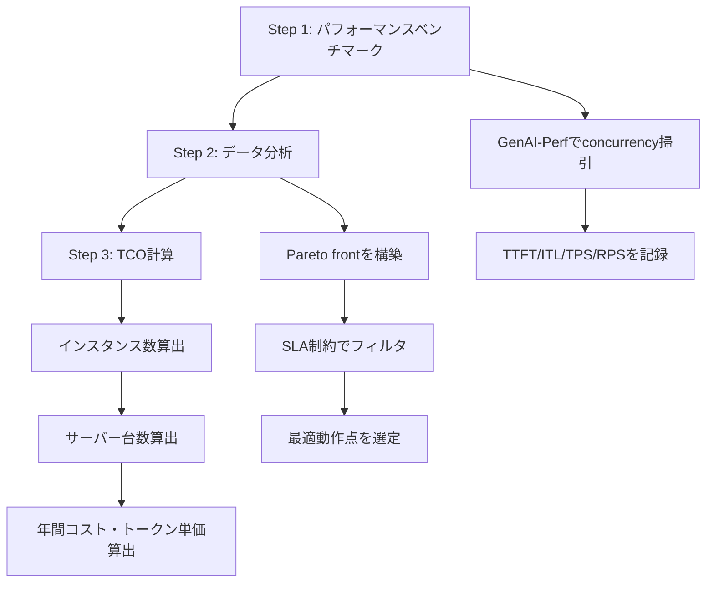
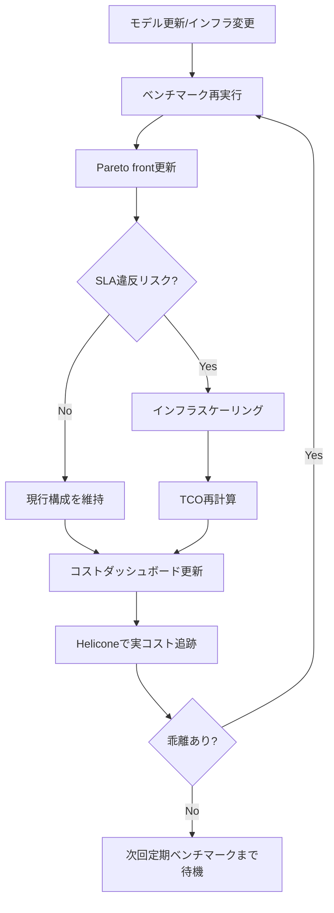

本記事は [https://developer.nvidia.com/blog/llm-inference-benchmarking-how-much-does-your-llm-inference-cost/](https://developer.nvidia.com/blog/llm-inference-benchmarking-how-much-does-your-llm-inference-cost/) の解説記事です。

## ブログ概要

NVIDIAが2025年6月に公開した「LLM Inference Benchmarking: How Much Does Your LLM Inference Cost?」は、LLM推論の総所有コスト（TCO: Total Cost of Ownership）を体系的に算出するための3ステップ手法を提示している。著者のVinh NguyenとSergio Perezは、パフォーマンスベンチマーキング、データ分析、TCO計算という段階的アプローチによって、LLMをセルフホストする際のコストを定量的に見積もる方法を解説している。

本ブログ記事の核となるのは以下の3点である。

1. **GenAI-Perfによるベンチマーク収集**: NVIDIAが開発したベンチマークツールGenAI-Perfを用いて、TTFT（Time To First Token）、ITL（Inter-Token Latency）、TPS（Tokens Per Second）、RPS（Requests Per Second）といったレイテンシ・スループット指標を体系的に測定する手法
2. **Pareto最適化によるインフラサイジング**: レイテンシとスループットのトレードオフをPareto frontとして可視化し、SLA要件を満たす構成を選定するアプローチ
3. **TCO計算フレームワーク**: ハードウェア減価償却、ソフトウェアライセンス、ホスティング費用を含む年間コストから、100万トークンあたりの推論コストを導出する計算式

関連Zenn記事「[Heliconeセルフホストで始めるLLMコスト可視化と最適化](https://zenn.dev/0h_n0/articles/8ede678e9e4cd2)」では、Heliconeを用いたLLMコストの可視化手法を扱っている。NVIDIAの本ベンチマーキング手法は、Heliconeが追跡するコスト指標の基盤となる計測手法を提供するものであり、コストベースライン確立の前段階として位置づけられる。

## 情報源

| 項目 | 内容 |
|------|------|
| タイトル | LLM Inference Benchmarking: How Much Does Your LLM Inference Cost? |
| 著者 | Vinh Nguyen, Sergio Perez |
| 組織 | NVIDIA |
| 公開日 | 2025年6月18日 |
| URL | [developer.nvidia.com](https://developer.nvidia.com/blog/llm-inference-benchmarking-how-much-does-your-llm-inference-cost/) |
| 関連ツール | GenAI-Perf, NVIDIA Inference Microservice (NIM) |

## 技術的背景

### LLM推論コストの構造的課題

LLMの推論コストは、単純なGPU利用料だけでは把握できない。NVIDIAはブログにおいて、推論コストが以下の要素から構成されると説明している。

- **ハードウェア費用**: GPU搭載サーバーの購入費（減価償却）
- **ソフトウェア費用**: 推論フレームワーク、オーケストレーションツールのライセンス
- **ホスティング費用**: データセンターの電力、冷却、ラック費用
- **運用コスト**: 監視、メンテナンス、人件費

クラウドAPIの従量課金モデル（例: OpenAI API）では、これらのコストがトークン単価に包含されている。一方、セルフホスト環境ではこれらを個別に見積もる必要があり、とりわけGPUの選択やデプロイ精度（FP4/FP8/BF16）によってスループットが数倍変動するため、適切なベンチマークなしにはコスト見積もりが困難である。

### 推論パフォーマンス指標の定義

NVIDIAは、LLM推論のパフォーマンスを評価するために4つの指標を定義している。

| 指標 | 正式名称 | 定義 | 単位 |
|------|----------|------|------|
| TTFT | Time To First Token | リクエスト送信から最初のトークン生成までの時間 | ms |
| ITL | Inter-Token Latency | トークン間の生成遅延 | ms |
| TPS | Tokens Per Second | 1秒あたりの生成トークン数（単一リクエスト視点） | tokens/s |
| RPS | Requests Per Second | 1秒あたりの処理リクエスト数（システム視点） | req/s |

これらの指標は独立ではなく、トレードオフの関係にある。NVIDIAは、同時リクエスト数（concurrency）を増やすとRPSは向上するがTTFTやITLは悪化するというトレードオフが存在すると説明している。このトレードオフを可視化し、SLA要件を満たすための構成を選定する手法として、Pareto最適化が用いられる。

### Prefill vs Decode フェーズ

LLM推論は大きく2つのフェーズに分かれる。

1. **Prefillフェーズ**: 入力トークン列を処理し、KVキャッシュを構築する。TTFTに直接影響する計算密度の高いフェーズ
2. **Decodeフェーズ**: トークンを逐次生成する。ITLに影響するメモリバウンドなフェーズ

この2フェーズの特性の違いが、GPU選択やバッチサイズの最適化において考慮すべき要因となる。

## 実装アーキテクチャ

### 3ステップTCOアプローチ

NVIDIAが提示するTCO算出フレームワークは、以下の3ステップで構成される。



### Step 1: GenAI-Perfによるベンチマーク収集

GenAI-Perfは、NVIDIAが開発したLLM推論ベンチマークツールである。同時リクエスト数（concurrency）をパラメータとして掃引しながら、各設定でのレイテンシ・スループット指標を収集する。

NVIDIAは、ベンチマーク実行時に以下のパラメータを変化させると説明している。

- **concurrency**: 同時に処理するリクエスト数（1, 2, 4, 8, 16, 32, ...）
- **入力シーケンス長**: モデルへの入力トークン数
- **出力シーケンス長**: 生成する最大トークン数
- **デプロイ精度**: FP4, FP8, BF16

```python
"""GenAI-Perfベンチマーク結果のデータ構造例"""
from dataclasses import dataclass
from typing import Literal


@dataclass(frozen=True)
class BenchmarkResult:
    """単一ベンチマーク実行の結果を保持する。"""

    concurrency: int
    precision: Literal["FP4", "FP8", "BF16"]
    ttft_p50_ms: float
    ttft_p99_ms: float
    itl_p50_ms: float
    itl_p99_ms: float
    tps: float
    rps: float
    input_seq_len: int
    output_seq_len: int


@dataclass(frozen=True)
class SLAConstraint:
    """SLA制約を定義する。

    Attributes:
        max_ttft_ms: TTFTの上限値（ms）
        max_itl_ms: ITLの上限値（ms）
        min_tps: TPSの下限値
    """

    max_ttft_ms: float
    max_itl_ms: float
    min_tps: float

    def is_satisfied(self, result: BenchmarkResult) -> bool:
        """ベンチマーク結果がSLA制約を満たすか判定する。"""
        return (
            result.ttft_p99_ms <= self.max_ttft_ms
            and result.itl_p99_ms <= self.max_itl_ms
            and result.tps >= self.min_tps
        )
```

### Step 2: Pareto最適化によるデータ分析

ベンチマーク結果の集合から、レイテンシとスループットのトレードオフにおいてPareto最適な構成を抽出する。Pareto frontとは、ある指標を改善しようとすると他の指標が必ず悪化する点の集合である。

NVIDIAは、レイテンシ（TTFTまたはITL）を縦軸、スループット（RPS）を横軸にプロットし、Pareto frontを構築すると説明している。SLA制約をフィルタとして適用することで、運用要件を満たす構成の中から最もスループットの高い動作点を選定できる。

```python
"""Pareto front抽出のアルゴリズム"""
from typing import Sequence


def extract_pareto_front(
    results: Sequence[BenchmarkResult],
    sla: SLAConstraint,
) -> list[BenchmarkResult]:
    """SLA制約を満たすベンチマーク結果からPareto frontを抽出する。

    Pareto最適: RPSを最大化しつつレイテンシ（TTFT p99）を最小化する。
    あるポイントが他のポイントに対して、RPSが同等以上かつTTFTが同等以下
    である場合、そのポイントは支配的（dominant）である。

    Args:
        results: ベンチマーク結果のシーケンス
        sla: SLA制約

    Returns:
        Pareto front上のベンチマーク結果リスト（RPSの昇順）
    """
    # SLA制約でフィルタ
    feasible = [r for r in results if sla.is_satisfied(r)]
    if not feasible:
        return []

    # RPSの昇順でソート
    feasible.sort(key=lambda r: r.rps)

    pareto: list[BenchmarkResult] = []
    for candidate in feasible:
        # 既存のPareto点に支配されていないか確認
        is_dominated = any(
            p.rps >= candidate.rps and p.ttft_p99_ms <= candidate.ttft_p99_ms
            for p in pareto
        )
        if not is_dominated:
            # candidateに支配される既存点を除去
            pareto = [
                p
                for p in pareto
                if not (
                    candidate.rps >= p.rps
                    and candidate.ttft_p99_ms <= p.ttft_p99_ms
                )
            ]
            pareto.append(candidate)

    pareto.sort(key=lambda r: r.rps)
    return pareto


def select_optimal_operating_point(
    pareto_front: list[BenchmarkResult],
) -> BenchmarkResult | None:
    """Pareto front上で最もRPSの高い動作点を選定する。

    Args:
        pareto_front: Pareto front上のベンチマーク結果

    Returns:
        最適動作点。Pareto frontが空の場合はNone
    """
    if not pareto_front:
        return None
    return max(pareto_front, key=lambda r: r.rps)
```

### Step 3: TCO計算

NVIDIAは、最適動作点のRPSから必要なインフラ規模を算出し、年間コストとトークン単価を導出する計算フレームワークを提示している。

#### インフラサイジング

まず、ピーク時のリクエストレートを処理するために必要なインスタンス数を算出する。

$$\text{Min Instances} = \left\lceil \frac{\text{Peak RPS}}{\text{Optimal RPS per Instance}} \right\rceil$$

次に、各インスタンスが必要とするGPU数を考慮してサーバー台数を算出する。

$$\text{Servers} = \left\lceil \frac{\text{Min Instances} \times \text{GPUs per Instance}}{\text{GPUs per Server}} \right\rceil$$

#### コスト計算

年間コストは以下の式で算出される。

$$\text{Yearly Cost} = \frac{\text{Server Cost}}{\text{Depreciation Years}} + \text{Software Cost} + \text{Hosting Cost}$$

100万トークンあたりのコストは、年間コストを年間の総処理トークン数で割って算出する。

$$\text{Cost per 1M Tokens} = \frac{\text{Yearly Cost}}{\text{Yearly Tokens (M)}}$$

```python
"""TCO計算モジュール"""
import math
from dataclasses import dataclass


@dataclass(frozen=True)
class InfraConfig:
    """インフラ構成パラメータ。

    Attributes:
        gpus_per_instance: 1インスタンスあたりのGPU数
        gpus_per_server: 1サーバーあたりのGPU数
        server_cost_usd: サーバー購入費用（USD）
        depreciation_years: 減価償却年数
        yearly_software_cost_usd: 年間ソフトウェア費用（USD）
        yearly_hosting_cost_usd: 年間ホスティング費用（USD）
    """

    gpus_per_instance: int
    gpus_per_server: int
    server_cost_usd: float
    depreciation_years: int
    yearly_software_cost_usd: float
    yearly_hosting_cost_usd: float


@dataclass(frozen=True)
class TrafficProfile:
    """トラフィックプロファイル。

    Attributes:
        peak_rps: ピーク時のリクエストレート（req/s）
        avg_input_tokens: 平均入力トークン数
        avg_output_tokens: 平均出力トークン数
        utilization_hours_per_day: 1日あたりの稼働時間
    """

    peak_rps: float
    avg_input_tokens: int
    avg_output_tokens: int
    utilization_hours_per_day: float = 24.0


@dataclass(frozen=True)
class TCOResult:
    """TCO計算結果。"""

    min_instances: int
    num_servers: int
    yearly_cost_usd: float
    cost_per_1m_input_tokens_usd: float
    cost_per_1m_output_tokens_usd: float


def calculate_tco(
    optimal_rps: float,
    infra: InfraConfig,
    traffic: TrafficProfile,
) -> TCOResult:
    """TCOを計算する。

    NVIDIAのブログで提示されたフレームワークに基づき、
    インフラサイジングからトークン単価までを一貫して算出する。

    Args:
        optimal_rps: 最適動作点でのRPS（1インスタンスあたり）
        infra: インフラ構成パラメータ
        traffic: トラフィックプロファイル

    Returns:
        TCO計算結果
    """
    # インスタンス数算出
    min_instances = math.ceil(traffic.peak_rps / optimal_rps)

    # サーバー台数算出
    total_gpus = min_instances * infra.gpus_per_instance
    num_servers = math.ceil(total_gpus / infra.gpus_per_server)

    # 年間コスト算出（サーバー台数分）
    yearly_hw_cost = (
        num_servers * infra.server_cost_usd / infra.depreciation_years
    )
    yearly_sw_cost = num_servers * infra.yearly_software_cost_usd
    yearly_hosting_cost = num_servers * infra.yearly_hosting_cost_usd
    yearly_cost = yearly_hw_cost + yearly_sw_cost + yearly_hosting_cost

    # 年間トークン処理量の算出
    seconds_per_year = traffic.utilization_hours_per_day * 3600 * 365
    yearly_requests = traffic.peak_rps * seconds_per_year
    yearly_input_tokens_m = (
        yearly_requests * traffic.avg_input_tokens / 1_000_000
    )
    yearly_output_tokens_m = (
        yearly_requests * traffic.avg_output_tokens / 1_000_000
    )

    # 入力:出力のコスト比を1:3と仮定（NVIDIAブログの参考価格に基づく）
    output_cost_ratio = 3.0
    total_weighted_tokens_m = (
        yearly_input_tokens_m + yearly_output_tokens_m * output_cost_ratio
    )

    cost_per_weighted_unit = yearly_cost / total_weighted_tokens_m
    cost_per_1m_input = cost_per_weighted_unit
    cost_per_1m_output = cost_per_weighted_unit * output_cost_ratio

    return TCOResult(
        min_instances=min_instances,
        num_servers=num_servers,
        yearly_cost_usd=yearly_cost,
        cost_per_1m_input_tokens_usd=cost_per_1m_input,
        cost_per_1m_output_tokens_usd=cost_per_1m_output,
    )
```

#### 計算例

NVIDIAのブログでは、以下の具体的なパラメータが示されている。

| パラメータ | 値 |
|-----------|-----|
| サーバー購入費 | $320,000 |
| 減価償却年数 | 4年 |
| 年間ホスティング費用 | $3,000 |
| 年間ソフトウェア費用 | $4,500 |
| 参考入力トークン単価 | $1 / 1Mトークン |
| 参考出力トークン単価 | $3 / 1Mトークン |

```python
"""NVIDIAブログの計算例"""

# パラメータ設定（NVIDIAブログより）
infra = InfraConfig(
    gpus_per_instance=1,
    gpus_per_server=8,  # DGX H100想定
    server_cost_usd=320_000,
    depreciation_years=4,
    yearly_software_cost_usd=4_500,
    yearly_hosting_cost_usd=3_000,
)

traffic = TrafficProfile(
    peak_rps=50.0,
    avg_input_tokens=512,
    avg_output_tokens=256,
    utilization_hours_per_day=24.0,
)

# 最適動作点のRPS（Pareto front分析結果の例）
optimal_rps_per_instance = 6.5

result = calculate_tco(optimal_rps_per_instance, infra, traffic)
print(f"必要インスタンス数: {result.min_instances}")
print(f"必要サーバー台数: {result.num_servers}")
print(f"年間コスト: ${result.yearly_cost_usd:,.0f}")
print(f"入力トークン単価: ${result.cost_per_1m_input_tokens_usd:.2f}/1Mトークン")
print(f"出力トークン単価: ${result.cost_per_1m_output_tokens_usd:.2f}/1Mトークン")
```

### デプロイ精度の比較

NVIDIAは、FP4、FP8、BF16の3つのデプロイ精度についてPareto最適化を通じた比較を行っている。精度を下げることでスループットが向上する一方、モデルの出力品質に影響が生じる可能性がある。

| 精度 | メモリ使用量 | スループット傾向 | 品質への影響 |
|------|-------------|----------------|-------------|
| BF16 | 大 | 基準 | なし |
| FP8 | BF16の約50% | BF16の約1.5-2倍 | タスク依存（多くの場合許容範囲内） |
| FP4 | BF16の約25% | BF16の約2-3倍 | 一部タスクで低下が観測される |

NVIDIAは、精度選択においてはベンチマークによるスループット測定と、対象タスクでの品質評価を併せて実施する必要があると説明している。

## Production Deployment Guide

ここでは、NVIDIAのTCOフレームワークを実際のプロダクション環境に適用するための実践的な手順を解説する。本ガイドは、NVIDIAのブログで提示された理論的フレームワークを、実運用に落とし込む際の具体的な手順と判断基準を補足するものである。

### Phase 1: ベンチマーク環境の構築と実行計画

プロダクション環境を模擬したベンチマーク環境を構築する。NVIDIAはGenAI-PerfをNVIDIA Inference Microservice（NIM）と組み合わせて使用することを推奨している。ベンチマーク環境の構築にあたっては、プロダクション環境と同一のハードウェア構成（GPU型番、メモリ容量、ネットワーク帯域）を使用することが重要である。異なるハードウェアで取得したベンチマーク結果は、プロダクション環境での実性能と乖離する可能性がある。

ベンチマーク実行計画では、以下の変数空間を網羅的に掃引する必要がある。concurrency（同時リクエスト数）は幾何級数的に増加させる（1, 2, 4, 8, 16, 32, 64, 128）。入力シーケンス長と出力シーケンス長は、実トラフィックの分布に基づいて代表的な値を選択する。デプロイ精度（FP4, FP8, BF16）は、各精度について独立にconcurrency掃引を実施する。合計で、精度3種類 × concurrency8段階 = 24回以上のベンチマーク実行が必要となる。

各ベンチマーク実行においては、測定間隔（measurement interval）を30秒以上に設定し、ウォームアップフェーズを含めることで定常状態のパフォーマンスを取得する。NVIDIAはGenAI-Perfの測定間隔として30,000ms（30秒）を推奨している。ウォームアップが不十分な場合、KVキャッシュの構築やCUDAカーネルのJITコンパイルの影響で、初期のレイテンシが高く計測されるため注意が必要である。

```bash
#!/bin/bash
# GenAI-Perfベンチマーク実行スクリプト例
# NIM + GenAI-Perf環境でのconcurrency掃引

set -euo pipefail

MODEL_NAME="meta/llama-3.1-70b-instruct"
ENDPOINT="http://localhost:8000/v1/chat/completions"
INPUT_SEQ_LEN=512
OUTPUT_SEQ_LEN=256
CONCURRENCIES=(1 2 4 8 16 32 64 128)
PRECISIONS=("FP4" "FP8" "BF16")
RESULTS_DIR="./benchmark_results"

mkdir -p "${RESULTS_DIR}"

for precision in "${PRECISIONS[@]}"; do
    for concurrency in "${CONCURRENCIES[@]}"; do
        echo "=== Benchmarking precision=${precision} concurrency=${concurrency} ==="

        genai-perf \
            --model "${MODEL_NAME}" \
            --endpoint "${ENDPOINT}" \
            --endpoint-type chat \
            --input-sequence-length "${INPUT_SEQ_LEN}" \
            --output-sequence-length "${OUTPUT_SEQ_LEN}" \
            --concurrency "${concurrency}" \
            --measurement-interval 30000 \
            --output-format json \
            > "${RESULTS_DIR}/result_${precision}_c${concurrency}.json"

        echo "Completed precision=${precision} concurrency=${concurrency}"
    done
done

echo "All benchmarks completed. Results in ${RESULTS_DIR}/"
```

### Phase 2: SLA定義とPareto分析

プロダクション環境のSLA要件を定義し、ベンチマーク結果からPareto frontを抽出する。SLA定義はアプリケーションの特性に応じて設定する必要がある。レイテンシ制約が厳しいリアルタイムアプリケーション（チャットボット、音声応答システム）と、スループット重視のバッチ処理（ドキュメント要約、データ分析パイプライン）では、適切なSLA値が異なる。

SLA定義において考慮すべき指標の典型的な値は以下の通りである。各用途に応じて、TTFTとITLの上限値、およびTPSの下限値を設定する。

- **チャットボット用途**: TTFT p99 < 500ms、ITL p99 < 50ms、TPS > 20
- **バッチ処理用途**: TTFT制約なし、スループット最大化、TPS制約なし
- **リアルタイム翻訳**: TTFT p99 < 200ms、ITL p99 < 30ms、TPS > 30
- **コード補完**: TTFT p99 < 300ms、ITL p99 < 40ms、TPS > 25

SLA定義後、Phase 1で取得したベンチマーク結果群に対してPareto分析を適用する。重要なのは、p50ではなくp99のレイテンシでSLA判定を行うことである。p50で判定した場合、テール（外れ値）レイテンシによるSLA違反を見逃す可能性がある。NVIDIAもブログにおいて、p99指標の使用を推奨している。

Pareto分析の結果、SLA制約を満たす構成が存在しない場合は、以下の対処を検討する。まず、GPU数を増やしてテンソル並列度を上げることでレイテンシを改善する。次に、デプロイ精度を下げる（BF16からFP8へ等）ことでスループットを向上させる。それでもSLA制約を満たせない場合は、SLA値自体の見直しをステークホルダーと協議する。

```python
"""プロダクション向けSLA定義とインフラサイジングの例"""


def production_sizing_example() -> None:
    """チャットボットサービスのインフラサイジング例。

    NVIDIAのフレームワークに基づき、SLA制約付きで
    最適なインフラ構成を算出する。
    """
    # SLA定義: チャットボット向け
    sla = SLAConstraint(
        max_ttft_ms=500.0,
        max_itl_ms=50.0,
        min_tps=20.0,
    )

    # ベンチマーク結果（GenAI-Perfの出力を想定）
    benchmark_results = [
        BenchmarkResult(
            concurrency=1, precision="FP8",
            ttft_p50_ms=80, ttft_p99_ms=120,
            itl_p50_ms=15, itl_p99_ms=25,
            tps=45, rps=1.2,
            input_seq_len=512, output_seq_len=256,
        ),
        BenchmarkResult(
            concurrency=8, precision="FP8",
            ttft_p50_ms=150, ttft_p99_ms=280,
            itl_p50_ms=22, itl_p99_ms=38,
            tps=38, rps=5.8,
            input_seq_len=512, output_seq_len=256,
        ),
        BenchmarkResult(
            concurrency=16, precision="FP8",
            ttft_p50_ms=300, ttft_p99_ms=480,
            itl_p50_ms=30, itl_p99_ms=48,
            tps=30, rps=8.5,
            input_seq_len=512, output_seq_len=256,
        ),
        BenchmarkResult(
            concurrency=32, precision="FP8",
            ttft_p50_ms=600, ttft_p99_ms=950,
            itl_p50_ms=45, itl_p99_ms=65,
            tps=22, rps=12.0,
            input_seq_len=512, output_seq_len=256,
        ),
    ]

    # Pareto front抽出
    pareto = extract_pareto_front(benchmark_results, sla)
    optimal = select_optimal_operating_point(pareto)

    if optimal is None:
        print("SLA制約を満たす構成が見つかりません")
        return

    print(f"最適動作点: concurrency={optimal.concurrency}, "
          f"RPS={optimal.rps}, TTFT p99={optimal.ttft_p99_ms}ms")

    # TCO計算
    infra = InfraConfig(
        gpus_per_instance=1,
        gpus_per_server=8,
        server_cost_usd=320_000,
        depreciation_years=4,
        yearly_software_cost_usd=4_500,
        yearly_hosting_cost_usd=3_000,
    )

    traffic = TrafficProfile(
        peak_rps=50.0,
        avg_input_tokens=512,
        avg_output_tokens=256,
    )

    tco = calculate_tco(optimal.rps, infra, traffic)
    print(f"必要サーバー台数: {tco.num_servers}")
    print(f"年間コスト: ${tco.yearly_cost_usd:,.0f}")
    print(f"入力: ${tco.cost_per_1m_input_tokens_usd:.2f}/1Mトークン")
    print(f"出力: ${tco.cost_per_1m_output_tokens_usd:.2f}/1Mトークン")
```

### Phase 3: キャパシティプランニングとスケーリング戦略

Pareto分析で最適動作点が決定したら、キャパシティプランニングに進む。ここでの判断は、TCOに直結するため慎重に行う。

まず、ピークRPSの見積もりにはヘッドルーム（余裕分）を含める。一般的に、ピーク予測値の1.2-1.5倍のキャパシティを確保することが推奨される。これは、トラフィックのバースト（突発的な急増）や、インスタンス障害時のフェイルオーバーに対応するためである。

スケーリング戦略は、水平スケーリング（インスタンス数の増減）を基本とする。垂直スケーリング（GPU数の増加）はレイテンシ改善に有効だが、テンソル並列のオーバーヘッドにより効率が低下する場合がある。NVIDIAのフレームワークでは、1インスタンスあたりの最適RPSを基準として水平方向にスケールする設計が前提となっている。

オートスケーリングの閾値設定においては、NVIDIAのベンチマーク結果から得られたPareto frontの情報が活用できる。具体的には、現在のconcurrencyがPareto front上のSLA限界点に接近している場合にスケールアウトをトリガーし、concurrencyが低い領域（GPU利用率が低い）に留まっている場合にスケールインを許容する。これにより、SLA違反を予防しながらコストを最適化するスケーリングポリシーを構築できる。

### Phase 4: 継続的ベンチマーキングとコスト追跡

プロダクション環境では、モデル更新やトラフィックパターンの変化に伴い、定期的なベンチマーク再実行が求められる。以下の運用フローを推奨する。



ベンチマーク再実行のトリガーとなるイベントは主に4つある。第一に、モデルの更新やバージョンアップ時である。新しいモデルは推論特性が異なるため、Pareto frontが変化する。第二に、サービングフレームワーク（vLLM、TensorRT-LLM等）のアップデート時である。最適化の改善によりスループットが向上する場合がある。第三に、トラフィックパターンの変化である。入力シーケンス長や出力シーケンス長の分布が変化すると、既存のベンチマーク結果が実態と乖離する。第四に、ハードウェアの世代交代時である。新GPUへの移行により、コスト構造全体が変動する。

ここで、[Helicone](https://zenn.dev/0h_n0/articles/8ede678e9e4cd2)のようなLLMオブザーバビリティツールとの連携が有効である。NVIDIAのフレームワークで算出したコストベースラインと、Heliconeで追跡する実稼働コストを比較することで、理論値と実測値の乖離を検出し、インフラ最適化のトリガーとすることができる。定期的（週次または月次）にベンチマーク理論値と実測値のダッシュボードを確認し、乖離が10%を超える場合にベンチマーク再実行をスケジュールするという運用ルールが実用的である。

### Phase 5: マルチモデル環境での適用

プロダクション環境では複数のモデルを同時に運用することが多い。各モデルに対して個別にベンチマークとTCO計算を行い、モデルごとのコスト効率を比較する。マルチモデル環境では、タスクの特性に応じてリクエストを適切なモデルにルーティングすることで、全体のコスト効率を改善できる。例えば、単純な分類タスクには小型モデル（低コスト・高スループット）を、複雑な推論タスクには大型モデル（高コスト・高品質）を割り当てるルーティング戦略が有効である。

```python
"""マルチモデル環境でのTCO比較"""
from dataclasses import dataclass


@dataclass(frozen=True)
class ModelTCOComparison:
    """モデル別TCO比較結果。"""

    model_name: str
    precision: str
    optimal_rps: float
    tco: TCOResult
    quality_score: float  # 0.0-1.0 のタスク品質スコア

    @property
    def cost_efficiency(self) -> float:
        """品質あたりのコスト効率（低いほど効率的）。"""
        if self.quality_score == 0:
            return float("inf")
        return self.tco.cost_per_1m_output_tokens_usd / self.quality_score


def compare_models(
    comparisons: list[ModelTCOComparison],
) -> list[ModelTCOComparison]:
    """モデル群をコスト効率順にソートする。

    Args:
        comparisons: モデル別TCO比較結果のリスト

    Returns:
        コスト効率の良い順にソートされたリスト
    """
    return sorted(comparisons, key=lambda c: c.cost_efficiency)
```

## パフォーマンス最適化

### Concurrencyチューニング

NVIDIAは、concurrency設定がパフォーマンスに与える影響について、以下のようなパターンを示している。

- **低concurrency（1-4）**: レイテンシは低いがGPU利用率が低く、スループットが制限される
- **中concurrency（8-32）**: レイテンシとスループットのバランスが取れる領域（Pareto front上の動作点が多い）
- **高concurrency（64以上）**: スループットは高いがレイテンシが大幅に悪化し、SLA制約を満たせなくなる傾向

最適なconcurrencyはモデルサイズ、GPU数、デプロイ精度に依存する。NVIDIAは、広い範囲でconcurrencyを掃引し、Pareto分析によって動作点を選定するアプローチを推奨している。

### バッチサイズとKVキャッシュの関係

concurrencyの増加に伴い、KVキャッシュのメモリ消費が増大する。GPUメモリの容量制約によって実効的なconcurrencyの上限が決まるため、以下の関係を考慮する必要がある。

$$\text{KV Cache Size} = 2 \times n_{\text{layers}} \times n_{\text{heads}} \times d_{\text{head}} \times (\text{input\_len} + \text{output\_len}) \times \text{batch\_size} \times \text{dtype\_bytes}$$

ここで、係数2はKeyとValueの2つのテンソルに対応する。$$n_{\text{layers}}$$はTransformerの層数、$$n_{\text{heads}}$$はアテンションヘッド数、$$d_{\text{head}}$$はヘッドごとの次元数である。

例えば、Llama 3.1 70B（80層、64ヘッド、128次元）をFP8でデプロイし、入力512+出力256トークン、バッチサイズ32の場合、KVキャッシュは以下のサイズとなる。

$$2 \times 80 \times 64 \times 128 \times 768 \times 32 \times 1 = 約32\text{GB}$$

この値がGPUメモリの容量を圧迫する場合、concurrencyを下げるか、テンソル並列によるGPU間分割を検討する。

### 精度選択の意思決定フレームワーク

NVIDIAはFP4、FP8、BF16の比較において、Pareto最適化を用いた精度選択を提案している。以下の判断基準が実用的である。

1. **品質制約が厳しい場合**: BF16を選択し、スループットはインスタンス数で確保する
2. **コスト最適化を優先する場合**: FP8で品質評価を行い、許容範囲内であればFP8を採用する
3. **大規模バッチ処理**: FP4で品質低下が許容されるタスク（分類、要約等）に限定して適用する

## 運用での学び

### TCO計算の落とし穴

NVIDIAのフレームワークは体系的であるが、実運用ではいくつかの追加考慮事項がある。

**1. ピークRPSの見積もり精度**

TCO計算の入力となるピークRPSの見積もりが不正確だと、インフラのオーバープロビジョニングまたはアンダープロビジョニングにつながる。トラフィックの時間変動を考慮し、ピーク時以外のGPU利用率を把握しておくことが望ましい。

**2. 減価償却モデルの選択**

NVIDIAのブログでは4年の定額償却を前提としているが、GPU世代の交代サイクル（実質2-3年）を考慮すると、実効的な償却期間は短くなる可能性がある。加速償却を採用する場合、年間コストは増加する。

**3. マルチテナント環境**

複数のモデルやワークロードが同一GPUクラスタを共有する場合、リソース分離と公平なコスト配分が課題となる。NVIDIAのフレームワークは単一モデル・単一ワークロードを前提としているため、マルチテナント環境では追加のコスト配分ロジックが必要である。

**4. ネットワーク・ストレージコスト**

ブログ記事ではハードウェア、ソフトウェア、ホスティングの3要素を扱っているが、モデルの配信に伴うネットワーク帯域コストや、ログ・監査データのストレージコストは含まれていない。大規模環境ではこれらが無視できない割合を占める場合がある。

### Heliconeとの連携による継続的コスト最適化

前述の通り、NVIDIAのフレームワークで計算したコストベースラインは理論値である。実運用では、Heliconeのようなオブザーバビリティツールを用いて以下の項目を継続的に追跡する。

- **実トークン消費量**: 推定値との乖離を検出
- **レイテンシSLA達成率**: TTFT/ITLのp99がSLA制約内に収まっているか
- **コスト配分**: モデル別・機能別のコスト内訳
- **トラフィックパターン**: ピークRPSの実測値と予測値の比較

理論値と実測値の乖離が一定閾値を超えた場合にベンチマークを再実行し、インフラ構成を見直すフィードバックループを構築することで、継続的なコスト最適化が実現できる。

## 学術研究との関連

### LLMサービングシステムの最適化研究

NVIDIAのTCOフレームワークは、学術分野のLLMサービング最適化研究と密接に関連している。

**vLLM（Kwon et al., 2023）** は、PagedAttentionによるKVキャッシュのメモリ効率化を提案し、同一GPU上でのconcurrencyを向上させた。NVIDIAのフレームワークにおけるconcurrency掃引において、vLLMのようなサービングエンジンの採用は、Pareto front全体をスループット方向にシフトさせる効果がある。

**Orca（Yu et al., 2022）** は、iteration-level schedulingによるバッチ処理の効率化を提案した。連続バッチング（continuous batching）によって、個々のリクエストの完了を待たずにバッチスロットを再利用することで、GPU利用率を向上させている。

**FlashAttention（Dao et al., 2022; Dao, 2023）** は、Attention計算のメモリ効率化をGPUのメモリ階層を考慮したタイリングアルゴリズムで実現した。これにより、Prefillフェーズの高速化とKVキャッシュの効率的な構築が可能となり、TTFTの改善に寄与している。

### コスト最適化の理論的基盤

Pareto最適化は多目的最適化の基本概念であり、LLM推論のコンテキストでは以下の目的関数間のトレードオフに適用される。

- $$f_1(\mathbf{x})$$: レイテンシの最小化（TTFT, ITL）
- $$f_2(\mathbf{x})$$: スループットの最大化（RPS）
- $$f_3(\mathbf{x})$$: コストの最小化（TCO）

ここで $$\mathbf{x}$$ は構成パラメータ（concurrency、精度、GPU数等）のベクトルである。NVIDIAのアプローチは、まず $$f_1$$ と $$f_2$$ の2目的でPareto frontを構築し、SLA制約で実行可能領域を限定した上で、$$f_3$$ を最小化するという段階的な手法を取っている。

この段階的アプローチは、3目的同時最適化に比べて計算コストが低く、各段階での意思決定が解釈可能であるという利点がある。一方で、3目的を同時に最適化した場合の理論的な最適解を見逃す可能性がある。ただし、実運用においてはSLA制約が明確に定義されていることが多く、NVIDIAの段階的アプローチは実用上十分な精度を提供すると考えられる。

## まとめ

NVIDIAの「LLM Inference Benchmarking: How Much Does Your LLM Inference Cost?」は、LLM推論のコストを定量的に把握するための実践的なフレームワークを提示している。本記事で解説した要点を以下にまとめる。

1. **3ステップTCOフレームワーク**: GenAI-Perfによるベンチマーク収集、Pareto最適化によるデータ分析、TCO計算という段階的アプローチにより、LLM推論コストを体系的に算出できる

2. **Pareto最適化の実用性**: レイテンシとスループットのトレードオフをPareto frontとして可視化し、SLA制約下での最適動作点を選定する手法は、多数の構成パラメータの中から合理的な選択を行うための有効なツールである

3. **インフラサイジングの定量化**: ピークRPS、インスタンスあたりのRPS、GPU構成から必要サーバー台数を算出し、減価償却・ソフトウェア・ホスティング費用を含む年間コストとトークン単価を導出する計算式が明確に定義されている

4. **精度選択のトレードオフ**: FP4/FP8/BF16の精度選択は、スループットと品質のトレードオフであり、Pareto最適化を用いた比較とタスク別の品質評価を組み合わせることで、合理的な判断が可能となる

5. **継続的最適化の必要性**: 理論的なTCO計算と、Heliconeのようなオブザーバビリティツールによる実コスト追跡を組み合わせることで、フィードバックループに基づく継続的なコスト最適化が実現できる

LLMのセルフホスティングを検討する組織にとって、NVIDIAのフレームワークはコスト見積もりの出発点として有用である。ただし、実運用ではマルチテナント環境、トラフィック変動、GPU世代交代など、フレームワークがカバーしていない要素も考慮する必要があり、本記事で述べた補足的な観点も併せて参照されたい。

## 参考文献

1. Nguyen, V., & Perez, S. (2025). "LLM Inference Benchmarking: How Much Does Your LLM Inference Cost?" NVIDIA Developer Blog. [https://developer.nvidia.com/blog/llm-inference-benchmarking-how-much-does-your-llm-inference-cost/](https://developer.nvidia.com/blog/llm-inference-benchmarking-how-much-does-your-llm-inference-cost/)

2. NVIDIA GenAI-Perf Documentation. [https://docs.nvidia.com/deeplearning/nemo/user-guide/docs/en/stable/tools/genai_perf.html](https://docs.nvidia.com/deeplearning/nemo/user-guide/docs/en/stable/tools/genai_perf.html)

3. Kwon, W., Li, Z., Zhuang, S., et al. (2023). "Efficient Memory Management for Large Language Model Serving with PagedAttention." *Proceedings of the 29th Symposium on Operating Systems Principles (SOSP '23)*.

4. Yu, G.-I., Jeong, J. S., Kim, G.-W., et al. (2022). "Orca: A Distributed Serving System for Transformer-Based Generative Models." *OSDI '22*.

5. Dao, T., Fu, D. Y., Ermon, S., Rudra, A., & Ré, C. (2022). "FlashAttention: Fast and Memory-Efficient Exact Attention with IO-Awareness." *NeurIPS 2022*.

6. Dao, T. (2023). "FlashAttention-2: Faster Attention with Better Parallelism and Work Partitioning." *arXiv:2307.08691*.

7. 「Heliconeセルフホストで始めるLLMコスト可視化と最適化」Zenn記事. [https://zenn.dev/0h_n0/articles/8ede678e9e4cd2](https://zenn.dev/0h_n0/articles/8ede678e9e4cd2)
