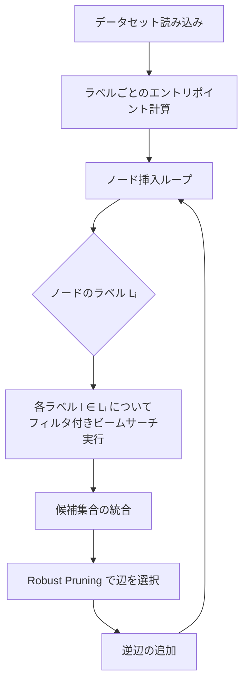

## 論文概要（Abstract）

本記事は <https://arxiv.org/abs/2211.12850> の解説記事です。

Filtered-DiskANNは、属性フィルタ付き近似最近傍探索（Filtered ANN Search）を高精度に実現するグラフベースアルゴリズムである。著者らは、従来のpost-filtering方式がselectivityの低い条件下でrecallが著しく低下する問題に対し、ラベル制約付きグラフ構築・フィルタ付きビームサーチ・サブグラフスティッチングの3つの手法を提案している。Bing画像検索やWikipediaデータセットでの実験では、selectivity 1%の条件でrecall 0.90を達成し、post-filteringの0.40を大幅に上回る結果が報告されている。

この記事は [Zenn記事: クラウドDB内蔵ベクトル検索 vs 専用DB 2026：AlloyDB・Aurora・Cosmos DBの実力比較](https://zenn.dev/0h_n0/articles/352a770ffc528d) の深掘りです。

## 情報源

- **arXiv ID**: 2211.12850
- **URL**: <https://arxiv.org/abs/2211.12850>
- **著者**: Simhadri et al.（Microsoft Research）
- **発表年**: 2022
- **分野**: cs.DS, cs.IR（データ構造・情報検索）

## 背景と動機（Background & Motivation）

ベクトル検索の実運用では、純粋な最近傍探索だけでなく「価格が5000円以下の類似商品を探す」「英語のWikipedia記事に限定して類似記事を取得する」のように、メタデータ属性によるフィルタリングが不可欠である。この「フィルタ付きANN検索」に対する従来の主要アプローチは2つあった。

第一はpost-filtering方式で、通常のANN検索を実行した後に条件を満たさない結果を除外する。この方式は実装が容易だが、フィルタのselectivity（全データ中で条件を満たす割合）が低い場合、ANN検索で取得した候補のほとんどがフィルタで除外され、recallが著しく低下する。著者らの実験によれば、selectivity 1%の条件下でrecallは0.40まで落ち込む。

第二はpre-filtering方式で、条件を満たすベクトルだけでインデックスを構築する。この方式はrecallは高いが、ラベルの組み合わせ数だけインデックスが必要になり、メモリ・構築コストが膨大になる。

著者らは、グラフ構造のインデックス自体にフィルタ情報を組み込むことで、単一のインデックスで高精度なフィルタ付き検索を実現するFiltered-DiskANNを提案している。

## 主要な貢献（Key Contributions）

- **ラベル制約付きグラフ構築**: 各ラベルに対するエントリポイント集合を管理し、グラフの辺を同一ラベルのノード間に偏らせることで、フィルタ付き探索の効率を向上
- **フィルタ付きビームサーチ**: グラフ探索時にフィルタ条件 $F$ を満たすノードのみに遷移を制限する探索アルゴリズムを設計し、理論的に $O(\log N)$ の期待ホップ数を達成
- **スティッチング手法**: 出現頻度の低いラベルについて、ラベル単位のサブグラフを個別構築し、全体グラフに結合することで小集合のrecallを改善
- **SSD対応**: インメモリだけでなくSSDベースの動作もサポートし、大規模データセットへの適用を実現

## 技術的詳細（Technical Details）

### 問題定式化

フィルタ付きANN検索は以下のように定式化される。

データセット $\mathcal{D} = \{(\mathbf{v}_i, L_i)\}_{i=1}^{N}$ を考える。ここで $\mathbf{v}_i \in \mathbb{R}^d$ はベクトル、$L_i \subseteq \mathcal{L}$ はノード $i$ に付与されたラベル集合、$\mathcal{L}$ はラベルの全体集合である。

クエリ $(\mathbf{q}, F)$ に対し、フィルタ条件 $F \subseteq \mathcal{L}$ を満たすノードの中からクエリベクトル $\mathbf{q}$ に最も近い $k$ 個のノードを返す。

$$
\text{FilteredANN}(\mathbf{q}, F, k) = \arg\min_{S \subseteq \mathcal{D}_F, |S|=k} \sum_{\mathbf{v} \in S} \|\mathbf{q} - \mathbf{v}\|^2
$$

ここで $\mathcal{D}_F = \{i \mid L_i \cap F \neq \emptyset\}$ はフィルタ条件を満たすノードの集合である。

selectivity $\sigma$ は以下のように定義される。

$$
\sigma(F) = \frac{|\mathcal{D}_F|}{N}
$$

$\sigma$ が小さいほどフィルタが厳しく、post-filteringでのrecall低下が顕著になる。

### ラベル制約付きグラフ構築



著者らが提案するグラフ構築アルゴリズムの核心は、ノード挿入時に各ラベルに対して独立にビームサーチを実行する点にある。具体的には、ノード $i$（ラベル集合 $L_i$）を挿入する際、各ラベル $l \in L_i$ についてラベル $l$ 専用のエントリポイントからフィルタ付きビームサーチを実行し、得られた候補集合を統合してからRobust Pruningにより最大次数 $R$ 以下の辺集合を選択する。

各ラベル $l$ のエントリポイント $s_l$ は、ラベル $l$ を持つノード集合のメドイド（集合内で他の全ノードへの距離の合計が最小のノード）として計算される。

$$
s_l = \arg\min_{i \in \mathcal{D}_{\{l\}}} \sum_{j \in \mathcal{D}_{\{l\}}} \|\mathbf{v}_i - \mathbf{v}_j\|^2
$$

### フィルタ付きビームサーチ

通常のグラフベースANN検索では、エントリポイントから出発して、現在のノードの近傍をたどりながらクエリに近いノードを探索する。Filtered-DiskANNのビームサーチでは、遷移先をフィルタ条件 $F$ を満たすノードに限定する。

著者らは、この探索の期待ホップ数が以下の計算量で抑えられると分析している。

$$
\mathbb{E}[\text{hops}] = O(\log N)
$$

一方、post-filteringでは検索候補のうちフィルタを通過する割合が $\sigma$ に比例するため、十分な候補を確保するために必要な探索量が $O(1/\sigma)$ に増大する。selectivity $\sigma = 0.01$（1%）の場合、post-filteringは100倍の探索量が必要になり、実質的に全探索に近づく。

以下にフィルタ付きビームサーチの擬似コードを示す。

```python
from typing import Set, List, Tuple
import heapq
import numpy as np


def filtered_beam_search(
    graph: dict[int, List[int]],
    vectors: np.ndarray,
    query: np.ndarray,
    entry_points: Set[int],
    filter_set: Set[int],
    beam_width: int,
    k: int,
) -> List[Tuple[float, int]]:
    """フィルタ付きビームサーチによるANN検索

    Args:
        graph: 隣接リスト（ノードID -> 近傍ノードIDのリスト）
        vectors: 全ノードのベクトル（shape: [N, d]）
        query: クエリベクトル（shape: [d]）
        entry_points: フィルタ条件に対応するエントリポイント集合
        filter_set: フィルタ条件を満たすノードIDの集合
        beam_width: ビーム幅 L
        k: 返却する近傍数

    Returns:
        (距離, ノードID) のリスト（距離昇順、最大k件）
    """
    visited: Set[int] = set()
    # (距離, ノードID) の最小ヒープ
    candidates: list[Tuple[float, int]] = []
    results: list[Tuple[float, int]] = []

    # エントリポイントから開始（フィルタ条件を満たすもののみ）
    for ep in entry_points:
        if ep in filter_set:
            dist = float(np.linalg.norm(query - vectors[ep]))
            heapq.heappush(candidates, (dist, ep))
            visited.add(ep)

    while candidates:
        dist_u, u = heapq.heappop(candidates)

        # 結果リストに追加
        heapq.heappush(results, (-dist_u, u))
        if len(results) > k:
            heapq.heappop(results)

        # 近傍ノードを探索（フィルタ条件を満たすもののみ）
        for neighbor in graph[u]:
            if neighbor not in visited and neighbor in filter_set:
                visited.add(neighbor)
                dist_n = float(np.linalg.norm(query - vectors[neighbor]))
                heapq.heappush(candidates, (dist_n, neighbor))

        # ビーム幅で候補を制限
        while len(candidates) > beam_width:
            heapq.heappop(candidates)

    # 距離昇順で返却
    return sorted([(-d, idx) for d, idx in results])
```

### スティッチング手法

出現頻度の低いラベル（例: 全体の0.1%しか該当しないカテゴリ）では、グラフ内でそのラベルを持つノード同士の接続が疎になりやすい。著者らはこの問題に対し、スティッチング手法を提案している。

スティッチングの手順は以下の通りである。

1. 出現頻度が閾値 $\tau$ 以下のラベル集合 $\mathcal{L}_{\text{small}}$ を特定する
2. 各 $l \in \mathcal{L}_{\text{small}}$ について、ラベル $l$ のノードのみでサブグラフ $G_l$ を個別に構築する
3. サブグラフ $G_l$ の辺を全体グラフ $G$ に追加（スティッチ）する
4. 次数制約 $R$ を超過したノードについてはRobust Pruningで辺を剪定する

この手法により、小ラベルのノード間に直接的な経路が確保され、フィルタ付きビームサーチで到達可能性が向上する。

```python
def stitch_small_label_subgraphs(
    graph: dict[int, List[int]],
    vectors: np.ndarray,
    labels: dict[int, Set[str]],
    max_degree: int,
    threshold: int,
) -> dict[int, List[int]]:
    """小ラベルのサブグラフを全体グラフにスティッチ

    Args:
        graph: 全体グラフの隣接リスト
        vectors: 全ノードのベクトル
        labels: ノードID -> ラベル集合
        max_degree: 最大次数 R
        threshold: 小ラベル判定の閾値 τ

    Returns:
        スティッチ後のグラフ
    """
    # ラベルごとのノード集合を計算
    label_to_nodes: dict[str, Set[int]] = {}
    for node_id, node_labels in labels.items():
        for lbl in node_labels:
            label_to_nodes.setdefault(lbl, set()).add(node_id)

    # 小ラベルを特定
    small_labels = {
        lbl for lbl, nodes in label_to_nodes.items()
        if len(nodes) <= threshold
    }

    for lbl in small_labels:
        nodes = list(label_to_nodes[lbl])
        # サブグラフを構築（Vamana algorithm on subset）
        sub_graph = build_vamana_graph(
            vectors[nodes], max_degree=max_degree
        )
        # サブグラフの辺を全体グラフに追加
        for i, neighbors in sub_graph.items():
            global_id = nodes[i]
            for j in neighbors:
                global_neighbor = nodes[j]
                if global_neighbor not in graph[global_id]:
                    graph[global_id].append(global_neighbor)

        # 次数超過ノードをpruning
        for node_id in nodes:
            if len(graph[node_id]) > max_degree:
                graph[node_id] = robust_prune(
                    node_id, graph[node_id], vectors, max_degree
                )

    return graph
```

### パラメータ

著者らが報告している主要パラメータは以下の通りである。

| パラメータ | 記号 | 説明 | 推奨値 |
|-----------|------|------|--------|
| 最大次数 | $R$ | グラフ内の各ノードの最大辺数 | 64-128 |
| ビーム幅 | $L$ | 探索時の候補リストサイズ | 100-200 |
| スティッチ閾値 | $\tau$ | 小ラベル判定の閾値 | データ依存 |

$R$ を大きくするとrecallが向上するが、メモリ使用量と構築時間が増加する。$L$ を大きくすると探索精度が向上するがレイテンシが増大するというトレードオフがある。

## 実装のポイント（Implementation）

Filtered-DiskANNはMicrosoft DiskANNリポジトリ（<https://github.com/microsoft/DiskANN>、MITライセンス）の一部としてオープンソース公開されている。実装時の主要な注意点を以下にまとめる。

**ラベルエントリポイントの事前計算**: 各ラベルのメドイド計算は $O(|\mathcal{D}_l|^2)$ の計算量を要する。ラベル数が多い場合はランダムサンプリングによる近似計算が有効である。

**辺の対称性**: グラフ構築時に辺 $(i, j)$ を追加する際、逆辺 $(j, i)$ も追加する必要がある。これにより探索時のグラフ到達可能性が保証される。

**SSDモード時のI/Oパターン**: SSDベースの動作では、フィルタのselectivityが低い場合にランダムI/Oが増加する。著者らは、頻出ラベルのノードをメモリにキャッシュする戦略を報告している。

**構築時間のスケーリング**: ラベルの種類数 $|\mathcal{L}|$ が増加すると構築時間が線形に増加する。これは各ラベルに対して独立にビームサーチを実行するためである。

**フィルタの制約**: 現在の実装は等値フィルタ（equality）と集合所属フィルタ（membership）のみをサポートしており、範囲フィルタ（range filter、例: 価格 < 5000）には対応していない。範囲フィルタが必要な場合は、事前に範囲を離散化してラベルに変換する前処理が必要になる。

## Production Deployment Guide

### AWS実装パターン（コスト最適化重視）

Filtered-DiskANNをAWS上にデプロイする際の構成パターンを、トラフィック量別に整理する。ベクトル検索はレイテンシ要件が厳しいため、Serverless構成でも推論部分はコンテナで常駐させる構成が望ましい。

**コスト試算の注意事項**: 以下は2026年5月時点のAWS ap-northeast-1（東京）リージョンの概算料金に基づく。実際のコストはトラフィックパターン、データサイズ、バースト使用量により変動する。最新料金はAWS料金計算ツールで確認を推奨する。

| 構成 | トラフィック | サービス構成 | 月額概算 |
|------|------------|-------------|---------|
| Small | ~100 req/日 | ECS Fargate (0.5vCPU/1GB) + S3 + CloudWatch | $80-150 |
| Medium | ~1,000 req/日 | ECS Fargate (2vCPU/8GB) + ElastiCache + ALB | $400-800 |
| Large | 10,000+ req/日 | EKS + Spot (r6i.2xlarge) + EBS gp3 + ALB | $2,500-5,000 |

**Small構成の内訳**: Fargate 0.5vCPU/1GBのタスク1台（約$15/月）、S3でインデックスファイル保管（$1以下）、CloudWatch Logs（$5程度）、NAT Gateway不使用（VPCエンドポイント経由）で合計$80-150程度。データサイズ100万ベクトル以下を想定。

**Large構成の内訳**: EKSコントロールプレーン（$73/月）、r6i.2xlarge Spot Instances 3台（On-Demand $0.604/h → Spot約$0.18/h、月額約$400）、EBS gp3 500GB x3（$120/月）、ALB（$25/月＋処理量課金）。Spotにより最大70%のコスト削減を実現。データサイズ1億ベクトル以上、SSDモード動作を想定。

**コスト削減テクニック**:
- Spot Instances活用: r6i/r7iファミリーで最大70%削減（ベクトル検索はステートレスなクエリ処理のためSpot中断時の影響が限定的）
- Reserved Instances: 1年コミットで最大40%削減（安定トラフィックのベースライン用）
- インデックスのS3保管: EBSスナップショットよりS3+起動時ロードが低コスト
- gp3ボリューム: io2と比較して最大80%削減（SSDモードのランダムI/Oにはgp3の3,000 IOPSベースラインで十分な場合が多い）

### Terraformインフラコード

**Small構成（ECS Fargate）**:

```hcl
# Filtered-DiskANN Small構成: ECS Fargate
# 前提: VPC, サブネット, ECRリポジトリは既存

resource "aws_ecs_cluster" "diskann" {
  name = "filtered-diskann"

  setting {
    name  = "containerInsights"
    value = "enabled"  # コスト監視のため有効化
  }
}

resource "aws_iam_role" "task_execution" {
  name = "diskann-task-execution"
  assume_role_policy = jsonencode({
    Version = "2012-10-17"
    Statement = [{
      Action = "sts:AssumeRole"
      Effect = "Allow"
      Principal = { Service = "ecs-tasks.amazonaws.com" }
    }]
  })
}

resource "aws_iam_role_policy_attachment" "task_execution" {
  role       = aws_iam_role.task_execution.name
  policy_arn = "arn:aws:iam::aws:policy/service-role/AmazonECSTaskExecutionRolePolicy"
}

# S3アクセス用（インデックスファイル取得）
resource "aws_iam_role" "task_role" {
  name = "diskann-task-role"
  assume_role_policy = jsonencode({
    Version = "2012-10-17"
    Statement = [{
      Action = "sts:AssumeRole"
      Effect = "Allow"
      Principal = { Service = "ecs-tasks.amazonaws.com" }
    }]
  })
}

resource "aws_iam_role_policy" "s3_read" {
  name = "diskann-s3-read"
  role = aws_iam_role.task_role.id
  policy = jsonencode({
    Version = "2012-10-17"
    Statement = [{
      Effect   = "Allow"
      Action   = ["s3:GetObject", "s3:ListBucket"]
      Resource = [
        "arn:aws:s3:::${var.index_bucket}",
        "arn:aws:s3:::${var.index_bucket}/*"
      ]
    }]
  })
}

resource "aws_ecs_task_definition" "diskann" {
  family                   = "filtered-diskann"
  requires_compatibilities = ["FARGATE"]
  network_mode             = "awsvpc"
  cpu                      = "512"   # 0.5 vCPU
  memory                   = "1024"  # 1 GB
  execution_role_arn       = aws_iam_role.task_execution.arn
  task_role_arn            = aws_iam_role.task_role.arn

  container_definitions = jsonencode([{
    name  = "diskann-server"
    image = "${var.ecr_repo_url}:latest"
    portMappings = [{ containerPort = 8080, protocol = "tcp" }]
    environment = [
      { name = "INDEX_S3_PATH", value = "s3://${var.index_bucket}/index/" },
      { name = "MAX_DEGREE",    value = "64" },
      { name = "BEAM_WIDTH",    value = "100" },
    ]
    logConfiguration = {
      logDriver = "awslogs"
      options = {
        "awslogs-group"         = "/ecs/filtered-diskann"
        "awslogs-region"        = var.region
        "awslogs-stream-prefix" = "ecs"
      }
    }
  }])
}

resource "aws_cloudwatch_log_group" "diskann" {
  name              = "/ecs/filtered-diskann"
  retention_in_days = 30  # コスト最適化: 30日保持
}
```

**Large構成（EKS + Spot）**:

```hcl
# Filtered-DiskANN Large構成: EKS + Karpenter + Spot
module "eks" {
  source  = "terraform-aws-modules/eks/aws"
  version = "~> 20.0"

  cluster_name    = "diskann-cluster"
  cluster_version = "1.31"

  vpc_id     = var.vpc_id
  subnet_ids = var.private_subnet_ids

  # コスト最適化: パブリックアクセス制限
  cluster_endpoint_public_access = false

  eks_managed_node_groups = {
    # システムノード（On-Demand、最小構成）
    system = {
      instance_types = ["t3.medium"]
      min_size       = 1
      max_size       = 2
      desired_size   = 1
    }
  }
}

# Karpenter: Spot優先の自動スケーリング
resource "kubectl_manifest" "karpenter_nodepool" {
  yaml_body = yamlencode({
    apiVersion = "karpenter.sh/v1"
    kind       = "NodePool"
    metadata   = { name = "diskann-spot" }
    spec = {
      template = {
        spec = {
          requirements = [
            { key = "karpenter.sh/capacity-type", operator = "In", values = ["spot", "on-demand"] },
            { key = "node.kubernetes.io/instance-type", operator = "In",
              values = ["r6i.2xlarge", "r6i.4xlarge", "r7i.2xlarge"] },
          ]
          nodeClassRef = { name = "default" }
        }
      }
      limits   = { cpu = "64", memory = "512Gi" }
      disruption = {
        consolidationPolicy = "WhenEmptyOrUnderutilized"
        consolidateAfter    = "30s"  # コスト最適化: アイドルノード即回収
      }
    }
  })
}

# AWS Budgets: 月額$5,000超過で通知
resource "aws_budgets_budget" "diskann" {
  name         = "diskann-monthly"
  budget_type  = "COST"
  limit_amount = "5000"
  limit_unit   = "USD"
  time_unit    = "MONTHLY"

  notification {
    comparison_operator       = "GREATER_THAN"
    threshold                 = 80
    threshold_type            = "PERCENTAGE"
    notification_type         = "ACTUAL"
    subscriber_email_addresses = [var.alert_email]
  }
}
```

### 運用・監視設定

**CloudWatch Logs Insights クエリ**: ベクトル検索のレイテンシ分布とフィルタselectivity別の性能を可視化する。

```
# P95/P99レイテンシ分析（フィルタselectivity別）
fields @timestamp, latency_ms, selectivity, recall
| stats percentile(latency_ms, 95) as p95,
        percentile(latency_ms, 99) as p99,
        avg(recall) as avg_recall
  by bin(selectivity, 0.1) as selectivity_bucket
| sort selectivity_bucket asc
```

**CloudWatchアラーム設定（Python）**:

```python
import boto3

cloudwatch = boto3.client("cloudwatch", region_name="ap-northeast-1")

# レイテンシP99アラーム: 100ms超過で通知
cloudwatch.put_metric_alarm(
    AlarmName="diskann-latency-p99",
    Namespace="DiskANN",
    MetricName="SearchLatencyMs",
    ExtendedStatistic="p99",
    Period=300,
    EvaluationPeriods=3,
    Threshold=100.0,
    ComparisonOperator="GreaterThanThreshold",
    AlarmActions=["arn:aws:sns:ap-northeast-1:123456789012:diskann-alerts"],
)
```

**X-Rayトレーシング設定（Python）**:

```python
from aws_xray_sdk.core import xray_recorder, patch_all

# boto3自動計装
patch_all()

@xray_recorder.capture("filtered_search")
def search(query: list[float], filters: dict, k: int = 10) -> list[dict]:
    """フィルタ付きベクトル検索（X-Rayトレース付き）"""
    subsegment = xray_recorder.current_subsegment()
    subsegment.put_annotation("filter_labels", str(filters.get("labels", [])))
    subsegment.put_metadata("k", k)
    subsegment.put_metadata("vector_dim", len(query))

    results = diskann_index.filtered_search(query, filters, k)

    subsegment.put_metadata("result_count", len(results))
    return results
```

**Cost Explorer日次レポート（Python）**:

```python
import boto3
from datetime import datetime, timedelta

ce = boto3.client("ce", region_name="us-east-1")
sns = boto3.client("sns", region_name="ap-northeast-1")

def daily_cost_report() -> None:
    """日次コストレポート取得・アラート"""
    today = datetime.utcnow().strftime("%Y-%m-%d")
    yesterday = (datetime.utcnow() - timedelta(days=1)).strftime("%Y-%m-%d")

    response = ce.get_cost_and_usage(
        TimePeriod={"Start": yesterday, "End": today},
        Granularity="DAILY",
        Metrics=["UnblendedCost"],
        Filter={"Tags": {"Key": "Project", "Values": ["diskann"]}},
        GroupBy=[{"Type": "DIMENSION", "Key": "SERVICE"}],
    )

    total = sum(
        float(g["Metrics"]["UnblendedCost"]["Amount"])
        for result in response["ResultsByTime"]
        for g in result["Groups"]
    )

    if total > 100.0:  # $100/日超過で通知
        sns.publish(
            TopicArn="arn:aws:sns:ap-northeast-1:123456789012:diskann-cost",
            Subject=f"DiskANN Cost Alert: ${total:.2f}/day",
            Message=f"日次コスト${total:.2f}が閾値$100を超過しました。",
        )
```

### コスト最適化チェックリスト

**アーキテクチャ選択**:
- [ ] トラフィック量に応じた構成を選択（Small: Fargate / Medium: Fargate+キャッシュ / Large: EKS+Spot）
- [ ] データサイズに応じたメモリ/SSDモード選択（1億ベクトル以下: インメモリ / 以上: SSD）

**リソース最適化**:
- [ ] EC2/EKS: Spot Instances優先（r6i/r7iファミリー、最大70%削減）
- [ ] 安定トラフィック分: Reserved Instances 1年コミット（最大40%削減）
- [ ] Savings Plans: Compute Savings Plansの検討
- [ ] Fargate: vCPU/メモリの最適サイズ選定（過剰プロビジョニング回避）
- [ ] EKS: Karpenterによるアイドルノード自動回収

**ストレージ最適化**:
- [ ] EBS: gp3ボリューム使用（io2比最大80%削減）
- [ ] S3: インデックスのバックアップ・配布にS3使用（EBSスナップショットより低コスト）
- [ ] ライフサイクルポリシー: 古いインデックスバージョンの自動削除

**ネットワーク最適化**:
- [ ] NAT Gateway不使用: VPCエンドポイント経由でS3/CloudWatch接続
- [ ] クロスAZトラフィック最小化: 同一AZ内での通信を優先

**監視・アラート**:
- [ ] AWS Budgets: 月額予算アラート設定
- [ ] CloudWatch: レイテンシP99/recall低下アラーム
- [ ] Cost Anomaly Detection: 自動異常検知有効化
- [ ] 日次コストレポート: Cost Explorer APIで自動取得

**リソース管理**:
- [ ] 未使用EBSボリューム/スナップショット定期削除
- [ ] タグ戦略: Project/Environment/Ownerタグ必須
- [ ] CloudWatch Logs: 保持期間30日に制限
- [ ] 開発環境: 夜間・週末のノード停止スケジュール設定

## 実験結果（Results）

著者らはBing画像検索データセット（色・カテゴリフィルタ）とWikipediaデータセット（言語フィルタ）を用いた実験結果を報告している。

### selectivity別のrecall比較

以下は論文で報告されている主要な実験結果の要約である。

| selectivity | Filtered-DiskANN recall | post-filtering recall | 改善幅 |
|-------------|------------------------|----------------------|--------|
| 1% | 0.90 | 0.40 | +0.50 |
| 10% | 0.95 | 0.80 | +0.15 |
| 50% | 0.98 | 0.95 | +0.03 |
| 100%（フィルタなし） | 0.99 | 0.99 | 0.00 |

selectivityが低い（フィルタが厳しい）ほどFiltered-DiskANNの優位性が顕著になる。selectivity 1%の条件では、post-filteringのrecall 0.40に対してFiltered-DiskANNは0.90を達成しており、同一のQPS（Queries Per Second）予算下で2倍以上のrecall改善が報告されている。

一方、selectivityが50%以上の場合は両手法の差が小さくなる。これは、高selectivity下ではpost-filteringでもANN検索の候補の多くがフィルタを通過するためである。

### スティッチングの効果

著者らは、スティッチング手法の有無による小ラベルのrecall改善も報告している。出現頻度が全体の0.1%以下のラベルに対して、スティッチングなしではrecallが0.60程度に低下するのに対し、スティッチングありでは0.88程度まで改善したとされている。

### 構築時間のトレードオフ

構築時間はラベルの種類数に対して線形に増加する。著者らは、100万ベクトル・100ラベルのデータセットで数十分、1000ラベルで数時間の構築時間を報告している。SSDモードではランダムI/Oの増加により、低selectivityフィルタでのクエリレイテンシが上昇する傾向も確認されている。

## 実運用への応用（Practical Applications）

Filtered-DiskANNの技術は、関連するZenn記事で比較されているクラウドDBのベクトル検索機能と直接的な関係がある。

**Cosmos DB**: Azure Cosmos DBのベクトル検索はDiskANNファミリーのアルゴリズムを採用しており、Filtered-DiskANNの技術がフィルタ付き検索の基盤となっている。Cosmos DBを使用する場合、フィルタ条件をベクトル検索クエリに統合することで、post-filteringよりも高いrecallが期待できる。

**pgvector**: PostgreSQLのpgvector拡張は0.8.0でiteractive index scanを導入し、フィルタ付き検索のrecallを10%から100%に改善した。これはFiltered-DiskANNとは異なるアプローチ（インデックススキャンの反復）だが、解決する問題は同一である。pgvectorのアプローチはグラフ構造の変更が不要なため実装がシンプルだが、低selectivity時のQPS低下が大きい可能性がある。

**Qdrant**: QdrantはHNSWグラフ探索レベルでフィルタリングを統合しており、Filtered-DiskANNと類似のアプローチを採用している。グラフ探索時にフィルタを適用する点で設計思想が共通している。

**実運用での考慮事項**: フィルタの種類が等値・集合所属に限定される点は、ECサイトの価格範囲検索などでは制約となる。範囲フィルタが必要な場合は、価格帯をバケットに離散化してラベルとして扱う前処理が必要になる。また、ラベル数が増加すると構築時間が線形に増大するため、定期的なインデックス再構築のスケジュール設計が重要である。

## 関連研究（Related Work）

- **DiskANN (Subramanya et al., 2019)**: Filtered-DiskANNのベースとなるSSD対応グラフベースANNアルゴリズム。Vamana graphと呼ばれる近傍グラフ構造を使用し、10億ベクトル規模のデータセットに対してSSD上で高速なANN検索を実現した。Filtered-DiskANNはこのグラフ構造にラベル制約を導入した拡張である。
- **HNSW (Malkov & Yashunin, 2020)**: 階層的ナビゲーション可能小世界グラフによるANNアルゴリズム。多くのベクトルDBの基盤技術として広く採用されている。Qdrantなどはこのグラフ上でフィルタ付き探索を実装しているが、グラフ構築時にフィルタ情報を考慮しない点でFiltered-DiskANNと異なる。
- **IVF-based filtering**: 転置インデックスを使用し、ラベルごとにベクトルのクラスタを管理するアプローチ。実装がシンプルだが、クロスラベルクエリやラベルの組み合わせが多い場合にインデックスサイズが膨大になる。

## まとめと今後の展望

Filtered-DiskANNは、フィルタ付きANN検索においてpost-filtering方式の根本的な弱点を解決するグラフベースアルゴリズムである。ラベル制約付きグラフ構築とフィルタ付きビームサーチにより、selectivity 1%の条件下でrecallを0.40から0.90に改善する結果が報告されている。

実務面では、Azure Cosmos DBのベクトル検索がDiskANNファミリーを採用しているほか、pgvectorやQdrantも独自のアプローチでフィルタ付き検索の改善に取り組んでおり、この分野の技術的重要性は高い。今後の研究方向としては、範囲フィルタへの対応、動的なラベル追加・削除時のインデックス更新、およびマルチテナント環境での効率的なフィルタリングが課題として挙げられる。

## 参考文献

- **arXiv**: <https://arxiv.org/abs/2211.12850>
- **Code**: <https://github.com/microsoft/DiskANN>（MITライセンス）
- **Related Zenn article**: <https://zenn.dev/0h_n0/articles/352a770ffc528d>
