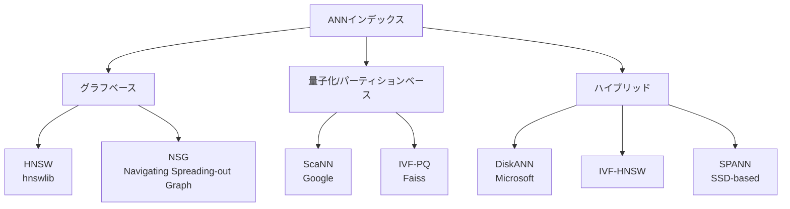

## 論文概要（Abstract）

本記事は [https://arxiv.org/abs/2401.09350](https://arxiv.org/abs/2401.09350) の解説記事です。

本論文は、10億（Billion）スケールの近似最近傍探索（ANN）において、7種のインデックス手法（HNSW、DiskANN、ScaNN、IVF-PQ、IVF-HNSW、NSG、SPANN）を3つのデータセットで実測評価したベンチマーク研究である。著者らは、リコール率・スループット・メモリ消費・構築時間の4軸でインデックスを比較し、ユースケースごとの最適なインデックス選択指針を提示している。

この記事は [Zenn記事: クラウドDB内蔵ベクトル検索 vs 専用DB 2026：AlloyDB・Aurora・Cosmos DBの実力比較](https://zenn.dev/0h_n0/articles/352a770ffc528d) の深掘りです。

## 情報源

- **arXiv ID**: 2401.09350
- **URL**: [https://arxiv.org/abs/2401.09350](https://arxiv.org/abs/2401.09350)
- **発表年**: 2024年
- **分野**: cs.DB, cs.IR

## 背景と動機（Background & Motivation）

ベクトル検索はRAG（Retrieval-Augmented Generation）やセマンティック検索の基盤技術として広く利用されている。データ規模が10億ベクトルを超えるプロダクション環境では、インデックス手法の選択がシステム全体のスループット・レイテンシ・コストに直結する。

しかし、既存のベンチマーク研究は100万〜1000万規模の小〜中規模データセットに限定されることが多く、10億スケールでの網羅的な比較は限られていた。著者らは、この空白を埋めるために、統一されたハードウェア環境（512GB RAM、NVMe SSD、64コアCPU）で7種のインデックスを10億ベクトル規模で実測評価した。

## 主要な貢献（Key Contributions）

- **貢献1**: 10億スケールの統一ベンチマーク環境を構築し、7種のインデックスを同一条件で比較
- **貢献2**: データセットの次元数・分布特性がインデックス性能に与える影響を定量的に分析
- **貢献3**: リコール率・スループット・メモリ・構築時間の4軸に基づく実用的なインデックス選択ガイドラインを提示

## 技術的詳細（Technical Details）

### 評価対象インデックス

本論文で評価された7種のインデックスは、大きくグラフベースと量子化ベースの2カテゴリに分類できる。



### HNSW: グラフ構築の数理

HNSW（Hierarchical Navigable Small World）は、ベクトル空間上に階層的なグラフを構築する手法である。

**グラフ構築アルゴリズム**:

ベクトル $\mathbf{v}_i$ を挿入する際、まずランダムに最大レイヤー $l$ を以下の確率分布で決定する:

$$
l = \lfloor -\ln(\text{uniform}(0, 1)) \cdot m_L \rfloor
$$

ここで、
- $l$: ベクトルが挿入される最大レイヤー
- $m_L$: レベル乗数（level multiplier）、通常 $m_L = 1 / \ln(M)$
- $M$: 各ノードの最大接続数（コネクティビティパラメータ）

挿入時、各レイヤー $\ell$ で $M$ 個の最近傍ノードをヒューリスティック選択し、双方向エッジを張る。ノード $\mathbf{v}_i$ と候補ノード集合 $C$ に対し、以下の距離条件でエッジを追加する:

$$
\text{neighbors}(\mathbf{v}_i, \ell) = \arg\min_{S \subseteq C, |S| \leq M} \sum_{\mathbf{u} \in S} d(\mathbf{v}_i, \mathbf{u})
$$

ここで $d(\cdot, \cdot)$ はL2距離（ユークリッド距離）である。

**検索時の計算量**: エントリーポイントから貪欲探索を行い、平均 $O(\log N)$ のホップ数でターゲットに到達する。ただし各ホップで $\texttt{efSearch}$ 個の候補を評価するため、実効計算量は $O(\texttt{efSearch} \cdot \log N)$ となる。

**10億スケールでの課題**: 著者らによると、HNSW で 10億ベクトル（128次元、$M=32$）のインデックスを保持するには約500GBのRAMが必要である。これはグラフ構造のポインタと全ベクトルデータをメモリ上に展開するためである。

### ScaNN: パーティションベースの量子化

ScaNN（Scalable Nearest Neighbors）はGoogleが開発した手法で、Anisotropic Vector Quantization（異方性ベクトル量子化）を核とする。

**パーティショニング**:

データセット $\mathcal{X} = \{\mathbf{x}_1, \dots, \mathbf{x}_N\}$ を $K$ 個のパーティションに分割する。各パーティション $\mathcal{P}_k$ に対してセントロイド $\mathbf{c}_k$ を学習する:

$$
\mathbf{c}_k = \frac{1}{|\mathcal{P}_k|} \sum_{\mathbf{x} \in \mathcal{P}_k} \mathbf{x}
$$

**異方性量子化損失**:

通常の量子化は等方的（isotropic）にベクトルの再構成誤差を最小化する。ScaNNの異方性量子化は、内積検索に最適化された以下の損失関数を使う:

$$
\mathcal{L}_{\text{aniso}}(\mathbf{x}, \tilde{\mathbf{x}}) = w_{\parallel} \| (\mathbf{x} - \tilde{\mathbf{x}})_{\parallel} \|^2 + w_{\perp} \| (\mathbf{x} - \tilde{\mathbf{x}})_{\perp} \|^2
$$

ここで、
- $\tilde{\mathbf{x}}$: ベクトル $\mathbf{x}$ の量子化表現
- $(\cdot)_{\parallel}$: クエリ方向への射影成分
- $(\cdot)_{\perp}$: クエリ方向に直交する成分
- $w_{\parallel} > w_{\perp}$: 内積計算に寄与する方向成分を重視する重み

この非対称な重み付けにより、同じ量子化ビット数でもリコール率が向上する。

### DiskANN: SSDベースのグラフインデックス

DiskANNはMicrosoftが開発した手法で、Vamanaグラフと呼ばれるディスク最適化グラフ構造をSSD上に格納する。メモリ上にはベクトルのPQ圧縮版のみを保持し、検索時はPQ距離で候補を絞り込んだ後、SSDから正確なベクトルをフェッチして再ランキングする。著者らは、DiskANNが10億スケールで単一ノード・SSD利用で動作可能な唯一のグラフベース手法であると報告している。

### IVF-PQ: 低メモリ量子化インデックス

IVF-PQ（Inverted File with Product Quantization）は、$d$ 次元ベクトル $\mathbf{x}$ を $m$ 個のサブベクトルに分割しコードブック量子化する:

$$
\mathbf{x} = [\mathbf{x}^{(1)}, \dots, \mathbf{x}^{(m)}], \quad q_j(\mathbf{x}^{(j)}) = \arg\min_{\mathbf{c} \in \mathcal{C}_j} \| \mathbf{x}^{(j)} - \mathbf{c} \|^2
$$

ここで $\mathcal{C}_j$ は各サブ空間のコードブック（$k$ 個のセントロイド）である。128次元ベクトル（512バイト）を8〜16バイトに圧縮できる。著者らは、IVF-PQがメモリ消費量で最も優れるが、リコール率は同一レイテンシでグラフベース手法に対し40〜60%低いと報告している。

## 実験結果（Results）

### 実験環境とデータセット

著者らは以下の統一環境で評価を行っている。

| 項目 | 仕様 |
|------|------|
| CPU | 64コア |
| RAM | 512GB |
| ストレージ | NVMe SSD |
| OS | Linux |

**データセット**:

| データセット | ベクトル数 | 次元数 | 用途 |
|-------------|-----------|--------|------|
| BIGANN-1B | 10億 | 128 | SIFT特徴量（画像） |
| MSTuring-1B | 10億 | 100 | テキスト埋め込み |
| MSMARCO-1B | 10億 | 768 | テキスト埋め込み（高次元） |

### リコール率 vs スループット

著者らの実験結果に基づく各インデックスの性能比較を示す。

**BIGANN-1B（128次元）での結果**:

| インデックス | Recall@10=0.90時のQPS | Recall@10=0.95時のQPS | Recall@10=0.99時のQPS |
|-------------|----------------------|----------------------|----------------------|
| HNSW | ~15,000 | ~10,000 | ~5,000 |
| ScaNN | ~30,000 | ~12,000 | ~3,000 |
| DiskANN | ~800 | ~500 | ~200 |
| IVF-PQ | ~5,000 | ~1,500 | ~300 |
| NSG | ~12,000 | ~7,000 | ~3,500 |

**高リコール域（>0.95）ではHNSWが優位**であり、著者らはリコール0.99の領域で5,000〜10,000 QPSを達成したと報告している。一方、**中程度のリコール（0.90〜0.95）ではScaNNがHNSWの2〜5倍のスループット**を示した。

### メモリ消費量

10億ベクトル格納時のメモリ使用量を以下にまとめる（著者らの報告に基づく）。

| インデックス | メモリ使用量（128次元、10億ベクトル） | 備考 |
|-------------|--------------------------------------|------|
| HNSW ($M=32$) | ~500GB | グラフ構造 + 全ベクトル |
| ScaNN (1byte量子化) | ~256GB | 量子化ベクトル + パーティションメタデータ |
| DiskANN | ~64GB (RAM) + SSD | メモリにPQ圧縮版、SSDに元ベクトル |
| IVF-PQ ($m=16$) | ~32GB | コードブック + 転置リスト |

### インデックス構築時間

| インデックス | 構築時間（10億ベクトル） | ボトルネック |
|-------------|------------------------|-------------|
| IVF-PQ | 1〜3時間 | クラスタリング |
| ScaNN | 2〜8時間 | 量子化学習 |
| DiskANN | 6〜20時間 | SSD I/O |
| HNSW | 10〜50時間 | グラフ構築 |

構築時間の差は実運用上の大きな考慮事項である。著者らは、HNSWの構築時間が最長であり、特にデータの更新頻度が高いシステムではIVF-PQやScaNNが有利であると述べている。

### データセット特性と性能の関係

著者らは次元数とデータ分布がインデックス性能に与える影響を分析している。**低次元（256次元以下）**ではグラフベース手法（HNSW、NSG）がリコール率で優位であり、HNSWはBIGANN-1B（128次元）でリコール0.99を維持しつつ高QPSを達成した。**高次元（768次元以上）**ではHNSWのリコール優位性が縮小し、ScaNNの量子化がより効果的となる。著者らは次元の呪いによりグラフ探索効率が低下するためと考察している。**クラスター性のあるデータ**ではIVF系手法のリコール率が改善し、パーティション境界とデータ分布の整合により検索候補の刈り込みが効果的に機能する。

## 実装のポイント（Implementation）

### HNSWインデックスの構築（hnswlib）

```python
import hnswlib
import numpy as np
from typing import Tuple


def build_hnsw_index(
    vectors: np.ndarray,
    dim: int,
    M: int = 32,
    ef_construction: int = 200,
) -> hnswlib.Index:
    """HNSWインデックスを構築する

    Args:
        vectors: ベクトルデータ (N, dim)
        dim: ベクトル次元数
        M: 各ノードの最大接続数（大きいほど精度向上、メモリ増加）
        ef_construction: 構築時の探索候補数（大きいほど精度向上、構築時間増加）

    Returns:
        構築済みHNSWインデックス
    """
    index = hnswlib.Index(space="l2", dim=dim)
    index.init_index(
        max_elements=vectors.shape[0],
        M=M,
        ef_construction=ef_construction,
    )
    # バッチ挿入（マルチスレッド対応）
    index.add_items(vectors, num_threads=16)
    return index


def search_hnsw(
    index: hnswlib.Index,
    query: np.ndarray,
    k: int = 10,
    ef_search: int = 100,
) -> Tuple[np.ndarray, np.ndarray]:
    """HNSWインデックスで近傍探索を行う

    Args:
        index: 構築済みインデックス
        query: クエリベクトル (num_queries, dim)
        k: 返却する近傍数
        ef_search: 検索時の探索候補数（大きいほど精度向上、レイテンシ増加）

    Returns:
        (labels, distances): 近傍のIDと距離
    """
    index.set_ef(ef_search)
    labels, distances = index.knn_query(query, k=k, num_threads=16)
    return labels, distances
```

### パラメータチューニング指針

著者らの実験結果から導かれるパラメータ設定の指針を以下にまとめる。

| パラメータ | 推奨値 | 影響 |
|-----------|--------|------|
| HNSW $M$ | 16〜64 | 接続数。大きいほどRecall向上、メモリ増加 |
| HNSW $\texttt{efConstruction}$ | 100〜500 | 構築精度。200以上が実用的 |
| HNSW $\texttt{efSearch}$ | 50〜500 | 検索精度。Recall要件に応じて調整 |
| DiskANN $R$ | 32〜96 | グラフ次数。64がバランス点 |
| DiskANN $L$ | 75〜200 | 構築・検索の探索幅 |
| ScaNN $\texttt{num\_leaves}$ | $\sqrt{N}$ | パーティション数。10億なら約31,623 |
| IVF-PQ $\texttt{nlist}$ | $4\sqrt{N}$〜$16\sqrt{N}$ | Voronoiセル数 |
| IVF-PQ $m$ (サブベクトル数) | 8〜64 | 圧縮率とリコールのトレードオフ |

## 実運用への応用（Practical Applications）

### インデックス選択ガイドライン

著者らは論文のまとめとして、ユースケース別のインデックス選択指針を以下のように提示している。

| ユースケース | 推奨インデックス | 理由 |
|-------------|-----------------|------|
| リコール>0.99、データ<1000万件 | HNSW | 高精度かつ十分なQPS |
| 高スループット（0.90〜0.95）、インメモリ | ScaNN | QPS優位、中程度リコール |
| 10億スケール、SSD利用 | DiskANN / SPANN | 単一ノードで動作可能 |
| 低メモリ制約 | IVF-PQ | 圧縮率で他を圧倒 |
| SQL統合 | pgvector (HNSW) | PostgreSQL内蔵 |

### Zenn記事との関連

本論文の知見は、Zenn記事「[クラウドDB内蔵ベクトル検索 vs 専用DB 2026](https://zenn.dev/0h_n0/articles/352a770ffc528d)」で議論されているAlloyDB・Aurora・Cosmos DBのベクトル検索性能を理解する上で重要な基盤となる。

- **pgvector（PostgreSQL拡張）**: 内部でHNSWまたはIVFFlat/IVFPQを使用。本論文の結果から、pgvector HNSWはリコール>0.99で高い性能を示すが、10億スケールではメモリ制約が課題となる
- **AlloyDB / Aurora**: マネージドDBとしてpgvectorを内蔵。論文で示されたHNSWのメモリ要件（128次元10億で約500GB）はインスタンスサイズ選定の重要な参考値となる
- **専用ベクトルDB（Pinecone, Weaviate等）**: DiskANNやScaNN相当のインデックスを内部で使用しており、本論文のベンチマーク結果がマネージドサービスの性能推定に活用できる

## Production Deployment Guide

### AWS実装パターン（コスト最適化重視）

以下のコスト試算は2026年5月時点のAWS ap-northeast-1料金に基づく概算値である。最新料金は[AWS Pricing Calculator](https://calculator.aws/)で確認を推奨する。

| 構成 | トラフィック | アーキテクチャ | 月額目安 |
|------|-------------|---------------|---------|
| Small | ~100 req/日 | Lambda + OpenSearch Serverless | $150〜400 |
| Medium | ~1,000 req/日 | ECS Fargate + OpenSearch (r6g.2xlarge) | $800〜2,000 |
| Large | 10,000+ req/日 | EKS + r6g.4xlarge x3 (Spot) + gp3 SSD | $1,500〜5,000 |

**コスト削減テクニック**: Spot Instances（最大70〜90%削減、要チェックポイント機構）、Graviton ARM（x86比約20%安価）、DiskANN採用によるメモリ要件1/8削減でインスタンスダウングレード。

### Terraformインフラコード

**Small構成（Lambda + OpenSearch Serverless）**:

```hcl
resource "aws_opensearchserverless_collection" "vectors" {
  name = "vector-search"
  type = "VECTORSEARCH"
}

resource "aws_lambda_function" "search" {
  function_name = "vector-search-handler"
  runtime       = "python3.12"
  handler       = "handler.lambda_handler"
  role          = aws_iam_role.lambda_vector_search.arn
  memory_size   = 256
  timeout       = 30
  filename      = "lambda.zip"
  environment {
    variables = {
      OPENSEARCH_ENDPOINT = aws_opensearchserverless_collection.vectors.collection_endpoint
    }
  }
}
```

**Large構成（EKS + Karpenter Spot）**:

```hcl
module "eks" {
  source          = "terraform-aws-modules/eks/aws"
  version         = "~> 20.0"
  cluster_name    = "vector-search-cluster"
  cluster_version = "1.30"
  vpc_id          = module.vpc.vpc_id
  subnet_ids      = module.vpc.private_subnets
}

resource "kubectl_manifest" "karpenter_nodepool" {
  yaml_body = yamlencode({
    apiVersion = "karpenter.sh/v1"
    kind       = "NodePool"
    metadata   = { name = "vector-search-pool" }
    spec = {
      template = { spec = { requirements = [
        { key = "karpenter.sh/capacity-type", operator = "In", values = ["spot", "on-demand"] },
        { key = "node.kubernetes.io/instance-type", operator = "In",
          values = ["r6g.4xlarge", "r7g.4xlarge"] },
      ]}}
      limits = { cpu = "256", memory = "1024Gi" }
    }
  })
}
```

### 運用・監視設定

```python
import boto3
from datetime import datetime, timedelta


def create_search_latency_alarm(
    function_name: str, sns_topic_arn: str, threshold_ms: float = 500.0
) -> dict:
    """検索レイテンシP99の異常検知アラームを作成する"""
    cw = boto3.client("cloudwatch", region_name="ap-northeast-1")
    return cw.put_metric_alarm(
        AlarmName=f"{function_name}-search-p99-latency",
        MetricName="Duration", Namespace="AWS/Lambda",
        Statistic="p99", Period=300, EvaluationPeriods=3,
        Threshold=threshold_ms, ComparisonOperator="GreaterThanThreshold",
        AlarmActions=[sns_topic_arn],
        Dimensions=[{"Name": "FunctionName", "Value": function_name}],
    )


def check_daily_cost(sns_topic_arn: str, threshold_usd: float = 100.0) -> None:
    """日次コストを取得し閾値超過時にSNS通知する"""
    ce = boto3.client("ce", region_name="us-east-1")
    today = datetime.utcnow().strftime("%Y-%m-%d")
    yesterday = (datetime.utcnow() - timedelta(days=1)).strftime("%Y-%m-%d")
    resp = ce.get_cost_and_usage(
        TimePeriod={"Start": yesterday, "End": today},
        Granularity="DAILY",
        Filter={"Tags": {"Key": "Project", "Values": ["vector-search"]}},
        Metrics=["UnblendedCost"],
    )
    total = float(resp["ResultsByTime"][0]["Total"]["UnblendedCost"]["Amount"])
    if total > threshold_usd:
        boto3.client("sns", region_name="ap-northeast-1").publish(
            TopicArn=sns_topic_arn,
            Subject=f"Vector Search Cost Alert: ${total:.2f}/day",
            Message=f"日次コスト閾値超過: ${total:.2f}",
        )
```

### コスト最適化チェックリスト

| カテゴリ | チェック項目 |
|---------|-------------|
| アーキテクチャ | トラフィック量で構成選択、DiskANNでメモリ1/8削減評価、マネージドDB TCO比較 |
| リソース | Spot優先（最大90%削減）、Graviton ARM（20%安価）、RI/Savings Plans検討 |
| インデックス | リコール要件に応じた選択、PQ/HNSWパラメータ探索、バッチ構築+S3バックアップ |
| 監視 | AWS Budgets、CloudWatch P99アラーム、Cost Anomaly Detection、X-Ray |
| 管理 | 未使用リソース削除、タグ戦略、Glacierアーカイブ |

## 関連研究（Related Work）

- **FAISS (Johnson et al., 2021)**: Meta AI FAIRが開発したベクトル検索ライブラリ。本論文ではIVF-PQ実装としてFAISSを使用しており、GPU加速やPQ量子化の基盤実装を提供している
- **Vamana (Subramanya et al., 2019)**: DiskANNの基盤となるグラフ構造。SSD上での効率的なグラフ探索を実現し、本論文で10億スケールでの有効性が確認された
- **ANN-Benchmarks (Aumuller et al., 2020)**: 100万スケールでのANNベンチマーク。本論文は、ANN-Benchmarksを10億スケールに拡張した位置づけにある
- **pgvector**: PostgreSQL拡張としてHNSW/IVFFlatインデックスを提供。Zenn記事で取り上げたAlloyDB・AuroraのベクトルはこのHNSW実装に依存しており、本論文のHNSWベンチマーク結果が性能の上界を示している

## まとめと今後の展望

本論文は、10億スケールANN検索におけるインデックス選択の定量的根拠を提供した。著者らの主要な知見は以下の通りである。

- **高リコール（>0.95）にはHNSW**が依然として最適だが、メモリコスト（128次元10億で約500GB）が課題
- **スループット重視（0.90〜0.95）にはScaNN**がHNSWの2〜5倍のQPSを達成
- **10億スケール単一ノードにはDiskANN**がSSD利用で実用可能な唯一のグラフベース手法
- **高次元（768次元以上）ではグラフベース手法の優位性が縮小**し、量子化ベース手法が相対的に有利

今後の研究方向として、GPU活用による10億スケールの高速化、動的なインデックス更新（リアルタイムinsert/delete）への対応、およびマルチモーダル埋め込み（テキスト+画像）での評価拡張が期待される。

## 参考文献

- **arXiv**: [https://arxiv.org/abs/2401.09350](https://arxiv.org/abs/2401.09350)
- **FAISS**: [https://github.com/facebookresearch/faiss](https://github.com/facebookresearch/faiss)
- **DiskANN**: [https://github.com/microsoft/DiskANN](https://github.com/microsoft/DiskANN)
- **ScaNN**: [https://github.com/google-research/google-research/tree/master/scann](https://github.com/google-research/google-research/tree/master/scann)
- **hnswlib**: [https://github.com/nmslib/hnswlib](https://github.com/nmslib/hnswlib)
- **Related Zenn article**: [https://zenn.dev/0h_n0/articles/352a770ffc528d](https://zenn.dev/0h_n0/articles/352a770ffc528d)
