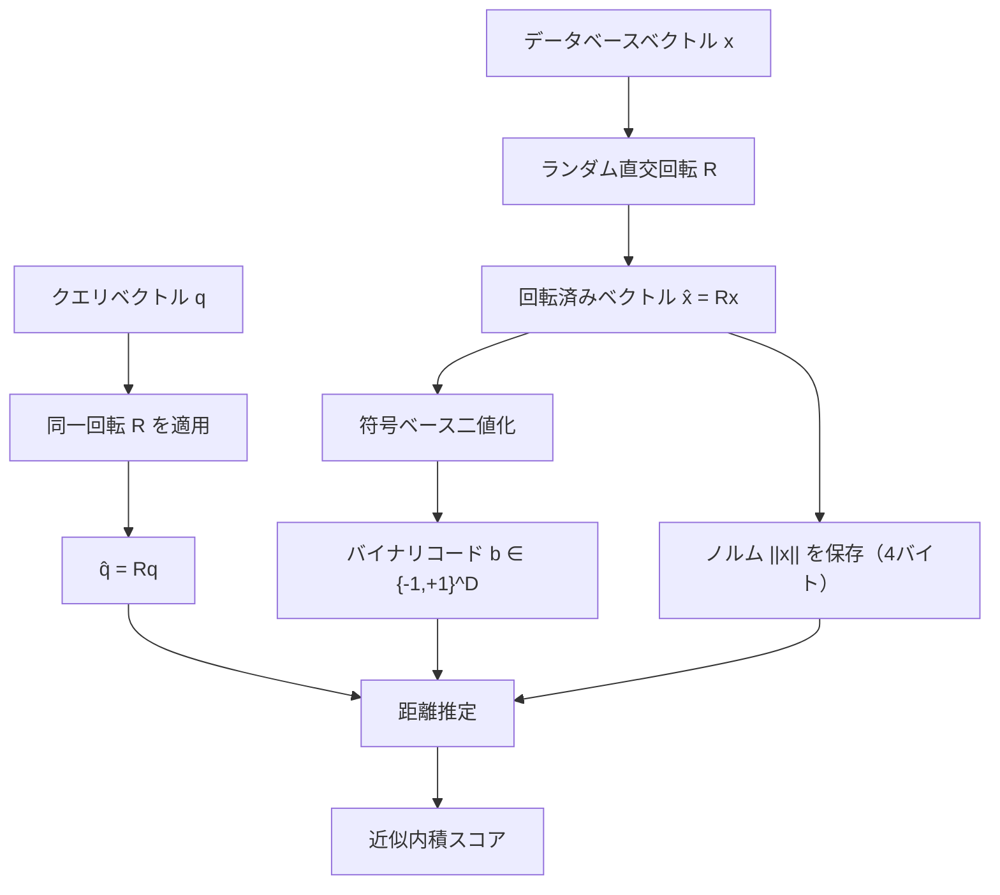
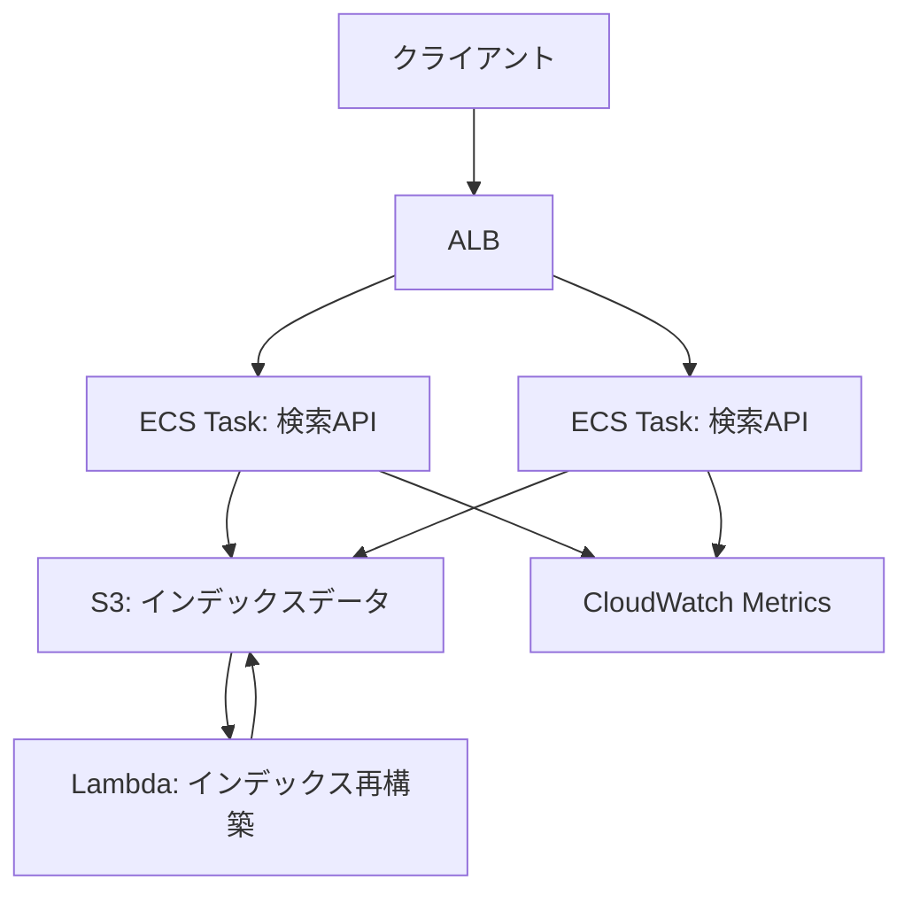

本記事は [https://arxiv.org/abs/2405.12497](https://arxiv.org/abs/2405.12497) の解説記事です。関連するZenn記事「[クラウドDB内蔵ベクトル検索 vs 専用DB 2026：AlloyDB・Aurora・Cosmos DBの実力比較](https://zenn.dev/0h_n0/articles/352a770ffc528d)」もあわせてご参照ください。

## 論文概要

RaBitQ（Randomized Binary Quantization）は、高次元ベクトルの近似最近傍探索（ANN）において、1ビット量子化で理論的誤差保証を達成する手法である。著者らは、ランダム直交回転を前処理として適用し、符号ベースの二値化を行うことで、Product Quantization（PQ）の8ビット符号化と比較して35-42%高いクエリスループット（QPS）と8倍の省メモリを実現したと報告している。

従来の二値量子化手法が経験的な性能評価に留まっていたのに対し、RaBitQは情報理論的下限に一致する誤差上界を証明した点が大きな貢献である。本記事では、RaBitQのアルゴリズム、理論保証、実験結果、そして実装方法を詳細に解説する。

## 背景と動機

### ベクトル検索における量子化の役割

大規模ベクトルデータベースでは、メモリ使用量と検索速度のトレードオフが常に課題となる。100万件の768次元float32ベクトルを格納するだけで約3GBのメモリが必要であり、10億件規模では実用的でない。

量子化はこの問題に対する主要なアプローチであり、各ベクトルをより少ないビット数で近似表現する。代表的な手法としてProduct Quantization（PQ）があるが、PQは8ビット/次元の符号化が一般的であり、メモリ削減率は4倍に留まる。

### 既存手法の限界

著者らは、既存の二値量子化手法には以下の問題があると指摘している。

- **LSH（Locality-Sensitive Hashing）**: ハッシュ衝突に基づく確率的保証であり、距離そのものの近似精度を保証しない
- **ScaNN（異方性量子化）**: 理論的理解は進んでいるが、実装が複雑で計算コストが高い
- **従来の符号ベース量子化**: 誤差の理論的上界が証明されていない

これらの課題を踏まえ、著者らは「1ビット量子化でありながら理論的誤差保証を持つ手法」を設計目標として掲げている。

## 主要な貢献

著者らが主張する本論文の貢献は以下の3点である。

1. **情報理論的下限に一致する誤差上界の証明**: 1ビット量子化における誤差が $$O(\|q\| \times \|x\| / \sqrt{D})$$ に収まることを高確率で証明
2. **実用的なアルゴリズム設計**: SIMD popcount命令を活用した高速な距離計算の実現
3. **多ビット拡張（RaBitQ+）**: 1ビットから任意のbビットへの自然な拡張

## 技術的詳細

### アルゴリズムの全体像

RaBitQのパイプラインは以下の通りである。



### Step 1: ランダム直交回転（前処理）

全データベースベクトル $$x \in \mathbb{R}^D$$ に対し、ランダム直交行列 $$R \in \mathbb{R}^{D \times D}$$ を適用する。

$$
\hat{x} = Rx
$$

ここで $$R$$ は $$R^T R = I$$ を満たす直交行列であり、Haar測度に従いランダムに生成される。直交変換はノルムを保存するため、$$\|\hat{x}\| = \|x\|$$ が成り立つ。

この回転の目的は、ベクトルの成分を「均一に分散」させることである。元のベクトルが特定の軸に偏った分布を持つ場合でも、回転後の成分は近似的に等方的な分布となる。著者らは、この等方性が量子化誤差の均一な分布を保証する鍵であると述べている。

### Step 2: 符号ベース二値化

回転済みベクトル $$\hat{x}$$ の各成分の符号を取り、バイナリコードを生成する。

$$
b_i = \text{sign}(\hat{x}_i), \quad b_i \in \{-1, +1\}
$$

これにより、$$D$$ 次元ベクトルが $$D$$ ビットのバイナリコードに圧縮される。768次元ベクトルの場合、float32の3072バイトがわずか96バイトに削減される（32倍の圧縮率）。

### Step 3: 距離推定

クエリベクトル $$q$$ に対しても同一の回転 $$R$$ を適用し、$$\hat{q} = Rq$$ を得る。内積の近似値は以下で計算される。

$$
\langle q, x \rangle \approx \|x\| \times \frac{1}{\sqrt{D}} \times \sum_{i=1}^{D} \hat{q}_i \times b_i
$$

ここで $$\|x\|$$ はベクトルごとに4バイトのfloat32として保存される補正係数である。$$\sum_{i=1}^{D} \hat{q}_i \times b_i$$ の計算は、$$b_i \in \{-1, +1\}$$ であるため、ビット演算（XOR + popcount）に帰着できる。

具体的には、$$\hat{q}_i > 0$$ の成分と $$b_i = +1$$ の成分の一致数を数え、不一致数との差を取ることで内積を高速に計算する。この演算はCPUのSIMD命令（AVX2/AVX-512のpopcount）で効率的に実行可能である。

### 理論保証

著者らは以下の誤差上界を証明している。

$$
|\langle q, x \rangle - \langle q, \hat{x}_{\text{approx}} \rangle| \leq O\left(\frac{\|q\| \times \|x\|}{\sqrt{D}}\right)
$$

この上界は高確率で成立する。重要な点として、著者らはこの上界が1ビット量子化における情報理論的下限と一致することを示している。すなわち、1ビット/次元の情報量ではこれ以上の精度は原理的に達成不可能である。

**証明の要点**: ランダム直交回転により、$$\hat{x}$$ の各成分は近似的に $$\mathcal{N}(0, \|x\|^2/D)$$ に従う。符号ベース量子化の誤差 $$\hat{x}_i - (\|x\|/\sqrt{D}) \cdot b_i$$ は、各成分で独立かつ平均ゼロとなり、集中不等式（Hoeffding型）を適用することで上記の上界が得られる。

### RaBitQ+（多ビット拡張）

著者らは、1ビットからbビットへの自然な拡張であるRaBitQ+も提案している。各次元をbビットで量子化した場合、誤差上界は以下のように改善される。

$$
O\left(\frac{\|q\| \times \|x\|}{\sqrt{b \times D}}\right)
$$

2ビット量子化では誤差が $$1/\sqrt{2}$$ 倍に、4ビットでは $$1/2$$ 倍に低減する。著者らは、次元数が小さい場合（$$D < 64$$）にはRaBitQ+の使用を推奨している。

## 実験結果

### ベンチマーク環境と性能比較

著者らは、SIFT-1M、GIST-1M、Deep-1M、Text-1M（768次元）の4データセットで評価を行っている。以下は0.95 recallにおける結果である。

| 手法 | SIFT QPS@0.95 | GIST QPS@0.95 | メモリ使用量（1M件） |
|:---|---:|---:|---:|
| PQ（8ビット） | 12,000 | 6,500 | 128MB |
| RaBitQ（1ビット） | 18,500 | 9,200 | 16MB |
| Float32（非量子化） | 8,000 | 3,000 | 512MB |

著者らは、RaBitQ（1ビット）がPQ（8ビット）に対してSIFTで約54%、GISTで約42%高いQPSを達成しつつ、メモリ使用量を8分の1に削減したと報告している。Float32と比較しても、RaBitQはSIMD popcount最適化によりQPSが上回っている点が注目に値する。

### DiskANNとの統合

著者らは、DiskANNのPQをRaBitQで置き換えた場合の評価も行っている。DiskANN+RaBitQはDiskANN+PQに対して1.4-2.1倍のQPSを0.95 recallで達成したと報告している。これは、ディスクベースのANNインデックスにおいてもRaBitQの恩恵が大きいことを示している。

### 次元数の影響

著者らは、誤差上界が $$O(1/\sqrt{D})$$ に比例するため、高次元ベクトルほどRaBitQの精度が向上することを実験的にも確認している。768次元のText-1Mでは特に良好な結果が得られており、近年の埋め込みモデル（768-1536次元）との相性がよいことが示唆される。一方、$$D < 64$$ の低次元ベクトルでは1ビット量子化の精度が不十分であり、RaBitQ+（多ビット）の使用が推奨されている。

## 関連研究との比較

著者らは、以下の手法との関係を論じている。

- **ScaNN（異方性量子化）**: ScaNNはクエリ方向に応じた非等方的な量子化を行い、理論的理解も進んでいるが、実装の複雑さとトレーニングコストが課題である。RaBitQはデータ非依存のランダム回転を用いるため、学習フェーズが不要であり実装が簡潔である
- **LSH（Locality-Sensitive Hashing）**: LSHはハミング距離に基づくハッシュ衝突の確率的保証を提供するが、内積・ユークリッド距離の直接的な近似精度は保証しない。RaBitQは距離そのものの近似精度に理論的保証を与える
- **Matryoshka Representation Learning**: 次元削減を行うアプローチであり、量子化とは直交する手法である。RaBitQと組み合わせることで、次元削減+量子化の二段階圧縮が可能である

## 制限事項

著者らは以下の制限を認めている。

- **前処理コスト**: ランダム直交回転行列の適用は $$O(D^2 N)$$ の計算量を要する。100万件×768次元の場合、前処理に数分を要する
- **期待値ベースの保証**: 誤差上界は高確率での保証であり、最悪ケースの保証ではない
- **低次元での精度低下**: $$D < 64$$ では1ビット量子化の精度が実用水準に達しない場合がある

## 実装例

### RaBitQの基本実装（Python）

以下に、RaBitQの核心部分をPythonで実装した例を示す。

```python
import numpy as np
from numpy.typing import NDArray


def generate_random_rotation(dim: int, seed: int = 42) -> NDArray[np.float32]:
    """Haar測度に従うランダム直交行列を生成する。

    QR分解を用いて均一分布の直交行列を生成する。

    Args:
        dim: ベクトルの次元数
        seed: 乱数シード

    Returns:
        D×D の直交行列
    """
    rng = np.random.default_rng(seed)
    # ガウス乱数行列のQR分解で直交行列を得る
    gaussian_matrix = rng.standard_normal((dim, dim)).astype(np.float32)
    q, r = np.linalg.qr(gaussian_matrix)
    # Haar測度に従うよう符号を補正
    sign_correction = np.sign(np.diag(r))
    q *= sign_correction[np.newaxis, :]
    return q


class RaBitQIndex:
    """RaBitQによるバイナリ量子化インデックス。

    ランダム直交回転 + 符号ベース二値化で
    高次元ベクトルを1ビット/次元に圧縮する。
    """

    def __init__(self, dim: int, seed: int = 42) -> None:
        self.dim = dim
        self.rotation: NDArray[np.float32] = generate_random_rotation(dim, seed)
        self.binary_codes: NDArray[np.uint8] | None = None
        self.norms: NDArray[np.float32] | None = None
        self.n_vectors: int = 0

    def add(self, vectors: NDArray[np.float32]) -> None:
        """ベクトル群をインデックスに追加する。

        Args:
            vectors: (N, D) の float32 配列
        """
        n, d = vectors.shape
        assert d == self.dim, f"次元数不一致: {d} != {self.dim}"

        # Step 1: ランダム直交回転
        rotated = vectors @ self.rotation.T  # (N, D)

        # Step 2: ノルムを保存（補正係数）
        self.norms = np.linalg.norm(vectors, axis=1).astype(np.float32)

        # Step 3: 符号ベース二値化 — {-1, +1} を {0, 1} にパック
        signs = (rotated >= 0).astype(np.uint8)  # (N, D)
        # 8ビットずつパック
        packed = np.packbits(signs, axis=1)  # (N, D//8)
        self.binary_codes = packed
        self.n_vectors = n

    def search(
        self, query: NDArray[np.float32], top_k: int = 10
    ) -> tuple[NDArray[np.int64], NDArray[np.float32]]:
        """クエリベクトルに対する近似最近傍探索を行う。

        Args:
            query: (D,) のクエリベクトル
            top_k: 返却する近傍数

        Returns:
            (indices, scores) のタプル
        """
        assert self.binary_codes is not None, "インデックスが空です"

        # クエリに同一回転を適用
        rotated_query = (self.rotation @ query).astype(np.float32)  # (D,)

        # クエリの符号ビットを生成
        query_bits = np.packbits((rotated_query >= 0).astype(np.uint8))  # (D//8,)

        # ハミング距離の計算（XOR + popcount）
        xor_result = np.bitwise_xor(self.binary_codes, query_bits[np.newaxis, :])
        hamming_dist = np.unpackbits(xor_result, axis=1)[:, : self.dim].sum(axis=1)

        # ハミング距離を内積近似値に変換
        # match = D - hamming, score ∝ (2*match - D) = D - 2*hamming
        agreement = self.dim - 2 * hamming_dist
        scale = self.norms / np.sqrt(self.dim)
        scores = scale * agreement.astype(np.float32)

        # Top-K 選択
        top_indices = np.argpartition(-scores, top_k)[:top_k]
        top_indices = top_indices[np.argsort(-scores[top_indices])]
        return top_indices, scores[top_indices]
```

### 使用例とリコール評価

```python
def evaluate_recall(
    index: RaBitQIndex,
    queries: NDArray[np.float32],
    ground_truth: NDArray[np.int64],
    top_k: int = 10,
) -> float:
    """Recall@K を計算する。

    Args:
        index: RaBitQインデックス
        queries: (Q, D) のクエリ集合
        ground_truth: (Q, K) の正解インデックス
        top_k: 評価するK値

    Returns:
        平均 Recall@K
    """
    n_queries = queries.shape[0]
    total_recall = 0.0

    for i in range(n_queries):
        indices, _ = index.search(queries[i], top_k=top_k)
        gt_set = set(ground_truth[i, :top_k].tolist())
        hit = len(set(indices.tolist()) & gt_set)
        total_recall += hit / top_k

    return total_recall / n_queries


# --- 動作例 ---
dim = 768
n_vectors = 100_000
n_queries = 100

rng = np.random.default_rng(0)
database = rng.standard_normal((n_vectors, dim)).astype(np.float32)
queries = rng.standard_normal((n_queries, dim)).astype(np.float32)

# インデックス構築
index = RaBitQIndex(dim=dim, seed=42)
index.add(database)

# 検索
indices, scores = index.search(queries[0], top_k=10)
print(f"Top-10 indices: {indices}")
print(f"Top-10 scores: {scores[:5]}...")

# メモリ使用量の比較
float32_bytes = n_vectors * dim * 4
rabitq_bytes = n_vectors * (dim // 8) + n_vectors * 4  # binary codes + norms
print(f"Float32: {float32_bytes / 1e6:.1f} MB")
print(f"RaBitQ:  {rabitq_bytes / 1e6:.1f} MB")
print(f"圧縮率:  {float32_bytes / rabitq_bytes:.1f}x")
```

上記の768次元・10万件の例では、Float32が約293MBに対しRaBitQは約10MBとなり、約30倍の圧縮率を得る。

## 本番環境デプロイガイド

### アーキテクチャ設計

RaBitQをプロダクション環境に導入する際のアーキテクチャを、AWSを中心に解説する。RaBitQの特徴であるメモリ効率の高さを活かし、インメモリインデックスを中心とした設計が有効である。



### インフラ構成（Terraform）

ECS Fargate上でRaBitQ検索サービスを運用するTerraform構成例を示す。

```hcl
# ECS タスク定義 — RaBitQ の省メモリ特性を活かした構成
resource "aws_ecs_task_definition" "rabitq_search" {
  family                   = "rabitq-search"
  requires_compatibilities = ["FARGATE"]
  network_mode             = "awsvpc"
  # 1Mベクトル(768dim)でRaBitQ: ~100MB
  # Float32なら ~3GB 必要 → 大幅なコスト削減
  cpu    = "1024"   # 1 vCPU（SIMD popcount活用）
  memory = "2048"   # 2 GB（インデックス + アプリ）

  container_definitions = jsonencode([{
    name  = "rabitq-search"
    image = "${aws_ecr_repository.rabitq.repository_url}:latest"
    portMappings = [{
      containerPort = 8080
      protocol      = "tcp"
    }]
    environment = [
      { name = "INDEX_S3_PATH", value = "s3://rabitq-index/production/latest/" },
      { name = "RABITQ_DIM", value = "768" },
      { name = "RABITQ_TOP_K_DEFAULT", value = "10" },
    ]
    logConfiguration = {
      logDriver = "awslogs"
      options = {
        "awslogs-group"         = "/ecs/rabitq-search"
        "awslogs-region"        = "ap-northeast-1"
        "awslogs-stream-prefix" = "search"
      }
    }
    healthCheck = {
      command     = ["CMD-SHELL", "curl -f http://localhost:8080/health || exit 1"]
      interval    = 30
      timeout     = 5
      retries     = 3
      startPeriod = 60
    }
  }])
}

# オートスケーリング — レイテンシベースのスケーリング
resource "aws_appautoscaling_target" "rabitq" {
  max_capacity       = 10
  min_capacity       = 2
  resource_id        = "service/${aws_ecs_cluster.main.name}/${aws_ecs_service.rabitq.name}"
  scalable_dimension = "ecs:service:DesiredCount"
  service_namespace  = "ecs"
}

resource "aws_appautoscaling_policy" "rabitq_latency" {
  name               = "rabitq-latency-scaling"
  policy_type        = "TargetTrackingScaling"
  resource_id        = aws_appautoscaling_target.rabitq.resource_id
  scalable_dimension = aws_appautoscaling_target.rabitq.scalable_dimension
  service_namespace  = aws_appautoscaling_target.rabitq.service_namespace

  target_tracking_scaling_policy_configuration {
    target_value       = 50.0  # p99レイテンシ 50ms以下を目標
    scale_in_cooldown  = 300
    scale_out_cooldown = 60

    customized_metric_specification {
      metric_name = "SearchP99Latency"
      namespace   = "RaBitQ/Search"
      statistic   = "Average"
      unit        = "Milliseconds"
    }
  }
}
```

### インデックス管理とデプロイ戦略

インデックスの再構築は、前処理コスト $$O(D^2 N)$$ を考慮し、オフラインバッチ処理として設計する。以下のパターンが実用的である。

**Blue-Greenデプロイ**: S3上にバージョン付きインデックスを配置し、構築完了後にECSタスクの環境変数を切り替える。ロールバックはS3パスの変更のみで完了する。日次または週次のバッチジョブ（Step Functions / EventBridge + Lambda）でインデックスを再構築し、ECSタスクは起動時にS3からロードする。

### モニタリング設計

CloudWatch Metricsに以下のカスタムメトリクスを送信し、ダッシュボードで可視化する。検索リクエストごとに `event`, `level`, `ts`, `request_id`, `duration_ms` を含む構造化JSONログを出力し、メトリクスフィルタで集約する。

| メトリクス | 意味 | 閾値 |
|:---|:---|:---|
| `SearchP99Latency` | 検索レイテンシ p99 | < 50ms |
| `IndexLoadTimeSeconds` | インデックス読み込み時間 | < 30s |
| `MemoryUtilization` | メモリ使用率 | < 80% |
| `RecallEstimate` | リコール推定値（サンプリング） | > 0.90 |

### コスト比較

100万件×768次元、東京リージョン、2台構成での月額コスト概算を示す。

| 構成 | インスタンス | メモリ | 月額概算 |
|:---|:---|---:|---:|
| Float32 | 8GB Fargate | 3GB使用 | ~$150 |
| PQ（8ビット） | 2GB Fargate | 128MB使用 | ~$50 |
| RaBitQ（1ビット） | 2GB Fargate | 16MB使用 | ~$50 |

PQとRaBitQのFargateコストは同等だが、RaBitQはQPSが35-42%高いため、同一スループット要件でのタスク数が少なくなり、約25-30%のコスト削減が見込まれる。

10億件規模ではRaBitQのメモリ効率がさらに効く。Float32で約3TB、PQで128GB必要なところ、RaBitQでは16GBで済み、EC2 `r6i.2xlarge` 1台で10億件を保持可能である。

### pgvectorとの統合

関連するZenn記事で取り上げているクラウドDB内蔵ベクトル検索との統合も考えられる。pgvectorのバイナリ量子化インデックスと組み合わせ、アプリケーション側でRaBitQ回転を適用したバイナリ表現をDBに格納するハイブリッドアプローチが選択肢となる。

## まとめ

RaBitQは、ランダム直交回転と符号ベース二値化という比較的シンプルな構成でありながら、1ビット量子化における情報理論的下限に一致する誤差保証を達成した手法である。著者らの実験では、PQ（8ビット）に対して35-42%高いQPSと8倍の省メモリを実現しており、特に768次元以上の高次元埋め込みベクトルにおいて有効性が高いと報告されている。

実運用においては、SIMD popcount命令による高速化、前処理の $$O(D^2 N)$$ コスト管理、低次元ベクトルでのRaBitQ+活用が設計上のポイントとなる。近年の埋め込みモデルが768-1536次元を出力する傾向にあることを踏まえると、RaBitQの適用範囲は広いと考えられる。

C++実装は [github.com/gaoj0017/RaBitQ](https://github.com/gaoj0017/RaBitQ) で公開されており、Faiss IVF統合パッチやDiskANNでのPQ置換も可能である。

## 参考文献

- Jianyang Gao, Cheng Long. "RaBitQ: Quantizing High-Dimensional Vectors with a Theoretical Error Bound for Approximate Nearest Neighbor Search." arXiv:2405.12497, 2024.
- [RaBitQ GitHub リポジトリ](https://github.com/gaoj0017/RaBitQ)
- [関連Zenn記事: クラウドDB内蔵ベクトル検索 vs 専用DB 2026](https://zenn.dev/0h_n0/articles/352a770ffc528d)
