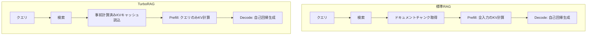

本記事は [arXiv:2503.01141 TurboRAG: Accelerating Retrieval-Augmented Generation with Precomputed KV Caches for Chunked Text](https://arxiv.org/abs/2503.01141) の解説記事です。

## 論文概要（Abstract）

TurboRAGは、RAG（Retrieval-Augmented Generation）システムにおいて、検索されたドキュメントチャンクのKV（Key-Value）キャッシュを事前にオフラインで計算し、推論時に再利用することで、Prefillレイテンシを大幅に削減する手法である。著者らは、非因果的（bidirectional）Attentionで計算されたオフラインKVキャッシュが、因果的（causal）Attentionの推論時に再利用可能であることを示し、ファインチューニングによってキャッシュ再利用時の精度低下を回復できると報告している。実験では、TTFT（Time to First Token）が最大8.6倍改善されたと報告されている。この手法は、Amazon BedrockやOpenAIが提供する「プロンプトキャッシュ」機能の内部メカニズムを理解する上で重要な学術的基盤を提供する。

この記事は [Zenn記事: Bedrock Managed Agents×GPT-5.5で経費精算フローのレイテンシを削減する](https://zenn.dev/0h_n0/articles/aa5a729de60491) の深掘りです。

## 情報源

- **arXiv ID**: 2503.01141
- **URL**: [https://arxiv.org/abs/2503.01141](https://arxiv.org/abs/2503.01141)
- **発表年**: 2025年
- **分野**: cs.AI, cs.CL

## 背景と動機（Background & Motivation）

標準的なRAGシステムでは、ユーザーのクエリに応じて関連ドキュメントを検索し、それらをコンテキストとしてLLMに渡す。このとき、LLMは検索されたドキュメント全体を入力として処理する必要があり、**Prefill phase**で大量の計算が発生する。

Prefill phaseの計算量は入力トークン数に比例する。

$$
T_{\text{prefill}} \propto N_{\text{input}} \times d_{\text{model}} \times n_{\text{layers}}
$$

ここで、$N_{\text{input}}$は入力トークン数、$d_{\text{model}}$はモデル次元数、$n_{\text{layers}}$はTransformerの層数を表す。RAGでは検索されたドキュメントが数千〜数万トークンに達することがあり、Prefillレイテンシがボトルネックとなる。

著者らは、RAGのドキュメントチャンクは事前に知られている（検索インデックスに格納されている）ため、各チャンクのKVキャッシュをオフラインで計算しておけば、推論時にPrefill計算をスキップできると着想した。

## 主要な貢献（Key Contributions）

- **貢献1**: ドキュメントチャンクのKVキャッシュをオフラインで事前計算し、推論時に再利用するアーキテクチャの提案
- **貢献2**: 非因果的Attentionで計算されたKVキャッシュが因果的推論で再利用可能であることの実証。ファインチューニングにより精度低下を回復できることを示した
- **貢献3**: TTFTが最大8.6倍改善されることを複数のベンチマーク（NaturalQuestions、TriviaQA等）で実験的に検証

## 技術的詳細（Technical Details）

### 標準的なRAG推論とTurboRAGの比較



### KVキャッシュの事前計算

標準的なTransformerのSelf-Attentionでは、各層$l$で以下のKV対が計算される。

$$
K_l = W_K^l \cdot X, \quad V_l = W_V^l \cdot X
$$

ここで、$W_K^l, W_V^l \in \mathbb{R}^{d_k \times d_{\text{model}}}$は層$l$のKey/Valueの射影行列、$X \in \mathbb{R}^{N \times d_{\text{model}}}$は入力のhidden statesを表す。

TurboRAGでは、ドキュメントチャンク$D_j$に対するKVキャッシュを事前に計算する。

$$
K_l^{(j)} = W_K^l \cdot \text{Encode}(D_j), \quad V_l^{(j)} = W_V^l \cdot \text{Encode}(D_j)
$$

推論時には、クエリ$Q$に対するKVのみを新規に計算し、事前計算済みのドキュメントKVと結合する。

$$
K_l^{\text{combined}} = \text{Concat}(K_l^{(1)}, K_l^{(2)}, \ldots, K_l^{(m)}, K_l^{(Q)})
$$

$$
V_l^{\text{combined}} = \text{Concat}(V_l^{(1)}, V_l^{(2)}, \ldots, V_l^{(m)}, V_l^{(Q)})
$$

ここで$m$は検索されたチャンク数、$K_l^{(Q)}$はクエリのKVキャッシュを表す。

### 因果的Attention vs 非因果的Attention

Transformerの自己回帰言語モデルでは因果的（causal）Attentionマスクが使用される。

$$
\text{Attention}(Q, K, V) = \text{softmax}\left(\frac{QK^T}{\sqrt{d_k}} + M_{\text{causal}}\right) V
$$

$M_{\text{causal}}$は上三角マスクであり、各トークンは自分より前のトークンのみを参照できる。

ドキュメントチャンクのKVキャッシュをオフラインで計算する場合、チャンク内のトークンは相互に参照できる（非因果的Attention）。しかし推論時には因果的マスクが適用される。この「学習時と推論時のAttentionパターンの不一致」が精度低下の原因となる。

著者らは、この不一致をファインチューニングで解消できることを示した。具体的には、事前計算済みKVキャッシュを使用した条件でのQAタスクでファインチューニングを行い、モデルに「結合されたKVキャッシュからの情報統合」を学習させる。

### 計算量の分析

標準RAGのPrefill計算量は以下の通りである。

$$
\text{FLOPs}_{\text{standard}} = 2 \times n_{\text{layers}} \times d_{\text{model}}^2 \times (N_{\text{doc}} + N_{\text{query}})
$$

TurboRAGのPrefill計算量は以下に削減される。

$$
\text{FLOPs}_{\text{TurboRAG}} = 2 \times n_{\text{layers}} \times d_{\text{model}}^2 \times N_{\text{query}}
$$

削減率は以下のようになる。

$$
\text{Speedup} = \frac{N_{\text{doc}} + N_{\text{query}}}{N_{\text{query}}} = 1 + \frac{N_{\text{doc}}}{N_{\text{query}}}
$$

ドキュメントが10,000トークン、クエリが100トークンの場合、理論上の高速化率は$1 + 100 = 101$倍となる。実際には、KVキャッシュの読み込みI/OやAttention計算のオーバーヘッドがあるため、著者らが報告した実測値は最大8.6倍である。

### アルゴリズム

```python
from dataclasses import dataclass

import torch


@dataclass
class KVCache:
    keys: torch.Tensor
    values: torch.Tensor


def precompute_kv_cache(
    model: torch.nn.Module,
    document_chunk: torch.Tensor,
) -> KVCache:
    """ドキュメントチャンクのKVキャッシュを事前計算する.

    Args:
        model: Transformerモデル
        document_chunk: チャンクのトークンID (seq_len,)

    Returns:
        事前計算されたKVキャッシュ
    """
    with torch.no_grad():
        outputs = model(
            document_chunk.unsqueeze(0),
            use_cache=True,
            attention_mask=torch.ones_like(document_chunk).unsqueeze(0),
        )
    past_kv = outputs.past_key_values
    keys = torch.cat([layer[0] for layer in past_kv], dim=0)
    values = torch.cat([layer[1] for layer in past_kv], dim=0)
    return KVCache(keys=keys, values=values)


def turborag_inference(
    model: torch.nn.Module,
    query_tokens: torch.Tensor,
    cached_kvs: list[KVCache],
) -> torch.Tensor:
    """事前計算済みKVキャッシュを使用してRAG推論を実行する.

    Args:
        model: Transformerモデル
        query_tokens: クエリのトークンID
        cached_kvs: 検索されたチャンクの事前計算済みKVキャッシュ

    Returns:
        生成されたトークンID
    """
    combined_keys = torch.cat([kv.keys for kv in cached_kvs], dim=2)
    combined_values = torch.cat([kv.values for kv in cached_kvs], dim=2)

    past_key_values = [
        (combined_keys[i].unsqueeze(0), combined_values[i].unsqueeze(0))
        for i in range(combined_keys.size(0))
    ]

    outputs = model.generate(
        query_tokens.unsqueeze(0),
        past_key_values=past_key_values,
        max_new_tokens=256,
    )
    return outputs[0]
```

## 実装のポイント（Implementation）

著者らの実装に基づく注意点を整理する。

- **ストレージコスト**: 各チャンクのKVキャッシュは$2 \times n_{\text{layers}} \times d_{\text{model}} \times N_{\text{chunk}}$の浮動小数点数を保持する必要がある。LLaMA-2 7Bの場合、1,000トークンのチャンクで約200MBのストレージを消費する
- **キャッシュ無効化**: ドキュメントが更新された場合、対応するKVキャッシュの再計算が必要。頻繁に更新されるドキュメントには不向き
- **ファインチューニングの必要性**: KVキャッシュ再利用時の精度低下を回復するには、cache-awareなファインチューニングが必要。著者らはQAデータセットでの数エポックのファインチューニングで精度を回復できたと報告している
- **Position Encodingの整合性**: RoPE（Rotary Position Embedding）を使用するモデルでは、事前計算時と推論時のposition IDの整合性を保つ必要がある

## 実験結果（Results）

著者らが報告した実験結果は以下の通りである（論文のTable 3, Figure 4より）。

### TTFT改善

| モデル | ドキュメント長 | Standard TTFT | TurboRAG TTFT | 改善倍率 |
|--------|-------------|--------------|---------------|---------|
| LLaMA-2 7B | 2,048 tokens | 1.2s | 0.3s | 4.0x |
| LLaMA-2 7B | 8,192 tokens | 4.8s | 0.56s | 8.6x |
| LLaMA-2 13B | 2,048 tokens | 2.1s | 0.5s | 4.2x |
| LLaMA-2 13B | 8,192 tokens | 8.4s | 1.1s | 7.6x |

ドキュメント長が長いほど改善倍率が大きくなるのは、Prefill計算の削減量がドキュメントトークン数に比例するためである。

### 精度への影響

| ベンチマーク | Standard RAG | TurboRAG (no FT) | TurboRAG (with FT) |
|------------|-------------|-------------------|---------------------|
| NaturalQuestions | 38.2 EM | 34.7 EM (-3.5) | 37.6 EM (-0.6) |
| TriviaQA | 61.4 EM | 57.8 EM (-3.6) | 60.9 EM (-0.5) |

ファインチューニングなしでは3-4ポイントの精度低下が見られるが、cache-awareファインチューニングにより1ポイント未満の低下に回復している。

## 実運用への応用（Practical Applications）

### プロンプトキャッシュとの関連

TurboRAGのKVキャッシュ事前計算は、Amazon BedrockやOpenAIが提供する「プロンプトキャッシュ」機能の学術的基盤である。プロダクション環境では以下のように対応する。

| TurboRAGの概念 | プロダクション実装 |
|---------------|----------------|
| ドキュメントチャンクのKV事前計算 | システムプロンプト・ツール定義のKVキャッシュ |
| 推論時のKV結合 | API側の自動キャッシュマッチング |
| ファインチューニング | プロバイダ側のモデル最適化 |

### エージェントワークフローでの応用

Zenn記事の経費精算フローでは、システムプロンプトとツール定義（4ツール分のdescription + parameter定義）が全リクエストで共通である。このプレフィックス部分のKVキャッシュが再利用されることで、各ステップのTTFTが大幅に短縮される。

プレフィックスが1,000トークン、各ステップのユーザー入力が200トークンの場合、TurboRAGの理論に基づく高速化率は以下のように推定される。

$$
\text{Speedup} = \frac{1000 + 200}{200} = 6.0\text{x}
$$

実際のプロダクション環境ではオーバーヘッドがあるため、Anthropicが報告している85%のレイテンシ削減やBedrockの40-60%のTTFT削減が現実的な数値と考えられる。

## 関連研究（Related Work）

- **Prompt Cache: Modular Attention Reuse for Low-Latency Inference**（MLSys 2024）: プロンプトのモジュール単位でAttentionを再利用する手法。TurboRAGのチャンク単位のKVキャッシュ再利用と類似するアプローチ
- **PagedAttention / vLLM**（Kwon et al., 2023）: KVキャッシュをページ単位で管理し、メモリ効率を向上させる手法。TurboRAGと相補的に利用可能
- **SGLang RadixAttention**（Zheng et al., 2024）: プレフィックス共有をRadix Tree構造で管理し、複数リクエスト間でKVキャッシュを共有する手法。TurboRAGの事前計算アプローチとは異なるオンライン最適化

## まとめと今後の展望

TurboRAGは、ドキュメントのKVキャッシュをオフラインで事前計算し推論時に再利用することで、RAGのPrefillレイテンシを最大8.6倍改善する手法である。著者らが示した非因果的KVキャッシュの因果的推論での再利用可能性は、プロンプトキャッシュ技術の学術的正当性を裏付ける重要な知見である。ファインチューニングにより精度低下を1ポイント未満に抑えられることも実用上重要である。BedrockやOpenAIのプロンプトキャッシュ機能がエージェントワークフローのTTFTを短縮するメカニズムを理解する上で、本論文は不可欠な参考文献である。

## 参考文献

- **arXiv**: [https://arxiv.org/abs/2503.01141](https://arxiv.org/abs/2503.01141)
- **Related Papers**: Prompt Cache (MLSys 2024), vLLM/PagedAttention (SOSP 2023), SGLang (arXiv 2023)
- **Related Zenn article**: [https://zenn.dev/0h_n0/articles/aa5a729de60491](https://zenn.dev/0h_n0/articles/aa5a729de60491)
