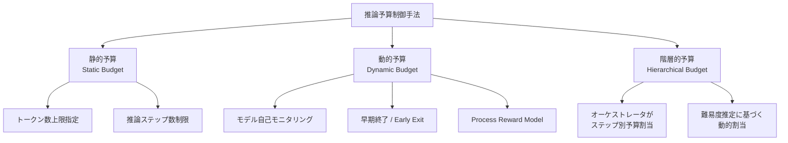

本記事は [arXiv:2503.10461 Reasoning Under Adaptive Budgets](https://arxiv.org/abs/2503.10461) の解説記事です。

## 論文概要（Abstract）

本論文は、LLMが複雑な推論タスクに取り組む際の計算予算（推論トークン数・ステップ数）を動的に制御する手法群を体系的にサーベイしている。著者らは、Chain-of-Thought（CoT）推論の計算コストが実用上の課題となっている現状を踏まえ、「タスクの複雑さに応じて推論予算を適応的に割り当てる」アプローチを分類・整理している。このサーベイの知見は、GPT-5.5の`reasoning.effort`パラメータのような、ユーザーが推論深度を制御するAPIの理論的基盤を理解する上で有用である。

この記事は [Zenn記事: Bedrock Managed Agents×GPT-5.5で経費精算フローのレイテンシを削減する](https://zenn.dev/0h_n0/articles/aa5a729de60491) の深掘りです。

## 情報源

- **arXiv ID**: 2503.10461
- **URL**: [https://arxiv.org/abs/2503.10461](https://arxiv.org/abs/2503.10461)
- **著者**: （サーベイ論文、複数著者）
- **発表年**: 2025年
- **分野**: cs.AI, cs.CL

## 背景と動機（Background & Motivation）

LLMの推論能力は、Chain-of-Thought（CoT）やTree-of-Thought（ToT）といった手法により飛躍的に向上した。しかし、これらの手法は推論トークンを大量に消費するため、レイテンシとコストの両面で実用上の課題がある。

例えば、「3+5=?」のような単純な計算に対してCoT推論を適用すると、不要な推論ステップが生成され、トークンとレイテンシを浪費する。一方、複雑な数学問題やコード生成では十分な推論ステップがなければ精度が低下する。

この「タスク複雑度と推論予算のミスマッチ」を解決するために、推論予算を適応的に制御する手法群が提案されている。GPT-5.5の`reasoning.effort`パラメータ（none/low/medium/high/xhigh）は、このアプローチをAPI上で実現した実用的なインスタンスと位置づけられる。

## 主要な貢献（Key Contributions）

- **貢献1**: 推論予算制御手法の体系的な分類体系（taxonomy）を提案。静的予算、動的予算、階層的予算の3カテゴリに整理
- **貢献2**: 50以上の論文をサーベイし、GSM8K、MATH、MMLU、コーディングベンチマークにおけるトークン効率と精度のトレードオフを比較分析
- **貢献3**: 適応的予算制御により、ルーティンタスクでトークン数を30-70%削減しつつ、精度低下を5%未満に抑えられることを報告

## 技術的詳細（Technical Details）

### 推論予算制御の分類体系

著者らは、推論予算制御手法を以下の3カテゴリに分類している。



#### 1. 静的予算（Static Budget）

ユーザーまたはシステムが事前に推論予算を固定する手法である。GPT-5.5の`reasoning.effort`パラメータはこのカテゴリに該当する。

$$
B_{\text{static}}(x) = B_{\text{level}} \quad \forall x
$$

ここで$x$は入力、$B_{\text{level}}$は指定されたレベル（low/medium/high等）に対応する固定予算を表す。

**利点**: 実装が容易で、レイテンシの予測可能性が高い。APIパラメータとして公開しやすい。

**欠点**: タスク複雑度に関わらず同一予算が適用されるため、簡単なタスクではトークン浪費、難しいタスクでは精度低下が生じる可能性がある。

#### 2. 動的予算（Dynamic Budget）

モデル自身がタスクの複雑度を推定し、推論予算を動的に調整する手法である。

$$
B_{\text{dynamic}}(x) = f_{\theta}(\text{complexity}(x))
$$

ここで$f_{\theta}$は学習された予算割当関数、$\text{complexity}(x)$は入力の推定複雑度を表す。

代表的な手法として以下がある。

- **Early Exit**: 中間層で十分な確信度に達した場合、残りの層をスキップする
- **Self-Monitoring**: モデルが自身の推論進捗を評価し、不要なステップを打ち切る
- **Process Reward Model（PRM）**: 各推論ステップにスコアを付与し、低スコアステップを枝刈りする

#### 3. 階層的予算（Hierarchical Budget）

マルチステップワークフローにおいて、オーケストレータがステップごとに異なる予算を割り当てる手法である。Zenn記事の経費精算フローで紹介されている「ステップ別reasoning.effort設定」はこのカテゴリに該当する。

$$
B_{\text{hierarchical}} = \{B_1, B_2, \ldots, B_K\}, \quad B_k = g(\text{step}_k, \text{context})
$$

$K$はワークフローのステップ数、$g$はステップ特性とコンテキストに基づく予算割当関数を表す。

### トークン効率と精度のトレードオフ

サーベイ論文では、50以上の論文から収集した実験データに基づき、推論予算削減と精度低下の関係を以下のように整理している。

| 予算削減率 | 典型的な精度影響 | 適用対象 |
|-----------|----------------|---------|
| 10-20%削減 | <1%低下 | ルーティンタスク（分類、抽出） |
| 30-50%削減 | 1-3%低下 | 中程度の推論タスク（QA、要約） |
| 50-70%削減 | 3-5%低下 | 構造化タスク（ツール呼び出し、ルーティング） |
| 70%超削減 | 5%超低下 | 複雑な推論タスクでは非推奨 |

これらの数値はオープンソースモデル（LLaMA系、Mistral系）での実験結果に基づくものであり、GPT-5.5のようなプロプライエタリモデルに直接外挿することはできない。ただし、「推論予算と精度のトレードオフ曲線」の一般的な形状は共通していると考えられる。

### GPT-5.5 reasoning.effortとの対応

GPT-5.5の`reasoning.effort`パラメータは、本サーベイの分類における「静的予算」の実装である。OpenAIの公式ガイドでは、以下の対応が示されている。

| reasoning.effort | サーベイの分類 | 用途 |
|-----------------|--------------|------|
| `none` | 予算ゼロ（推論スキップ） | レイテンシ最優先、推論不要タスク |
| `low` | 静的・最小予算 | ツール呼び出しルーティング |
| `medium` | 静的・中予算（デフォルト） | バランスの取れた推論 |
| `high` | 静的・大予算 | 複雑なエージェントタスク |
| `xhigh` | 静的・最大予算 | 非同期の高難度タスク |

Zenn記事で紹介されている「ステップ別reasoning.effort制御」は、本サーベイの「階層的予算」をAPIレベルで近似的に実現するアプローチである。オーケストレータ（Bedrock Managed Agents）がステップごとに異なるreasoning.effortをモデルに指示することで、フロー全体の推論予算を最適化する。

### アルゴリズム：推論予算の動的割当

以下は、サーベイで紹介されている動的予算制御の概念的なアルゴリズムである。

```python
from dataclasses import dataclass


@dataclass
class BudgetConfig:
    max_tokens: int
    confidence_threshold: float
    early_exit: bool


def adaptive_budget_reasoning(
    model,
    prompt: str,
    budget_config: BudgetConfig,
) -> str:
    """適応的予算制御による推論.

    Args:
        model: LLMモデル
        prompt: 入力プロンプト
        budget_config: 予算設定

    Returns:
        推論結果テキスト
    """
    reasoning_tokens: list[str] = []
    total_tokens = 0

    while total_tokens < budget_config.max_tokens:
        next_token = model.generate_next(prompt, reasoning_tokens)
        reasoning_tokens.append(next_token)
        total_tokens += 1

        if budget_config.early_exit:
            confidence = model.estimate_confidence(reasoning_tokens)
            if confidence > budget_config.confidence_threshold:
                break

    return model.generate_answer(prompt, reasoning_tokens)
```

## 実装のポイント（Implementation）

サーベイの知見を実務に適用する際の注意点として、著者らは以下を指摘している。

- **予算の下限設定**: ツール呼び出しやマルチステップ推論を含むタスクでは、推論予算をゼロにすると機能しなくなる。GPT-5.5でも`reasoning.effort=none`ではtool useが不安定になるケースが報告されている
- **タスク分類の事前評価**: どのタスクにどのレベルの予算を割り当てるかは、事前のベンチマーク測定が必須。Zenn記事で紹介されているように、OCRパース（low）、ポリシー判定（medium）、例外処理（high）のようなステップ別設定が有効
- **精度モニタリング**: 予算削減後も継続的に精度を監視し、劣化が見られた場合は予算を引き上げるフィードバックループが必要

## 実験結果（Results）

サーベイ論文では、個別の実験を行っていないが、50以上の論文の実験結果を横断的に分析している。主要な知見は以下の通りである。

**GSM8Kベンチマーク**での傾向（サーベイ内の複数論文より）:
- 標準CoT: 平均92%の精度（LLaMA 70Bクラス）
- 30%トークン削減: 90%の精度（2ポイント低下）
- 50%トークン削減: 87%の精度（5ポイント低下）

**MATHベンチマーク**での傾向:
- 標準CoT: 平均68%の精度
- 30%トークン削減: 65%の精度（3ポイント低下）
- 50%トークン削減: 58%の精度（10ポイント低下、非推奨）

これらの数値は、推論の複雑さが高いタスクほど予算削減の影響が大きいことを示している。経費精算フローのようなビジネスロジック処理は、数学的推論よりも構造化されているため、予算削減の影響は比較的小さいと推察される。

## 実運用への応用（Practical Applications）

### エージェントワークフローでの適用

本サーベイの知見は、Zenn記事で解説されているBedrock Managed Agentsの設計に直接活用できる。

**ステップ別予算割当の設計指針**:
1. **ルーティング・分類ステップ**: `reasoning.effort=low`（30-50%削減可能、精度影響<2%）
2. **条件分岐・判定ステップ**: `reasoning.effort=medium`（バランス）
3. **例外処理・監査ステップ**: `reasoning.effort=high`（精度優先）

**コスト影響**: GPT-5.5の出力トークン単価は$30/1Mトークンである。4ステップのワークフローで平均30%のトークン削減が実現できると仮定すると、月間10,000リクエスト（各ステップ平均200出力トークン）の場合、月額約$72の削減（$240→$168）が見込まれる。

### 動的予算制御の将来展望

サーベイでは、静的予算制御から動的予算制御への進化が今後の方向性として示されている。AgentCore OptimizationのRecommendations機能は、プロダクション環境のトレースデータを分析してプロンプトやツール記述を最適化する仕組みであり、将来的にはreasoning.effortの自動最適化にも拡張される可能性がある。

## 関連研究（Related Work）

- **s1: Simple Test-Time Scaling**（arXiv 2502.01618）: テスト時計算のスケーリング手法。予算が多いほど精度が向上するスケーリング則を実験的に示した研究
- **Entropy-Regularized Process Reward**（arXiv 2502.05171）: CoT推論の冗長性をエントロピー正則化で抑制する手法。推論トークンの効率化に直接寄与する
- **Thinking Tokens for Language Modeling**（arXiv 2502.11619）: 特殊な「思考トークン」を導入して推論能力を増強する手法。推論予算の効率的な使用に関連する

## まとめと今後の展望

本サーベイは、LLMの推論予算を適応的に制御する手法群を体系的に整理した重要な貢献である。GPT-5.5の`reasoning.effort`パラメータは「静的予算」の実用的な実装であり、経費精算フローのようなマルチステップワークフローでは「階層的予算」アプローチとしてステップ別に設定することで、レイテンシとコストの最適化が実現できる。今後はProcess Reward Modelやモデル自己モニタリングを活用した「動的予算」の実用化が進むと予想される。

## 参考文献

- **arXiv**: [https://arxiv.org/abs/2503.10461](https://arxiv.org/abs/2503.10461)
- **Related Zenn article**: [https://zenn.dev/0h_n0/articles/aa5a729de60491](https://zenn.dev/0h_n0/articles/aa5a729de60491)
