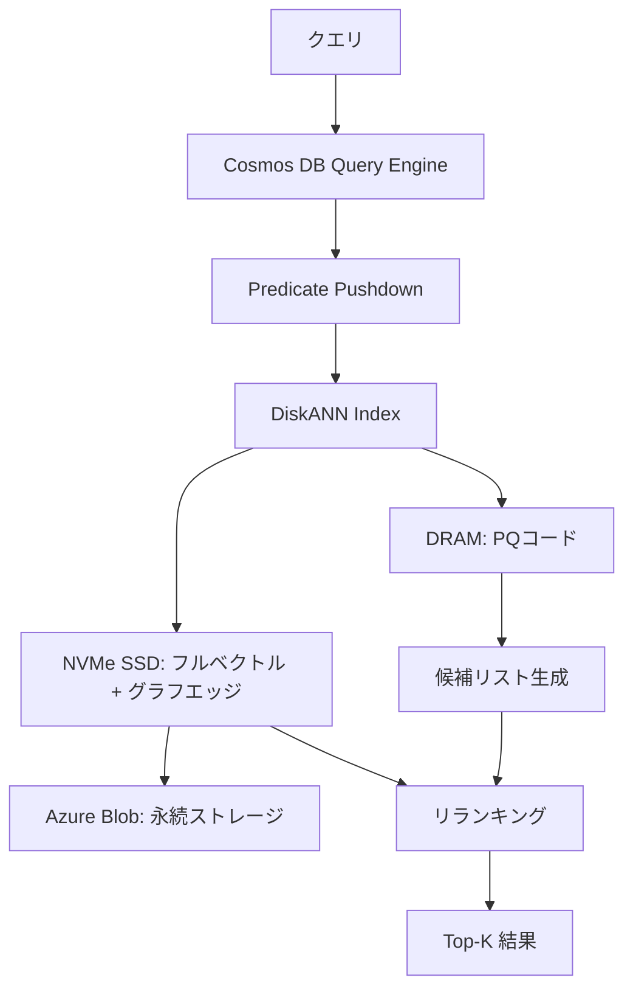

本記事は [https://arxiv.org/abs/2505.05885](https://arxiv.org/abs/2505.05885) の解説記事です。

## 論文概要（Abstract）

本論文は、Azure Cosmos DBにDiskANNベースのベクトル検索を統合した設計と実装を述べている。著者らは、DRAM上のPQコードとNVMe SSD上のフルベクトル・グラフエッジという階層型ストレージにより、専用ベクトルDB比で最大4倍のコスト効率を達成したと報告している。FreshDiskANNによるストリーミング更新で完全なインデックス再構築なしのリアルタイム更新も実現している。

この記事は [Zenn記事: クラウドDB内蔵ベクトル検索 vs 専用DB 2026：AlloyDB・Aurora・Cosmos DBの実力比較](https://zenn.dev/0h_n0/articles/352a770ffc528d) の深掘りです。

## 情報源

- **arXiv ID**: 2505.05885
- **URL**: [https://arxiv.org/abs/2505.05885](https://arxiv.org/abs/2505.05885)
- **著者**: Gaurav Tarlok Kakkar, Sudipta Sengupta, Bikram Sengupta et al.（Microsoft）
- **発表年**: 2025
- **分野**: cs.DB, cs.IR

## 背景と動機（Background & Motivation）

RAGやセマンティック検索の普及に伴い、ベクトル検索はアプリケーション開発に不可欠な要素となっている。従来は、Pinecone等の専用ベクトルDBを別途運用するか、pgvector等のDB拡張を組み込む方法が採られてきた。

しかし、専用ベクトルDBは全ベクトルをDRAMに保持するためコストが高い。著者らは、数百万〜数千万ベクトル規模ではDRAMコストがシステム全体の60-80%を占めると指摘している。一方、pgvector等はIVFFlat・HNSWベースであり、大規模データでの検索精度やレイテンシに課題がある。

この論文が取り組む核心的問題は、「汎用分散DBで専用DBと同等の検索品質を維持しつつコストを大幅に削減できるか」という点である。Cosmos DBにDiskANNを統合することで、ベクトル検索のために別サービスを運用する必要がなくなる。

## 主要な貢献（Key Contributions）

- **DiskANNのCosmos DB統合**: DRAM（PQコード）+ NVMe SSD（フルベクトル + グラフ）+ Azure Blob（永続化）の階層ストレージ。SSDはDRAMの10-20倍安価
- **FreshDiskANN**: 1ベクトルあたり1ms未満のインクリメンタル挿入。完全再構築不要
- **統合クエリ実行**: Predicate Pushdownでフィルタ検索Recall 0.93（ベースライン0.78、論文実験より）
- **コスト効率**: Pinecone比で3.3〜4倍のコスト削減（1M〜10Mベクトル、論文Table比較より）

## 技術的詳細（Technical Details）

### アーキテクチャ

Cosmos DBのベクトル検索は以下の3層ストレージ構成を持つ。



**パーティションレベルインデックス**: 各物理パーティションが独自のDiskANNインデックスを保持する。パーティション単位でスケールアウトが可能だが、著者らはクロスパーティションクエリで10-30msのオーバーヘッドが発生すると報告している。

**量子化サポート**: Flat（fp32）、int8スカラー量子化、DiskANN PQ（設定可能）の3種類。PQ圧縮により8-32倍のメモリ削減が可能である。

### Vamanaグラフ構築アルゴリズム

DiskANNの中核がVamanaグラフ構築アルゴリズムである。データセット$S = \{v_1, \ldots, v_n\}$に対し、各ノードの出次数を$R$以下に制限した有向グラフ$G = (S, E)$を構築する:

$$
\forall v \in S: |\text{out}(v)| \leq R
$$

$R$はストレージ使用量と検索精度のトレードオフを制御するパラメータである。新ノード$p$の挿入時はビーム幅$L$のGreedy Searchで近傍候補を取得し、Robust Pruningで接続先を選定する。Robust Pruningでは、以下を満たす候補を除外する:

$$
\alpha \cdot d(v^*, v) \leq d(p, v)
$$

ここで、$d(\cdot, \cdot)$は距離関数、$\alpha \geq 1$はPruning係数、$v^*$は現在の最近傍ノードである。$\alpha = 1$でRNG（Relative Neighborhood Graph）と等価になり、$\alpha > 1$ではlong-range edgeが増えてグラフの到達性が向上する一方、次数が増大する。直感的には「$v^*$経由で$v$に到達可能なら$p \to v$の直接エッジは不要」という考え方に基づく。

### 検索アルゴリズム

検索はGreedy Beam Searchで行われる。(1) DRAM上のPQ圧縮コードで候補集合を生成、(2) SSDからフルベクトルを取得、(3) フルベクトルでリランキングしTop-K結果を返す。

PQによる近似距離は、ベクトル$\mathbf{x} \in \mathbb{R}^d$を$M$個のサブベクトルに分割し$K$個のセントロイドで量子化して計算する:

$$
\tilde{d}(\mathbf{q}, \mathbf{x}) = \sum_{m=1}^{M} \| \mathbf{q}^m - \mathbf{c}^m_{k_m(\mathbf{x})} \|^2
$$

ここで$\mathbf{q}^m$はクエリの$m$番目のサブベクトル、$\mathbf{c}^m_{k_m(\mathbf{x})}$は$\mathbf{x}$の割り当てセントロイドである。$K = 256$（1バイト）が一般的で、$M$の増加はRecall向上とメモリ使用量増加のトレードオフとなる。

### FreshDiskANNによるストリーミング更新

FreshDiskANNは完全再構築なしでベクトルの挿入・削除を可能にする。著者らは1ベクトルあたり1ms未満のインクリメンタル挿入を報告している。挿入時はGreedy Search + Robust Pruningでエッジを確立し、逆辺も更新する。削除時は対象ノードの経路を近傍ノードで代替し、接続性を保つ。

```python
import numpy as np
from dataclasses import dataclass, field


@dataclass
class VamanaIndex:
    """Vamana graph index for approximate nearest neighbor search.

    Args:
        max_degree: Maximum out-degree R for each node.
        beam_width: Beam width L for greedy search.
        alpha: Pruning coefficient (>= 1.0).
    """
    max_degree: int
    beam_width: int
    alpha: float
    vectors: np.ndarray = field(default_factory=lambda: np.empty((0, 0)))
    adjacency: dict[int, list[int]] = field(default_factory=dict)

    def _robust_prune(
        self, node_id: int, candidates: list[tuple[float, int]]
    ) -> list[int]:
        """Robust Pruning: select edges respecting alpha condition."""
        candidates.sort()
        neighbors: list[int] = []
        for dist_p_v, v in candidates:
            if v == node_id:
                continue
            pruned = any(
                self.alpha * float(np.linalg.norm(
                    self.vectors[u] - self.vectors[v]
                )) <= dist_p_v
                for u in neighbors
            )
            if not pruned:
                neighbors.append(v)
            if len(neighbors) >= self.max_degree:
                break
        return neighbors

    def insert(self, vector: np.ndarray) -> int:
        """Insert a vector via FreshDiskANN streaming insert."""
        node_id = len(self.vectors) if self.vectors.size > 0 else 0
        if self.vectors.size == 0:
            self.vectors = vector.reshape(1, -1)
            self.adjacency[node_id] = []
            return node_id
        self.vectors = np.vstack([self.vectors, vector])
        # Greedy search from medoid, then robust prune
        candidates = self._greedy_search(vector, 0, self.beam_width)
        neighbors = self._robust_prune(node_id, candidates)
        self.adjacency[node_id] = neighbors
        # Add reverse edges
        for nb in neighbors:
            rev = self.adjacency.get(nb, [])
            if len(rev) < self.max_degree:
                rev.append(node_id)
                self.adjacency[nb] = rev
        return node_id
```

## 実装のポイント（Implementation）

著者らが述べている実装上のポイントを整理する。

**PQコードブックのサイズ選択**: PQのサブベクトル数$M$とセントロイド数$K$はRecallとメモリ使用量のトレードオフを決定する。高次元ベクトル（>2048次元）ではPQの有効性が低下すると著者らは指摘している。1536次元のOpenAI embeddingでは$M = 48$, $K = 256$が良好なバランスとなる。

**ビーム幅$L$の調整**: $L$が大きいほどRecallが向上するが、SSDからの読み込み回数が増加しレイテンシが悪化する。著者らは、$L = 100$〜$200$の範囲でRecall@10とレイテンシの良好なトレードオフが得られると報告している。

**インデックス構築時間**: 論文の実験より、SIFT-1M（100万ベクトル、128次元）で約2分、OpenAI-1536（500万ベクトル、1536次元）で約25分のインデックス構築時間が報告されている。

**コールドスタート問題**: 再起動やフェイルオーバー後、PQコードをDRAMに再ロードするまで検索レイテンシが悪化する。これはプロダクション環境での可用性設計において考慮すべき点である。

## 実験結果（Results）

### ベンチマーク性能

著者らは複数のデータセットで性能評価を行っている。以下に主要な結果を示す（論文Table・Figure等より）。

| データセット | ベクトル数 | 次元 | Recall@10 | レイテンシ | QPS |
|:---|:---|:---|:---|:---|:---|
| SIFT-1M | 100万 | 128 | >0.99 | <5ms (p99) | >10,000 |
| Deep-10M | 1000万 | 96 | ~0.95 | ~10ms (p50) | - |
| OpenAI-1536 | 500万 | 1536 | 0.97+ | <10ms (p99) | - |

SIFT-1MではRecall@10 > 0.99で10,000 QPS以上を達成。高次元OpenAI embedding（1536次元）でも500万ベクトル規模でp99 < 10ms、Recall 0.97以上が報告されている。

フィルタ検索（スカラーフィルタ + ベクトル検索の同時実行）では、著者らは選択率10%の条件下でベースラインRecall 0.78に対しPredicate Pushdown方式で0.93を達成したと報告している。

### コスト比較

論文Table比較より、Pineconeとのコスト比較を示す。

| 構成 | Cosmos DB | Pinecone | コスト比 |
|:---|:---|:---|:---|
| 1M vectors, 1536-dim | ~$0.15/hr | ~$0.50/hr | 3.3x |
| 5M vectors, 1536-dim | ~$0.40/hr | ~$1.60/hr | 4.0x |
| 10M vectors, 96-dim | ~$0.55/hr | ~$2.10/hr | 3.8x |

コスト優位性の要因: データ重複排除（同一DB内管理）、SSD活用（DRAMの10-20倍安価）、コンピュート共有、PQ圧縮（8-32倍）。

## 制約事項と注意点（Limitations）

著者らが報告している制約事項:

- **コールドスタート**: 再起動後PQコードのDRAMロード完了まで検索遅延が発生。ウォームアップ戦略が必要
- **クロスパーティション**: パーティションをまたぐクエリで10-30msの追加レイテンシ。パーティションキー設計が性能に直結
- **高次元PQ精度低下**: 2048次元超ではPQ圧縮効率が低下しRecallが劣化
- **Geo-replication**: バースト書き込み時にインデックスが一時的に古くなる可能性

## Production Deployment Guide

本論文はAzureネイティブ技術だが、マルチクラウド検討のためAWS上での類似アーキテクチャも解説する。

### AWS実装パターン（コスト最適化重視）

**トラフィック量別の推奨構成**:

| 構成 | トラフィック | サービス | 月額概算 |
|:---|:---|:---|:---|
| Small | ~100 req/日 | Lambda + OpenSearch Serverless | $80-200 |
| Medium | ~1,000 req/日 | ECS Fargate + OpenSearch (r6g.large) | $400-900 |
| Large | 10,000+ req/日 | EKS + OpenSearch (r6g.2xlarge x3) + i3en SSD | $2,500-6,000 |

**Small構成**: Lambda + OpenSearch Serverless。ベクトル数100万未満の用途に適する。DynamoDBでメタデータ管理、OpenSearchはベクトル検索のみに使用。

**Medium構成**: ECS Fargate + OpenSearch（r6g.large）。PQ + SSD構成に近い動作はOpenSearchのdisk-based k-NNモード（Lucene engine）で実現する。

**Large構成**: EKS + i3en（NVMe SSD内蔵）。DiskANNの階層ストレージに最も近い構成。Karpenter + Spot Instancesで最大70%コスト削減。

**注意**: 上記は2026年5月時点のAWS ap-northeast-1料金に基づく概算値。[AWS料金計算ツール](https://calculator.aws/)で最新料金を確認推奨。

### Terraformインフラコード

**Small構成（Serverless）**: OpenSearch Serverless + Lambda + DynamoDB

```hcl
# small_vector_search/main.tf
resource "aws_opensearchserverless_collection" "vectors" {
  name = "vector-search"
  type = "VECTORSEARCH"
}

resource "aws_lambda_function" "search_api" {
  function_name = "vector-search-api"
  runtime       = "python3.12"
  handler       = "handler.lambda_handler"
  role          = aws_iam_role.lambda_role.arn
  memory_size   = 512   # ベクトル演算にはメモリ多め
  timeout       = 30
  filename      = "lambda.zip"
  environment {
    variables = { OPENSEARCH_ENDPOINT = aws_opensearchserverless_collection.vectors.collection_endpoint }
  }
}

resource "aws_dynamodb_table" "metadata" {
  name         = "vector-metadata"
  billing_mode = "PAY_PER_REQUEST"
  hash_key     = "id"
  attribute { name = "id"; type = "S" }
  server_side_encryption { enabled = true }
}
```

**Large構成（Container + NVMe SSD）**: EKS + Karpenter + i3en

```hcl
# large_vector_search/eks.tf
module "eks" {
  source       = "terraform-aws-modules/eks/aws"
  version      = "~> 20.0"
  cluster_name = "vector-search-cluster"
  cluster_endpoint_public_access = false
}

# Karpenter: Spot優先 + i3en (NVMe SSD) でDiskANN的階層ストレージ
resource "kubectl_manifest" "karpenter_nodepool" {
  yaml_body = yamlencode({
    apiVersion = "karpenter.sh/v1", kind = "NodePool"
    spec = {
      template = { spec = { requirements = [
        { key = "karpenter.sh/capacity-type", operator = "In", values = ["spot", "on-demand"] },
        { key = "node.kubernetes.io/instance-type", operator = "In", values = ["i3en.xlarge", "i3en.2xlarge"] }
      ]}}
      limits     = { cpu = "128", memory = "512Gi" }
      disruption = { consolidationPolicy = "WhenEmptyOrUnderutilized" }
    }
  })
}
```

### 運用・監視設定

**CloudWatch Logs Insights: レイテンシ分析**:

```
fields @timestamp, @message
| filter @message like /vector_search/
| stats avg(duration_ms) as avg_latency,
        pct(duration_ms, 95) as p95_latency,
        pct(duration_ms, 99) as p99_latency,
        count() as request_count
  by bin(1h) as time_bucket
| sort time_bucket desc
```

**CloudWatchアラーム + X-Ray トレーシング設定（Python）**:

```python
import boto3
from aws_xray_sdk.core import xray_recorder, patch_all

patch_all()  # boto3を含む全HTTPライブラリを自動計装


def create_latency_alarm(cw: boto3.client, threshold_ms: float = 50.0) -> dict:
    """Create CloudWatch alarm for vector search p99 latency."""
    return cw.put_metric_alarm(
        AlarmName="vector-search-p99-latency",
        Namespace="VectorSearch", MetricName="SearchLatencyP99",
        Statistic="Average", Period=300, EvaluationPeriods=3,
        Threshold=threshold_ms, ComparisonOperator="GreaterThanThreshold",
        AlarmActions=["arn:aws:sns:ap-northeast-1:123456789012:ops-alerts"],
    )


def search_vectors(query_vector: list[float], top_k: int = 10) -> list[dict]:
    """Vector search with X-Ray tracing."""
    seg = xray_recorder.begin_subsegment("vector_search")
    seg.put_annotation("top_k", top_k)
    try:
        results = _execute_knn_query(query_vector, top_k)
        seg.put_annotation("result_count", len(results))
        return results
    except Exception as e:
        seg.add_exception(e, stack=True)
        raise
    finally:
        xray_recorder.end_subsegment()
```

**Cost Explorer日次レポート（Python）**:

```python
import boto3
from datetime import date, timedelta


def get_daily_cost_report(
    ce: boto3.client, sns: boto3.client, threshold: float = 100.0
) -> dict[str, float]:
    """Fetch daily cost and alert if threshold exceeded."""
    yesterday = date.today() - timedelta(days=1)
    resp = ce.get_cost_and_usage(
        TimePeriod={"Start": str(yesterday), "End": str(date.today())},
        Granularity="DAILY", Metrics=["UnblendedCost"],
        GroupBy=[{"Type": "DIMENSION", "Key": "SERVICE"}],
    )
    costs = {g["Keys"][0]: float(g["Metrics"]["UnblendedCost"]["Amount"])
             for g in resp["ResultsByTime"][0]["Groups"]}
    total = sum(costs.values())
    if total > threshold:
        sns.publish(
            TopicArn="arn:aws:sns:ap-northeast-1:123456789012:cost-alerts",
            Subject=f"Daily cost alert: ${total:.2f}",
            Message=f"Daily cost ${total:.2f} exceeded ${threshold}",
        )
    return costs
```

### コスト最適化チェックリスト

**アーキテクチャ選択**:
- [ ] トラフィック量で構成選定（Small: Serverless / Medium: Hybrid / Large: Container）
- [ ] PQ + SSD構成でメモリ vs ストレージのトレードオフ最適化

**リソース最適化**:
- [ ] EC2/EKS: Spot Instances優先（i3en Spot: ~70%割引）
- [ ] Reserved Instances/Savings Plansで最大40%削減
- [ ] Lambda: メモリ512MB〜1024MBで調整
- [ ] EKS: Karpenter consolidationPolicyで未使用ノード自動削除

**ベクトル検索固有**:
- [ ] PQ圧縮適用（8-32倍メモリ削減）
- [ ] int8量子化でメモリ50%削減
- [ ] パーティションキー設計でクロスパーティションクエリ最小化
- [ ] ビーム幅$L$チューニング（Recall vs レイテンシ）

**監視・アラート**:
- [ ] AWS Budgets: 月次予算アラート（80%/100%閾値）
- [ ] CloudWatch: p99レイテンシ、QPS、エラー率
- [ ] Cost Anomaly Detection有効化
- [ ] 日次コストレポート: $100/日超過でSNS通知

**リソース管理**:
- [ ] 未使用OpenSearchドメイン削除
- [ ] タグ戦略: `project`, `environment`, `cost-center`統一
- [ ] 開発環境: 夜間・休日のEKSノード停止

## 実運用への応用（Practical Applications）

本論文の知見は、RAGやセマンティック検索を既存DBと同一基盤で運用したいユースケースに適用できる。

**マルチテナントSaaS**: パーティションキーにテナントIDを設定すれば、テナント単位で独立したDiskANNインデックスが自動構築される。データ分離とスケーラビリティを両立できる。

**リアルタイム推薦**: FreshDiskANNのストリーミング挿入（1ms未満/ベクトル）により、ユーザー行動に基づくembeddingの即時反映が可能。従来のバッチ更新と異なりインデックス再構築の待ち時間を排除できる。

**コスト効率**: 論文Table比較より、500万ベクトル規模でPinecone比4倍のコスト効率が報告されている。SSDの価格優位性（DRAMの10-20分の1）により、ベクトル数がスケールするほどコスト差が拡大する。

## 関連研究（Related Work）

- **HNSW**: Malkov & Yashunin (2018)の階層型グラフANN。pgvectorやOpenSearchで採用。全ベクトルをDRAMに保持するため大規模データではコストが問題。DiskANNはPQ + SSD構成でこの課題を解決
- **IVFFlat / ScaNN**: 転置インデックスベースのANN。DiskANNのVamanaグラフはディスクベースでも高Recallを維持できる点が特徴
- **Milvus / Qdrant**: OSS専用ベクトルDB。DiskANN統合済みだが、汎用DB統合というCosmos DBのアプローチとは設計哲学が異なる
- **pgvector**: PostgreSQL拡張。HNSWとIVFFlatを提供するがDiskANNベースのディスク最適化検索は未サポート

## まとめと今後の展望

本論文は、DiskANNをCosmos DBにネイティブ統合し、専用ベクトルDBの3.3〜4倍のコスト効率、Recall@10 > 0.95、p99 < 10msの性能を実現したことを示している。PQ + SSD階層ストレージとFreshDiskANNによるストリーミング更新は、汎用分散DBにベクトル検索を統合する実用的アプローチである。

今後の課題は、2048次元超でのPQ精度改善、Geo-replication時のインデックス整合性、コールドスタートレイテンシの最小化である。

## 参考文献

- **arXiv**: [https://arxiv.org/abs/2505.05885](https://arxiv.org/abs/2505.05885)
- **DiskANN原論文**: Subramanya et al., NeurIPS 2019
- **Azure Cosmos DB Vector Search**: [https://learn.microsoft.com/azure/cosmos-db/vector-search](https://learn.microsoft.com/azure/cosmos-db/vector-search)
- **Related Zenn article**: [https://zenn.dev/0h_n0/articles/352a770ffc528d](https://zenn.dev/0h_n0/articles/352a770ffc528d)
