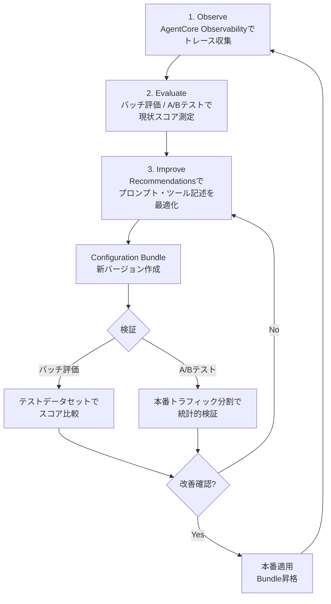
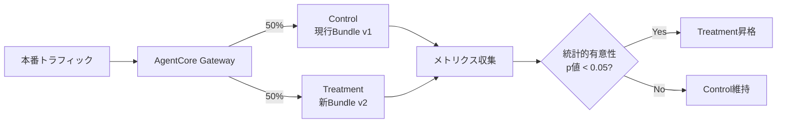

本記事は [Introducing the agent performance loop: AgentCore Optimization now in preview](https://aws.amazon.com/blogs/machine-learning/introducing-the-agent-performance-loop-agentcore-optimization-now-in-preview/) の解説記事です。

## ブログ概要（Summary）

AWSは2026年4月30日、Amazon Bedrock AgentCore Optimizationのプレビュー提供を発表した。この機能は、プロダクション環境で収集されたエージェントのトレースデータを分析し、システムプロンプトとツール記述（description）を自動最適化する「Recommendations」機能と、その最適化提案を検証する「バッチ評価」「A/Bテスト」の3つの機能で構成される。ブログでは、これらを組み合わせた**observe（観察）→ evaluate（評価）→ improve（改善）**のループにより、エージェントの品質を体系的に向上させる方法が解説されている。

この記事は [Zenn記事: Bedrock Managed Agents×GPT-5.5で経費精算フローのレイテンシを削減する](https://zenn.dev/0h_n0/articles/aa5a729de60491) の深掘りです。

## 情報源

- **種別**: 企業テックブログ（AWS Machine Learning Blog）
- **URL**: [https://aws.amazon.com/blogs/machine-learning/introducing-the-agent-performance-loop-agentcore-optimization-now-in-preview/](https://aws.amazon.com/blogs/machine-learning/introducing-the-agent-performance-loop-agentcore-optimization-now-in-preview/)
- **組織**: Amazon Web Services
- **発表日**: 2026年4月30日

## 技術的背景（Technical Background）

エージェントシステムのプロダクション運用では、品質改善のプロセスが手動に依存していることが課題であった。ブログでは従来のワークフローを以下のように記述している。

> ユーザーからのクレームが届き、開発者がトレースを読み、仮説を立て、プロンプトを書き直し、少数のケースをテストし、修正をデプロイする

この手動プロセスには以下の問題がある。

1. **スケーラビリティ**: トレースの量が増えると人手で分析しきれない
2. **再現性**: 修正が特定のケースに過剰適合し、他のケースでリグレッションを引き起こす
3. **統計的妥当性**: 少数のテストケースでは改善の有意性を検証できない

AgentCore Optimizationは、このプロセスを自動化し、統計的に検証された改善のみを本番に適用する仕組みを提供する。

## 実装アーキテクチャ（Architecture）

### 3ステップの品質改善ループ

AgentCore Optimizationは、以下の3ステップで構成される品質改善ループを実装している。



### コンポーネント詳細

#### 1. Recommendations（改善提案）

Recommendations APIは、AgentCore Observabilityが収集したプロダクショントレースをCloudWatch Logグループから読み取り、設定改善を提案する。ブログによると、指定が必要なパラメータは以下の2つである。

- **Reward Signal（報酬信号）**: 組み込み評価器またはカスタム評価器。何を最適化するかを定義する
- **Optimization Target（最適化対象）**: システムプロンプトまたはツール記述

ブログでは、この仕組みについて「サービスが提案し、何を次の検証ステップに進めるかはユーザーが決定する」と記載されている。すべてのRecommendationは承認なしに本番適用されることはない。

#### 2. バッチ評価（Batch Evaluation）

バッチ評価は、事前定義されたテストデータセットに対してRecommendationを検証する機能である。

- **入力**: テストシナリオ群（入出力ペア）
- **処理**: 新旧のConfiguration Bundleで同じシナリオを実行し、スコアを比較
- **出力**: 集計スコア（基準値との差分）
- **用途**: CI/CDパイプラインへの統合が推奨されている

#### 3. A/Bテスト（Live Traffic Split）

AgentCore Gatewayが本番トラフィックを制御群（control）と処理群（treatment）に分割する。



ブログによると、A/Bテストには2つのパターンがある。

| パターン | 変更内容 | 構成 |
|---------|---------|------|
| Configuration-only | プロンプト/モデルID/ツール記述 | 同一Runtime、異なるBundle |
| Code changes | ツール実装の変更 | 異なるRuntimeエンドポイント |

テスト結果には**信頼区間**と**p値**が含まれ、改善が統計的に有意かどうかを定量的に判断できる。

### Configuration Bundle

Configuration Bundleは、エージェントの設定を不変のバージョン管理単位にパッケージングする仕組みである。ブログによると、各Bundleには以下が含まれる。

- **モデルID**: 使用するFoundation Model
- **システムプロンプト**: エージェントの指示
- **ツール記述**: 各ツールのdescriptionとパラメータ定義

エージェントは実行時にAgentCore SDKを通じてアクティブなConfiguration Bundleを動的に読み取る。これにより、**コードの再デプロイなしにプロンプトやモデルを切り替えられる**。

### 評価指標

ブログで言及されている組み込み評価器のスコアリング次元は以下の通りである。

| 評価次元 | 説明 |
|---------|------|
| Goal Success Rate | タスク完了率 |
| Tool Selection Accuracy | 適切なツールが選択された割合 |
| Helpfulness | 応答の有用性 |
| Safety | 安全性基準への適合 |

カスタム評価器として、Ground-Truth比較やLLM-as-Judgeによるスコアリングもサポートされている。

## レイテンシへの影響

### ツール記述最適化によるレイテンシ削減

AgentCore Optimizationは直接的なレイテンシ削減機能ではないが、ツール記述の最適化を通じて間接的にレイテンシを改善する。Zenn記事で解説されている通り、ツール記述が曖昧だとモデルはツール選択のために追加の推論トークンを消費する。

**最適化前のツール記述（ブログ内の例に準拠）**:

```json
{
  "name": "check_policy",
  "description": "ポリシーをチェックする"
}
```

**最適化後のツール記述（Recommendationの適用例）**:

```json
{
  "name": "check_policy",
  "description": "経費申請の金額とカテゴリを社内ポリシーと照合し、承認可否を判定する。金額が50,000円以上またはカテゴリが交際費の場合は追加承認が必要。冪等: 同一パラメータで複数回呼び出しても結果は同一。副作用: なし（読み取り専用）。",
  "parameters": {
    "type": "object",
    "properties": {
      "amount": {
        "type": "number",
        "description": "経費金額（日本円）。0より大きい値。"
      },
      "category": {
        "type": "string",
        "enum": ["交通費", "宿泊費", "交際費", "消耗品", "その他"]
      }
    },
    "required": ["amount", "category"]
  }
}
```

精緻なツール記述により、モデルが少ない推論トークンでツール選択を完了できる。これは特に`reasoning.effort=low`で運用するステップ（OCRパース、承認ルーティング）での効果が大きい。

### 改善の定量化

ブログでは具体的なレイテンシ改善数値は報告されていないが、以下の定性的な効果が述べられている。

- ツール選択精度の向上 → 不要なリトライや誤ったツール呼び出しの削減
- システムプロンプトの簡潔化 → 入力トークン数の削減 → TTFT改善
- `enum`制約の追加 → モデルのパラメータ生成の高速化

## 運用での学び（Production Lessons）

### 実践的なワークフロー例

ブログでは「Market Trends Agent」を例に、改善ループの実践的な流れが示されている。

1. **Observe**: AgentCore Observabilityでトレースを収集（最低100セッション以上が推奨）
2. **Generate Recommendation**: パーソナライゼーションの失敗を特定するRecommendationを生成
3. **Package**: 新しいConfiguration Bundle（v2）を作成
4. **Batch Evaluation**: ブローカー会話のテストデータセットでスコアを比較
5. **A/B Test**: 本番セッションで統計的に検証
6. **Promote**: 有意な改善が確認されたらv2を本番に昇格

### トレースデータの最低要件

ブログによると、Recommendationsの品質はトレースデータの量に依存する。ブログの表現では「100セッション以上のトレースを蓄積してから実行する」ことが推奨されている。

### 将来のロードマップ

ブログでは、AgentCore Optimizationの将来ビジョンとして以下が言及されている。

- 複数評価器を考慮したRecommendation（トレードオフの可視化）
- ツール実装（スキル）の最適化
- プロダクション障害パターンのクラスタリング
- アラームトリガーによるRecommendation自動生成（ヒューマンレビューゲート付き）

## 学術研究との関連（Academic Connection）

AgentCore Optimizationの設計思想は、以下の学術的アプローチと関連している。

- **DSPy**（Khattab et al., Stanford, 2023）: プロンプトとパイプラインを自動最適化するフレームワーク。AgentCoreのRecommendationsは、DSPyの「コンパイル」概念をマネージドサービスとして提供するものと位置づけられる
- **TextGrad**（Yuksekgonul et al., 2024）: テキストフィードバックを勾配として扱い、プロンプトを最適化する手法。Recommendationsのトレース分析に類似するアプローチ
- **ToolBench**（Qin et al., 2023）: ツール利用ベンチマーク。AgentCoreの「Tool Selection Accuracy」評価器の学術的背景

## Production Deployment Guide

### AWS実装パターン（コスト最適化重視）

AgentCore Optimizationを活用するには、AgentCore Runtime + Observability + Evaluationsの3つのサービスが前提となる。以下はこれらを含むプロダクション構成の概算コストである。コスト試算は2026年5月時点のAWS料金に基づく概算値であり、実際のコストはトラフィックパターンにより変動する。

| 規模 | 月間リクエスト | 推奨構成 | 月額コスト | 主要サービス |
|------|--------------|---------|-----------|------------|
| **Small** | ~3,000 (100/日) | Serverless | $100-200 | Lambda + AgentCore + Bedrock |
| **Medium** | ~30,000 (1,000/日) | Hybrid | $500-1,200 | ECS Fargate + AgentCore + ElastiCache |
| **Large** | 300,000+ (10,000/日) | Container | $3,000-7,000 | EKS + AgentCore + Bedrock |

**コスト削減テクニック**:
- バッチ評価はCI/CDパイプラインでのみ実行（常時稼働不要）
- A/Bテストは短期間（1-2週間）の集中実行後に終了
- Observabilityのサンプリングレート調整でログコスト削減
- Configuration Bundleの切り替えはコード再デプロイ不要のため、デプロイコスト削減

**コスト試算の注意事項**: AgentCore Optimizationはプレビュー期間中の料金体系が正式に公開されていない場合がある。最新料金は[AWS料金ページ](https://aws.amazon.com/bedrock/pricing/)で確認のこと。

### Terraformインフラコード

**AgentCore + Observability基盤**:

```hcl
module "vpc" {
  source  = "terraform-aws-modules/vpc/aws"
  version = "~> 5.0"

  name = "agentcore-vpc"
  cidr = "10.0.0.0/16"
  azs  = ["us-east-1a", "us-east-1c"]
  private_subnets = ["10.0.1.0/24", "10.0.2.0/24"]

  enable_nat_gateway   = false
  enable_dns_hostnames = true
}

resource "aws_iam_role" "agentcore_role" {
  name = "agentcore-optimization-role"

  assume_role_policy = jsonencode({
    Version = "2012-10-17"
    Statement = [{
      Action    = "sts:AssumeRole"
      Effect    = "Allow"
      Principal = { Service = "bedrock.amazonaws.com" }
    }]
  })
}

resource "aws_iam_role_policy" "agentcore_policy" {
  role = aws_iam_role.agentcore_role.id

  policy = jsonencode({
    Version = "2012-10-17"
    Statement = [
      {
        Effect   = "Allow"
        Action   = [
          "bedrock:InvokeModel",
          "bedrock:InvokeModelWithResponseStream",
          "bedrock-agentcore:*"
        ]
        Resource = "*"
      },
      {
        Effect   = "Allow"
        Action   = ["logs:CreateLogGroup", "logs:CreateLogStream", "logs:PutLogEvents"]
        Resource = "arn:aws:logs:*:*:*"
      }
    ]
  })
}

resource "aws_cloudwatch_log_group" "agentcore_traces" {
  name              = "/agentcore/traces"
  retention_in_days = 90
}

resource "aws_budgets_budget" "agentcore_monthly" {
  name         = "agentcore-monthly-budget"
  budget_type  = "COST"
  limit_amount = "1200"
  limit_unit   = "USD"
  time_unit    = "MONTHLY"

  notification {
    comparison_operator        = "GREATER_THAN"
    threshold                  = 80
    threshold_type             = "PERCENTAGE"
    notification_type          = "ACTUAL"
    subscriber_email_addresses = ["ops@example.com"]
  }
}
```

### セキュリティベストプラクティス

- **IAMロール**: AgentCore APIアクセスは最小権限で設定。Recommendations APIとEvaluation APIの権限は別ロールに分離推奨
- **Configuration Bundle**: 不変（immutable）であるため改ざんリスクが低い。バージョン管理で変更履歴を追跡可能
- **トレースデータ**: CloudWatch Logsに保存されるトレースにPII（個人識別情報）が含まれないよう、エージェントの入出力にマスキング処理を適用
- **A/Bテスト**: 本番トラフィックを使用するため、Treatment群でのエラー率が閾値を超えた場合に自動ロールバックする仕組みを設計

### 運用・監視設定

**バッチ評価結果の監視**:

```python
import boto3

cloudwatch = boto3.client("cloudwatch")

cloudwatch.put_metric_alarm(
    AlarmName="agentcore-goal-success-regression",
    ComparisonOperator="LessThanThreshold",
    EvaluationPeriods=1,
    MetricName="GoalSuccessRate",
    Namespace="AgentCore/Evaluation",
    Period=86400,
    Statistic="Average",
    Threshold=0.85,
    AlarmActions=["arn:aws:sns:us-east-1:123456789:agent-alerts"],
    AlarmDescription="エージェントのGoal Success Rateが85%を下回った",
)
```

### コスト最適化チェックリスト

**アーキテクチャ選択**:
- [ ] ~100 req/日 → Lambda + AgentCore - $100-200/月
- [ ] ~1,000 req/日 → ECS + AgentCore - $500-1,200/月
- [ ] 10,000+ req/日 → EKS + AgentCore - $3,000-7,000/月

**Optimization運用コスト削減**:
- [ ] バッチ評価はCI/CDパイプライン実行時のみ（常時稼働不要）
- [ ] A/Bテストは2週間以内に完了（長期間のトラフィック分割を避ける）
- [ ] Observabilityサンプリングレート調整（全トレースを保存しない）
- [ ] CloudWatch Logsの保持期間を90日に制限

**評価品質向上**:
- [ ] テストデータセットを最低100ケース用意
- [ ] 複数評価次元（Goal Success + Safety）で並行評価
- [ ] Recommendation適用前にバッチ評価でリグレッションチェック
- [ ] A/Bテストは統計的有意性（p < 0.05）確認後にのみ昇格

**監視・アラート**:
- [ ] Goal Success Rate低下アラーム設定
- [ ] Tool Selection Accuracyのトレンド監視
- [ ] A/Bテストのエラー率監視（Treatment群）
- [ ] AWS Budgets設定（月額予算の80%でアラート）

**リソース管理**:
- [ ] 未使用Configuration Bundleの定期クリーンアップ
- [ ] トレースログのライフサイクル設定（90日保持→Glacier移行）
- [ ] タグ戦略: 環境別・エージェント別でコスト可視化
- [ ] 開発環境ではObservabilityをオフにしてコスト削減

## まとめと実践への示唆

AgentCore Optimizationは、エージェントの品質改善をobserve → evaluate → improveの自動ループで実現する仕組みである。Recommendationsによるプロンプト・ツール記述の自動最適化、バッチ評価によるリグレッション検知、A/Bテストによる統計的検証の3段階で、手動のプロンプトチューニングを体系的なプロセスに置き換える。ブログでは「トレースが評価を駆動し、評価がドリフトを検出し、Recommendationsがシグナルを具体的な変更に変換し、A/Bテストがそれが機能することを証明する」というフライホイールビジョンが示されている。2026年5月時点でプレビューであり、GA後の安定性検証が必要である。

## 参考文献

- **Blog URL**: [https://aws.amazon.com/blogs/machine-learning/introducing-the-agent-performance-loop-agentcore-optimization-now-in-preview/](https://aws.amazon.com/blogs/machine-learning/introducing-the-agent-performance-loop-agentcore-optimization-now-in-preview/)
- **AWS Docs**: [https://docs.aws.amazon.com/bedrock-agentcore/latest/devguide/optimization.html](https://docs.aws.amazon.com/bedrock-agentcore/latest/devguide/optimization.html)
- **Related Zenn article**: [https://zenn.dev/0h_n0/articles/aa5a729de60491](https://zenn.dev/0h_n0/articles/aa5a729de60491)
