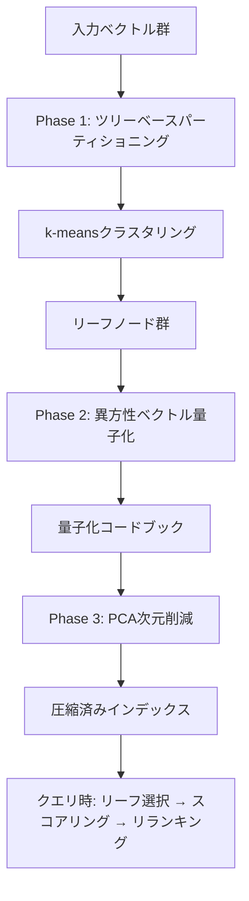

## ブログ概要（Summary）

本記事は [https://cloud.google.com/blog/products/databases/understanding-the-scann-index-in-alloydb](https://cloud.google.com/blog/products/databases/understanding-the-scann-index-in-alloydb) の解説記事です。

Google Cloudが公式ブログで解説しているAlloyDB ScaNNインデックスは、Google Researchが開発したScaNN（Scalable Nearest Neighbors）アルゴリズムをAlloyDB上でpgvector互換のインデックスとして統合したものである。HNSWのようなグラフベースのアプローチではなく、ツリー量子化ベースのアルゴリズムを採用しており、クエリ性能で最大4倍、インデックス構築で最大8倍、メモリフットプリントで3-4倍の優位性がGoogle Cloudの公式ブログで報告されている。本記事では、ScaNNの内部構造である異方性ベクトル量子化、ツリーベースパーティショニング、PCA次元削減の仕組みを数式とコードで解説し、AlloyDB上での実践的な利用方法を整理する。

この記事は [Zenn記事: クラウドDB内蔵ベクトル検索 vs 専用DB 2026：AlloyDB・Aurora・Cosmos DBの実力比較](https://zenn.dev/0h_n0/articles/352a770ffc528d) の深掘りです。

## 情報源

- **種別**: 企業テックブログ
- **URL**: [https://cloud.google.com/blog/products/databases/understanding-the-scann-index-in-alloydb](https://cloud.google.com/blog/products/databases/understanding-the-scann-index-in-alloydb)
- **組織**: Google Cloud / AlloyDB チーム（著者: Sandy Ghai, Group Product Manager）
- **発表日**: 2024年4月11日

## 技術的背景（Technical Background）

ベクトル検索はLLMベースのRAGパイプラインやレコメンデーションシステムの基盤技術であり、近似最近傍探索（ANN: Approximate Nearest Neighbor）の性能がシステム全体のレイテンシとコストを左右する。従来、PostgreSQLエコシステムではpgvectorのHNSW（Hierarchical Navigable Small World）インデックスが広く使われてきた。HNSWはグラフベースの手法で、高い再現率を実現できる一方、メモリ消費量が大きく、インデックス構築に時間がかかるという課題がある。

Google Researchは2020年のICML論文「Accelerating Large-Scale Inference with Anisotropic Vector Quantization」で、ScaNNアルゴリズムを発表した。ScaNNはツリーベースパーティショニングと異方性量子化を組み合わせたアプローチであり、HNSWとは根本的に異なる設計思想に基づいている。Google Cloudの公式ブログによると、このアルゴリズムをAlloyDBに統合することで、RDBMSのトランザクション管理やSQLインターフェースを維持したまま、専用ベクトルDBに匹敵する検索性能を実現している。

## 実装アーキテクチャ（Architecture）

### ScaNNアルゴリズムの全体構造

Google Cloudの公式ブログによると、ScaNNは以下の3段階のパイプラインで構成される。



**Phase 1: ツリーベースパーティショニング**

ベクトル空間をk-meansクラスタリングにより「リーフ」と呼ばれる部分空間に分割する。クエリ時には、クエリベクトルに最も近いリーフのみを探索することで、全数探索を回避する。Google Cloudの公式ブログによると、`num_leaves`パラメータはデータサイズの平方根が推奨値とされている。例えば100万ベクトルの場合、`num_leaves=1000`が目安となる。

**Phase 2: 異方性ベクトル量子化（Anisotropic Quantization）**

ScaNNの中核技術であり、量子化誤差の方向を考慮した圧縮を行う。詳細は後述の「技術的詳細」セクションで解説する。

**Phase 3: PCA次元削減**

高次元ベクトル（例: OpenAI text-embedding-3-largeの3072次元）を自動的にPCAで低次元に圧縮する。Google Cloudの公式ブログによると、AlloyDBはインデックス構築時にPCAを自動適用し、ユーザーが明示的に次元削減を設定する必要がない。

### AlloyDB統合アーキテクチャ

AlloyDB上でのScaNNインデックスは、pgvector互換のSQL構文で利用できる。

```sql
-- ScaNNインデックスの作成（コサイン類似度）
CREATE INDEX embedding_scann_idx
  ON documents
  USING scann (embedding cosine)
  WITH (
    num_leaves = 1000,
    quantizer = 'SQ8'
  );

-- L2距離でのインデックス作成
CREATE INDEX embedding_scann_l2_idx
  ON documents
  USING scann (embedding l2)
  WITH (
    num_leaves = 500,
    quantizer = 'SQ8'
  );
```

検索クエリはpgvectorの標準的な構文がそのまま使える。

```sql
-- Top-K近傍検索
SELECT id, content, embedding <=> $1 AS distance
FROM documents
ORDER BY embedding <=> $1
LIMIT 10;

-- ScaNN固有パラメータのチューニング
SET LOCAL scann.num_leaves_to_search = 50;
SET LOCAL scann.pre_reordering_num_neighbors = 100;

SELECT id, content, embedding <=> $1 AS distance
FROM documents
ORDER BY embedding <=> $1
LIMIT 10;
```

## 技術的詳細: 異方性ベクトル量子化

### 従来の量子化の問題点

標準的なベクトル量子化では、元のベクトル $\mathbf{x}$ を量子化ベクトル $\tilde{\mathbf{x}}$ で近似する際、等方性の（方向に依存しない）誤差最小化を行う。

$$
\min_{\tilde{\mathbf{x}}} \| \mathbf{x} - \tilde{\mathbf{x}} \|^2
$$

しかし、内積ベースの検索（$\langle \mathbf{q}, \mathbf{x} \rangle$ の最大化）では、量子化誤差の方向が重要になる。クエリベクトル $\mathbf{q}$ に平行な方向の誤差は内積推定値に大きく影響するが、直交する方向の誤差はほとんど影響しない。

### 異方性損失関数

Google Researchの原論文（Guo et al., ICML 2020）で提案された異方性量子化は、量子化誤差をクエリ方向に対する重み付きで評価する。具体的には、元のベクトル $\mathbf{x}$ と量子化ベクトル $\tilde{\mathbf{x}}$ の残差 $\mathbf{r} = \mathbf{x} - \tilde{\mathbf{x}}$ を、$\mathbf{x}$ に平行な成分 $\mathbf{r}_{\parallel}$ と直交する成分 $\mathbf{r}_{\perp}$ に分解する。

$$
\mathbf{r} = \mathbf{r}_{\parallel} + \mathbf{r}_{\perp}
$$

ここで、

$$
\mathbf{r}_{\parallel} = \frac{\langle \mathbf{r}, \mathbf{x} \rangle}{\| \mathbf{x} \|^2} \mathbf{x}, \quad \mathbf{r}_{\perp} = \mathbf{r} - \mathbf{r}_{\parallel}
$$

異方性量子化の損失関数は以下のように定義される。

$$
\mathcal{L}_{\text{aniso}}(\mathbf{x}, \tilde{\mathbf{x}}) = w_{\parallel} \| \mathbf{r}_{\parallel} \|^2 + w_{\perp} \| \mathbf{r}_{\perp} \|^2
$$

ここで、
- $w_{\parallel}$: 平行成分の重み（大きい値を設定）
- $w_{\perp}$: 直交成分の重み（小さい値を設定）
- $\mathbf{r}_{\parallel}$: 残差の $\mathbf{x}$ に平行な成分
- $\mathbf{r}_{\perp}$: 残差の $\mathbf{x}$ に直交する成分

$w_{\parallel} \gg w_{\perp}$ とすることで、内積の推定精度に寄与しない直交方向の誤差を許容しつつ、平行方向の精度を高く保つ。これが通常の等方性量子化と比較して、同じ圧縮率でより高い検索精度を実現する仕組みである。

### 重み付けの定式化

Google Researchの論文によると、重みは以下のように設定される。ベクトル $\mathbf{x}$ のノルムを $h = \|\mathbf{x}\|$ とし、閾値パラメータ $T$ を用いて、

$$
w_{\parallel}(h) = \begin{cases} h^2 & \text{if } h \geq T \\ T^2 & \text{if } h < T \end{cases}, \quad w_{\perp}(h) = \epsilon
$$

ここで $\epsilon$ は小さい正の定数、$T$ はデータセットのノルム分布に基づいて決定される。ノルムの大きいベクトルほど平行方向の重みが大きくなり、検索結果の上位に来やすいベクトルの量子化精度が優先される設計となっている。

### ScaNN量子化の擬似実装

以下はScaNNの異方性量子化の概念を示す擬似コードである。

```python
import numpy as np
from sklearn.cluster import KMeans


def anisotropic_quantize(
    vectors: np.ndarray,
    n_codebook: int = 256,
    w_parallel: float = 10.0,
    w_perp: float = 0.1,
) -> tuple[np.ndarray, np.ndarray]:
    """異方性ベクトル量子化を行う

    Args:
        vectors: 入力ベクトル群 (N, D)
        n_codebook: コードブックのサイズ
        w_parallel: 平行成分の重み
        w_perp: 直交成分の重み

    Returns:
        codes: 各ベクトルの量子化コード (N,)
        codebook: コードブック (n_codebook, D)
    """
    n, d = vectors.shape

    # 初期コードブック構築（k-means）
    kmeans = KMeans(n_clusters=n_codebook, random_state=42)
    codes = kmeans.fit_predict(vectors)
    codebook = kmeans.cluster_centers_.copy()

    # 異方性損失に基づくコードブック精緻化
    for iteration in range(10):
        for i in range(n_codebook):
            mask = codes == i
            if not mask.any():
                continue
            cluster_vecs = vectors[mask]  # (M, D)

            # 各ベクトルの残差を平行・直交成分に分解
            residuals = cluster_vecs - codebook[i]
            norms_sq = np.sum(cluster_vecs ** 2, axis=1, keepdims=True)
            norms_sq = np.maximum(norms_sq, 1e-10)

            proj_coeff = (
                np.sum(residuals * cluster_vecs, axis=1, keepdims=True)
                / norms_sq
            )
            r_parallel = proj_coeff * cluster_vecs
            r_perp = residuals - r_parallel

            # 重み付き重心更新
            weighted = (
                cluster_vecs
                + w_parallel * r_parallel
                + w_perp * r_perp
            ) / (1 + w_parallel + w_perp)
            codebook[i] = weighted.mean(axis=0)

        # 再割り当て
        dists = np.linalg.norm(
            vectors[:, None, :] - codebook[None, :, :], axis=2
        )
        codes = dists.argmin(axis=1)

    return codes, codebook
```

## パフォーマンス分析

### HNSW比較ベンチマーク

Google Cloudの公式ブログで報告されているScaNNとpgvector HNSWの比較結果を以下に整理する。

| メトリクス | ScaNN | pgvector HNSW | ScaNNの優位性 |
|-----------|-------|---------------|-------------|
| クエリ性能 | 基準 | 基準の1/4 | 最大4倍高速 |
| インデックス構築 | 基準 | 基準の1/8 | 最大8倍高速 |
| メモリフットプリント | 基準 | 基準の3-4倍 | 3-4倍小さい |
| 書き込みスループット | 基準 | 基準の1/10 | 10倍高い |

Google Cloudの公式ブログによると、これらの数値はAlloyDB上での計測結果であり、ScaNNのツリー量子化アプローチがHNSWのグラフベースアプローチに対して、特にメモリ効率と書き込み性能で大きな差を見せていると報告されている。

### BigANN-1Bベンチマーク

10億ベクトル規模のBigANN-1Bベンチマーク（128次元）における結果がGoogle Cloudの別の性能ブログで報告されている。

| メトリクス | AlloyDB ScaNN | pgvector HNSW |
|-----------|--------------|---------------|
| クエリレイテンシ | 431ms | 4,000ms以上 |
| メモリ使用量 | 1x（基準） | 4x |
| インデックス構築コスト | 基準 | 最大60倍 |

10億ベクトルで431msというレイテンシは、RDBMSに統合されたベクトル検索としては注目に値する数値である。HNSWが4,000ms以上を要するのに対し、約9.3倍の高速化が報告されている。メモリ使用量の差も顕著で、HNSWはグラフ構造の維持に多くのメモリを消費するのに対し、ScaNNの量子化ベースのアプローチはコンパクトな表現を実現している。

### SOAR拡張

Google Research（2023年）が発表したSOAR（Spilling with Orthogonality-Amplified Residuals）は、ScaNNの拡張手法である。ツリーベースパーティショニングでは、パーティション境界付近のベクトルが誤ったリーフに割り当てられるバウンダリ問題がある。SOARはこの問題に対処するため、境界付近のベクトルを複数のリーフに「スピル」させる手法を導入している。Google Cloudの公式ブログによると、SOARによりベースScaNNと比較して0.95再現率で20-40%のQPS向上が報告されている。

## AlloyDB ScaNNの実践的利用

### インデックスパラメータのチューニング

Google Cloudの公式ブログで説明されている主要なパラメータを以下に整理する。

| パラメータ | 説明 | 推奨値 |
|-----------|------|--------|
| `num_leaves` | パーティション数 | $\sqrt{N}$（$N$はベクトル数） |
| `quantizer` | 量子化方式 | `'SQ8'`（8bit scalar） |
| `num_leaves_to_search` | 検索時の探索リーフ数 | `num_leaves`の1-10% |
| `pre_reordering_num_neighbors` | リランキング候補数 | 最終取得数の2-10倍 |

**Recall vs Latencyのトレードオフ**: `num_leaves_to_search` を増やすと再現率は向上するがレイテンシが増加する。`pre_reordering_num_neighbors` は量子化スコアで粗く絞った候補を、元ベクトルで再スコアリングする際の候補数を制御する。

### Pythonクライアントからの利用例

```python
import asyncpg
import numpy as np
from dataclasses import dataclass


@dataclass
class SearchResult:
    """ベクトル検索結果"""
    id: int
    content: str
    distance: float


async def create_scann_index(
    conn: asyncpg.Connection,
    table_name: str,
    column_name: str,
    num_leaves: int,
    quantizer: str = "SQ8",
    metric: str = "cosine",
) -> None:
    """AlloyDB ScaNNインデックスを作成する

    Args:
        conn: AlloyDBへの接続
        table_name: テーブル名
        column_name: ベクトルカラム名
        num_leaves: パーティション数（sqrt(N)推奨）
        quantizer: 量子化方式（SQ8推奨）
        metric: 距離メトリクス（cosine, l2, dot_product）
    """
    index_name = f"{table_name}_{column_name}_scann_idx"
    query = f"""
        CREATE INDEX IF NOT EXISTS {index_name}
        ON {table_name}
        USING scann ({column_name} {metric})
        WITH (num_leaves = {num_leaves}, quantizer = '{quantizer}')
    """
    await conn.execute(query)


async def search_similar(
    conn: asyncpg.Connection,
    query_embedding: np.ndarray,
    table_name: str,
    top_k: int = 10,
    num_leaves_to_search: int = 50,
    pre_reordering_num_neighbors: int = 100,
) -> list[SearchResult]:
    """ScaNNインデックスを使った類似ベクトル検索

    Args:
        conn: AlloyDBへの接続
        query_embedding: クエリベクトル (D,)
        table_name: テーブル名
        top_k: 返却件数
        num_leaves_to_search: 探索リーフ数
        pre_reordering_num_neighbors: リランキング候補数

    Returns:
        類似度順のSearchResultリスト
    """
    embedding_str = "[" + ",".join(str(v) for v in query_embedding) + "]"

    await conn.execute(
        f"SET LOCAL scann.num_leaves_to_search = {num_leaves_to_search}"
    )
    await conn.execute(
        f"SET LOCAL scann.pre_reordering_num_neighbors = "
        f"{pre_reordering_num_neighbors}"
    )

    rows = await conn.fetch(
        f"""
        SELECT id, content, embedding <=> $1::vector AS distance
        FROM {table_name}
        ORDER BY embedding <=> $1::vector
        LIMIT $2
        """,
        embedding_str,
        top_k,
    )

    return [
        SearchResult(id=row["id"], content=row["content"], distance=row["distance"])
        for row in rows
    ]


async def adaptive_search(
    conn: asyncpg.Connection,
    query_embedding: np.ndarray,
    table_name: str,
    filter_column: str,
    filter_value: str,
    top_k: int = 10,
) -> list[SearchResult]:
    """Adaptive Filteringを活用したフィルタ付き検索

    AlloyDBはフィルタの選択度をクエリ時に学習し、
    実行プランを動的に変更する（pre-filter / post-filter自動選択）

    Args:
        conn: AlloyDBへの接続
        query_embedding: クエリベクトル (D,)
        table_name: テーブル名
        filter_column: フィルタ対象カラム
        filter_value: フィルタ値
        top_k: 返却件数

    Returns:
        フィルタ後の類似度順SearchResultリスト
    """
    embedding_str = "[" + ",".join(str(v) for v in query_embedding) + "]"

    rows = await conn.fetch(
        f"""
        SELECT id, content, embedding <=> $1::vector AS distance
        FROM {table_name}
        WHERE {filter_column} = $2
        ORDER BY embedding <=> $1::vector
        LIMIT $3
        """,
        embedding_str,
        filter_value,
        top_k,
    )

    return [
        SearchResult(id=row["id"], content=row["content"], distance=row["distance"])
        for row in rows
    ]
```

### Auto Vector Index

Google Cloudの公式ブログによると、AlloyDBには「Auto Vector Index」機能があり、テーブルのベクトルカラムに対して最適なインデックス設定を自動選択する。ユーザーが`num_leaves`や`quantizer`を手動で決定する必要がなく、データ分布に基づいてAlloyDBが自動的にパラメータを調整する。

```sql
-- Auto Vector Indexの利用（AlloyDB Omniでも利用可能）
-- AlloyDBが自動的に最適なScaNN設定を選択
ALTER TABLE documents
  ALTER COLUMN embedding SET STORAGE EXTENDED;

-- auto_vector_indexフラグが有効化されている場合、
-- ベクトルカラムへの書き込みに応じて自動でインデックスが構築・更新される
```

### インクリメンタル管理

ScaNNインデックスは静的なものではなく、データの追加・削除に応じて動的に更新される。Google Cloudの公式ブログによると、以下の自動管理機能が組み込まれている。

- **セントロイド自動更新**: データ分布の変化に応じてk-meansセントロイドが再計算される
- **アウトライアパーティション自動分割**: サイズが偏ったパーティションは自動的に分割される
- **バックグラウンドリバランシング**: 書き込みワークロード中もインデックスの品質を維持する

## 運用での学び（Production Lessons）

### HNSWからScaNNへの移行判断

Google Cloudの公式ブログの情報を踏まえると、以下のようなケースでScaNNが特に有効と考えられる。

**ScaNNが適するケース**:
- 大規模データ（100万ベクトル以上）でメモリコストが課題
- 書き込み頻度が高いワークロード（リアルタイム更新が必要なRAG等）
- インデックス再構築のダウンタイムを最小化したい場合
- AlloyDBを既に利用している環境

**HNSWが依然有効なケース**:
- 小規模データ（10万ベクトル以下）でメモリが問題にならない場合
- PostgreSQL互換環境（Aurora, Cloud SQL等）でpgvectorを使いたい場合
- AlloyDB以外のマネージドDBを使用している場合

### モニタリング指標

ScaNNインデックスの運用では、以下の指標を監視する。

```sql
-- インデックスサイズの確認
SELECT pg_size_pretty(pg_relation_size('embedding_scann_idx'))
  AS index_size;

-- テーブルの行数とインデックスのリーフ数の比率確認
SELECT reltuples::bigint AS row_count
FROM pg_class
WHERE relname = 'documents';
```

**再現率の定期検証**: 本番環境では定期的にexact searchとScaNN searchの結果を比較し、再現率の劣化を検知する仕組みが望ましい。

## Production Deployment Guide

### AlloyDB + ScaNN構成（GCP/AWSハイブリッド）

AlloyDBはGCPのマネージドサービスであるため、GCPを中心としつつAWSとのハイブリッド構成も示す。

**トラフィック量別の推奨構成**:

| 規模 | 構成 | AlloyDBインスタンス | 月額コスト概算 |
|------|------|-------------------|-------------|
| Small (~100 req/日) | AlloyDB Basic + Cloud Run | 2 vCPU / 16GB | $200-400 |
| Medium (~1,000 req/日) | AlloyDB Standard + GKE Autopilot | 4 vCPU / 32GB | $800-1,500 |
| Large (10,000+ req/日) | AlloyDB Enterprise + GKE + Read Replicas | 16 vCPU / 128GB | $3,000-6,000 |

**Small構成の詳細**:
- AlloyDB Basic: 2 vCPU / 16GB RAM（~$180/月）
- Cloud Run: アプリケーションサーバー（~$20-50/月、リクエスト課金）
- Cloud Storage: エンベディング前処理バッチ用（~$5/月）
- 合計: $200-400/月

**Large構成の詳細**:
- AlloyDB Enterprise: 16 vCPU / 128GB RAM + Read Replica 2台（~$2,500/月）
- GKE Standard: 3ノード（e2-standard-4）+ Spot Nodepool（~$300-500/月）
- Memorystore (Redis): クエリキャッシュ（~$100/月）
- Cloud CDN + Load Balancer: トラフィック分散（~$100/月）
- 合計: $3,000-6,000/月

**コスト削減テクニック**:
- AlloyDB Committed Use Discount: 1年コミットで最大52%削減
- GKE Spot Pods: バッチ処理に活用で最大91%削減
- Read Replicaによる読み取り分散: プライマリのスケールアップ回避
- AlloyDB Omni（セルフマネージド版）: 小規模環境ではGKE上に自前デプロイで$50-100/月に抑制可能

**コスト試算の注意事項**:
- 上記は2026年5月時点のGCP東京リージョン（asia-northeast1）料金に基づく概算値
- 実際のコストはトラフィックパターン、ストレージ使用量、ネットワーク転送量により変動
- 最新料金はGCP料金計算ツール（https://cloud.google.com/products/calculator）で確認を推奨

### Terraformインフラコード

**Small構成（AlloyDB + Cloud Run）**:

```hcl
# AlloyDB + Cloud Run構成
# 2026-05時点のGCP東京リージョン料金基準

terraform {
  required_providers {
    google = {
      source  = "hashicorp/google"
      version = "~> 5.30"
    }
  }
}

# VPCネットワーク（AlloyDBはVPC内配置が必須）
resource "google_compute_network" "main" {
  name                    = "alloydb-vpc"
  auto_create_subnetworks = false
}

resource "google_compute_subnetwork" "alloydb" {
  name          = "alloydb-subnet"
  ip_cidr_range = "10.0.0.0/24"
  region        = "asia-northeast1"
  network       = google_compute_network.main.id

  private_ip_google_access = true  # GCPサービスへのプライベートアクセス
}

# AlloyDB用のプライベートサービス接続
resource "google_compute_global_address" "alloydb_range" {
  name          = "alloydb-ip-range"
  purpose       = "VPC_PEERING"
  address_type  = "INTERNAL"
  prefix_length = 16
  network       = google_compute_network.main.id
}

resource "google_service_networking_connection" "alloydb" {
  network                 = google_compute_network.main.id
  service                 = "servicenetworking.googleapis.com"
  reserved_peering_ranges = [google_compute_global_address.alloydb_range.name]
}

# AlloyDBクラスタ
resource "google_alloydb_cluster" "main" {
  cluster_id = "vector-search-cluster"
  location   = "asia-northeast1"
  network_config {
    network = google_compute_network.main.id
  }

  # 自動バックアップ設定
  automated_backup_policy {
    enabled = true
    backup_window = "02:00"  # JST 11:00
    quantity_based_retention {
      count = 7
    }
  }

  depends_on = [google_service_networking_connection.alloydb]
}

# AlloyDBプライマリインスタンス（Small: 2 vCPU / 16GB）
resource "google_alloydb_instance" "primary" {
  cluster       = google_alloydb_cluster.main.name
  instance_id   = "primary"
  instance_type = "PRIMARY"

  machine_config {
    cpu_count = 2  # コスト最適化: Small構成
  }

  database_flags = {
    "google_columnar_engine.enabled"   = "on"   # 分析クエリ高速化
    "alloydb.enable_auto_vector_index" = "on"   # ScaNN自動インデックス
  }
}

# Cloud RunサービスのIAM（最小権限）
resource "google_service_account" "cloud_run" {
  account_id   = "vector-search-api"
  display_name = "Vector Search API Service Account"
}

resource "google_project_iam_member" "alloydb_client" {
  project = var.project_id
  role    = "roles/alloydb.client"
  member  = "serviceAccount:${google_service_account.cloud_run.email}"
}
```

**Large構成（AlloyDB Enterprise + GKE）**:

```hcl
# AlloyDB Enterprise + GKE構成
# 10,000+ req/日向け

# AlloyDB Enterpriseクラスタ（Read Replica付き）
resource "google_alloydb_cluster" "enterprise" {
  cluster_id = "vector-search-enterprise"
  location   = "asia-northeast1"
  network_config {
    network = google_compute_network.main.id
  }

  continuous_backup_config {
    enabled              = true
    recovery_window_days = 14
  }

  depends_on = [google_service_networking_connection.alloydb]
}

resource "google_alloydb_instance" "enterprise_primary" {
  cluster       = google_alloydb_cluster.enterprise.name
  instance_id   = "enterprise-primary"
  instance_type = "PRIMARY"

  machine_config {
    cpu_count = 16  # Large構成: 書き込み用
  }

  database_flags = {
    "alloydb.enable_auto_vector_index" = "on"
  }
}

# Read Replica（読み取りスケーリング）
resource "google_alloydb_instance" "read_replica" {
  count         = 2  # 2台のRead Replicaで読み取り分散
  cluster       = google_alloydb_cluster.enterprise.name
  instance_id   = "read-replica-${count.index}"
  instance_type = "READ_POOL"

  machine_config {
    cpu_count = 8
  }

  read_pool_config {
    node_count = 1
  }
}

# GKE Standardクラスタ
resource "google_container_cluster" "main" {
  name     = "vector-search-gke"
  location = "asia-northeast1"

  # Autopilotではなく、Spotノードプール制御のためStandard
  initial_node_count       = 1
  remove_default_node_pool = true

  workload_identity_config {
    workload_pool = "${var.project_id}.svc.id.goog"
  }
}

# Spotノードプール（バッチ処理・インデックス構築用）
resource "google_container_node_pool" "spot" {
  name     = "spot-pool"
  cluster  = google_container_cluster.main.name
  location = "asia-northeast1"

  autoscaling {
    min_node_count = 0
    max_node_count = 10
  }

  node_config {
    machine_type = "e2-standard-4"
    spot         = true  # Spot VMで最大91%コスト削減

    workload_metadata_config {
      mode = "GKE_METADATA"
    }
  }
}
```

### 運用・監視設定

**Cloud Monitoringアラート（検索レイテンシ監視）**:

```python
from google.cloud import monitoring_v3
from google.protobuf import duration_pb2


def create_latency_alert(
    project_id: str,
    notification_channel_id: str,
    threshold_ms: float = 500.0,
) -> monitoring_v3.AlertPolicy:
    """ScaNN検索レイテンシのアラートポリシーを作成する

    Args:
        project_id: GCPプロジェクトID
        notification_channel_id: 通知チャネルID
        threshold_ms: レイテンシ閾値（ミリ秒）

    Returns:
        作成されたアラートポリシー
    """
    client = monitoring_v3.AlertPolicyServiceClient()

    policy = monitoring_v3.AlertPolicy(
        display_name="AlloyDB ScaNN Query Latency Alert",
        conditions=[
            monitoring_v3.AlertPolicy.Condition(
                display_name="P95 latency exceeds threshold",
                condition_threshold=monitoring_v3.AlertPolicy.Condition.MetricThreshold(
                    filter=(
                        'resource.type="alloydb.googleapis.com/Instance" '
                        'AND metric.type="alloydb.googleapis.com/database/'
                        'postgresql/query_latencies"'
                    ),
                    comparison=monitoring_v3.ComparisonType.COMPARISON_GT,
                    threshold_value=threshold_ms,
                    duration=duration_pb2.Duration(seconds=300),
                    aggregations=[
                        monitoring_v3.Aggregation(
                            alignment_period=duration_pb2.Duration(seconds=60),
                            per_series_aligner=(
                                monitoring_v3.Aggregation.Aligner.ALIGN_PERCENTILE_95
                            ),
                        )
                    ],
                ),
            )
        ],
        notification_channels=[
            f"projects/{project_id}/notificationChannels/{notification_channel_id}"
        ],
        alert_strategy=monitoring_v3.AlertPolicy.AlertStrategy(
            auto_close=duration_pb2.Duration(seconds=1800),
        ),
    )

    return client.create_alert_policy(
        request={"name": f"projects/{project_id}", "alert_policy": policy}
    )
```

**Cloud SQLインサイトによるクエリ分析**:

```sql
-- AlloyDB Query Insights: ScaNNインデックス利用状況の確認
-- pg_stat_user_indexesでインデックスのスキャン回数を確認
SELECT
    schemaname,
    relname AS table_name,
    indexrelname AS index_name,
    idx_scan AS scan_count,
    pg_size_pretty(pg_relation_size(indexrelid)) AS index_size
FROM pg_stat_user_indexes
WHERE indexrelname LIKE '%scann%'
ORDER BY idx_scan DESC;

-- 実行プランでScaNNインデックスが使われているか確認
EXPLAIN (ANALYZE, BUFFERS, FORMAT JSON)
SELECT id, content, embedding <=> '[0.1, 0.2, ...]'::vector AS distance
FROM documents
ORDER BY embedding <=> '[0.1, 0.2, ...]'::vector
LIMIT 10;
```

**再現率モニタリングスクリプト**:

```python
import asyncpg
import numpy as np
from datetime import datetime


async def measure_recall(
    conn: asyncpg.Connection,
    sample_queries: list[np.ndarray],
    table_name: str,
    top_k: int = 10,
) -> dict[str, float]:
    """ScaNNインデックスの再現率を計測する

    Args:
        conn: AlloyDBへの接続
        sample_queries: サンプルクエリベクトル群
        table_name: テーブル名
        top_k: 取得件数

    Returns:
        recall@K, 平均レイテンシ等の辞書
    """
    recalls: list[float] = []

    for query in sample_queries:
        emb_str = "[" + ",".join(str(v) for v in query) + "]"

        # Exact search（インデックス無効化）
        exact_rows = await conn.fetch(
            f"""
            SET LOCAL enable_indexscan = off;
            SELECT id FROM {table_name}
            ORDER BY embedding <=> $1::vector
            LIMIT $2
            """,
            emb_str,
            top_k,
        )
        exact_ids = {row["id"] for row in exact_rows}

        # ScaNN search
        await conn.execute("SET LOCAL enable_indexscan = on")
        ann_rows = await conn.fetch(
            f"""
            SELECT id FROM {table_name}
            ORDER BY embedding <=> $1::vector
            LIMIT $2
            """,
            emb_str,
            top_k,
        )
        ann_ids = {row["id"] for row in ann_rows}

        recall = len(exact_ids & ann_ids) / len(exact_ids)
        recalls.append(recall)

    return {
        "recall_at_k": float(np.mean(recalls)),
        "recall_min": float(np.min(recalls)),
        "recall_max": float(np.max(recalls)),
        "measured_at": datetime.now().isoformat(),
        "sample_count": len(sample_queries),
    }
```

### コスト最適化チェックリスト

**アーキテクチャ選択**:
- [ ] トラフィック量に基づく構成選択（Small: Cloud Run / Medium: GKE Autopilot / Large: GKE Standard）
- [ ] AlloyDB Omni（セルフマネージド）とAlloyDB マネージドの比較検討

**リソース最適化**:
- [ ] AlloyDB Committed Use Discount（1年: 37%削減、3年: 52%削減）の検討
- [ ] GKE Spot Pods活用（バッチインデックス構築で最大91%削減）
- [ ] Read Replicaによる読み取り分散（プライマリのスケールアップ回避）
- [ ] AlloyDB Columnar Engine有効化（分析クエリの高速化）
- [ ] Cloud Run min-instances=0設定（アイドル時課金ゼロ）

**ScaNNインデックス最適化**:
- [ ] `num_leaves`を$\sqrt{N}$に設定（過大設定はビルド時間増、過小設定は精度低下）
- [ ] `quantizer='SQ8'`で8bit量子化（メモリ効率とのバランス）
- [ ] `num_leaves_to_search`の段階的チューニング（1%→5%→10%で再現率を確認）
- [ ] Auto Vector Index機能の活用（手動チューニング不要）

**監視・アラート**:
- [ ] Cloud Monitoringアラート設定（P95レイテンシ、CPU使用率）
- [ ] AlloyDB Query Insights有効化
- [ ] 再現率の定期計測（日次/週次）
- [ ] GCP Billing Budget設定（予算超過アラート）
- [ ] Cost Anomaly Detection有効化

**リソース管理**:
- [ ] 未使用インデックスの削除（pg_stat_user_indexesで確認）
- [ ] 開発環境の夜間シャットダウン（AlloyDBインスタンス停止）
- [ ] ログの保持期間設定（Cloud Logging: 30日→Coldline Storage）
- [ ] 古いバックアップの自動削除（retention policy設定）
- [ ] リソースタグ戦略（env, team, costcenter）

## 学術研究との関連（Academic Connection）

AlloyDB ScaNNの基盤となっているのは、以下の研究成果である。

- **Guo et al., ICML 2020**: "Accelerating Large-Scale Inference with Anisotropic Vector Quantization" --- ScaNNの原論文。異方性量子化のアイデアを提案し、グラフベース手法に匹敵する精度をツリー量子化ベースで実現した。
- **SOAR (2023)**: Spilling with Orthogonality-Amplified Residualsにより、パーティション境界問題を解決し、ScaNNの性能をさらに向上させた。
- **Johnson et al., 2019 (FAISS)**: Meta AIのFAISSライブラリはIVF（Inverted File Index）ベースの量子化を採用しており、ScaNNのツリーベースアプローチと設計思想は近い。ただし、異方性量子化はScaNN独自の貢献である。

AlloyDBチームの貢献は、これらの学術的成果をRDBMS内で運用可能な形に落とし込んだ点にある。SQL互換のインターフェース、トランザクション管理との統合、インクリメンタルなインデックス更新は、プロダクション運用に不可欠な要素である。

## まとめと実践への示唆

Google Cloudの公式ブログで解説されているAlloyDB ScaNNインデックスは、HNSWとは根本的に異なるツリー量子化ベースのアプローチにより、クエリ性能、メモリ効率、書き込みスループットのいずれにおいても優位性が報告されている。特に異方性ベクトル量子化は、内積検索に特化した誤差重み付けにより、同じ圧縮率でも高い検索精度を実現する仕組みである。

実務的には、pgvector HNSW環境からの移行コストが低い点（SQL構文互換）、Auto Vector Indexによるチューニング不要化、Adaptive Filteringによるフィルタ付き検索の自動最適化が、運用負荷の低減に寄与する。一方で、AlloyDBはGCPのマネージドサービスであり、マルチクラウド環境やオンプレミス環境では選択肢が限られる点に留意が必要である（AlloyDB Omniはセルフマネージド版として利用可能）。

ベクトル検索のインフラ選定においては、専用ベクトルDB（Pinecone, Weaviate等）とRDBMS統合型（AlloyDB ScaNN, Aurora pgvector等）のトレードオフをZenn記事で詳しく比較しているため、併せて参照されたい。

## 参考文献

- **Blog URL**: [https://cloud.google.com/blog/products/databases/understanding-the-scann-index-in-alloydb](https://cloud.google.com/blog/products/databases/understanding-the-scann-index-in-alloydb)
- **ScaNN原論文**: Guo et al., "Accelerating Large-Scale Inference with Anisotropic Vector Quantization," ICML 2020. [https://arxiv.org/abs/1908.10396](https://arxiv.org/abs/1908.10396)
- **ScaNN GitHub**: [https://github.com/google-research/google-research/tree/master/scann](https://github.com/google-research/google-research/tree/master/scann)
- **AlloyDB ドキュメント**: [https://cloud.google.com/alloydb/docs](https://cloud.google.com/alloydb/docs)
- **Related Zenn article**: [https://zenn.dev/0h_n0/articles/352a770ffc528d](https://zenn.dev/0h_n0/articles/352a770ffc528d)
