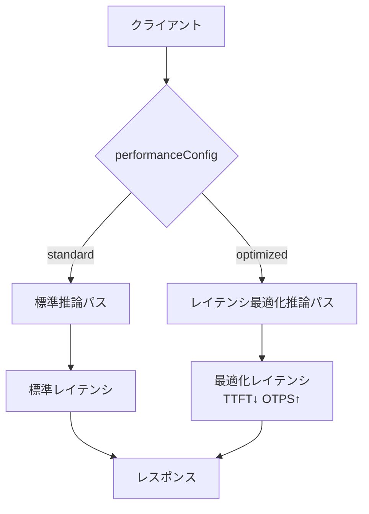

本記事は [Optimizing AI responsiveness: A practical guide to Amazon Bedrock latency-optimized inference](https://aws.amazon.com/blogs/machine-learning/optimizing-ai-responsiveness-a-practical-guide-to-amazon-bedrock-latency-optimized-inference/) の解説記事です。

## ブログ概要（Summary）

AWSが公式ブログで公開した「Amazon Bedrock latency-optimized inference」の実践ガイドでは、`performanceConfig`パラメータを使ったレイテンシ最適化推論の実装方法と、約1,600回のAPIコールに基づくベンチマーク結果が報告されている。Claude 3.5 HaikuではTTFT（Time to First Token）がP90で最大51.7%改善、OTPS（Output Tokens Per Second）がP90で最大125.5%改善されたとされる。本記事ではこのブログの技術的詳細を解説し、エージェントワークフローへの応用を考察する。

この記事は [Zenn記事: Bedrock Managed Agents×GPT-5.5で経費精算フローのレイテンシを削減する](https://zenn.dev/0h_n0/articles/aa5a729de60491) の深掘りです。

## 情報源

- **種別**: 企業テックブログ（AWS Machine Learning Blog）
- **URL**: [https://aws.amazon.com/blogs/machine-learning/optimizing-ai-responsiveness-a-practical-guide-to-amazon-bedrock-latency-optimized-inference/](https://aws.amazon.com/blogs/machine-learning/optimizing-ai-responsiveness-a-practical-guide-to-amazon-bedrock-latency-optimized-inference/)
- **組織**: Amazon Web Services
- **発表日**: 2024年12月（初版公開）、2025年3月（Nova Pro対応追加）

## 技術的背景（Technical Background）

LLMベースのアプリケーションでは、推論レイテンシがユーザー体験を大きく左右する。特にエージェントワークフローでは、モデル呼び出しが複数回連鎖するため、1回あたりのレイテンシが全体の応答時間に乗算的に影響する。

レイテンシは主に3つのフェーズに分解される。

1. **TTFT（Time to First Token）**: リクエスト送信から最初のトークン受信までの時間。入力長とネットワーク条件に依存する
2. **OTPS（Output Tokens Per Second）**: 最初のトークン以降の生成速度。モデルの複雑さとシステム負荷に依存する
3. **E2E（End-to-End Latency）**: リクエストからレスポンス完了までの総時間

$$
\text{E2E Latency} = \text{TTFT} + \frac{N_{\text{output}}}{\text{OTPS}}
$$

ここで、$N_{\text{output}}$は出力トークン数を表す。

エージェントが4ステップのツール呼び出しを行うワークフローでは、各ステップでTTFTとデコードレイテンシが発生するため、全体のレイテンシは概算で以下のようになる。

$$
\text{Total Latency} \approx \sum_{i=1}^{4} \left( \text{TTFT}_i + \frac{N_{\text{output},i}}{\text{OTPS}_i} \right) + \sum_{i=1}^{4} T_{\text{tool},i}
$$

$T_{\text{tool},i}$はツール実行時間を表す。各ステップのTTFTとOTPSを改善することで、全体のレイテンシを体系的に削減できる。

## 実装アーキテクチャ（Architecture）

### performanceConfig APIの仕組み

Amazon Bedrockのlatency-optimized inferenceは、`performanceConfig`パラメータをConverse APIまたはConverse Stream APIに渡すことで有効化される。このパラメータは`standard`（デフォルト）と`optimized`の2値を取る。



ブログで紹介されている実装例は以下の通りである。

```python
import boto3

bedrock_runtime = boto3.client("bedrock-runtime", region_name="us-east-2")

response = bedrock_runtime.converse(
    modelId="us.anthropic.claude-3-5-haiku-20241022-v1:0",
    messages=[{"role": "user", "content": [{"text": "Your prompt"}]}],
    performanceConfig={"latency": "optimized"},
)

response_stream = bedrock_runtime.converse_stream(
    modelId="us.anthropic.claude-3-5-haiku-20241022-v1:0",
    messages=[{"role": "user", "content": [{"text": "Your prompt"}]}],
    performanceConfig={"latency": "optimized"},
)
```

### 対応モデルとリージョン

ブログ公開時点で、レイテンシ最適化推論は以下のモデルで利用可能とされている。

| モデル | 利用可能リージョン |
|--------|------------------|
| Anthropic Claude 3.5 Haiku | US East (Ohio) |
| Meta Llama 3.1 70B | US East (Ohio) |
| Meta Llama 3.1 405B | US East (Ohio) |

クロスリージョン推論を使用する場合、クライアントはus-west-2などの別リージョンからus-east-2のモデルを呼び出す構成になる。

## パフォーマンス最適化（Performance）

### ベンチマーク方法論

AWSのブログでは、約1,600回のAPIコールに基づくオフライン実験の結果が報告されている。テスト条件は以下の通りである。

- **入力トークン数**: 100〜100,000トークン
- **出力トークン数**: 100〜1,000トークン
- **タスク種別**: シーケンスカウント、ストーリー生成、要約、翻訳
- **測定期間**: 複数日にわたる複数時間帯
- **ネットワーク構成**: us-west-2のクライアントからus-east-2のモデルへクロスリージョン呼び出し

### ベンチマーク結果

#### Claude 3.5 Haiku

ブログのTable 1より、Claude 3.5 Haikuの結果は以下の通りである。

| メトリクス | Optimized | Standard | 改善率 |
|-----------|-----------|----------|--------|
| TTFT P50 | 0.6s | 1.1s | -42.2% |
| TTFT P90 | 1.4s | 2.9s | -51.7% |
| OTPS P50 | 85.9 tok/s | 48.4 tok/s | +77.3% |
| OTPS P90 | 152.0 tok/s | 67.4 tok/s | +125.5% |

#### Llama 3.1 70B

ブログのTable 2より、Llama 3.1 70Bの結果は以下の通りである。

| メトリクス | Optimized | Standard | 改善率 |
|-----------|-----------|----------|--------|
| TTFT P50 | 0.4s | 0.9s | -51.7% |
| TTFT P90 | 1.2s | 42.8s | -97.1% |
| OTPS P50 | 137.0 tok/s | 30.2 tok/s | +353.8% |
| OTPS P90 | 203.7 tok/s | 32.4 tok/s | +529.3% |

Llama 3.1 70BのTTFT P90が42.8sから1.2sへ97.1%改善されている点は注目に値する。ブログでは、Standard構成でのP90値が外れ値的に大きい（おそらくコールドスタートやキューイング遅延）ためと推察される旨が記載されている。

### レイテンシ改善の理論的背景

LLM推論のレイテンシは、大きく**Prefill phase**と**Decode phase**に分けられる。

$$
\text{TTFT} = T_{\text{network}} + T_{\text{prefill}}(N_{\text{input}})
$$

$$
T_{\text{prefill}} \propto N_{\text{input}} \times d_{\text{model}}
$$

ここで、$N_{\text{input}}$は入力トークン数、$d_{\text{model}}$はモデル次元数を表す。Prefill phaseでは入力トークン全体を一度に処理するため、入力が長いほどTTFTが増加する。

Decode phaseでは自己回帰的に1トークンずつ生成するため、OTPSはメモリ帯域幅とKVキャッシュ管理に制約される。

$$
\text{OTPS} \propto \frac{\text{Memory Bandwidth}}{2 \times n_{\text{layers}} \times d_{\text{model}} \times N_{\text{kv}}}
$$

$N_{\text{kv}}$はKVキャッシュに保持されているトークン数を表す。レイテンシ最適化推論は、このPrefillとDecodeの両フェーズにおいてインフラレベルの最適化（計算配置の改善、メモリ管理の効率化など）を適用する仕組みと考えられる。

## 運用での学び（Production Lessons）

### ストリーミングとの組み合わせ

ブログでは、ストリーミングレスポンスが「体感パフォーマンスを改善する最も効果的な方法の1つ」と述べられている。`performanceConfig`のOTPS改善とストリーミングを組み合わせることで、ユーザーが最初のトークンを受け取るまでの待ち時間（TTFT）と、その後のトークン表示速度（OTPS）の両方を改善できる。

### プロンプトエンジニアリングとの相乗効果

ブログでは、APIレベルの最適化に加えて以下のプロンプト最適化を推奨している。

- **入力の簡潔化**: プロンプトを短く保ち、不要なコンテキストを除去する
- **タスク分割**: 複雑なタスクを小さなリクエストに分割する
- **出力制約**: 期待する応答長をプロンプト内で明示する

### 補完的なプレビュー機能

ブログ公開時点で、以下の機能がプレビューとして利用可能であると記載されている。

- **Prompt Caching**: 繰り返しのプレフィックス部分をキャッシュして再利用
- **Intelligent Prompt Routing**: リクエスト特性に応じたモデル/エンドポイント選択

これらをperformanceConfigと組み合わせることで、さらなるレイテンシ削減が期待される。

## エージェントワークフローへの応用

### マルチステップワークフローでの複合効果

Zenn記事で解説されている経費精算フロー（OCR→ポリシー判定→承認ルーティング→ERP登録の4ステップ）にperformanceConfigを適用した場合の概算を考える。

各ステップでTTFTが42%削減（P50ベース）、OTPSが77%改善すると仮定すると、4ステップの合計レイテンシは以下のように推定される。

$$
\text{Total}_{\text{optimized}} = \sum_{i=1}^{4} \left( 0.58 \times \text{TTFT}_i + \frac{N_{\text{output},i}}{1.77 \times \text{OTPS}_i} \right) + \sum_{i=1}^{4} T_{\text{tool},i}
$$

TTFTが各ステップ1.0sから0.58s、出力100トークンでOTPSが48.4から85.9 tok/sに改善すると仮定した場合、LLM推論部分だけで約36%のレイテンシ削減が見込まれる。ツール実行時間は変わらないため、LLM推論がボトルネックとなるワークフローほど効果が大きい。

ただし、これらの数値はAWSのベンチマーク条件（単純なタスク、100-1,000トークン出力）での結果であり、エージェントのツール呼び出しを含むマルチターン会話では異なる結果になる可能性がある。

### 注意事項と制約

- performanceConfigは2024年12月時点でUS East (Ohio)リージョンのみで利用可能であり、東京リージョン（ap-northeast-1）では利用できない
- ベンチマーク結果はオフライン実験に基づくものであり、本番環境のトラフィックパターンによって結果が異なる可能性がある
- GPT-5.5（OpenAIモデル）に対するperformanceConfigの対応状況はAWSから公式に明示されていない

## 学術研究との関連（Academic Connection）

performanceConfigの内部メカニズムは公開されていないが、学術的には以下の技術が関連すると考えられる。

- **Speculative Decoding**（Leviathan et al., 2023）: 小型モデルのドラフトを大型モデルが検証する手法。OTPSの改善に寄与する可能性がある
- **PagedAttention**（Kwon et al., 2023, vLLM）: KVキャッシュのメモリ管理を効率化し、スループットを向上させる
- **FlashAttention**（Dao et al., 2022）: GPUのメモリ階層を考慮したAttention計算の最適化。Prefill phaseの高速化に寄与する
- **Prefix Caching**（SGLang, RadixAttention）: 共通プレフィックスのKVキャッシュを再利用する手法。prompt cachingの基盤技術

## Production Deployment Guide

### AWS実装パターン（コスト最適化重視）

以下は、performanceConfigを活用したレイテンシ最適化推論をプロダクション環境に適用する際の構成例である。コスト試算は2026年5月時点のAWS ap-northeast-1（東京）リージョン料金に基づく概算値であり、performanceConfig自体はus-east-2のみ対応のため、クロスリージョン推論を前提とする。

| 規模 | 月間リクエスト | 推奨構成 | 月額コスト | 主要サービス |
|------|--------------|---------|-----------|------------|
| **Small** | ~3,000 (100/日) | Serverless | $50-150 | Lambda + Bedrock + DynamoDB |
| **Medium** | ~30,000 (1,000/日) | Hybrid | $300-800 | Lambda + ECS Fargate + ElastiCache |
| **Large** | 300,000+ (10,000/日) | Container | $2,000-5,000 | EKS + Karpenter + EC2 Spot |

**Small構成の詳細**（月額$50-150）:
- **Lambda**: 1GB RAM, 60秒タイムアウト（$20/月）
- **Bedrock**: Claude 3.5 Haiku, performanceConfig=optimized, Prompt Caching有効（$80/月）
- **DynamoDB**: On-Demand（$10/月）
- **CloudWatch**: 基本監視（$5/月）
- **API Gateway**: REST API（$5/月）

**コスト削減テクニック**:
- Bedrock Prompt Caching有効化で入力トークンコスト30-90%削減
- Bedrock Batch API使用（非リアルタイム処理）で50%割引
- Lambda メモリサイズ最適化（CloudWatch Insights分析）
- DynamoDB On-Demandモードで低トラフィック時のコスト最小化

**コスト試算の注意事項**: 上記は概算値であり、実際のコストはトラフィックパターン、リージョン、バースト使用量により変動する。最新料金は[AWS料金計算ツール](https://calculator.aws/)で確認のこと。

### Terraformインフラコード

**Small構成（Serverless）: Lambda + Bedrock + DynamoDB**

```hcl
module "vpc" {
  source  = "terraform-aws-modules/vpc/aws"
  version = "~> 5.0"

  name = "bedrock-latency-opt-vpc"
  cidr = "10.0.0.0/16"
  azs  = ["us-east-2a", "us-east-2c"]
  private_subnets = ["10.0.1.0/24", "10.0.2.0/24"]

  enable_nat_gateway   = false
  enable_dns_hostnames = true
}

resource "aws_iam_role" "lambda_bedrock" {
  name = "lambda-bedrock-latency-opt-role"

  assume_role_policy = jsonencode({
    Version = "2012-10-17"
    Statement = [{
      Action    = "sts:AssumeRole"
      Effect    = "Allow"
      Principal = { Service = "lambda.amazonaws.com" }
    }]
  })
}

resource "aws_iam_role_policy" "bedrock_invoke" {
  role = aws_iam_role.lambda_bedrock.id

  policy = jsonencode({
    Version = "2012-10-17"
    Statement = [{
      Effect   = "Allow"
      Action   = ["bedrock:InvokeModel", "bedrock:InvokeModelWithResponseStream"]
      Resource = "arn:aws:bedrock:us-east-2::foundation-model/anthropic.claude-3-5-haiku*"
    }]
  })
}

resource "aws_lambda_function" "bedrock_handler" {
  filename      = "lambda.zip"
  function_name = "bedrock-latency-optimized-handler"
  role          = aws_iam_role.lambda_bedrock.arn
  handler       = "index.handler"
  runtime       = "python3.12"
  timeout       = 60
  memory_size   = 1024

  environment {
    variables = {
      BEDROCK_MODEL_ID    = "us.anthropic.claude-3-5-haiku-20241022-v1:0"
      PERFORMANCE_CONFIG  = "optimized"
      DYNAMODB_TABLE      = aws_dynamodb_table.cache.name
    }
  }
}

resource "aws_dynamodb_table" "cache" {
  name         = "bedrock-prompt-cache"
  billing_mode = "PAY_PER_REQUEST"
  hash_key     = "prompt_hash"

  attribute {
    name = "prompt_hash"
    type = "S"
  }

  ttl {
    attribute_name = "expire_at"
    enabled        = true
  }
}

resource "aws_cloudwatch_metric_alarm" "lambda_duration" {
  alarm_name          = "bedrock-lambda-duration-spike"
  comparison_operator = "GreaterThanThreshold"
  evaluation_periods  = 1
  metric_name         = "Duration"
  namespace           = "AWS/Lambda"
  period              = 3600
  statistic           = "Sum"
  threshold           = 100000
  alarm_description   = "Lambda実行時間異常（コスト急増の可能性）"

  dimensions = {
    FunctionName = aws_lambda_function.bedrock_handler.function_name
  }
}
```

### セキュリティベストプラクティス

- **IAMロール**: `bedrock:InvokeModel`のResourceをモデルARN単位で制限（最小権限の原則）
- **ネットワーク**: VPCエンドポイント経由でBedrock APIにアクセスし、パブリックインターネットを経由しない構成を推奨
- **シークレット管理**: APIキーやモデルIDはAWS Secrets Managerで管理し、環境変数へのハードコード禁止
- **暗号化**: DynamoDBはKMS暗号化有効化、S3バケットはSSE-KMS使用
- **監査**: CloudTrailで全Bedrock API呼び出しを記録

### 運用・監視設定

**CloudWatch Logs Insightsクエリ**:

```sql
-- performanceConfig別のレイテンシ比較
fields @timestamp, model_id, performance_config, ttft_ms, otps
| stats avg(ttft_ms) as avg_ttft,
        pct(ttft_ms, 90) as p90_ttft,
        avg(otps) as avg_otps
  by performance_config, bin(1h)
```

**CloudWatch アラーム（TTFT監視）**:

```python
import boto3

cloudwatch = boto3.client("cloudwatch")

cloudwatch.put_metric_alarm(
    AlarmName="bedrock-ttft-regression",
    ComparisonOperator="GreaterThanThreshold",
    EvaluationPeriods=2,
    MetricName="TimeToFirstToken",
    Namespace="AWS/Bedrock",
    Period=300,
    Statistic="p90",
    Threshold=3000,
    AlarmActions=["arn:aws:sns:us-east-2:123456789:latency-alerts"],
    AlarmDescription="Bedrock TTFT P90が3秒超過",
)
```

### コスト最適化チェックリスト

**アーキテクチャ選択**:
- [ ] ~100 req/日 → Lambda + Bedrock (Serverless) - $50-150/月
- [ ] ~1,000 req/日 → ECS Fargate + Bedrock (Hybrid) - $300-800/月
- [ ] 10,000+ req/日 → EKS + Spot Instances (Container) - $2,000-5,000/月

**リソース最適化**:
- [ ] performanceConfig=optimized を全Bedrock呼び出しに設定
- [ ] Lambda メモリサイズをCloudWatch Insightsで分析・最適化
- [ ] DynamoDB On-Demandモード選択（低トラフィック時）
- [ ] VPCエンドポイント使用でNAT Gateway不要化

**LLMコスト削減**:
- [ ] Prompt Caching有効化で入力トークンコスト30-90%削減
- [ ] Bedrock Batch API使用（非リアルタイム処理）で50%割引
- [ ] モデル選択ロジック: 簡易タスクはHaiku、複雑タスクはSonnet
- [ ] max_tokens設定で過剰生成防止

**監視・アラート**:
- [ ] AWS Budgets: 月額予算設定（80%で警告）
- [ ] CloudWatch: TTFT/OTPSメトリクス監視
- [ ] Cost Anomaly Detection: 自動異常検知
- [ ] TimeToFirstToken CloudWatchメトリクスでリグレッション検知

**リソース管理**:
- [ ] 未使用リソース削除: Lambda Insights活用
- [ ] タグ戦略: 環境別（dev/staging/prod）でコスト可視化
- [ ] DynamoDB TTL設定でキャッシュ自動削除
- [ ] 開発環境のLambda Provisioned Concurrency無効化

## まとめと実践への示唆

AWSのブログで報告されたベンチマーク結果は、`performanceConfig`パラメータがLLM推論のレイテンシを大幅に改善できることを示している。特にClaude 3.5 HaikuのOTPS P90が125.5%改善されている点は、エージェントワークフローのような多段階推論で複合的な効果をもたらす。ただし、ベンチマークはオフライン実験に基づくものであり、本番環境での効果はトラフィックパターンに依存する。performanceConfigはAPIパラメータ1つで有効化できる手軽さが特徴であり、Prompt CachingやIntelligent Prompt Routingとの組み合わせでさらなる改善が期待される。

## 参考文献

- **Blog URL**: [https://aws.amazon.com/blogs/machine-learning/optimizing-ai-responsiveness-a-practical-guide-to-amazon-bedrock-latency-optimized-inference/](https://aws.amazon.com/blogs/machine-learning/optimizing-ai-responsiveness-a-practical-guide-to-amazon-bedrock-latency-optimized-inference/)
- **AWS Docs**: [https://docs.aws.amazon.com/bedrock/latest/userguide/latency-optimized-inference.html](https://docs.aws.amazon.com/bedrock/latest/userguide/latency-optimized-inference.html)
- **Related Zenn article**: [https://zenn.dev/0h_n0/articles/aa5a729de60491](https://zenn.dev/0h_n0/articles/aa5a729de60491)
