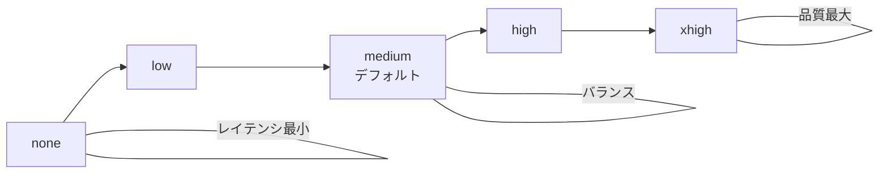
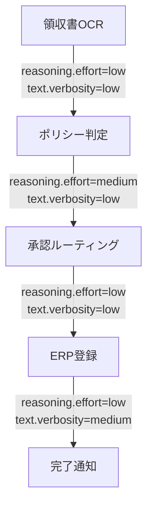

本記事は [Introducing GPT-5.5 (OpenAI)](https://openai.com/index/introducing-gpt-5-5/) および [Using GPT-5.5 (API Docs)](https://developers.openai.com/api/docs/guides/latest-model) の解説記事です。

## ブログ概要（Summary）

OpenAIは2026年4月23日にGPT-5.5をリリースした。GPT-5.5は`reasoning.effort`パラメータ（none/low/medium/high/xhigh）で推論深度とレイテンシのトレードオフを制御でき、`text.verbosity`パラメータで出力の詳細度を調整できる。OpenAIの公式情報によると、GPT-5.5はGPT-5.4と同等のper-tokenレイテンシでありながら、同じタスクを完了するのに必要なトークン数が少ないとされている。ツール呼び出しの精度と効率も向上しており、o3と比較して出力トークンが22%少なく、ツール呼び出し回数が45%少ないと報告されている。

この記事は [Zenn記事: Bedrock Managed Agents×GPT-5.5で経費精算フローのレイテンシを削減する](https://zenn.dev/0h_n0/articles/aa5a729de60491) の深掘りです。

## 情報源

- **種別**: 企業テックブログ / 公式ドキュメント
- **URL**: [https://openai.com/index/introducing-gpt-5-5/](https://openai.com/index/introducing-gpt-5-5/)
- **補助資料**: [https://developers.openai.com/api/docs/guides/latest-model](https://developers.openai.com/api/docs/guides/latest-model)
- **組織**: OpenAI
- **発表日**: 2026年4月23日

## 技術的背景（Technical Background）

LLMの推論能力向上は、Chain-of-Thoughtに代表される「推論トークンの増加」によって実現されてきた。しかし、推論トークンの増加はレイテンシとコストの増大を伴う。特にエージェントワークフローでは、各ステップでのモデル呼び出しが逐次実行されるため、トークン効率がフロー全体のパフォーマンスに直結する。

GPT-5.5はこの問題に対し、2つのアプローチで取り組んでいる。

1. **モデルレベルのトークン効率改善**: 同じタスクを少ないトークンで完了する能力の向上
2. **APIレベルの制御パラメータ**: `reasoning.effort`と`text.verbosity`によるユーザー側からの制御

## reasoning.effortパラメータの技術的詳細

### パラメータ設計

`reasoning.effort`はGPT-5シリーズで導入されたパラメータであり、モデルの推論に費やすトークン量を制御する。GPT-5.5では5段階のレベルが提供されている。



各レベルの特性をOpenAI公式ガイドに基づいて整理する。

| reasoning.effort | 推論トークン量 | 用途 | 制約事項 |
|-----------------|-------------|------|---------|
| `none` | なし | レイテンシ最優先 | ツール呼び出し・マルチステップ推論が機能しない場合がある |
| `low` | 最小限 | ツール多用ワークフロー | 複雑な条件分岐で精度低下の可能性 |
| `medium` | 中程度（デフォルト） | 品質・レイテンシ・コストのバランス | 推奨起点 |
| `high` | 多い | 複雑なエージェントタスク | レイテンシが増加 |
| `xhigh` | 最大 | 非同期の高難度タスク・評価用 | 大幅なレイテンシ増加 |

OpenAIの公式ドキュメントでは、「より高いreasoning effortが自動的に良いわけではない」と注意が記載されている。過剰な推論は「overthinking」を引き起こし、弱い停止条件と相まって不要なトークンを消費する。

### API実装

Bedrock経由でGPT-5.5を呼び出す場合、`additionalModelRequestFields`で`reasoning.effort`を指定する。

```python
import boto3

bedrock_runtime = boto3.client("bedrock-runtime", region_name="us-east-1")

response = bedrock_runtime.converse(
    modelId="openai.gpt-5-5",
    messages=[{"role": "user", "content": [{"text": "経費申請の承認ルートを決定してください"}]}],
    additionalModelRequestFields={
        "reasoning": {"effort": "low"},
        "text": {"verbosity": "low"},
    },
)
```

OpenAI API直接呼び出しの場合は以下の形式となる。

```python
from openai import OpenAI

client = OpenAI()

response = client.responses.create(
    model="gpt-5.5",
    input="経費申請の承認ルートを決定してください",
    reasoning={"effort": "low"},
    text={"verbosity": "low"},
)
```

### text.verbosityパラメータ

`text.verbosity`は出力テキストの詳細度を制御するパラメータである。

| text.verbosity | 説明 | 用途 |
|---------------|------|------|
| `low` | 簡潔な応答 | エージェントの中間ステップ |
| `medium`（デフォルト） | 標準的な詳細度 | ユーザー向け最終応答 |

エージェントワークフローでは、ツール呼び出し結果を次のステップに渡す中間処理で`text.verbosity=low`を使用することで、不要な説明文を省略し、出力トークン数を削減できる。

## トークン効率の改善

### GPT-5.4との比較

OpenAIの公式情報によると、GPT-5.5は以下のトークン効率改善を実現している。

- **同一reasoning.effortでのトークン削減**: GPT-5.4と同じreasoning effortレベルでも、GPT-5.5はより少ない推論トークンで同等の結果を達成する
- **o3比較**: 高reasoning effortでの比較で、出力トークンが22%少なく、ツール呼び出し回数が45%少ない

トークン削減がマルチステップワークフローで複合的に効く仕組みを数式で示す。

各ステップ$i$でのトークン削減率を$r_i$とすると、$K$ステップのフロー全体でのトークン削減率は以下のようになる。

$$
\text{Total tokens}_{\text{GPT-5.5}} = \sum_{i=1}^{K} (1 - r_i) \times T_i^{\text{GPT-5.4}}
$$

ここで$T_i^{\text{GPT-5.4}}$はGPT-5.4での各ステップのトークン数である。各ステップで独立に削減が適用されるため、ステップ数が多いほどGPT-5.5の効率改善が顕著になる。

例えば、4ステップのワークフローで各ステップ平均20%のトークン削減が実現された場合、全体では $1 - (0.8)^4 = 1 - 0.41 = 0.59$、すなわち約59%のトークン削減が期待される（ただし、これはステップ間でトークン数が等しく、削減率が独立であると仮定した理論値である）。

### プロンプトキャッシング

GPT-5.5はプロンプトキャッシングに対応しており、システムプロンプトやツール定義などの固定コンテンツを先頭に配置することで、キャッシュヒット率を最大化できる。OpenAIの公式ガイドでは、以下の配置順序が推奨されている。

```
[キャッシュ対象: システムプロンプト]
[キャッシュ対象: ツール定義]
[キャッシュ対象: Few-shot例]
[動的コンテンツ: ユーザー入力]
```

キャッシュがヒットした場合、入力トークンのコストが50%削減される。経費精算フローのように、同一のシステムプロンプトとツール定義で多数のリクエストを処理する場合、キャッシュヒット率が高くなりやすい。

## ツール呼び出しの改善

### 精度と効率の向上

OpenAIの公式情報によると、GPT-5.5は以下のツール呼び出し改善を実現している。

- **ツール指示への追従性向上**: ツール記述に記載された条件やパラメータ制約をより正確に解釈する
- **ツールエラーへの対処力向上**: ツール実行がエラーを返した場合の回復処理が改善
- **並列・連続ツール呼び出しの積極性**: 必要に応じて複数ツールを並列または連続で呼び出す

### エージェントワークフローでの推奨設定

Zenn記事で紹介されている経費精算フローの各ステップに対する推奨設定を整理する。



| ステップ | reasoning.effort | text.verbosity | 理由 |
|---------|-----------------|----------------|------|
| OCRパース | low | low | ルールベースに近い構造化処理 |
| ポリシー判定 | medium | low | 条件分岐が複雑、精度が重要 |
| 承認ルーティング | low | low | 金額閾値による決定的ルーティング |
| ERP登録 | low | low | API呼び出しのパラメータ生成 |
| 例外処理 | high | medium | 判断の正確性が最重要 |

### ベストプラクティス

OpenAIの公式ドキュメントで推奨されているGPT-5.5の使い方をまとめる。

1. **新モデルとして扱う**: GPT-5.4のプロンプトをそのまま使わず、ベースラインの再チューニングが必要
2. **outcome-firstプロンプト**: 手順ではなく、期待する結果と成功基準を記述する
3. **step-by-stepガイダンスの除去**: GPT-5.5は自律的に推論ステップを決定するため、過剰な手順指示は不要
4. **Structured Outputsの活用**: プロンプト内のスキーマ定義よりも、APIのStructured Outputs機能を使用する
5. **キャッシュ効率の最大化**: 静的コンテンツをプロンプト先頭に配置する

## 実運用への応用（Practical Applications）

### Amazon Bedrockでの利用

GPT-5.5はAmazon Bedrock上で利用可能（限定プレビュー）であり、Bedrock Managed AgentsのFoundation Modelとして指定できる。Bedrock上のGPT-5.5は、AWSのエンタープライズセキュリティ（IAM、PrivateLink、GuardRails、CloudTrail）をそのまま適用できる。

### コスト分析

GPT-5.5のAPI価格は入力$5/1Mトークン、出力$30/1Mトークンである（OpenAI公式、2026年4月時点）。

経費精算フロー（4ステップ、各ステップ平均入力500トークン・出力200トークン）の場合、1リクエストあたりのコストは以下のように推定される。

$$
\text{Cost per request} = 4 \times \left( \frac{500}{10^6} \times 5 + \frac{200}{10^6} \times 30 \right) = 4 \times (0.0025 + 0.006) = 0.034 \text{ USD}
$$

月間1,000リクエストで約$34/月。`reasoning.effort=low`を2ステップに適用しトークンを30%削減すると、推定$24/月程度に削減できる。ただし、キャッシュヒットによる入力トークンの50%割引は上記に含まれていない。

### 制約と注意事項

- GPT-5.5のBedrock対応は2026年5月時点で限定プレビューであり、利用にはAWSへの申請が必要
- `reasoning.effort=none`ではtool useが不安定になるケースがOpenAI公式ガイドで言及されている。経費精算フローでは`low`を下限とすることが推奨される
- per-tokenレイテンシはGPT-5.4と同等とされているが、Bedrock経由ではネットワークオーバーヘッドが加算される

## 学術研究との関連（Academic Connection）

- **Reasoning Under Adaptive Budgets**（arXiv 2503.10461）: `reasoning.effort`の理論的背景となる適応的推論予算制御のサーベイ。GPT-5.5の設計は「静的予算」カテゴリに分類される
- **s1: Simple Test-Time Scaling**（arXiv 2502.01618）: テスト時計算のスケーリング則。推論予算を増やすほど精度が向上するスケーリングカーブを実験的に示している
- **ToolBench / ToolRL**（arXiv 2502.10947）: ツール呼び出しの精度向上手法。GPT-5.5のツール呼び出し改善の学術的背景

## まとめと実践への示唆

GPT-5.5は`reasoning.effort`と`text.verbosity`の2つのパラメータにより、推論深度と出力詳細度をAPIレベルで制御できる。OpenAIの公式情報によると、o3と比較して出力トークン22%削減、ツール呼び出し回数45%削減を実現しており、マルチステップのエージェントワークフローで複合的にトークン効率が改善される。Bedrock Managed Agents上でステップ別にreasoning.effortを使い分けることで、経費精算フローのようなマルチステップワークフローのレイテンシとコストを体系的に最適化できる。ただし、Bedrock対応は限定プレビューであり、GA後の安定性検証が必要である。

## 参考文献

- **OpenAI Blog**: [https://openai.com/index/introducing-gpt-5-5/](https://openai.com/index/introducing-gpt-5-5/)
- **API Docs**: [https://developers.openai.com/api/docs/guides/latest-model](https://developers.openai.com/api/docs/guides/latest-model)
- **GPT-5.5 Model Spec**: [https://developers.openai.com/api/docs/models/gpt-5.5](https://developers.openai.com/api/docs/models/gpt-5.5)
- **Related Zenn article**: [https://zenn.dev/0h_n0/articles/aa5a729de60491](https://zenn.dev/0h_n0/articles/aa5a729de60491)
