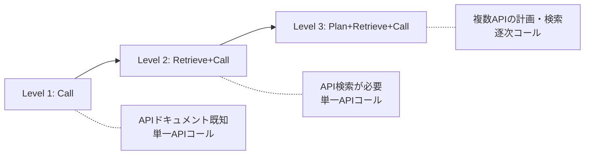

本記事は [API-Bank: A Comprehensive Benchmark for Tool-Augmented LLMs](https://arxiv.org/abs/2304.08244) の解説記事です。

## 論文概要（Abstract）

API-Bankは、ツール拡張LLM（Tool-Augmented LLM）を体系的に評価するために設計されたベンチマークである。著者らは73種の実行可能なAPIツールを実装し、314件のツール利用対話（753件のAPIコール）を人手でアノテーションした評価システムを構築した。さらに、1,000ドメイン・2,138種のAPIにまたがる1,888件の対話からなる訓練データセットを自動生成し、Alpaca-7Bをファインチューニングしたモデル「Lynx」を開発した。実験の結果、GPT-4はPlan+Retrieve+Callタスクで70%の正解率を達成する一方、小規模モデルでは依然として大きな改善余地があることが示された。

この記事は [Zenn記事: Vercel AI SDK 6でFunction Callingを型安全に実装する入門ガイド](https://zenn.dev/0h_n0/articles/1a183cd273886f) の深掘りです。

## 情報源

- **arXiv ID**: 2304.08244
- **URL**: [https://arxiv.org/abs/2304.08244](https://arxiv.org/abs/2304.08244)
- **著者**: Minghao Li, Yingxiu Zhao, Bowen Yu, et al.（Alibaba Group, 香港科技大学, 北京大学ほか）
- **発表年**: 2023（EMNLP 2023 採択）
- **分野**: cs.CL, cs.AI
- **コード**: [https://github.com/AlibabaResearch/DAMO-ConvAI/tree/main/api-bank](https://github.com/AlibabaResearch/DAMO-ConvAI/tree/main/api-bank)

## 背景と動機（Background & Motivation）

GPT-3、Codex、ChatGPT、GPT-4といったLLMの急速な進歩にもかかわらず、LLMが保持する知識は訓練データに依存しており、最新情報へのアクセスやすべてのドメインのカバーが困難という本質的な制約がある。この制約を克服する手段として、外部APIツールの活用が注目されている。WebGPT（Nakano et al., 2021）やReAct（Yao et al., 2022）、Toolformer（Schick et al., 2023）など、LLMにツール利用能力を付与する研究が活発化していたが、以下の3つの根本的な問いに体系的に答えるベンチマークは存在しなかった。

1. **現状のLLMはツール利用にどれほど有効か？**
2. **ツール利用能力をどのように向上させられるか？**
3. **ツール活用の障壁は何か？**

既存ベンチマーク（APIBench、ToolAlpaca、ToolBench等）はドメイン数やAPI数が限定的であり、マルチターン対話・複数APIコール・API検索能力の評価を同時にカバーするものがなかった。API-Bankはこれら3つの問いに包括的に答えるべく設計された。

## 主要な貢献（Key Contributions）

- **3段階の能力評価フレームワーク**: 500人のユーザインタビューに基づき、Call・Retrieve+Call・Plan+Retrieve+Callの3段階でLLMのツール利用能力を定義・評価する体系を確立
- **実行可能な評価システム**: 73種のAPIをPythonモックサーバとして実装し、データベース初期化・外部情報固定化により再現性を保証した評価環境を構築
- **大規模訓練データの自動生成**: 5エージェント協調によるMulti-agent方式で、1,000ドメイン・2,138 API・1,888対話の訓練データを人手アノテーション比98%のコスト削減で生成
- **Lynxモデルの開発**: Alpaca-7Bをファインチューニングし、API利用正解率をAlpacaから26ポイント以上向上させ、GPT-3.5に迫る性能を達成
- **包括的なエラー分析**: GPT-4・Lynx・Alpacaのエラーパターンを分類し、API Hallucination・Failed API Retrieval等の課題を体系的に整理

## 技術的詳細（Technical Details）

### 3段階評価設計

著者らは500人のユーザへのインタビューから、ツール拡張LLMに対する要件を「APIプール内のAPI数（Few vs. Many）」と「1ターンあたりのAPIコール数（Single vs. Multi）」の2軸で整理した。この2軸から4象限が生じるが、APIが少数の場合はSingle/Multiの差が小さいため統合し、最終的に以下の3段階を定義している。



**Level 1 — Call（呼び出し）**: APIプール内のすべてのAPIドキュメント（名前・説明・入出力パラメータ）がプロンプトに含まれた状態で、ユーザクエリに対して正しいAPIを選択し、適切な引数で呼び出す能力を評価する。スロットフィリングタスクに類似した能力が求められる。

**Level 2 — Retrieve+Call（検索＋呼び出し）**: APIプールが大規模でプロンプトに全APIを含められない場合を想定する。LLMはまず「API Search」ツールを用いてユーザ要求に関連するAPIを検索し、取得したAPIドキュメントに基づいてAPIを呼び出す。API Searchはユーザクエリからキーワードを抽出し、文埋め込みのコサイン類似度で最も関連性の高いAPIメタ情報を返す。

**Level 3 — Plan+Retrieve+Call（計画＋検索＋呼び出し）**: 複雑なユーザ要求を複数のサブタスクに分解し、それぞれに対してAPI検索・呼び出しを逐次実行する能力を評価する。前のAPI呼び出し結果を次のAPIの引数に活用する連鎖的な推論が求められる。

### APIモックサーバ

著者らは73種のAPIをPythonで統一的なフレームワークとして実装した（論文Section 3.1）。実装には98人日を要したと報告されている。APIの設計上の特徴は以下の通りである。

- **データベース連携API**: 初期データを事前投入し、対話構築の基盤とする
- **外部情報アクセスAPI**: 検索エンジン等の結果を特定時点で固定し、再現性を担保
- **API Search**: 文埋め込みベースの検索メカニズムで、クエリキーワードとAPIメタ情報の類似度を算出

各APIは名前・説明・入力パラメータ（型・必須/任意）・出力パラメータを持つドキュメントが定義されている。

### 評価指標

著者らはモデル性能を2つの観点から評価する（論文Section 3.3）。

**APIコール正解率（Correctness）**: 予測されたAPIコールと人手アノテーションされたAPIコールの一致度を測定する。具体的には、同一のデータベースクエリ・変更が行われ、同一の返却結果が得られるかどうかで一致を判定する。

$$
\text{Correctness} = \frac{\text{正しいAPIコール数}}{\text{全予測APIコール数}}
$$

**応答品質（ROUGE-L）**: APIコール後のLLM応答と、人手で作成された正解応答とのROUGE-Lスコアで評価する。

### Multi-agent訓練データ生成

手動アノテーションのコスト（1対話あたり$8）を削減するため、著者らは5つのChatGPTエージェントが協調して訓練データを生成するMulti-agent方式を提案した（論文Section 4, Figure 3）。

1. **Agent 1（ドメイン生成）**: ヘルスケア、フィットネス等のドメインを生成
2. **Agent 2（API生成）**: ドメインに応じた模擬APIを生成。実在のPublic APIsをサンプルとして提示し、真正性を担保
3. **Agent 3（クエリ設計）**: 生成されたAPIからランダムに選択し、能力レベルを指定してクエリを作成
4. **Agent 4（対話生成）**: ドメイン・API・能力・クエリを入力として、APIコール・実行シミュレーション・応答を生成
5. **Agent 5（テスター）**: 生成データが設計原則に準拠しているか自動検証（不合格率35%）

この方式により、1対話あたりのコストを$0.1に抑え、人手比98%のコスト削減を実現した。ただし、ChatGPT単独（self-instruct）では利用可能率が5%に留まり、GPT-4でも25%であったため、Multi-agent分業が不可欠であったと報告されている。

## 実装のポイント（Implementation）

API-Bankの実装には以下の技術的な注意点がある。

**API呼び出し形式の統一**: LLMが生成するAPIコールは統一フォーマットに従う必要がある。論文のZero-shot評価ではプロンプト内のAPIコール形式の指示のみに依存するため、GPT-3 Davinciのようにinstruction tuningが不十分なモデルでは正解率が極端に低下する（0.50%）。Lynxではファインチューニングにより「False API Call Format」エラーが大幅に改善された。

**API Searchの埋め込みベース検索**: API Searchは文埋め込みのコサイン類似度でAPIを検索する。キーワード抽出の精度がLevel 2・3の性能を左右するため、GPT-4でもFailed API Retrieval（67.86%）が最大のエラー要因となっている。

**データベース初期化の再現性**: 評価実行前にデータベースを初期状態にリセットし、各APIのデフォルト値を設定する。この初期化がなければ、前回の評価結果が残留してCorrectnessの判定に影響する。

**エラーの体系的分類**: 著者らは6種のエラータイプを定義している。No API Call（API未呼び出し）、API Hallucination（存在しないAPI呼び出し）、Invalid Input Parameters（型不一致）、False API Call Format（構文エラー）、Miss Input Parameters（必須パラメータ欠損）、Has Exception（実行時例外）である。

## Production Deployment Guide

API-Bankの評価フレームワークを本番環境でLLMのFunction Calling品質を継続的に監視するシステムとして運用する場合のAWS構成を示す。

### AWS実装パターン（コスト最適化重視）

**トラフィック量別の推奨構成**

| 構成 | トラフィック | AWSサービス | 月額コスト目安 |
|------|------------|------------|-------------|
| Small | ~100 req/日 | Lambda + Bedrock + DynamoDB | $50-150 |
| Medium | ~1,000 req/日 | ECS Fargate + Bedrock + Aurora Serverless | $300-800 |
| Large | 10,000+ req/日 | EKS + Karpenter + Spot Instances | $2,000-5,000 |

**Small構成の内訳**（~100 req/日）:
- Lambda: 月100万リクエスト無料枠内、メモリ512MB、タイムアウト120秒 — $0
- Bedrock (Claude Sonnet): 1リクエストあたり約2K入力+500出力トークン — $30-80/月
- DynamoDB On-Demand: 評価結果保存、1WCU/1RCUあたり$1.25/$0.25 — $5-10/月
- CloudWatch Logs: ログ保存 — $5-10/月

**Large構成の内訳**（10,000+ req/日）:
- EKS コントロールプレーン: $73/月
- EC2 Spot Instances (m5.xlarge x 3): On-Demand $460/月 → Spot $138/月（70%削減）
- Bedrock Batch API: 標準比50%削減 — $800-2,500/月
- Aurora Serverless v2: 0.5-8 ACU — $200-500/月
- NAT Gateway: $32/月 + データ転送

**コスト削減テクニック**:
- Spot Instances活用: On-Demand比最大90%削減。Karpenterで自動フォールバック設定
- Bedrock Batch API: 非同期評価バッチで50%削減
- Prompt Caching: APIドキュメント部分をキャッシュし、入力トークンコスト30-90%削減
- Reserved Instances: 1年コミットで最大72%削減（安定ワークロード向け）

**コスト試算の注意事項**: 上記はAWS ap-northeast-1（東京）リージョンの2026年5月時点の概算値である。実際のコストはトラフィックパターン、バースト使用量、Bedrockモデル選択により変動する。最新料金は[AWS Pricing Calculator](https://calculator.aws/)で確認を推奨する。

### Terraformインフラコード

**Small構成（Serverless）**: Lambda + Bedrock + DynamoDB

```hcl
# === VPC基盤（NAT Gateway不使用でコスト削減） ===
resource "aws_vpc" "api_eval" {
  cidr_block           = "10.0.0.0/16"
  enable_dns_hostnames = true
  tags = { Name = "api-eval-vpc", Project = "api-bank-eval" }
}

resource "aws_subnet" "private" {
  count             = 2
  vpc_id            = aws_vpc.api_eval.id
  cidr_block        = "10.0.${count.index + 1}.0/24"
  availability_zone = data.aws_availability_zones.available.names[count.index]
  tags = { Name = "api-eval-private-${count.index}" }
}

# === IAMロール（最小権限原則） ===
resource "aws_iam_role" "lambda_eval" {
  name = "api-eval-lambda-role"
  assume_role_policy = jsonencode({
    Version = "2012-10-17"
    Statement = [{
      Action = "sts:AssumeRole"
      Effect = "Allow"
      Principal = { Service = "lambda.amazonaws.com" }
    }]
  })
}

resource "aws_iam_role_policy" "lambda_permissions" {
  name = "api-eval-lambda-policy"
  role = aws_iam_role.lambda_eval.id
  policy = jsonencode({
    Version = "2012-10-17"
    Statement = [
      {
        Effect   = "Allow"
        Action   = ["bedrock:InvokeModel", "bedrock:InvokeModelWithResponseStream"]
        Resource = "arn:aws:bedrock:ap-northeast-1::foundation-model/anthropic.claude-*"
      },
      {
        Effect   = "Allow"
        Action   = ["dynamodb:PutItem", "dynamodb:GetItem", "dynamodb:Query"]
        Resource = aws_dynamodb_table.eval_results.arn
      },
      {
        Effect   = "Allow"
        Action   = ["logs:CreateLogGroup", "logs:CreateLogStream", "logs:PutLogEvents"]
        Resource = "arn:aws:logs:*:*:*"
      }
    ]
  })
}

# === Lambda関数 ===
resource "aws_lambda_function" "api_evaluator" {
  function_name = "api-bank-evaluator"
  runtime       = "python3.12"
  handler       = "evaluator.handler"
  role          = aws_iam_role.lambda_eval.arn
  timeout       = 120
  memory_size   = 512  # API呼び出し+LLM応答処理に十分なメモリ

  environment {
    variables = {
      EVAL_TABLE    = aws_dynamodb_table.eval_results.name
      BEDROCK_MODEL = "anthropic.claude-sonnet-4-20250514"
    }
  }
}

# === DynamoDB（On-Demandモード） ===
resource "aws_dynamodb_table" "eval_results" {
  name         = "api-eval-results"
  billing_mode = "PAY_PER_REQUEST"  # コスト最適: 低トラフィック向け
  hash_key     = "eval_id"
  range_key    = "timestamp"

  attribute {
    name = "eval_id"
    type = "S"
  }
  attribute {
    name = "timestamp"
    type = "S"
  }

  server_side_encryption { enabled = true }  # KMS暗号化
  point_in_time_recovery { enabled = true }
}

# === CloudWatchアラーム（コスト監視） ===
resource "aws_cloudwatch_metric_alarm" "lambda_cost" {
  alarm_name          = "api-eval-lambda-invocations-high"
  comparison_operator = "GreaterThanThreshold"
  evaluation_periods  = 1
  metric_name         = "Invocations"
  namespace           = "AWS/Lambda"
  period              = 86400
  statistic           = "Sum"
  threshold           = 500  # 日次500回超過でアラート
  alarm_actions       = [aws_sns_topic.cost_alert.arn]
  dimensions          = { FunctionName = aws_lambda_function.api_evaluator.function_name }
}
```

**Large構成（Container）**: EKS + Karpenter + Spot Instances

```hcl
# === EKSクラスタ ===
module "eks" {
  source          = "terraform-aws-modules/eks/aws"
  version         = "~> 20.0"
  cluster_name    = "api-eval-cluster"
  cluster_version = "1.31"
  vpc_id          = aws_vpc.api_eval.id
  subnet_ids      = aws_subnet.private[*].id

  cluster_endpoint_public_access = false  # セキュリティ: プライベートのみ
}

# === Karpenter Provisioner（Spot優先） ===
resource "kubectl_manifest" "karpenter_nodepool" {
  yaml_body = yamlencode({
    apiVersion = "karpenter.sh/v1"
    kind       = "NodePool"
    metadata   = { name = "api-eval-pool" }
    spec = {
      template = {
        spec = {
          requirements = [
            { key = "karpenter.sh/capacity-type", operator = "In", values = ["spot", "on-demand"] },
            { key = "node.kubernetes.io/instance-type", operator = "In",
              values = ["m5.xlarge", "m5a.xlarge", "m6i.xlarge"] }
          ]
        }
      }
      limits   = { cpu = "32", memory = "128Gi" }
      disruption = { consolidationPolicy = "WhenEmptyOrUnderutilized" }
    }
  })
}

# === Secrets Manager（Bedrock設定） ===
resource "aws_secretsmanager_secret" "bedrock_config" {
  name       = "api-eval/bedrock-config"
  kms_key_id = aws_kms_key.api_eval.arn
}

# === AWS Budgets（予算アラート） ===
resource "aws_budgets_budget" "monthly" {
  name         = "api-eval-monthly"
  budget_type  = "COST"
  limit_amount = "5000"
  limit_unit   = "USD"
  time_unit    = "MONTHLY"

  notification {
    comparison_operator       = "GREATER_THAN"
    threshold                 = 80
    threshold_type            = "PERCENTAGE"
    notification_type         = "ACTUAL"
    subscriber_email_addresses = ["ops@example.com"]
  }
}
```

### 運用・監視設定

**CloudWatch Logs Insights クエリ**（コスト異常検知・レイテンシ分析）:

```
# 1時間あたりのトークン使用量サマリ
fields @timestamp, input_tokens, output_tokens
| stats sum(input_tokens) as total_input, sum(output_tokens) as total_output,
        count(*) as request_count by bin(1h) as hour
| sort hour desc

# P95/P99 レイテンシ分析
fields @timestamp, duration_ms, api_name, level
| stats percentile(duration_ms, 95) as p95,
        percentile(duration_ms, 99) as p99,
        avg(duration_ms) as avg_latency by level
```

**CloudWatch アラーム設定**（Python boto3）:

```python
import boto3

cloudwatch = boto3.client("cloudwatch", region_name="ap-northeast-1")

def create_token_spike_alarm(sns_topic_arn: str) -> None:
    """Bedrockトークン使用量スパイク検知アラーム"""
    cloudwatch.put_metric_alarm(
        AlarmName="bedrock-token-spike",
        MetricName="InputTokenCount",
        Namespace="AWS/Bedrock",
        Statistic="Sum",
        Period=3600,
        EvaluationPeriods=1,
        Threshold=100000,  # 1時間10万トークン超過
        ComparisonOperator="GreaterThanThreshold",
        AlarmActions=[sns_topic_arn],
    )

def create_lambda_duration_alarm(
    function_name: str, sns_topic_arn: str
) -> None:
    """Lambda実行時間異常検知アラーム"""
    cloudwatch.put_metric_alarm(
        AlarmName=f"{function_name}-duration-high",
        MetricName="Duration",
        Namespace="AWS/Lambda",
        Statistic="p99",
        Period=300,
        EvaluationPeriods=3,
        Threshold=90000,  # 90秒超過（タイムアウト120秒の75%）
        ComparisonOperator="GreaterThanThreshold",
        Dimensions=[{"Name": "FunctionName", "Value": function_name}],
        AlarmActions=[sns_topic_arn],
    )
```

**X-Ray トレーシング設定**:

```python
from aws_xray_sdk.core import xray_recorder, patch_all

patch_all()  # boto3自動計装

@xray_recorder.capture("evaluate_api_call")
def evaluate_api_call(
    model_response: str, ground_truth: str, level: int
) -> dict:
    """APIコール評価をトレーシング付きで実行"""
    subsegment = xray_recorder.current_subsegment()
    subsegment.put_annotation("eval_level", level)
    subsegment.put_metadata("ground_truth_api", ground_truth)

    result = compute_correctness(model_response, ground_truth)
    subsegment.put_annotation("is_correct", result["correct"])
    return result
```

**Cost Explorer自動レポート**:

```python
import boto3
from datetime import datetime, timedelta

ce = boto3.client("ce", region_name="ap-northeast-1")
sns = boto3.client("sns", region_name="ap-northeast-1")

def daily_cost_report(sns_topic_arn: str) -> dict:
    """日次コストレポート取得・通知"""
    end = datetime.utcnow().strftime("%Y-%m-%d")
    start = (datetime.utcnow() - timedelta(days=1)).strftime("%Y-%m-%d")

    response = ce.get_cost_and_usage(
        TimePeriod={"Start": start, "End": end},
        Granularity="DAILY",
        Metrics=["BlendedCost"],
        GroupBy=[{"Type": "DIMENSION", "Key": "SERVICE"}],
    )

    total = 0.0
    details: list[str] = []
    for group in response["ResultsByTime"][0]["Groups"]:
        service = group["Keys"][0]
        cost = float(group["Metrics"]["BlendedCost"]["Amount"])
        if cost > 0.01:
            details.append(f"  {service}: ${cost:.2f}")
            total += cost

    if total > 100:  # $100/日超過でSNS通知
        sns.publish(
            TopicArn=sns_topic_arn,
            Subject=f"[ALERT] API-Eval daily cost: ${total:.2f}",
            Message="\n".join(details),
        )
    return {"total": total, "details": details}
```

### コスト最適化チェックリスト

**アーキテクチャ選択**:
- [ ] トラフィック量に応じた構成を選択（~100 req/日: Serverless、~1,000 req/日: Hybrid、10,000+ req/日: Container）

**リソース最適化**:
- [ ] EC2/EKS: Spot Instances優先（On-Demand比最大90%削減）
- [ ] Reserved Instances: 安定ワークロードは1年コミット（最大72%削減）
- [ ] Savings Plans: コンピューティング全般に適用検討
- [ ] Lambda: メモリサイズをPower Tuningで最適化（512MB推奨）
- [ ] ECS/EKS: Karpenterでアイドル時自動スケールダウン
- [ ] Aurora Serverless v2: 最小ACUを0.5に設定

**LLMコスト削減**:
- [ ] Bedrock Batch API: 非同期評価で50%削減
- [ ] Prompt Caching: APIドキュメント部分をキャッシュ（30-90%削減）
- [ ] モデル選択ロジック: Level 1はHaiku、Level 3はSonnetと難易度別に使い分け
- [ ] トークン数制限: max_tokensを応答に必要な最小値に設定
- [ ] 入力プロンプト圧縮: 不要なAPIドキュメントの除外

**監視・アラート**:
- [ ] AWS Budgets: 月次予算アラート（80%/100%閾値）
- [ ] CloudWatch アラーム: トークン使用量・Lambda実行時間
- [ ] Cost Anomaly Detection: ML検知で異常コスト自動通知
- [ ] 日次コストレポート: Cost Explorer APIで自動取得・SNS配信

**リソース管理**:
- [ ] 未使用リソース: 定期的にCost Explorerで検出・削除
- [ ] タグ戦略: `Project=api-bank-eval`タグで全リソースを識別
- [ ] ライフサイクルポリシー: CloudWatch Logs保持期間を30日に制限
- [ ] 開発環境夜間停止: EventBridgeスケジュールでECS/EKSをスケールイン
- [ ] S3ライフサイクル: 評価ログを90日後にGlacierへ移行

## 実験結果（Results）

著者らはGPT-3 Davinci、GPT-3.5-turbo、GPT-4、ChatGLM-6B、Alpaca-7B、およびLynx-7Bの6モデルをAPI-Bank評価システムで比較した（論文Table 3より）。

| モデル | Call正解率 | Call ROUGE | R+C正解率 | R+C ROUGE | P+R+C正解率 | P+R+C ROUGE | 総合正解率 |
|--------|----------|-----------|---------|----------|-----------|------------|---------|
| Alpaca-7B | 24.06% | 0.0204 | 5.19% | 0.0019 | 0.00% | 0.086 | 15.19% |
| ChatGLM-6B | 23.62% | 0.2451 | 13.33% | 0.2173 | 0.00% | 0.1522 | 16.42% |
| GPT-3 Davinci | 0.50% | 0.1035 | 1.48% | 0.091 | 0.00% | 0.0156 | 0.57% |
| GPT-3.5-turbo | 59.40% | 0.4598 | 38.52% | 0.3758 | 22.00% | 0.3809 | 47.16% |
| GPT-4 | 63.66% | 0.3691 | 37.04% | 0.351 | 70.00% | 0.4808 | 60.24% |
| Lynx-7B | 49.87% | 0.4332 | 30.37% | 0.2503 | 20.00% | 0.3425 | 39.58% |

**主要な知見**（論文Section 7.2より）:

- **GPT-3 Davinciはツール利用がほぼ不可能**: 正解率0.57%。instruction tuningを経ていないモデルではAPIコール形式の理解自体が困難であることを示唆
- **GPT-3.5はCallで59.40%を達成**: しかしRetrieve+Callで21ポイント低下、Plan+Retrieve+Callでさらに17ポイント低下。API検索と計画立案が追加的な障壁となる
- **GPT-4はPlan+Retrieve+Callで突出**: 70.00%を達成し、GPT-3.5（22.00%）を大幅に上回る。著者らはGPT-4の推論・計画能力の優位性に起因すると分析
- **Lynxは7BでGPT-3.5に迫る**: 総合39.58%でAlpaca（15.19%）から24ポイント以上向上。ファインチューニング用データの品質が小規模モデルの性能を大きく引き上げることを実証

**エラー分析**（論文Table 4-6より）:

Alpacaの最大エラーは「No API Call」（36.77%）で、そもそもAPIを呼び出さないケースが多い。Lynxでは「API Hallucination」（61.38%）が最大で、訓練時に学習したAPIを未提供の場面でも呼び出してしまう。GPT-4では「Failed API Retrieval」（67.86%）が支配的で、API Searchによる適切なAPI検索が最大の課題である。

## 実運用への応用（Practical Applications）

API-Bankの評価フレームワークは、Zenn記事で解説されているVercel AI SDK 6の`tool()`定義と直接対応する設計知見を提供する。

**API-Bankの3段階とAI SDKのtool()の対応**:
- **Level 1（Call）**: AI SDKの`tool({ parameters: z.object({...}) })`で定義した単一ツールの引数生成精度に直結。JSONスキーマによるパラメータ型定義の重要性をAPI-Bankが定量的に裏付けている
- **Level 2（Retrieve+Call）**: `maxSteps`で複数ツールから適切なものを選択するシナリオに相当。ツール説明文（description）の質がLLMの選択精度を左右する
- **Level 3（Plan+Retrieve+Call）**: `maxSteps`による逐次ツール実行で、前のツール結果を次の入力に使う連鎖推論。API-BankはGPT-4でも70%に留まることから、ツール連鎖のフォールバック設計が実運用では不可欠

**プロダクション設計への示唆**:
- エラー分析結果から、ツール定義のdescriptionを簡潔かつ一意にし、API Hallucinationを抑制する設計が重要
- Level 3の低成功率（GPT-4で70%）を踏まえ、複数ツール連鎖時にはステップごとのバリデーションと再試行ロジックの実装が推奨される

## 関連研究（Related Work）

- **Toolformer**（Schick et al., 2023）: LLM自体が学習時にツール呼び出しを獲得する手法。API-Bankが評価する「ツール利用能力」の別アプローチ
- **ToolBench**（Qin et al., 2023b）: 16,464 APIをカバーするが、マルチターン対話や応答評価を含まない。API-Bankはドメイン多様性とCall/Retrieve/Plan3能力の同時評価で差別化
- **Gorilla**（Patil et al., 2023）: 大規模API群への接続に特化したLLM。API-BankとはAPIのReal-world実行性（実際にモックサーバで実行して結果を検証する点）で設計思想が異なる
- **ReAct**（Yao et al., 2022）: 推論とアクションを交互に行うフレームワーク。API-BankのLevel 3はReAct的な逐次推論・実行パターンの定量評価に相当

## まとめと今後の展望

API-Bankは、ツール拡張LLMの能力を3段階（Call・Retrieve+Call・Plan+Retrieve+Call）で体系的に評価する初の包括的ベンチマークである。1,000ドメイン・2,211 APIをカバーし、実行可能なモックサーバによる再現性の高い評価環境を提供する。GPT-4でもPlan+Retrieve+Callで70%に留まることから、API検索精度の向上・APIコールフォーマットのデコーディング改善・大規模訓練データの拡充が今後の重要な研究方向として示されている。Function Callingを実装するエンジニアにとって、ツール定義の品質・エラーハンドリング・連鎖実行の堅牢性が実運用の成否を分けることを定量的に裏付ける研究である。

## 参考文献

- **arXiv**: [https://arxiv.org/abs/2304.08244](https://arxiv.org/abs/2304.08244)
- **ACL Anthology**: [https://aclanthology.org/2023.emnlp-main.187/](https://aclanthology.org/2023.emnlp-main.187/)
- **Code**: [https://github.com/AlibabaResearch/DAMO-ConvAI/tree/main/api-bank](https://github.com/AlibabaResearch/DAMO-ConvAI/tree/main/api-bank)
- **HuggingFace Dataset**: [https://huggingface.co/datasets/liminghao1630/API-Bank](https://huggingface.co/datasets/liminghao1630/API-Bank)
- **Related Zenn article**: [https://zenn.dev/0h_n0/articles/1a183cd273886f](https://zenn.dev/0h_n0/articles/1a183cd273886f)
