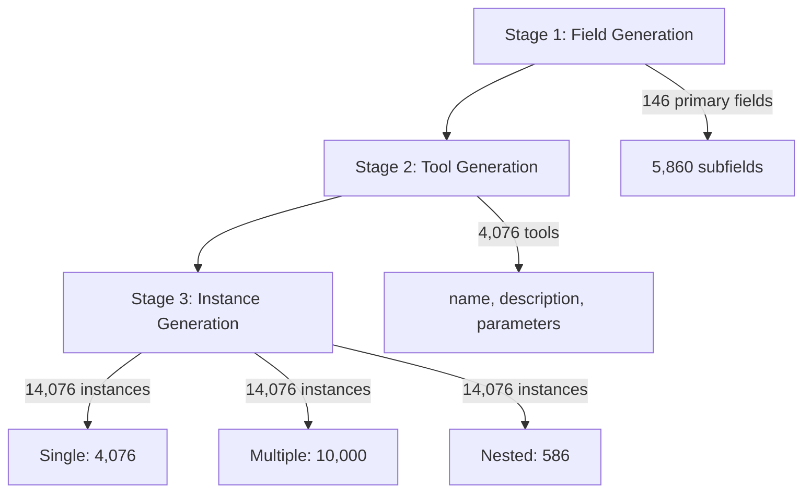

本記事は [Seal-Tools: Self-Instruct Tool Learning Dataset for Agent Tuning and Detailed Benchmark](https://arxiv.org/abs/2405.08355) の解説記事です。

## 論文概要（Abstract）

Seal-Toolsは、LLMのツール使用能力を訓練・評価するために設計されたSelf-Instruct方式のデータセットである。4,076個のAPI風ツールと14,076個のインスタンスを含み、単一ツール呼び出し・複数ツール呼び出し・ネスト関数呼び出しの3種類のタスクを網羅する。評価には出力形式（Format Accuracy）、ツール選択（Tool Selection）、パラメータ充填（Parameter Filling）の3次元メトリクスを導入し、モデルの能力を多角的に測定する。著者らはファインチューニングしたLLaMA2-7BがGPT-4に迫る性能を達成したと報告している。

この記事は [Zenn記事: Vercel AI SDK 6でFunction Callingを型安全に実装する入門ガイド](https://zenn.dev/0h_n0/articles/1a183cd273886f) の深掘りです。

## 情報源

- **arXiv ID**: 2405.08355
- **URL**: [https://arxiv.org/abs/2405.08355](https://arxiv.org/abs/2405.08355)
- **著者**: Mengsong Wu, Tong Zhu, Han Han, Chuanyuan Tan, Xiang Zhang, Wenliang Chen
- **発表年**: 2024（NLPCC 2024 採択）
- **分野**: cs.CL（Computation and Language）
- **コード**: [https://github.com/fairyshine/Seal-Tools](https://github.com/fairyshine/Seal-Tools)

## 背景と動機（Background & Motivation）

LLMにツール使用能力を付与する「Function Calling」は、Vercel AI SDKのようなフレームワークで実装が進んでいるが、モデル側のツール呼び出し精度には依然として課題が残る。既存のツール学習データセットには以下の問題があった。

第一に、ToolBenchは16,464個の実世界APIを収集しているが、API自体の不安定性（サーバダウン・仕様変更）により再現性のある評価が困難であった。第二に、API-Bankは2,211ツールを含むが人手でのアノテーションに依存しており、スケールに限界がある。第三に、いずれのデータセットもネスト関数呼び出し（前のツールの出力を次のツールの入力に渡す連鎖呼び出し）を体系的にカバーしていなかった。

Seal-Toolsはこれらの課題に対し、Self-Instruct方式によるスケーラブルなデータ生成と、決定論的な3次元評価フレームワークを提供することで、ツール学習研究の基盤を構築する。

## 主要な貢献（Key Contributions）

- **Self-Instruct方式の3段階パイプライン**: 分野生成 → ツール生成 → インスタンス生成の自動化パイプラインにより、4,076ツール・14,076インスタンスを構築。人手アノテーション不要でスケーラブル
- **ネスト関数呼び出しの体系的サポート**: 586件のネストインスタンスを含み、前のツール出力を後のツール入力に渡す有向非巡回グラフ（DAG）構造の呼び出しチェーンを再現
- **3次元評価メトリクス**: Format Accuracy、Tool Precision/Recall/F1、Parameter Precision/Recall/F1の階層的メトリクスにより、モデルの弱点を特定可能
- **完全オープンソース**: データセット・構築コード・評価コードの全てをApache-2.0ライセンスで公開

## 技術的詳細（Technical Details）

### 3段階Self-Instructパイプライン

Seal-Toolsのデータ構築は3段階で進行する。



**Stage 1: Field Generation.** まず146個の一次分野（Science, Finance, Healthcareなど）を生成し、各分野から約40個のサブフィールドを展開して合計5,860個のサブフィールドを得る。これらの分野がツール生成のアンカーとなり、重複を防ぐ。

**Stage 2: Tool Generation.** 各サブフィールドに対してAPI風のツール定義を生成する。各ツールは名前・説明文・入力パラメータ（型・必須/任意・デフォルト値）・出力パラメータで構成される。著者らの報告によると、ツール1つあたりの平均必須パラメータ数は1.551個である。重要な設計判断として、パラメータの具体例をツール定義と同時に生成しており、これがインスタンス生成品質の向上に寄与している。

**Stage 3: Instance Generation.** インスタンスは3種類に分かれる。

- **単一ツールインスタンス**（4,076件）: 1つのツールに対してIn-Context Learningでクエリとパラメータ値を生成
- **複数ツールインスタンス**（10,000件）: 2段階方式（まずツール選択、次にパラメータ充填）で生成
- **ネストインスタンス**（586件）: 前のツール呼び出しの戻り値を次のツールの引数に渡すDAG構造

### ネスト関数呼び出しの構造

ネストインスタンスは実世界のFunction Callingで頻出するパターンを再現する。例えば、天気予報APIの結果を旅行推薦APIの入力に渡すといった連鎖呼び出しである。

形式的には、ツール呼び出しの系列 $T = \{t_1, t_2, \ldots, t_n\}$ において、ネスト呼び出しは以下の制約を満たす。

$$
\exists\, i < j \leq n : \text{output}(t_i) \in \text{params}(t_j)
$$

ここで、
- $t_i$: $i$番目のツール呼び出し
- $\text{output}(t_i)$: $t_i$の戻り値
- $\text{params}(t_j)$: $t_j$の入力パラメータ集合

この依存関係はDAGとして表現され、循環呼び出しは許容されない。

### 3次元評価メトリクス

従来のツール学習ベンチマークは単純なpass/fail判定が多かったが、Seal-Toolsは3つの次元でモデル能力を分解する。

**次元1: Format Accuracy（出力形式精度）.** モデル出力がJSON仕様に準拠しているかを検証する。

$$
\text{ACC}_{\text{format}} = \frac{|\{x \in X : \text{is\_valid\_json}(x)\}|}{|X|}
$$

**次元2: Tool Selection（ツール選択）.** 正解ツール集合 $G$ とモデル予測ツール集合 $P$ に対して、Precision・Recall・F1を計算する。

$$
\text{Precision}_{\text{tool}} = \frac{|G \cap P|}{|P|}, \quad \text{Recall}_{\text{tool}} = \frac{|G \cap P|}{|G|}
$$

$$
\text{F1}_{\text{tool}} = \frac{2 \cdot \text{Precision}_{\text{tool}} \cdot \text{Recall}_{\text{tool}}}{\text{Precision}_{\text{tool}} + \text{Recall}_{\text{tool}}}
$$

**次元3: Parameter Filling（パラメータ充填）.** 各ツール呼び出しにおけるパラメータの名前・値ペアの正確性を測定する。ツール選択が正しい場合にのみ評価され、階層的な能力分解が可能となる。

$$
\text{F1}_{\text{param}} = \frac{2 \cdot \text{Precision}_{\text{param}} \cdot \text{Recall}_{\text{param}}}{\text{Precision}_{\text{param}} + \text{Recall}_{\text{param}}}
$$

この階層構造により、「JSON出力はできるがツール選択が不正確」「ツール選択は正しいがパラメータ値が間違っている」といったモデルの弱点を個別に特定できる。

### 評価の実装

```python
from typing import Any

def calculate_score(
    gold_tools: list[dict[str, Any]],
    pred_tools: list[dict[str, Any]],
) -> dict[str, float]:
    """Seal-Toolsの3次元評価スコアを計算する.

    Args:
        gold_tools: 正解ツール呼び出しのリスト
            各要素は {"name": str, "parameters": dict} の形式
        pred_tools: モデル予測ツール呼び出しのリスト

    Returns:
        format_acc, tool_f1, param_f1を含むスコア辞書
    """
    # 次元1: Format Accuracy
    format_valid = all(
        isinstance(t, dict) and "name" in t and "parameters" in t
        for t in pred_tools
    )

    # 次元2: Tool Selection F1
    gold_names = {t["name"] for t in gold_tools}
    pred_names = {t["name"] for t in pred_tools}
    tool_tp = len(gold_names & pred_names)
    tool_precision = tool_tp / len(pred_names) if pred_names else 0.0
    tool_recall = tool_tp / len(gold_names) if gold_names else 0.0
    tool_f1 = (
        2 * tool_precision * tool_recall / (tool_precision + tool_recall)
        if (tool_precision + tool_recall) > 0
        else 0.0
    )

    # 次元3: Parameter Filling F1（ツール選択が正しい場合のみ）
    param_scores: list[float] = []
    for gold in gold_tools:
        matched = [p for p in pred_tools if p["name"] == gold["name"]]
        if not matched:
            continue
        pred = matched[0]
        gold_params = set(gold["parameters"].items())
        pred_params = set(pred["parameters"].items())
        tp = len(gold_params & pred_params)
        p = tp / len(pred_params) if pred_params else 0.0
        r = tp / len(gold_params) if gold_params else 0.0
        f1 = 2 * p * r / (p + r) if (p + r) > 0 else 0.0
        param_scores.append(f1)

    param_f1 = (
        sum(param_scores) / len(param_scores) if param_scores else 0.0
    )

    return {
        "format_acc": 1.0 if format_valid else 0.0,
        "tool_f1": tool_f1,
        "param_f1": param_f1,
    }
```

## 実装のポイント（Implementation）

Seal-Toolsをファインチューニングに活用する際の実装上の注意点を整理する。

**ツール定義のプロンプト注入.** 各インスタンスでは、候補ツールの定義文をシステムプロンプトに注入する。ツール数が多い場合はコンテキスト長の制約に注意が必要で、著者らはDPR（Dense Passage Retrieval）によるツール検索を併用している。

**JSON出力の安定化.** Format Accuracyが100%に達しないモデルが多い（論文Table 2より、GPT-4でも97.12%）。実運用ではJSON修復ライブラリ（`json-repair`等）の併用や、構造化出力モード（Structured Outputs）の活用が推奨される。

**ネスト呼び出しの実行順序.** ネストインスタンスではツール間の依存関係をDAGとして解析し、トポロジカルソートで実行順序を決定する必要がある。Vercel AI SDKの`maxSteps`パラメータによるマルチステップ実行はこのパターンに対応している。

**評価時のツール検索.** 実験では候補ツールの検索精度がボトルネックとなっている。著者らは「必要なツールをすべて検索する方法が最も緊急の課題」と報告しており、ツール検索の改善が性能向上に直結する。

## Production Deployment Guide

Seal-Toolsの知見を活かしたFunction Callingシステムを本番環境にデプロイする際のAWS構成を解説する。

### AWS実装パターン（コスト最適化重視）

ツール学習モデルの推論パイプラインをAWS上に構築する場合、トラフィック量に応じて3つの構成を使い分ける。以下のコスト試算は2026年5月時点のAWS ap-northeast-1（東京）リージョン料金に基づく概算値であり、実際のコストはトラフィックパターン、リージョン、バースト使用量により変動する。最新料金はAWS料金計算ツールで確認を推奨する。

| 構成 | トラフィック | 主要サービス | 月額概算 |
|------|-------------|-------------|---------|
| Small | ~100 req/日 | Lambda + Bedrock + DynamoDB | $50-150 |
| Medium | ~1,000 req/日 | ECS Fargate + Bedrock + ElastiCache | $300-800 |
| Large | 10,000+ req/日 | EKS + Karpenter + Spot + Bedrock | $2,000-5,000 |

**Small構成（~100 req/日）.** Lambda関数がユーザリクエストを受信し、ツール定義をDynamoDBから取得、Bedrockでモデル推論を実行する。ツール検索にはDynamoDB + OpenSearch Serverlessを使用し、DPRベクトル検索を実現する。Lambda実行時間は最大15分のため、複雑なネスト呼び出しチェーンにも対応可能。

- Lambda (256MB, 平均30秒/req): ~$5/月
- Bedrock Claude Sonnet (入力$3/MTok, 出力$15/MTok): ~$30-80/月
- DynamoDB On-Demand: ~$5/月
- OpenSearch Serverless (0.5 OCU): ~$10/月

**Medium構成（~1,000 req/日）.** ECS Fargateでステートフルなツール実行エンジンを常時起動し、ElastiCacheでツール定義・DPR埋め込みをキャッシュする。Fargateのタスク数をApplication Auto Scalingで調整する。

- ECS Fargate (0.5 vCPU, 1GB RAM x 2タスク): ~$50/月
- Bedrock Claude Sonnet: ~$150-400/月
- ElastiCache (cache.t3.micro): ~$15/月
- ALB: ~$20/月

**Large構成（10,000+ req/日）.** EKSクラスタでKarpenterによるSpotインスタンスの自動スケーリングを実現する。ツール検索にはOpenSearch Serviceの専用クラスタを使用し、高スループットのベクトル検索を処理する。

- EKS Control Plane: ~$75/月
- EC2 Spot (c6i.xlarge x 3-10台): ~$200-700/月
- Bedrock Claude Sonnet: ~$1,000-3,000/月
- OpenSearch Service (r6g.large x 2): ~$300/月

**コスト削減テクニック:**
- Spot Instances活用でEC2コストを最大90%削減
- Reserved Instances（1年コミット）で最大72%削減
- Bedrock Batch API使用で推論コストを50%削減
- Prompt Caching有効化でツール定義の繰り返し送信コストを30-90%削減

### Terraformインフラコード

**Small構成（Serverless）:**

```hcl
# Seal-Tools Function Calling - Small構成
# Lambda + Bedrock + DynamoDB

terraform {
  required_version = ">= 1.9"
  required_providers {
    aws = {
      source  = "hashicorp/aws"
      version = "~> 5.80"
    }
  }
}

provider "aws" {
  region = "ap-northeast-1"
}

# DynamoDB - ツール定義ストア（On-Demandでコスト最適化）
resource "aws_dynamodb_table" "tool_definitions" {
  name         = "seal-tools-definitions"
  billing_mode = "PAY_PER_REQUEST"
  hash_key     = "tool_id"

  attribute {
    name = "tool_id"
    type = "S"
  }

  point_in_time_recovery {
    enabled = true
  }

  server_side_encryption {
    enabled = true  # KMS暗号化
  }

  tags = {
    Project = "seal-tools"
    Env     = "production"
  }
}

# IAMロール - 最小権限の原則
resource "aws_iam_role" "lambda_role" {
  name = "seal-tools-lambda-role"

  assume_role_policy = jsonencode({
    Version = "2012-10-17"
    Statement = [{
      Action = "sts:AssumeRole"
      Effect = "Allow"
      Principal = { Service = "lambda.amazonaws.com" }
    }]
  })
}

resource "aws_iam_role_policy" "lambda_policy" {
  name = "seal-tools-lambda-policy"
  role = aws_iam_role.lambda_role.id

  policy = jsonencode({
    Version = "2012-10-17"
    Statement = [
      {
        Effect   = "Allow"
        Action   = ["dynamodb:GetItem", "dynamodb:Query", "dynamodb:BatchGetItem"]
        Resource = aws_dynamodb_table.tool_definitions.arn
      },
      {
        Effect   = "Allow"
        Action   = ["bedrock:InvokeModel"]
        Resource = "arn:aws:bedrock:ap-northeast-1::foundation-model/anthropic.claude-*"
      },
      {
        Effect   = "Allow"
        Action   = ["logs:CreateLogGroup", "logs:CreateLogStream", "logs:PutLogEvents"]
        Resource = "arn:aws:logs:ap-northeast-1:*:*"
      }
    ]
  })
}

# Lambda関数
resource "aws_lambda_function" "tool_caller" {
  function_name = "seal-tools-caller"
  runtime       = "python3.12"
  handler       = "handler.lambda_handler"
  role          = aws_iam_role.lambda_role.arn
  timeout       = 900  # ネスト呼び出しチェーン対応
  memory_size   = 256

  filename         = "lambda.zip"
  source_code_hash = filebase64sha256("lambda.zip")

  environment {
    variables = {
      TOOL_TABLE_NAME = aws_dynamodb_table.tool_definitions.name
      MODEL_ID        = "anthropic.claude-sonnet-4-20250514"
      MAX_NEST_DEPTH  = "5"
    }
  }

  tracing_config {
    mode = "Active"  # X-Ray有効化
  }

  tags = {
    Project = "seal-tools"
  }
}

# CloudWatchアラーム - コスト監視
resource "aws_cloudwatch_metric_alarm" "lambda_duration" {
  alarm_name          = "seal-tools-lambda-duration-high"
  comparison_operator = "GreaterThanThreshold"
  evaluation_periods  = 3
  metric_name         = "Duration"
  namespace           = "AWS/Lambda"
  period              = 300
  statistic           = "Average"
  threshold           = 60000  # 60秒
  alarm_description   = "Lambda実行時間が60秒を超過"

  dimensions = {
    FunctionName = aws_lambda_function.tool_caller.function_name
  }
}
```

**Large構成（Container）:**

```hcl
# Seal-Tools Function Calling - Large構成
# EKS + Karpenter + Spot Instances

module "eks" {
  source  = "terraform-aws-modules/eks/aws"
  version = "~> 20.31"

  cluster_name    = "seal-tools-cluster"
  cluster_version = "1.31"

  vpc_id     = module.vpc.vpc_id
  subnet_ids = module.vpc.private_subnets

  cluster_endpoint_public_access = false  # セキュリティ: プライベートのみ

  eks_managed_node_groups = {
    system = {
      instance_types = ["t3.medium"]
      min_size       = 1
      max_size       = 2
      desired_size   = 1

      labels = { workload = "system" }
    }
  }

  tags = {
    Project = "seal-tools"
    Env     = "production"
  }
}

# Karpenter - Spot優先の自動スケーリング
resource "kubectl_manifest" "karpenter_nodepool" {
  yaml_body = yamlencode({
    apiVersion = "karpenter.sh/v1"
    kind       = "NodePool"
    metadata   = { name = "tool-calling-pool" }
    spec = {
      template = {
        spec = {
          requirements = [
            { key = "karpenter.sh/capacity-type", operator = "In", values = ["spot", "on-demand"] },
            { key = "node.kubernetes.io/instance-type", operator = "In",
              values = ["c6i.xlarge", "c6i.2xlarge", "c7i.xlarge", "c7i.2xlarge"] },
          ]
          nodeClassRef = { name = "default" }
        }
      }
      limits   = { cpu = "64", memory = "128Gi" }
      disruption = {
        consolidationPolicy = "WhenEmptyOrUnderutilized"
        consolidateAfter    = "30s"
      }
    }
  })
}

# Secrets Manager - Bedrock設定
resource "aws_secretsmanager_secret" "bedrock_config" {
  name                    = "seal-tools/bedrock-config"
  recovery_window_in_days = 7
}

# AWS Budgets - 予算アラート
resource "aws_budgets_budget" "monthly" {
  name         = "seal-tools-monthly"
  budget_type  = "COST"
  limit_amount = "5000"
  limit_unit   = "USD"
  time_unit    = "MONTHLY"

  notification {
    comparison_operator       = "GREATER_THAN"
    threshold                 = 80
    threshold_type            = "PERCENTAGE"
    notification_type         = "ACTUAL"
    subscriber_email_addresses = ["alerts@example.com"]
  }
}
```

### 運用・監視設定

**CloudWatch Logs Insights クエリ:**

```
# コスト異常検知: 1時間あたりのBedrock トークン使用量
fields @timestamp, @message
| filter @message like /token_usage/
| stats sum(input_tokens) as total_input, sum(output_tokens) as total_output by bin(1h)
| filter total_input > 100000 or total_output > 50000
```

```
# レイテンシ分析: P95, P99
fields @timestamp, duration_ms
| filter event = "tool_call_complete"
| stats percentile(duration_ms, 95) as p95,
        percentile(duration_ms, 99) as p99,
        avg(duration_ms) as avg_ms
  by bin(1h)
```

**CloudWatch アラーム設定（Python）:**

```python
import boto3

cloudwatch = boto3.client("cloudwatch", region_name="ap-northeast-1")

def create_token_usage_alarm(function_name: str, threshold: float = 100000) -> None:
    """Bedrockトークン使用量のスパイク検知アラームを作成する.

    Args:
        function_name: 監視対象のLambda関数名
        threshold: アラーム閾値（トークン数/時間）
    """
    cloudwatch.put_metric_alarm(
        AlarmName=f"{function_name}-token-spike",
        MetricName="InputTokenCount",
        Namespace="AWS/Bedrock",
        Statistic="Sum",
        Period=3600,
        EvaluationPeriods=1,
        Threshold=threshold,
        ComparisonOperator="GreaterThanThreshold",
        AlarmActions=["arn:aws:sns:ap-northeast-1:ACCOUNT:seal-tools-alerts"],
    )
```

**X-Ray トレーシング設定（Python）:**

```python
from aws_xray_sdk.core import xray_recorder, patch_all

patch_all()  # boto3自動計装

@xray_recorder.capture("tool_call_chain")
def execute_nested_calls(
    tool_chain: list[dict],
    context: dict,
) -> list[dict]:
    """ネスト関数呼び出しチェーンをX-Rayトレース付きで実行する.

    Args:
        tool_chain: トポロジカルソート済みのツール呼び出しリスト
        context: 実行コンテキスト（前ツールの出力を含む）

    Returns:
        各ツール呼び出しの結果リスト
    """
    results = []
    for tool in tool_chain:
        subsegment = xray_recorder.begin_subsegment(tool["name"])
        subsegment.put_annotation("tool_name", tool["name"])
        subsegment.put_metadata("parameters", tool["parameters"])
        try:
            result = invoke_tool(tool, context)
            context[tool["name"]] = result
            results.append(result)
        finally:
            xray_recorder.end_subsegment()
    return results
```

**Cost Explorer自動レポート（Python）:**

```python
import boto3
from datetime import date, timedelta

ce = boto3.client("ce", region_name="us-east-1")
sns = boto3.client("sns", region_name="ap-northeast-1")

def daily_cost_report() -> dict:
    """日次コストレポートを取得し、閾値超過時にSNS通知する.

    Returns:
        サービス別コスト辞書
    """
    today = date.today()
    yesterday = today - timedelta(days=1)

    response = ce.get_cost_and_usage(
        TimePeriod={"Start": str(yesterday), "End": str(today)},
        Granularity="DAILY",
        Metrics=["UnblendedCost"],
        GroupBy=[{"Type": "DIMENSION", "Key": "SERVICE"}],
    )

    costs = {}
    total = 0.0
    for group in response["ResultsByTime"][0]["Groups"]:
        service = group["Keys"][0]
        amount = float(group["Metrics"]["UnblendedCost"]["Amount"])
        if amount > 0:
            costs[service] = amount
            total += amount

    if total > 100:  # $100/日超過でアラート
        sns.publish(
            TopicArn="arn:aws:sns:ap-northeast-1:ACCOUNT:seal-tools-cost",
            Subject=f"Seal-Tools Cost Alert: ${total:.2f}/day",
            Message=str(costs),
        )

    return costs
```

### コスト最適化チェックリスト

**アーキテクチャ選択:**
- [ ] トラフィック量に応じた構成選択（~100 req/日: Serverless, ~1,000 req/日: Hybrid, 10,000+ req/日: Container）
- [ ] Serverless構成でNAT Gateway不使用（VPCエンドポイント利用でコスト削減）

**リソース最適化:**
- [ ] EC2: Spot Instances優先（c6i/c7i系、最大90%削減）
- [ ] Reserved Instances: 1年コミットで最大72%削減
- [ ] Savings Plans: Compute Savings Plansで柔軟な割引
- [ ] Lambda: メモリサイズ最適化（Power Tuningツール活用）
- [ ] ECS/EKS: Karpenterでアイドル時自動スケールダウン
- [ ] DynamoDB: On-Demandモードで低トラフィック時のコスト抑制

**LLMコスト削減:**
- [ ] Bedrock Batch API使用でリアルタイム不要な処理を50%削減
- [ ] Prompt Caching有効化でツール定義の繰り返し送信を30-90%削減
- [ ] モデル選択ロジック: 単純なツール選択はHaiku、ネスト呼び出しはSonnetと使い分け
- [ ] トークン数制限: ツール定義のプロンプト圧縮で入力トークンを40%削減
- [ ] DPRによるツール検索で候補数を絞り、全ツール定義の送信を回避

**監視・アラート:**
- [ ] AWS Budgets: 月額予算アラート設定（80%/100%閾値）
- [ ] CloudWatch アラーム: Bedrockトークン使用量、Lambda実行時間
- [ ] Cost Anomaly Detection: 自動異常検知の有効化
- [ ] 日次コストレポート: Cost Explorer APIで自動取得、SNS通知

**リソース管理:**
- [ ] 未使用リソース定期削除（CloudWatch未使用ダッシュボード、古いLambdaバージョン）
- [ ] タグ戦略: Project/Env/Ownerタグで請求分離
- [ ] ライフサイクルポリシー: S3/ECRの古いアーティファクト自動削除
- [ ] 開発環境夜間停止: EventBridgeスケジュールで非稼働時間のリソース停止
- [ ] CloudTrail/Config有効化: セキュリティ監査とコンプライアンス

## 実験結果（Results）

### 全体性能（論文Table 2より）

著者らは複数のLLMをSeal-Toolsベンチマークで評価している。

| モデル | Format ACC (%) | Tool F1 | Param F1 |
|--------|---------------|---------|----------|
| GPT-4 | 97.12 | 81.65 | 73.48 |
| ChatGPT (GPT-3.5-Turbo) | 96.16 | 78.74 | 67.73 |
| LLaMA2-7B (base) | 49.94 | 34.33 | 28.06 |
| LLaMA2-7B (Seal-Tools fine-tuned) | 95.86 | 80.25 | 72.98 |

ファインチューニング後のLLaMA2-7Bは、Tool F1で+45.92ポイント、Param F1で+44.92ポイント向上し、GPT-4に迫る性能を達成している。7Bパラメータの小規模モデルでも、高品質なデータセットによるファインチューニングが有効であることを示唆する結果である。

### タスク種別の難易度（論文Table 3より）

| タスク種別 | Tool F1 (fine-tuned) |
|-----------|---------------------|
| 単一ツール | 92.65 |
| 複数ツール | 79.16 |

単一ツールタスクと複数ツールタスクの間に13.49ポイントのギャップがあり、ツール数の増加に伴う難易度上昇が顕著である。

### ネストインスタンスの難易度（論文Table 4より）

| 条件 | Tool F1 | Param F1 |
|------|---------|----------|
| Seen（訓練時に出現） | 87.69 | 73.52 |
| Unseen（未知ツール） | 81.40 | 66.83 |

ネストインスタンスのUnseen条件ではParam F1が66.83まで低下しており、ネスト呼び出しにおけるパラメータ充填の汎化が困難な課題であることを示している。

### エラー分析

著者らのエラー分析によると、主要なエラー種別は以下の通りである（論文Figure 8より）。パラメータの欠落が7%、余分なパラメータの付与が9%、フォーマット・理解のエラーが14%を占める。著者らは「必要なツールをすべて検索する方法が最も緊急の課題」と述べており、ツール検索（retrieval）の改善がシステム全体の性能向上に直結すると結論付けている。

## 実運用への応用（Practical Applications）

Seal-Toolsの知見は、Vercel AI SDKを用いたFunction Calling実装に直接応用できる。

**マルチステップ実行との対応.** Seal-Toolsのネスト関数呼び出しは、AI SDKの`maxSteps`パラメータによるマルチステップ実行に対応する。論文の実験結果から、ネスト呼び出しではTool F1が81.40（Unseen条件）まで低下するため、ステップ数の制限と中間結果の検証が実運用では重要となる。

**ツール定義の設計指針.** 論文のデータ構築では、ツール1つあたり平均1.551個の必須パラメータという設計が採用されている。AI SDKでZodスキーマを定義する際も、必須パラメータを最小限に抑えることでParameter F1の向上が期待できる。

**評価パイプラインの導入.** Seal-Toolsの3次元評価メトリクスは、本番環境でのFunction Calling品質モニタリングに活用できる。Format Accuracy → Tool Selection → Parameter Fillingの階層的な監視により、品質劣化の原因を迅速に特定できる。

**DPRによるツール検索の併用.** ツール数が増加した場合、全ツール定義をプロンプトに含めるとコンテキスト長とコストの両面で問題が生じる。Seal-ToolsのDPRアプローチに倣い、ベクトル検索で関連ツールを事前フィルタリングすることで、精度とコストのバランスを取れる。

## 関連研究（Related Work）

- **ToolBench** (Qin et al., 2023): 16,464個の実世界APIを収集した大規模ベンチマーク。実APIの不安定性が評価の再現性を損なう課題があり、Seal-ToolsはSelf-Instruct方式で安定した評価環境を提供する
- **API-Bank** (Li et al., 2023): 2,211ツールを人手アノテーションで構築。高品質だがスケールに限界があり、訓練データが非公開である点でSeal-Toolsと対照的
- **ToolAlpaca** (Tang et al., 2023): 2,386ツールを含むがネスト呼び出しを未サポート。Seal-Toolsはネストインスタンス586件を含み、複雑なツール連鎖の評価を可能にした
- **Gorilla** (Patil et al., 2023): APIドキュメントからのツール呼び出し生成に特化。評価メトリクスはAST一致に限定されており、Seal-Toolsの3次元評価はより詳細な能力分解を提供する

## まとめと今後の展望

Seal-Toolsは、Self-Instruct方式による4,076ツール・14,076インスタンスのデータセットと、Format Accuracy・Tool Selection・Parameter Fillingの3次元評価フレームワークにより、ツール学習研究に体系的な基盤を提供した。特にネスト関数呼び出しの体系的サポートと、7BパラメータモデルでのGPT-4比肩性能の達成は、ファインチューニングによるツール使用能力獲得の実現可能性を示す成果である。

今後の研究方向として、著者らはツール検索（retrieval）の改善を最優先課題に挙げている。実運用の観点では、AI SDKのマルチステップ実行と組み合わせたネスト呼び出しの信頼性向上、および3次元評価メトリクスを活用した本番環境のモニタリング体制の構築が期待される。

## 参考文献

- **arXiv**: [https://arxiv.org/abs/2405.08355](https://arxiv.org/abs/2405.08355)
- **Springer (NLPCC 2024)**: [https://link.springer.com/chapter/10.1007/978-981-97-9434-8_29](https://link.springer.com/chapter/10.1007/978-981-97-9434-8_29)
- **Code**: [https://github.com/fairyshine/Seal-Tools](https://github.com/fairyshine/Seal-Tools)
- **Related Zenn article**: [https://zenn.dev/0h_n0/articles/1a183cd273886f](https://zenn.dev/0h_n0/articles/1a183cd273886f)
