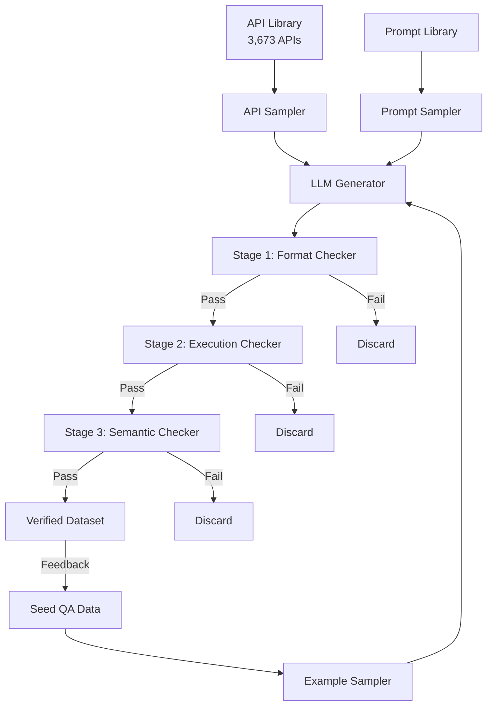

本記事は [APIGen: Automated Pipeline for Generating Verifiable and Diverse Function-Calling Datasets](https://arxiv.org/abs/2406.18518) の解説記事です。

## 論文概要（Abstract）

APIGenは、LLMのFunction Calling能力を向上させるための検証可能かつ多様な訓練データセットを自動生成するパイプラインである。21カテゴリにまたがる3,673個の実行可能なAPIを収集し、フォーマット検証・関数実行・意味的整合性検証の3段階フィルタリングを通じて60,000件の高品質データを生成した。著者らは、このデータで訓練した7Bパラメータモデル（xLAM-7B）がBerkeley Function-Calling Benchmark（BFCL）で6位を獲得し、GPT-4oやGemini-1.5-Proを上回ったと報告している。

この記事は [Zenn記事: Vercel AI SDK 6でFunction Callingを型安全に実装する入門ガイド](https://zenn.dev/0h_n0/articles/1a183cd273886f) の深掘りです。

## 情報源

- **arXiv ID**: 2406.18518
- **URL**: [https://arxiv.org/abs/2406.18518](https://arxiv.org/abs/2406.18518)
- **著者**: Zuxin Liu, Thai Hoang, Jianguo Zhang, et al.（Salesforce AI Research）
- **発表年**: 2024
- **分野**: cs.CL, cs.AI, cs.LG, cs.SE

## 背景と動機（Background & Motivation）

Function Callingエージェントの訓練には、多様で正確なデータセットが不可欠である。しかし、既存データセットには以下の品質問題があった。

**ToolBench**（Qin et al., 2024）は16,464のREST APIを収集したが、APIドキュメントの品質が不均一であり、実行不能なAPIが多数含まれていた。**ToolAlpaca**（Tang et al., 2023）はChatGPTで生成したAPI記述を用いたが、生成データの検証プロセスが不十分だった。**APIBank**（Li et al., 2023）はツール使用の対話データを提供したが、規模と多様性に限界があった。

これらの既存データセットに共通する問題は、生成したデータが実際に実行可能かどうかの検証が不十分である点にある。フォーマットは正しくても引数の型が誤っている、APIが存在しない関数をハルシネーションしている、実行結果がクエリの意図と合致しないといった問題が訓練データに混入し、モデル性能を劣化させていた。APIGenはこの問題を、実行ベースの検証パイプラインで解決する。

## 主要な貢献（Key Contributions）

- **検証可能なデータ生成パイプライン**: フォーマット・実行・意味の3段階検証により、データ品質を95.3%（人手評価）まで引き上げた
- **高品質データセットの公開**: 21カテゴリ、3,673 API、60,000エントリの`xlam-function-calling-60k`をHugging Faceで公開（CC BY 4.0）
- **小規模モデルの競争力実証**: 7Bモデルが BFCL で6位（GPT-4o、Llama3-70B超え）、1.3BモデルがGPT-3.5-Turbo超えを達成
- **並列Function Callingデータの初提供**: parallel / parallel multiple カテゴリの大規模訓練データを初めて公開

## 技術的詳細（Technical Details）

### パイプライン全体像

APIGenのデータ生成パイプラインは、APIサンプリング、クエリ・回答ペア生成、3段階検証、高品質データのフィードバックループから構成される。



### 3段階検証メカニズム

APIGenの設計上の鍵は、Function Callingの出力がAPIとして直接実行可能である点を活用していることにある。通常のチャットデータと異なり、関数呼び出しは実行してその結果を検証できるため、自動的な品質保証が可能になる。

**Stage 1: Format Checker（フォーマット検証）**

LLMの出力が所定のJSONスキーマに準拠しているかを検証する。具体的には以下を確認する。

- `query`と`answers`フィールドの存在とパース可能性
- 関数呼び出しのJSON構造が正しくパースできるか
- 呼び出された関数名がAPIライブラリに存在するか（ハルシネーション検出）
- 引数がAPI定義に存在するパラメータか
- Chain-of-Thought（`thought`フィールド）の有無

```python
def format_check(generated_output: dict, api_library: dict[str, APISpec]) -> bool:
    """Stage 1: フォーマット検証

    Args:
        generated_output: LLMが生成したJSON出力
        api_library: 利用可能なAPI定義のライブラリ

    Returns:
        検証通過ならTrue
    """
    # 必須フィールドの存在確認
    if "query" not in generated_output or "answers" not in generated_output:
        return False

    for call in generated_output["answers"]:
        # 関数名がAPIライブラリに存在するか
        if call["name"] not in api_library:
            return False  # ハルシネーション検出

        api_spec = api_library[call["name"]]
        # 引数がAPI定義に存在するパラメータか
        for arg_name in call["arguments"]:
            if arg_name not in api_spec.parameters:
                return False  # 未定義引数の検出

    return True
```

**Stage 2: Execution Checker（実行検証）**

Stage 1を通過した関数呼び出しを実際に実行する。Python関数はサブプロセスでimport・実行し、REST APIはエンドポイントにリクエストを送信する。実行に失敗した場合、エラーの種類（引数型エラー、無効パラメータ、ランタイムエラー、タイムアウト、構文エラー、必須引数不足）を記録して破棄する。

**Stage 3: Semantic Checker（意味的整合性検証）**

Stage 2を通過したデータに対し、別のLLMを用いて以下の5つの観点で検証する。

1. 関数呼び出しがクエリの目的に合致しているか
2. 利用可能な関数から適切な関数が選択されているか
3. 関数呼び出しの数がユーザーの意図と一致しているか
4. 実行結果にエラーが含まれていないか
5. 実行結果がクエリの目的に関連しているか

### データ多様性の確保

APIGenは4種類のクエリスタイルでデータを生成する。

| クエリスタイル | 説明 | 例 |
|:---|:---|:---|
| **Simple** | 1つのAPIに対する単一の関数呼び出し | 「パロアルトの天気は？」→ `get_weather("Palo Alto")` |
| **Multiple** | 複数APIから適切な1つを選択 | 天気API・株価API・ニュースAPIから天気APIを選択 |
| **Parallel** | 1つのAPIを複数回同時呼び出し | 「パロアルトとパリの天気は？」→ `get_weather` を2回 |
| **Parallel Multiple** | 複数APIの複数回同時呼び出し | 天気2都市 + 株価3銘柄を1応答で |

著者らは、parallel / parallel multiple カテゴリの大規模訓練データを公開したのは、公開データセットとしては初めてであると報告している。

多様性はさらに3つのサンプリング機構で確保される。

- **API Sampler**: APIライブラリからランダムに1つ以上のAPI仕様を抽出
- **Example Sampler**: シードデータから少数ショット例をサンプリング
- **Prompt Sampler**: コンテキストや難易度の異なるプロンプトテンプレートを選択

生成時の温度パラメータは0.7に設定し、各モデルで40,000データポイントの生成を目標とした。

### データフォーマット

APIGenはすべてのデータを統一JSON形式で管理する。

```json
{
  "query": "パロアルトの天気を摂氏で教えてください",
  "tools": [
    {
      "name": "weather_api.get_current_weather",
      "description": "指定された場所の現在の天気を取得する",
      "parameters": {
        "location": {
          "type": "string",
          "description": "都市名または地理的位置",
          "required": true
        },
        "units": {
          "type": "string",
          "description": "温度単位（Celsius, Fahrenheit）",
          "required": false
        }
      }
    }
  ],
  "answers": [
    {
      "name": "weather_api.get_current_weather",
      "arguments": {
        "location": "Palo Alto",
        "units": "Celsius"
      }
    }
  ]
}
```

この統一フォーマットにより、Python関数とREST APIの両方を同一のパイプラインで処理でき、フォーマット変換器を追加するだけで新しいAPIソースに対応できる。

## 実装のポイント（Implementation）

### APIソースの品質管理

著者らはToolBenchの16,464 REST APIを出発点として以下のクリーニングを行い、3,539件の実行可能なREST APIを得た。

1. **品質フィルタリング**: ドキュメント不備やパラメータなしAPIの除去
2. **アクセシビリティテスト**: 各エンドポイントに実際にリクエストを送信し、タイムアウトや無効なエンドポイントを除去
3. **Docstring再生成**: 品質の低いAPI説明文をLLMで再生成

加えて、BFCL（Berkeley Function-Calling Benchmark）の実行可能な評価カテゴリに触発されて、数学・金融・データ管理など多分野にわたる134個のPython関数を収集した。合計3,673 APIを21カテゴリに整理している。

### 生成LLMの選択と通過率

著者らは4つのLLMを用いてデータを生成し、各段階でのフィルタリング結果を報告している（論文Table 1より）。

| モデル | 検証済みデータ | Format失敗 | Execution失敗 | Semantic失敗 | 通過率 |
|:---|---:|---:|---:|---:|---:|
| DeepSeek-Coder-33B-Inst | 13,769 | 4,311 | 15,496 | 6,424 | 34.42% |
| Mixtral-8x7B-Inst | 15,385 | 3,311 | 12,341 | 7,963 | 38.46% |
| Mixtral-8x22B-Inst | 26,384 | 1,680 | 5,073 | 6,863 | 65.96% |
| DeepSeek-V2-Chat (236B) | 33,659 | 817 | 3,359 | 2,165 | 84.15% |

より大規模なモデルほど通過率が高い傾向にある。小規模モデルではフォーマット不備や実行エラーが多発するため、厳密な検証プロセスが特に重要である。最終的に、通過率の高いMixtral-8x22BとDeepSeek-V2-Chatの出力を合わせた約60,000件をデータセットとして公開している。

### 関連性検出データの生成

BFCL のRelevance Detectionカテゴリに対応するため、生成済みデータから8,000件の「関数呼び出し不要」データを作成した。具体的には、(1) 正解で使用されるツールをランダムに削除、(2) 必須パラメータをランダムに削除し、正解を空の関数呼び出しまたは拒否応答に再ラベリングした。

### 訓練設定

- **ベースモデル**: DeepSeek-Coder-1.3B-instruct, DeepSeek-Coder-7B-instruct-v1.5
- **学習率**: $5 \times 10^{-6}$
- **エポック数**: 4
- **オプティマイザ**: AdamW
- **最大長**: 2048トークン
- **バッチサイズ**: 6（デバイスあたり）、勾配累積2ステップ
- **学習率スケジューラ**: cosine（ウォームアップ50ステップ）
- **データ型**: BFloat16
- **GPU**: NVIDIA A100 40GB x 8

## Production Deployment Guide

APIGenの手法は、自社のFunction Callingモデルの訓練データ品質を改善するパイプラインとして実運用に適用できる。以下ではAWS上でのデプロイ構成を解説する。

### AWS実装パターン（コスト最適化重視）

APIGenパイプラインの本番運用では、API実行環境の分離とLLM推論のコスト管理が主要な設計課題となる。

**トラフィック量別の推奨構成**:

| 構成 | 規模 | サービス構成 | 月額概算 |
|:---|:---|:---|:---|
| Small | ~100 req/日 | Lambda + Bedrock + DynamoDB | $50-150 |
| Medium | ~1,000 req/日 | ECS Fargate + Bedrock + Aurora Serverless | $300-800 |
| Large | 10,000+ req/日 | EKS + Karpenter (Spot) + Bedrock Batch | $2,000-5,000 |

**Small構成の詳細**（~100 req/日）:
- **Lambda** (512MB, 最大15分): API実行サンドボックス + フォーマット検証 — $5/月
- **Bedrock** (Claude 3 Haiku): Semantic Checker用LLM推論 — $30-100/月
- **DynamoDB** (On-Demand): APIライブラリ・検証結果の永続化 — $5/月
- **S3**: 生成データセット保存 — $1/月
- **Step Functions**: 3段階検証のオーケストレーション — $5/月

**Large構成の詳細**（10,000+ req/日）:
- **EKS** (Karpenter, Spot優先): API実行ワーカー群 — $800-1,500/月
- **Bedrock Batch API**: 大量Semantic Check処理（50%コスト削減） — $600-2,000/月
- **Aurora Serverless v2**: APIライブラリ・実行結果のRDB管理 — $200-500/月
- **ElastiCache** (Redis): API応答キャッシュ（重複実行排除） — $100-200/月

**コスト削減テクニック**:
- Spot Instances活用（EKSワーカー）で最大90%削減
- Bedrock Batch API使用で推論コスト50%削減
- Prompt Caching有効化（Semantic Checker）で30-90%削減
- DynamoDB On-Demandモードで低トラフィック時のコスト最適化

> **注意**: 上記コスト試算は2026年5月時点のAWS ap-northeast-1（東京）リージョン料金に基づく概算値です。実際のコストはトラフィックパターン、バースト使用量、リージョンにより変動します。最新料金は[AWS料金計算ツール](https://calculator.aws/)で確認してください。

### Terraformインフラコード

**Small構成（Serverless）**: Lambda + Bedrock + DynamoDB

```hcl
# --- VPC基盤（NAT Gateway不使用でコスト削減） ---
resource "aws_vpc" "apigen" {
  cidr_block           = "10.0.0.0/16"
  enable_dns_support   = true
  enable_dns_hostnames = true
  tags = { Name = "apigen-vpc", Project = "apigen-pipeline" }
}

resource "aws_subnet" "private" {
  count             = 2
  vpc_id            = aws_vpc.apigen.id
  cidr_block        = cidrsubnet(aws_vpc.apigen.cidr_block, 8, count.index)
  availability_zone = data.aws_availability_zones.available.names[count.index]
  tags = { Name = "apigen-private-${count.index}" }
}

# --- IAMロール（最小権限原則） ---
resource "aws_iam_role" "lambda_apigen" {
  name = "apigen-lambda-role"
  assume_role_policy = jsonencode({
    Version = "2012-10-17"
    Statement = [{
      Action = "sts:AssumeRole"
      Effect = "Allow"
      Principal = { Service = "lambda.amazonaws.com" }
    }]
  })
}

resource "aws_iam_role_policy" "lambda_bedrock" {
  name = "apigen-bedrock-access"
  role = aws_iam_role.lambda_apigen.id
  policy = jsonencode({
    Version = "2012-10-17"
    Statement = [
      {
        Effect   = "Allow"
        Action   = ["bedrock:InvokeModel"]
        Resource = "arn:aws:bedrock:*::foundation-model/anthropic.claude-3-haiku-*"
      },
      {
        Effect   = "Allow"
        Action   = ["dynamodb:PutItem", "dynamodb:GetItem", "dynamodb:Query"]
        Resource = aws_dynamodb_table.apigen_results.arn
      },
      {
        Effect   = "Allow"
        Action   = ["s3:PutObject", "s3:GetObject"]
        Resource = "${aws_s3_bucket.apigen_datasets.arn}/*"
      }
    ]
  })
}

# --- Lambda関数（API実行サンドボックス） ---
resource "aws_lambda_function" "api_executor" {
  function_name = "apigen-api-executor"
  runtime       = "python3.12"
  handler       = "handler.lambda_handler"
  role          = aws_iam_role.lambda_apigen.arn
  timeout       = 900  # 15分（API実行タイムアウト考慮）
  memory_size   = 512

  environment {
    variables = {
      DYNAMODB_TABLE = aws_dynamodb_table.apigen_results.name
      S3_BUCKET      = aws_s3_bucket.apigen_datasets.id
    }
  }

  # KMS暗号化
  kms_key_arn = aws_kms_key.apigen.arn
}

# --- DynamoDB（On-Demandモード） ---
resource "aws_dynamodb_table" "apigen_results" {
  name         = "apigen-verification-results"
  billing_mode = "PAY_PER_REQUEST"
  hash_key     = "data_id"
  range_key    = "verification_stage"

  attribute {
    name = "data_id"
    type = "S"
  }
  attribute {
    name = "verification_stage"
    type = "S"
  }

  server_side_encryption { enabled = true }
  point_in_time_recovery { enabled = true }
}

# --- CloudWatchアラーム（コスト監視） ---
resource "aws_cloudwatch_metric_alarm" "lambda_errors" {
  alarm_name          = "apigen-lambda-error-rate"
  comparison_operator = "GreaterThanThreshold"
  evaluation_periods  = 2
  metric_name         = "Errors"
  namespace           = "AWS/Lambda"
  period              = 300
  statistic           = "Sum"
  threshold           = 10
  alarm_actions       = [aws_sns_topic.apigen_alerts.arn]
  dimensions = { FunctionName = aws_lambda_function.api_executor.function_name }
}
```

**Large構成（Container）**: EKS + Karpenter + Spot Instances

```hcl
# --- EKSクラスタ ---
module "eks" {
  source          = "terraform-aws-modules/eks/aws"
  version         = "~> 20.0"
  cluster_name    = "apigen-cluster"
  cluster_version = "1.31"
  vpc_id          = aws_vpc.apigen.id
  subnet_ids      = aws_subnet.private[*].id

  cluster_endpoint_public_access = false  # プライベートエンドポイントのみ

  # Karpenter用IAM
  enable_karpenter = true
  karpenter = { repository_username = data.aws_ecrpublic_authorization_token.token.user_name }
}

# --- Karpenter Provisioner（Spot優先、自動スケーリング） ---
resource "kubectl_manifest" "karpenter_nodepool" {
  yaml_body = yamlencode({
    apiVersion = "karpenter.sh/v1"
    kind       = "NodePool"
    metadata   = { name = "apigen-workers" }
    spec = {
      template = {
        spec = {
          requirements = [
            { key = "karpenter.sh/capacity-type", operator = "In", values = ["spot", "on-demand"] },
            { key = "node.kubernetes.io/instance-type", operator = "In",
              values = ["m6i.xlarge", "m6i.2xlarge", "m5.xlarge", "m5.2xlarge"] }
          ]
        }
      }
      limits   = { cpu = "128", memory = "512Gi" }
      disruption = { consolidationPolicy = "WhenEmpty", consolidateAfter = "60s" }
    }
  })
}

# --- Secrets Manager（API キー管理） ---
resource "aws_secretsmanager_secret" "bedrock_config" {
  name       = "apigen/bedrock-config"
  kms_key_id = aws_kms_key.apigen.id
}

# --- AWS Budgets（予算アラート） ---
resource "aws_budgets_budget" "apigen_monthly" {
  name         = "apigen-monthly-budget"
  budget_type  = "COST"
  limit_amount = "5000"
  limit_unit   = "USD"
  time_unit    = "MONTHLY"

  notification {
    comparison_operator       = "GREATER_THAN"
    threshold                 = 80
    threshold_type            = "PERCENTAGE"
    notification_type         = "ACTUAL"
    subscriber_email_addresses = ["ops-team@example.com"]
  }
}
```

### 運用・監視設定

**CloudWatch Logs Insights クエリ**（コスト異常検知・レイテンシ分析）:

```
# 1時間あたりのBedrock推論トークン使用量
fields @timestamp, @message
| filter @message like /bedrock_invoke/
| stats sum(input_tokens) as total_input, sum(output_tokens) as total_output by bin(1h)
| sort @timestamp desc

# API実行レイテンシ P95/P99
fields @timestamp, execution_duration_ms
| filter event = "api_execution"
| stats percentile(execution_duration_ms, 95) as p95,
        percentile(execution_duration_ms, 99) as p99 by bin(1h)
```

**CloudWatch アラーム設定**（Python boto3）:

```python
import boto3

cloudwatch = boto3.client("cloudwatch", region_name="ap-northeast-1")

def create_bedrock_token_alarm(sns_topic_arn: str) -> None:
    """Bedrockトークン使用量スパイク検知アラーム"""
    cloudwatch.put_metric_alarm(
        AlarmName="apigen-bedrock-token-spike",
        MetricName="InputTokenCount",
        Namespace="AWS/Bedrock",
        Statistic="Sum",
        Period=3600,
        EvaluationPeriods=1,
        Threshold=500000,
        ComparisonOperator="GreaterThanThreshold",
        AlarmActions=[sns_topic_arn],
    )
```

**X-Ray トレーシング設定**:

```python
from aws_xray_sdk.core import xray_recorder, patch_all

# boto3自動計装
patch_all()

@xray_recorder.capture("semantic_check")
def run_semantic_check(query: str, func_call: dict, execution_result: str) -> bool:
    """Semantic Checkerの実行をトレーシング

    Args:
        query: ユーザークエリ
        func_call: 生成された関数呼び出し
        execution_result: API実行結果

    Returns:
        意味的整合性検証の合否
    """
    subsegment = xray_recorder.current_subsegment()
    subsegment.put_annotation("query_length", len(query))
    subsegment.put_metadata("func_call", func_call)
    # ... Bedrock呼び出し
    return result
```

**Cost Explorer自動レポート**:

```python
import boto3
from datetime import date, timedelta

ce = boto3.client("ce", region_name="us-east-1")
sns = boto3.client("sns", region_name="ap-northeast-1")

def daily_cost_report(sns_topic_arn: str) -> None:
    """日次コストレポート取得・通知"""
    today = date.today()
    yesterday = today - timedelta(days=1)

    response = ce.get_cost_and_usage(
        TimePeriod={"Start": str(yesterday), "End": str(today)},
        Granularity="DAILY",
        Metrics=["UnblendedCost"],
        GroupBy=[{"Type": "DIMENSION", "Key": "SERVICE"}],
    )

    total = sum(
        float(g["Metrics"]["UnblendedCost"]["Amount"])
        for g in response["ResultsByTime"][0]["Groups"]
    )

    # Bedrock/Lambda/EKSコスト抽出
    service_costs = {
        g["Keys"][0]: float(g["Metrics"]["UnblendedCost"]["Amount"])
        for g in response["ResultsByTime"][0]["Groups"]
        if any(s in g["Keys"][0] for s in ["Bedrock", "Lambda", "EKS"])
    }

    if total > 100:
        sns.publish(
            TopicArn=sns_topic_arn,
            Subject="APIGen Cost Alert: ${:.2f}/day".format(total),
            Message=f"Total: ${total:.2f}\n{service_costs}",
        )
```

### コスト最適化チェックリスト

**アーキテクチャ選択**:
- [ ] トラフィック量に基づいて構成を選択（Small: Serverless / Medium: Hybrid / Large: Container）
- [ ] API実行環境をLLM推論から分離しているか

**リソース最適化**:
- [ ] EC2/EKS: Spot Instances優先（最大90%削減）
- [ ] Reserved Instances: 安定ワークロードに1年コミット（最大72%削減）
- [ ] Savings Plans: Compute Savings Plans検討
- [ ] Lambda: メモリサイズをPower Tuningで最適化（512MB-1024MB推奨）
- [ ] ECS/EKS: アイドル時のKarpenterによる自動スケールダウン

**LLMコスト削減**:
- [ ] Bedrock Batch API使用（大量Semantic Check処理で50%削減）
- [ ] Prompt Caching有効化（Semantic Checkerの類似プロンプトで30-90%削減）
- [ ] モデル選択ロジック（Format Check不要、Semantic CheckにHaiku使用）
- [ ] トークン数制限（生成出力の最大長を設定）

**監視・アラート**:
- [ ] AWS Budgets: 月次予算アラート設定
- [ ] CloudWatch アラーム: Bedrockトークン使用量・Lambda実行時間
- [ ] Cost Anomaly Detection: 自動異常検知有効化
- [ ] 日次コストレポート: Cost Explorer API + SNS通知

**リソース管理**:
- [ ] 未使用リソース（古いECRイメージ、不要S3データ）の定期削除
- [ ] タグ戦略: `Project=apigen`, `Environment=prod/dev` を全リソースに付与
- [ ] S3ライフサイクルポリシー: 90日超の中間データをGlacierに移行
- [ ] 開発環境: 夜間・週末のEKSノード停止（Karpenter TTL設定）
- [ ] CloudTrail/Config: 監査ログ有効化

## 実験結果（Results）

### BFCL ベンチマーク結果

著者らはBerkeley Function-Calling Benchmark（BFCL）で評価を行った（論文Table 2より、2024年6月15日時点のリーダーボード）。

| Rank | モデル | Overall Accuracy | AST Simple | AST Parallel | Exec Simple | Exec Parallel |
|:---|:---|---:|---:|---:|---:|---:|
| 1 | GPT-4-0125-Preview (Prompt) | 88.00 | 88.36 | 90.50 | 99.41 | 84.00 |
| 3 | Gemini-1.5-Pro (FC) | 86.35 | 80.18 | 91.00 | 91.76 | 76.00 |
| **6** | **xLAM-7B (FC)** | **85.65** | **80.55** | **90.00** | **90.59** | **86.00** |
| 11 | GPT-4o (FC) | 82.94 | 78.91 | 87.50 | 86.47 | 82.00 |
| **24** | **xLAM-1B (FC)** | **74.41** | **75.09** | **76.50** | **79.41** | **78.00** |
| 33 | GPT-3.5-Turbo (FC) | 63.88 | 61.45 | 90.50 | 93.53 | 82.00 |

注目すべき点は以下の通り。

- **xLAM-7B**（7Bパラメータ）がOverall Accuracy 85.65%で6位を獲得し、GPT-4o（82.94%）、GPT-4-turbo FC（82.88%）、Llama3-70B（83.88%）を上回った
- **xLAM-1B**（1.3Bパラメータ）が74.41%でGPT-3.5-Turbo（63.88%）を大幅に上回った
- ベースモデルのDeepSeek-Coder-v1.5は45位（40.41%）であり、APIGenデータによる訓練で45位→6位への劇的な順位上昇が確認された

### Ablation Study: 検証段階の効果

著者らは、Stage 2（Execution Checker）やStage 3（Semantic Checker）でフィルタリングされたデータを訓練セットに戻した場合の性能劣化を検証した（論文Figure 5より）。

- **+Fail Semantic Data**: Stage 3で除外されたデータを追加 → Overall Accuracyが約2-3%低下
- **+Fail Execution Data**: Stage 2で除外されたデータも追加 → さらに約3-5%低下

この性能劣化はモデルサイズが小さいほど顕著であり、1.3Bモデルでは検証なしデータの追加による影響がより大きかった。この結果は、生成データをそのまま使用するのではなく、厳密な検証プロセスが不可欠であることを示している。

### 人手評価

600サンプルに対して3名の評価者が手動検査を行った結果、問題のあるサンプルは28件（4.7%）のみであり、95.3%が高品質と判定された（論文Appendix A.3より）。問題の大半はパラメータ値の不正確さやAPI呼び出し回数の過多であった。

## 実運用への応用（Practical Applications）

### AI SDKのtool定義テストデータ生成

[Zenn記事](https://zenn.dev/0h_n0/articles/1a183cd273886f)で解説されているVercel AI SDK 6のFunction Calling実装において、APIGenの手法はtool定義のテストデータ自動生成に直接応用できる。

**具体的な応用シナリオ**:

1. **tool定義のカバレッジテスト**: AI SDKの`tool()`で定義した関数に対し、APIGenの4カテゴリ（simple, multiple, parallel, parallel multiple）のテストデータを自動生成し、エッジケースを網羅的にテストする
2. **型安全性の検証**: Zodスキーマで定義したパラメータ型に対し、Stage 1（フォーマット検証）の手法を適用して型不整合を検出する
3. **Fine-tuning用データ品質管理**: 自社ドメインのFunction Calling訓練データを生成する際に、3段階検証で品質を担保する

**スケーリング上の考慮点**:
- 3,673 APIに対して60,000件のデータを生成（1 APIあたり約16件）
- 通過率は生成LLMの能力に依存（34-84%）。弱いモデルでも検証パイプラインが品質を担保
- API実行環境のサンドボックス化が必須（悪意のあるAPI呼び出しへの防御）

## 関連研究（Related Work）

- **ToolBench**（Qin et al., 2024）: 16,464 REST APIからの指示チューニングデータセット。大規模だが検証プロセスが不十分で、APIGenの動機となった
- **Gorilla**（Patil et al., 2023）: LLMをAPIドキュメントと接続する手法。OpenFunctions-v2を公開しているが、訓練データは非公開
- **Toolformer**（Schick et al., 2024）: LLMに自らツール使用を学習させる先駆的研究。計算機・検索API等の限定的なツールが対象
- **AgentOhana**（Zhang et al., 2024）: 統一的なデータ・訓練パイプライン。APIGenと同じSalesforce AI Researchグループによる研究で、xLAMモデルの訓練基盤を提供

## まとめと今後の展望

APIGenは「データ品質がモデルサイズを補える」ことを実証した研究である。3段階の自動検証パイプラインにより、7Bモデルが数十倍のパラメータを持つGPT-4oを上回る性能を達成した。Function Callingという検証可能な出力形式を持つタスクの特性を巧みに活用した設計は、他のコード生成・構造化出力タスクへの応用可能性を示唆している。

著者らは今後の課題として、REST API・Python関数以外のAPIタイプへの拡張、マルチターン対話への対応、より複雑なエージェント・ツール間インタラクションの実現を挙げている。

## 参考文献

- **arXiv**: [https://arxiv.org/abs/2406.18518](https://arxiv.org/abs/2406.18518)
- **Dataset**: [https://huggingface.co/datasets/Salesforce/xlam-function-calling-60k](https://huggingface.co/datasets/Salesforce/xlam-function-calling-60k)
- **Project Homepage**: [https://apigen-pipeline.github.io/](https://apigen-pipeline.github.io/)
- **Related Zenn article**: [https://zenn.dev/0h_n0/articles/1a183cd273886f](https://zenn.dev/0h_n0/articles/1a183cd273886f)
