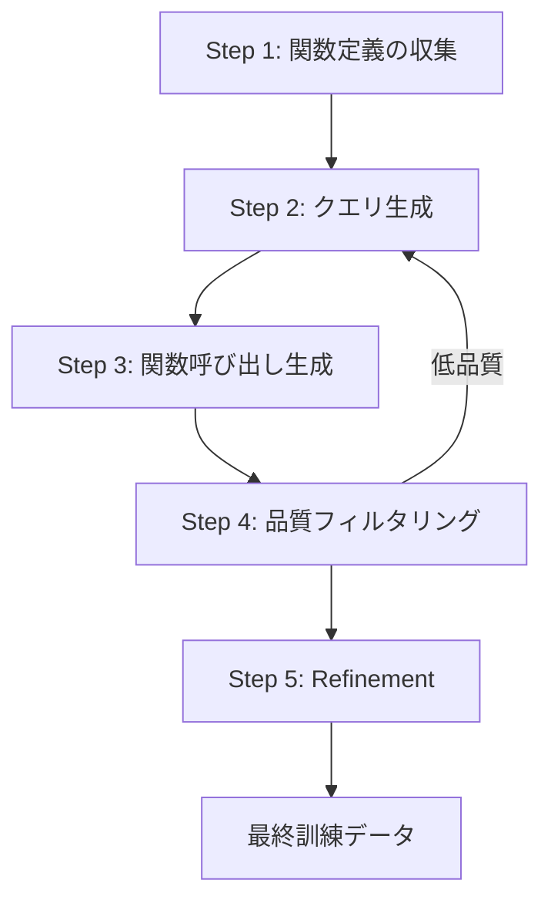

本記事は [NexusRaven: a Commercially-Permissive Language Model for Function Calling](https://openreview.net/forum?id=5lcPe6DqfI) の解説記事です。

## 論文概要（Abstract）

NexusRaven-13Bは、CodeLLAMA-13Bをベースとしたfunction calling特化のオープンソース言語モデルである。著者らは、多くのオープンソースモデルが高品質な訓練データの生成にGPT-4等のプロプライエタリLLMに依存している問題を指摘し、GPT-4蒸留を用いないmulti-step data refinement手法を提案している。ゼロショット設定でGPT-3.5に匹敵する精度を達成し、demonstration retrieval augmentationと組み合わせることでGPT-4を上回る性能を示したと報告されている。後継モデルNexusRaven-V2では、ネスト関数呼び出し・並列関数呼び出しに対応し、複合関数シナリオでGPT-4を最大7%上回る精度を達成したとされる。

この記事は [Zenn記事: Vercel AI SDK 6でFunction Callingを型安全に実装する入門ガイド](https://zenn.dev/0h_n0/articles/1a183cd273886f) の深掘りです。

## 情報源

- **発表会議**: NeurIPS 2023 Workshop FMDM（Functional Mechanisms for Decision Making）
- **URL**: [https://openreview.net/forum?id=5lcPe6DqfI](https://openreview.net/forum?id=5lcPe6DqfI)
- **著者**: Venkat Krishna Srinivasan, Zhen Dong, Banghua Zhu, Brian Yu, Damon Mosk-Aoyama, Kurt Keutzer, Jiantao Jiao, Jian Zhang
- **発表年**: 2023
- **分野**: cs.CL, cs.LG
- **GitHub（V1）**: [https://github.com/nexusflowai/NexusRaven](https://github.com/nexusflowai/NexusRaven)
- **GitHub（V2）**: [https://github.com/nexusflowai/NexusRaven-V2](https://github.com/nexusflowai/NexusRaven-V2)

## 背景と動機（Background & Motivation）

LLMのfunction calling（ツール使用）能力は、エージェントシステムやAPIオーケストレーションの中核技術として注目を集めている。しかし、2023年時点では以下の課題が存在していた。

**プロプライエタリLLMへの依存**: 高品質なfunction calling能力を持つモデルの多くは、GPT-4が生成したデータを訓練に使用（蒸留）しており、OpenAIの利用規約により商用利用が制限される。ToolAlpacaやToolLLMなどのオープンソースモデルも、訓練データの生成過程でGPT-4に依存しているため、同様のライセンス問題を抱えていた。

**商用利用可能なモデルの不在**: 企業がfunction callingをプロダクションに導入する際、プロプライエタリAPI（GPT-4, Claude等）に依存するか、ライセンス的にグレーなオープンソースモデルを使うかの二択を迫られていた。GPT-4蒸留データを含まない、商用利用可能なオープンソースモデルが求められていた。

**単一関数呼び出しの限界**: 初期のfunction callingモデルは単一の関数呼び出しのみに対応しており、実務で必要なネスト呼び出し（関数の戻り値を別の関数の引数に使用）や並列呼び出し（複数の独立した関数を同時実行）には対応していなかった。

## 主要な貢献（Key Contributions）

- **GPT-4蒸留なしの訓練パイプライン**: multi-step data refinementにより、プロプライエタリLLMに依存しない高品質な訓練データ生成手法を確立。商用利用可能なライセンスでのモデル提供を実現
- **ゼロショットfunction calling精度の達成**: NexusRaven-13BがGPT-3.5に匹敵するゼロショットfunction calling精度を達成。demonstration retrieval augmentationとの組み合わせでGPT-4を上回る精度を報告
- **呼び出し根拠（justification）の生成**: function callの選択理由を自然言語で説明する機能を搭載。デバッグやエラー分析に有用
- **NexusRaven-V2での機能拡張**: ネスト関数呼び出し（nested calls）、並列関数呼び出し（parallel calls）、単純呼び出し（single calls）の3タイプに対応。複合関数シナリオでGPT-4を最大7%上回る精度を達成（著者ら報告）
- **包括的な評価フレームワーク**: サイバーセキュリティツール（CVE/CPE Search, VirusTotal）、地理情報API（Places API）、気候データAPI等、実務的なドメインを網羅した8つの評価データセットを公開

## 技術的詳細（Technical Details）

### アーキテクチャ

NexusRavenはCodeLLAMA-13Bをベースモデルとして採用している。CodeLLAMAはMeta AIが公開したLLAMA 2のコード特化バリアントであり、コード生成・理解能力に優れている。著者らは、function callingタスクがコード生成と構造的に類似していることに着目し、汎用LLMではなくコード特化モデルをベースに選択したと述べている。

モデルの入出力フォーマットは以下の構造を持つ。

**入力フォーマット**:

```
<human>:
OPTION:
<func_start>def search_cve(keyword: str, limit: int = 10)<func_end>
<docstring_start>
"""Search CVE database for vulnerabilities.
Args:
    keyword (str): Search keyword for CVE lookup.
    limit (int): Maximum number of results. Default is 10.
"""
<docstring_end>

OPTION:
<func_start>def get_virus_report(hash: str)<func_end>
<docstring_start>
"""Get VirusTotal analysis report for a file hash.
Args:
    hash (str): SHA-256 hash of the file to analyze.
"""
<docstring_end>

User Query: Find the latest 5 CVEs related to Log4j
Please pick a function and fill in the arguments.
<human_end>
```

**出力フォーマット**:

```
Call: search_cve(keyword="Log4j", limit=5)
Thought: The user wants to find CVE entries related to Log4j...
```

### Multi-Step Data Refinement

著者らが提案するmulti-step data refinementは、GPT-4蒸留に頼らず高品質な訓練データを生成するための手法である。このパイプラインの核心は、段階的なデータ品質向上プロセスにある。



1. **関数定義の収集**: Python関数のシグネチャとdocstringのペアを大量に収集
2. **クエリ生成**: 各関数に対して、ユーザーが実際に投げそうな自然言語クエリを生成
3. **関数呼び出し生成**: クエリに対する正しい関数呼び出し（引数込み）を生成
4. **品質フィルタリング**: 生成された関数呼び出しの構文的・意味的正確性を検証。不正確なサンプルは除外
5. **Refinement**: フィルタリングを通過したデータに対して、さらにエッジケースの追加や引数の多様化を実施

このプロセスの重要な点は、各ステップでプロプライエタリLLMを使用しないことである。著者らは、既存のオープンソースモデルと規則ベースのフィルタリングを組み合わせることで、十分な品質のデータを生成できると報告している。

### NexusRaven-V2の拡張

V2では、関数呼び出しの3つのパターンに対応するよう訓練データとモデルアーキテクチャを拡張している。

**単純呼び出し（Single Call）**:

$$
f: \mathcal{Q} \times \mathcal{F} \rightarrow \mathcal{C}
$$

ここで、$\mathcal{Q}$はユーザークエリの集合、$\mathcal{F}$は利用可能な関数定義の集合、$\mathcal{C}$は関数呼び出しの集合である。

**ネスト呼び出し（Nested Call）**:

$$
c_{\text{nested}} = f_{\text{outer}}(\ldots, f_{\text{inner}}(\text{args}), \ldots)
$$

外側の関数の引数として内側の関数の戻り値を使用するパターン。例: `send_email(to="admin", body=get_cve_summary(cve_id="CVE-2024-1234"))`

**並列呼び出し（Parallel Call）**:

$$
\{c_1, c_2, \ldots, c_k\} = \{f_1(\text{args}_1), f_2(\text{args}_2), \ldots, f_k(\text{args}_k)\}
$$

互いに独立した複数の関数呼び出しを同時に生成するパターン。

### 推論パイプライン

著者らは推論時の効率化として、stop criteriaの活用を推奨している。モデルは関数呼び出しの後にReflection（振り返り）を生成する傾向があるが、これは精度向上に寄与しない場合が多いと報告されている。そのため、`"\nReflection:"`をstop sequenceとして設定し、トークン消費を抑制することが推奨されている。

## 実装のポイント（Implementation）

### 推論環境

NexusRavenの推論にはGPU環境が必要であり、著者らはA100 40GBでの検証を報告している。HuggingFace Transformersライブラリを使用した推論コードは以下の通りである。

```python
from transformers import pipeline

pipe = pipeline(
    "text-generation",
    model="Nexusflow/NexusRaven-V2-13B",
    torch_dtype="auto",
    device_map="auto",
)
```

### プロンプト設計の要点

1. **関数定義はPython形式**: 型ヒント付きのPython関数シグネチャとdocstringを提供する。JSON Schema形式ではなく、Python native形式が必須
2. **docstringの品質が精度に直結**: 引数の説明が不十分な場合、関数呼び出しの精度が大幅に低下する。各引数の型、デフォルト値、使用例を含めることが推奨される
3. **stop criteriaの設定**: `["\nReflection:"]`をstop sequenceに設定し、不要なトークン生成を抑制する
4. **関数候補数の制限**: 利用可能な関数が多すぎる場合、関連する関数のみをフィルタリングしてプロンプトに含めることで精度向上が期待できる

### LangChain統合

NexusRavenはLangChainとの統合をサポートしており、既存のツール定義をそのまま活用できる。ただし、LangChainのtool decoratorで定義されたdocstringがNexusRavenの期待する形式と一致することを確認する必要がある。

## Production Deployment Guide

NexusRavenは13Bパラメータのオープンソースモデルであり、セルフホスティングによるプロダクション展開が可能である。以下では、AWS上での具体的なデプロイ構成とコスト最適化戦略を示す。

### AWS実装パターン（コスト最適化重視）

NexusRaven-V2-13Bは13Bパラメータモデルであるため、推論にはGPUインスタンスが必要となる。FP16精度で約26GBのGPUメモリを消費する。

**トラフィック量別の推奨構成**:

| 構成 | トラフィック | インフラ | GPU | 月額コスト（概算） |
|------|------------|---------|-----|-------------------|
| Small | ~100 req/日 | EC2単体 + S3 | g5.2xlarge (A10G 24GB) x1 | $800-1,200 |
| Medium | ~1,000 req/日 | ECS Fargate + ALB | g5.2xlarge x2 | $2,000-3,500 |
| Large | 10,000+ req/日 | EKS + Karpenter + Spot | g5.2xlarge x4-8 (Spot) | $4,000-8,000 |

*注: 上記は2026年5月時点のAWS ap-northeast-1（東京）リージョン料金に基づく概算値。実際のコストはトラフィックパターン、バースト使用量、Spotの可用性により変動する。最新料金はAWS料金計算ツールで確認を推奨。*

**Small構成の詳細** (~100 req/日):
- EC2 g5.2xlarge: 8 vCPU, 32GB RAM, A10G 24GB GPU
  - オンデマンド: ~$1.212/時間 x 730時間 = ~$885/月
  - INT8量子化により24GB GPUに収容可能
- S3: モデルウェイト保存 (~26GB) = ~$0.60/月
- CloudWatch: ログ・メトリクス = ~$15/月

**コスト削減テクニック**:
- **Spot Instances活用**: g5.2xlargeのSpot価格は最大70%割引（~$365/月）。ただし中断リスクがあるため、リクエストキューイングとの併用を推奨
- **Reserved Instances（1年）**: 最大40%割引（~$530/月）。安定的なワークロードに適用
- **INT8/GPTQ量子化**: モデルサイズを半減し、より小型のGPUインスタンス（g5.xlarge, A10G 24GB）で動作可能にする。精度劣化は1-2%程度と報告されているケースが多い
- **バッチ推論**: リアルタイム性が不要な場合、リクエストをバッチ化して処理することでGPU利用効率を向上

### Terraformインフラコード

**Small構成（EC2単体 + vLLM）**:

```hcl
# --- VPC基盤 ---
module "vpc" {
  source  = "terraform-aws-modules/vpc/aws"
  version = "~> 5.0"

  name = "nexusraven-vpc"
  cidr = "10.0.0.0/16"

  azs             = ["ap-northeast-1a"]
  public_subnets  = ["10.0.1.0/24"]
  private_subnets = ["10.0.2.0/24"]

  enable_nat_gateway = true
  single_nat_gateway = true  # コスト削減: NAT Gateway 1台

  tags = {
    Project     = "nexusraven"
    Environment = "production"
    ManagedBy   = "terraform"
  }
}

# --- IAMロール（最小権限） ---
resource "aws_iam_role" "nexusraven_ec2" {
  name = "nexusraven-ec2-role"

  assume_role_policy = jsonencode({
    Version = "2012-10-17"
    Statement = [{
      Action = "sts:AssumeRole"
      Effect = "Allow"
      Principal = { Service = "ec2.amazonaws.com" }
    }]
  })
}

resource "aws_iam_role_policy" "nexusraven_s3_read" {
  name = "nexusraven-s3-read"
  role = aws_iam_role.nexusraven_ec2.id

  policy = jsonencode({
    Version = "2012-10-17"
    Statement = [{
      Effect   = "Allow"
      Action   = ["s3:GetObject", "s3:ListBucket"]
      Resource = [
        aws_s3_bucket.model_weights.arn,
        "${aws_s3_bucket.model_weights.arn}/*"
      ]
    }]
  })
}

resource "aws_iam_instance_profile" "nexusraven" {
  name = "nexusraven-ec2-profile"
  role = aws_iam_role.nexusraven_ec2.name
}

# --- S3バケット（モデルウェイト） ---
resource "aws_s3_bucket" "model_weights" {
  bucket = "nexusraven-model-weights-${data.aws_caller_identity.current.account_id}"

  tags = { Project = "nexusraven" }
}

resource "aws_s3_bucket_server_side_encryption_configuration" "model_weights" {
  bucket = aws_s3_bucket.model_weights.id

  rule {
    apply_server_side_encryption_by_default {
      sse_algorithm = "aws:kms"
    }
  }
}

data "aws_caller_identity" "current" {}

# --- EC2（GPU推論サーバー） ---
resource "aws_instance" "nexusraven" {
  ami                    = data.aws_ami.deep_learning.id
  instance_type          = "g5.2xlarge"  # A10G 24GB GPU
  subnet_id              = module.vpc.private_subnets[0]
  iam_instance_profile   = aws_iam_instance_profile.nexusraven.name
  vpc_security_group_ids = [aws_security_group.nexusraven.id]

  root_block_device {
    volume_size = 100  # GB（モデル+vLLM）
    volume_type = "gp3"
    encrypted   = true
  }

  user_data = <<-EOF
    #!/bin/bash
    pip install vllm
    aws s3 sync s3://${aws_s3_bucket.model_weights.id}/NexusRaven-V2-13B /opt/model
    python -m vllm.entrypoints.openai.api_server \
      --model /opt/model \
      --port 8000 \
      --max-model-len 4096
  EOF

  tags = {
    Name    = "nexusraven-inference"
    Project = "nexusraven"
  }
}

data "aws_ami" "deep_learning" {
  most_recent = true
  owners      = ["amazon"]

  filter {
    name   = "name"
    values = ["Deep Learning AMI GPU PyTorch *-Ubuntu 22.04-*"]
  }
}

# --- セキュリティグループ ---
resource "aws_security_group" "nexusraven" {
  name_prefix = "nexusraven-"
  vpc_id      = module.vpc.vpc_id

  ingress {
    from_port   = 8000
    to_port     = 8000
    protocol    = "tcp"
    cidr_blocks = [module.vpc.vpc_cidr_block]  # VPC内部のみ
  }

  egress {
    from_port   = 0
    to_port     = 0
    protocol    = "-1"
    cidr_blocks = ["0.0.0.0/0"]
  }
}

# --- CloudWatchアラーム（コスト監視） ---
resource "aws_cloudwatch_metric_alarm" "gpu_utilization_low" {
  alarm_name          = "nexusraven-gpu-utilization-low"
  comparison_operator = "LessThanThreshold"
  evaluation_periods  = 6      # 30分間
  metric_name         = "GPUUtilization"
  namespace           = "Custom/NexusRaven"
  period              = 300
  statistic           = "Average"
  threshold           = 10     # 10%未満
  alarm_description   = "GPU utilization is below 10% for 30 minutes"
  alarm_actions       = [aws_sns_topic.alerts.arn]
}

resource "aws_sns_topic" "alerts" {
  name = "nexusraven-alerts"
}
```

**Large構成（EKS + Karpenter + Spot）**:

```hcl
# --- EKSクラスタ ---
module "eks" {
  source  = "terraform-aws-modules/eks/aws"
  version = "~> 20.0"

  cluster_name    = "nexusraven-cluster"
  cluster_version = "1.30"

  vpc_id     = module.vpc.vpc_id
  subnet_ids = module.vpc.private_subnets

  cluster_endpoint_public_access = false  # プライベートアクセスのみ

  eks_managed_node_groups = {
    system = {
      instance_types = ["m5.large"]
      min_size       = 1
      max_size       = 3
      desired_size   = 2
    }
  }

  tags = {
    Project     = "nexusraven"
    Environment = "production"
  }
}

# --- Karpenter Provisioner（Spot優先） ---
resource "kubectl_manifest" "karpenter_provisioner" {
  yaml_body = <<-YAML
    apiVersion: karpenter.sh/v1beta1
    kind: NodePool
    metadata:
      name: gpu-spot
    spec:
      template:
        spec:
          requirements:
            - key: node.kubernetes.io/instance-type
              operator: In
              values: ["g5.2xlarge", "g5.4xlarge"]
            - key: karpenter.sh/capacity-type
              operator: In
              values: ["spot", "on-demand"]  # Spot優先
            - key: topology.kubernetes.io/zone
              operator: In
              values: ["ap-northeast-1a", "ap-northeast-1c"]
          nodeClassRef:
            name: default
      limits:
        cpu: "64"
        nvidia.com/gpu: "8"
      disruption:
        consolidationPolicy: WhenUnderutilized
  YAML
}

# --- Secrets Manager ---
resource "aws_secretsmanager_secret" "nexusraven_config" {
  name = "nexusraven/inference-config"
}

resource "aws_secretsmanager_secret_version" "nexusraven_config" {
  secret_id = aws_secretsmanager_secret.nexusraven_config.id
  secret_string = jsonencode({
    model_path    = "Nexusflow/NexusRaven-V2-13B"
    max_model_len = 4096
    gpu_memory_utilization = 0.9
  })
}

# --- AWS Budgets ---
resource "aws_budgets_budget" "nexusraven" {
  name         = "nexusraven-monthly"
  budget_type  = "COST"
  limit_amount = "8000"
  limit_unit   = "USD"
  time_unit    = "MONTHLY"

  notification {
    comparison_operator       = "GREATER_THAN"
    threshold                 = 80
    threshold_type            = "PERCENTAGE"
    notification_type         = "ACTUAL"
    subscriber_email_addresses = ["alerts@example.com"]
  }
}
```

### 運用・監視設定

**CloudWatch Logs Insights クエリ**（コスト異常検知）:

```
# 1時間あたりのリクエスト数とレイテンシ分析
fields @timestamp, @message
| filter @message like /inference_request/
| stats count() as request_count,
        avg(duration_ms) as avg_latency,
        pct(duration_ms, 95) as p95_latency,
        pct(duration_ms, 99) as p99_latency
  by bin(1h)
| sort @timestamp desc
```

**CloudWatchアラーム設定コード（Python）**:

```python
import boto3

cloudwatch = boto3.client("cloudwatch", region_name="ap-northeast-1")


def create_inference_alarms(instance_id: str, sns_topic_arn: str) -> None:
    """NexusRaven推論サーバーの監視アラームを作成する。

    Args:
        instance_id: EC2インスタンスID
        sns_topic_arn: 通知先SNSトピックARN
    """
    # GPU使用率スパイク検知
    cloudwatch.put_metric_alarm(
        AlarmName="nexusraven-gpu-spike",
        MetricName="GPUUtilization",
        Namespace="Custom/NexusRaven",
        Statistic="Average",
        Period=300,
        EvaluationPeriods=3,
        Threshold=95,
        ComparisonOperator="GreaterThanThreshold",
        AlarmActions=[sns_topic_arn],
        AlarmDescription="GPU utilization exceeds 95% for 15 minutes",
    )

    # 推論レイテンシ異常検知
    cloudwatch.put_metric_alarm(
        AlarmName="nexusraven-latency-high",
        MetricName="InferenceLatencyMs",
        Namespace="Custom/NexusRaven",
        Statistic="p99",
        Period=300,
        EvaluationPeriods=2,
        Threshold=5000,  # 5秒
        ComparisonOperator="GreaterThanThreshold",
        AlarmActions=[sns_topic_arn],
        AlarmDescription="P99 inference latency exceeds 5 seconds",
    )
```

**X-Rayトレーシング設定コード（Python）**:

```python
from aws_xray_sdk.core import xray_recorder, patch_all
from aws_xray_sdk.core.models.subsegment import Subsegment

# boto3自動計装
patch_all()


def trace_inference(func_name: str, query: str, model_output: str) -> None:
    """NexusRaven推論をX-Rayでトレースする。

    Args:
        func_name: 呼び出された関数名
        query: ユーザークエリ
        model_output: モデル出力
    """
    subsegment: Subsegment = xray_recorder.begin_subsegment("nexusraven_inference")
    subsegment.put_annotation("function_called", func_name)
    subsegment.put_annotation("model", "NexusRaven-V2-13B")
    subsegment.put_metadata("query", query, "inference")
    subsegment.put_metadata("output_tokens", len(model_output.split()), "inference")
    xray_recorder.end_subsegment()
```

**Cost Explorer自動レポート（Python）**:

```python
import boto3
from datetime import datetime, timedelta


def get_daily_cost_report(sns_topic_arn: str, threshold_usd: float = 100.0) -> dict:
    """日次コストレポートを取得し、閾値超過時にSNS通知する。

    Args:
        sns_topic_arn: 通知先SNSトピックARN
        threshold_usd: アラート閾値（USD/日）

    Returns:
        コストレポートの辞書
    """
    ce = boto3.client("ce", region_name="us-east-1")
    sns = boto3.client("sns", region_name="ap-northeast-1")

    end = datetime.utcnow().strftime("%Y-%m-%d")
    start = (datetime.utcnow() - timedelta(days=1)).strftime("%Y-%m-%d")

    response = ce.get_cost_and_usage(
        TimePeriod={"Start": start, "End": end},
        Granularity="DAILY",
        Metrics=["UnblendedCost"],
        Filter={
            "Tags": {
                "Key": "Project",
                "Values": ["nexusraven"],
            }
        },
        GroupBy=[{"Type": "DIMENSION", "Key": "SERVICE"}],
    )

    total_cost = sum(
        float(group["Metrics"]["UnblendedCost"]["Amount"])
        for result in response["ResultsByTime"]
        for group in result["Groups"]
    )

    if total_cost > threshold_usd:
        sns.publish(
            TopicArn=sns_topic_arn,
            Subject=f"NexusRaven Cost Alert: ${total_cost:.2f}/day",
            Message=f"Daily cost ${total_cost:.2f} exceeds threshold ${threshold_usd:.2f}",
        )

    return {"date": start, "total_cost_usd": total_cost, "details": response}
```

### コスト最適化チェックリスト

**アーキテクチャ選択**:
- [ ] トラフィック量に応じた構成選択（Small/Medium/Large）
- [ ] リアルタイム推論 vs バッチ推論の要件整理
- [ ] マルチリージョン展開の要否判断

**リソース最適化**:
- [ ] EC2: Spot Instances優先（g5.2xlarge Spotで最大70%削減）
- [ ] Reserved Instances: 1年コミットで最大40%削減
- [ ] Savings Plans: Compute Savings Plansの検討
- [ ] モデル量子化: INT8/GPTQで必要GPUメモリを半減
- [ ] vLLMのcontinuous batching有効化でスループット向上
- [ ] アイドル時のスケールダウン（EKS Karpenter consolidation）

**LLMコスト削減**:
- [ ] バッチ推論の活用（非リアルタイム処理）
- [ ] KVキャッシュの最適化（max_model_len調整）
- [ ] モデル選択ロジック（簡単なクエリはより小型のモデルで処理）
- [ ] トークン数制限（stop criteria設定で不要なReflection生成を抑制）
- [ ] プロンプトの関数候補数を最小限に絞る

**監視・アラート**:
- [ ] AWS Budgets設定（月次予算アラート）
- [ ] CloudWatchアラーム（GPU使用率、レイテンシ）
- [ ] Cost Anomaly Detection有効化
- [ ] 日次コストレポート自動送信
- [ ] GPU使用率低下アラート（インスタンス停止判断用）

**リソース管理**:
- [ ] 未使用EBSボリューム・スナップショット削除
- [ ] Projectタグ戦略の徹底
- [ ] S3ライフサイクルポリシー（古いモデルウェイトの自動削除）
- [ ] 開発環境の夜間・週末停止スケジュール設定
- [ ] AMIの定期的なクリーンアップ

## 実験結果（Results）

### NexusRaven V1の評価

著者らは、サイバーセキュリティ、地理情報、ウイルス解析等の実務的なドメインを対象とした評価を実施している。以下は論文から報告されている主要な結果である。

| モデル | CVE/CPE Search | VirusTotal | ToolAlpaca | 備考 |
|--------|---------------|------------|------------|------|
| NexusRaven-13B | 95% | 95% | 報告あり | ゼロショット |
| GPT-4 | 64% | 64% | 報告あり | ゼロショット |
| GPT-3.5 | 比較対象 | 比較対象 | 比較対象 | ゼロショット |
| CodeLlama-13B Instruct | ベースライン | ベースライン | ベースライン | ファインチューニングなし |

著者らは、NexusRavenがサイバーセキュリティツール（CVE/CPE Search, VirusTotal）の使用において95%の成功率を達成し、GPT-4の64%を大幅に上回ったと報告している。ただし、この結果は特定のドメインにおけるゼロショット評価であり、汎用的なfunction calling能力を直接比較するものではないことに留意が必要である。

### NexusRaven V2の評価

V2では、Berkeley Function-Calling Leaderboard（BFCL）を含むより広範なベンチマークで評価が行われている。著者らの報告によると、以下の結果が得られている。

- **ネスト関数呼び出し**: GPT-4を最大7%上回る精度
- **並列関数呼び出し**: GPT-4に匹敵する精度
- **単純関数呼び出し**: GPT-3.5を上回り、GPT-4に迫る精度

V2の評価データセットは8種類が公開されており、セキュリティAPI（VirusTotal, NVDLibrary）、地理情報（Places API）、気候データ等の実務的なドメインをカバーしている。著者らは、これらの評価関数がV2の訓練データに含まれていないことを強調しており、ゼロショット汎化能力の高さを示す根拠としている。

## 実運用への応用（Practical Applications）

### Vercel AI SDKとの統合

本記事の関連Zenn記事「Vercel AI SDK 6でFunction Callingを型安全に実装する入門ガイド」では、OpenAI APIを通じたfunction callingの実装が紹介されている。NexusRavenはOpenAI互換のREST APIを提供するvLLMサーバー経由でデプロイ可能であるため、Vercel AI SDKのbaseURL設定を変更するだけでセルフホスティングモデルに切り替えることが可能である。

```typescript
import { createOpenAI } from "@ai-sdk/openai";

// NexusRaven vLLMサーバーをOpenAI互換APIとして使用
const nexusraven = createOpenAI({
  baseURL: "http://nexusraven-server:8000/v1",
  apiKey: "dummy", // セルフホスティングのため不要だがSDKが要求
});
```

### プロダクション適用の考慮事項

NexusRavenのプロダクション適用を検討する際、以下の点を考慮する必要がある。

1. **コスト構造の変化**: APIコール課金（GPT-4）からインフラ固定費（GPU）への移行。高頻度利用では大幅なコスト削減が期待できるが、低頻度利用ではオーバースペックとなる可能性がある
2. **レイテンシ特性**: 13Bモデルのセルフホスティングでは、GPT-4 APIと比較して低レイテンシが期待できる。特にvLLMのcontinuous batchingにより、高スループット環境での効率が向上する
3. **カスタマイズ性**: 自社ドメインの関数定義に対してfine-tuningが可能。プロプライエタリAPIでは実現できない、ドメイン特化の精度向上が期待できる
4. **ガードレールの必要性**: 著者らも認めている通り、NexusRavenは不正確な関数呼び出しを生成する可能性がある。プロダクション環境では、生成された関数呼び出しの構文検証・引数バリデーションのレイヤーが必須である

## 関連研究（Related Work）

- **ToolAlpaca** (Tang et al., 2023): GPT-4を用いてツール使用の訓練データを生成。高品質だがGPT-4蒸留への依存がライセンス上の制約となる。NexusRavenはこの依存を排除した点で差別化している
- **ToolLLM** (Qin et al., 2023): 16,000以上のAPIを対象とした大規模ツール使用データセットとモデル。GPT-3.5で訓練データを生成しており、同様のライセンス課題を持つ
- **Gorilla** (Patil et al., 2023): API呼び出しに特化したLLM。retrieval-aware trainingにより、APIドキュメントの検索と組み合わせた高精度な呼び出しを実現。NexusRavenのdemonstration retrieval augmentationと類似のアプローチ
- **Berkeley Function-Calling Leaderboard (BFCL)**: function calling能力の標準ベンチマーク。NexusRaven-V2はこのリーダーボードで評価されている

## まとめと今後の展望

NexusRavenは、GPT-4蒸留に依存しない商用利用可能なfunction calling特化モデルとして、オープンソースLLMの実用性を示した研究である。V1ではゼロショットでGPT-3.5に匹敵する精度を達成し、V2ではネスト・並列呼び出しに対応してGPT-4を特定シナリオで上回ると著者らは報告している。

実務的な観点では、vLLMによるセルフホスティングとOpenAI互換APIの提供により、既存のVercel AI SDK等のフレームワークとの統合が容易である。一方で、13BモデルのセルフホスティングにはGPUインフラのコストが発生するため、利用頻度とコスト構造を慎重に評価する必要がある。

2023年以降、function calling能力はGPT-4o、Claude、Gemini等の主要プロプライエタリモデルで大幅に向上しており、NexusRavenの相対的な優位性は変化している。しかし、GPT-4蒸留なしの訓練手法、商用ライセンス、セルフホスティングによるデータプライバシー確保という設計原則は、現在のオープンソースfunction callingモデル開発においても有用な指針を提供している。

## 参考文献

- **OpenReview**: [https://openreview.net/forum?id=5lcPe6DqfI](https://openreview.net/forum?id=5lcPe6DqfI)
- **GitHub（V1）**: [https://github.com/nexusflowai/NexusRaven](https://github.com/nexusflowai/NexusRaven)
- **GitHub（V2）**: [https://github.com/nexusflowai/NexusRaven-V2](https://github.com/nexusflowai/NexusRaven-V2)
- **HuggingFace**: [https://huggingface.co/Nexusflow/NexusRaven-V2-13B](https://huggingface.co/Nexusflow/NexusRaven-V2-13B)
- **Related Zenn article**: [https://zenn.dev/0h_n0/articles/1a183cd273886f](https://zenn.dev/0h_n0/articles/1a183cd273886f)
