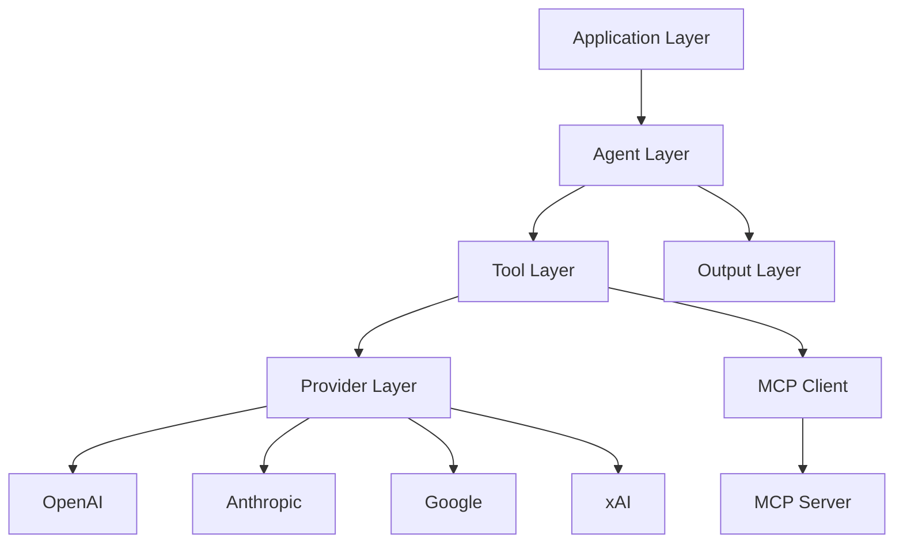

## ブログ概要（Summary）

本記事は [AI SDK 6 - Vercel](https://vercel.com/blog/ai-sdk-6) の解説記事です。

AI SDK 6は、Vercelが公開したTypeScriptベースのLLMアプリケーション構築フレームワークのメジャーバージョンアップである。v3 Language Model Specificationに基づき、`ToolLoopAgent`クラスによるエージェント抽象化、`needsApproval`によるツール実行承認制御、MCP（Model Context Protocol）の安定版サポート、構造化出力統合（`Output.object()` / `Output.array()` 等）を導入している。ブログによると月間2,000万以上のダウンロードを記録し、スタートアップからFortune 500企業まで採用されている。

この記事は [Zenn記事: Vercel AI SDK 6でFunction Callingを型安全に実装する入門ガイド](https://zenn.dev/0h_n0/articles/1a183cd273886f) の深掘りです。

## 情報源

- **種別**: 企業テックブログ
- **URL**: [https://vercel.com/blog/ai-sdk-6](https://vercel.com/blog/ai-sdk-6)
- **組織**: Vercel
- **著者**: Gregor Martynus, Lars Grammel, Aayush Kapoor, Josh Singh, Nico Albanese
- **発表日**: 2025年12月22日

## 技術的背景（Technical Background）

LLMアプリケーション開発において、ツール呼び出し（Function Calling）は単なるテキスト生成を超えた外部システム連携の要である。しかし従来のSDKには共通した課題が存在していた。ブログでは以下の3点を指摘している。

第一に、**ツール実行ループの複雑さ**である。LLMがツール呼び出しを要求し、結果を受け取り、再度推論するというループを開発者が手動で管理する必要があった。第二に、**プロバイダ間の差異の吸収**である。OpenAI、Anthropic、Google等のAPIはそれぞれ異なるインターフェースを持ち、プロバイダ切替時にコード全体の書き換えが必要だった。ブログでは「10プロバイダにまたがる数千行のコード」を統合する必要があったと述べている。第三に、**型安全性の欠如**である。ツールの入出力スキーマが実行時まで検証されず、型エラーが本番環境で発覚するリスクがあった。

AI SDK 6はv3 Language Model Specificationを基盤として、これらの課題に対する統一的な解決策を提供している。学術的にはReActパターン（Yao et al., 2023）に基づくエージェントアーキテクチャの型安全な実装と位置づけられる。

## 実装アーキテクチャ（Architecture）

AI SDK 6のアーキテクチャは、3層の抽象化で構成されている。



**Agent Layer（エージェント層）**: `Agent`はインターフェースとして定義されており、`ToolLoopAgent`がそのデフォルト実装である。ToolLoopAgentはツール実行ループを最大20ステップ（`stopWhen`で設定可能）まで自動管理する。`callOptionsSchema`により、リクエストごとのコンテキスト注入（RAGドキュメント、ユーザー属性等）を型安全に行える。

**Tool Layer（ツール層）**: `tool()`関数がツール定義の単位である。Zodスキーマによる入力検証、`needsApproval`による承認制御、`toModelOutput`によるトークン最適化、`inputExamples`による利用例の提示を統合的に扱う。`strict`モードを有効にすると、プロバイダのネイティブスキーマ検証が適用される。

**Provider Layer（プロバイダ層）**: 各LLMプロバイダ固有の機能を統一インターフェースで抽象化する。Anthropicのメモリツール、OpenAIのシェルツール、Googleのマップ・RAGツール、xAIのWeb/X検索ツール等、プロバイダ固有のツールも`provider.tools.*`として型安全にアクセスできる。

**Output Layer（出力層）**: `Output.object()`、`Output.array()`、`Output.choice()`、`Output.json()`により、ツール実行後の最終出力を構造化できる。ツールループ完了後にLLMが構造化された応答を生成するため、後処理のパースが不要になる。

ブログではThomson Reutersの事例として、3名のエンジニアが2ヶ月でCoCounselを構築し、1,300の会計事務所にサービスを提供していると紹介されている。

## ToolLoopAgentの詳細設計

### 基本構造

ToolLoopAgentの中核は、LLMの推論とツール実行を交互に繰り返すループである。

```typescript
import { ToolLoopAgent, tool } from 'ai';
import { z } from 'zod';

/**
 * 天気情報を取得するツール定義
 * inputSchema: Zodスキーマによる入力検証
 * execute: 実際のツール実行関数
 */
const weatherTool = tool({
  description: 'Get the weather in a location',
  inputSchema: z.object({
    location: z.string().describe('City name'),
  }),
  execute: async ({ location }): Promise<{ temperature: number; unit: string }> => {
    // 外部API呼び出し（実装省略）
    return { temperature: 22, unit: 'celsius' };
  },
});

/**
 * ToolLoopAgentの基本定義
 * model: プロバイダプレフィックス付きモデル指定
 * instructions: システムプロンプト
 * tools: 利用可能なツールのマップ
 */
const weatherAgent = new ToolLoopAgent({
  model: 'anthropic/claude-sonnet-4.5',
  instructions: 'You are a helpful weather assistant.',
  tools: { weather: weatherTool },
});

const result = await weatherAgent.generate({
  prompt: 'What is the weather in San Francisco?',
});
```

### callOptionsSchemaによる動的コンテキスト注入

ブログでは`callOptionsSchema`を「エージェントの振る舞いをリクエストごとに型安全にカスタマイズする機構」と位置づけている。

```typescript
import { ToolLoopAgent } from 'ai';
import { z } from 'zod';

/**
 * callOptionsSchemaでリクエストごとのコンテキストを定義
 * prepareCallフックで動的にinstructionsを構成
 */
const supportAgent = new ToolLoopAgent({
  model: 'anthropic/claude-sonnet-4.5',
  callOptionsSchema: z.object({
    userId: z.string(),
    accountType: z.enum(['free', 'pro', 'enterprise']),
  }),
  prepareCall: ({ options, ...settings }) => ({
    ...settings,
    instructions: `Account type: ${options.accountType}\nUser ID: ${options.userId}`,
  }),
  tools: { /* ツール定義 */ },
});

// 呼び出し時に型安全なオプションを渡す
const result = await supportAgent.generate({
  prompt: 'How do I upgrade my plan?',
  options: {
    userId: 'user_123',
    accountType: 'pro',
  },
});
```

この設計により、RAGで取得したドキュメントの注入、ユーザー権限に基づくツール制限、リクエスト複雑度に応じたモデル選択等を型安全に実現できる。

### needsApprovalによるツール実行承認

`needsApproval`は、人間による承認を必要とするツール実行を制御する機構である。ブーリアン値または非同期関数を受け取り、条件付き承認を実現する。

```typescript
/**
 * needsApprovalの条件付き承認例
 * 危険なコマンド（rm -rf等）のみ承認を要求
 */
const runCommand = tool({
  description: 'Run a shell command',
  inputSchema: z.object({
    command: z.string(),
  }),
  needsApproval: async ({ command }): Promise<boolean> => {
    return command.includes('rm -rf');
  },
  execute: async ({ command }): Promise<string> => {
    // コマンド実行ロジック
    return `Executed: ${command}`;
  },
});
```

UIコンポーネント側では、`approval-requested`ステートを検出して承認UIを表示する。

```tsx
// React UIでの承認フロー
if (invocation.state === 'approval-requested') {
  return (
    <div>
      <p>Run command: {invocation.input.command}?</p>
      <button onClick={() =>
        addToolApprovalResponse({
          id: invocation.approval.id,
          approved: true,
        })
      }>Approve</button>
      <button onClick={() =>
        addToolApprovalResponse({
          id: invocation.approval.id,
          approved: false,
        })
      }>Deny</button>
    </div>
  );
}
```

### toModelOutputによるトークン最適化

`toModelOutput`は、ツール実行結果をモデルに返す前に変換する関数である。ブログでは「大量のテキストやバイナリデータを返すツールで、不要なトークン消費を削減する」ためのものと説明されている。

```typescript
/**
 * toModelOutputでモデルに返すデータを最小化
 * execute結果の全データは保持しつつ、LLMには要約のみ送信
 */
const weatherTool = tool({
  description: 'Get the weather in a location',
  inputSchema: z.object({
    location: z.string(),
  }),
  execute: ({ location }): { temperature: number; humidity: number; windSpeed: number } => ({
    temperature: 72,
    humidity: 65,
    windSpeed: 12,
  }),
  toModelOutput: async ({ input, output }): Promise<{ type: string; value: string }> => ({
    type: 'text',
    value: `Weather in ${input.location} is ${output.temperature}°F.`,
  }),
});
```

## 構造化出力統合（Structured Output）

AI SDK 6では、ツールループ完了後の最終出力を型安全に構造化できる。ブログでは`Output`ユーティリティとして4つのバリアントを紹介している。

```typescript
import { ToolLoopAgent, Output, tool } from 'ai';
import { z } from 'zod';

/**
 * Output.object()による構造化出力
 * ツールループ完了後、指定スキーマに従った出力を生成
 */
const agent = new ToolLoopAgent({
  model: 'anthropic/claude-sonnet-4.5',
  tools: { weather: weatherTool },
  output: Output.object({
    schema: z.object({
      summary: z.string(),
      temperature: z.number(),
      recommendation: z.string(),
    }),
  }),
});

const { output } = await agent.generate({
  prompt: 'What is the weather in San Francisco and what should I wear?',
});
// output: { summary: string; temperature: number; recommendation: string }
```

Standard JSON Schema V1サポートにより、Zod以外のスキーマライブラリ（Arktype、Valibot等）も利用可能になった。

```typescript
import { type } from 'arktype';

// ArktypeによるStandard JSON Schema V1準拠の定義
const result = await generateText({
  model: 'anthropic/claude-sonnet-4.5',
  output: Output.object({
    schema: type({
      recipe: {
        name: 'string',
        ingredients: type({ name: 'string', amount: 'string' }).array(),
        steps: 'string[]',
      },
    }),
  }),
  prompt: 'Generate a lasagna recipe.',
});
```

## MCP（Model Context Protocol）統合

AI SDK 6では`@ai-sdk/mcp`パッケージがstable APIとして提供されている。ブログでは以下の機能を紹介している。

- **HTTPトランスポート**: 認証ヘッダー付きHTTP接続
- **OAuthフロー**: PKCE、トークンリフレッシュ、動的クライアント登録
- **リソース発見**: `listResources()` / `readResource()`
- **プロンプトテンプレート**: `listPrompts()` / `getPrompt()`
- **Elicitation**: サーバー主導のユーザー入力要求

```typescript
import { createMCPClient } from '@ai-sdk/mcp';

/**
 * MCPクライアントの生成
 * OAuthプロバイダによる認証付きHTTPトランスポート
 */
const authProvider = {
  redirectUrl: 'http://localhost:3000/callback',
  clientMetadata: {
    client_name: 'My App',
    redirect_uris: ['http://localhost:3000/callback'],
    grant_types: ['authorization_code', 'refresh_token'],
  },
  tokens: async () => { /* トークン取得ロジック */ },
  saveTokens: async (tokens: unknown) => { /* トークン保存ロジック */ },
};

const client = await createMCPClient({
  transport: {
    type: 'http',
    url: 'https://mcp.example.com',
    authProvider,
  },
});

// リソース発見
const resources = await client.listResources();
const resourceData = await client.readResource({
  uri: 'file:///example/document.txt',
});

// プロンプトテンプレート利用
const prompts = await client.experimental_listPrompts();
const prompt = await client.experimental_getPrompt({
  name: 'code_review',
  arguments: { code: 'function add(a: number, b: number) { return a + b; }' },
});
```

## プロバイダ固有ツール

AI SDK 6では、各LLMプロバイダが提供する専用ツールを統一インターフェースで利用できる。ブログでは4つのプロバイダについてツールを紹介している。

### Anthropic

- **Memory Tool**: 会話間での情報の保存・取得（view / create / str_replace / insert / delete / rename）
- **Tool Search**: 正規表現（Regex）またはBM25による動的ツール選択
- **Code Execution**: サンドボックス環境でのbash/ファイル操作。プログラマティックツール呼び出しにより、コード実行環境内から他のツールを呼び出すことが可能

```typescript
import { anthropic, forwardAnthropicContainerIdFromLastStep } from '@ai-sdk/anthropic';

/**
 * Anthropicコード実行からのプログラマティックツール呼び出し
 * allowedCallersで呼び出し元を制限
 */
const getWeather = tool({
  description: 'Get weather for a city.',
  inputSchema: z.object({ city: z.string() }),
  execute: async ({ city }): Promise<{ temp: number }> => ({ temp: 22 }),
  providerOptions: {
    anthropic: { allowedCallers: ['code_execution_20250825'] },
  },
});

const result = await generateText({
  model: anthropic('claude-sonnet-4-5'),
  tools: {
    code_execution: anthropic.tools.codeExecution_20250825(),
    getWeather,
  },
  prepareStep: forwardAnthropicContainerIdFromLastStep,
});
```

### OpenAI

- **Shell Tool**: タイムアウト・出力制限付きシェルコマンド実行
- **Apply Patch Tool**: ファイルのcreate / update / delete操作
- **MCP Tool**: リモートMCPサーバー接続

### Google

- **Google Maps Tool**: 位置情報ベースのグラウンディング（Gemini 2.0以降）
- **Vertex RAG Store Tool**: RAGコーパスからのコンテキスト検索（Gemini 2.0以降）
- **File Search Tool**: セマンティック/キーワード検索（Gemini 2.5以降）

### xAI

- **Web Search**: ドメインフィルタリング付きWeb検索、画像理解対応
- **X Search**: ハンドル・日付フィルタリング付きX投稿検索、動画理解対応
- **Code Execution / View Image / View X Video**: サンドボックス実行・メディア分析

## DevTools

ブログではDevToolsをミドルウェアベースの開発支援ツールとして紹介している。`devToolsMiddleware()`でモデルをラップし、`http://localhost:4983`でブラウザUIを提供する。

```typescript
import { wrapLanguageModel } from 'ai';
import { devToolsMiddleware } from '@ai-sdk/devtools';
import { gateway } from '@ai-sdk/gateway';

/**
 * DevToolsミドルウェアによるモデルラップ
 * 入出力、トークン使用量、タイミング、プロバイダ生データを可視化
 */
const devToolsEnabledModel = wrapLanguageModel({
  model: gateway('anthropic/claude-sonnet-4.5'),
  middleware: devToolsMiddleware(),
});

const result = await generateText({
  model: devToolsEnabledModel,
  prompt: 'What is love?',
});
```

DevToolsでは以下の情報をリアルタイムに確認できるとされている。

- モデルへの入力プロンプト・出力テキスト
- トークン使用量の内訳（`inputTokenDetails`、`outputTokenDetails`）
- レイテンシ・タイミング情報
- プロバイダ固有の生データ（`rawFinishReason`等）

## Reranking API

AI SDK 6ではReranking APIが新たに導入された。検索結果やドキュメントの関連度スコアリングを統一インターフェースで提供する。

```typescript
import { rerank } from 'ai';
import { cohere } from '@ai-sdk/cohere';

/**
 * 基本的なリランキング
 * topNで上位N件を返す
 */
const documents = [
  'sunny day at the beach',
  'rainy afternoon in the city',
  'snowy night in the mountains',
];

const { ranking } = await rerank({
  model: cohere.reranking('rerank-v3.5'),
  documents,
  query: 'talk about rain',
  topN: 2,
});
// ranking: [{ originalIndex: 1, score: 0.98, document: '...' }, ...]
```

構造化ドキュメントのリランキングも対応している。

```typescript
/**
 * 構造化ドキュメントのリランキング
 * Record<string, any>型のドキュメント配列をスコアリング
 */
const documents = [
  { from: 'Paul Doe', subject: 'Follow-up', text: '20% discount offer...' },
  { from: 'John McGill', subject: 'Missing Info', text: 'Oracle pricing: $5000/month' },
];

const { rerankedDocuments } = await rerank({
  model: cohere.reranking('rerank-v3.5'),
  documents,
  query: 'Which pricing did we get from Oracle?',
  topN: 1,
});
```

対応プロバイダはCohere、Amazon Bedrock、Together.aiの3つである。

## Production Deployment Guide

AI SDK 6ベースのエージェントアプリケーションをAWS上で本番運用するための構成ガイドである。

### AWS実装パターン（コスト最適化重視）

AI SDK 6のToolLoopAgentはNode.jsランタイム上で動作するため、AWS上ではLambda（サーバーレス）またはECS/EKS（コンテナ）で運用する。ツール実行ループの最大20ステップを考慮し、タイムアウト設定に注意が必要である。

**トラフィック量別の推奨構成**:

| 構成 | トラフィック | サービス | 月額コスト（概算） |
|------|-------------|----------|-------------------|
| Small | ~100 req/日 | Lambda + Bedrock + DynamoDB | $50-150 |
| Medium | ~1,000 req/日 | ECS Fargate + Bedrock + ElastiCache | $300-800 |
| Large | 10,000+ req/日 | EKS + Karpenter + Spot Instances | $2,000-5,000 |

**Small構成（~100 req/日）の詳細**:
- **Lambda**: Node.js 22ランタイム、メモリ1024MB、タイムアウト300秒（ToolLoopAgentの20ステップに対応）
- **Amazon Bedrock**: Claude Sonnet 4.5（入力$3/MTok、出力$15/MTok）
- **DynamoDB**: On-Demandモード、会話履歴・ツール実行ログ保存
- **CloudWatch**: ログ・メトリクス・アラーム
- 月額: Lambda $5 + Bedrock $30-100 + DynamoDB $5 + CloudWatch $10 = **$50-120**

**Medium構成（~1,000 req/日）の詳細**:
- **ECS Fargate**: 0.5 vCPU / 1GB RAM x 2タスク（ALB経由）
- **ElastiCache (Redis)**: t4g.micro、ツール実行結果キャッシュ
- **Bedrock**: バッチAPIで50%コスト削減
- 月額: ECS $70 + ALB $25 + Bedrock $150-500 + ElastiCache $15 + DynamoDB $20 = **$280-630**

**Large構成（10,000+ req/日）の詳細**:
- **EKS**: コントロールプレーン + Karpenter（Spot優先）
- **Spot Instances**: m6i.xlarge（4 vCPU / 16GB RAM）、オンデマンド比最大90%削減
- **Bedrock Prompt Caching**: 反復的なシステムプロンプトで30-90%トークン削減
- 月額: EKS $75 + EC2 Spot $200-500 + Bedrock $1,000-3,000 + その他 $200 = **$1,475-3,775**

**コスト試算の注意事項**: 上記は2026年5月時点のAWS ap-northeast-1（東京）リージョン料金に基づく概算値である。実際のコストはトラフィックパターン、リージョン、バースト使用量により変動する。最新料金は[AWS料金計算ツール](https://calculator.aws/)で確認を推奨する。

**コスト削減テクニック**:
- Spot Instances活用で最大90%削減
- Reserved Instances（1年コミット）で最大72%削減
- Bedrock Batch API使用で50%削減
- Bedrock Prompt Caching有効化で30-90%削減

### Terraformインフラコード

**Small構成（Serverless）**:

```hcl
# AI SDK 6 Agent - Small構成（Lambda + Bedrock + DynamoDB）
# 2026年5月時点の最新安定版

terraform {
  required_version = ">= 1.9.0"
  required_providers {
    aws = {
      source  = "hashicorp/aws"
      version = "~> 5.80"
    }
  }
}

provider "aws" {
  region = "ap-northeast-1"
}

# --- IAMロール（最小権限） ---
resource "aws_iam_role" "agent_lambda" {
  name = "ai-sdk-agent-lambda-role"
  assume_role_policy = jsonencode({
    Version = "2012-10-17"
    Statement = [{
      Action = "sts:AssumeRole"
      Effect = "Allow"
      Principal = { Service = "lambda.amazonaws.com" }
    }]
  })
}

resource "aws_iam_role_policy" "agent_lambda_policy" {
  name = "ai-sdk-agent-lambda-policy"
  role = aws_iam_role.agent_lambda.id
  policy = jsonencode({
    Version = "2012-10-17"
    Statement = [
      {
        # Bedrock推論のみ許可
        Effect   = "Allow"
        Action   = ["bedrock:InvokeModel", "bedrock:InvokeModelWithResponseStream"]
        Resource = "arn:aws:bedrock:ap-northeast-1::foundation-model/anthropic.claude-*"
      },
      {
        # DynamoDB CRUD
        Effect   = "Allow"
        Action   = ["dynamodb:PutItem", "dynamodb:GetItem", "dynamodb:Query", "dynamodb:UpdateItem"]
        Resource = aws_dynamodb_table.conversations.arn
      },
      {
        # CloudWatch Logs
        Effect   = "Allow"
        Action   = ["logs:CreateLogGroup", "logs:CreateLogStream", "logs:PutLogEvents"]
        Resource = "arn:aws:logs:ap-northeast-1:*:*"
      }
    ]
  })
}

# --- Lambda関数 ---
resource "aws_lambda_function" "agent" {
  function_name = "ai-sdk-agent"
  role          = aws_iam_role.agent_lambda.arn
  runtime       = "nodejs22.x"
  handler       = "index.handler"
  # ToolLoopAgentの20ステップに対応（余裕を持たせる）
  timeout       = 300
  memory_size   = 1024

  environment {
    variables = {
      DYNAMODB_TABLE = aws_dynamodb_table.conversations.name
      MODEL_ID       = "anthropic.claude-sonnet-4-5-v1"
      NODE_OPTIONS   = "--enable-source-maps"
    }
  }

  filename = "lambda.zip"  # デプロイパッケージ
}

# --- DynamoDB（On-Demand、KMS暗号化） ---
resource "aws_dynamodb_table" "conversations" {
  name         = "ai-sdk-agent-conversations"
  billing_mode = "PAY_PER_REQUEST"
  hash_key     = "conversationId"
  range_key    = "timestamp"

  attribute {
    name = "conversationId"
    type = "S"
  }
  attribute {
    name = "timestamp"
    type = "N"
  }

  server_side_encryption {
    enabled = true  # AWS管理キーによる暗号化
  }

  point_in_time_recovery {
    enabled = true
  }
}

# --- CloudWatchアラーム（コスト監視） ---
resource "aws_cloudwatch_metric_alarm" "lambda_duration" {
  alarm_name          = "ai-sdk-agent-high-duration"
  comparison_operator = "GreaterThanThreshold"
  evaluation_periods  = 3
  metric_name         = "Duration"
  namespace           = "AWS/Lambda"
  period              = 300
  statistic           = "Average"
  threshold           = 60000  # 60秒超過でアラート
  alarm_actions       = []     # SNS ARNを設定

  dimensions = {
    FunctionName = aws_lambda_function.agent.function_name
  }
}
```

**Large構成（Container）**:

```hcl
# AI SDK 6 Agent - Large構成（EKS + Karpenter + Spot）
# 2026年5月時点

module "eks" {
  source          = "terraform-aws-modules/eks/aws"
  version         = "~> 20.31"
  cluster_name    = "ai-sdk-agent-cluster"
  cluster_version = "1.31"

  vpc_id     = module.vpc.vpc_id
  subnet_ids = module.vpc.private_subnets

  # パブリックアクセス最小化
  cluster_endpoint_public_access = false

  eks_managed_node_groups = {
    system = {
      instance_types = ["t3.medium"]
      min_size       = 1
      max_size       = 2
      desired_size   = 1
    }
  }
}

# --- Karpenter Provisioner（Spot優先） ---
resource "kubectl_manifest" "karpenter_node_pool" {
  yaml_body = <<-YAML
    apiVersion: karpenter.sh/v1
    kind: NodePool
    metadata:
      name: ai-sdk-agent-pool
    spec:
      template:
        spec:
          requirements:
            - key: "karpenter.sh/capacity-type"
              operator: In
              values: ["spot", "on-demand"]  # Spot優先
            - key: "node.kubernetes.io/instance-type"
              operator: In
              values: ["m6i.xlarge", "m6i.2xlarge", "m7i.xlarge"]
          nodeClassRef:
            group: karpenter.k8s.aws
            kind: EC2NodeClass
            name: default
      limits:
        cpu: "64"
        memory: "256Gi"
      disruption:
        consolidationPolicy: WhenEmptyOrUnderutilized
        consolidateAfter: 30s
  YAML
}

# --- Secrets Manager（Bedrock設定） ---
resource "aws_secretsmanager_secret" "bedrock_config" {
  name        = "ai-sdk-agent/bedrock-config"
  description = "AI SDK Agent Bedrock configuration"
}

# --- AWS Budgets（予算アラート） ---
resource "aws_budgets_budget" "agent_monthly" {
  name         = "ai-sdk-agent-monthly"
  budget_type  = "COST"
  limit_amount = "5000"
  limit_unit   = "USD"
  time_unit    = "MONTHLY"

  notification {
    comparison_operator       = "GREATER_THAN"
    threshold                 = 80
    threshold_type            = "PERCENTAGE"
    notification_type         = "ACTUAL"
    subscriber_email_addresses = ["ops-team@example.com"]
  }
}
```

### 運用・監視設定

**CloudWatch Logs Insights クエリ**:

```
# トークン使用量の1時間ごとの集計（コスト異常検知）
fields @timestamp, @message
| filter @message like /inputTokens/
| stats sum(inputTokens) as totalInput, sum(outputTokens) as totalOutput by bin(1h)
| sort @timestamp desc
| limit 24

# ToolLoopAgentのステップ数分析（P95, P99）
fields @timestamp, agentSteps
| filter @message like /agentSteps/
| stats percentile(agentSteps, 95) as p95, percentile(agentSteps, 99) as p99 by bin(1h)
```

**CloudWatch アラーム設定コード（Python）**:

```python
import boto3
from typing import Any

cloudwatch = boto3.client("cloudwatch", region_name="ap-northeast-1")

def create_token_spike_alarm(function_name: str, sns_topic_arn: str) -> dict[str, Any]:
    """Bedrockトークン使用量スパイク検知アラームを作成する

    Args:
        function_name: Lambda関数名
        sns_topic_arn: 通知先SNSトピックARN

    Returns:
        CloudWatch put_metric_alarm APIレスポンス
    """
    return cloudwatch.put_metric_alarm(
        AlarmName=f"{function_name}-token-spike",
        ComparisonOperator="GreaterThanThreshold",
        EvaluationPeriods=2,
        MetricName="InputTokenCount",
        Namespace="AWS/Bedrock",
        Period=300,
        Statistic="Sum",
        Threshold=100000,  # 5分間で10万トークン超過
        AlarmActions=[sns_topic_arn],
    )
```

**X-Ray トレーシング設定（Python）**:

```python
from aws_xray_sdk.core import xray_recorder, patch_all
from typing import Any

# boto3自動計装
patch_all()

def trace_agent_step(step_number: int, tool_name: str, duration_ms: float) -> None:
    """エージェントの各ステップをX-Rayでトレースする

    Args:
        step_number: ToolLoopAgentのステップ番号（1-20）
        tool_name: 実行されたツール名
        duration_ms: ステップの実行時間（ミリ秒）
    """
    subsegment = xray_recorder.begin_subsegment(f"agent-step-{step_number}")
    subsegment.put_annotation("tool_name", tool_name)
    subsegment.put_metadata("duration_ms", duration_ms)
    subsegment.put_metadata("step_number", step_number)
    xray_recorder.end_subsegment()
```

**Cost Explorer自動レポート（Python）**:

```python
import boto3
import json
from datetime import datetime, timedelta
from typing import Any

ce = boto3.client("ce", region_name="us-east-1")
sns = boto3.client("sns", region_name="ap-northeast-1")

def daily_cost_report(sns_topic_arn: str, threshold_usd: float = 100.0) -> dict[str, Any]:
    """日次コストレポートを取得し、閾値超過時にSNS通知する

    Args:
        sns_topic_arn: 通知先SNSトピックARN
        threshold_usd: アラート閾値（USD/日）

    Returns:
        コストレポート辞書
    """
    today = datetime.utcnow().strftime("%Y-%m-%d")
    yesterday = (datetime.utcnow() - timedelta(days=1)).strftime("%Y-%m-%d")

    response = ce.get_cost_and_usage(
        TimePeriod={"Start": yesterday, "End": today},
        Granularity="DAILY",
        Metrics=["UnblendedCost"],
        Filter={
            "Tags": {
                "Key": "Project",
                "Values": ["ai-sdk-agent"],
            }
        },
        GroupBy=[{"Type": "DIMENSION", "Key": "SERVICE"}],
    )

    total_cost = sum(
        float(group["Metrics"]["UnblendedCost"]["Amount"])
        for result in response["ResultsByTime"]
        for group in result["Groups"]
    )

    if total_cost > threshold_usd:
        sns.publish(
            TopicArn=sns_topic_arn,
            Subject=f"AI SDK Agent Cost Alert: ${total_cost:.2f}/day",
            Message=json.dumps(response, indent=2, default=str),
        )

    return {"date": yesterday, "total_cost_usd": total_cost, "details": response}
```

### コスト最適化チェックリスト

**アーキテクチャ選択**:
- [ ] トラフィック量に応じた構成を選択（~100 req/日: Serverless、~1,000: Hybrid、10,000+: Container）
- [ ] ToolLoopAgentのステップ数上限を分析し、タイムアウトを適切に設定

**リソース最適化**:
- [ ] EC2: Spot Instances優先（m6i/m7iファミリー、最大90%削減）
- [ ] Reserved Instances: 安定ワークロードに1年コミット（最大72%削減）
- [ ] Savings Plans: Compute Savings Plans検討
- [ ] Lambda: メモリサイズ最適化（AWS Lambda Power Tuning実行）
- [ ] ECS/EKS: Karpenterによるアイドル時スケールダウン（consolidateAfter: 30s）

**LLMコスト削減**:
- [ ] Bedrock Batch API使用（非同期処理で50%削減）
- [ ] Prompt Caching有効化（`instructions`のキャッシュで30-90%削減）
- [ ] モデル選択ロジック（簡易クエリはHaiku、複雑クエリはSonnetに振り分け）
- [ ] `toModelOutput`でツール結果のトークン数を最小化
- [ ] `maxSteps`を必要最小限に設定（デフォルト20から削減可能か検討）

**監視・アラート**:
- [ ] AWS Budgets設定（月額上限アラート）
- [ ] CloudWatch アラーム（トークンスパイク、レイテンシP99）
- [ ] Cost Anomaly Detection有効化
- [ ] 日次コストレポート（Cost Explorer + SNS）
- [ ] X-Rayトレーシングでボトルネック可視化

**リソース管理**:
- [ ] 未使用NAT Gateway・Elastic IP削除
- [ ] タグ戦略（`Project: ai-sdk-agent`、`Environment: prod/dev`）
- [ ] CloudWatch Logsライフサイクルポリシー（30日保持）
- [ ] 開発環境の夜間・週末停止（EventBridge Scheduler）
- [ ] ECRイメージライフサイクルポリシー（最新5世代のみ保持）

## パフォーマンス最適化（Performance）

AI SDK 6では、トークン消費とレイテンシの最適化に関する機能がいくつか導入されている。

**toModelOutputによるトークン削減**: ツール実行結果が大量のテキストやバイナリデータを含む場合、`toModelOutput`で要約テキストのみをモデルに返すことで、コンテキストウィンドウの圧迫を防ぐ。ブログでは「execution result from the model tokens」を分離する設計と述べている。

**rawFinishReasonとExtended Usage**: `usage.inputTokenDetails`（noCacheTokens、cacheReadTokens、cacheWriteTokens）と`usage.outputTokenDetails`（textTokens、reasoningTokens）により、トークン消費の内訳を詳細に分析できる。DevToolsと組み合わせることで、ステップごとのトークン消費を可視化し、ボトルネックを特定できる。

**DevToolsによるリアルタイム分析**: `devToolsMiddleware()`でラップしたモデルは、`http://localhost:4983`のUIで入出力・タイミング・トークン使用量をリアルタイムに確認できる。本番環境ではDevToolsを無効化し、CloudWatchメトリクスに切り替えることが推奨される。

**inputExamplesによる精度向上**: 複雑なスキーマを持つツールに対して`inputExamples`を提示することで、LLMのツール呼び出し精度が向上し、不要なリトライ（ステップ消費）を削減できる。

## 運用での学び（Production Lessons）

ブログで紹介されている機能から、本番運用での教訓を抽出する。

**needsApprovalによるリスク制御**: 本番環境では、ファイル削除・課金操作・外部API呼び出し等の副作用を伴うツールに`needsApproval`を設定すべきである。条件付き承認（非同期関数）により、すべての実行を止めるのではなく、危険な入力パターンのみを選択的にブロックできる。ブログではシェルコマンドの`rm -rf`検知を例示している。

**エラーハンドリングの設計**: ToolLoopAgentはデフォルト20ステップで停止するが、ツール実行失敗時のリトライ戦略は開発者が設計する必要がある。`stopWhen`条件をカスタマイズし、特定のエラーパターンで早期終了する実装が推奨される。

**プロバイダ固有機能の分離**: `providerOptions`によりプロバイダ固有の設定をツール定義に含めることができるが、プロバイダ切替時の互換性に注意が必要である。Anthropicの`allowedCallers`やOpenAIの`strict`モード等は、プロバイダ依存のコードパスとして明示的に管理すべきである。

**v5からの移行**: ブログでは`npx @ai-sdk/codemod upgrade v6`による自動移行ツールを提供している。ブログによると「non-breaking major version update」であり、ほとんどのケースで後方互換性が維持されるとしているが、v3 Language Model Specificationへの移行に伴い一部のAPIに変更がある。

## 学術研究との関連（Academic Connection）

AI SDK 6のエージェント設計は、Yao et al. (2023) のReAct（Reasoning and Acting）パターンに基づいている。ReActはLLMの推論（Reasoning）と行動（Acting）を交互に繰り返すことで、外部ツールを活用した問題解決を実現するアプローチである。ToolLoopAgentの「推論→ツール呼び出し→結果取得→再推論」のループは、ReActの形式的実装と見なせる。

MCP（Model Context Protocol）はAnthropicが提唱したプロトコルであり、LLMとツール間の標準化されたインターフェースを定義する。AI SDK 6のMCPサポートは、ツールのディスカバリ・認証・実行を標準化する試みとして、言語モデルのツール利用研究（Schick et al., 2023, "Toolformer"）の延長線上に位置する。

## まとめと実践への示唆

AI SDK 6は、LLMアプリケーション開発における3つの課題（ツール実行ループの複雑さ、プロバイダ間差異、型安全性）に対して、統一的な解決策を提供している。ToolLoopAgentによるエージェント抽象化、needsApprovalによる承認制御、MCPによるツール標準化、構造化出力統合により、型安全かつプロバイダ非依存のエージェントアプリケーションを構築できる。

実践上の示唆として、以下の3点を挙げる。第一に、`callOptionsSchema`と`prepareCall`を活用したリクエストごとのコンテキスト注入により、RAGや権限制御を型安全に実装できる。第二に、`toModelOutput`と`inputExamples`の組み合わせにより、トークンコストの最適化とツール呼び出し精度の向上を同時に達成できる。第三に、MCP統合によりツールのライフサイクル（ディスカバリ・認証・実行・リソース管理）を標準化でき、マイクロサービス的なツール管理が可能になる。

v5からの移行は`npx @ai-sdk/codemod upgrade v6`で自動化されており、段階的な導入が可能である。

## 参考文献

- **Blog URL**: [https://vercel.com/blog/ai-sdk-6](https://vercel.com/blog/ai-sdk-6)
- **AI SDK Documentation**: [https://v6.ai-sdk.dev/docs](https://v6.ai-sdk.dev/docs)
- **Migration Guide**: [https://v6.ai-sdk.dev/docs/migration-guides/migration-guide-6-0](https://v6.ai-sdk.dev/docs/migration-guides/migration-guide-6-0)
- **GitHub**: [https://github.com/vercel/ai](https://github.com/vercel/ai)
- **Yao, S. et al. (2023)**: "ReAct: Synergizing Reasoning and Acting in Language Models", ICLR 2023
- **Schick, T. et al. (2023)**: "Toolformer: Language Models Can Teach Themselves to Use Tools", NeurIPS 2023
- **Model Context Protocol**: [https://modelcontextprotocol.io/](https://modelcontextprotocol.io/)
- **Related Zenn article**: [https://zenn.dev/0h_n0/articles/1a183cd273886f](https://zenn.dev/0h_n0/articles/1a183cd273886f)
