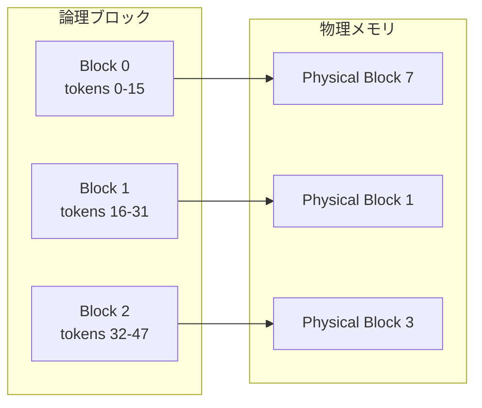

本記事は [Efficient Memory Management for Large Language Model Serving with PagedAttention](https://arxiv.org/abs/2309.06180)（SOSP 2023）の解説記事です。

この記事は [Zenn記事: Ollama v0.23×Docker Composeで構築するマルチGPU分散推論クラスタ実践ガイド](https://zenn.dev/0h_n0/articles/74d69b5a0713d0) の深掘りです。

## 論文概要（Abstract）

LLMサービングにおいて、KV（Key-Value）キャッシュのメモリ管理がスループットのボトルネックになっている問題に対し、著者らはOSの仮想メモリとページング技術に着想を得た**PagedAttention**を提案している。PagedAttentionは、KVキャッシュを固定サイズのブロックに分割し、非連続な物理メモリ空間に格納することで、従来方式で生じていた60〜80%のメモリ浪費を解消する。この技術を実装したvLLMは、既存システム（FasterTransformer、Orca等）と比較してスループットを2〜4倍向上させたと報告されている。

## 情報源

- **arXiv ID**: 2309.06180
- **URL**: [https://arxiv.org/abs/2309.06180](https://arxiv.org/abs/2309.06180)
- **著者**: Woosuk Kwon, Zhuohan Li, Siyuan Zhuang, Ying Sheng, Lianmin Zheng, Cody Hao Yu et al.
- **発表年**: 2023（SOSP 2023）
- **分野**: cs.LG, cs.DC

## 背景と動機（Background & Motivation）

LLMの推論サービングでは、Transformerモデルが入力トークンに対して生成するKey-Valueテンソル（KVキャッシュ）を保持する必要がある。自己回帰的なトークン生成では、過去のすべてのトークンのKVキャッシュを参照するため、生成が進むにつれてメモリ消費が増大する。

著者らは、従来のLLMサービングシステムにおけるKVキャッシュのメモリ管理に3つの非効率性を指摘している（論文Section 2.2より）。

1. **事前確保による内部フラグメンテーション**: 出力長が事前に不明なため、最大出力長分のメモリを確保する。実際の出力がそれより短い場合、余剰分が無駄になる
2. **外部フラグメンテーション**: リクエストごとに異なるサイズの連続メモリ領域を確保・解放するため、メモリ空間が断片化する
3. **メモリ共有の困難**: ビームサーチやパラレルサンプリングでは、複数の生成候補が同じプレフィックスのKVキャッシュを共有できるはずだが、連続メモリ管理ではコピーが必要になる

著者らの分析によると、これらの非効率性により、既存システムでは利用可能なGPUメモリの60〜80%がKVキャッシュの管理に浪費されている。これがバッチサイズの上限を制約し、スループットを低下させている。

## 主要な貢献（Key Contributions）

- **PagedAttention**: KVキャッシュを固定サイズのブロック（デフォルト16トークン）単位で管理し、非連続な物理メモリに格納可能にしたアテンションアルゴリズム
- **仮想メモリスタイルのKVキャッシュ管理**: 論理ブロックから物理ブロックへのマッピングテーブルにより、フラグメンテーションをほぼゼロに削減
- **Copy-on-Write（CoW）によるメモリ共有**: ビームサーチやパラレルサンプリングで、KVキャッシュのブロックを複数のシーケンス間で共有し、メモリ使用量を最大55%削減
- **vLLMの実装と公開**: 上記技術を統合した高スループットLLMサービングエンジンをオープンソースとして公開（Apache 2.0ライセンス）

## 技術的詳細（Technical Details）

### PagedAttentionのメモリ管理

PagedAttentionは、OSの仮想メモリにおけるページング方式を、KVキャッシュの管理に適用している。具体的には、各シーケンスのKVキャッシュを**論理ブロック**の列として表現し、各論理ブロックを**物理ブロック**にマッピングする。



各物理ブロックは固定数のトークン分のKey-Valueテンソルを格納する。ブロックサイズを $B$ とすると、1ブロックあたりのメモリ使用量は以下のとおりである。

$$
\text{Block Memory} = 2 \times L \times H \times D \times B \times \text{sizeof(dtype)}
$$

ここで、
- $L$: Transformerのレイヤー数
- $H$: アテンションヘッド数
- $D$: ヘッドごとの次元数
- $B$: ブロックサイズ（トークン数）
- 係数2: KeyとValueの両方を格納するため

### Attentionカーネルの実装

PagedAttentionでは、標準的なアテンション計算をブロック単位で実行する。シーケンス $s$ のQuery $q$ に対するアテンション出力は以下のように計算される（論文Equation 1より）。

$$
\text{Attention}(q, K_s, V_s) = \text{softmax}\left(\frac{q K_s^T}{\sqrt{d}}\right) V_s
$$

ただし $K_s$ と $V_s$ は非連続な物理ブロックに分散しているため、カーネルはブロックテーブルを参照して各ブロックのKeyとValueを読み出す。各ブロック $j$ について部分的なアテンションスコアを計算し、最終的にオンラインsoftmax法で統合する。

```python
def paged_attention(
    query: torch.Tensor,
    key_cache: torch.Tensor,
    value_cache: torch.Tensor,
    block_table: torch.Tensor,
    context_len: int,
    block_size: int = 16,
) -> torch.Tensor:
    """PagedAttention kernel (simplified pseudocode)

    Args:
        query: (num_heads, head_dim)
        key_cache: (num_blocks, block_size, num_heads, head_dim)
        value_cache: (num_blocks, block_size, num_heads, head_dim)
        block_table: (max_blocks,) - logical to physical block mapping
        context_len: number of tokens in current context
        block_size: tokens per block
    Returns:
        output: (num_heads, head_dim)
    """
    num_blocks = (context_len + block_size - 1) // block_size
    output = torch.zeros_like(query)
    max_score = float('-inf')
    exp_sum = 0.0

    for j in range(num_blocks):
        physical_block = block_table[j]
        k_block = key_cache[physical_block]
        v_block = value_cache[physical_block]

        tokens_in_block = min(block_size, context_len - j * block_size)
        k = k_block[:tokens_in_block]
        v = v_block[:tokens_in_block]

        scores = torch.matmul(query, k.transpose(-2, -1)) / math.sqrt(query.shape[-1])

        new_max = torch.max(scores.max(), max_score)
        exp_sum = exp_sum * torch.exp(max_score - new_max)
        block_exp = torch.exp(scores - new_max)
        exp_sum += block_exp.sum()

        output = output * torch.exp(max_score - new_max)
        output += torch.matmul(block_exp, v)
        max_score = new_max

    output = output / exp_sum
    return output
```

### Copy-on-Writeによるメモリ共有

ビームサーチやパラレルサンプリングでは、複数のシーケンス候補が同一のプレフィックスを共有する。PagedAttentionでは、複数の論理ブロックが同一の物理ブロックを参照できる。物理ブロックには参照カウンタが付与され、いずれかのシーケンスがブロック内容を変更する際にのみコピーが発生する（Copy-on-Write）。

論文Table 3によると、この仕組みによりビームサーチ時のメモリ使用量が最大55%削減され、スループットが最大2.2倍向上したと報告されている。

### プリエンプション機構

GPU VRAMが不足した場合のために、vLLMは2つのプリエンプション戦略を実装している。

1. **Swapping**: KVキャッシュブロックをCPUメモリに退避し、リソースが空いたら復元する
2. **Recomputation**: プリエンプトされたリクエストのKVキャッシュを破棄し、再実行時にプロンプトから再計算する

著者らは、コンテキスト長が短い場合はRecomputationが、長い場合はSwappingが効率的であると報告している（論文Section 4.4より）。

## 実装のポイント（Implementation）

### ブロックサイズの選択

ブロックサイズ $B$ はメモリ効率とカーネル性能のトレードオフを決定する。論文の実験（Section 6.3）によると：

- **小さいブロックサイズ**（$B = 1$）: メモリ浪費は最小だが、カーネル実行時のメモリアクセスパターンが非効率
- **大きいブロックサイズ**（$B = 256$）: カーネル効率は高いが、最後のブロックの内部フラグメンテーションが増大
- **推奨値**: $B = 16$ が実験的にバランスが良い

### Continuous Batchingとの統合

vLLMはOrcaで提案されたiteration-level schedulingを採用している。各デコードステップで、完了したリクエストを除去し新しいリクエストを追加することで、GPU利用率を維持する。PagedAttentionの動的メモリ管理により、この柔軟なスケジューリングが可能になっている。

### テンソル並列によるマルチGPU対応

vLLMはMegatron-LMスタイルのテンソル並列をサポートしている。各GPU上で独立したKVキャッシュマネージャーが動作し、アテンションヘッドをGPU間で分割する。ブロックテーブルは全GPUで共有され、all-reduce操作で同期される。

## 実験結果（Results）

論文Table 1およびFigure 8-11の実験結果を整理する。

| 構成 | ベースライン | vLLM | 改善率 |
|------|------------|------|--------|
| OPT-13B, A100, ShareGPT | Orca (FasterTransformer) | PagedAttention | スループット2.2倍（論文Figure 8より） |
| OPT-175B, A100×8, ShareGPT | Orca (FasterTransformer) | PagedAttention | スループット2.4倍（論文Figure 8より） |
| LLaMA-13B, A100, ShareGPT | HuggingFace TGI | PagedAttention | スループット2.2倍（論文Figure 9より） |
| OPT-13B, Beam Search (k=4) | FasterTransformer | PagedAttention + CoW | スループット2.2倍、メモリ55%削減（論文Table 3より） |

著者らは、スループット向上の主因が**バッチサイズの増大**にあると分析している。PagedAttentionによりKVキャッシュのメモリ効率が改善され、同時に処理可能なリクエスト数が増加する。論文Figure 12では、メモリ浪費率が従来の20.4〜38.2%からPagedAttentionでは1.9〜3.6%に削減されたと報告されている。

## 実運用への応用（Practical Applications）

### Ollamaとの関連

Zenn記事で解説されているOllamaは、内部的にllama.cppを使用しており、llama.cppもKVキャッシュの効率的な管理を実装している。vLLMのPagedAttentionとOllamaのVRAM管理は同じ課題（KVキャッシュの効率的なメモリ利用）に取り組んでおり、アプローチに共通点がある。

- **`OLLAMA_NUM_PARALLEL`** の設定は、並列スロットごとにKVキャッシュ領域を確保する動作に対応する。vLLMのPagedAttentionでは動的にブロックを割り当てるため、並列数に応じた静的確保が不要になる
- **`OLLAMA_KEEP_ALIVE`** によるモデルのアンロードタイミング制御は、vLLMのプリエンプション機構と類似の目的を持つ

### vLLMの本番導入パターン

vLLMは現在、LLMサービングの事実上の標準として広く使われている。Dockerコンテナでのデプロイが公式にサポートされており、以下のように起動できる。

```bash
docker run --gpus all \
  -v ~/.cache/huggingface:/root/.cache/huggingface \
  -p 8000:8000 \
  vllm/vllm-openai:latest \
  --model meta-llama/Llama-3.1-8B-Instruct \
  --tensor-parallel-size 2
```

`--tensor-parallel-size 2` により2GPU間でテンソル並列が有効になる。Zenn記事のDocker Compose構成と組み合わせて、Nginx経由でvLLMインスタンスをロードバランシングすることも可能である。

## 関連研究（Related Work）

- **Orca** (Yu et al., 2022): iteration-level schedulingによる連続バッチ処理を提案。vLLMはこの概念を継承しつつ、メモリ管理を改善している
- **FlexGen** (Sheng et al., 2023): 単一GPUでの高スループット推論に特化。CPU/ディスクへのオフロードを活用するが、オンラインサービングには不向き
- **SpecInfer** (Miao et al., 2023): 投機的デコーディングによるレイテンシ削減。PagedAttentionと組み合わせ可能な直交するアプローチ

## まとめと今後の展望

vLLMのPagedAttentionは、LLMサービングにおけるKVキャッシュのメモリ管理を、OSの仮想メモリ技術の応用により根本的に改善した。メモリ浪費率を38%→2%に削減し、スループットを2〜4倍向上させた成果は、その後のLLMサービングシステム（DistServe、Mooncake、Sarathi-Serve等）の基盤技術となっている。

Ollamaを含むローカルLLM推論環境においても、KVキャッシュの効率的な管理はVRAM使用量と並列処理能力を直接左右する重要な技術であり、PagedAttentionの概念を理解することはマルチGPU構成の最適化に不可欠である。

## 参考文献

- **arXiv**: [https://arxiv.org/abs/2309.06180](https://arxiv.org/abs/2309.06180)
- **ACM DL**: [https://dl.acm.org/doi/10.1145/3600006.3613165](https://dl.acm.org/doi/10.1145/3600006.3613165)
- **Code**: [https://github.com/vllm-project/vllm](https://github.com/vllm-project/vllm)
- **Related Zenn article**: [https://zenn.dev/0h_n0/articles/74d69b5a0713d0](https://zenn.dev/0h_n0/articles/74d69b5a0713d0)
