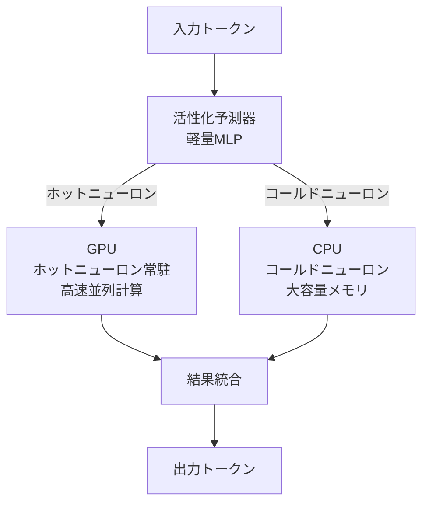

本記事は [PowerInfer: Fast Large Language Model Serving with a Consumer-grade GPU](https://arxiv.org/abs/2311.05740) の解説記事です。

この記事は [Zenn記事: Ollama v0.23×Docker Composeで構築するマルチGPU分散推論クラスタ実践ガイド](https://zenn.dev/0h_n0/articles/74d69b5a0713d0) の深掘りです。

## 論文概要（Abstract）

著者ら（上海交通大学 IPADS研究室）は、LLMのニューロン活性化パターンがべき乗則分布（少数のニューロンが大多数の推論で活性化する）に従うことを観測し、この特性を利用してGPU-CPUハイブリッド推論エンジン「PowerInfer」を提案している。高頻度で活性化する「ホットニューロン」をGPU上に常駐させ、低頻度の「コールドニューロン」をCPU上で処理することで、GPU-CPU間のデータ転送を最小化する。RTX 4090（24GB VRAM）上でLLaMA-65Bモデルを実行した場合、llama.cpp比で最大11.69倍の推論速度向上が報告されている。

## 情報源

- **arXiv ID**: 2311.05740
- **URL**: [https://arxiv.org/abs/2311.05740](https://arxiv.org/abs/2311.05740)
- **著者**: Yixin Song, Zeyu Mi, Haotong Xie, Haibo Chen
- **発表年**: 2023
- **分野**: cs.LG, cs.DC

## 背景と動機（Background & Motivation）

LLMの推論をコンシューマGPU上で実行する需要は高いが、大規模モデル（65B〜175Bパラメータ）のモデルウェイトはコンシューマGPUのVRAM（通常8〜24GB）に収まらない。この問題に対する従来のアプローチには以下の限界があった。

**オフロード方式（FlexGen等）**: モデルの一部をCPUメモリやディスクに配置し、推論時にGPUへ転送する。しかし、レイヤー単位での転送が必要なため、PCIeバスの帯域幅がボトルネックとなりレイテンシが大きい。

**量子化方式（GPTQ、AWQ等）**: モデルのパラメータを低ビット（4bit、3bit等）に圧縮してVRAMに収める。精度劣化が避けられず、圧縮率にも限界がある。

**マルチGPU分散（Ollama等）**: 複数GPUにモデルを分散配置する。Zenn記事で解説されているOllamaのテンソル分割がこれに該当する。追加のGPUコストが発生し、GPU間通信のオーバーヘッドもある。

著者らは、これらの方式がLLMの推論時の「ニューロン活性化パターン」を考慮していない点に着目している。

## 主要な貢献（Key Contributions）

- **ニューロン活性化のべき乗則分布の発見と定量化**: LLMの各レイヤーにおけるニューロン活性化パターンを分析し、少数のニューロン（全体の約10%）が推論の約80%を担っていることを報告
- **GPU-CPUハイブリッド推論アーキテクチャ**: ホットニューロンをGPU、コールドニューロンをCPUに配置するアダプティブな推論エンジン
- **オフラインプロファイリングによる最適配置**: モデルとデータセットの組合せに対してニューロン活性化パターンをプロファイリングし、最適なGPU/CPU配置を決定
- **ニューロン活性化予測器**: 各レイヤーの入力からどのニューロンが活性化するかを予測する軽量な予測モジュール

## 技術的詳細（Technical Details）

### ニューロン活性化のべき乗則分布

著者らは、TransformerベースのLLMにおけるFFN（Feed-Forward Network）レイヤーのニューロン活性化パターンを分析している（論文Section 2より）。

FFNレイヤーの計算は以下の式で表される。

$$
\text{FFN}(x) = \sigma(x W_1) \odot (x W_2) \cdot W_3
$$

ここで、
- $x$: 入力ベクトル
- $W_1, W_2, W_3$: 重み行列
- $\sigma$: 活性化関数（SiLU等）
- $\odot$: 要素ごとの積

著者らの分析によると、活性化後のニューロン値が非ゼロになるニューロンの割合はモデル・レイヤーによって異なるが、活性化頻度の分布はべき乗則に従う。具体的には：

- **ホットニューロン**（全体の約10%）: 80%以上の入力で活性化する
- **コールドニューロン**（全体の約90%）: 特定の入力でのみ活性化する

この分布により、ホットニューロンのみをGPUに配置すれば、大部分の計算をGPU上で高速に実行できる。

### GPU-CPUハイブリッドアーキテクチャ



**推論フロー**（論文Section 3より）:
1. 入力が各レイヤーに到達すると、活性化予測器がどのニューロンが活性化するかを予測
2. 予測されたホットニューロンの計算はGPU上で実行
3. 予測されたコールドニューロンの計算はCPU上で並列実行
4. GPU/CPUの計算結果を統合して次のレイヤーへ

### オフラインプロファイリング

ニューロンのGPU/CPU配置を決定するために、事前のプロファイリングフェーズが必要である。

```python
def profile_neuron_activation(
    model: LLMModel,
    calibration_data: list[str],
    gpu_memory_budget: int,
) -> dict[int, list[int]]:
    """各ニューロンの活性化頻度をプロファイリングし、GPU配置を決定

    Args:
        model: LLMモデル
        calibration_data: プロファイリング用テキストデータ
        gpu_memory_budget: GPU VRAMの予算（バイト）

    Returns:
        layer_to_gpu_neurons: レイヤーごとのGPU配置ニューロンID
    """
    activation_counts = {}

    for layer_idx in range(model.num_layers):
        neuron_counts = [0] * model.ffn_dim
        for text in calibration_data:
            activations = model.get_ffn_activations(layer_idx, text)
            for neuron_id in activations.nonzero():
                neuron_counts[neuron_id] += 1
        activation_counts[layer_idx] = neuron_counts

    layer_to_gpu_neurons = {}
    remaining_budget = gpu_memory_budget

    for layer_idx in range(model.num_layers):
        counts = activation_counts[layer_idx]
        sorted_neurons = sorted(
            range(len(counts)), key=lambda i: counts[i], reverse=True
        )

        gpu_neurons = []
        for neuron_id in sorted_neurons:
            neuron_size = model.get_neuron_size(layer_idx, neuron_id)
            if remaining_budget >= neuron_size:
                gpu_neurons.append(neuron_id)
                remaining_budget -= neuron_size
            else:
                break

        layer_to_gpu_neurons[layer_idx] = gpu_neurons

    return layer_to_gpu_neurons
```

### 活性化予測器

各レイヤーには軽量な予測器（小さなMLP）が付属し、入力ベクトルからどのニューロンが活性化するかを予測する。

$$
\hat{a} = \text{sigmoid}(x W_p + b_p)
$$

ここで、$W_p \in \mathbb{R}^{d \times n}$ は予測器の重み行列、$d$ は入力次元、$n$ はニューロン数。$\hat{a}_i > \tau$（閾値）のニューロンのみを活性化する。

著者らは、この予測器の精度が95%以上であり、計算オーバーヘッドは全体の3%未満と報告している（論文Table 2より）。

## 実装のポイント（Implementation）

### llama.cppとの互換性

PowerInferはllama.cppのGGUFモデル形式をサポートしており、llama.cppで利用可能なモデルをそのまま使用できる。ただし、プロファイリングデータを事前に生成する必要がある。

### メモリ要件

GPU VRAMに加えて、大容量のCPUメモリが必要になる。

| モデル | GPU VRAM | CPU RAM | 推奨構成 |
|--------|----------|---------|---------|
| LLaMA-2 7B | 4 GB | 16 GB | RTX 3060 12GB |
| LLaMA-2 13B | 8 GB | 32 GB | RTX 4060 Ti 16GB |
| Falcon-40B | 12 GB | 96 GB | RTX 4090 24GB |
| LLaMA-65B | 18 GB | 256 GB | RTX 4090 24GB |

### プロファイリングの重要な制約

プロファイリングデータとユーザーの実際の入力が大きく異なる場合、ホットニューロンの予測精度が低下する。著者らは、汎用的なテキストデータ（WikiText等）でプロファイリングすれば多くのタスクで有効であると報告しているが、特化型のタスク（コード生成、数学推論等）では再プロファイリングが必要になる可能性がある。

## 実験結果（Results）

論文Table 3およびFigure 8の実験結果を整理する。評価環境はRTX 4090（24GB VRAM）+ 256GB DDR5 RAM。

| モデル | llama.cpp | PowerInfer | 改善率 | 備考 |
|--------|-----------|------------|--------|------|
| LLaMA-65B (FP16) | 0.93 tokens/s | 10.88 tokens/s | 11.69倍 | 論文Table 3 |
| Falcon-40B (FP16) | 2.01 tokens/s | 12.45 tokens/s | 6.19倍 | 論文Table 3 |
| LLaMA-2 13B (FP16) | 16.45 tokens/s | 24.28 tokens/s | 1.48倍 | 論文Table 3 |
| LLaMA-2 7B (FP16) | 28.38 tokens/s | 29.08 tokens/s | 1.02倍 | GPUに全て収まる場合は差が小さい |

著者らは、モデルがGPU VRAMに完全に収まるケース（7Bモデル等）ではPowerInferの効果は限定的であり、VRAMに収まらない大規模モデルほど効果が大きいと分析している。精度劣化については、MMLU、HellaSwag等のベンチマークで0.1%未満と報告されている（論文Table 4より）。

## 実運用への応用（Practical Applications）

### Ollamaとの比較

Zenn記事で解説されているOllamaのマルチGPU構成とPowerInferは、同じ課題（コンシューマGPUでの大規模モデル実行）に異なるアプローチで取り組んでいる。

| 観点 | Ollama (マルチGPU) | PowerInfer |
|------|-------------------|------------|
| ハードウェア要件 | GPU 2枚以上 | GPU 1枚 + 大容量RAM |
| モデル分割方式 | レイヤー単位のテンソル分割 | ニューロン単位のGPU/CPU分割 |
| セットアップ | 環境変数のみ（簡単） | プロファイリング必要（手間） |
| 精度劣化 | なし | ほぼなし（0.1%未満） |
| 対象モデルサイズ | VRAM合計に依存 | RAM容量に依存 |

### 実用上の選択指針

- **GPU 1枚 + 大容量RAM**: PowerInferが有利（追加GPUのコストが不要）
- **GPU 2枚以上**: Ollamaのテンソル分割が簡便（プロファイリング不要）
- **Docker環境**: Ollamaが有利（公式Dockerイメージあり、PowerInferはDockerサポートが限定的）

### Docker Compose環境での活用可能性

Zenn記事ではDocker Compose上で複数のOllamaインスタンスをGPUごとに起動しNginxでロードバランシングする構成が解説されている。PowerInferの技術をこの文脈で考えると、以下の活用パターンが考えられる。

**パターン1: PowerInfer + Ollama併用**
GPU 1枚でPowerInferが大規模モデル（70Bクラス）を処理し、別のGPUでOllamaが小規模モデル（8Bクラス）を高速処理する。Nginxのルーティングでモデルサイズに応じてリクエストを振り分ける構成が可能である。

**パターン2: コスト最適化戦略**
追加GPUを購入する代わりに、大容量RAM（128GB以上）を搭載してPowerInferでGPU 1枚運用にすることで、ハードウェアコストを削減できる。DDR5 128GBは約5万円程度であり、RTX 4090の追加購入（約30万円）と比較して大幅にコスト効率が良い。

### PowerInfer-2との関連

著者らはPowerInfer-2（2024年公開）でスマートフォン上でのLLM推論にも取り組んでおり、ニューロンレベルのスパース性活用という技術の汎用性を示している。モバイルデバイスからサーバーまで、利用可能なハードウェアリソースに応じてニューロン配置を最適化するという概念は、ヘテロジニアスな計算環境での推論最適化の重要な方向性といえる。

## 関連研究（Related Work）

- **FlexGen** (Sheng et al., 2023): CPU/ディスクへのオフロード。レイヤー単位の転送のため、PowerInferのニューロン単位配置より非効率
- **SpQR** (Dettmers et al., 2023): 異常値を保持する混合精度量子化。PowerInferと組合せにより、さらなるメモリ削減が可能
- **Deja Vu** (Liu et al., 2023): ニューロンスパース性を活用した推論高速化。PowerInferと類似の着想だが、GPU-CPUハイブリッドは行わない

## まとめと今後の展望

PowerInferは、LLMのニューロン活性化パターンがべき乗則に従うという特性を巧みに活用し、コンシューマGPU 1枚でも大規模モデル（65B）を実用速度で動作させることに成功した。llama.cpp比で最大11.69倍の高速化は、従来のオフロード方式を大きく上回る成果である。

Ollamaのマルチインスタンス構成とは相補的な技術であり、GPU枚数やRAM容量に応じて使い分けることで、コンシューマ環境でのLLM推論の選択肢が広がる。

## 参考文献

- **arXiv**: [https://arxiv.org/abs/2311.05740](https://arxiv.org/abs/2311.05740)
- **Code**: [https://github.com/SJTU-IPADS/PowerInfer](https://github.com/SJTU-IPADS/PowerInfer)
- **Related Zenn article**: [https://zenn.dev/0h_n0/articles/74d69b5a0713d0](https://zenn.dev/0h_n0/articles/74d69b5a0713d0)
