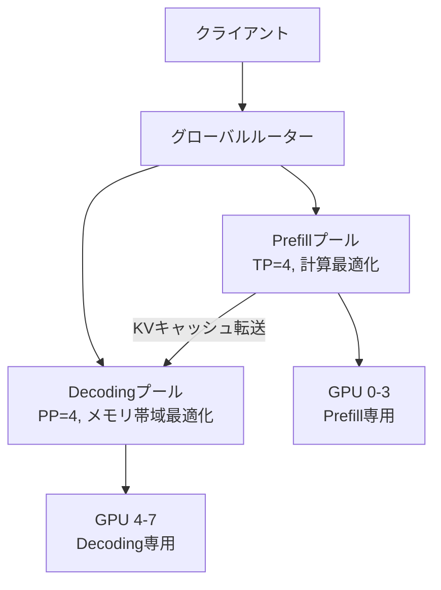

本記事は [DistServe: Disaggregating Prefill and Decoding for Goodput-optimized Large Language Model Serving](https://arxiv.org/abs/2404.09526)（OSDI 2024）の解説記事です。

この記事は [Zenn記事: Ollama v0.23×Docker Composeで構築するマルチGPU分散推論クラスタ実践ガイド](https://zenn.dev/0h_n0/articles/74d69b5a0713d0) の深掘りです。

## 論文概要（Abstract）

LLMの推論処理はPrefill（プロンプト処理）とDecoding（トークン生成）の2フェーズに分かれるが、著者らはこの2フェーズが根本的に異なるリソース特性を持つにもかかわらず、従来のサービングシステムでは同一GPU上で混在実行されていることを問題視している。DistServeは、PrefillとDecodingを物理的に異なるGPUグループに分離配置（Disaggregation）することで、各フェーズに最適なリソース割当とパラレリズム戦略を適用し、SLOを満たすスループット（Goodput）を最大7.4倍向上させたと報告されている。

## 情報源

- **arXiv ID**: 2404.09526
- **URL**: [https://arxiv.org/abs/2404.09526](https://arxiv.org/abs/2404.09526)
- **著者**: Yinmin Zhong, Shengyu Liu, Junda Chen, Jianbo Hu et al.
- **発表年**: 2024（OSDI 2024）
- **分野**: cs.DC, cs.LG

## 背景と動機（Background & Motivation）

LLMの自己回帰推論は2つのフェーズで構成される。

1. **Prefillフェーズ**: 入力プロンプト全体を一括処理し、KVキャッシュを生成する。計算量はプロンプト長の2乗に比例し、**計算バウンド**（GPU演算能力がボトルネック）になる
2. **Decodingフェーズ**: 1トークンずつ逐次生成する。各ステップでKVキャッシュ全体を読み出す必要があるため、**メモリバウンドメモリ帯域幅がボトルネック）になる

著者らは、従来のシステム（vLLM、Orca等）でこの2フェーズを同一GPU上で混在実行すると、以下の問題が発生することを指摘している（論文Section 2より）。

- **Prefill-Decodeの干渉**: Prefillのバースト的な計算負荷が、同時実行中のDecodingリクエストのトークン間レイテンシ（TPOT: Time Per Output Token）を悪化させる
- **リソース最適化の困難**: Prefillは計算集約的でテンソル並列が効果的だが、Decodingはメモリ帯域集約的でパイプライン並列が効果的。同一GPUで両フェーズを実行すると、どちらにも最適でない妥協的な設定になる
- **SLO達成の困難**: TTFT（Time to First Token）はPrefillのレイテンシに依存し、TPOTはDecodingのレイテンシに依存する。両者の制約を同時に満たすリソース配分が難しい

## 主要な貢献（Key Contributions）

- **Prefill/Decode分離アーキテクチャ**: 2フェーズを物理的に異なるGPUプールに配置するDisaggregated Servingの設計と実装
- **フェーズ別パラレリズム最適化**: Prefillにはテンソル並列（TP）、Decodingにはパイプライン並列を独立に適用可能
- **Goodput最大化のリソース割当アルゴリズム**: SLO制約下でPrefill/Decode各プールへのGPU配分を最適化する手法
- **KVキャッシュ転送の最適化**: PrefillノードからDecodingノードへのKVキャッシュストリーミング転送

## 技術的詳細（Technical Details）

### Disaggregated Servingアーキテクチャ

DistServeの中核は、LLMサービングクラスタを2つの独立したGPUプールに分割する設計である。



**処理フロー**（論文Section 3.1より）:
1. クライアントからリクエストを受信
2. グローバルルーターがPrefillプールにリクエストをディスパッチ
3. Prefillプールがプロンプト全体を処理し、KVキャッシュを生成
4. 生成されたKVキャッシュをDecodingプールにストリーミング転送
5. Decodingプールが自己回帰的にトークンを生成
6. 生成されたトークンをクライアントにストリーミング返送

### Goodputの定義と最適化

著者らは「Goodput」を以下のように定義している（論文Definition 1より）。

$$
\text{Goodput} = \frac{\text{SLO を満たしたリクエスト数}}{\text{単位時間}}
$$

一般的なスループット（処理リクエスト数/秒）と異なり、GoodputはSLO違反のリクエストをカウントしない。2つのSLO制約が定義される。

- **TTFT制約**: $\text{TTFT} \leq T_{\text{first}}$（最初のトークンまでの時間）
- **TPOT制約**: $\text{TPOT} \leq T_{\text{per}}$（トークン間の生成時間）

### フェーズ別パラレリズム

著者らは、各フェーズで最適なパラレリズム戦略が異なることを実験的に示している（論文Section 4.2より）。

**Prefillフェーズ（計算バウンド）**:
- テンソル並列（TP）が効果的: 単一レイヤーの計算を複数GPUで分割し、レイテンシを削減
- TP=4でPrefillレイテンシがTP=1の約0.3倍に低下（論文Figure 5より）
- パイプライン並列はバブルが発生しやすく、Prefillには不向き

**Decodingフェーズ（メモリバウンド）**:
- パイプライン並列が効果的: 異なるリクエストのDecodingを異なるパイプラインステージに配置し、メモリ帯域幅を有効活用
- TPはall-reduce通信のオーバーヘッドがDecodeの短い計算時間に対して相対的に大きくなるため非効率

### KVキャッシュ転送

PrefillからDecodingへのKVキャッシュ転送は、DistServeの設計で最も重要な考慮事項の一つである。

KVキャッシュのサイズは以下の式で計算される。

$$
\text{KV Cache Size} = 2 \times L \times H \times D \times S \times \text{sizeof(dtype)}
$$

ここで、
- $L$: レイヤー数
- $H$: KVヘッド数
- $D$: ヘッドの次元数
- $S$: シーケンス長
- 係数2: KeyとValue

例えば、LLaMA-70B（$L=80, H=8, D=128$）でシーケンス長$S=2048$の場合、fp16で約5GBのKVキャッシュが生成される。著者らは、NVLink/InfiniBand接続があればこの転送のレイテンシは許容範囲内と報告しているが、PCIe接続のみの環境ではボトルネックになり得ると指摘している。

### リソース割当アルゴリズム

DistServeは、Prefill/Decodingプールへのリソース割当をプロファイリングベースで最適化する。

```python
def optimize_resource_allocation(
    total_gpus: int,
    workload: WorkloadProfile,
    slo_ttft: float,
    slo_tpot: float,
) -> tuple[int, int, int, int]:
    """Prefill/Decodingプールへの最適なリソース割当を探索

    Args:
        total_gpus: 利用可能なGPU総数
        workload: ワークロードプロファイル（入力長/出力長の分布）
        slo_ttft: TTFT SLO制約（秒）
        slo_tpot: TPOT SLO制約（秒）

    Returns:
        (prefill_gpus, decode_gpus, prefill_tp, decode_pp)
    """
    best_goodput = 0
    best_config = None

    for prefill_gpus in range(1, total_gpus):
        decode_gpus = total_gpus - prefill_gpus
        for prefill_tp in get_valid_tp(prefill_gpus):
            for decode_pp in get_valid_pp(decode_gpus):
                prefill_instances = prefill_gpus // prefill_tp
                decode_instances = decode_gpus // decode_pp

                prefill_goodput = simulate_prefill(
                    prefill_instances, prefill_tp, workload, slo_ttft
                )
                decode_goodput = simulate_decode(
                    decode_instances, decode_pp, workload, slo_tpot
                )

                goodput = min(prefill_goodput, decode_goodput)
                if goodput > best_goodput:
                    best_goodput = goodput
                    best_config = (prefill_gpus, decode_gpus, prefill_tp, decode_pp)

    return best_config
```

## 実装のポイント（Implementation）

### Prefill/Decode比率の決定

著者らは、ワークロード特性（入力長と出力長の分布）によって最適なPrefill/Decode比率が大きく変わることを示している（論文Figure 7より）。

- **短い入力・長い出力**: Decodingに多くのGPUを割当
- **長い入力・短い出力**: Prefillに多くのGPUを割当
- **実測による調整**: 事前のワークロードプロファイリングが重要

### ネットワーク要件

KVキャッシュの転送にはGPU間の高帯域接続が必要である。著者らは以下の要件を報告している。

- **InfiniBand (200Gbps)**: 大規模デプロイでの推奨
- **NVLink**: 同一ノード内でのPrefill/Decode分離に最適
- **PCIe Gen4/5**: 帯域不足により、長いシーケンスではボトルネックになる

### vLLMとの統合

DistServeの概念は現在vLLMにも部分的に取り込まれており、`--enable-disaggregated-prefill`フラグで実験的にPrefill/Decode分離を有効化できる。

## 実験結果（Results）

論文Table 2およびFigure 9-11の結果を整理する。

| モデル | GPU構成 | ベースライン | DistServe Goodput | 改善率 |
|--------|---------|------------|------------------|--------|
| OPT-13B | A100×4 | vLLM | 最大4.5倍向上 | 論文Figure 9 |
| OPT-66B | A100×8 | vLLM | 最大7.4倍向上 | 論文Figure 10 |
| OPT-175B | A100×16 | vLLM | 最大3.2倍向上 | 論文Figure 11 |
| LLaMA-70B | A100×8 | vLLM | P99 TTFT 12.1倍改善 | 論文Table 2 |

著者らは、改善の主因をPrefill/Decode干渉の排除とフェーズ別パラレリズム最適化に帰している。特にOPT-66Bでの7.4倍という改善は、Decodingフェーズでパイプライン並列を使うことでTPOT SLOの達成率が大幅に向上したことによる。

## 実運用への応用（Practical Applications）

### Ollamaマルチインスタンス構成との関連

Zenn記事で解説されているDocker ComposeによるマルチOllamaインスタンス構成は、DistServeの概念と以下の点で関連がある。

- **インスタンス分離**: Zenn記事ではGPUごとにOllamaインスタンスを分離しているが、DistServeはさらにPrefill/Decode単位で分離する
- **Nginxロードバランシング**: DistServeのグローバルルーターに相当する役割を担う。ただし、DistServeのルーターはフェーズ認識型のルーティングを行う点が異なる
- **スケーリング戦略**: Ollamaは水平スケーリング（インスタンス追加）、DistServeは垂直分離（フェーズ分離）というアプローチの違いがある

### コンシューマ環境での適用可能性

DistServeのPrefill/Decode分離はデータセンター規模での利用を前提としており、PCIe接続のみのコンシューマ環境では、KVキャッシュ転送のオーバーヘッドが利益を上回る可能性がある。Ollamaの用途では、従来のインスタンスレベルの負荷分散（Zenn記事のNginx構成）の方が実用的である。

## 関連研究（Related Work）

- **Splitwise** (Patel et al., 2023): Phase splitting の先駆的提案。DistServe は Splitwise を拡張し、Goodput ベースのリソース割当を追加
- **Sarathi-Serve** (Agrawal et al., 2024): Chunked prefills により GPU 利用率を改善。Prefill/Decode 分離と直交するアプローチであり、両者を組み合わせることも可能
- **TetriInfer** (Hu et al., 2024): Prefill/Decode を細粒度にインターリーブする方式。分離とインターリーブの中間的アプローチ

## まとめと今後の展望

DistServeは、LLM推論の2フェーズ（Prefill/Decode）が本質的に異なるリソース特性を持つという観察に基づき、物理的な分離配置による最適化を提案した。Goodputで最大7.4倍の改善は、フェーズ特性に応じたパラレリズム選択の重要性を示している。

Ollamaのようなローカル推論環境では直接の適用は難しいものの、Prefill（プロンプト処理）とDecode（トークン生成）が異なるボトルネックを持つという知見は、`OLLAMA_NUM_PARALLEL` の設定やNginxのロードバランシング戦略を検討する際の理論的基盤となる。

## 参考文献

- **arXiv**: [https://arxiv.org/abs/2404.09526](https://arxiv.org/abs/2404.09526)
- **OSDI 2024**: [https://www.usenix.org/conference/osdi24/presentation/zhong-yinmin](https://www.usenix.org/conference/osdi24/presentation/zhong-yinmin)
- **Related Zenn article**: [https://zenn.dev/0h_n0/articles/74d69b5a0713d0](https://zenn.dev/0h_n0/articles/74d69b5a0713d0)
