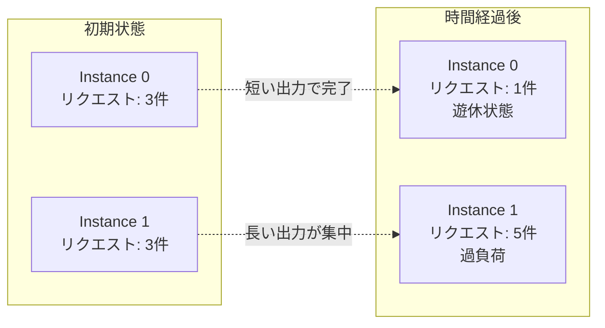
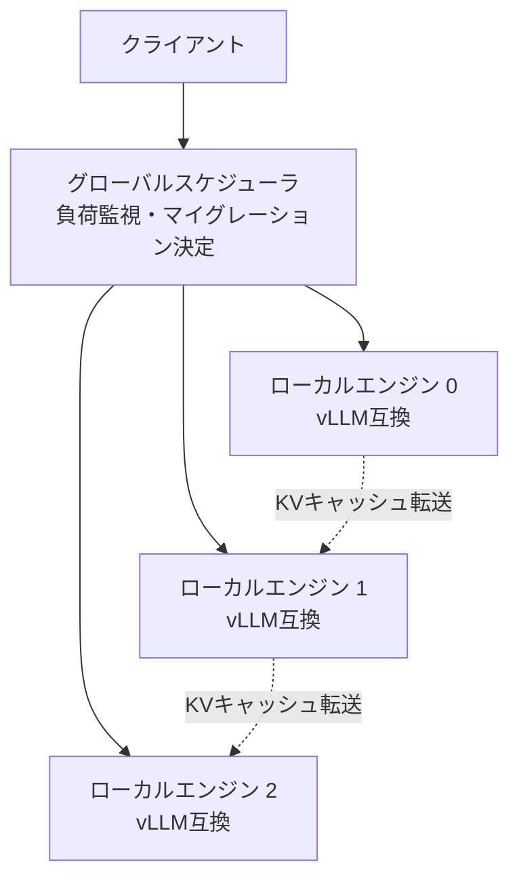

本記事は [Llumnix: Dynamic Scheduling for Large Language Model Serving](https://arxiv.org/abs/2504.11014) の解説記事です。

この記事は [Zenn記事: Ollama v0.23×Docker Composeで構築するマルチGPU分散推論クラスタ実践ガイド](https://zenn.dev/0h_n0/articles/74d69b5a0713d0) の深掘りです。

## 論文概要（Abstract）

著者ら（Alibaba Cloud）は、既存のLLMサービングシステムが初期配置後のリクエスト再分散機能を持たず、負荷不均衡やメモリ断片化がテールレイテンシを悪化させていることを指摘している。Llumnixは、推論中のリクエストのKVキャッシュを別のGPUインスタンスにライブマイグレーションする機能を実装し、動的な負荷再分散を実現する。vLLMベースの実装で、P99 JCT（Job Completion Time）を最大6.8倍削減し、スループットを1.3倍向上させたと報告されている。

## 情報源

- **arXiv ID**: 2504.11014
- **URL**: [https://arxiv.org/abs/2504.11014](https://arxiv.org/abs/2504.11014)
- **著者**: SiyuanFeng, Yichao Jin, Luping Wang et al.（Alibaba Cloud）
- **発表年**: 2024（EuroSys 2024）
- **分野**: cs.DC

## 背景と動機（Background & Motivation）

LLMサービングクラスタでは、複数のGPUインスタンスでリクエストを並列処理する。Zenn記事で解説されているOllama + Nginx構成がその一例である。しかし、既存のシステムには以下の問題がある。

### 初期配置の固定化問題

一度GPUインスタンスに割り当てられたリクエストは、そのインスタンス上で完了するまで移動できない。リクエストの処理時間は出力長に依存して大きくばらつくため、時間の経過とともに特定のインスタンスに負荷が集中する。



### メモリ断片化

vLLMのPagedAttentionはメモリ効率を改善するが、リクエストの到着・完了パターンによって物理ブロックの断片化が発生する。断片化により、VRAMに空きがあるにもかかわらず新しいリクエストを受け入れられない状況が生じる。

### Nginxの静的ロードバランシングの限界

Zenn記事で使用されている`least_conn`方式は、アクティブ接続数が最小のインスタンスにルーティングする。しかし、この方式はリクエストの残り処理時間を考慮しない。長い生成を処理中のインスタンスと、まもなく完了するインスタンスを区別できないため、実質的な負荷不均衡が解消されない。

## 主要な貢献（Key Contributions）

- **KVキャッシュのライブマイグレーション**: 推論中のリクエストのKVキャッシュをページ単位で別インスタンスに転送し、処理を継続する機構
- **グローバル・ローカル2層スケジューリング**: グローバルスケジューラが負荷状況を監視し、ローカルエンジンにマイグレーション指示を送る設計
- **vLLM互換API**: 既存のvLLMベースのアプリケーションをそのまま利用可能
- **Spot Instance対応**: クラウドのSpot Instance中断時に、中断予定インスタンスのリクエストを他インスタンスに退避

## 技術的詳細（Technical Details）

### ライブマイグレーションの仕組み

Llumnixのマイグレーションは、vLLMのPagedAttentionのブロック構造を利用して実装されている。KVキャッシュはブロック単位で管理されているため、ブロック単位での転送が可能である。

**マイグレーションプロトコル**（論文Section 3.2より）:

1. **Prepare**: 送信元インスタンスがマイグレーション対象のリクエストを選択し、KVキャッシュのブロック情報を収集
2. **Transfer**: KVキャッシュブロックをネットワーク経由で受信先インスタンスに転送。転送中もリクエストの処理は継続する
3. **Commit**: 受信先インスタンスが新しいKVキャッシュブロックの配置を確定し、リクエストの処理を引き継ぐ
4. **Cleanup**: 送信元インスタンスが旧KVキャッシュブロックを解放

```python
class KVCacheMigration:
    """KVキャッシュのライブマイグレーション（概念実装）"""

    def migrate_request(
        self,
        request_id: str,
        source_instance: int,
        target_instance: int,
    ) -> bool:
        """リクエストのKVキャッシュを別インスタンスに転送

        Args:
            request_id: 対象リクエストID
            source_instance: 送信元インスタンスID
            target_instance: 受信先インスタンスID

        Returns:
            マイグレーション成功の場合True
        """
        block_table = self.get_block_table(source_instance, request_id)

        target_blocks = self.allocate_blocks(
            target_instance, len(block_table)
        )
        if target_blocks is None:
            return False

        for src_block, dst_block in zip(block_table, target_blocks):
            self.transfer_block(
                source_instance, src_block,
                target_instance, dst_block,
            )

        self.register_request(target_instance, request_id, target_blocks)
        self.deregister_request(source_instance, request_id)
        self.free_blocks(source_instance, block_table)

        return True
```

### 2層スケジューリングアーキテクチャ

Llumnixは、グローバルスケジューラとローカルサービングエンジンの2層構造を採用している。



**グローバルスケジューラの役割**:
- 各ローカルエンジンのメトリクス（キュー長、VRAMの使用率、アクティブリクエスト数）を定期的に収集
- 負荷不均衡を検出した場合、マイグレーション計画を生成
- 新規リクエストの最適な配置先を決定

**ローカルエンジンの役割**:
- vLLMベースの推論実行
- グローバルスケジューラからのマイグレーション指示を実行
- KVキャッシュブロックの送受信

### マイグレーションポリシー

著者らは、マイグレーション対象の選択に以下のヒューリスティクスを使用している。

**負荷均衡マイグレーション**: インスタンス間のキュー長の差が閾値を超えた場合、過負荷インスタンスからリクエストを移動

$$
\text{trigger} = \max_i(Q_i) - \min_j(Q_j) > \theta
$$

ここで $Q_i$ はインスタンス $i$ のキュー長、$\theta$ はマイグレーション閾値。

**メモリ圧縮マイグレーション**: VRAMの断片化率が高いインスタンスから、断片化の少ないインスタンスにリクエストを移動し、メモリのコンパクションを行う。

**Spot Instance退避**: クラウドからSpot中断通知を受けた場合、該当インスタンスの全リクエストを他インスタンスに緊急移動する。

## 実装のポイント（Implementation）

### マイグレーションのオーバーヘッド

マイグレーション中はKVキャッシュの転送とリクエストの処理が並行するが、転送完了までの間、マイグレーション対象リクエストのレイテンシが一時的に増加する。

著者らの実測では、16KBブロック（16トークン分のKVキャッシュ）の転送に約0.1ms（InfiniBand 200Gbps環境）、約1ms（10GbE環境）が必要と報告されている。シーケンス長2048のリクエスト（128ブロック）では、合計12.8〜128msの追加レイテンシが発生する。

### vLLMとの統合

LlumnixはvLLMのコードベースをフォークして構築されている。vLLMのSchedulerとBlockManagerを拡張し、マイグレーション対応のブロック管理を追加している。vLLMのOpenAI互換APIはそのまま利用可能であり、クライアント側の変更は不要である。

### デプロイメント

Kubernetesでのデプロイをサポートしており、各ローカルエンジンはPodとして、グローバルスケジューラはServiceとしてデプロイされる。

## 実験結果（Results）

論文Table 1およびFigure 7-9の実験結果を整理する。評価環境はA100 80GB × 8。

| モデル | 構成 | ベースライン (vLLM) | Llumnix | 改善率 |
|--------|------|-------------------|---------|--------|
| LLaMA-13B | 8 instances | P99 JCT 12.5s | P99 JCT 1.8s | 6.8倍削減 |
| LLaMA-70B | 8 instances (TP=2) | P99 JCT 28.3s | P99 JCT 8.2s | 3.5倍削減 |
| Qwen2-72B | 8 instances (TP=2) | スループット 1.0x | スループット 1.3x | 1.3倍向上 |

著者らは、改善の主因をテールレイテンシの削減に帰している。負荷不均衡が発生した際にリクエストを動的に再分散することで、最も遅いリクエストの完了時間が大幅に短縮される。

### 負荷変動シナリオでの効果

定常的な負荷よりも、バースト的な負荷変動が大きいシナリオでLlumnixの効果が顕著に現れる。著者らは、リクエスト到着率がPoisson分布に従う場合と、バースト的に到着する場合の両方で評価を行い、バーストシナリオでP99 JCTの改善率がより大きいことを報告している。

### マイグレーションコストの分析

著者らは、マイグレーションの頻度とコストのトレードオフについても分析を行っている。マイグレーション頻度が高すぎると転送オーバーヘッドがスループットを低下させ、低すぎると負荷不均衡の解消が遅れる。

最適なマイグレーション閾値$\theta$は、以下の要因で決まる。

- **ネットワーク帯域幅**: InfiniBand環境では$\theta$を小さく設定可能（転送コストが低い）
- **平均シーケンス長**: 長いシーケンスほどマイグレーションコストが大きいため、$\theta$を大きく設定すべき
- **インスタンス数**: インスタンスが多いほど負荷分散の選択肢が増え、$\theta$を小さくしても効果的

著者らの推奨では、8インスタンス構成でInfiniBand環境の場合、キュー長差 $\theta = 3$ 程度が良好なバランスを示したと報告されている。

## 実運用への応用（Practical Applications）

### Ollamaクラスタへの示唆

Zenn記事のNginx + OllamaマルチインスタンスDocker Compose構成と比較すると、Llumnixは以下の改善を提供する。

| 観点 | Nginx least_conn | Llumnix |
|------|-----------------|---------|
| 分散方式 | 新規リクエストのみ分散 | 実行中リクエストも再分散 |
| 負荷指標 | アクティブ接続数 | キュー長 + VRAM使用率 + 推定残り時間 |
| 障害対応 | fail_timeout で除外 | ライブマイグレーションで退避 |
| 設定変更 | Nginx reload必要 | 自動（グローバルスケジューラ） |

ただし、Llumnixのマイグレーション機能はvLLMの内部構造に依存しており、OllamaのAPIには対応していない。Ollama環境でLlumnixの効果を得るには、vLLMへの移行が前提となる。

### Nginxベースの段階的改善

Llumnixの完全な移行が難しい場合、以下の段階的改善をNginx構成に適用できる。

1. **ヘルスチェックの強化**: `/api/ps` エンドポイントでモデルロード状態を確認し、実際に処理可能なインスタンスのみにルーティング
2. **カスタムメトリクスベースのルーティング**: Prometheus経由で各インスタンスのGPU使用率を取得し、Nginx Plus（商用版）のzone-awareルーティングで活用
3. **リクエストキューの可視化**: 各インスタンスのキュー長をGrafanaダッシュボードに表示し、手動での負荷調整に活用

## 関連研究（Related Work）

- **vLLM** (Kwon et al., 2023): Llumnixのベースとなるサービングエンジン。PagedAttentionのブロック構造がマイグレーションの基盤
- **AlpaServe** (Li et al., 2023): モデル並列を活用した統計的多重化。Llumnixとは異なり、リクエスト単位のマイグレーションは行わない
- **DistServe** (Zhong et al., 2024): Prefill/Decode分離。Llumnixとは直交するアプローチで、組み合わせることで更なる改善が可能

## まとめと今後の展望

Llumnixは、LLMサービングにおける「一度配置したリクエストは動かせない」という制約を、KVキャッシュのライブマイグレーションにより解消した。P99 JCTの最大6.8倍削減は、特に負荷変動が大きいシナリオで実用的な価値を持つ。

Zenn記事のNginx + Ollama構成は初期配置（新規リクエストの振り分け）のみを最適化するが、Llumnixはリクエストのライフサイクル全体を通じた動的最適化を実現する。この概念は、将来的にOllamaやllama.cppのスケジューラにも影響を与える可能性がある。

## 参考文献

- **arXiv**: [https://arxiv.org/abs/2504.11014](https://arxiv.org/abs/2504.11014)
- **Code**: [https://github.com/alibaba/llumnix](https://github.com/alibaba/llumnix)
- **Related Zenn article**: [https://zenn.dev/0h_n0/articles/74d69b5a0713d0](https://zenn.dev/0h_n0/articles/74d69b5a0713d0)
