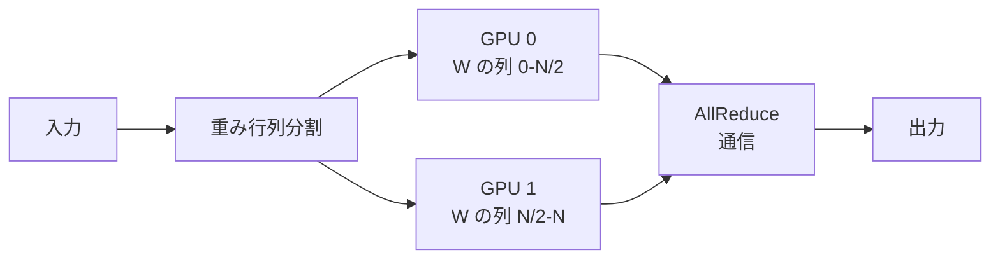
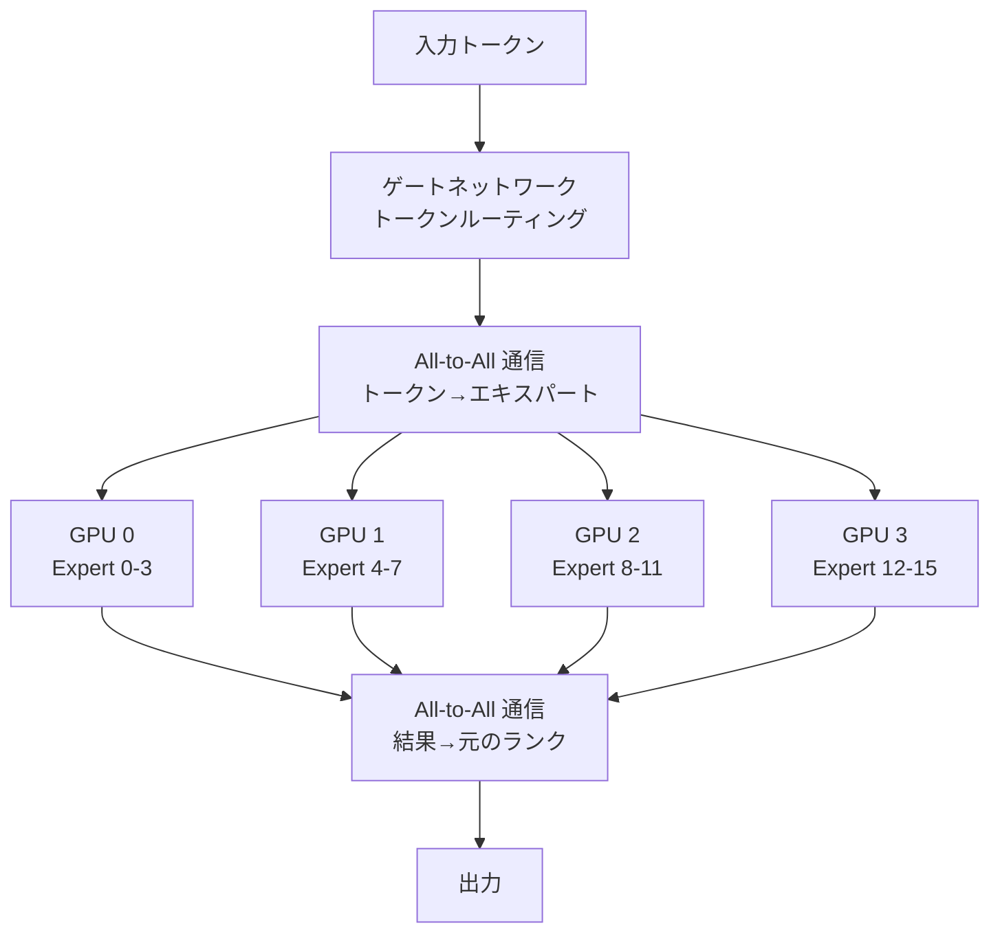

本記事は [Scaling LLM Inference: Innovations in Tensor Parallelism, Context Parallelism, and Expert Parallelism](https://engineering.fb.com/2025/10/17/ai-research/scaling-llm-inference-innovations-tensor-parallelism-context-parallelism-expert-parallelism/)（Engineering at Meta, 2025年10月17日公開）の解説記事です。

この記事は [Zenn記事: Ollama v0.23×Docker Composeで構築するマルチGPU分散推論クラスタ実践ガイド](https://zenn.dev/0h_n0/articles/74d69b5a0713d0) の深掘りです。

## ブログ概要（Summary）

Metaのエンジニアリングチーム（Cen Zhao, Xiaodong Wang, Jianyu Huang）は、LLM推論を本番環境でスケーリングするために実践している3つの並列化戦略を公開している。テンソル並列（TP）はモデルレイヤーを複数GPUに分散し、コンテキスト並列（CP）は100万〜1000万トークンの超長コンテキストを処理可能にし、エキスパート並列（EP）はMixture-of-Expertsモデルの効率的なサービングを実現する。特に、GPU間通信のレイテンシを削減するDirect Data Access（DDA）最適化により、Decodeフェーズで10〜50%の高速化を達成したと報告されている。

## 情報源

- **種別**: 企業テックブログ
- **URL**: [Engineering at Meta](https://engineering.fb.com/2025/10/17/ai-research/scaling-llm-inference-innovations-tensor-parallelism-context-parallelism-expert-parallelism/)
- **組織**: Meta AI Research
- **発表日**: 2025年10月17日

## 技術的背景（Technical Background）

LLM推論のパフォーマンス最適化において、Metaは以下の3つの指標を重視している。

1. **リソース効率**: GPU使用率の最大化
2. **スループット**: 秒あたりの処理クエリ数
3. **レイテンシ**: TTFT（Time to First Token）を350ms未満、TPOT（Time Per Output Token）を25ms未満

推論処理は2つのフェーズに分かれる。

- **Prefillフェーズ**: プロンプト全体を処理してKVキャッシュを生成。アテンション計算がシーケンス長の2乗に比例するため、計算集約的
- **Decodeフェーズ**: 1トークンずつ生成。KVキャッシュの読み出しが主要な処理であり、メモリ帯域集約的

この2フェーズの特性の違いが、各並列化戦略の適用方法に大きく影響する。Zenn記事で解説されているOllamaのテンソル分割（llama.cppベース）は、ここで述べるテンソル並列の簡易版に相当する。

## 実装アーキテクチャ（Architecture）

### 1. テンソル並列（Tensor Parallelism）

テンソル並列は、Transformerの各レイヤーの重み行列を複数GPUに分割する方式である。Ollamaが内部で使用するllama.cppのテンソル分割と同じ概念に基づいている。

**課題**: テンソル並列では各レイヤーの計算後にAllReduce通信が必要であり、この通信がレイテンシの最大30%を占めるとMetaは報告している。

### Direct Data Access（DDA）最適化

AllReduceの通信レイテンシを削減するために、MetaはDDAという通信最適化手法を開発している。

**DDA Flatアルゴリズム**: 従来のAllReduceがリング型の段階的集約（計算量$O(N)$）を行うのに対し、DDA Flatは各ランクが他のすべてのランクのメモリから直接データをロードする。これにより通信レイテンシが$O(1)$に削減される。

$$
\text{DDA Flat}: \text{Latency} = O(1) \quad \text{vs} \quad \text{Ring AllReduce}: \text{Latency} = O(N)
$$

**DDA Treeアルゴリズム**: Reduce-ScatterとAll-Gatherの2フェーズで構成され、大きなテンソルサイズでの効率を改善する。各フェーズでDDAの直接メモリアクセスを活用する。

**性能結果**（ブログより）:
- AMD MI300Xにおいて、DDAはRCCLベースラインに対してDecodeで10〜50%の高速化を達成
- Prefillでは10〜30%の高速化
- TPOT（トークン間レイテンシ）が約10%改善

### 2. コンテキスト並列（Context Parallelism）

コンテキスト並列は、極めて長い入力シーケンス（100万〜1000万トークン）を処理するための並列化戦略である。

**課題**:
- アテンション計算量がシーケンス長$S$に対して$O(S^2)$でスケール
- KVキャッシュのメモリ消費がシーケンス長に線形比例
- 単一ホストのGPUメモリでは100万トークンのKVキャッシュを保持できない

**2つの実装バリアント**:

**Pass-KV**: 入力トークン列を各ランクに均等分割する。各ランクは自身の分割に対してQueryを計算し、他のランクからKey-Valueテンソルを受信して全コンテキストに対するアテンションを計算する。

$$
\text{Attention}_{\text{rank } r} = \text{softmax}\left(\frac{Q_r \cdot [K_0; K_1; \ldots; K_{R-1}]^T}{\sqrt{d}}\right) [V_0; V_1; \ldots; V_{R-1}]
$$

ここで、$R$ はランク数、$[;]$ は連結操作を表す。

**Pass-Q**: Pass-KVの逆で、Queryテンソルを他のランクに送信する。KVキャッシュのサイズがQueryより大きい場合（Decodeフェーズ等）に通信量を削減できる。

**性能結果**（ブログより）:
- H100 1ノード（8GPU）で100万トークンのPrefillを1分未満で処理
- H100 32ノードで1000万トークンのPrefillを1分未満で処理
- Llama 3 405B: 128Kトークンのprefillを3.8秒（16ノード使用）
- 100万トークンのprefillを77秒（ほぼ線形スケーリング）

### 3. エキスパート並列（Expert Parallelism）

エキスパート並列は、Mixture-of-Experts（MoE）モデルで多数のエキスパートを複数GPUに分散配置する戦略である。

**課題**: All-to-All通信がエンドツーエンドレイテンシの10〜30%を占める。Metaは以下の最適化を探索している。

- **Dynamic All-to-All**: サブチャンク単位でデータを隣接ランクに分配し、通信パターンを最適化
- **Persistent All-to-All**: メモリハンドル交換のオーバーヘッドとCPUコストを削減するために、通信チャネルを永続化

## パフォーマンス最適化（Performance）

### 実測値のまとめ

| 並列化戦略 | 最適化手法 | 改善率 | 測定環境 |
|-----------|----------|--------|---------|
| テンソル並列 | DDA Flat | Decode 10-50%高速化 | AMD MI300X |
| テンソル並列 | DDA Tree | Prefill 10-30%高速化 | AMD MI300X |
| コンテキスト並列 | Pass-KV | 100万トークン 1分未満 | H100×8 |
| コンテキスト並列 | Pass-KV/Q | 1000万トークン 1分未満 | H100×32ノード |
| エキスパート並列 | All-to-All | レイテンシ10-30%が通信 | マルチGPU |

### OllamaのテンソルSplitとの比較

Ollamaが使用するllama.cppのテンソル分割は、Metaのテンソル並列の簡略版として位置づけられる。

| 観点 | Ollama (llama.cpp) | Meta TP |
|------|-------------------|---------|
| 通信方式 | PCIe経由 | NVLink/InfiniBand + DDA |
| 通信最適化 | なし | DDA Flat/Tree |
| スケーリング効率 | 70-75%（PCIe制約） | 90%以上（DDA + NVLink） |
| 対象環境 | コンシューマGPU | データセンターGPU |
| セットアップ | 自動検出 | 手動設定必要 |

Zenn記事で報告されている「PCIe接続でのスケーリング効率70〜75%」は、NVLink/DDAがないことによる通信オーバーヘッドに起因する。MetaのDDA最適化は、このオーバーヘッドをハードウェア・ソフトウェア両面から削減するアプローチである。

## 運用での学び（Production Lessons）

### レイテンシ目標の設定

Metaは具体的なレイテンシ目標（TTFT < 350ms、TPOT < 25ms）を設定し、これをSLOとしてサービングインフラの最適化を駆動している。Ollama環境でも同様に、ユースケースに応じたレイテンシ目標を設定することが推奨される。

### 今後のアーキテクチャ方向性

Metaは以下の方向性を示している。

1. **N-D並列化**: CP、PP（パイプライン並列）、EP、TPを異なる次元で組み合わせるハイブリッド並列化
2. **Disaggregated推論**: 計算集約的なPrefillとメモリ集約的なDecodeを異なるハードウェアに分離配置（DistServeと同様の方向性）
3. **カーネル統合型通信**: 通信操作を計算カーネルに直接組み込み、通信と計算のオーバーラップを最大化
4. **デバイス主導型操作**: CPUオーバーヘッドを排除し、GPU同士が直接通信を開始する方式

これらの方向性は、コンシューマ環境では直接適用困難だが、vLLMやllama.cppなどのOSSを通じて、一部の最適化が間接的にOllama環境にも波及する可能性がある。

## 学術研究との関連（Academic Connection）

- **Megatron-LM** (Shoeybi et al., 2020): テンソル並列の基礎となった論文。MetaのTP実装はMegatron-LMの概念を拡張し、DDAで通信を最適化している
- **Ring Attention** (Liu et al., 2023): コンテキスト並列の学術的基盤。MetaのPass-KV/Pass-QはRing Attentionの産業実装として位置づけられる
- **Mixtral** (Jiang et al., 2024): MoEモデルの実装例。Metaのエキスパート並列はMoEモデルのサービングに必要な技術を体系化している

## まとめと実践への示唆

Metaが公開した3つの並列化戦略は、LLM推論のスケーリングにおける現在の最前線を示している。テンソル並列のDDA最適化はGPU間通信のボトルネックを直接攻略し、コンテキスト並列は1000万トークンという極端な長コンテキストの実用的な処理を可能にし、エキスパート並列はMoEモデルの効率的なサービングの基盤を提供する。

OllamaのようなコンシューマGPU環境では、NVLinkやInfiniBandが利用できないため、MetaのDDA最適化を直接適用することはできない。しかし、テンソル並列の基本概念（モデルレイヤーのGPU間分散）はOllamaのテンソル分割と共通であり、PCIe接続環境での効率70〜75%というZenn記事の数値は、通信最適化の余地がどこにあるかを理解する上で重要な参考情報となる。

## 参考文献

- **Blog URL**: [https://engineering.fb.com/2025/10/17/ai-research/scaling-llm-inference-innovations-tensor-parallelism-context-parallelism-expert-parallelism/](https://engineering.fb.com/2025/10/17/ai-research/scaling-llm-inference-innovations-tensor-parallelism-context-parallelism-expert-parallelism/)
- **Related Papers**: Megatron-LM ([arXiv:1909.08053](https://arxiv.org/abs/1909.08053)), Ring Attention ([arXiv:2310.01889](https://arxiv.org/abs/2310.01889))
- **Related Zenn article**: [https://zenn.dev/0h_n0/articles/74d69b5a0713d0](https://zenn.dev/0h_n0/articles/74d69b5a0713d0)
