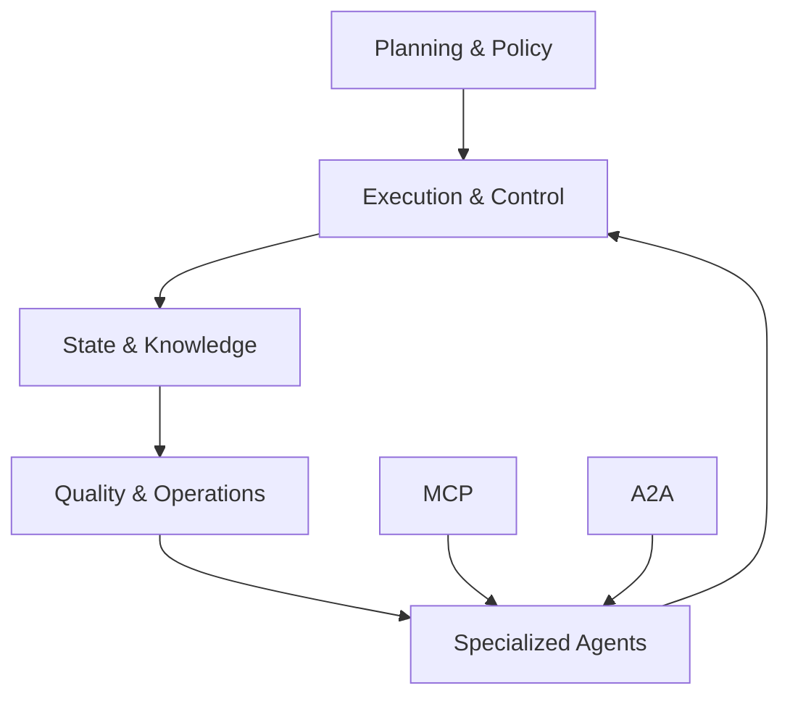

本記事は [The Orchestration of Multi-Agent Systems: Architectures, Protocols, and Enterprise Adoption（arXiv:2601.13671）](https://arxiv.org/abs/2601.13671) の解説記事です。

## 論文概要（Abstract）

本論文は、自律エージェントが構造化された協調とコミュニケーションを通じて共有目標を達成する「オーケストレーテッド・マルチエージェントシステム」の統一的フレームワークを提示している。著者らは、計画・ポリシー管理、実行・制御管理、状態・知識管理、品質・運用管理、特化エージェント群の5つのオーケストレーション層を統合し、2つの通信プロトコル — **Model Context Protocol（MCP）**と**Agent-to-Agent（A2A）Protocol** — によるエージェント間のインタラクションを標準化するアプローチを提案している。

この記事は [Zenn記事: LangGraph Functional API×状態分割で設計するステートマシン実装戦略](https://zenn.dev/0h_n0/articles/cd93e00b73bf28) の深掘りです。

## 情報源

- **arXiv ID**: 2601.13671
- **URL**: [https://arxiv.org/abs/2601.13671](https://arxiv.org/abs/2601.13671)
- **著者**: Apoorva Adimulam, Rajesh Gupta, Sumit Kumar
- **発表年**: 2026
- **分野**: cs.AI, cs.MA

## 背景と動機（Background & Motivation）

LLMベースのエージェントが個々のタスクで優れた能力を発揮する一方で、複数のエージェントが協調して複雑な問題を解決する**マルチエージェントシステム（MAS）**の設計と運用には、標準化されたアーキテクチャとプロトコルが不足している。現行のフレームワーク（LangGraph、AutoGen、CrewAI等）はそれぞれ独自のインターフェースを持ち、相互運用性やガバナンスの観点で課題を抱えている。

本論文は、これらの課題に対して(1)アーキテクチャ的な統一フレームワーク、(2)標準化された通信プロトコル、(3)エンタープライズ規模での実装パターンを包括的に整理し、実用的な設計指針を提供することを目的としている。

LangGraphのStateGraphが単一アプリケーション内のエージェント間通信をグラフ構造で管理するのに対し、本論文のMCPとA2Aプロトコルは**フレームワーク横断的な標準化**を志向しており、異なるシステム間でのエージェント連携を可能にする点で補完的な位置づけにある。

## 主要な貢献（Key Contributions）

- **5層オーケストレーションアーキテクチャ**: 計画・実行・状態管理・品質保証・エージェント群を統一的に管理するフレームワーク
- **MCPとA2Aプロトコルの統合**: エージェント-ツール間（MCP）とエージェント-エージェント間（A2A）の通信を標準化
- **エンタープライズ導入パターン**: 金融、ソフトウェアエンジニアリング、顧客サービス等の具体的な事例とその成果指標
- **ガバナンスフレームワーク**: ポリシー強制、監査、コンプライアンスを組み込んだ運用モデル

## 技術的詳細（Technical Details）

### 5層オーケストレーションアーキテクチャ

著者らが提案するフレームワークは、以下の5つの管理層で構成されている。



**1. 計画・ポリシー管理層**: 高レベルの目標を構造化された実行計画に分解する。ガバナンス制約を計画段階で埋め込むことにより、実行時のポリシー違反を予防する。LangGraphにおけるStateGraphの定義フェーズ、つまりノードとエッジの構造を設計する段階に対応する。

**2. 実行・制御管理層**: エージェントの初期化、実行、検証、完了の各フェーズを管理する分散制御システムである。並行性と依存関係を管理し、LangGraphのランタイムエンジンに相当する役割を担う。

**3. 状態・知識管理層**: デュアルファンクションのコンポーネントとして、(a)状態ユニットがチェックポイント、ワークフロー進捗、エージェント状態を管理し、(b)知識ユニットが外部データソースに接続して検索可能なコンテキストを提供する。LangGraphにおける`State`スキーマとチェックポインター（MemorySaver/PostgresSaver）に対応する。

**4. 品質・運用管理層**: 集約された出力を検証し、パフォーマンス指標（レイテンシ、スループット、成功率）を監視する。異常検知時には修復アクションをトリガーする。

**5. 特化エージェント群**: Worker（ドメイン固有タスク実行）、Service（運用ユーティリティ）、Support（監視・監督）の3カテゴリで構成される。

### Model Context Protocol（MCP）

MCPは、エージェントが外部ツールやデータソースにアクセスするためのクライアント-サーバーアーキテクチャを標準化するプロトコルである。

MCPの主要機能は以下の通り（論文Section 4.1に基づく）。

1. **スキーマ一貫性の強制**: 外部呼び出しのインターフェースを統一し、異なるツール間で一貫したデータ形式を保証
2. **アクセス制御と監査性**: 認証・認可メカニズムにより、エージェントがアクセス可能なツールを制限
3. **ステートフル/ステートレスセッション管理**: ツールとの対話をセッション単位で管理し、状態の永続化を選択可能
4. **ログ同期**: ツール呼び出しのログをオーケストレーション状態と同期し、デバッグと監査を容易にする

LangGraphでは、ノード内でのツール呼び出しがこのMCPの役割に該当する。Functional APIの`@task`デコレータでラップされた外部API呼び出しは、MCPのクライアント-サーバーパターンの一実装と見なせる。

拡張実装として、**ScaleMCP**（動的なツールインベントリ同期）や**AgentMaster**（MCPとA2Aの統合によるマルチモーダル協調）が紹介されている。

### Agent-to-Agent（A2A）Protocol

A2Aは、エージェント間のピアレベル通信を管理するプロトコルである。MCPがエージェント-ツール間の垂直的な通信を標準化するのに対し、A2Aはエージェント-エージェント間の水平的な通信を標準化する。

A2Aの通信パターンは以下の通り。

- **Worker → Worker**: タスクの委譲と結果の共有
- **Service → Service**: 診断情報の通信
- **Support → All**: テレメトリのブロードキャスト
- **動的依存関係管理**: 中央集権的な介入なしでエージェント間の依存関係を解決

著者らは「A2Aはピア指向だが、オーケストレーション層の監督下に置かれ、交換の検証と同期を通じてワークフローの一貫性を維持する」と述べている。

LangGraphのStateGraphでは、ノード間の通信は共有State（`TypedDict`や`Pydantic BaseModel`）を介して行われる。A2Aの「ピア通信 + オーケストレータ監督」というパターンは、Reducerを用いた並列ノードの状態マージ（`Annotated[type, reducer_func]`）に近い概念である。

### 状態管理アプローチ

論文では、状態管理を運用状態と知識状態に分離するアプローチが説明されている。

- **状態ユニット**: チェックポイント、ワークフロー進捗、エージェント状態、アクティビティログを管理。状態復元によるリカバリをサポート
- **知識ユニット**: 外部データソースへの接続を管理し、エージェントの判断に必要なコンテキストを提供

この分離は、LangGraphの状態分割パターン（`InputState`/`OutputState`/`PrivateState`）と設計思想を共有している。`InputState`と`OutputState`が外部インターフェースを定義し、`InternalState`が内部処理用の全状態を保持する設計は、本論文の状態ユニット/知識ユニットの分離に対応する。

## 実装のポイント（Implementation）

本論文のフレームワークをLangGraphベースのシステムに適用する際の実装指針を整理する。

1. **MCP統合**: LangGraphのノード内でツール呼び出しを行う際、MCPサーバーとしてツールを公開し、クライアント-サーバーパターンで呼び出す。これにより、同じツールを異なるエージェントフレームワーク（LangGraph、AutoGen等）から利用できる。

2. **A2Aパターンの実装**: LangGraphのReducerパターン（`Annotated[list[dict], merge_documents]`）でエージェント間の状態マージを標準化する。並列ノードが同じフィールドに書き込む場合、マージ戦略を明示的に宣言することがA2Aの「検証された交換」に対応する。

3. **ガバナンス層の追加**: StateGraphに品質チェックノードを追加し、エージェント出力のスキーマ検証と品質評価を自動化する。Functional APIでは`@task`の結果に対してバリデーションを実行する関数を挟む。

4. **監視とテレメトリ**: エージェントの実行パフォーマンス（レイテンシ、トークン使用量、成功率）を構造化ログとして記録し、異常検知に利用する。

## Production Deployment Guide

### AWS実装パターン（コスト最適化重視）

MCP/A2AベースのマルチエージェントオーケストレーションをAWSに実装する場合の構成例を示す。

| 規模 | 月間リクエスト | 推奨構成 | 月額コスト | 主要サービス |
|------|--------------|---------|-----------|------------|
| **Small** | ~3,000 (100/日) | Serverless | $80-180 | Lambda + Bedrock + API Gateway |
| **Medium** | ~30,000 (1,000/日) | Hybrid | $400-900 | ECS Fargate + Bedrock + EventBridge |
| **Large** | 300,000+ (10,000/日) | Container | $2,500-6,000 | EKS + Karpenter + Bedrock Batch |

**Small構成の詳細** (月額$80-180):
- **Lambda**: エージェントノード実行（1GB RAM, $25/月）
- **API Gateway**: MCPエンドポイント公開（REST API, $5/月）
- **Bedrock**: Claude 3.5 Haiku、Prompt Caching有効（$100/月）
- **EventBridge**: A2Aイベントルーティング（$5/月）
- **DynamoDB**: 状態・知識ストア（On-Demand, $15/月）
- **CloudWatch**: テレメトリ収集（$10/月）

**コスト試算の注意事項**: 上記は2026年5月時点のAWS ap-northeast-1料金に基づく概算値です。最新料金は [AWS料金計算ツール](https://calculator.aws/) で確認してください。

### Terraformインフラコード

```hcl
resource "aws_apigatewayv2_api" "mcp_gateway" {
  name          = "mcp-tool-gateway"
  protocol_type = "HTTP"
  description   = "MCP Protocol Gateway for agent-tool communication"
}

resource "aws_cloudwatch_event_bus" "a2a_bus" {
  name = "agent-to-agent-bus"
}

resource "aws_cloudwatch_event_rule" "worker_delegation" {
  name           = "worker-delegation-rule"
  event_bus_name = aws_cloudwatch_event_bus.a2a_bus.name
  event_pattern = jsonencode({
    source      = ["agent.worker"]
    detail-type = ["TaskDelegation"]
  })
}

resource "aws_lambda_function" "orchestrator" {
  filename      = "orchestrator.zip"
  function_name = "mas-orchestrator"
  role          = aws_iam_role.orchestrator.arn
  handler       = "index.handler"
  runtime       = "python3.12"
  timeout       = 120
  memory_size   = 1024
  environment {
    variables = {
      MCP_GATEWAY_URL = aws_apigatewayv2_api.mcp_gateway.api_endpoint
      A2A_BUS_NAME    = aws_cloudwatch_event_bus.a2a_bus.name
      STATE_TABLE     = aws_dynamodb_table.agent_state.name
    }
  }
}

resource "aws_dynamodb_table" "agent_state" {
  name         = "mas-agent-state"
  billing_mode = "PAY_PER_REQUEST"
  hash_key     = "workflow_id"
  range_key    = "agent_id"
  attribute {
    name = "workflow_id"
    type = "S"
  }
  attribute {
    name = "agent_id"
    type = "S"
  }
  ttl {
    attribute_name = "expire_at"
    enabled        = true
  }
}
```

### コスト最適化チェックリスト

- [ ] API Gateway: MCPエンドポイントの使用量ベース課金
- [ ] EventBridge: A2Aメッセージルーティング（$1/100万イベント）
- [ ] Lambda: エージェントノードのメモリ最適化
- [ ] Bedrock Prompt Caching: MCPコンテキストの再利用で30-90%削減
- [ ] DynamoDB On-Demand: 低トラフィック時のコスト最適化
- [ ] CloudWatch: テレメトリ収集のサンプリングレート調整
- [ ] AWS Budgets: マルチエージェント構成のコスト監視
- [ ] IAM最小権限: エージェントごとのアクセス制御

## 実験結果（Results）

本論文はアーキテクチャとプロトコルの設計論文であり、著者自身によるベンチマーク実験は含まれていない。代わりに、エンタープライズ導入事例から以下の成果指標が引用されている（論文Section 6に基づく）。

| 適用領域 | 成果指標 |
|---------|---------|
| 保険引受 | 文書解析精度95%、承認プロセス20倍高速化 |
| 請求処理 | 処理コスト80%削減 |
| レガシーコード近代化 | 開発時間50%削減 |
| 顧客サービス | ルーティンクエリの80%を自律的に解決 |

これらの数値は論文中で引用されている個別事例からのものであり、統一的な実験条件下での比較ではない点に留意が必要である。

## 実運用への応用（Practical Applications）

本論文のフレームワークは、LangGraphを使った以下のシナリオに適用可能である。

1. **クロスフレームワーク連携**: MCP準拠のツールサーバーを構築し、LangGraphエージェントとAutoGenエージェントが同一ツールを共有する設計
2. **エンタープライズガバナンス**: StateGraphに品質チェックノードを組み込み、出力のスキーマ検証・PII検出・コンプライアンスチェックを自動化
3. **段階的マイグレーション**: 既存の単一エージェントシステムをMAS化する際、まずMCPでツールを標準化し、次にA2Aでエージェント間通信を追加するアプローチ

## 関連研究（Related Work）

- **LangGraph（LangChain, 2024）**: グラフベースのステートフルワークフロー。本論文のアーキテクチャは、LangGraphの状態管理パターンをフレームワーク横断的に拡張する位置づけ。
- **AutoGen（Microsoft, 2023）**: 会話ベースのマルチエージェントフレームワーク。A2Aプロトコルの実装対象の1つとして言及されている。
- **CrewAI（2024）**: ロールベースのエージェント協調。本論文のWorker/Service/Supportエージェント分類と設計思想が共通している。

## まとめと今後の展望

本論文は、マルチエージェントシステムのオーケストレーションを5層アーキテクチャとMCP/A2Aプロトコルで統一的に定式化している。LangGraphが単一アプリケーション内の状態管理とワークフロー定義に優れる一方、MCP/A2Aはフレームワーク横断的な相互運用性を提供する。両者を組み合わせることで、LangGraphの`@task`をMCPクライアントとして実装し、StateGraphのReducerでA2Aメッセージのマージを管理するような、標準化されたマルチエージェントシステムの構築が可能になる。エンタープライズ環境でのガバナンス要件（監査ログ、ポリシー強制、アクセス制御）への対応方針は、プロダクション環境でのLangGraph運用にも直接的な示唆を提供している。

## 参考文献

- **arXiv**: [https://arxiv.org/abs/2601.13671](https://arxiv.org/abs/2601.13671)
- **Related Zenn article**: [https://zenn.dev/0h_n0/articles/cd93e00b73bf28](https://zenn.dev/0h_n0/articles/cd93e00b73bf28)

---

> 本記事はAI（Claude Code）により自動生成されました。内容の正確性については原論文をご確認ください。
