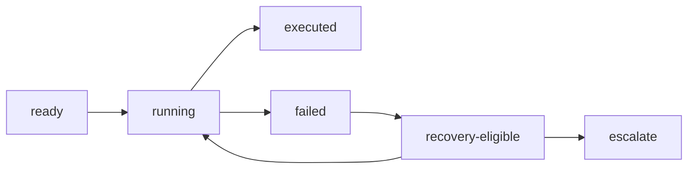

本記事は [From Agent Loops to Structured Graphs: A Scheduler-Theoretic Framework for LLM Agent Execution](https://arxiv.org/abs/2604.11378) の解説記事です。

## 論文概要（Abstract）

本論文は、LLMエージェントシステムで広く採用されている「エージェントループ」パラダイムの構造的弱点を特定し、古典的なスケジューリング理論を適用した新しい実行フレームワーク**SGH（Structured Graph Harness）**を提案するポジションペーパーである。著者は70のエージェントシステムを調査し、ループベースのアプローチが全体の60%を占める一方で、暗黙的な依存関係、無限リカバリループ、実行履歴の可変性という3つの根本的問題を抱えていると指摘している。

この記事は [Zenn記事: LangGraph Functional API×状態分割で設計するステートマシン実装戦略](https://zenn.dev/0h_n0/articles/cd93e00b73bf28) の深掘りです。

## 情報源

- **arXiv ID**: 2604.11378
- **URL**: [https://arxiv.org/abs/2604.11378](https://arxiv.org/abs/2604.11378)
- **著者**: Hu Wei
- **発表年**: 2026
- **分野**: cs.AI, cs.SE

## 背景と動機（Background & Motivation）

LLMエージェントの大多数は「ループ型」の実行モデルを採用している。ユーザのクエリを受け取り、LLMが次のアクションを決定し、ツールを呼び出し、その結果をコンテキストに追加して次の判断を行う — このサイクルを繰り返す方式である。LangGraphのようなフレームワークはグラフベースの構造を導入しているが、著者は従来のアプローチに共通する3つの構造的弱点を特定している。

1. **暗黙的な依存関係**: ステップ間の依存関係がコンテキストウィンドウ内にのみ存在し、検証不可能である。「コードを修正し、次にテストを実行する」という依存関係は、プロンプト文中にしか記録されない。
2. **無限リカバリ**: 失敗時のリカバリに有界セマンティクスがない。LLMがリトライ・スキップ・再計画のどれを行うか自律的に判断するため、リカバリが収束する保証がない。
3. **可変な実行計画**: LLMが実行中に計画を暗黙的に書き換える可能性がある。元の計画がコンテキスト内で上書きされ、デバッグや再現性を損なう。

これらの問題は、エージェントが短いタスクを処理する場合には顕在化しにくいが、長時間の複雑なタスク（例: 大規模コードベースのリファクタリング）では深刻な障害を引き起こす。

## 主要な貢献（Key Contributions）

著者は以下の4点を貢献として主張している（論文Section 1より）。

- **統一フレームワーク**: エージェントループを「単一レディユニットスケジューラ」として古典スケジューリング理論の中に位置づけ、LLMノードの非決定性がもたらす課題を形式的に分析
- **70システムの比較分析**: 制御可能性（controllability）、表現力（expressiveness）、実装可能性（implementability）の3軸で体系的にトレードオフを評価
- **SGHの形式仕様**: ノード状態マシンによる終了保証と健全性保証を備えたフレームワーク設計
- **7群実験プロトコル**: 将来の実証研究に向けた、各設計要素の効果を分離可能な実験デザイン

## 技術的詳細（Technical Details）

### スケジューリング理論による定式化

著者はエージェント実行を以下のタプルで定式化している（論文Definition 3.1より）。

$$
\mathcal{E} = (\mathcal{S}, \mathcal{U}, \mathcal{P}, \mathcal{O}, \Delta)
$$

ここで、

- $\mathcal{S}$: ノード状態の集合 $\\{(v, s_v) \mid v \in V\\}$
- $\mathcal{U}$: 状態からレディ（実行可能）なノード集合へのマッピング関数
- $\mathcal{P}$: スケジューリングポリシー（決定的関数または非決定的関係）
- $\mathcal{O}$: 結果空間 $\\{\text{success}, \text{failure}, \text{retry}, \text{escalate}\\}$
- $\Delta$: グローバル状態を更新する状態遷移関数

この定式化の要点は**レディセットのカーディナリティ**による分類である。

- **単一レディユニットスケジューラ**: $|\mathcal{U}(s)| \leq 1$ — エージェントループが該当。一度に1つのノードしか実行できない
- **複数レディユニットスケジューラ**: $|\mathcal{U}(s)| \geq 1$ — グラフベースの実行エンジンが該当。並列実行が可能

著者はエージェントループを「非決定的・単一レディユニットスケジューラ」として特徴づけている。スケジューリングポリシーがLLMの推論に依存するため不透明であり、かつ一度に1ステップしか実行できない制約がある。

### 70システムの調査結果

論文では70のエージェントシステムを調査し、以下の分布を報告している（論文Table 1に基づく）。

| アーキテクチャ | プロジェクト数 | 割合 |
|------|------|------|
| エージェントループ | 41 | 60% |
| イベント駆動 | 11 | 16% |
| ハイブリッド | 7 | 10% |
| グラフ/フロー | 5 | 7% |
| ステートマシン | 4 | 6% |

著者によると、グラフベースのシステムはステートマシンベースのアプローチよりも高い失敗ループ率（16%）を示したと報告されている。この知見がSGHのエスカレーションプロトコル設計の動機となっている。

### SGH（Structured Graph Harness）フレームワーク

SGHは以下の3つのコアコミットメントに基づいて設計されている（論文Definition 5.3より）。

1. **不変な実行計画**: 実行計画はプランバージョンの期間中、不変（immutable）なコミットメントである。LLMが実行中に計画を暗黙的に書き換えることを防止する。
2. **関心の分離**: 計画（Planner Layer）、実行（Runtime Layer）、リカバリ（Recovery Layer）を3つの独立レイヤーに分離する。
3. **有界リカバリ**: リカバリアクションは厳格なエスカレーションプロトコルに従い、無限の再計画を防止する。

### ノード状態マシン

SGHのノード状態マシンは以下の状態遷移を定義している（論文Definition 6.1より）。



状態は `ready`、`running`、`executed`、`failed`、`recovery-eligible` の5つで構成される。遷移は実行結果（success, failure, retry, escalate）に依存する。

### 3段階エスカレーションプロトコル

失敗時のリカバリは以下の3レベルで段階的に処理される（論文Definition 6.2より）。

- **Level 1 — 機械的リトライ**: 一時的な障害に対する有界回数のリトライ
- **Level 2 — ローカルパッチ**: LLMが生成する特定の障害タイプへの修復アクション
- **Level 3 — 完全再計画**: タスク構造の変更が必要な場合の新プランバージョン生成

このプロトコルは、調査対象のグラフオーケストレーションシステムの16%で観察された「失敗ループ」パターン（リカバリを繰り返しても進捗しない状態）を防止するために設計されている。

### LangGraphとの比較

論文Table 2では、SGHとLangGraphを直接比較している。

| 観点 | SGH | LangGraph |
|------|-----|-----------|
| 実行計画 | 不変（バージョン管理） | ランタイムで可変 |
| ルーティング | 決定的（トポロジカル順序） | LLM駆動の条件分岐 |
| リカバリ | 3段階エスカレーション | ノードレベルの再試行 |
| 並列実行 | 複数レディユニット | Sendで並列化 |

LangGraphがランタイムの柔軟性を重視するのに対し、SGHは予測可能性と検証可能性を優先する設計である。この違いは、LangGraphのFunctional APIがPythonの制御構文で動的に分岐を表現する設計思想と対照的である。

## 実装のポイント（Implementation）

SGHはポジションペーパーで提案された理論的フレームワークであり、著者自身による実装は提供されていない。ただし、論文の形式仕様から以下の実装指針が導出できる。

1. **DAGプランナーの分離**: 実行前に静的DAGを生成するプランナーを、実行エンジンから独立したコンポーネントとして実装する。LangGraphの`StateGraph`でグラフ構造を定義し、Functional APIのentrypointで動的な部分を処理するハイブリッド設計が、SGHの「関心の分離」原則に近い。

2. **不変ログの保持**: 各プランバージョンの実行ログを不変（append-only）ストレージに記録する。これにより、デバッグ時に任意の時点の実行状態を再現できる。

3. **エスカレーションの実装**: リトライ回数の上限を設定し、超過した場合はLevel 2（LLMによる修復）へ、さらに失敗した場合はLevel 3（再計画）へ自動的にエスカレーションする。

4. **レディセットの管理**: DAGのトポロジカル順序に基づいてレディセットを計算し、依存関係が満たされたノードを並列実行する。LangGraphの`Send`APIによるファンアウトパターンがこの概念に対応する。

## Production Deployment Guide

### AWS実装パターン（コスト最適化重視）

SGHの3レイヤーアーキテクチャ（Planner/Runtime/Recovery）をAWS上に実装する場合、トラフィック量に応じた以下の構成が考えられる。

| 規模 | 月間リクエスト | 推奨構成 | 月額コスト | 主要サービス |
|------|--------------|---------|-----------|------------|
| **Small** | ~3,000 (100/日) | Serverless | $50-150 | Lambda + Bedrock + DynamoDB |
| **Medium** | ~30,000 (1,000/日) | Hybrid | $300-800 | Lambda + ECS Fargate + ElastiCache |
| **Large** | 300,000+ (10,000/日) | Container | $2,000-5,000 | EKS + Karpenter + EC2 Spot |

**Small構成の詳細** (月額$50-150):
- **Lambda**: DAGプランナー実行（1GB RAM, 60秒タイムアウト, $20/月）
- **Bedrock**: Claude 3.5 Haiku でノード実行（Prompt Caching有効, $80/月）
- **DynamoDB**: プランバージョンとノード状態の永続化（On-Demand, $10/月）
- **Step Functions**: DAGの実行制御とエスカレーション管理（$5/月）
- **CloudWatch**: ノード状態遷移の監視（$5/月）

**コスト削減テクニック**:
- Bedrock Batch APIで非リアルタイム処理を50%削減
- Prompt Cachingでシステムプロンプト部分を30-90%削減
- Step Functionsの Express Workflow で短時間タスクのコストを最適化

**コスト試算の注意事項**: 上記は2026年5月時点のAWS ap-northeast-1（東京）リージョン料金に基づく概算値です。実際のコストはトラフィックパターンやバースト使用量により変動します。最新料金は [AWS料金計算ツール](https://calculator.aws/) で確認してください。

### Terraformインフラコード

**Small構成 (Serverless): Lambda + Step Functions + DynamoDB**

```hcl
module "vpc" {
  source  = "terraform-aws-modules/vpc/aws"
  version = "~> 5.0"

  name = "sgh-agent-vpc"
  cidr = "10.0.0.0/16"
  azs  = ["ap-northeast-1a", "ap-northeast-1c"]
  private_subnets = ["10.0.1.0/24", "10.0.2.0/24"]

  enable_nat_gateway   = false
  enable_dns_hostnames = true
}

resource "aws_iam_role" "sgh_lambda" {
  name = "sgh-lambda-role"
  assume_role_policy = jsonencode({
    Version = "2012-10-17"
    Statement = [{
      Action    = "sts:AssumeRole"
      Effect    = "Allow"
      Principal = { Service = "lambda.amazonaws.com" }
    }]
  })
}

resource "aws_iam_role_policy" "bedrock_invoke" {
  role = aws_iam_role.sgh_lambda.id
  policy = jsonencode({
    Version = "2012-10-17"
    Statement = [{
      Effect   = "Allow"
      Action   = ["bedrock:InvokeModel", "bedrock:InvokeModelWithResponseStream"]
      Resource = "arn:aws:bedrock:ap-northeast-1::foundation-model/anthropic.claude-3-5-haiku*"
    }]
  })
}

resource "aws_lambda_function" "sgh_node_executor" {
  filename      = "sgh_node.zip"
  function_name = "sgh-node-executor"
  role          = aws_iam_role.sgh_lambda.arn
  handler       = "index.handler"
  runtime       = "python3.12"
  timeout       = 60
  memory_size   = 1024
  environment {
    variables = {
      BEDROCK_MODEL_ID   = "anthropic.claude-3-5-haiku-20241022-v1:0"
      DYNAMODB_TABLE     = aws_dynamodb_table.sgh_state.name
      ENABLE_PROMPT_CACHE = "true"
    }
  }
}

resource "aws_dynamodb_table" "sgh_state" {
  name         = "sgh-plan-state"
  billing_mode = "PAY_PER_REQUEST"
  hash_key     = "plan_version_id"
  range_key    = "node_id"

  attribute {
    name = "plan_version_id"
    type = "S"
  }
  attribute {
    name = "node_id"
    type = "S"
  }
  ttl {
    attribute_name = "expire_at"
    enabled        = true
  }
}
```

### 運用・監視設定

```python
import boto3

cloudwatch = boto3.client('cloudwatch')

cloudwatch.put_metric_alarm(
    AlarmName='sgh-escalation-rate',
    ComparisonOperator='GreaterThanThreshold',
    EvaluationPeriods=1,
    MetricName='EscalationCount',
    Namespace='SGH/Agent',
    Period=3600,
    Statistic='Sum',
    Threshold=10,
    AlarmDescription='SGHエスカレーション頻度異常（Level 3到達率が高い）'
)
```

**CloudWatch Logs Insights クエリ**:
```sql
fields @timestamp, plan_version, node_id, state, escalation_level
| filter escalation_level >= 2
| stats count(*) as escalations by plan_version, bin(1h)
| sort escalations desc
```

### コスト最適化チェックリスト

- [ ] ~100 req/日 → Lambda + Step Functions (Serverless) - $50-150/月
- [ ] ~1000 req/日 → ECS Fargate + Step Functions (Hybrid) - $300-800/月
- [ ] 10000+ req/日 → EKS + Karpenter (Container) - $2,000-5,000/月
- [ ] Bedrock Batch API: 非リアルタイム処理で50%削減
- [ ] Prompt Caching: 30-90%削減
- [ ] Step Functions Express Workflow: 短時間タスクのコスト最適化
- [ ] DynamoDB On-Demand: 低トラフィック時のコスト最適化
- [ ] CloudWatch アラーム: エスカレーション頻度異常の即時検知
- [ ] AWS Budgets: 月額予算設定（80%で警告）

## 実験結果（Results）

本論文はポジションペーパーであり、著者は明示的に「これらの予測は本論文では実証されていない」と述べている（論文Section 8より）。代わりに、以下の検証可能な予測を提示している。

- **$G_{\text{graph}} > 0$**: 複数レディユニットスケジューリングは計画品質に依存せず測定可能な利得をもたらす
- **$G_{\text{graph}}$は複雑さに比例して増加**: 依存関係の深さと分岐数に応じて利得が増大する
- **$G_{\text{recovery}} > 0$（障害多発タスクで）**: エスカレーションプロトコルは障害率が一定以上の場合にのみ有効

著者は7群実験デザインを提案しており、各群で計画（$G_{\text{plan}}$）、構造化実行（$G_{\text{scaffold}}$）、グラフスケジューリング（$G_{\text{graph}}$）、ローカルパッチ（$G_{\text{patch}}$）、再計画（$G_{\text{replan}}$）の効果を分離して測定する設計となっている。

## 実運用への応用（Practical Applications）

SGHフレームワークの設計原則は、LangGraphを使ったプロダクション環境に直接適用できる。

1. **プランの不変性**: LangGraphのStateGraphで定義したグラフ構造を実行中に変更しない設計を採用する。Functional APIの`@entrypoint`内で動的に分岐を制御する場合も、分岐ロジック自体はコードとして固定し、LLMの判断で制御フローを変更しない。

2. **エスカレーション付きリトライ**: エージェントがツール呼び出しに失敗した場合、(1)同一パラメータでリトライ、(2)LLMがパラメータを修正してリトライ、(3)代替ツールへの切り替え — という3段階のエスカレーションを実装する。

3. **並列実行の活用**: 論文が示すように、依存関係のないノードの並列実行はI/Oバウンド処理で線形に近い速度改善が期待できる。LangGraphの`Send`によるファンアウトや、Functional APIでの並列`@task`呼び出しがこの設計に対応する。

## 関連研究（Related Work）

- **LangGraph（LangChain, 2024）**: グラフベースのエージェントワークフローフレームワーク。SGHはLangGraphの可変な実行計画と対比して不変性を強調している。
- **AutoGen（Microsoft, 2023）**: マルチエージェント会話フレームワーク。調査対象のエージェントループ型システムの代表例として分類されている。
- **Airflow/Prefect**: 古典的ワークフローエンジン。SGHとの主な違いはノードの非決定的振る舞い（LLM推論）への対応にある（論文Table 4より）。

## まとめと今後の展望

本論文は、LLMエージェント実行を古典スケジューリング理論の枠組みで再定式化するという着眼点で、エージェントループの構造的限界を明確にした。SGHフレームワークは「不変な実行計画」「3レイヤーの関心分離」「有界リカバリ」という3原則により、デバッグ可能性と予測可能性を重視した設計を提案している。ただし、本論文はポジションペーパーであり実装や実験結果は提供されていないため、実際のタスクでの有効性は今後の実証研究に委ねられている。LangGraphのFunctional APIやStateGraphとのハイブリッド設計を検討する際、SGHの「計画の不変性」や「エスカレーションプロトコル」の考え方は、より堅牢なエージェントシステムの設計指針として参考になる。

## 参考文献

- **arXiv**: [https://arxiv.org/abs/2604.11378](https://arxiv.org/abs/2604.11378)
- **Related Zenn article**: [https://zenn.dev/0h_n0/articles/cd93e00b73bf28](https://zenn.dev/0h_n0/articles/cd93e00b73bf28)

---

> 本記事はAI（Claude Code）により自動生成されました。内容の正確性については原論文をご確認ください。
