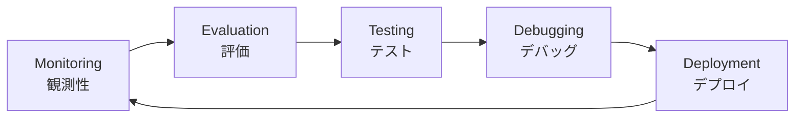
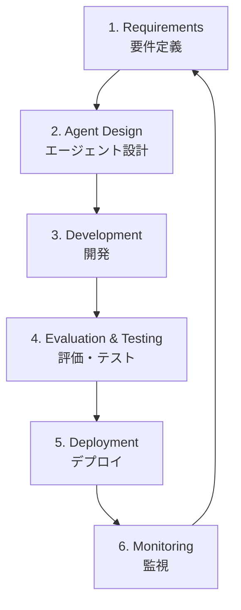

本記事は [arXiv:2406.09760 "A Taxonomy of AgentOps for Language Model Agents"](https://arxiv.org/abs/2406.09760) の解説記事です。

## 論文概要（Abstract）

著者ら（Wayadande, Pisal, Patil）は、LLMベースのAIエージェントを体系的に構築・評価・テスト・デプロイするためのツール群と運用プラクティスを「AgentOps」として定義し、その包括的なタクソノミー（分類体系）を提示している。本論文では、Monitoring、Evaluation、Testing、Debugging、Deploymentの5領域を軸に、既存ツールの機能比較と研究ギャップの分析を行っている。特にプロンプトバージョニングの標準化が未確立である点を重要な課題として指摘しており、LLMアプリケーションのCI/CDパイプライン設計に直接的な示唆を与える内容となっている。

この記事は [Zenn記事: Gitによるプロンプト変更管理：LLMアプリの品質を守るバージョニング実践](https://zenn.dev/0h_n0/articles/f45f9a4160d8f8) の深掘りです。

## 情報源

- **arXiv ID**: 2406.09760
- **URL**: [https://arxiv.org/abs/2406.09760](https://arxiv.org/abs/2406.09760)
- **著者**: Mahendra Wayadande, Priya Pisal, Nilesh Patil
- **発表年**: 2024
- **分野**: cs.AI, cs.SE, cs.MA

## 背景と動機（Background & Motivation）

LLMベースのエージェントが本番環境に投入されるケースが増加する一方で、従来のソフトウェアエンジニアリング手法をそのまま適用することが困難な状況が生じている。著者らはその理由として、LLMエージェントが持つ以下の特性を挙げている（論文Section 1より）。

1. **非決定的出力**: 同一入力に対して異なる出力を返すため、従来のユニットテストの前提が崩れる
2. **モデル更新による挙動変化**: 基盤モデルのバージョンアップにより、コード変更なしにエージェントの振る舞いが変わりうる
3. **外部ツールとの複雑な相互作用**: APIやデータベースとのやり取りが非線形な実行パスを生む

こうした背景から、MLOps・DevOpsの知見を統合した「AgentOps」という新しい運用フレームワークの必要性を著者らは主張している。従来のCI/CDパイプラインでは、プロンプトの変更管理が体系的にカバーされておらず、この領域を明示的に扱うタクソノミーが求められていた。

## 主要な貢献（Key Contributions）

著者らが主張する本論文の貢献は以下の3点である。

- **貢献1**: AgentOpsの5領域タクソノミー（Monitoring / Evaluation / Testing / Debugging / Deployment）の提示
- **貢献2**: AI Agent Development Lifecycle（AADL）フレームワークの定義
- **貢献3**: 既存ツール群の機能比較と5つの研究ギャップの特定

## 技術的詳細（Technical Details）

### AgentOpsタクソノミーの5領域

#### 1. Monitoring & Observability（監視と観測性）

LLMエージェントの本番動作を追跡する領域。著者らは以下のツールを比較している。

| ツール | 特徴 | ライセンス |
|--------|------|-----------|
| **LangSmith** | トレース実行、プロンプトチェーン可視化、データセット管理 | SaaS |
| **Helicone** | リアルタイムLLMリクエスト監視、コスト追跡 | OSS |
| **Arize AI** | プロンプト性能追跡、データドリフト検出 | SaaS |
| **W&B** | 実験追跡、モデルバージョニング、ダッシュボード | OSS/SaaS |

著者らは「LLMエージェントの非決定的出力が、標準的な性能メトリクスの定義と追跡を困難にしている」（論文Section 3.3）と指摘している。

#### 2. Evaluation（評価）

エージェント出力の品質をオフライン・オンラインで評価する領域。本論文では以下の評価アプローチが整理されている。

**オフライン評価フレームワーク**:
- **OpenAI Evals**: 分類、自由生成、関数呼び出しなど多様な評価タイプを支援（OSS）
- **RAGAS**: RAGシステム特化の評価。Faithfulness、Answer Relevancy、Context Precisionの指標を提供（OSS、Apache-2.0）
- **Eleuther AI LM-Eval-Harness**: 推論・知識・言語理解の広範なベンチマーク（OSS、MIT）

**LLM-as-a-Judge**: GPT-4等の高性能LLMを評価者として使用するアプローチ。MT-Bench（Zheng et al., 2023）が代表的な実装であり、人間判定との一致率80%超を達成したと報告されている。ただし著者らは、以下の3つのバイアスを課題として挙げている（論文Section 4.5より）。

- **Position bias**: 先に提示された回答を好む傾向
- **Verbosity bias**: より長い回答を高く評価する傾向
- **Self-enhancement bias**: 同系列モデルの出力を高く評価する傾向

#### 3. Prompt Versioning & Management（プロンプトバージョニング）

著者らは本領域をEvaluation内のサブセクション（論文Section 4.4）で扱い、以下のツールを比較している。

| ツール | バージョニング | テスト | ログ分析 |
|--------|-------------|--------|---------|
| **PromptLayer** | ✅ | ❌ | ✅ |
| **Promptfoo** | ✅（ファイルベース） | ✅（回帰テスト） | ❌ |
| **LangSmith** | ✅ | ✅（データセット管理） | ✅ |

Promptfooについて、著者らは「異なるモデル・構成間でLLMプロンプトを評価できるOSS CLIツール」であり、「ユニットテスト、ベンチマーク比較、回帰テストを含む多様な評価タイプを支援する」（論文Section 4.4）と記述している。

#### 4. Testing（テスト）

LLMエージェントの振る舞いを体系的・反復可能に検証する領域。

- **Giskard**: 自動テスト生成、脆弱性スキャン、品質チェック（OSS）
- **DeepEval**: pytestライクなLLMユニットテストフレームワーク（OSS、Apache-2.0）
- **Promptfoo**: 回帰テスト機能により、モデルやプロンプト変更時の挙動差分を検出

著者らは「LLMエージェントのテストにおける中心的課題は出力の非決定性であり、リグレッションや欠陥を確実に特定できる決定論的テストケースの作成が困難である」（論文Section 5.3）と指摘している。

##### テスト自動化のアプローチ

著者らはSection 5.4で、テスト自動化の研究動向として以下の3方向を整理している。

- **LLMによるテスト入力生成**: LLM自体を使って多様なテストケースを自動生成する。入力空間のカバレッジを効率的に拡大できるが、生成されたテストの品質を保証する仕組みが別途必要になる
- **ファジングによる入力空間探索**: 従来のソフトウェアテストで用いられるファジング手法をLLMプロンプトに適用する。入力の微小変動に対する出力の安定性を検証できるが、LLMの入力空間は離散的な自然言語であるため、連続的なファジングとは異なる工夫が求められる
- **仕様からのテストケース合成**: プロンプトに記述された仕様（期待出力形式、制約条件等）からプログラム合成的にテストを生成する。仕様が形式的であるほど自動化しやすいが、自然言語プロンプトの仕様は通常曖昧であるため適用範囲は限定的である

##### Evaluation領域との関係

Testing（Section 5）とEvaluation（Section 4）は一見類似するが、著者らの定義では明確に区別されている。

- **Evaluation**: 特定の基準やベンチマークに対するエージェントの性能評価。オフライン（ベンチマークデータセット使用）とオンライン（本番でのA/Bテスト）の両方を含む
- **Testing**: エージェントの振る舞いの正しさを体系的かつ反復可能に検証する活動。ユニットテスト、結合テスト、E2Eテストの階層を持つ

この区別は、Zenn記事が提案するCI/CDパイプラインにおいて「Promptfoo evaluationはPR単位で実行（Testing的用途）」と「ゴールデンデータセットによるベンチマーク比較（Evaluation的用途）」を分けて設計する根拠となる。

#### 5. Deployment（デプロイ）

モデルサービング、オーケストレーション、スケーリングを含む本番投入の領域。

- **LangChain / LlamaIndex**: エージェントワークフローの構築・管理
- **Ray Serve / BentoML**: 大規模モデルサービング
- **MLflow**: モデルバージョン追跡、実験管理、アーティファクト管理

### AI Agent Development Lifecycle（AADL）

著者らは6フェーズのライフサイクルフレームワークを提案している。

各フェーズがタクソノミーの1つ以上の領域にマッピングされる構造であり、プロンプト変更はフェーズ3（開発）で発生し、フェーズ4（評価・テスト）で検証されるという流れになる。

## 研究ギャップと未解決課題

著者らは論文Section 9で、以下の5つの研究ギャップを特定している。

1. **自動テスト生成の原則的手法が未確立**: 多様で挑戦的なテストケースの生成と、テストカバレッジを評価する信頼性の高いメトリクスの開発が必要
2. **評価メトリクスの標準化の欠如**: タスクやドメインをまたいでエージェントを比較するための合意されたメトリクスが存在しない
3. **プロンプトバージョニングの標準化なし**: 「プロンプトバージョニングのツールは存在するが、一貫性と再現性を保証する標準的なアプローチは存在しない」（論文Section 9より）
4. **長期性能モニタリングの手法未整備**: 入力分布やモデル挙動の時間経過に伴う変化への対応が不十分
5. **解釈可能性と説明可能性**: エージェントが特定の判断や出力を行う理由の理解が未解決

## 実運用への応用（Practical Applications）

本論文のタクソノミーは、プロンプト管理のCI/CDパイプライン設計に直接活用できる。Zenn記事で紹介されているPromptfooによる回帰テストの構成は、本論文のTesting領域（Section 5）に位置づけられ、以下のように対応する。

| Zenn記事の構成要素 | AgentOpsタクソノミーの対応領域 |
|-------------------|---------------------------|
| YAMLプロンプトファイル管理 | Prompt Versioning (Section 4.4) |
| Promptfoo評価設定 | Testing (Section 5) + Evaluation (Section 4) |
| GitHub Actions CI/CD | Deployment (Section 7) |
| ゴールデンデータセット | Evaluation Datasets (Section 4.6) |
| LLM-as-judge | LLM-as-a-Judge (Section 4.5) |
| 環境分離（dev/staging/prod） | Deployment (Section 7) |

著者らが指摘するプロンプトバージョニングの標準化ギャップ（研究ギャップ3）は、Zenn記事が提案するYAML + SemVer + Gitタグの運用ルールが部分的に埋めようとしている領域に対応する。ただし、ランタイムでの「どのバージョンが稼働中か」の追跡は、本論文でもZenn記事でも完全には解決されていない課題として残されている。

## 関連研究（Related Work）

- **MT-Bench / Chatbot Arena**（Zheng et al., 2023）: LLM-as-judgeの基礎的実装。本論文ではEvaluation領域の代表的手法として参照されている
- **RAGAS**（Es et al., 2023）: RAG特化の自動評価フレームワーク。Faithfulness等の指標により参照回答なしの評価を実現
- **OpenAI Evals**: 分類・生成・関数呼び出しの評価をカバーするOSSフレームワーク。本論文ではEvaluation領域のツールとして比較対象に含まれている

## 本論文の制約と注意点

本論文を実務に適用する際には、以下の制約を考慮する必要がある。

- **調査時点**: 2024年6月時点の調査であり、LLMOpsツールの進化は速い。例えばPromptfooは2026年3月にOpenAIに買収されたが、引き続きMITライセンスのOSSとして維持されている。個別ツールの最新機能は公式ドキュメントで確認すべきである
- **実験的検証の不在**: 本論文はサーベイ論文であり、提案するタクソノミーやAADLフレームワークの有効性を実験的に検証したものではない。分類の妥当性は読者自身の実務経験と照合して判断する必要がある
- **プロンプトバージョニングの扱いの軽さ**: 著者ら自身が研究ギャップ3として認識しているように、プロンプトバージョニングはEvaluation内のサブセクション（Section 4.4）で扱われるにとどまり、独立した領域としての深い分析は行われていない

## まとめと今後の展望

本論文は、LLMエージェントの運用を5領域（Monitoring / Evaluation / Testing / Debugging / Deployment）に分類し、各領域の主要ツールと研究課題を整理したサーベイである。著者らは、特にプロンプトバージョニングの標準化と自動テスト生成の手法確立が、今後の研究において重要であると結論づけている。

LLMアプリケーションのCI/CDを設計する際には、本論文のタクソノミーを「地図」として参照し、自身のユースケースがどの領域に位置づけられるかを確認した上で、ツール選定を進めることが有効である。特に、Zenn記事で解説されているPromptfoo + GitHub Actionsの構成は、本論文のTesting + Evaluation + Deploymentの3領域を横断する設計であり、AgentOpsの全体像の中での位置づけを理解することで、将来的な拡張（Monitoring領域の追加、Debugging機能の統合等）を計画的に進められる。

## 参考文献

- **arXiv**: [https://arxiv.org/abs/2406.09760](https://arxiv.org/abs/2406.09760)
- **MT-Bench**: [https://arxiv.org/abs/2306.05685](https://arxiv.org/abs/2306.05685)
- **Promptfoo**: [https://promptfoo.dev](https://promptfoo.dev)（MIT License）
- **DeepEval**: [https://github.com/confident-ai/deepeval](https://github.com/confident-ai/deepeval)（Apache-2.0）
- **Related Zenn article**: [https://zenn.dev/0h_n0/articles/f45f9a4160d8f8](https://zenn.dev/0h_n0/articles/f45f9a4160d8f8)
