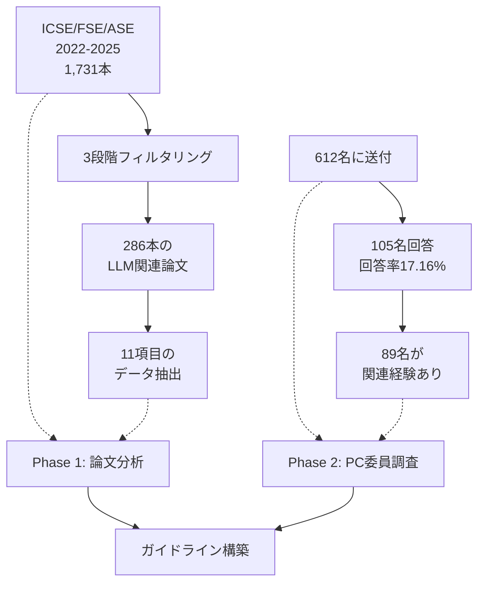
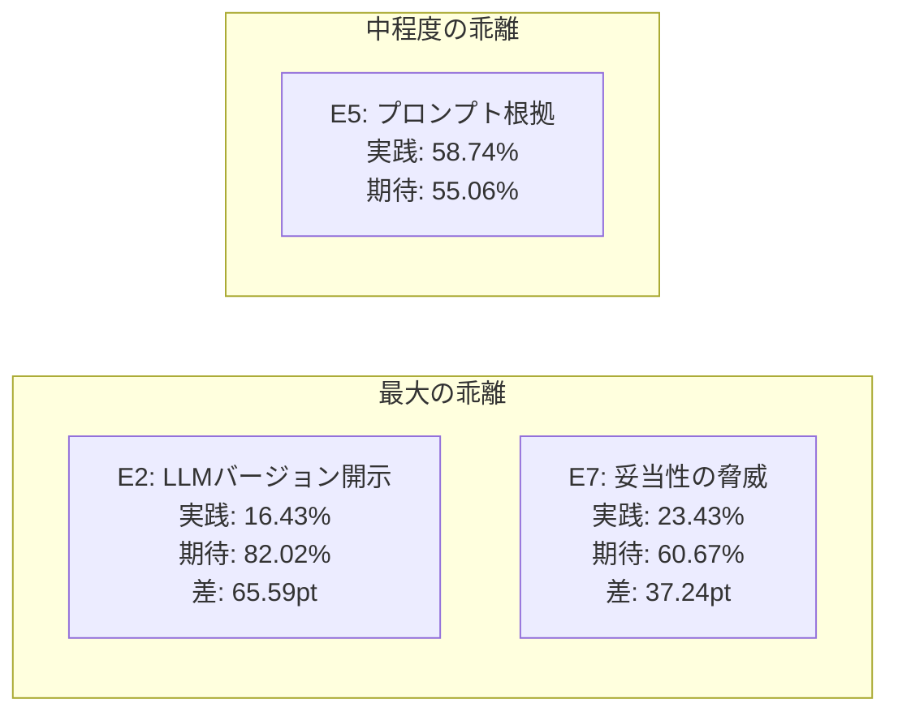

本記事は arXiv:2601.01954 の解説記事です。

## 論文概要（Abstract）

本論文は、ソフトウェアエンジニアリング（SE）研究においてLLMプロンプティングがどのように報告されているかを実証的に調査した研究である。著者らはICSE、FSE、ASEの3大SE会議から2022年以降に発表された1,731本の論文を収集し、そこから286本のLLM関連論文を抽出・分析した。さらに、105名のプログラム委員（PC）を対象にアンケート調査を実施し、プロンプト報告に関する現状の実践とコミュニティの期待との間にある乖離を明らかにしている。その結果に基づき、報告要素をEssential（必須）、Desirable（望ましい）、Exceptional（優れている）の3段階に分類するガイドラインを提案している。

この記事は [Zenn記事: Gitによるプロンプト変更管理：LLMアプリの品質を守るバージョニング実践](https://zenn.dev/0h_n0/articles/f45f9a4160d8f8) の深掘りです。

## 情報源

- **arXiv ID**: 2601.01954
- **URL**: [https://arxiv.org/abs/2601.01954](https://arxiv.org/abs/2601.01954)
- **著者**: Alexander Korn, Lea Zaruchas, Chetan Arora et al.
- **所属**: University of Duisburg-Essen (独), University of Cologne (独), Monash University (豪)
- **発表年**: 2025（FORGE 2026採択予定）
- **分野**: cs.SE（ソフトウェアエンジニアリング）

## 背景と動機（Background & Motivation）

GPTをはじめとするデコーダ型生成モデルが、コード生成、テスト自動化、要件分析など多様なSEタスクに適用されるようになった。しかし、これらのモデルの振る舞いを決定するのは自然言語によるプロンプトであり、プロンプトの設計がシステム全体の性能に直結する。

著者らは、この状況下においてプロンプトに関する意思決定が体系的に文書化されることが稀であり、再現性と比較可能性が損なわれていると指摘している。具体的には、LLMのバージョン情報やプロンプトの構造的な設計根拠が論文中で省略されるケースが多く、第三者が同一の実験を再現することが困難な状況にある。

従来、Trinkenreichらがプロンプト報告の透明性向上を呼びかけ、Baltesら（2025）がトップダウンの専門家合意型ガイドラインを提案していたが、実際のコミュニティの実践と期待を実証的に調査したうえでボトムアップにガイドラインを構築する研究は存在しなかった。本論文はこのギャップを埋めるものである。

## 主要な貢献（Key Contributions）

- **貢献1**: SE研究286本の体系的分析を通じて、LLMプロンプト報告の現状を定量的に把握した
- **貢献2**: 105名のPC委員を対象とした調査により、コミュニティが期待する報告水準を明らかにした
- **貢献3**: 現状の実践と期待の乖離に基づき、Essential/Desirable/Exceptionalの3段階ガイドラインを構築した
- **貢献4**: プロンプト報告のトレンド分析（年次推移）により、コミュニティの成熟度の変化を追跡した

## 技術的詳細（Technical Details）

### 研究手法の概要

本研究は2つのフェーズから構成されている。



### Phase 1: 論文分析のフィルタリング手法

著者らは3段階のフィルタリングプロセスを採用している。

**Stage 1: 文書長フィルタ** -- 7ページ未満の論文（ショートペーパー、ポスター等）を除外した。

**Stage 2: キーワードフィルタ** -- LLM、GPT、ChatGPT、Prompt等のキーワードを含む論文を抽出した。

**Stage 3: LLMベースフィルタ** -- GPT-4-mini、DeepSeek-v3、Gemini-2.5-Flashの3モデルを用いたロールベースプロンプティングにより、実際にLLMを使用している論文かどうかを判定した。個別モデルの再現率は84.83%であったが、3モデルの組み合わせにより98.28%の再現率を達成したと報告されている。

最終的に286本の論文が分析対象として選定された。

### Phase 2: PC委員調査の設計

著者らはICSE、ASE、FSE（2022-2024）のPC委員612名に5ページのアンケートを送付した。17問中13問が選択式、4問が自由記述式であり、回答時間は約10分と設定されている。回答尺度は4段階（Essential / Desirable / Exceptional / Not Recommended）であった。30日間の回答期間中にリマインダーメールを1回送付し、最終的に105名（回答率17.16%）から回答を得た。このうちLLM関連論文のレビュー経験を持つ89名を分析対象としている。

回答者の76%が年間5件以上のLLM関連論文をレビューしており、64%がLLMに精通していたと報告されている。

### ガイドラインの3段階構造

分析結果に基づき、著者らは以下の報告ガイドラインを提案している。

#### Essential（必須）-- 著者が報告しなければならない要素

| # | 報告要素 | 論文実践率 | PC期待率 |
|---|---------|-----------|---------|
| E1 | 使用したLLMの名称（例: GPT-4, Llama 3） | 92.31% | -- |
| E2 | LLMの正確なバージョン（例: GPT-4 2024-08-06） | 16.43% | 82.02% |
| E3 | プロンプトの正確な全文（テンプレート可） | 69.58% | -- |
| E4 | プロンプトとその構造の説明 | 75.17% | -- |
| E5 | プロンプトの構造・表現選択の根拠 | 58.74% | 55.06% |
| E6 | 使用したプロンプトエンジニアリング技法の記載 | 62.24% | -- |
| E7 | 妥当性への脅威としてのプロンプトの議論 | 23.43% | 60.67% |

#### Desirable（望ましい）-- 著者が報告すべき要素

| # | 報告要素 | 論文実践率 | PC期待率 |
|---|---------|-----------|---------|
| D1 | 複数のLLMを使用し結果を比較 | -- | -- |
| D2 | プロンプトの改良・反復プロセスの報告 | 46.50% | -- |
| D3 | 複数のプロンプトバリエーションをテストし結果を報告 | 44.06% | -- |

#### Exceptional（優れている）-- 著者が報告してもよい要素

| # | 報告要素 | 論文実践率 | PC期待率 |
|---|---------|-----------|---------|
| X1 | 自動プロンプトチューニング技法の適用 | -- | -- |

### 現状と期待の乖離（Misalignment）

著者らが最も重大な問題として挙げているのは、現状の実践とコミュニティの期待との間に存在する大きな乖離である。



**LLMバージョン開示の乖離**: PC委員の82.02%がバージョン情報を必須と考えているにもかかわらず、実際に正確なバージョンを報告している論文はわずか16.43%にとどまる。65.59ポイントという最大の乖離が確認されている。

**妥当性の脅威としてのプロンプト議論**: PC委員の60.67%がプロンプトを妥当性の脅威として議論すべきと考えているが、実際に議論している論文は23.43%にすぎない。

**全体的な傾向**: Essential項目の論文実践率は全体で51-66%にとどまっており、レビュアーの期待を下回っている。

### 年次トレンド分析

著者らの分析によると、ガイドライン遵守度の中央値は1論文あたり4.5-6項目で推移している（年次ボックスプロット: Table 5、Figure 4より）。2022年から2025年にかけて改善傾向は見られるものの、依然として全項目を満たす論文は少数であると報告されている。

## 実装のポイント（プロンプト文書化のベストプラクティス）

本論文はサーベイ・ガイドライン論文であり、ソフトウェア実装を直接含むものではないが、提案されたガイドラインを研究プロジェクトや実務のプロンプト管理に適用する際の指針を整理する。

### プロンプト報告テンプレート

著者らのガイドラインに基づき、研究論文におけるプロンプト報告に必要な情報を以下のように構造化できる。

```yaml
# プロンプト報告メタデータ（著者ら提案のEssential項目に対応）
prompt_metadata:
  # E1: LLM名称
  model_name: "gpt-4"
  # E2: 正確なバージョン
  model_version: "gpt-4-2024-08-06"
  # E3: プロンプト全文
  prompt_template: |
    You are a code reviewer. Given the following code snippet,
    identify potential bugs and suggest improvements.
    Code: {code_input}
  # E4: プロンプト構造の説明
  structure_description: "ロール指定 + タスク指示 + 入力プレースホルダ"
  # E5: 設計根拠
  design_rationale: "先行研究[XX]のロールプロンプティング手法を参考にした"
  # E6: プロンプトエンジニアリング技法
  techniques:
    - "role-based prompting"
    - "few-shot (3 examples)"
  # E7: 妥当性の脅威
  validity_threats:
    - "プロンプトの表現変更で結果が変動する可能性がある"
    - "few-shotの例選択にバイアスがある可能性がある"
```

### Gitバージョン管理との対応

関連するZenn記事「Gitによるプロンプト変更管理」で論じられているYAMLベースのプロンプト管理は、本論文のE2（バージョン開示）およびE3（プロンプト全文の記録）の要件を実務レベルで満たすアプローチと位置づけられる。

| 本論文のガイドライン項目 | Git管理での対応 |
|------------------------|----------------|
| E1: LLM名称 | `model_name`フィールド |
| E2: バージョン | `model_version`フィールド + Gitコミットハッシュ |
| E3: プロンプト全文 | YAMLファイルとしてGit管理 |
| E4: 構造説明 | README.mdまたはインラインコメント |
| E5: 設計根拠 | Gitコミットメッセージ + PR description |
| E6: PE技法 | メタデータフィールド |
| E7: 妥当性の脅威 | テストスイート + CI/CDパイプライン |

この対応関係は筆者の解釈であり、論文著者が直接言及しているものではない。ただし、Gitによるバージョン管理を活用することで、論文のE2項目（現状の実践率16.43%にとどまる最大の課題）を組織的に解決できる可能性がある。

### 研究論文執筆時のチェックリスト

著者らのガイドラインをもとに、LLMを使用するSE研究の論文を執筆する際のチェックリストを構成すると以下のようになる。

**Essential（必須）チェック項目**:
1. 使用LLMのモデル名を明記したか
2. APIバージョンまたはモデルのスナップショット日を記載したか
3. プロンプトの全文（またはテンプレート）を掲載したか
4. プロンプトの構造（ロール設定、コンテキスト、指示等）を説明したか
5. なぜそのプロンプト構造・表現を選択したかの根拠を示したか
6. 使用したプロンプトエンジニアリング技法（few-shot、chain-of-thought等）を記載したか
7. Threats to Validityセクションでプロンプトに関するリスクを議論したか

**Desirable（望ましい）チェック項目**:
1. 複数のLLMで実験を実施し、結果を比較したか
2. プロンプトの反復改善プロセスを記述したか
3. 複数のプロンプトバリエーションでテストを行い、結果を報告したか

## 実験結果（286本の論文分析結果）

### 項目別の報告実践率

著者らの分析により、以下の定量的な結果が得られている（論文Table 5より）。

| 報告項目 | 実践率 | 備考 |
|---------|--------|------|
| LLM名称の記載 | 92.31% | ほぼすべての論文で実践 |
| プロンプト構造の説明 | 75.17% | 4分の3の論文で実践 |
| プロンプト全文の提示 | 69.58% | 約7割が実践 |
| PE技法の記載 | 62.24% | 約6割が実践 |
| プロンプト設計根拠 | 58.74% | 半数以上が実践 |
| プロンプト改良過程 | 46.50% | 半数未満 |
| 複数バリエーションのテスト | 44.06% | 半数未満 |
| 妥当性の脅威としての議論 | 23.43% | 約4分の1のみ |
| 正確なバージョン記載 | 16.43% | 最も実践率が低い |

この結果から明らかなのは、LLMの名称記載（92.31%）は広く定着している一方で、正確なバージョン情報の記載（16.43%）やプロンプトを妥当性の脅威として議論すること（23.43%）は、コミュニティにおいてまだ標準的な実践となっていないという点である。

### Temperatureの報告状況

著者らは、LLMのハイパーパラメータであるtemperatureの報告状況も調査している。286本中131件（約45.8%）でtemperatureが報告されていた。temperatureはLLM出力の確率的な振る舞いを直接制御するパラメータであり、再現性にとって重要であるが、半数以上の論文で報告されていない状況にある。

### PC委員の期待との対比

PC委員へのアンケート結果では、統計的に有意な差がある項目ペア間の関係がWilcoxon符号順位検定（Bonferroni補正済み）で分析されている（論文Figure 3のネットワークグラフより）。この分析により、PC委員の間でもどの項目がより重要かについて一定のコンセンサスが存在することが示されている。

## 実運用への応用（Practical Applications）

### LLMOpsパイプラインへの統合

本論文のガイドラインは、学術研究だけでなく、プロダクション環境でのLLMアプリケーション開発にも適用可能である。特に、関連するZenn記事で取り上げられているGitによるプロンプト変更管理のワークフローとは直接的な対応関係がある。

**プロンプトのバージョン追跡**: 本論文のE2（バージョン開示）は、実務ではプロンプトのGitコミットハッシュとモデルAPIバージョンの両方を記録することに対応する。CIパイプラインでこれらのメタデータを自動的に収集・記録することで、再現性を担保しつつ運用の負担を軽減できる。

**プロンプトの設計根拠の記録**: E5（設計根拠）は、Gitのコミットメッセージやプルリクエストのdescriptionに自然に組み込める。なぜプロンプトを変更したのか、どのような代替案を検討したのかを記録することで、チーム内でのプロンプトの知識共有が促進される。

**プロンプトのテスト**: D3（複数バリエーションのテスト）は、プロンプトに対する回帰テストスイートの構築に対応する。ゴールデンデータセットに対してプロンプト変更前後の出力を比較し、性能劣化を検知する仕組みは、本論文の推奨事項をプロダクション環境に翻訳したものといえる。

### 研究コミュニティへの示唆

著者らは、以下のバリアがプロンプト報告の改善を妨げていると分析している。

1. **ページ数制約**: トップ会議の論文にはページ数制限があり、方法論の詳細を省略せざるを得ないケースがある
2. **コミュニティの合意不足**: プロンプトが「方法論」なのか「実装の詳細」なのかについてコミュニティ内で合意が形成されていない
3. **レビュアー期待の不一致**: レビュアー間でもプロンプト報告の重要性に対する認識が異なり、著者への圧力が不均一になっている
4. **LLMの急速な進化**: モデルバージョンが頻繁に更新されるため、バージョン情報の記録が後回しにされやすい

著者らは、これらのバリアに対する解決策として、プロンプト報告テンプレートの開発、レビューチェックリストへの統合、プロンプトを方法論的意思決定として扱う文化の醸成を提案している。

## 関連研究（Related Work）

- **Baltesら（2025）**: トップダウンの専門家合意型ガイドラインとして8つの推奨事項（5つのMUST、3つのSHOULD）を提案した。本論文のボトムアップアプローチとは補完的な関係にある
- **Houら**: ソフトウェア開発ライフサイクル全体にわたるLLM活用の体系的文献レビューを実施した。本論文はその中でもプロンプト報告に焦点を絞ったものである
- **ACM SIGSOFT Empirical Standards**: SE研究の実証的基準を策定しているが、現時点ではLLM固有のガイダンスが含まれていない。著者らはこの標準への知見の統合を今後の方向性として示している
- **Trinkenreichら**: LLM報告の透明性向上を呼びかけたが、具体的なガイドラインの提示には至っていなかった

## まとめと今後の展望

本論文は、SE研究におけるLLMプロンプティングの報告実態を286本の論文と105名のPC委員への調査で実証的に分析し、Essential/Desirable/Exceptionalの3段階ガイドラインを構築した。最も深刻な乖離はLLMバージョン開示（実践率16.43% vs 期待率82.02%）であり、再現性向上のために早急な改善が求められる領域である。

今後の展望として、著者らはガイドラインのインパクトに関する実証的検証、「promptware」（プロンプトを永続的なアーティファクトとして扱う）の文脈への拡張、HCI・NLP・データサイエンス等の他分野への適用、および著者・レビュアーを支援するツーリングの開発を挙げている。プロンプティングは方法論上の重要な意思決定であり、他のSE実験のアーティファクトと同等の体系的な文書化が必要であるという結論は、LLMOpsに携わる実務者にとっても示唆に富む。

## 参考文献

- **arXiv**: [https://arxiv.org/abs/2601.01954](https://arxiv.org/abs/2601.01954)
- **会議**: FORGE 2026（The 3rd ACM International Conference on AI Foundation Models and Software Engineering）
- **Related Zenn article**: [https://zenn.dev/0h_n0/articles/f45f9a4160d8f8](https://zenn.dev/0h_n0/articles/f45f9a4160d8f8)
