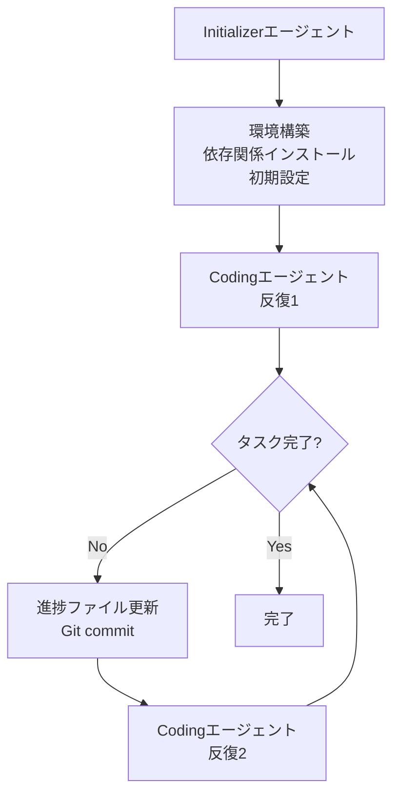

本記事は [Effective harnesses for long-running agents（Anthropic Engineering Blog）](https://www.anthropic.com/engineering/effective-harnesses-for-long-running-agents) の解説記事です。

## ブログ概要（Summary）

Anthropicは、長時間実行されるLLMエージェントの制御基盤（ハーネス）の設計パターンについて、実践的なエンジニアリングブログを公開している。このブログでは、**Initializerエージェント**と**Codingエージェント**の2段階構成、構造化されたアーティファクトシステム（`claude-progress.txt`、`feature_list.json`、Gitリポジトリ）による状態永続化、そしてテスト駆動型の検証戦略が詳述されている。コンテキストウィンドウの制約を超えて作業を継続するための具体的なパターンは、LangGraphのチェックポインターやFunctional APIの`entrypoint.final(save=...)`を使った状態管理に直接的な示唆を与えている。

この記事は [Zenn記事: LangGraph Functional API×状態分割で設計するステートマシン実装戦略](https://zenn.dev/0h_n0/articles/cd93e00b73bf28) の深掘りです。

## 情報源

- **種別**: 企業テックブログ
- **URL**: [https://www.anthropic.com/engineering/effective-harnesses-for-long-running-agents](https://www.anthropic.com/engineering/effective-harnesses-for-long-running-agents)
- **組織**: Anthropic Engineering
- **発表日**: 2025年

## 技術的背景（Technical Background）

長時間実行されるLLMエージェントには根本的な課題がある。エージェントは個別のセッションで動作し、**前回のセッションの記憶を持たない**。複雑なプロジェクトは単一のコンテキストウィンドウでは完了できないため、セッション間の状態引き継ぎメカニズムが不可欠である。

LangGraphはこの課題に対して、チェックポインター（`MemorySaver`、`AsyncPostgresSaver`）によるステート永続化と、`thread_id`によるセッション管理で対応している。Anthropicのブログは、これと同様の目的を達成するための、より低レベルかつ実践的なパターンを提示している。

## 実装アーキテクチャ（Architecture）

### 2エージェント構成

ブログでは、1つの連続的なエージェントではなく、2つの役割が異なるエージェントを使用する設計が説明されている。



Anthropicは、この2つを「別のエージェント」と呼んでいるが、「初期ユーザープロンプトが異なるだけで、システムプロンプト、ツールセット、全体のエージェントハーネスは同一である」と説明している。

- **Initializerエージェント**: 1回のみ実行。基盤環境の構築（依存関係のインストール、初期設定、リポジトリのセットアップ）を担当
- **Codingエージェント**: 反復的に実行。各イテレーションで1つの機能に取り組み、完了後に進捗を記録して次のイテレーションへ引き継ぐ

この設計はLangGraphのワークフロー設計パターンと対応する。Initializerはセットアップノード、Codingエージェントの各反復はループ内のタスクノードに相当し、StateGraphの`add_conditional_edges`で「タスク完了？」の分岐を表現できる。

### 構造化アーティファクトシステム

ブログでは、3つの永続化メカニズムが説明されている。

**1. `claude-progress.txt`**: エージェントのアクションを記録する進捗ログ。セッション間でエージェントが「何をやったか、何が残っているか」を把握するための手段として機能する。

**2. `feature_list.json`**: 要件の構造化レジストリ。各機能には`passes`フィールドがあり、テスト結果に基づいてpass/failが記録される。ブログでは「このファイルを編集できるのはstatusフィールドの変更のみであり、テストを削除・編集することは許容されない」という強い制約が課されていると述べられている。

**3. Gitリポジトリ**: バージョン管理がロールバック機能とコミット履歴を提供する。これにより、問題が発生した場合に以前の動作状態に戻ることが可能になる。

この3層の永続化は、LangGraphの状態管理と以下のように対応する。

| Anthropicのアーティファクト | LangGraphの対応概念 |
|-------------------------|-------------------|
| `claude-progress.txt` | チェックポインターに保存されるState |
| `feature_list.json` | `InputState`/`OutputState`の明示的分離 |
| Gitリポジトリ | タイムトラベル（StateGraphのチェックポイント履歴） |

### 標準化された起動シーケンス

各Codingセッションは以下の決まった手順で開始される。

1. `pwd`で作業ディレクトリを確認
2. Gitログと進捗ファイルを読み取り
3. `feature_list.json`を確認し、次の優先タスクを選択
4. `init.sh`で開発サーバーを起動
5. 基本的なE2Eテストを実行してリグレッションを確認

この「起動シーケンス」はLangGraphにおけるStateGraphのエントリポイントノードに相当する。前回のチェックポイントから状態を復元し、現在の状態を確認してから作業を開始するパターンは、`@entrypoint`デコレータの`previous`パラメータ（Functional API）や`MemorySaver`からの状態復元と同じ目的を果たしている。

## パフォーマンス最適化（Performance）

### インクリメンタルな進捗

ブログでは、各セッションで単一の機能に取り組む設計が推奨されている。これにより以下の効果が得られると説明されている。

- **コンテキスト疲弊の防止**: 大量のコード変更がコンテキストを圧迫し、判断品質が低下するのを防ぐ
- **デバッグの容易化**: 問題が発生した場合の原因特定が容易
- **ロールバックの精度向上**: 機能単位でGitコミットが作成されるため、特定の変更のみを取り消せる

LangGraphにおいても、`@task`の粒度を適切に設計することで同様の効果が得られる。1つの`@task`が1つの論理的な作業単位を担当し、各`@task`の完了時にチェックポイントが保存される設計が推奨される。

### テスト駆動型検証

ブログでは、コード検査よりもE2Eテスト（Puppeteer MCP）による検証が重視されている。エージェントは「セッション開始時に進捗ノートファイルとGitコミットログを読み取り、開発サーバーの基本テストを実行して未文書化のバグを検出する」と説明されている。

この戦略は、LangGraphのワークフロー内にテストノードを組み込む設計と対応する。生成ノードの後にテスト実行ノードを配置し、テストが失敗した場合にワークフローを分岐させる（修正ノードへルーティングする）パターンである。

## 運用での学び（Production Lessons）

### よくある問題と解決策

ブログでは以下の問題パターンが特定されている。

| 問題 | 解決策 |
|------|-------|
| 早期の「完了」宣言 | `feature_list.json`を要件の正式な情報源として使用し、すべてのパス/フェイルステータスを確認 |
| 未文書化の状態変更 | Gitコミットと`claude-progress.txt`の更新を必須化 |
| 機能完了の誤報告 | ブラウザ自動化テストによる客観的検証 |
| サーバー起動の摩擦 | `init.sh`による自動化スクリプト |

これらはLangGraphのプロダクション運用でも頻繁に遭遇する問題である。特に「早期の完了宣言」は、StateGraphの終了条件を明示的に検証する（`add_conditional_edges`で品質チェックを行う）ことで防止できる。

### 汎用エージェント vs 特化エージェント

ブログでは、「単一の汎用コーディングエージェントがすべての状況で最適に機能するのか、あるいはテスト、QA、コードクリーンアップなどの専門エージェントによるマルチエージェントアーキテクチャがより良い性能を達成するのか」がオープンな研究課題として提示されている。

LangGraphのハイブリッド設計（StateGraphで全体構造を定義し、Functional APIで動的な部分を実装する）は、この問題に対する1つの実践的なアプローチを提供している。全体のワークフロー構造はStateGraphで固定しつつ、各ノード内の処理ロジックをFunctional APIで柔軟に実装できる。

## Production Deployment Guide

### AWS実装パターン（コスト最適化重視）

長時間実行エージェントのハーネスをAWSに実装する場合の構成例を示す。

| 規模 | 月間リクエスト | 推奨構成 | 月額コスト | 主要サービス |
|------|--------------|---------|-----------|------------|
| **Small** | ~3,000 (100/日) | Serverless | $60-150 | Lambda + Bedrock + S3 + CodeBuild |
| **Medium** | ~30,000 (1,000/日) | Hybrid | $300-800 | ECS Fargate + Bedrock + EFS |
| **Large** | 300,000+ (10,000/日) | Container | $2,000-5,000 | EKS + Karpenter + EC2 Spot |

**Small構成の詳細** (月額$60-150):
- **Lambda (Initializerエージェント)**: 環境構築（2GB RAM, 300秒タイムアウト, $10/月）
- **CodeBuild (Codingエージェント)**: 長時間実行対応（60分タイムアウト, $20/月）
- **Bedrock**: Claude 3.5 Haiku、Prompt Caching有効 ($80/月)
- **S3**: 進捗ファイルとfeature_list.jsonの永続化 ($5/月)
- **CodeCommit/GitHub**: Gitリポジトリ管理 ($0-5/月)

**コスト試算の注意事項**: 上記は2026年5月時点のAWS ap-northeast-1料金に基づく概算値です。長時間実行エージェントは処理時間が長いため、Lambdaの15分制限を超える場合はCodeBuildやECS Fargateの利用が必要です。最新料金は [AWS料金計算ツール](https://calculator.aws/) で確認してください。

### Terraformインフラコード

```hcl
resource "aws_s3_bucket" "agent_artifacts" {
  bucket = "long-running-agent-artifacts"
}

resource "aws_s3_bucket_versioning" "agent_artifacts" {
  bucket = aws_s3_bucket.agent_artifacts.id
  versioning_configuration {
    status = "Enabled"
  }
}

resource "aws_codebuild_project" "coding_agent" {
  name         = "coding-agent-harness"
  service_role = aws_iam_role.codebuild_agent.arn

  artifacts {
    type = "NO_ARTIFACTS"
  }

  environment {
    compute_type    = "BUILD_GENERAL1_MEDIUM"
    image           = "aws/codebuild/standard:7.0"
    type            = "LINUX_CONTAINER"
    privileged_mode = false

    environment_variable {
      name  = "BEDROCK_MODEL_ID"
      value = "anthropic.claude-3-5-haiku-20241022-v1:0"
    }
    environment_variable {
      name  = "ARTIFACT_BUCKET"
      value = aws_s3_bucket.agent_artifacts.bucket
    }
  }

  source {
    type      = "NO_SOURCE"
    buildspec = <<-BUILDSPEC
      version: 0.2
      phases:
        pre_build:
          commands:
            - aws s3 cp s3://$ARTIFACT_BUCKET/claude-progress.txt . || true
            - aws s3 cp s3://$ARTIFACT_BUCKET/feature_list.json . || true
        build:
          commands:
            - python agent_harness.py --mode coding
        post_build:
          commands:
            - aws s3 cp claude-progress.txt s3://$ARTIFACT_BUCKET/
            - aws s3 cp feature_list.json s3://$ARTIFACT_BUCKET/
    BUILDSPEC
  }

  build_timeout = 60
}

resource "aws_iam_role" "codebuild_agent" {
  name = "codebuild-agent-role"
  assume_role_policy = jsonencode({
    Version = "2012-10-17"
    Statement = [{
      Action    = "sts:AssumeRole"
      Effect    = "Allow"
      Principal = { Service = "codebuild.amazonaws.com" }
    }]
  })
}
```

### コスト最適化チェックリスト

- [ ] CodeBuild: 長時間実行に対応（最大480分）
- [ ] S3バージョニング: アーティファクトのロールバック対応
- [ ] Bedrock Prompt Caching: セッション間でのシステムプロンプト再利用
- [ ] Lambda: Initializerは軽量Lambda、CodingはCodeBuild
- [ ] CloudWatch: セッション長とトークン使用量の監視
- [ ] S3 Lifecycle: 古いアーティファクトバージョンの自動削除（30日）
- [ ] AWS Budgets: 月額予算設定（長時間実行はコスト増に注意）
- [ ] CodeBuild キャッシュ: 依存関係のキャッシュで起動時間短縮

## 学術研究との関連（Academic Connection）

Anthropicのハーネス設計パターンは、以下の学術的概念と接続する。

- **チェックポインティング**: 分散システムのチェックポイント-リスタート機構の応用。長時間計算の障害耐性を確保する古典的手法をLLMエージェントに適用している。
- **状態の外部化**: マイクロサービスアーキテクチャの「ステートレスサービス + 外部状態ストア」パターン。エージェントのコンテキストウィンドウを「揮発性メモリ」と見なし、永続化が必要な情報を外部に保存する設計。
- **feature_list.json**: ソフトウェアテストの「テストマトリクス」パターンの応用。定義されたすべてのテストケースが通過するまでタスクを完了としない品質ゲートとして機能する。

## まとめと実践への示唆

Anthropicのハーネス設計パターンは、LangGraphのチェックポインターと状態分割パターンの実践的な補完情報を提供している。特に、(1)進捗ファイルによるセッション間の状態引き継ぎ、(2)`feature_list.json`による完了条件の明示化、(3)テスト駆動型検証による品質保証は、LangGraphの`entrypoint.final(value=..., save=...)`やStateGraphの条件付きエッジ設計に直接的に適用できるパターンである。ブログが提起する「汎用エージェント vs 特化エージェント」のオープンクエスチョンは、LangGraphのハイブリッド設計（StateGraph + Functional API）が1つの実践的な回答を提供している。

## 参考文献

- **Blog URL**: [https://www.anthropic.com/engineering/effective-harnesses-for-long-running-agents](https://www.anthropic.com/engineering/effective-harnesses-for-long-running-agents)
- **Related Zenn article**: [https://zenn.dev/0h_n0/articles/cd93e00b73bf28](https://zenn.dev/0h_n0/articles/cd93e00b73bf28)

---

> 本記事はAI（Claude Code）により自動生成されました。内容の正確性については原ブログ記事をご確認ください。
