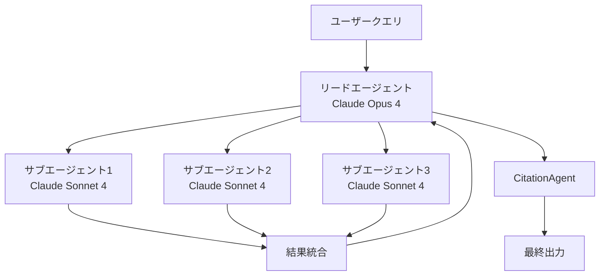

本記事は [How we built our multi-agent research system（Anthropic Engineering Blog）](https://www.anthropic.com/engineering/multi-agent-research-system) の解説記事です。

## ブログ概要（Summary）

Anthropicは、自社のResearch機能においてマルチエージェントシステムを構築した経験について詳細なエンジニアリングブログを公開している。このシステムは**オーケストレータ・ワーカーパターン**を採用しており、リードエージェント（Claude Opus 4）がクエリを分析・分解し、3〜5つの専門サブエージェント（Claude Sonnet 4）を並列に起動して情報を収集する設計である。Anthropicの内部評価によると、このマルチエージェント構成は単一エージェント構成と比較して**90.2%の性能向上**を達成したと報告されている。

この記事は [Zenn記事: LangGraph Functional API×状態分割で設計するステートマシン実装戦略](https://zenn.dev/0h_n0/articles/cd93e00b73bf28) の深掘りです。

## 情報源

- **種別**: 企業テックブログ
- **URL**: [https://www.anthropic.com/engineering/multi-agent-research-system](https://www.anthropic.com/engineering/multi-agent-research-system)
- **組織**: Anthropic Engineering
- **発表日**: 2025年

## 技術的背景（Technical Background）

マルチエージェントシステムの設計において、エージェント間の協調と状態管理は中心的課題である。LangGraphのStateGraphはグラフ構造で明示的に状態遷移を定義するアプローチをとるが、Anthropicのシステムはより動的なオーケストレーションを採用している。リードエージェントがクエリの複雑さに応じてサブエージェントの数と役割を動的に決定し、各サブエージェントが独立したコンテキストウィンドウで作業する設計は、LangGraphのFunctional APIにおける`@entrypoint`と`@task`の分離に通じる考え方である。

Anthropicがこのブログで説明している課題は、LangChainの「State of Agent Engineering」レポートが報告する「エージェント本番障害の60%以上が状態管理に起因する」という知見と一致している。特に、200,000トークンを超えるコンテキストウィンドウの管理と、長時間実行時のエラーリカバリが実運用での主要なボトルネックとなっている。

## 実装アーキテクチャ（Architecture）

### オーケストレータ・ワーカーパターン

Anthropicのシステムは3つのコンポーネントで構成されている。



**リードエージェント**（Claude Opus 4）の責務:
- Extended Thinkingモードでクエリを分析し、研究戦略を策定
- クエリの複雑さに応じて3〜5個のサブエージェントを生成
- コンテキストが200,000トークンを超える前にメモリに計画を保存
- サブエージェントからの結果を統合し、追加調査の要否を判断

**サブエージェント**（Claude Sonnet 4）の責務:
- 独立したコンテキストウィンドウで並列に作業
- Web検索やツール呼び出しを実行
- 各ツール結果の後にInterleaved Thinkingで品質を評価
- リードエージェントに結果を返却

**CitationAgent**の責務:
- 分析後のドキュメントと研究レポートを処理
- 主張ごとに具体的な情報源の位置を特定
- 出力全体で適切な帰属を確保

### 状態管理と永続化

ブログによると、システムは以下の状態管理戦略を採用している。

1. **外部メモリへの計画保存**: コンテキストウィンドウが飽和する前に、研究計画を外部メモリに格納する。Anthropicは「コンテキストウィンドウが200,000トークンを超えるとトランケートされるため、計画の保持が重要」と述べている。

2. **チェックポイントベースのリカバリ**: エラー発生時にプロセス全体を再起動するのではなく、エージェントが障害に遭遇した時点のチェックポイントから再開する。

3. **アーティファクトベースの出力パターン**: すべての出力をリードエージェント経由でルーティングする代わりに、サブエージェントが結果を外部システム（ファイルシステムやデータベース）に格納し、軽量な参照のみを返す。これによりトークンオーバーヘッドを削減し、多段処理での情報損失を防止している。

この設計は、LangGraphにおける`InputState`と`OutputState`の分離パターンと対比できる。リードエージェントが受け取る「軽量な参照」は`OutputState`に相当し、サブエージェントが保持する詳細データは`PrivateState`に対応する。

### 並列実行の効果

Anthropicは並列化の効果について具体的な数値を報告している。

- サブエージェントが**3つ以上のツールを同時に呼び出す**ことで処理を高速化
- リードエージェントが**3〜5つのサブエージェントを逐次ではなく並列に起動**
- これらの最適化により、複雑なクエリのリサーチ時間を**最大90%削減**

### 努力量スケーリングルール

ブログでは、クエリの複雑さに応じたリソース配分ルールが紹介されている。

| クエリ種別 | サブエージェント数 | ツール呼び出し回数 |
|-----------|----------------|-----------------|
| 単純な事実確認 | 1 | 3-10 |
| 比較分析 | 2-4 | 各10-15 |
| 複雑なリサーチ | 10+ | 責務分割 |

## Production Deployment Guide

### AWS実装パターン（コスト最適化重視）

Anthropicのオーケストレータ・ワーカーパターンをAWS上に実装する場合の構成例を示す。

| 規模 | 月間リクエスト | 推奨構成 | 月額コスト | 主要サービス |
|------|--------------|---------|-----------|------------|
| **Small** | ~3,000 (100/日) | Serverless | $100-250 | Lambda + Bedrock + SQS |
| **Medium** | ~30,000 (1,000/日) | Hybrid | $500-1,200 | ECS Fargate + Bedrock + ElastiCache |
| **Large** | 300,000+ (10,000/日) | Container | $3,000-8,000 | EKS + Karpenter + EC2 Spot |

**Small構成の詳細** (月額$100-250):
- **Lambda (リードエージェント)**: 2GB RAM, 120秒タイムアウト ($30/月)
- **Lambda (サブエージェント)**: 1GB RAM, 60秒タイムアウト × 並列3-5 ($40/月)
- **Bedrock**: Opus 4（リード）+ Sonnet 4（サブ）、Prompt Caching有効 ($150/月)
- **SQS**: サブエージェント結果の集約キュー ($5/月)
- **DynamoDB**: チェックポイントとアーティファクト格納 ($15/月)

**コスト試算の注意事項**: 上記は2026年5月時点のAWS ap-northeast-1（東京）リージョン料金に基づく概算値です。マルチエージェント構成はシングルエージェントの約15倍のトークンを消費するため（ブログでの報告値）、Bedrockコストが支配的になります。最新料金は [AWS料金計算ツール](https://calculator.aws/) で確認してください。

### Terraformインフラコード

**Small構成 (Serverless): Lambda + SQS + DynamoDB**

```hcl
resource "aws_iam_role" "orchestrator_lambda" {
  name = "multi-agent-orchestrator-role"
  assume_role_policy = jsonencode({
    Version = "2012-10-17"
    Statement = [{
      Action    = "sts:AssumeRole"
      Effect    = "Allow"
      Principal = { Service = "lambda.amazonaws.com" }
    }]
  })
}

resource "aws_iam_role_policy" "orchestrator_policy" {
  role = aws_iam_role.orchestrator_lambda.id
  policy = jsonencode({
    Version = "2012-10-17"
    Statement = [
      {
        Effect   = "Allow"
        Action   = ["bedrock:InvokeModel", "bedrock:InvokeModelWithResponseStream"]
        Resource = [
          "arn:aws:bedrock:ap-northeast-1::foundation-model/anthropic.claude-opus-4*",
          "arn:aws:bedrock:ap-northeast-1::foundation-model/anthropic.claude-sonnet-4*"
        ]
      },
      {
        Effect   = "Allow"
        Action   = ["sqs:SendMessage", "sqs:ReceiveMessage", "sqs:DeleteMessage"]
        Resource = aws_sqs_queue.subagent_results.arn
      },
      {
        Effect   = "Allow"
        Action   = ["dynamodb:PutItem", "dynamodb:GetItem", "dynamodb:UpdateItem"]
        Resource = aws_dynamodb_table.checkpoints.arn
      }
    ]
  })
}

resource "aws_lambda_function" "lead_agent" {
  filename      = "lead_agent.zip"
  function_name = "multi-agent-lead"
  role          = aws_iam_role.orchestrator_lambda.arn
  handler       = "index.handler"
  runtime       = "python3.12"
  timeout       = 120
  memory_size   = 2048
  environment {
    variables = {
      LEAD_MODEL_ID     = "anthropic.claude-opus-4-20250514-v1:0"
      SUBAGENT_MODEL_ID = "anthropic.claude-sonnet-4-20250514-v1:0"
      CHECKPOINT_TABLE  = aws_dynamodb_table.checkpoints.name
      RESULT_QUEUE_URL  = aws_sqs_queue.subagent_results.url
    }
  }
}

resource "aws_sqs_queue" "subagent_results" {
  name                       = "subagent-results"
  visibility_timeout_seconds = 300
  message_retention_seconds  = 86400
}

resource "aws_dynamodb_table" "checkpoints" {
  name         = "multi-agent-checkpoints"
  billing_mode = "PAY_PER_REQUEST"
  hash_key     = "session_id"
  range_key    = "checkpoint_id"
  attribute {
    name = "session_id"
    type = "S"
  }
  attribute {
    name = "checkpoint_id"
    type = "S"
  }
  ttl {
    attribute_name = "expire_at"
    enabled        = true
  }
}
```

### 運用・監視設定

```python
import boto3

cloudwatch = boto3.client('cloudwatch')

cloudwatch.put_metric_alarm(
    AlarmName='multi-agent-token-spike',
    ComparisonOperator='GreaterThanThreshold',
    EvaluationPeriods=1,
    MetricName='TokenUsage',
    Namespace='MultiAgent/Orchestrator',
    Period=3600,
    Statistic='Sum',
    Threshold=500000,
    AlarmDescription='マルチエージェントトークン使用量異常（15x倍率超過の可能性）'
)
```

**CloudWatch Logs Insights クエリ**:
```sql
fields @timestamp, session_id, agent_type, tool_calls, tokens_used
| filter agent_type = "lead"
| stats sum(tokens_used) as total_tokens, count(tool_calls) as total_calls by session_id
| filter total_tokens > 200000
| sort total_tokens desc
```

### コスト最適化チェックリスト

- [ ] リードエージェント: Opus 4（高品質判断）、サブエージェント: Sonnet 4（コスト効率）
- [ ] Prompt Caching: システムプロンプトの共有部分で30-90%削減
- [ ] アーティファクトベース出力: トークンオーバーヘッド削減
- [ ] 努力量スケーリング: クエリ複雑度に応じたサブエージェント数の動的調整
- [ ] SQS: 非同期結果集約でLambda待機時間を削減
- [ ] DynamoDB TTL: 古いチェックポイントの自動削除
- [ ] CloudWatch: トークンスパイクの即時検知
- [ ] AWS Budgets: 月額予算設定（マルチエージェントは15xコスト増に注意）

## パフォーマンス最適化（Performance）

### BrowseCompベンチマークでの知見

Anthropicは内部評価として BrowseComp ベンチマークを使用している。ブログによると、性能分散の95%を説明する3つの要因が特定されている。

1. **トークン使用量**: 分散の80%を説明する支配的要因
2. **ツール呼び出し回数**
3. **モデル選択**

マルチエージェント構成は標準チャット対話の約**15倍**のトークンを消費するが、シングルエージェント構成でも約4倍を消費する。ブログによると、この性能向上がオーバーヘッドを正当化するのは高価値タスクに限られるとしている。

### モデル組み合わせの効果

ブログでは「Claude Opus 4をリードエージェント、Claude Sonnet 4をサブエージェントとするマルチエージェント構成が、シングルエージェントのClaude Opus 4を内部リサーチ評価で90.2%上回った」と報告されている。

## 運用での学び（Production Lessons）

### 非決定性への対処

ブログによると、同一プロンプトでもエージェントの挙動は実行ごとに異なる非決定的な性質を持つ。Anthropicは「個々の会話内容を監視することなく、エージェントの意思決定パターンとインタラクション構造を監視する」本番トレーシングを実装している。

### レインボーデプロイメント

エージェントプロセスはステートフルであるため、通常のブルー/グリーンデプロイメントは実行中のエージェントを中断する可能性がある。Anthropicは**レインボーデプロイメント**を採用し、新旧バージョンを同時に実行しながらトラフィックを段階的に移行する方式をとっている。

### ツール設計の重要性

ブログでは、ツールの説明文がエージェントの振る舞いに決定的な影響を与えることが強調されている。Anthropicは「ツールテストエージェント」を作成し、欠陥のあるツールを使用してエラーパターンを特定した上で説明文を書き直すプロセスを導入した。この結果、「将来のエージェントのタスク完了時間を40%削減」できたと報告されている。

## 学術研究との関連（Academic Connection）

このシステムのオーケストレータ・ワーカーパターンは、マルチエージェント研究における「中央集権型コーディネーション」アーキテクチャに分類される。LangGraphのStateGraphが明示的なグラフ構造でエージェント間の通信を定義するのに対し、Anthropicのシステムはリードエージェントの判断に基づく動的なオーケストレーションを採用しており、Functional APIの`@entrypoint`が制御フローを柔軟に記述できる設計思想に近い。

BrowseCompでの「トークン使用量が性能分散の80%を説明する」という知見は、エージェントの計算資源配分に関する重要な実証データであり、SGH論文（2604.11378）が提案する「努力量の効率的配分」の議論とも接続する。

## まとめと実践への示唆

Anthropicのマルチエージェントリサーチシステムは、オーケストレータ・ワーカーパターンの実践的な設計指針を提供している。特に、(1)リードエージェントとサブエージェントのモデル差別化によるコスト最適化、(2)アーティファクトベースの出力パターンによるトークンオーバーヘッド削減、(3)チェックポイントベースのリカバリによる耐障害性の確保は、LangGraphを使ったプロダクションシステムにも直接適用可能な知見である。レインボーデプロイメントやツール説明文の最適化といった運用ノウハウも、ステートフルなエージェントシステムの運用における実用的な指針を示している。

## 参考文献

- **Blog URL**: [https://www.anthropic.com/engineering/multi-agent-research-system](https://www.anthropic.com/engineering/multi-agent-research-system)
- **Related Zenn article**: [https://zenn.dev/0h_n0/articles/cd93e00b73bf28](https://zenn.dev/0h_n0/articles/cd93e00b73bf28)

---

> 本記事はAI（Claude Code）により自動生成されました。内容の正確性については原ブログ記事をご確認ください。
