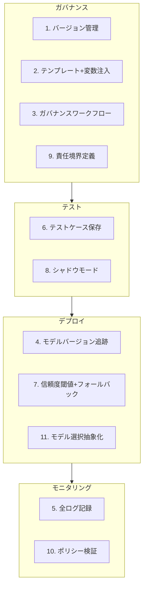
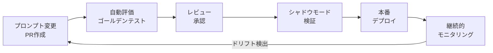
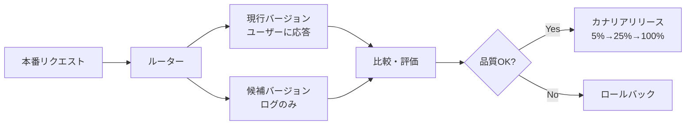

本記事は [Prompt, agent, and model lifecycle management](https://docs.aws.amazon.com/prescriptive-guidance/latest/agentic-ai-serverless/prompt-agent-and-model.html)（AWS Prescriptive Guidance, 2026年公開）の解説記事です。

この記事は [Zenn記事: Gitによるプロンプト変更管理：LLMアプリの品質を守るバージョニング実践](https://zenn.dev/0h_n0/articles/f45f9a4160d8f8) の深掘りです。

## ブログ概要（Summary）

AWS Prescriptive Guidanceは、エンタープライズ環境でLLM・エージェントを本番運用するためのライフサイクル管理ガイドラインを公開している。プロンプトが従来アプリケーションの「ロジック層」に相当しながらも型がなくテストが困難であるという課題を出発点に、バージョン管理・テンプレート化・ガバナンスワークフロー・シャドウモード・信頼度閾値・ポリシー検証など11項目のベストプラクティスを体系的に提示している。Amazon Bedrock Prompt Management、CloudWatch、X-Ray、CDK/CloudFormation、Bedrock AgentCoreといったAWSサービスとの統合方法も具体的に示されており、実験段階から本番運用への移行に必要な規律を包括的にカバーしている。

関連するZenn記事ではGitを中心としたプロンプト変更管理の実践方法（ディレクトリ設計、セマンティックバージョニング、Promptfooによる自動評価、カナリアリリース）が解説されているが、本記事ではAWSが推奨するエンタープライズ規模での管理体制と、AWSマネージドサービスを活用した実装パターンに焦点を当てる。

## 情報源

- **種別**: 企業テックブログ（AWS Prescriptive Guidance）
- **URL**: [Prompt, agent, and model lifecycle management](https://docs.aws.amazon.com/prescriptive-guidance/latest/agentic-ai-serverless/prompt-agent-and-model.html)
- **組織**: AWS（Amazon Web Services）
- **発表日**: 2026年

## 技術的背景（Technical Background）

### なぜライフサイクル管理が必要か

LLMと自律エージェントがエンタープライズワークフローに組み込まれるにつれ、従来のソフトウェアコンポーネントには存在しなかった新たな管理変数が生じている。AWSは3つの管理対象を明確に区別している。

**プロンプト**: 従来アプリケーションのロジック層に相当するが、正式な構造や入出力スキーマ、バリデーションルールを持たない（untyped）。フォーマットに対して敏感であり、従来型のテスト手法が適用しにくい。

**エージェント**: ツールの自律的呼び出しとナレッジの取得を行うが、適切なスコーピングと監視がなければ予測不能な実行パスを生成する。

**モデル**: Amazon NovaやAnthropic Claudeなどのモデルは頻繁にバージョンアップされ、アップグレードが挙動・性能・コストに影響を及ぼす可能性がある。

### ライフサイクル管理なしのリスク

AWSは管理が不在の場合に以下の4つのリスクが顕在化すると指摘している。

1. **挙動ドリフト**: モデルやプロンプトの変更に起因する意図しない動作変化
2. **データ漏洩・ポリシー違反**: ガードレールなしでの応答生成による機密情報の露出
3. **精度・性能の検出されない劣化**: モデルアップグレード後にベンチマークが取られないまま品質が低下
4. **再現性・追跡性の欠如**: 障害発生時にどのプロンプト・モデルバージョンの組み合わせが原因か特定できない

Zenn記事でも「1文字の変更が出力を大きく変える」ケースとして温度パラメータの微調整やシステムプロンプトの語尾変更が挙げられているが、AWSのガイダンスはこれをエンタープライズ規模のリスクとして体系的に位置づけている。

## 実装アーキテクチャ（Architecture）

### 11のベストプラクティス

AWSが提示する11項目のベストプラクティスは、ガバナンス・テスト・デプロイ・モニタリングの4つのカテゴリに整理できる。



以下、各ベストプラクティスの詳細を解説する。

#### 1. プロンプトとエージェント構成のバージョン管理

AWSは「プロンプトはコードと同等に重要」としている。バージョン管理により、挙動変化時のロールバック、A/Bテスト、エージェントロジックの進化の監査証跡が可能になる。

Zenn記事で紹介されているGitベースのバージョン管理（`prompts/chat/summarize.yaml`形式でYAMLファイルとしてメタデータ・テンプレート・変数を一元管理）は、このベストプラクティスの実装例に相当する。AWSのガイダンスでは、これに加えてAmazon Bedrock Prompt Managementの利用が推奨されている。

**Amazon Bedrock Prompt Managementの主要機能**:
- プロンプトの作成・保存・テスト・バージョン管理をコンソールまたはAPI経由で実行
- バージョンはプロンプトの不変スナップショットとして保持され、設定間の安全な切り替えが可能
- バリアント機能により、同一プロンプトの異なるモデル・パラメータ構成を比較テスト可能
- 2つのバージョン間のdiff比較機能で変更点を迅速にレビュー可能

```python
# Amazon Bedrock Prompt ManagementのAPIを用いたバージョン管理の概念例
import boto3

bedrock_agent = boto3.client("bedrock-agent", region_name="ap-northeast-1")

# プロンプトの作成
response = bedrock_agent.create_prompt(
    name="it-support-agent-v1",
    description="内部ITサポートエージェント用プロンプト",
    variants=[
        {
            "name": "default",
            "modelId": "anthropic.claude-sonnet-4-20250514",
            "templateType": "TEXT",
            "templateConfiguration": {
                "text": {
                    "text": (
                        "You are a support assistant who has "
                        "extensive AWS knowledge and serves "
                        "internal engineers.\n"
                        "Always escalate unresolved issues to "
                        "the on-call team.\n"
                        "User query: {{query}}"
                    ),
                    "inputVariables": [{"name": "query"}],
                }
            },
            "inferenceConfiguration": {
                "text": {
                    "temperature": 0.3,
                    "maxTokens": 2048,
                }
            },
        }
    ],
    defaultVariant="default",
)
prompt_id = response["id"]

# バージョンの作成（不変スナップショット）
version_response = bedrock_agent.create_prompt_version(
    promptIdentifier=prompt_id,
    description="v1: エスカレーション指示を含む初期バージョン",
)
print(f"Version: {version_response['version']}")
```

#### 2. テンプレートと変数注入

ハードコードされた重複を削減し、メンテナンス性を向上させる。パラメータ化された評価（コンテキストウィンドウサイズやエンティティ置換など）を可能にする。

Zenn記事のJinja2テンプレート記法（`{{ variable }}`）と同じ考え方であり、Bedrock Prompt Managementでは`{{variable_name}}`構文でテンプレート変数を定義する。

#### 3. プロンプトガバナンスワークフロー

プロンプトの作成・レビュー・テストを正式なプロセスとして確立する。AWSは「プロンプトがユーザー対面または規制対象の出力に影響する場合（例: ヘルスケア、法務）は特に重要」としている。

Zenn記事で紹介されているCI/CDパイプライン（GitHub ActionsによるPromptfoo自動評価 + PRベースのレビュー）は、このガバナンスワークフローの実装パターンに対応する。



#### 4. モデルバージョンとプロバイダ更新の追跡

Claude、Amazon Titan、Amazon Novaなどのモデルは頻繁に更新される。AWSは「使用しているバージョンを把握することは、再現性・評価・コスト影響分析に不可欠」としている。

これはZenn記事のプロンプトYAMLファイルにおける`model`フィールドの管理（例: `model: "claude-sonnet-4-6"`）を、エンタープライズレベルに拡張する考え方である。

#### 5. プロンプト・パラメータ・モデル応答の全ログ

AWSは全リクエスト・レスポンスのロギングを推奨している。これにより、エラー・ハルシネーション・セキュリティ侵害の事後レビューが可能になり、プロンプト品質のモニタリングと継続的改善を支える。

#### 6. プロンプトとエージェントのテストケース保存

プロンプトの回帰テストにより、変更後の挙動劣化を防止する。AWSは「LLMがパイプラインで呼び出される場合にフィクスチャやユニットテストを使う」ことを推奨している。

Zenn記事のゴールデンデータセット（50〜200件）による自動回帰テストは、このベストプラクティスの具体的な実装方法に相当する。AWSのガイダンスでは、これをドリフト検出の仕組みと組み合わせて「ゴールデンテストケースに対するモデル出力の一貫性を定期的に検証する」ことを推奨している。

#### 7. 信頼度閾値とフォールバック動作

AWSは「モデルの信頼度が低い場合やアウトプットが根拠なし（ungrounded）の場合は、人間・静的ルール・より単純なワークフローにルーティングする」ことを推奨している。ユーザー体験の保護と安全性の確保が目的である。

```python
# 信頼度閾値とフォールバックの概念実装
from dataclasses import dataclass


@dataclass
class AgentResponse:
    """エージェントレスポンスの構造体"""
    answer: str
    confidence: float  # 0.0 - 1.0
    sources: list[str]
    is_grounded: bool


def handle_response_with_fallback(
    response: AgentResponse,
    confidence_threshold: float = 0.7,
) -> str:
    """信頼度閾値に基づくフォールバック処理

    Args:
        response: エージェントからのレスポンス
        confidence_threshold: 信頼度の閾値（デフォルト0.7）

    Returns:
        ユーザーに返す最終レスポンス
    """
    if response.confidence >= confidence_threshold and response.is_grounded:
        return response.answer

    if response.confidence < 0.3:
        # 信頼度が極端に低い場合は人間にエスカレーション
        return (
            "この質問には確実にお答えできません。"
            "担当チームにエスカレーションします。"
            "チケット番号: ESC-{ticket_id}"
        )

    # 中間的な信頼度の場合は静的ルールで対応
    return (
        f"{response.answer}\n\n"
        "注: この回答は自動生成されたものです。"
        "正確性に不安がある場合はサポートチームに"
        "お問い合わせください。"
    )
```

#### 8. 新プロンプト・モデルのシャドウモード

AWSは「新しいプロンプトまたはモデルが本番トラフィックに対してどのように動作するかを、ユーザーに影響を与えずに観察可能にする」ことを推奨している。安全なアップデートのロールアウトに不可欠な手法であるとしている。

シャドウモードでは、本番リクエストを現行バージョン（ユーザーに応答を返す）と候補バージョン（応答を返さない）の両方に複製し、出力を比較してプロモーション判断を行う。Zenn記事のカナリアリリース戦略（5% → 25% → 50% → 100%の段階的トラフィック移行）は、シャドウモードの次のステップとして位置づけられる。



#### 9. エージェントとツールの責任境界定義

AWSは「エージェントは最小権限の原則に基づいてスコープされたツールのみを呼び出すべき」としている。ツール誤用のリスクを低減し、エンタープライズのロールベースアクセス制御（RBAC）ポリシーと整合させる。

#### 10. ポリシールールに対する応答検証

高リスクのユースケース（法務・人事・コンプライアンス）では、LLMレスポンスがユーザーに到達する前にAWS Lambda関数でレスポンスバリデータを適用することをAWSは推奨している。

```python
# AWS Lambdaによるレスポンスバリデータの概念例
import json
import re


def lambda_handler(
    event: dict,
    context: object,
) -> dict:
    """LLMレスポンスのポリシー検証Lambda

    Args:
        event: LLMレスポンスを含むイベント
        context: Lambda実行コンテキスト

    Returns:
        検証結果と承認/拒否の判定
    """
    response_text: str = event["llm_response"]
    policy_rules: list[dict] = event.get("policy_rules", [])

    violations: list[str] = []

    # PII検出（メールアドレス、電話番号）
    pii_patterns = [
        (r"[a-zA-Z0-9._%+-]+@[a-zA-Z0-9.-]+\.[a-zA-Z]{2,}", "email"),
        (r"\b\d{3}[-.]?\d{4}[-.]?\d{4}\b", "phone_number"),
    ]
    for pattern, pii_type in pii_patterns:
        if re.search(pattern, response_text):
            violations.append(
                f"PII detected: {pii_type}"
            )

    # ポリシールール検証
    for rule in policy_rules:
        if rule["type"] == "prohibited_topic":
            if rule["keyword"].lower() in response_text.lower():
                violations.append(
                    f"Prohibited topic: {rule['keyword']}"
                )

    return {
        "statusCode": 200,
        "body": json.dumps({
            "approved": len(violations) == 0,
            "violations": violations,
            "original_response": response_text,
        }),
    }
```

#### 11. モデル選択抽象化レイヤー

AWSは「ビジネスロジックを特定のモデルから分離し、動的ルーティング・フォールバック・コスト対性能チューニングを時間をかけて実現可能にする」ことを推奨している。

```python
# モデル選択抽象化レイヤーの概念実装
from abc import ABC, abstractmethod
from dataclasses import dataclass


@dataclass
class ModelConfig:
    """モデル設定"""
    model_id: str
    max_tokens: int
    temperature: float
    cost_per_1k_input_tokens: float
    cost_per_1k_output_tokens: float


class ModelSelector(ABC):
    """モデル選択の抽象基底クラス"""

    @abstractmethod
    def select(
        self,
        task_type: str,
        input_length: int,
    ) -> ModelConfig:
        """タスクと入力長に基づくモデル選択"""
        ...


class CostAwareModelSelector(ModelSelector):
    """コスト最適化を考慮したモデルセレクター"""

    def __init__(self) -> None:
        self.models: dict[str, ModelConfig] = {
            "high_quality": ModelConfig(
                model_id="anthropic.claude-sonnet-4-20250514",
                max_tokens=4096,
                temperature=0.3,
                cost_per_1k_input_tokens=0.003,
                cost_per_1k_output_tokens=0.015,
            ),
            "fast_cheap": ModelConfig(
                model_id="amazon.nova-lite-v1:0",
                max_tokens=2048,
                temperature=0.5,
                cost_per_1k_input_tokens=0.00006,
                cost_per_1k_output_tokens=0.00024,
            ),
        }

    def select(
        self,
        task_type: str,
        input_length: int,
    ) -> ModelConfig:
        """タスク種別と入力長に基づいて最適モデルを選択

        Args:
            task_type: タスク種別（例: "classification", "generation"）
            input_length: 入力トークン数

        Returns:
            選択されたモデル設定
        """
        # 分類・抽出タスクは低コストモデルで十分
        if task_type in ("classification", "extraction"):
            return self.models["fast_cheap"]
        # 長文生成・高品質が求められるタスク
        return self.models["high_quality"]
```

### ITサポートエージェントの実例

AWSのガイダンスでは、Amazon Bedrockエージェントを使った内部ITサポートの具体例が示されている。

**エージェント構成**:

```
prompts > agent-x ! v1
Agent:
    Instructions: "You are a support assistant who has extensive
                   AWS knowledge and serves internal engineers."
    Tools:
        - resetPassword
        - provisionDevInstance
        - openTicket
    KnowledgeBase: CompanySupportDocs
```

このエージェントは、`resetPassword`（パスワードリセット）、`provisionDevInstance`（開発インスタンスのプロビジョニング）、`openTicket`（チケット起票）の3つのツールを使い、社内Confluenceドキュメントに紐づくナレッジベースからFAQを検索する。

**ガバナンスなしの場合に起こる問題**:
1. プロンプト更新時にエスカレーション指示が誤って削除される
2. モデルアップグレードにより「エスカレート」の解釈が変わる
3. チケットが対応されないまま放置され、ユーザーからの苦情で初めて発覚する

**ライフサイクル管理ありの場合の動作**:
1. プロンプトはリリース前にレビュー・バージョンタグ付け・テストされる
2. シャドウモードでモデルの挙動が期待通りであることを検証する
3. 信頼度閾値のフォールバックにより、不確実な場合はデフォルトのエスカレーションメッセージを発行する

## Production Deployment Guide

AWSのガイダンスに基づいて、プロンプト・エージェント・モデルのライフサイクル管理をAWS上で実装する構成を示す。

### AWS実装パターン（コスト最適化重視）

**トラフィック量別の推奨構成**:

| 構成 | 想定規模 | 主要サービス | 月額概算 |
|------|---------|-------------|---------|
| Small | ~100 req/日 | Lambda + Bedrock + DynamoDB | $50-150 |
| Medium | ~1,000 req/日 | ECS Fargate + Bedrock + Aurora Serverless | $300-800 |
| Large | 10,000+ req/日 | EKS + Bedrock + ElastiCache + Aurora | $2,000-5,000 |

**Small構成（~100 req/日）**: Lambda関数でプロンプト管理API・レスポンスバリデータ・シャドウモード比較を実装する。DynamoDBにプロンプトバージョン・テスト結果・ログを保存する。Bedrock Prompt Managementでプロンプトのバージョン管理を行い、CloudWatch Logsで全リクエスト・レスポンスをログ記録する。月額内訳: Lambda ($5-15)、Bedrock ($30-100、トークン使用量依存)、DynamoDB On-Demand ($5-15)、CloudWatch ($10-20)。

**Medium構成（~1,000 req/日）**: ECS Fargateでプロンプト管理サービスとシャドウモードコンパレータを常駐させる。Aurora Serverless v2でプロンプトバージョン・評価結果・ゴールデンテストケースを永続化する。Step Functionsでガバナンスワークフロー（PR承認 → シャドウモード → カナリア → 本番）をオーケストレーションする。

**Large構成（10,000+ req/日）**: EKSでプロンプト管理・レスポンスバリデータ・モデルセレクターをマイクロサービスとして運用する。ElastiCacheでプロンプトテンプレートとモデルルーティングテーブルをキャッシュし、レイテンシを最小化する。Bedrock AgentCoreのRuntimeとMemoryを活用して、エージェントのセッション分離と永続化メモリを実現する。

**コスト削減テクニック**:
- Bedrock Batch APIの活用: シャドウモード評価やゴールデンテスト実行をバッチ処理に移行し、50%のコスト削減
- Prompt Caching有効化: 同一プロンプトテンプレートへの繰り返しリクエストでキャッシュヒット率30-90%のコスト削減
- Lambda Provisioned Concurrency: コールドスタート回避と安定したレイテンシの確保（ただし追加コストに注意）
- Spot Instances（EKS構成時）: ワーカーノードにSpotを活用し最大90%削減

> **注意**: 上記コスト試算は2026年5月時点のAWS東京リージョン（ap-northeast-1）料金に基づく概算値です。実際のコストはトラフィックパターン、モデル選択、トークン使用量により大きく変動します。最新料金は[AWS料金計算ツール](https://calculator.aws/)で確認してください。

### Terraformインフラコード

#### Small構成（Serverless）: Lambda + Bedrock + DynamoDB

```hcl
# --- プロンプトライフサイクル管理 Small構成 ---
# Lambda + Bedrock Prompt Management + DynamoDB

terraform {
  required_version = ">= 1.9"
  required_providers {
    aws = {
      source  = "hashicorp/aws"
      version = "~> 5.80"
    }
  }
}

provider "aws" {
  region = "ap-northeast-1"
}

# DynamoDB: プロンプトバージョン・評価結果の永続化
resource "aws_dynamodb_table" "prompt_versions" {
  name         = "prompt-lifecycle-versions"
  billing_mode = "PAY_PER_REQUEST" # On-Demand: コスト最適化
  hash_key     = "prompt_id"
  range_key    = "version"

  attribute {
    name = "prompt_id"
    type = "S"
  }
  attribute {
    name = "version"
    type = "S"
  }

  # KMS暗号化
  server_side_encryption {
    enabled = true
  }

  point_in_time_recovery {
    enabled = true
  }

  tags = {
    Project     = "prompt-lifecycle"
    Environment = "production"
    CostCenter  = "llmops"
  }
}

# IAMロール: Lambda実行用（最小権限）
resource "aws_iam_role" "lambda_prompt_manager" {
  name = "prompt-lifecycle-lambda-role"
  assume_role_policy = jsonencode({
    Version = "2012-10-17"
    Statement = [{
      Action = "sts:AssumeRole"
      Effect = "Allow"
      Principal = {
        Service = "lambda.amazonaws.com"
      }
    }]
  })
}

resource "aws_iam_role_policy" "lambda_permissions" {
  name = "prompt-lifecycle-permissions"
  role = aws_iam_role.lambda_prompt_manager.id
  policy = jsonencode({
    Version = "2012-10-17"
    Statement = [
      {
        # Bedrock: プロンプト管理 + モデル呼び出し
        Effect = "Allow"
        Action = [
          "bedrock:InvokeModel",
          "bedrock:CreatePrompt",
          "bedrock:GetPrompt",
          "bedrock:ListPrompts",
          "bedrock:CreatePromptVersion",
        ]
        Resource = "*"
      },
      {
        # DynamoDB: バージョン・評価結果の読み書き
        Effect = "Allow"
        Action = [
          "dynamodb:PutItem",
          "dynamodb:GetItem",
          "dynamodb:Query",
        ]
        Resource = aws_dynamodb_table.prompt_versions.arn
      },
      {
        # CloudWatch Logs
        Effect = "Allow"
        Action = [
          "logs:CreateLogGroup",
          "logs:CreateLogStream",
          "logs:PutLogEvents",
        ]
        Resource = "arn:aws:logs:*:*:*"
      },
    ]
  })
}

# Lambda: プロンプトバリデータ + シャドウモード比較
resource "aws_lambda_function" "prompt_validator" {
  function_name = "prompt-lifecycle-validator"
  runtime       = "python3.13"
  handler       = "handler.lambda_handler"
  role          = aws_iam_role.lambda_prompt_manager.arn
  timeout       = 60
  memory_size   = 512 # Bedrock API呼び出しに十分なメモリ

  # コードは別途S3またはローカルからデプロイ
  filename = "lambda_package.zip"

  environment {
    variables = {
      DYNAMODB_TABLE       = aws_dynamodb_table.prompt_versions.name
      CONFIDENCE_THRESHOLD = "0.7"
      SHADOW_MODE_ENABLED  = "true"
    }
  }

  tracing_config {
    mode = "Active" # X-Rayトレーシング有効化
  }

  tags = {
    Project     = "prompt-lifecycle"
    Environment = "production"
  }
}

# CloudWatch アラーム: Lambda実行時間異常検知
resource "aws_cloudwatch_metric_alarm" "lambda_duration" {
  alarm_name          = "prompt-validator-high-duration"
  comparison_operator = "GreaterThanThreshold"
  evaluation_periods  = 3
  metric_name         = "Duration"
  namespace           = "AWS/Lambda"
  period              = 300
  statistic           = "Average"
  threshold           = 30000 # 30秒
  alarm_description   = "プロンプトバリデータの実行時間が30秒を超過"

  dimensions = {
    FunctionName = aws_lambda_function.prompt_validator.function_name
  }

  tags = {
    Project = "prompt-lifecycle"
  }
}
```

#### Large構成（Container）: EKS + Karpenter + Spot Instances

```hcl
# --- プロンプトライフサイクル管理 Large構成 ---
# EKS + Karpenter (Spot優先) + Secrets Manager

module "eks" {
  source  = "terraform-aws-modules/eks/aws"
  version = "~> 20.31"

  cluster_name    = "prompt-lifecycle-cluster"
  cluster_version = "1.31"

  vpc_id     = module.vpc.vpc_id
  subnet_ids = module.vpc.private_subnets

  # コントロールプレーンのみ（ワーカーはKarpenter管理）
  cluster_endpoint_public_access = false

  tags = {
    Project     = "prompt-lifecycle"
    Environment = "production"
  }
}

# Karpenter: Spot優先の自動スケーリング
resource "kubectl_manifest" "karpenter_nodepool" {
  yaml_body = <<-YAML
    apiVersion: karpenter.sh/v1
    kind: NodePool
    metadata:
      name: prompt-lifecycle-pool
    spec:
      template:
        spec:
          requirements:
            - key: karpenter.sh/capacity-type
              operator: In
              values: ["spot", "on-demand"]  # Spot優先
            - key: node.kubernetes.io/instance-type
              operator: In
              values: ["m7i.xlarge", "m7i.2xlarge", "c7i.xlarge"]
          nodeClassRef:
            group: karpenter.k8s.aws
            kind: EC2NodeClass
            name: default
      limits:
        cpu: "64"
        memory: "128Gi"
      disruption:
        consolidationPolicy: WhenEmptyOrUnderutilized
        consolidateAfter: 60s
  YAML
}

# Secrets Manager: Bedrock設定・API設定の保管
resource "aws_secretsmanager_secret" "bedrock_config" {
  name        = "prompt-lifecycle/bedrock-config"
  description = "Bedrock model IDs and prompt configuration"

  tags = {
    Project = "prompt-lifecycle"
  }
}

# AWS Budgets: 月額コスト上限アラート
resource "aws_budgets_budget" "monthly_cost" {
  name         = "prompt-lifecycle-monthly"
  budget_type  = "COST"
  limit_amount = "5000"
  limit_unit   = "USD"
  time_unit    = "MONTHLY"

  notification {
    comparison_operator       = "GREATER_THAN"
    threshold                 = 80
    threshold_type            = "PERCENTAGE"
    notification_type         = "ACTUAL"
    subscriber_email_addresses = ["ops-team@example.com"]
  }

  notification {
    comparison_operator       = "GREATER_THAN"
    threshold                 = 100
    threshold_type            = "PERCENTAGE"
    notification_type         = "FORECASTED"
    subscriber_email_addresses = ["ops-team@example.com"]
  }
}
```

### 運用・監視設定

**CloudWatch Logs Insightsクエリ**: プロンプトバージョンごとのパフォーマンス分析

```
# プロンプトバージョン別のレイテンシ・信頼度分析
fields @timestamp, prompt_version, model_id, latency_ms, confidence_score
| filter @logStream like /prompt-lifecycle/
| stats avg(latency_ms) as avg_latency,
        pct(latency_ms, 95) as p95_latency,
        avg(confidence_score) as avg_confidence,
        count(*) as request_count
  by prompt_version, model_id
| sort avg_confidence desc
```

```
# シャドウモード比較: 現行 vs 候補バージョンの出力差異検知
fields @timestamp, shadow_mode, prompt_version, semantic_similarity
| filter shadow_mode = true
| stats avg(semantic_similarity) as avg_similarity,
        min(semantic_similarity) as min_similarity,
        count(*) as comparisons
  by prompt_version
| filter avg_similarity < 0.85
| sort avg_similarity asc
```

**CloudWatchアラーム設定（Python）**:

```python
import boto3

cloudwatch = boto3.client("cloudwatch", region_name="ap-northeast-1")


def create_confidence_alarm(
    function_name: str,
    threshold: float = 0.5,
) -> dict:
    """信頼度スコア低下のアラーム設定

    Args:
        function_name: Lambda関数名
        threshold: 信頼度閾値

    Returns:
        CloudWatch API レスポンス
    """
    return cloudwatch.put_metric_alarm(
        AlarmName=f"{function_name}-low-confidence",
        MetricName="ConfidenceScore",
        Namespace="PromptLifecycle",
        Statistic="Average",
        Period=300,
        EvaluationPeriods=3,
        Threshold=threshold,
        ComparisonOperator="LessThanThreshold",
        AlarmDescription=(
            f"平均信頼度スコアが{threshold}を下回りました。"
            "プロンプトまたはモデルのドリフトを確認してください。"
        ),
        AlarmActions=["arn:aws:sns:ap-northeast-1:ACCOUNT:ops-alerts"],
    )
```

**X-Rayトレーシング設定（Python）**:

```python
from aws_xray_sdk.core import xray_recorder, patch_all

# boto3, requests等の自動計装
patch_all()


@xray_recorder.capture("invoke_bedrock_with_prompt")
def invoke_with_tracing(
    prompt_id: str,
    prompt_version: str,
    model_id: str,
    input_text: str,
) -> dict:
    """X-Rayトレース付きBedrock呼び出し

    Args:
        prompt_id: プロンプト識別子
        prompt_version: プロンプトバージョン
        model_id: モデルID
        input_text: 入力テキスト

    Returns:
        Bedrockレスポンス
    """
    subsegment = xray_recorder.current_subsegment()
    subsegment.put_annotation("prompt_id", prompt_id)
    subsegment.put_annotation("prompt_version", prompt_version)
    subsegment.put_annotation("model_id", model_id)
    subsegment.put_metadata("input_length", len(input_text))

    bedrock = boto3.client("bedrock-runtime")
    response = bedrock.invoke_model(
        modelId=model_id,
        body=input_text,
    )

    subsegment.put_metadata(
        "output_tokens",
        response["ResponseMetadata"].get("token_count", 0),
    )
    return response
```

**Cost Explorer日次レポート（Python）**:

```python
import datetime

import boto3

ce = boto3.client("ce", region_name="us-east-1")
sns = boto3.client("sns", region_name="ap-northeast-1")

DAILY_COST_THRESHOLD = 100.0  # USD


def get_daily_cost_report() -> dict:
    """Bedrock・Lambda関連の日次コストレポート取得

    Returns:
        サービス別コスト情報
    """
    today = datetime.date.today()
    yesterday = today - datetime.timedelta(days=1)

    response = ce.get_cost_and_usage(
        TimePeriod={
            "Start": yesterday.isoformat(),
            "End": today.isoformat(),
        },
        Granularity="DAILY",
        Metrics=["UnblendedCost"],
        Filter={
            "Or": [
                {
                    "Dimensions": {
                        "Key": "SERVICE",
                        "Values": ["Amazon Bedrock"],
                    }
                },
                {
                    "Dimensions": {
                        "Key": "SERVICE",
                        "Values": ["AWS Lambda"],
                    }
                },
            ]
        },
        GroupBy=[{"Type": "DIMENSION", "Key": "SERVICE"}],
    )

    total_cost = sum(
        float(group["Metrics"]["UnblendedCost"]["Amount"])
        for result in response["ResultsByTime"]
        for group in result["Groups"]
    )

    if total_cost > DAILY_COST_THRESHOLD:
        sns.publish(
            TopicArn="arn:aws:sns:ap-northeast-1:ACCOUNT:cost-alerts",
            Subject="Prompt Lifecycle: 日次コスト超過アラート",
            Message=(
                f"日次コスト: ${total_cost:.2f} "
                f"(閾値: ${DAILY_COST_THRESHOLD})"
            ),
        )

    return {
        "date": yesterday.isoformat(),
        "total_cost": total_cost,
        "details": response["ResultsByTime"],
    }
```

### コスト最適化チェックリスト

**アーキテクチャ選択**:
- [ ] トラフィック量に応じた構成を選択（~100 req/日: Serverless、~1,000: Hybrid、10,000+: Container）
- [ ] シャドウモード評価はBatch APIで非同期実行し、リアルタイムコストを削減

**リソース最適化**:
- [ ] EKS構成ではSpot Instancesを優先（最大90%削減）
- [ ] Reserved Instances: 安定ワークロードには1年コミットで最大72%削減
- [ ] Savings Plans: Compute Savings Plansでリージョン横断の柔軟性を確保
- [ ] Lambda: メモリサイズをPower Tuningで最適化（512MB〜1024MBが多くの場合最適）
- [ ] DynamoDB: On-Demandモードで低トラフィック時のコストを最小化

**LLMコスト削減**:
- [ ] Bedrock Batch API: シャドウモード評価・ゴールデンテスト実行に活用（50%削減）
- [ ] Prompt Caching: 同一テンプレートの繰り返し呼び出しでキャッシュヒット（30-90%削減）
- [ ] モデル選択ロジック: タスク種別に応じてNova Lite/Sonnetを動的切替
- [ ] トークン数制限: max_tokensを必要最小限に設定
- [ ] テンプレート共通化: `_shared/`ディレクトリで共通プレフィックスを一元管理し重複排除

**監視・アラート**:
- [ ] AWS Budgets: 月額上限の80%・100%でアラート設定
- [ ] CloudWatch アラーム: 信頼度スコア低下・レイテンシ異常を検知
- [ ] Cost Anomaly Detection: 自動的なコスト異常パターン検出を有効化
- [ ] 日次コストレポート: Cost Explorer APIで自動取得、閾値超過でSNS通知
- [ ] X-Ray: プロンプトバージョンごとのトレーシングでボトルネック特定

**リソース管理**:
- [ ] 未使用プロンプトバージョンの定期クリーンアップ（DynamoDB TTL活用）
- [ ] タグ戦略: `Project`/`Environment`/`CostCenter`タグを全リソースに付与
- [ ] ライフサイクルポリシー: CloudWatch Logsの保持期間を90日に設定
- [ ] 開発環境の夜間停止: ECS/EKSワーカーを営業時間外にスケールダウン
- [ ] ログレベル制御: 本番ではINFO以上、開発ではDEBUGに設定

## パフォーマンス最適化（Performance）

AWSのガイダンスは具体的なベンチマーク数値を記載していないが、プロンプトライフサイクル管理のパフォーマンスに影響する要素として以下が挙げられる。

**シャドウモードのオーバーヘッド**: 本番リクエストを2つのモデルに複製するため、Bedrockの呼び出しコストが2倍になる。ただしシャドウ側をBatch APIで非同期実行することで、リアルタイムのレイテンシには影響を与えずにコストを50%削減できる。

**レスポンスバリデータのレイテンシ**: Lambda関数によるポリシー検証は通常50-200msの追加レイテンシを生じる。正規表現ベースのPII検出は高速（~5ms）だが、LLMベースの判定を追加する場合は500ms以上の追加が見込まれる。

**プロンプトキャッシュの効果**: Bedrock Prompt Managementでプロンプトテンプレートをキャッシュすることで、テンプレート解決のレイテンシを最小化できる。特に変数注入型テンプレートでは、テンプレートの再パース不要で変数部分のみ差し替えることでTTFT（Time to First Token）を改善できる。

**チューニング手法**:
- プロンプトテンプレートのプリウォーム: Lambda Provisioned ConcurrencyまたはECS Fargateの最小タスク数設定
- DynamoDBへのDAXキャッシュ層追加: プロンプトバージョンのルックアップをマイクロ秒単位に高速化
- ElastiCacheによるモデルルーティングテーブルのキャッシュ: モデル選択ロジックの実行時間を1ms未満に

## 運用での学び（Production Lessons）

### シャドウモードの実践

AWSが推奨するシャドウモードは、本番環境でのプロンプト変更における最もリスクの低い検証手法である。業界の実践例では、過去1週間の本番トラフィックを候補モデルにリプレイし、LLM-as-Judgeで現行バージョンと比較する手法が有効とされている。評価基準は、事実正確性・トーン・タスク完了度・フォーマット準拠の4軸が一般的である。

### 信頼度閾値の運用

信頼度閾値は一律に設定するのではなく、ユースケースごとに調整する必要がある。AWSのガイダンスでは「高リスクユースケース（法務・HR・コンプライアンス）」に対してより厳格な検証を推奨しており、実践的には以下のような段階的閾値が考えられる。

- 信頼度 0.9以上: 自動応答
- 信頼度 0.7-0.9: 応答に注意書きを付与
- 信頼度 0.7未満: 人間にエスカレーション

### ドリフト検出の仕組み

AWSは「ゴールデンテストケースに対するモデル出力の一貫性を定期的に検証する」ことを推奨している。これはZenn記事のゴールデンデータセット（50〜200件）による回帰テストと同じ考え方であり、モデルアップグレード後やプロンプト変更後だけでなく、変更がない場合でも定期的に実行することでサイレントドリフトを検出できる。

## 学術研究との関連（Academic Connection）

AWSのプロンプトライフサイクル管理ガイダンスは、LLMOps分野の学術研究で議論されている課題に対する実践的な回答として位置づけられる。

**Evaluation-Driven Development（EDD）**: Wuらは「Evaluation-Driven Development and Operations of LLM Agents」（arXiv:2411.13768）において、LLMエージェントの開発と運用を評価駆動で行うプロセスモデルとリファレンスアーキテクチャを提案している。AWSのガイダンスにおけるテストケース保存・シャドウモード・ドリフト検出は、このEDDフレームワークの産業実装に相当する。

**プロンプトのソフトウェアエンジニアリング**: プロンプトを「コードと同等に重要」とするAWSの立場は、従来のソフトウェアエンジニアリングプラクティス（バージョン管理・CI/CD・コードレビュー）をプロンプトに適用するという学術的議論と一致している。Zenn記事のLevel 1 → Level 2 → Level 3の成熟度モデルは、この学術的議論の実践的分類である。

## まとめと実践への示唆

AWSのPrescriptive Guidanceが提示する11のベストプラクティスは、プロンプト・エージェント・モデルのライフサイクル管理を「基盤的な規律」として位置づけている。Zenn記事で紹介されているGitベースのバージョン管理・CI/CD評価パイプライン・カナリアリリースは、これらベストプラクティスの中核的な実装手法に相当する。

AWSのガイダンスがZenn記事の内容を拡張している主要な点は以下の3つである。

1. **マネージドサービスの活用**: Amazon Bedrock Prompt ManagementやAgentCoreを使うことで、プロンプトバージョン管理・エージェントセッション分離・メモリ永続化のインフラ構築を省略できる
2. **エンタープライズガバナンス**: ポリシー検証Lambda・RBAC・監査ログなど、規制対象環境に必要なコンプライアンス要件への対応
3. **モデル選択抽象化**: 特定モデルへの依存を排除し、コスト・性能・可用性に基づく動的ルーティングを実現する設計パターン

プロンプトのライフサイクル管理は、LLMアプリケーションが実験段階から本番運用に移行する際に避けて通れない規律である。本記事のベストプラクティスとZenn記事の実装手法を組み合わせることで、安全かつ反復可能なLLMOpsパイプラインを構築できる。

## 参考文献

- **Blog URL**: [Prompt, agent, and model lifecycle management - AWS Prescriptive Guidance](https://docs.aws.amazon.com/prescriptive-guidance/latest/agentic-ai-serverless/prompt-agent-and-model.html)
- **Amazon Bedrock Prompt Management**: [AWS公式ドキュメント](https://docs.aws.amazon.com/bedrock/latest/userguide/prompt-management.html)
- **Amazon Bedrock AgentCore**: [AWS公式ドキュメント](https://docs.aws.amazon.com/bedrock-agentcore/latest/devguide/what-is-bedrock-agentcore.html)
- **Related Zenn article**: [Gitによるプロンプト変更管理：LLMアプリの品質を守るバージョニング実践](https://zenn.dev/0h_n0/articles/f45f9a4160d8f8)

---

*本記事はAI（Claude）による自動生成記事です。情報源の内容を正確に伝えることを目指していますが、解釈の誤りがある可能性があります。正確な情報は[原文](https://docs.aws.amazon.com/prescriptive-guidance/latest/agentic-ai-serverless/prompt-agent-and-model.html)をご確認ください。*
