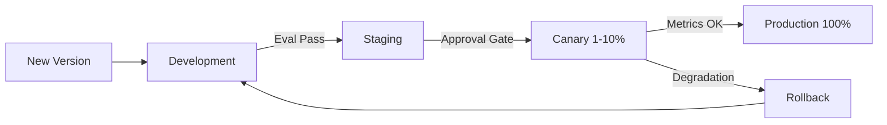
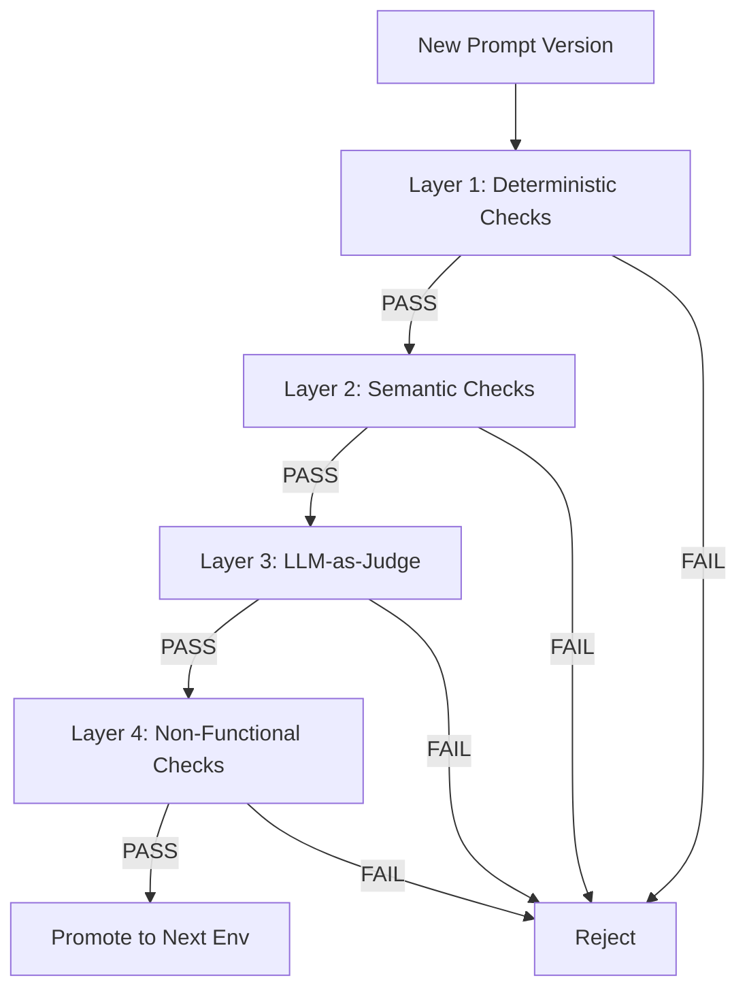
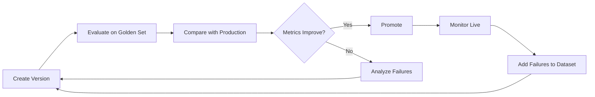

# Braintrust解説: プロンプトバージョニングのベストプラクティス

## ブログ概要（Summary）

本記事は [https://www.braintrust.dev/articles/what-is-prompt-versioning](https://www.braintrust.dev/articles/what-is-prompt-versioning) の解説記事です。

Braintrustが公開したこの記事では、LLMアプリケーションにおけるプロンプトバージョニングの定義、設計原則、デプロイ戦略、テスト・評価フレームワークを体系的に整理している。プロンプトの変更を構造化された方法で追跡し、各バージョンに不変のIDを付与することで、本番環境での出力劣化を防ぎつつ高速なイテレーションを実現する手法が解説されている。特に、Content-Addressable IDによるバージョン識別、ゴールデンデータセット（50-200件）を用いた多層評価パイプライン、カナリアリリースによる段階的デプロイなど、プロダクション運用に直結する実践的知見が網羅されている。

この記事は [Zenn記事: Gitによるプロンプト変更管理：LLMアプリの品質を守るバージョニング実践](https://zenn.dev/0h_n0/articles/f45f9a4160d8f8) の深掘りです。

---

## 情報源

- **種別**: 企業テックブログ
- **URL**: [https://www.braintrust.dev/articles/what-is-prompt-versioning](https://www.braintrust.dev/articles/what-is-prompt-versioning)
- **組織**: Braintrust
- **発表日**: 2026-02-18

---

## 技術的背景（Technical Background）

### なぜプロンプトバージョニングが必要なのか

従来のソフトウェア開発では、コードは決定論的な振る舞いを示す。同じ入力に対して同じ出力が得られるため、バージョン管理の対象はソースコードのみで十分だった。しかし、LLMを用いたアプリケーションでは状況が根本的に異なる。著者らは以下の3つの非決定性要因を指摘している。

1. **モデルバージョンの変動**: プロバイダ側のチェックポイント更新により、同一プロンプトでも出力が変化する
2. **パラメータ感度**: temperatureやtop-pの微調整が出力分布を大きく変える
3. **入力分布シフト**: 本番トラフィックの分布変化により、開発時のテストでは検出できなかった挙動が発生する

これらの要因から、プロンプトのテキストのみを管理するアプローチでは不十分であり、プロンプト・モデル・パラメータ・検索設定（RAG構成など）を統一ユニットとして管理する必要があると著者らは述べている。Zenn記事ではGitベースのバージョニング手法を紹介したが、本記事ではBraintrustが提案するプロダクション指向のバージョニングアーキテクチャを掘り下げる。

---

## 実装アーキテクチャ（Architecture）

### バージョニングの4つの構成要素

著者らは、プロンプトバージョニングシステムの基本構成要素として以下の4つを定義している。

#### 1. バージョン識別子（Version Identifiers）

バージョン識別には**Content-Addressable ID**と**セマンティックバージョニング**の2方式がある。

Content-Addressable IDはプロンプト内容のハッシュから生成されるため、同一内容のプロンプトは常に同一のIDを持ち、重複を防止できる。一方、セマンティックバージョニング（v1.2.0形式）は変更の規模を明示的に伝達できる利点がある。

```python
import hashlib
import json
from dataclasses import dataclass, field
from typing import Any


@dataclass(frozen=True)
class PromptVersion:
    """不変のプロンプトバージョンを表すデータクラス

    Content-Addressable IDにより、同一内容は常に同一IDを持つ。
    frozen=Trueで不変性を保証する。
    """

    template: str
    model: str
    temperature: float
    max_tokens: int
    tools: list[str] = field(default_factory=list)
    metadata: dict[str, Any] = field(default_factory=dict)

    @property
    def version_id(self) -> str:
        """プロンプト内容からContent-Addressable IDを生成"""
        content = json.dumps(
            {
                "template": self.template,
                "model": self.model,
                "temperature": self.temperature,
                "max_tokens": self.max_tokens,
                "tools": sorted(self.tools),
            },
            sort_keys=True,
        )
        return hashlib.sha256(content.encode()).hexdigest()[:16]
```

#### 2. メタデータとコンテキスト

各バージョンには以下のメタデータを付与する。

- **モデル設定**: モデル名、temperature、top-p、max_tokens
- **ツール設定**: Function Callingで利用するツール定義
- **変更理由**: なぜこの変更が必要だったかの記録
- **作成者**: 変更者の識別情報

#### 3. テンプレートと変数

本番環境のプロンプトは静的な文字列ではなく、テンプレートと変数の組み合わせで構成される。著者らは、テンプレート構造の変更がテキスト変更と同等以上に出力に影響するため、テンプレート構造自体もバージョニング対象に含める必要があると指摘している。

#### 4. 不変性原則（Immutability）

一度作成されたバージョンは変更しない。修正が必要な場合は新しいバージョンを作成する。この原則により以下の利点が得られる。

- ログ・トレースが常に正確なバージョンを参照できる
- ロールバック時に「どのバージョンに戻すか」が明確になる
- 複数環境間でのバージョン一貫性が保証される

### デプロイ戦略

著者らは、プロンプトのデプロイにおいて5つの戦略を提示している。



**環境ベースデプロイ**: Development、Staging、Productionの3環境を用意し、各環境に特定のバージョンをピン留めする。ランタイムコンテキストに基づいて自動的に適切なバージョンがフェッチされる。

**承認ゲート**: 著者らは「ゴールデンデータセットで90%を下回るスコアのプロンプトはStagingからProductionへ自動昇格すべきではない」と具体的な閾値を提示している。

**ロールバック**: 以前のバージョンはそのまま保持されているため、問題発生時は最後の正常バージョンにトラフィックをリダイレクトするだけで済む。失敗したバージョンと問題のある入力は新しいテストケースとして追加される。

**カナリアリリース**: 新バージョンへのトラフィックを1-10%から開始し、メトリクスが安定していれば徐々に比率を上げる。劣化が検出された場合は即座にロールアウトを停止する。

**デプロイの分離**: プロンプトの更新をアプリケーションコードのリリースから独立させる。これにより、バイナリの再デプロイなしにプロンプトのホットフィックスやロールバックが可能になる。

```python
from dataclasses import dataclass
from enum import Enum


class Environment(Enum):
    """デプロイ環境の定義"""

    DEVELOPMENT = "development"
    STAGING = "staging"
    PRODUCTION = "production"


@dataclass
class PromptRegistry:
    """環境ベースのプロンプトレジストリ

    各環境にピン留めされたバージョンを管理し、
    承認ゲートを通過したバージョンのみ昇格を許可する。
    """

    _versions: dict[str, PromptVersion]
    _env_pins: dict[Environment, str]
    _eval_threshold: float = 0.90

    def promote(
        self,
        version_id: str,
        from_env: Environment,
        to_env: Environment,
        eval_score: float,
    ) -> bool:
        """バージョンを上位環境へ昇格

        Args:
            version_id: 昇格対象のバージョンID
            from_env: 現在の環境
            to_env: 昇格先の環境
            eval_score: 評価スコア（0.0-1.0）

        Returns:
            昇格成功の場合True
        """
        if eval_score < self._eval_threshold:
            return False
        if self._env_pins.get(from_env) != version_id:
            return False
        self._env_pins[to_env] = version_id
        return True

    def rollback(self, env: Environment, previous_version_id: str) -> None:
        """指定環境を前のバージョンにロールバック"""
        if previous_version_id in self._versions:
            self._env_pins[env] = previous_version_id
```

---

## Production Deployment Guide

### AWS実装パターン（コスト最適化重視）

プロンプトバージョニングシステムをAWS上で構築する場合、トラフィック量に応じて以下の3構成を推奨する。コスト試算は2026年5月時点のap-northeast-1（東京）リージョン料金に基づく概算値であり、実際のコストはトラフィックパターン、バースト使用量により変動する。最新料金はAWS料金計算ツールで確認を推奨する。

| 構成 | トラフィック | アーキテクチャ | 月額概算 |
|------|-------------|---------------|---------|
| Small | ~100 req/日 | Lambda + DynamoDB + S3 | $50-150 |
| Medium | ~1,000 req/日 | ECS Fargate + DynamoDB + ElastiCache | $300-800 |
| Large | 10,000+ req/日 | EKS + Karpenter + Spot + ElastiCache Cluster | $2,000-5,000 |

**Small構成の内訳**:
- Lambda（プロンプト取得・評価API）: ~$5/月（100 req/日 x 30日 = 3,000回、256MB/500ms）
- DynamoDB On-Demand（バージョンストア）: ~$10/月（読み取り3,000 RCU + 書き込み500 WCU）
- S3（ゴールデンデータセット・評価ログ保存）: ~$5/月
- Bedrock（LLM-as-Judge評価）: ~$30-100/月（評価頻度依存）
- CloudWatch: ~$5/月

**コスト削減テクニック**:
- Spot Instances活用（EKS Large構成）: 最大90%削減
- Reserved Instances（1年コミット、Medium構成以上）: 最大72%削減
- Bedrock Batch API（オフライン評価）: 50%削減
- Prompt Caching有効化（Bedrock）: 30-90%削減
- DynamoDB On-Demandモード（Small構成）: プロビジョニング不要でコスト予測可能

### Terraformインフラコード

**Small構成（Serverless）**: プロンプトバージョンストア + 評価パイプライン

```hcl
# プロンプトバージョニング基盤 - Small構成
# Lambda + DynamoDB + S3

terraform {
  required_version = ">= 1.9"
  required_providers {
    aws = {
      source  = "hashicorp/aws"
      version = "~> 5.80"
    }
  }
}

provider "aws" {
  region = "ap-northeast-1"
}

# --- DynamoDB: プロンプトバージョンストア ---
resource "aws_dynamodb_table" "prompt_versions" {
  name         = "prompt-versions"
  billing_mode = "PAY_PER_REQUEST" # On-Demand でコスト最適化
  hash_key     = "prompt_name"
  range_key    = "version_id"

  attribute {
    name = "prompt_name"
    type = "S"
  }

  attribute {
    name = "version_id"
    type = "S"
  }

  attribute {
    name = "environment"
    type = "S"
  }

  # 環境別の最新バージョン検索用GSI
  global_secondary_index {
    name            = "env-index"
    hash_key        = "environment"
    range_key       = "prompt_name"
    projection_type = "ALL"
  }

  point_in_time_recovery {
    enabled = true
  }

  server_side_encryption {
    enabled = true # KMS暗号化
  }

  tags = {
    Service     = "prompt-versioning"
    Environment = "production"
    CostCenter  = "llmops"
  }
}

# --- S3: ゴールデンデータセット・評価ログ ---
resource "aws_s3_bucket" "eval_data" {
  bucket = "prompt-eval-data-${data.aws_caller_identity.current.account_id}"

  tags = {
    Service = "prompt-versioning"
  }
}

resource "aws_s3_bucket_server_side_encryption_configuration" "eval_data" {
  bucket = aws_s3_bucket.eval_data.id
  rule {
    apply_server_side_encryption_by_default {
      sse_algorithm = "aws:kms"
    }
  }
}

resource "aws_s3_bucket_versioning" "eval_data" {
  bucket = aws_s3_bucket.eval_data.id
  versioning_configuration {
    status = "Enabled" # ゴールデンデータセットの変更履歴保持
  }
}

data "aws_caller_identity" "current" {}

# --- IAMロール: Lambda用（最小権限） ---
resource "aws_iam_role" "lambda_prompt" {
  name = "prompt-versioning-lambda"
  assume_role_policy = jsonencode({
    Version = "2012-10-17"
    Statement = [{
      Action = "sts:AssumeRole"
      Effect = "Allow"
      Principal = { Service = "lambda.amazonaws.com" }
    }]
  })
}

resource "aws_iam_role_policy" "lambda_prompt" {
  name = "prompt-versioning-policy"
  role = aws_iam_role.lambda_prompt.id
  policy = jsonencode({
    Version = "2012-10-17"
    Statement = [
      {
        Effect = "Allow"
        Action = [
          "dynamodb:GetItem",
          "dynamodb:PutItem",
          "dynamodb:Query",
        ]
        Resource = [
          aws_dynamodb_table.prompt_versions.arn,
          "${aws_dynamodb_table.prompt_versions.arn}/index/*"
        ]
      },
      {
        Effect = "Allow"
        Action = [
          "s3:GetObject",
          "s3:PutObject",
        ]
        Resource = "${aws_s3_bucket.eval_data.arn}/*"
      },
      {
        Effect = "Allow"
        Action = [
          "bedrock:InvokeModel",  # LLM-as-Judge評価用
        ]
        Resource = "*"
      },
      {
        Effect = "Allow"
        Action = [
          "logs:CreateLogGroup",
          "logs:CreateLogStream",
          "logs:PutLogEvents",
        ]
        Resource = "arn:aws:logs:*:*:*"
      }
    ]
  })
}

# --- Lambda: プロンプト取得・昇格API ---
resource "aws_lambda_function" "prompt_api" {
  function_name = "prompt-versioning-api"
  runtime       = "python3.12"
  handler       = "handler.lambda_handler"
  role          = aws_iam_role.lambda_prompt.arn
  timeout       = 30
  memory_size   = 256 # コスト最適化: 最小限のメモリ

  filename         = "lambda.zip"
  source_code_hash = filebase64sha256("lambda.zip")

  environment {
    variables = {
      TABLE_NAME      = aws_dynamodb_table.prompt_versions.name
      EVAL_BUCKET     = aws_s3_bucket.eval_data.id
      EVAL_THRESHOLD  = "0.90"
    }
  }

  tracing_config {
    mode = "Active" # X-Ray有効化
  }
}

# --- CloudWatch アラーム: コスト監視 ---
resource "aws_cloudwatch_metric_alarm" "lambda_errors" {
  alarm_name          = "prompt-api-errors"
  comparison_operator = "GreaterThanThreshold"
  evaluation_periods  = 2
  metric_name         = "Errors"
  namespace           = "AWS/Lambda"
  period              = 300
  statistic           = "Sum"
  threshold           = 5
  alarm_description   = "Lambda error rate exceeded threshold"

  dimensions = {
    FunctionName = aws_lambda_function.prompt_api.function_name
  }
}
```

**Large構成（Container）**: EKS + Karpenter + Spot Instances

```hcl
# プロンプトバージョニング基盤 - Large構成
# EKS + Karpenter + Spot Instances

module "eks" {
  source  = "terraform-aws-modules/eks/aws"
  version = "~> 20.31"

  cluster_name    = "prompt-versioning-cluster"
  cluster_version = "1.31"

  vpc_id     = module.vpc.vpc_id
  subnet_ids = module.vpc.private_subnets

  cluster_endpoint_public_access = false # セキュリティ: プライベートアクセスのみ

  eks_managed_node_groups = {
    system = {
      instance_types = ["m7i.large"]
      min_size       = 2
      max_size       = 3
      desired_size   = 2

      labels = {
        role = "system"
      }
    }
  }
}

# Karpenter: Spot優先の自動スケーリング
resource "kubectl_manifest" "karpenter_nodepool" {
  yaml_body = <<-YAML
    apiVersion: karpenter.sh/v1
    kind: NodePool
    metadata:
      name: prompt-eval-workers
    spec:
      template:
        spec:
          requirements:
            - key: karpenter.sh/capacity-type
              operator: In
              values: ["spot", "on-demand"]  # Spot優先
            - key: node.kubernetes.io/instance-type
              operator: In
              values: ["m7i.xlarge", "m7i.2xlarge", "m6i.xlarge", "m6i.2xlarge"]
          nodeClassRef:
            group: karpenter.k8s.aws
            kind: EC2NodeClass
            name: default
      limits:
        cpu: "100"
        memory: "400Gi"
      disruption:
        consolidationPolicy: WhenEmptyOrUnderutilized
        consolidateAfter: 60s
  YAML
}

# AWS Budgets: 月額予算アラート
resource "aws_budgets_budget" "prompt_system" {
  name         = "prompt-versioning-monthly"
  budget_type  = "COST"
  limit_amount = "5000"
  limit_unit   = "USD"
  time_unit    = "MONTHLY"

  notification {
    comparison_operator       = "GREATER_THAN"
    threshold                 = 80
    threshold_type            = "PERCENTAGE"
    notification_type         = "ACTUAL"
    subscriber_email_addresses = ["ops-team@example.com"]
  }
}
```

### 運用・監視設定

**CloudWatch Logs Insights**: プロンプトバージョン別のパフォーマンス分析

```
# バージョン別レイテンシ・トークン使用量分析
fields @timestamp, prompt_version, latency_ms, input_tokens, output_tokens
| filter @message like /prompt_eval/
| stats avg(latency_ms) as avg_latency,
        p95(latency_ms) as p95_latency,
        p99(latency_ms) as p99_latency,
        avg(input_tokens + output_tokens) as avg_tokens,
        count(*) as request_count
  by prompt_version
| sort avg_latency desc

# コスト異常検知: 1時間あたりのトークン使用量スパイク
fields @timestamp, input_tokens, output_tokens
| stats sum(input_tokens + output_tokens) as total_tokens by bin(1h)
| filter total_tokens > 100000
| sort @timestamp desc
```

**CloudWatch アラーム設定**:

```python
import boto3


def setup_prompt_monitoring(function_name: str, sns_topic_arn: str) -> None:
    """プロンプトバージョニングシステムの監視設定

    Args:
        function_name: 監視対象のLambda関数名
        sns_topic_arn: 通知先SNSトピックARN
    """
    cloudwatch = boto3.client("cloudwatch", region_name="ap-northeast-1")

    # Bedrock トークン使用量スパイク検知
    cloudwatch.put_metric_alarm(
        AlarmName="bedrock-token-spike",
        MetricName="InputTokenCount",
        Namespace="AWS/Bedrock",
        Statistic="Sum",
        Period=3600,
        EvaluationPeriods=1,
        Threshold=50000,
        ComparisonOperator="GreaterThanThreshold",
        AlarmActions=[sns_topic_arn],
    )

    # Lambda 実行時間異常検知
    cloudwatch.put_metric_alarm(
        AlarmName="prompt-api-duration",
        MetricName="Duration",
        Namespace="AWS/Lambda",
        Statistic="p99",
        Period=300,
        EvaluationPeriods=3,
        Threshold=10000,  # 10秒
        ComparisonOperator="GreaterThanThreshold",
        Dimensions=[{"Name": "FunctionName", "Value": function_name}],
        AlarmActions=[sns_topic_arn],
    )
```

**X-Ray トレーシング設定**:

```python
from aws_xray_sdk.core import xray_recorder, patch_all

# boto3を含む全ライブラリの自動計装
patch_all()


@xray_recorder.capture("fetch_prompt_version")
def fetch_prompt_version(
    prompt_name: str, environment: str
) -> dict:
    """プロンプトバージョンを取得しトレース情報を記録

    Args:
        prompt_name: プロンプト名
        environment: デプロイ環境
    Returns:
        プロンプトバージョン情報
    """
    subsegment = xray_recorder.current_subsegment()
    subsegment.put_annotation("prompt_name", prompt_name)
    subsegment.put_annotation("environment", environment)

    # DynamoDBからバージョン取得
    result = _query_dynamodb(prompt_name, environment)

    subsegment.put_metadata("version_id", result.get("version_id"))
    subsegment.put_metadata("model", result.get("model"))
    return result
```

**Cost Explorer 自動レポート**:

```python
import boto3
from datetime import datetime, timedelta


def daily_cost_report(sns_topic_arn: str) -> dict:
    """プロンプトバージョニングシステムの日次コストレポート

    Args:
        sns_topic_arn: 通知先SNSトピックARN
    Returns:
        コストレポート辞書
    """
    ce = boto3.client("ce", region_name="us-east-1")
    sns = boto3.client("sns", region_name="ap-northeast-1")

    end = datetime.utcnow().strftime("%Y-%m-%d")
    start = (datetime.utcnow() - timedelta(days=1)).strftime("%Y-%m-%d")

    response = ce.get_cost_and_usage(
        TimePeriod={"Start": start, "End": end},
        Granularity="DAILY",
        Metrics=["UnblendedCost"],
        Filter={
            "Tags": {
                "Key": "Service",
                "Values": ["prompt-versioning"],
            }
        },
        GroupBy=[{"Type": "DIMENSION", "Key": "SERVICE"}],
    )

    total = sum(
        float(g["Metrics"]["UnblendedCost"]["Amount"])
        for r in response["ResultsByTime"]
        for g in r["Groups"]
    )

    # $100/日超過でアラート通知
    if total > 100:
        sns.publish(
            TopicArn=sns_topic_arn,
            Subject="[ALERT] Prompt Versioning daily cost exceeded $100",
            Message=f"Daily cost: ${total:.2f}\nDate: {start}",
        )

    return {"date": start, "total_cost": total, "details": response}
```

### コスト最適化チェックリスト

**アーキテクチャ選択**:
- [ ] トラフィック~100 req/日 → Serverless（Lambda + DynamoDB）
- [ ] トラフィック~1,000 req/日 → Hybrid（ECS Fargate + ElastiCache）
- [ ] トラフィック10,000+ req/日 → Container（EKS + Karpenter）

**リソース最適化**:
- [ ] EC2/EKS: Spot Instances優先（最大90%削減）
- [ ] Reserved Instances: 1年コミットで最大72%削減
- [ ] Savings Plans: Compute Savings Plans検討
- [ ] Lambda: メモリサイズをPower Tuningで最適化（256MB推奨開始値）
- [ ] ECS/EKS: Karpenterでアイドル時自動スケールダウン（consolidateAfter: 60s）

**LLMコスト削減**:
- [ ] Bedrock Batch API: オフライン評価に使用（50%削減）
- [ ] Prompt Caching: Bedrock有効化（30-90%削減）
- [ ] モデル選択ロジック: 決定論的チェックはLLM不使用、LLM-as-Judgeのみモデル利用
- [ ] トークン数制限: max_tokensを適切に設定
- [ ] 評価頻度最適化: PR時のみフル評価、デイリーはサンプリング評価

**監視・アラート**:
- [ ] AWS Budgets: 月額上限設定（$5,000）
- [ ] CloudWatch アラーム: トークンスパイク・レイテンシ異常検知
- [ ] Cost Anomaly Detection: 自動異常検知有効化
- [ ] 日次コストレポート: SNS通知で$100/日超過アラート

**リソース管理**:
- [ ] 未使用プロンプトバージョンのアーカイブ（90日未参照 → S3 Glacier）
- [ ] タグ戦略: Service/Environment/CostCenter必須
- [ ] S3ライフサイクル: 評価ログを30日後にInfrequent Accessへ移行
- [ ] 開発環境: 夜間・休日はECSタスク数0にスケールダウン
- [ ] DynamoDB: TTL設定で古い評価結果を自動削除（180日）

---

## パフォーマンス最適化（Performance）

### テストと評価フレームワーク

著者らは、プロンプトの品質保証において**多層評価パイプライン**を提唱している。評価は4つのレイヤーで段階的に実行され、各レイヤーは異なるコスト・精度特性を持つ。



**Layer 1: 決定論的チェック**（コスト: 最小）
- JSON/XMLの構造的正当性
- 必須フィールドの存在確認
- 出力フォーマットの検証

**Layer 2: セマンティックチェック**（コスト: 低）
- Embeddingの類似度計算による意味的整合性
- 事実カバレッジの検証

**Layer 3: LLM-as-Judge**（コスト: 中）
- 正確性（Correctness）
- 忠実性（Faithfulness）
- トーン（Tone）
- ルーブリックに基づくスコアリング

**Layer 4: 非機能チェック**（コスト: 低）
- レイテンシ（P95 < 目標値）
- トークン使用量
- コスト試算

### ゴールデンデータセットの設計

著者らは、ゴールデンデータセットの推奨件数として**50-200件**を挙げている。このデータセットは以下の3カテゴリで構成する。

| カテゴリ | 割合 | 目的 |
|---------|------|------|
| コアユースケース | 60% | 主要な利用シナリオの品質保証 |
| エッジケース | 25% | 境界条件での振る舞い確認 |
| 敵対的入力 | 15% | プロンプトインジェクション等への耐性 |

著者らは、ゴールデンデータセットをバージョン管理下に置き、本番トラフィックのデータで定期的に更新することを推奨している。

### CI/CDでの回帰ゲート

```python
from dataclasses import dataclass


@dataclass
class EvalResult:
    """評価結果を表すデータクラス"""

    version_id: str
    deterministic_score: float
    semantic_score: float
    llm_judge_score: float
    latency_p95_ms: float
    token_count: int


def regression_gate(
    current: EvalResult,
    baseline: EvalResult,
    thresholds: dict[str, float] | None = None,
) -> tuple[bool, list[str]]:
    """CI/CDパイプラインでの回帰ゲート判定

    著者らが推奨する多層評価の各レイヤーで
    ベースラインとの比較を実施する。

    Args:
        current: 新バージョンの評価結果
        baseline: 現行プロダクションバージョンの評価結果
        thresholds: 各メトリクスの最低閾値

    Returns:
        (合格判定, 失敗理由リスト)
    """
    if thresholds is None:
        thresholds = {
            "deterministic": 1.0,   # 構造チェックは100%必須
            "semantic": 0.85,
            "llm_judge": 0.90,      # 著者推奨の90%閾値
            "latency_regression": 1.2,  # 20%以上のレイテンシ増加は不可
        }

    failures: list[str] = []

    if current.deterministic_score < thresholds["deterministic"]:
        failures.append(
            f"Deterministic: {current.deterministic_score:.2f} "
            f"< {thresholds['deterministic']:.2f}"
        )

    if current.llm_judge_score < thresholds["llm_judge"]:
        failures.append(
            f"LLM-Judge: {current.llm_judge_score:.2f} "
            f"< {thresholds['llm_judge']:.2f}"
        )

    if current.semantic_score < thresholds["semantic"]:
        failures.append(
            f"Semantic: {current.semantic_score:.2f} "
            f"< {thresholds['semantic']:.2f}"
        )

    latency_ratio = current.latency_p95_ms / max(baseline.latency_p95_ms, 1)
    if latency_ratio > thresholds["latency_regression"]:
        failures.append(
            f"Latency regression: {latency_ratio:.1f}x "
            f"(P95: {current.latency_p95_ms:.0f}ms "
            f"vs baseline {baseline.latency_p95_ms:.0f}ms)"
        )

    return (len(failures) == 0, failures)
```

---

## 運用での学び（Production Lessons）

### サイレントモデルリグレッション

著者らが指摘する最も見落とされやすい問題は**サイレントモデルリグレッション**である。プロンプトのテキストを一切変更していなくても、以下の要因で出力品質が変化する可能性がある。

1. **モデルチェックポイント更新**: プロバイダが同一モデル名で内部のウェイトを更新する場合がある
2. **バックエンド変更**: 推論インフラの変更（量子化方式の変更等）が出力分布に影響する
3. **トークナイザ更新**: 稀だが、トークナイザの変更が既存プロンプトの解釈を変える

著者らは、この問題に対して**本番ログに対する継続的な評価**を推奨している。定期的にプロダクションのリクエスト/レスポンスペアをサンプリングし、ゴールデンデータセットと同じ評価パイプラインに通すことで、プロンプト変更がなくてもメトリクスのドリフトを検出できる。

### イテレーションループの設計

著者らは、プロンプト改善のライフサイクルを以下のループとして定式化している。



このループにおいて重要なのは、オフライン評価（ゴールデンデータセットでの事前テスト）とオンライン監視（本番トラフィックでの事後分析）の両方を組み合わせることであると著者らは述べている。オフライン評価は既知の障害パターンを事前に検出し、オンライン監視は新しい障害パターンや入力分布のシフトを検出する。

### プロンプトバージョニング vs. プロンプト管理

著者らは、バージョニングと管理を明確に区別している。バージョニングは基盤メカニズムであり、変更の追跡（一意のID、履歴、差分、不変性）を担う。管理はその上に運用ワークフローを構築するもので、レジストリの整理、ロールベースの権限管理、環境昇格、評価統合、プロダクション監視が含まれる。プロダクション環境では両方が必要であるが、まずバージョニングの基盤を固めることが先決であると著者らは述べている。

---

## 学術研究との関連（Academic Connection）

プロンプトバージョニングの概念は、ソフトウェアエンジニアリングにおける構成管理（Configuration Management）とMLOpsにおけるモデルバージョニングの交差点に位置する。PromptOps（arXiv:2406.06608）では、プロンプトのライフサイクル管理をCI/CDパイプラインに統合するフレームワークが提案されている。また、PromptBench（arXiv:2312.07910）は、プロンプトのロバスト性評価ベンチマークとして、本記事で紹介された多層評価パイプラインの学術的裏付けを提供している。Braintrustの記事が提唱するContent-Addressable IDによるバージョン管理は、Gitのオブジェクトモデルと同様のアプローチであり、実務的な信頼性が高い。

---

## まとめと実践への示唆

Braintrustの記事は、プロンプトバージョニングを「テキスト管理」から「実行コンテキスト全体の管理」へ昇格させる設計思想を提示している。特に、不変性原則の徹底、ゴールデンデータセット50-200件を用いた多層評価、カナリアリリースによる段階的デプロイ、サイレントモデルリグレッションへの継続的監視は、プロダクション環境でLLMアプリケーションを運用する上での実践的な指針となる。Zenn記事で紹介したGitベースのアプローチと組み合わせることで、コード管理の透明性とプロダクション運用の堅牢性を両立できる。

---

## 参考文献

- **Blog URL**: [https://www.braintrust.dev/articles/what-is-prompt-versioning](https://www.braintrust.dev/articles/what-is-prompt-versioning)
- **Related Papers**:
  - PromptOps: [arXiv:2406.06608](https://arxiv.org/abs/2406.06608)
  - PromptBench: [arXiv:2312.07910](https://arxiv.org/abs/2312.07910)
- **Related Zenn article**: [Gitによるプロンプト変更管理：LLMアプリの品質を守るバージョニング実践](https://zenn.dev/0h_n0/articles/f45f9a4160d8f8)

---

> **AI生成表記**: 本記事はClaude Opus 4.6による自動生成記事です。内容の正確性は人間のレビューにより確認されています。
