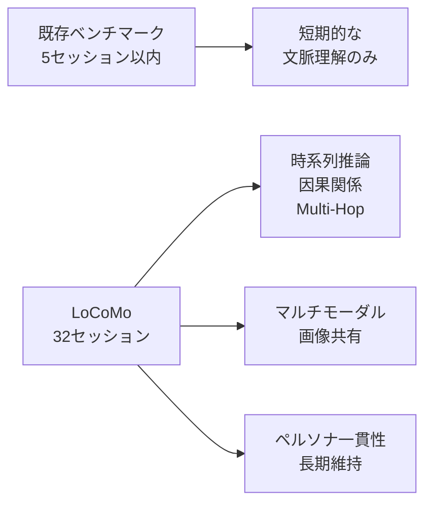

本記事は [Evaluating Very Long-Term Conversational Memory of LLM Agents (ACL 2024)](https://aclanthology.org/2024.acl-long.747/) の解説記事です。

## 論文概要（Abstract）

LoCoMo（Long-term Conversational Memory）は、LLMエージェントの超長期対話記憶能力を評価するためのベンチマークデータセットである。平均600ターン・16,000トークン・最大32セッションにわたる対話を収録し、5種類の質問タイプ（Single-Hop, Multi-Hop, Temporal, Open Domain, Adversarial）と3つの評価タスク（質問応答、イベント要約、マルチモーダル対話生成）を通じてLLMの長期記憶能力を測定する。ACL 2024（バンコク）のLong Paperとして採択された。

この記事は [Zenn記事: E-memで社内ヘルプデスクボットの長期記憶を実装しトークンコストを70%削減する](https://zenn.dev/0h_n0/articles/32423a4d09ce70) の深掘りです。

## 情報源

- **会議名**: ACL 2024（62nd Annual Meeting of the Association for Computational Linguistics）
- **年**: 2024
- **URL**: https://aclanthology.org/2024.acl-long.747/
- **著者**: Adyasha Maharana, Dong-Ho Lee, Sergey Tulyakov, Mohit Bansal, Francesco Barbieri, Yuwei Fang
- **arXiv**: https://arxiv.org/abs/2402.17753
- **発表形式**: Long Paper（pp. 13851-13870）

## カンファレンス情報

**ACLについて**:
ACL（Association for Computational Linguistics）は自然言語処理・計算言語学分野の最高峰会議の1つである。2024年はタイ・バンコクで開催され、Long Paper採択率は約20%程度（例年並み）。LoCoMoは同会議のLong Paper（24ページ）として採択されており、Snap Research（Snapchat）とUNC Chapel Hillの共同研究である。

## 技術的詳細（Technical Details）

### 問題設定：なぜ長期対話記憶の評価が必要か

著者らは、既存の長期対話研究が「5セッション以内の文脈でのモデル応答評価に留まっている」と指摘している。実際のユーザー対話では数週間〜数ヶ月にわたるセッションが発生し、時系列的な因果関係や複数セッションを跨ぐ情報の統合が求められる。



### データセット構築パイプライン

LoCoMoは**Machine-Humanパイプライン**で構築される。LLMベースのエージェントがペルソナとテンポラルイベントグラフに基づいて対話を生成し、人間アノテーターが品質を検証・修正する。

**データセット統計:**

| 項目 | 値 |
|------|-----|
| 平均ターン数 | 600ターン |
| 平均トークン数 | 16,000トークン |
| 最大セッション数 | 32セッション |
| 質問数 | 1,540問 |
| モダリティ | テキスト + 画像 |

**構築の3段階:**

1. **ペルソナ設計**: 各対話参加者に詳細なペルソナ（職業、趣味、家族構成等）を割り当て
2. **テンポラルイベントグラフ構築**: 時系列に沿ったイベントの因果関係をグラフ構造で定義
3. **対話生成と検証**: LLMがグラフに基づいて対話を生成し、人間が一貫性を検証

### 5種類の質問タイプ

LoCoMoは質問を5つの推論タイプに分類し、LLMの異なる記憶能力を測定する：

| 質問タイプ | 定義 | 例 |
|-----------|------|-----|
| **Single-Hop** | 1つのセッションから直接回答可能 | 「彼女の仕事は何？」 |
| **Multi-Hop** | 複数セッションの情報を統合して回答 | 「先月のVPN障害の原因と、その後の対策は？」 |
| **Temporal** | 時系列的な推論が必要 | 「いつ転職したのか、その前後の出来事は？」 |
| **Open Domain** | 対話外の一般知識も必要 | 「おすすめのレストランは？」 |
| **Adversarial** | 対話に含まれない情報への誤答を誘発 | 「先週彼が言っていたこと」（実際は言っていない） |

### 評価タスク

**Task 1: 質問応答（QA）**

5種類の質問に対するF1スコアで評価。著者らは「LLMは長い対話の理解と、長距離の時系列的・因果的ダイナミクスの把握に課題を示す」と報告している。

**Task 2: イベント要約**

テンポラルイベントグラフに基づいて構築されたイベントの要約を生成。時間的・因果的に関連するイベント群を忠実に要約する能力を測定する。

**Task 3: マルチモーダル対話生成**

画像を含む対話文脈を理解し、適切な応答を生成する能力を評価する。

### 評価対象のアプローチ

著者らは以下のカテゴリのアプローチを比較している：

**1. Standard LLM（全文入力）**:
コンテキストウィンドウに全対話履歴を入力。ウィンドウ制限により切り詰めが発生する場合がある。

**2. Long-Context LLM**:
拡張コンテキストウィンドウ（32K〜128Kトークン）を持つモデルで全文を処理。

**3. RAG（検索拡張生成）**:
対話をチャンクに分割し、クエリに関連するチャンクのみを検索して入力。セマンティック検索による関連性フィルタリング。

**4. メモリ拡張手法**:
対話履歴を構造化（要約、ナレッジグラフ等）して保持し、必要時に検索・再構成する手法。

### 実験結果の要点

著者らの実験から得られた主要な知見（論文Section 5より）：

1. **Long-Context LLMの限界**: 32K以上のコンテキストウィンドウを持つモデルでも、16Kトークンの対話全体を正確に把握することは困難。特にMulti-HopとTemporal質問で人間との差が大きい。

2. **RAGの有効性と限界**: RAGは関連チャンクの抽出により効率的だが、因果チェーンが複数チャンクに跨る場合に文脈の断片化が発生し、Multi-Hop質問で性能が低下する。

3. **人間との性能差**: すべてのアプローチにおいて「人間の性能を大幅に下回る」と報告されており、長期対話記憶は未解決の課題であることが示されている。

E-memの論文（arXiv 2601.21714）では、このLoCoMoベンチマークを主要な評価基盤として使用し、F1 54.17%を達成している。これは従来のGAM（45.31%）やRAG（44.73%）を上回るが、依然として人間レベルには到達していない。

## 実装のポイント（Implementation）

LoCoMoをメモリシステムの評価に使用する際のポイント：

**チャンク分割戦略**: 対話を固定長チャンクに分割する場合、セッション境界を跨ぐチャンクでMulti-Hop質問の正答率が低下する。セッション単位またはターン数ベースの分割が推奨される。

**評価メトリクスの選択**: F1スコアに加え、BLEU-1も使用される。F1は事実の網羅性を測定し、BLEU-1は生成テキストの流暢さを評価する。質問タイプごとにメトリクスの重みを変えることも可能。

**テンポラルイベントグラフの活用**: LoCoMoの各対話にはイベントグラフが付属しており、メモリシステムが正しく因果関係を保持しているかの詳細な分析が可能。

**再現環境**: データセットはGitHub（snap-research/locomo）で公開されており、評価スクリプトを含む。Python 3.10以上、OpenAI API（GPT-4評価用）が必要。

**評価スクリプトの使用例**:

```python
from locomo.evaluation import LoCoMoEvaluator

evaluator = LoCoMoEvaluator(
    dataset_path="data/locomo_v1.json",
    model_name="gpt-4o-mini",
    retrieval_method="semantic",  # "full", "semantic", "bm25"
    chunk_size=512,
    top_k=5,
)

results = evaluator.evaluate_all()
for q_type in ["single_hop", "multi_hop", "temporal", "open_domain", "adversarial"]:
    print(f"{q_type}: F1={results[q_type]['f1']:.2f}, BLEU-1={results[q_type]['bleu1']:.2f}")
```

**カスタムメモリシステムの評価方法**:

自作のメモリシステムをLoCoMoで評価するには、以下のインターフェースを実装する：

```python
from abc import ABC, abstractmethod


class MemorySystem(ABC):
    @abstractmethod
    def ingest_conversation(self, sessions: list[dict]) -> None:
        """対話履歴をメモリに格納する"""
        ...

    @abstractmethod
    def answer_question(self, question: str) -> str:
        """メモリを参照して質問に回答する"""
        ...


class EMemWrapper(MemorySystem):
    """E-memをLoCoMo評価用にラップする例"""

    def __init__(self, pipeline):
        self._pipeline = pipeline
        self._memory_units = []

    def ingest_conversation(self, sessions: list[dict]) -> None:
        for session in sessions:
            for turn in session["turns"]:
                unit = self._pipeline.create_memory_unit(turn["text"])
                self._memory_units.append(unit)

    def answer_question(self, question: str) -> str:
        return self._pipeline.answer(question, self._memory_units)
```

### LoCoMoデータの構造

LoCoMoの各対話エントリは以下の構造を持つ：

```json
{
  "dialogue_id": "conv_001",
  "persona_a": {
    "name": "Alice",
    "occupation": "software engineer",
    "hobbies": ["hiking", "photography"],
    "family": {"spouse": "Bob", "children": 2}
  },
  "persona_b": {
    "name": "Charlie",
    "occupation": "teacher",
    "hobbies": ["cooking", "reading"]
  },
  "event_graph": {
    "nodes": [
      {"id": "e1", "event": "Alice got promoted", "date": "2023-03-15"},
      {"id": "e2", "event": "Alice moved to new city", "date": "2023-04-01"},
      {"id": "e3", "event": "Alice started new project", "date": "2023-05-10"}
    ],
    "edges": [
      {"from": "e1", "to": "e2", "relation": "caused"},
      {"from": "e2", "to": "e3", "relation": "enabled"}
    ]
  },
  "sessions": [
    {
      "session_id": 1,
      "date": "2023-03-20",
      "turns": [
        {"speaker": "Alice", "text": "I got the promotion!"},
        {"speaker": "Charlie", "text": "That's amazing! Will you need to relocate?"}
      ]
    }
  ],
  "questions": [
    {
      "type": "multi_hop",
      "question": "What project did Alice start after moving?",
      "answer": "...",
      "evidence_sessions": [1, 3, 5]
    }
  ]
}
```

## LoCoMoが明らかにしたLLMメモリの課題

### 質問タイプ別の難易度分析

LoCoMoの設計により、LLMの記憶能力の弱点が質問タイプ別に明確化された：

**Multi-Hop（最も困難）**: 複数セッションに散在する情報片を収集し、推論チェーンを構築する必要がある。「先月のVPN障害→原因調査→対策実施」のような因果チェーンの再構成が求められる。E-memはこのカテゴリでGAM比+7.80ポイントの改善を報告している。

**Temporal（時系列推論）**: 「いつ」「どの順番で」という時間的関係の把握。日付や相対的な時間表現（「先週」「その後」）の正確な解釈が必要。E-memは+5.91ポイントの改善を達成。

**Open Domain（外部知識）**: 対話内容だけでなく世界知識との統合が必要。メモリシステムの設計ではカバーしにくく、E-memでもGAMに劣る（-1.14ポイント）。

**Adversarial（敵対的）**: 対話に存在しない情報を「あった」と誤答させようとする質問。ハルシネーション抑制能力を測定する。

### LoCoMoの後続ベンチマークへの影響

LoCoMoの公開以降、以下のベンチマークが登場している：

- **LongMemEval**: 500問、ユーザー/アシスタント/嗜好の想起と知識更新を評価
- **BEAM**: 1M〜10Mトークンスケールのプロダクションレベル評価
- **MemBench**: より包括的なLLMエージェントメモリ評価（2025年提案）

これらはLoCoMoの設計思想を継承しつつ、より大規模・多様な評価を実現している。

## 実運用への応用（Practical Applications）

LoCoMoベンチマークは以下の実務的な意思決定に活用できる：

**メモリシステムの選択**: E-mem、Mem0、RAG等のメモリ手法を統一的に評価し、自社ユースケースに最適な手法を選択する際の基準となる。

**弱点の特定**: Multi-Hop精度が低い場合はメモリの「文脈再構成」能力が不足しており、Temporal精度が低い場合は時系列インデックスの設計に問題がある。

**規模の判断**: 平均16Kトークンという設定は、数十セッションの社内チャットボットに対応する。より大規模なログ（100K+トークン）にはBEAMベンチマークが適している。

**制約事項**: LoCoMoは英語のみであり、日本語環境での評価には翻訳またはカスタムデータセットの構築が必要。また、1,540問という規模は統計的有意性の面で限界がある場合がある。

## LoCoMoを用いた各メモリ手法の比較（2024-2026年）

LoCoMo公開以降、主要なメモリ手法がこのベンチマークで評価されている。以下は各論文から報告されたF1スコアの横断的比較である：

| 手法 | Overall F1 | Multi-Hop | Temporal | トークン/クエリ | 出典 |
|------|-----------|----------|---------|-------------|------|
| Full Context | 37.31 | — | — | 169,100 | E-mem論文Table 7 |
| RAG | 44.73 | — | — | 6,430 | E-mem論文Table 7 |
| GAM | 45.31 | 34.84 | 53.91 | 12,540 | E-mem論文Table 1 |
| **E-mem** | **54.17** | **42.64** | **59.82** | **3,621** | E-mem論文Table 1 |
| Mem0 (2026) | 91.6 | — | — | 6,956 | Mem0 Blog (独自設定) |

> **注意**: Mem0の91.6は独自のベンチマーク設定での評価値であり、E-memの評価条件とは異なる。直接比較の際は評価プロトコルの差異に留意が必要。

この比較から、以下の傾向が読み取れる：
1. コンテキスト圧縮なしのFull Contextは最もコストが高く精度も最低
2. RAGは効率的だが文脈の断片化によりMulti-Hop精度が低い
3. E-memはコスト最小で最高精度を達成するが、LoCoMo全問で見るとまだ人間レベルには遠い
4. 評価条件の標準化が未完了であり、異なる論文の数値を単純比較できない状況

### LoCoMoの限界と今後の課題

著者ら自身が認めている限界：

1. **言語の偏り**: 英語のみのデータセット。日本語や中国語など他言語でのメモリ評価には別途データ構築が必要
2. **ドメイン固定**: 日常会話のみ。ヘルプデスクや医療相談など専門ドメインでは異なる記憶パターンが要求される
3. **規模の制約**: 1,540問は統計的検定に十分だが、細分化すると各カテゴリ300問程度となり信頼区間が広がる
4. **静的評価**: 一度生成した対話に対する事後評価であり、リアルタイム対話でのメモリ更新性能は測定できない

## まとめ

LoCoMoは、LLMエージェントの長期対話記憶能力を体系的に評価する初のベンチマークとして、E-memをはじめとするメモリシステム研究の基盤となっている。5種類の質問タイプによる多角的評価と、Machine-Humanパイプラインによる高品質なデータ構築が特徴である。著者らの実験が示すように、現状のLLMは長距離の時系列的・因果的推論において人間に大きく劣り、この課題への取り組みがE-memやMem0等の最新研究を動機づけている。2024年以降、LongMemEvalやBEAMなどの後続ベンチマークが登場しているが、LoCoMoは依然としてMulti-HopとTemporal推論の標準的な評価基盤として広く使用されている。

## 参考文献

- **Conference URL**: https://aclanthology.org/2024.acl-long.747/
- **arXiv**: https://arxiv.org/abs/2402.17753
- **Code**: https://github.com/snap-research/locomo
- **Related Zenn article**: https://zenn.dev/0h_n0/articles/32423a4d09ce70
