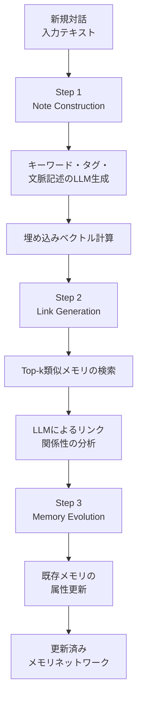

本記事は [A-MEM: Agentic Memory for LLM Agents (arXiv 2502.12110, NeurIPS 2025)](https://arxiv.org/abs/2502.12110) の解説記事です。

## 論文概要（Abstract）

A-MEMは、個人の知識管理手法であるZettelkasten（ツェッテルカステン）に着想を得て、LLMエージェントのメモリを動的にインデックシング・リンキングする手法を提案する。メモリ追加時にLLMがキーワード・タグ・文脈記述を自動生成し、既存メモリとの意味的関連性を分析してリンクを構築する。さらに、新規メモリの追加に伴い既存メモリの属性を進化・更新する仕組みを備える。6つの基盤モデル（GPT-4o/4o-mini, Qwen2.5-1.5B/3B, Llama3.2-1B/3B）でLoCoMoおよびDialSimベンチマークを評価し、ベースライン比でトークン使用量85-93%削減を達成したとNeurIPS 2025で報告されている。

この記事は [Zenn記事: E-memで社内ヘルプデスクボットの長期記憶を実装しトークンコストを70%削減する](https://zenn.dev/0h_n0/articles/32423a4d09ce70) の深掘りです。

## 情報源

- **会議名**: NeurIPS 2025（Advances in Neural Information Processing Systems）
- **年**: 2025
- **URL**: https://arxiv.org/abs/2502.12110
- **著者**: Wujiang Xu, Zujie Liang, Kai Mei, et al.
- **分野**: cs.AI, cs.CL

## カンファレンス情報

**NeurIPSについて**:
NeurIPS（Neural Information Processing Systems）は機械学習・人工知能分野の最高峰会議の1つであり、採択率は例年25%前後。A-MEMはNeurIPS 2025に採択されており、LLMエージェントのメモリ管理における新しいパラダイムを提示する論文として評価されている。

## 技術的詳細（Technical Details）

### Zettelkasten方式とは

Zettelkasten（独語で「カード箱」）は、社会学者ニクラス・ルーマンが考案した知識管理手法である。1つのアイデア=1枚のカードとして記録し、カード間を意味的関連でリンクすることで、階層的でなくネットワーク的な知識構造を構築する。A-MEMはこの原則をLLMエージェントのメモリシステムに適用している。

### メモリノートの構造

A-MEMの各メモリエントリは7つの属性を持つ複合タプルとして定義される：

$$
m_i = \{c_i, t_i, K_i, G_i, X_i, e_i, L_i\}
$$

| 属性 | 記号 | 説明 | 生成方法 |
|------|------|------|---------|
| コンテンツ | $c_i$ | 元の対話テキスト | そのまま保持 |
| タイムスタンプ | $t_i$ | 対話の時刻 | システム自動付与 |
| キーワード | $K_i$ | 概念を捕捉するキーワード群 | LLM生成 |
| タグ | $G_i$ | カテゴリ分類用タグ | LLM生成 |
| 文脈記述 | $X_i$ | 意味的理解を記述するテキスト | LLM生成 |
| 埋め込み | $e_i$ | 密ベクトル表現 | テキストエンコーダ |
| リンク | $L_i$ | 関連メモリへの参照集合 | LLM + 類似度計算 |

埋め込みベクトルの計算：

$$
e_i = f_{\text{enc}}[\text{concat}(c_i, K_i, G_i, X_i)]
$$

著者らはテキストエンコーダとして`all-minilm-l6-v2`を使用している。

### 3段階のメモリ組織化プロセス

新規メモリ$m_n$が追加されるたびに、3つのステップが実行される：



**Step 1 - Note Construction（ノート構築）**:

$$
K_i, G_i, X_i \leftarrow \text{LLM}(c_i \| t_i \| P_{s1})
$$

プロンプト$P_{s1}$により、LLMが元テキストからキーワード、カテゴリタグ、文脈的な意味記述を生成する。

**Step 2 - Link Generation（リンク生成）**:

$$
s_{n,j} = \frac{e_n \cdot e_j}{|e_n| \cdot |e_j|}
$$

$$
M_{\text{near}}^n = \{m_j \mid \text{rank}(s_{n,j}) \leq k, \; m_j \in M\}
$$

コサイン類似度で上位$k$件の既存メモリを検索し、LLMがプロンプト$P_{s2}$に基づいて意味的な関連性を分析してリンクを設定する。

**Step 3 - Memory Evolution（メモリ進化）**:

$$
m_j^* \leftarrow \text{LLM}(m_n \| M_{\text{near}}^n \setminus m_j \| m_j \| P_{s3})
$$

新規メモリの追加に伴い、関連する既存メモリの属性（キーワード、タグ、文脈記述）を更新する。元のメモリ$m_j$は進化したバージョン$m_j^*$に置き換えられる。

### アルゴリズム実装

```python
from dataclasses import dataclass, field
from sentence_transformers import SentenceTransformer
import numpy as np


@dataclass
class ZettelNote:
    content: str
    timestamp: float
    keywords: list[str] = field(default_factory=list)
    tags: list[str] = field(default_factory=list)
    context_desc: str = ""
    embedding: np.ndarray = field(default=None)
    links: set[str] = field(default_factory=set)
    note_id: str = ""


class AMemSystem:
    """A-MEM: Zettelkasten方式メモリシステム"""

    def __init__(
        self,
        llm_client,
        encoder_name: str = "all-MiniLM-L6-v2",
        top_k: int = 10,
    ):
        self._llm = llm_client
        self._encoder = SentenceTransformer(encoder_name)
        self._top_k = top_k
        self._notes: dict[str, ZettelNote] = {}

    def add_memory(self, content: str, timestamp: float) -> ZettelNote:
        """3段階プロセスでメモリを追加する"""
        # Step 1: Note Construction
        attrs = self._llm.generate(
            f"Extract keywords, tags, and contextual description:\n{content}"
        )
        note = ZettelNote(
            content=content,
            timestamp=timestamp,
            keywords=attrs["keywords"],
            tags=attrs["tags"],
            context_desc=attrs["context_description"],
        )
        combined = f"{content} {' '.join(note.keywords)} {note.context_desc}"
        note.embedding = self._encoder.encode(combined, normalize_embeddings=True)

        # Step 2: Link Generation
        neighbors = self._find_top_k(note.embedding)
        links = self._llm.analyze_links(note, neighbors)
        note.links = links

        # Step 3: Memory Evolution
        for neighbor_id in links:
            neighbor = self._notes[neighbor_id]
            evolved = self._llm.evolve_memory(note, neighbor)
            self._notes[neighbor_id] = evolved

        self._notes[note.note_id] = note
        return note

    def _find_top_k(self, query_emb: np.ndarray) -> list[ZettelNote]:
        """コサイン類似度でtop-k類似ノートを検索"""
        scores = []
        for nid, note in self._notes.items():
            sim = float(np.dot(query_emb, note.embedding))
            scores.append((note, sim))
        scores.sort(key=lambda x: x[1], reverse=True)
        return [n for n, _ in scores[: self._top_k]]

    def retrieve(self, query: str, top_k: int = 5) -> list[ZettelNote]:
        """クエリに関連するメモリをリンクネットワーク含めて検索"""
        q_emb = self._encoder.encode(query, normalize_embeddings=True)
        direct_matches = self._find_top_k(q_emb)[:top_k]
        linked_notes = set()
        for note in direct_matches:
            for link_id in note.links:
                if link_id in self._notes:
                    linked_notes.add(self._notes[link_id])
        return list(set(direct_matches) | linked_notes)
```

## 実験結果（Results）

### LoCoMoベンチマーク（論文Table 2より）

GPT-4o-miniでのA-MEM vs ベースライン：

| 手法 | Multi-Hop F1 | Temporal F1 | Single-Hop F1 | Adversarial F1 | トークン |
|------|------------|-----------|-------------|--------------|---------|
| LoCoMo (Full) | — | — | — | — | 16,910 |
| ReadAgent | — | — | — | — | 643-805 |
| MemGPT | — | — | — | — | 16,950 |
| **A-MEM** | **27.02** | **45.85** | **44.65** | **50.03** | **1,200-2,520** |

著者らの報告によると、A-MEMはベースライン比でトークン使用量85-93%の削減を達成している。

### 6つの基盤モデルでの評価（論文Table 2より）

| モデル | Multi-Hop F1 | Temporal F1 | Single-Hop F1 | Open Domain F1 |
|-------|------------|-----------|-------------|--------------|
| GPT-4o | 32.86 | 39.41 | 48.43 | 17.10 |
| GPT-4o-mini | 27.02 | 45.85 | 44.65 | 12.14 |
| Qwen2.5-3B | 12.57 | 27.59 | 17.23 | 7.12 |
| Qwen2.5-1.5B | 18.23 | 24.32 | 23.63 | 16.48 |
| Llama3.2-3B | 17.44 | 26.38 | 28.14 | 12.53 |
| Llama3.2-1B | 19.06 | 17.80 | 28.51 | 17.55 |

GPT-4oが最高の平均スコアを記録するが、小規模モデル（1.5B-3B）でも実用的な精度を達成しており、エッジデバイスでの展開可能性を示唆している。

### DialSimベンチマーク（論文Table 3より）

| メトリクス | LoCoMo baseline | MemGPT | A-MEM |
|-----------|---------------|--------|-------|
| F1 | 2.55 | 1.18 | **3.45** |
| BLEU-1 | 3.13 | 1.07 | **3.37** |
| ROUGE-L | 2.75 | 0.96 | **3.54** |
| SBERT Similarity | 15.76 | 8.54 | **19.51** |

DialSimでのA-MEMは、LoCoMo baseline比35%、MemGPT比192%のF1改善を達成している。

### アブレーション実験（論文Table 6より）

GPT-4o-miniでのコンポーネント除去実験：

| 構成 | Multi-Hop F1 | Temporal F1 | Single-Hop F1 |
|------|------------|-----------|-------------|
| w/o LG & ME | 9.65 | 24.55 | 13.28 |
| w/o ME | 21.35 | 31.24 | 39.17 |
| **Full A-MEM** | **27.02** | **45.85** | **44.65** |

Link Generation（LG）を除去すると全カテゴリで大幅に性能が低下し、メモリ間のリンク構造がA-MEMの中核であることが確認されている。Memory Evolution（ME）の追加によりTemporal F1が+14.61ポイント改善され、メモリの動的更新が時系列推論に有効である。

### スケーラビリティ（論文Table 4より）

| メモリサイズ | 検索時間 |
|------------|---------|
| 1,000 | 0.31μs |
| 10,000 | 0.38μs |
| 100,000 | 1.40μs |
| 1,000,000 | 3.70μs |

100万件のメモリに対しても3.70μsの検索時間を実現しており、プロダクション規模での使用に耐える性能を示している。

## 実装のポイント（Implementation）

**top-kの選択**: 論文ではk=10をデフォルトとしているが、モデルやタスクカテゴリにより最適値が異なる（論文Table 8: k=10〜50）。Multi-Hop質問では大きいk値が有利だが、コストが線形に増加する。

**LLM呼び出しコスト**: Note Construction（Step 1）とLink Generation（Step 2）でそれぞれ1回、Memory Evolution（Step 3）でリンク先の数だけLLM呼び出しが発生する。GPT-4o-miniで1操作あたり$0.0003未満、処理時間5.4秒と報告されている。

**小規模モデルでの動作**: Qwen2.5-1.5BやLlama3.2-1Bでもローカル実行可能で、処理時間1.1秒。精度はGPT-4o比で低下するが、プライバシーが重要な環境やオフライン環境で有用。

**E-memとの設計上の差異**: E-memがメモリの「活性化と再構成」に焦点を当てるのに対し、A-MEMはメモリの「組織化と進化」に焦点がある。E-memは非圧縮の生コンテキストを保持するが、A-MEMはLLMが生成した構造化属性（キーワード、タグ、文脈記述）で検索効率を向上させる。

## 実運用への応用（Practical Applications）

A-MEMの特長は以下のユースケースに適している：

**ナレッジマネジメント**: 社内の知識をZettelkasten方式で自動整理。新規ドキュメント追加時に既存知識との関連を自動検出し、ナレッジグラフを動的に拡張する。

**パーソナルアシスタント**: ユーザーの嗜好や過去の指示をメモリノートとして保持し、新規対話のたびにプロファイルを進化させる。100万件規模のメモリでも3.70μsの検索が可能。

**小規模モデルでのエッジ展開**: 1.5Bパラメータモデルでも動作するため、モバイルデバイスやプライバシー要件の厳しい環境での展開が可能。

**制約事項**: Memory Evolutionステップで既存メモリを上書きする設計のため、進化の履歴が保持されない。監査やロールバックが必要なシステムではバージョニングの追加実装が必要。また、LLMへの3回の呼び出し（Step 1-3）はリアルタイム性の要件が厳しい場面でボトルネックとなる可能性がある。

## 関連研究（Related Work）

- **E-mem**: 非圧縮エピソードの活性化・再構成。A-MEMの構造化メモリとは相互補完的で、E-memの高忠実度コンテキスト保持とA-MEMの効率的検索を組み合わせるアプローチが考えられる
- **MemGPT**: OS風のページング機構。A-MEM比でトークン使用量が8-14倍多く、DialSimでF1が1/3以下
- **ReadAgent**: Google DeepMindの要約ベースメモリ。効率的だが構造化が不十分でMulti-Hop推論に弱い

## まとめ

A-MEMはZettelkasten方式の「原子ノート + 動的リンキング」をLLMエージェントメモリに適用し、トークン使用量85-93%削減を達成しつつ6つの基盤モデルで一貫した性能改善を示した。特にLink Generationによるメモリ間の意味的関連構築と、Memory Evolutionによる動的な属性更新が、Temporal質問（+14.61ポイント）とMulti-Hop質問（+17.37ポイント、LG+ME除去との差）で顕著な効果を発揮している。100万件スケールでの3.70μs検索も実用上の大きな強みである。

## 参考文献

- **Conference URL**: https://arxiv.org/abs/2502.12110
- **Code**: https://github.com/wujiang-xu/A-MEM
- **Related Zenn article**: https://zenn.dev/0h_n0/articles/32423a4d09ce70
