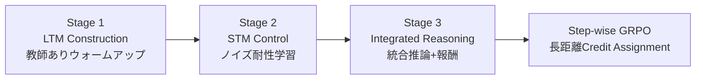

本記事は [Agentic Memory: Learning Unified Long-Term and Short-Term Memory Management for Large Language Model Agents (arXiv 2601.01885)](https://arxiv.org/abs/2601.01885) の解説記事です。

## 論文概要（Abstract）

Agentic Memory（AgeMem）は、LLMエージェントの長期記憶（LTM）と短期記憶（STM）の管理をエージェント自身のポリシーに統合し、強化学習で最適化するフレームワークである。従来手法がLTMとSTMを分離したヒューリスティクスで管理していたのに対し、AgeMemは6つのメモリ操作（Add, Retrieve, Update, Delete, Summary, Filter）をツールとして公開し、エージェントが自律的に「何を」「いつ」操作するかを決定する。3段階のプログレッシブRL訓練（教師ありウォームアップ→タスクレベルRL→ステップレベルGRPO）により、5つの長期ホライズンベンチマークでベースライン（Mem0, A-MEM, LangMem等）を上回る性能を達成したと報告されている。

この記事は [Zenn記事: E-memで社内ヘルプデスクボットの長期記憶を実装しトークンコストを70%削減する](https://zenn.dev/0h_n0/articles/32423a4d09ce70) の深掘りです。

## 情報源

- **arXiv ID**: 2601.01885
- **URL**: https://arxiv.org/abs/2601.01885
- **著者**: Yi Yu, Liuyi Yao, Yuexiang Xie, et al.
- **発表年**: 2026（v2: 2026年4月30日改訂）
- **分野**: cs.AI, cs.CL

## 背景と動機（Background & Motivation）

LLMエージェントが長期ホライズンタスク（数十ステップに跨る意思決定）に取り組む際、有限のコンテキストウィンドウがボトルネックとなる。著者らは既存手法の問題を以下のように整理している：

1. **分離型管理**: LTM（永続ストレージ）とSTM（コンテキスト内バッファ）が別コンポーネントとして設計され、相互連携が不十分
2. **ヒューリスティック依存**: 「直近N件を保持」「類似度閾値以下を削除」等の固定ルールでは、タスクごとの最適戦略を学習できない
3. **Credit Assignment困難**: メモリ操作の効果はタスク完了時にのみ判明し、個別のメモリ操作への報酬割り当てが困難

E-memが「メモリの活性化・再構成」に焦点を当てるのに対し、AgeMemは「メモリの管理ポリシー自体の学習」に焦点を当てており、相互補完的なアプローチである。

## 主要な貢献（Key Contributions）

- **貢献1**: メモリ操作をツールとして統一的に扱う設計。Add/Retrieve/Update/Delete/Summary/Filterの6操作をLLMのアクション空間に組み込み
- **貢献2**: 3段階プログレッシブRL（教師ありウォームアップ→タスクレベルRL→ステップレベルGRPO）による効率的な学習
- **貢献3**: 5つの異なるドメインのベンチマーク（ALFWorld, SciWorld, PDDL, BabyAI, HotpotQA）で複数バックボーン（Qwen2.5-7B, Qwen3-4B）に対し一貫した改善

## 技術的詳細（Technical Details）

### メモリ操作のツールインターフェース

AgeMemの中核設計は、メモリ操作を通常のツール呼び出しと同等に扱うことである：

```python
from dataclasses import dataclass


@dataclass
class MemoryEntry:
    content: str
    embedding: list[float]
    timestamp: float
    relevance_score: float


class AgeMemToolset:
    """AgeMemの6つのメモリ操作ツール"""

    def add(self, content: str) -> str:
        """新しい知識をLTMに永続保存する"""
        entry = MemoryEntry(
            content=content,
            embedding=self._encode(content),
            timestamp=time.time(),
            relevance_score=1.0,
        )
        self._ltm_store.append(entry)
        return f"Stored: {content[:50]}..."

    def retrieve(self, query: str, top_k: int = 5) -> list[str]:
        """LTMからtop-k類似エントリを取得する"""
        q_emb = self._encode(query)
        scores = [
            (e, cosine_sim(q_emb, e.embedding))
            for e in self._ltm_store
        ]
        scores.sort(key=lambda x: x[1], reverse=True)
        return [e.content for e, _ in scores[:top_k]]

    def update(self, entry_id: str, new_content: str) -> str:
        """既存LTMエントリを更新する"""
        ...

    def delete(self, entry_id: str) -> str:
        """不要なLTMエントリを削除する"""
        ...

    def summary(self, context_span: str) -> str:
        """STMの一部を要約して圧縮する"""
        ...

    def filter(self, threshold: float = 0.6) -> str:
        """STM内の類似度閾値以下のメッセージを除去する"""
        ...
```

### 3段階プログレッシブRL訓練



**Stage 1（LTM Construction）**: エージェントが文脈情報と対話し、永続保存すべき重要情報を識別してLTMに格納する。教師データ（メモリ操作のデモンストレーション）による初期化。

**Stage 2（STM Control）**: コンテキストがリセットされLTMのみが持続する状況で、セマンティックな妨害情報（distractors）に対しFilter/Summaryを使ってノイズを抑制する訓練。

**Stage 3（Integrated Reasoning）**: ターゲットクエリに対し、LTMからの検索とSTMの管理を統合して最終回答を生成。タスク完了時の報酬がすべての先行決定に伝播する。

### Step-wise GRPO（報酬割り当て）

メモリ操作はタスク完了より遥か前に実行されるため、通常の強化学習では「どのメモリ操作が成功に寄与したか」の識別が困難である。著者らはStep-wise GRPOを導入し、終端報酬をすべてのタイムステップに均一にブロードキャストする：

$$
A_T^{(k,q)} = \frac{r_T^{(k,q)} - \mu_{G_q}}{\sigma_{G_q} + \epsilon}
$$

ここで、
- $r_T^{(k,q)}$: グループ$G_q$のサンプル$k$の終端報酬
- $\mu_{G_q}$: グループ内の報酬平均
- $\sigma_{G_q}$: グループ内の報酬標準偏差
- $\epsilon$: 数値安定化項

ポリシー目的関数：

$$
J(\theta) = \mathbb{E}\left[\rho_t \cdot A_t - \beta \cdot D_{\text{KL}}[\pi_\theta \| \pi_{\text{ref}}]\right]
$$

グループ正規化されたアドバンテージにより、異なるタスクの報酬スケールを標準化し、学習の安定性を確保している。

### 複合報酬関数

$$
R(\tau) = \mathbf{w}^T \cdot \mathbf{R} + P_{\text{penalty}}
$$

報酬ベクトル$\mathbf{R}$の構成要素：
- $R_{\text{task}}$: LLMジャッジによるタスク達成スコア
- $R_{\text{context}}$: 圧縮率 + 過剰使用防止 + 情報保持
- $R_{\text{memory}}$: ストレージ品質 + メンテナンス + セマンティック関連度

## 実験結果（Results）

### 5つのベンチマークでの比較（論文Table 2より）

Qwen2.5-7Bバックボーン：

| 手法 | ALFWorld | SciWorld | PDDL | BabyAI | HotpotQA | 平均 |
|------|----------|----------|------|--------|----------|------|
| No-Memory | 27.16 | 13.80 | 10.15 | 50.80 | 38.36 | 28.05 |
| LangMem | 38.27 | 28.29 | 15.85 | 51.34 | 37.43 | 34.23 |
| A-MEM | 34.68 | 28.06 | 18.39 | 58.82 | 43.95 | 36.78 |
| Mem0 | 37.49 | 26.99 | 13.96 | 60.58 | 46.66 | 37.14 |
| **AgeMem** | **41.07** | **35.55** | **17.31** | **61.42** | **54.44** | **41.96** |

Qwen3-4Bバックボーン：

| 手法 | ALFWorld | SciWorld | PDDL | BabyAI | HotpotQA | 平均 |
|------|----------|----------|------|--------|----------|------|
| No-Memory | 38.51 | 47.89 | 30.14 | 55.83 | 47.48 | 43.97 |
| **AgeMem** | **48.97** | **59.48** | **35.07** | **72.56** | **55.49** | **54.31** |

AgeMemはQwen2.5-7BでMem0比+4.82ポイント、Qwen3-4Bでは+10.34ポイントの改善を達成している。

### RL訓練の効果

AgeMem-noRL（RLなし、アーキテクチャのみ）との比較：
- Qwen2.5-7B: +8.53ポイント（33.43 → 41.96）
- Qwen3-4B: +8.72ポイント（45.59 → 54.31）

RLによる最適化がメモリ管理戦略の学習に不可欠であることが示されている。

### RL訓練で発見された非自明な戦略

論文Table 3より、RL訓練後のツール使用パターンの変化：

| メモリ操作 | 訓練前 | 訓練後 | 変化 |
|-----------|--------|--------|------|
| Add Memory | 0.92 | 1.64 | +78% |
| Update Memory | 0.00 | 0.13 | 新規発生 |
| Delete Memory | 0.00 | 0.08 | 新規発生 |
| Filter (STM) | 0.02 | 0.31 | +15倍 |

特筆すべき発見：
1. **予防的要約**: コンテキストが満杯になる前に中間結果を要約する戦略を自発的に学習
2. **内省的検索**: タスクが明示される前のStage 1で、既存メモリを検索して整合性を確認する行動を獲得
3. **選択的削除**: 意味的に類似するが新情報を含まないエントリを能動的に削除

### メモリ品質スコア

AgeMemのメモリ関連度スコア（論文Figure 2より）：
- Qwen2.5-7B: 0.533（ベースライン最高0.479を上回る）
- Qwen3-4B: 0.605（さらに高品質なメモリ構築）

## 実装のポイント（Implementation）

**RLインフラ要件**: Step-wise GRPOの訓練にはQwen2.5-7Bで8xA100 GPU、Qwen3-4Bで4xA100 GPUが報告されている。推論時は単一GPUで動作可能。

**報酬設計の重要性**: Answer-Only報酬（タスクスコアのみ）とAll-Returns報酬（複合報酬）の比較では、All-Returnsが0.509→0.544にジャッジスコアを改善する（論文Table 4より）。メモリ品質報酬$R_{\text{memory}}$の追加が、より質の高いLTM構築を促進する。

**Filter閾値の設定**: STM内メッセージの類似度閾値θ=0.6がデフォルト。これより低いとノイズが残留し、高いと有用な情報が過剰に除去される。タスクドメインに応じた調整が必要。

**E-memとの組み合わせ可能性**: AgeMemのメモリ管理ポリシーとE-memの活性化・再構成メカニズムは直交する設計であり、AgeMemでLTMを管理しE-memで検索・推論する組み合わせが理論的に可能。

## Production Deployment Guide

### AWS実装パターン（コスト最適化重視）

AgeMemのRL訓練済みモデルを推論サービスとしてデプロイする構成：

| 規模 | 月間リクエスト | 推奨構成 | 月額コスト | 主要サービス |
|------|--------------|---------|-----------|------------|
| **Small** | ~3,000 (100/日) | Serverless | $60-180 | Lambda + Bedrock + DynamoDB |
| **Medium** | ~30,000 (1,000/日) | Hybrid | $350-900 | ECS Fargate + ElastiCache + Bedrock |
| **Large** | 300,000+ (10,000/日) | Container | $2,000-5,000 | EKS + SageMaker Endpoint + Spot |

**Small構成の詳細** (月額$60-180):
- **Lambda (メモリ操作ルーター)**: 1GB RAM, 30秒タイムアウト ($15/月)
- **Bedrock (メモリ管理推論)**: Claude 3.5 Haiku ($100/月)
- **DynamoDB (LTMストア)**: On-Demand, GSI付き ($20/月)
- **OpenSearch Serverless**: ベクトル検索 ($25/月)
- **CloudWatch**: メモリ操作ログ ($5/月)

**コスト削減テクニック**:
- メモリ操作のバッチ処理（複数Add/Update/Deleteを1回のLLM呼び出しで実行）
- STM Filter/Summaryはローカル処理（LLM不要）
- LTM Retrieve用embeddingのキャッシュ（ElastiCache）
- Bedrock Prompt Cachingでシステムプロンプト固定（30-90%削減）

**コスト試算の注意事項**:
- 上記は2026年5月時点のAWS ap-northeast-1料金に基づく概算値です
- メモリ操作の頻度はタスクにより大きく変動します（HotpotQA: 平均4.92回/クエリ）
- 最新料金は [AWS料金計算ツール](https://calculator.aws/) で確認してください

### Terraformインフラコード

```hcl
resource "aws_dynamodb_table" "ltm_store" {
  name         = "agemem-ltm"
  billing_mode = "PAY_PER_REQUEST"
  hash_key     = "user_id"
  range_key    = "entry_id"

  attribute {
    name = "user_id"
    type = "S"
  }
  attribute {
    name = "entry_id"
    type = "S"
  }
  attribute {
    name = "relevance_score"
    type = "N"
  }

  global_secondary_index {
    name            = "relevance-index"
    hash_key        = "user_id"
    range_key       = "relevance_score"
    projection_type = "ALL"
  }

  ttl {
    attribute_name = "expire_at"
    enabled        = true
  }
}

resource "aws_lambda_function" "memory_router" {
  filename      = "memory_router.zip"
  function_name = "agemem-router"
  role          = aws_iam_role.agemem_lambda.arn
  handler       = "handler.route_memory_operation"
  runtime       = "python3.12"
  timeout       = 30
  memory_size   = 1024

  environment {
    variables = {
      LTM_TABLE       = aws_dynamodb_table.ltm_store.name
      BEDROCK_MODEL   = "anthropic.claude-3-5-haiku-20241022-v1:0"
      FILTER_THRESHOLD = "0.6"
    }
  }
}
```

### コスト最適化チェックリスト

- [ ] メモリ操作のバッチ化（1クエリあたりの呼び出し回数削減）
- [ ] STM操作（Filter/Summary）のローカル実行（LLM不使用）
- [ ] LTM embeddingのElastiCacheキャッシュ（再計算回避）
- [ ] DynamoDB TTLで古いエントリを自動期限切れ
- [ ] Bedrock Prompt Caching有効化
- [ ] CloudWatch アラーム: メモリ操作回数スパイク検知
- [ ] Spot Instances使用（Large構成のGPU推論用）

## 実運用への応用（Practical Applications）

AgeMemは以下のユースケースに適している：

**長期ホライズンタスク**: ALFWorldやSciWorldで示されたように、数十ステップの意思決定チェーンを要するタスク（例：複数日に跨るプロジェクト管理AI）。

**適応的メモリ管理**: 固定ルールでは対応できないドメイン固有のメモリ戦略を、RLで自動学習する。ヘルプデスク、法務文書管理、研究アシスタント等。

**E-memとの比較での使い分け**:
- **E-mem向き**: 過去の対話を正確に想起する必要があるQAタスク（Multi-Hop, Temporal）
- **AgeMem向き**: メモリの能動的な管理（何を保存し何を捨てるか）が重要なタスク

**制約事項**: RL訓練にはGPUリソースが必要（8xA100/7Bモデル）。推論時はCPUでも動作するが、Bedrock等のAPI経由が現実的。

## 関連研究（Related Work）

- **E-mem**: メモリの活性化・再構成に焦点。AgeMemのメモリ管理ポリシーと直交する設計
- **Mem0**: マルチシグナル検索による効率的メモリ。AgeMemのベースライン比較でAvg 37.14（AgeMem: 41.96）
- **A-MEM**: Zettelkasten方式の動的メモリ組織化。AgeMemとはメモリ構造のアプローチが異なる

## まとめと今後の展望

AgeMemはメモリ操作を「学習可能なツール呼び出し」として定式化し、Step-wise GRPOによる長距離Credit Assignmentを実現した。5つのベンチマークでMem0/A-MEM/LangMemを一貫して上回り、RL訓練による非自明な戦略（予防的要約、内省的検索、選択的削除）の獲得が確認されている。E-memの「再構成」とAgeMemの「管理」は相互補完的であり、両者の統合が今後の研究方向として期待される。

## 参考文献

- **arXiv**: https://arxiv.org/abs/2601.01885
- **Related Zenn article**: https://zenn.dev/0h_n0/articles/32423a4d09ce70
