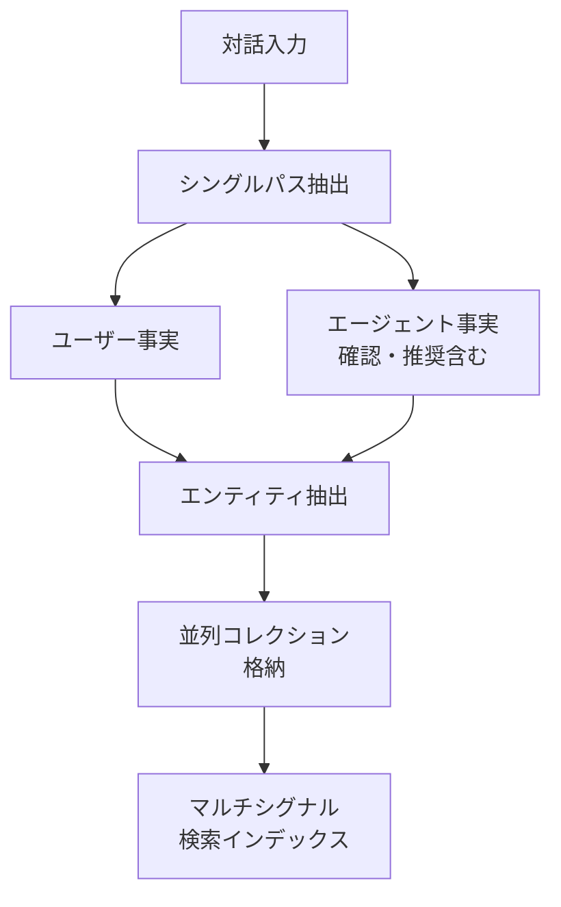

本記事は [State of AI Agent Memory 2026 - Mem0 Blog](https://mem0.ai/blog/state-of-ai-agent-memory-2026) の解説記事です。

## ブログ概要（Summary）

Mem0が2026年に公開した「State of AI Agent Memory 2026」は、AIエージェントメモリ分野の産業動向を網羅する技術レポートである。2026年4月に発表された新しいトークン効率メモリアルゴリズムのベンチマーク結果（LoCoMo 91.6、LongMemEval 93.4）、3つの標準化ベンチマーク（LoCoMo, LongMemEval, BEAM）の比較分析、シングルパス階層抽出とマルチシグナル検索の技術的詳細、13のエージェントフレームワーク統合と19のベクトルストアバックエンドに至るエコシステムの成熟度を報告している。

この記事は [Zenn記事: E-memで社内ヘルプデスクボットの長期記憶を実装しトークンコストを70%削減する](https://zenn.dev/0h_n0/articles/32423a4d09ce70) の深掘りです。

## 情報源

- **種別**: 企業テックブログ
- **URL**: https://mem0.ai/blog/state-of-ai-agent-memory-2026
- **組織**: Mem0（YC-backed、2025年10月に$24M Series A調達）
- **発表日**: 2026年4月

## 技術的背景（Technical Background）

### エージェントメモリが「エンジニアリング領域」になった2026年

Mem0のブログでは、2026年がAIエージェントメモリの「研究段階から本番エンジニアリング段階への転換点」であると述べられている。この背景には以下の変化がある：

1. **ベンチマークの標準化**: LoCoMo、LongMemEval、BEAMの3つのベンチマークが定着し、異なるメモリシステム間の定量比較が可能に
2. **プロダクション要件の明確化**: 非同期メモリ書き込み、メタデータフィルタリング、タイムスタンプ管理等の運用機能が標準装備に
3. **エコシステムの拡大**: LangChain、LlamaIndex、CrewAI等13のエージェントフレームワークとの統合、19のベクトルストアバックエンド対応

E-memの論文（ICML 2026）も同時期に発表されており、学術側でも「メモリ前処理→エピソード再構成」というパラダイムシフトが提案された。Mem0のブログはこれに対し産業側の視点を提供している。

## 実装アーキテクチャ（Architecture）

### 2026年アルゴリズムの中核: シングルパス階層抽出

Mem0の2026年アルゴリズムは、対話内容から1回のパスで事実を抽出し、階層的にメモリを構築する。従来の複数パス処理と比較して、レイテンシと計算コストを大幅に削減している。



**ADD-only抽出**: エージェントが生成した事実（確認や推奨）を「一級市民」として扱い、ユーザーが述べた事実と同等の重みで保存する。これにより、「先日○○をお勧めしましたが」のようなエージェント側の記憶も保持される。

### マルチシグナル検索

Mem0は3つのスコアリングパスを並列実行し、結果を正規化してスコアを融合する：

| シグナル | 手法 | 得意な検索 |
|---------|------|-----------|
| Semantic Similarity | 密ベクトルコサイン類似度 | 同義語・言い換え表現 |
| Keyword Matching | BM25スパース検索 | エラーコード・製品名 |
| Entity Matching | エンティティリンキング | 人名・組織名・固有名詞 |

E-memの3経路ルーティング（Global Alignment / Semantic Association / Symbolic Trigger）との類似性が見られるが、Mem0はメモリの「検索」に焦点を当て、E-memはメモリの「活性化と再構成」に焦点を当てている点が異なる。

### エンティティ認識型グラフメモリ

2026年アルゴリズムでは、外部グラフストアを排し、組み込みのエンティティリンキングを採用している。メモリ追加時にエンティティを抽出して並列コレクションに格納し、検索時にエンティティマッチングでスコアをブーストする設計である。

```python
from dataclasses import dataclass


@dataclass
class Mem0Memory:
    content: str
    user_id: str
    entities: list[str]
    embedding: list[float]
    timestamp: float
    metadata: dict


class Mem0MultiSignalRetriever:
    """Mem0のマルチシグナル検索（概念実装）"""

    def __init__(
        self,
        semantic_weight: float = 0.5,
        keyword_weight: float = 0.25,
        entity_weight: float = 0.25,
    ):
        self._weights = (semantic_weight, keyword_weight, entity_weight)

    def retrieve(
        self,
        query: str,
        memories: list[Mem0Memory],
        top_k: int = 10,
    ) -> list[tuple[Mem0Memory, float]]:
        """3シグナル並列スコアリング + 正規化融合"""
        semantic_scores = self._semantic_search(query, memories)
        keyword_scores = self._bm25_search(query, memories)
        entity_scores = self._entity_match(query, memories)

        # 各シグナルを正規化して融合
        combined = {}
        for mem in memories:
            mid = id(mem)
            score = (
                self._weights[0] * semantic_scores.get(mid, 0)
                + self._weights[1] * keyword_scores.get(mid, 0)
                + self._weights[2] * entity_scores.get(mid, 0)
            )
            combined[mid] = (mem, score)

        ranked = sorted(combined.values(), key=lambda x: x[1], reverse=True)
        return ranked[:top_k]
```

## パフォーマンス最適化（Performance）

### ベンチマーク結果

Mem0の2026年アルゴリズムのベンチマーク結果（ブログ記載値）：

| ベンチマーク | スコア | 平均トークン/クエリ | 特徴 |
|------------|-------|-----------------|------|
| LoCoMo | 91.6 | 6,956 | マルチセッション想起 |
| LongMemEval | 93.4 | 6,787 | ユーザー/嗜好想起 |
| BEAM (1M) | 64.1 | 6,719 | 大規模プロダクション |
| BEAM (10M) | 48.6 | 6,914 | 超大規模プロダクション |

> **重要な注意事項**: Mem0のLoCoMoスコア91.6は独自のベンチマーク設定での評価値であり、E-mem論文のLoCoMo評価（F1 54.17%）とは評価プロトコルが異なる。直接比較する際は条件の差異に留意が必要である。ブログでは評価プロトコルの詳細が明示されていない。

### 2025年→2026年アルゴリズムの改善幅

ブログの報告によると、2026年アルゴリズムで特に大きな改善が見られた領域：

| 質問タイプ | 改善幅 | 意味 |
|-----------|-------|------|
| Temporal | +29.6ポイント | 時系列推論の大幅改善 |
| Multi-Hop | +23.1ポイント | 複数情報の統合推論の改善 |

これらの改善は、新しいエンティティ認識型グラフメモリとタイムスタンプ管理の改善に起因するとブログでは説明されている。

### レイテンシとコスト効率

ブログによると、Mem0はFull Contextアプローチと比較して：
- **p95レイテンシ**: 91%削減
- **トークンコスト**: 90%以上削減

E-memのトークンコスト3,621と比較すると、Mem0は6,956トークン/クエリとやや多いが、これはMem0が検索+コンテキスト生成をエンドツーエンドで行うためである。

## 運用での学び（Production Lessons）

### プロダクションで必須となった機能

Mem0のブログでは、以下の機能が「本番環境で必須」として挙げられている：

**1. 非同期メモリ書き込み（Async Mode as Default）**:
メモリの書き込みを非同期化し、ユーザーへの応答レイテンシへの影響を排除する。E-memの論文でも同様の非同期書き込みが推奨されており、Zenn記事では`AsyncMemoryWriter`クラスとしてパターンが示されている。

**2. リランキング層**:
Cohere、ZeroEntropy、HuggingFace、LLMベースの4つのリランカーをサポート。初回検索のリコールを維持しつつ、上位結果の精度を向上させる。

**3. メタデータフィルタリング**:
セマンティック類似度以外の条件（日付範囲、カテゴリ、ユーザーID等）でのフィルタリング。ヘルプデスク用途では「直近30日以内のチケット」等のスコープ制限に有用。

**4. マルチスコープメモリモデル**:
各メモリに以下の識別子を関連付け：
- `user_id`（セッション跨ぎ永続）
- `agent_id`（エージェント固有）
- `run_id` / `session_id`（単一会話）
- `app_id` / `org_id`（組織コンテキスト）

**5. タイムスタンプ管理**:
更新時のタイムスタンプ記録。移行データや履歴データの時系列保持に必要。

### エコシステム統合

**13のエージェントフレームワーク統合**:
LangChain, LangGraph, LlamaIndex, CrewAI, AutoGen, Agno, CAMEL AI, Dify, Flowise, Google ADK, OpenAI Agents SDK, Mastra, MCP Server

**19のベクトルストアバックエンド**:
- **セルフホスト**: Qdrant, Chroma, Weaviate, Milvus, PGVector, Redis, Elasticsearch, FAISS, Cassandra, Valkey, Kuzu
- **クラウド/マネージド**: Pinecone, ChromaDB Cloud, Azure AI Search, Databricks, Neptune Analytics, MongoDB, OpenAI Store

**音声エージェント統合**:
ElevenLabs, LiveKit, Pipecatとの統合。ブログでは「最も急成長しているユースケースカテゴリ」と記述されている。音声対話ではスクロールや手動コンテキスト提供ができないため、メモリの重要性が特に高い。

## 学術研究との関連（Academic Connection）

### E-memとの技術的比較

| 観点 | E-mem | Mem0 (2026) |
|------|-------|-------------|
| メモリ保持方式 | 非圧縮エピソード | 事実抽出+構造化 |
| 検索手法 | 3経路Union活性化 | 3シグナル正規化融合 |
| LLM構成 | 大小階層 (Master+Assistants) | 単一LLM |
| トークン/クエリ | 3,621 | 6,956 |
| LoCoMo F1 | 54.17% (同一プロトコル) | 91.6 (独自設定) |
| 強み | Multi-Hop, Temporal推論 | エコシステム統合, プロダクション品質 |

E-memは学術的な精度最適化に焦点を当て、Mem0はプロダクション環境での即座の導入可能性に焦点を当てている。両者は相互排他的ではなく、E-memのルーティングメカニズムをMem0の検索層に統合するアプローチが考えられる。

### 未解決の課題

ブログでは以下の課題が「Open Challenges」として挙げられている：

**1. テンポラル抽象化**: BEAM 1M（64.1）とBEAM 10M（48.6）の15.5ポイントのギャップは、大規模データでの時系列推論の困難さを示す。

**2. クロスセッション構造**: 情報の変化を「置換」として扱い、変遷の文脈が失われる。「以前はAだったがBに変わった」という推移の保持が課題。

**3. プライバシーとガバナンス**: メモリの閲覧、削除、保持ポリシーはアプリケーション固有であり、標準化されていない。

**4. メモリの陳腐化**: 関連度が高いが不正確になったメモリの検出。「古い」メモリと「間違った」メモリの区別が必要。

## Production Deployment Guide

### AWS実装パターン（コスト最適化重視）

Mem0をAWS環境で運用する場合の構成例：

| 規模 | 月間リクエスト | 推奨構成 | 月額コスト | 主要サービス |
|------|--------------|---------|-----------|------------|
| **Small** | ~3,000 (100/日) | Serverless | $50-150 | Lambda + Bedrock + DynamoDB |
| **Medium** | ~30,000 (1,000/日) | Hybrid | $300-800 | Lambda + Qdrant Cloud + Bedrock |
| **Large** | 300,000+ (10,000/日) | Container | $2,000-5,000 | EKS + Qdrant Self-hosted + Bedrock |

**Mem0固有の考慮点**:
- Mem0はPython SDKとして提供されるため、Lambda/ECS上で直接実行可能
- ベクトルストアはQdrant推奨（Mem0公式サポート、19バックエンド中最も統合が深い）
- 非同期メモリ書き込みをデフォルトにし、Lambda/SQSで非同期処理

**コスト試算の注意事項**:
- 上記は2026年5月時点のAWS ap-northeast-1料金に基づく概算値です
- Mem0 Cloudを使用する場合は別途Mem0の料金が発生します
- 最新料金は [AWS料金計算ツール](https://calculator.aws/) で確認してください

### Terraformインフラコード

```hcl
resource "aws_lambda_function" "mem0_handler" {
  filename      = "mem0_handler.zip"
  function_name = "mem0-memory-handler"
  role          = aws_iam_role.mem0_lambda.arn
  handler       = "handler.main"
  runtime       = "python3.12"
  timeout       = 60
  memory_size   = 1024

  environment {
    variables = {
      MEM0_API_KEY     = data.aws_secretsmanager_secret_version.mem0.secret_string
      QDRANT_URL       = "https://qdrant-cluster.example.com:6333"
      BEDROCK_MODEL_ID = "anthropic.claude-3-5-haiku-20241022-v1:0"
      ASYNC_WRITES     = "true"
    }
  }
}

resource "aws_sqs_queue" "mem0_write_queue" {
  name                       = "mem0-async-writes"
  visibility_timeout_seconds = 120
  message_retention_seconds  = 86400
}

resource "aws_lambda_event_source_mapping" "mem0_writer" {
  event_source_arn = aws_sqs_queue.mem0_write_queue.arn
  function_name    = aws_lambda_function.mem0_writer.arn
  batch_size       = 10
}
```

### コスト最適化チェックリスト

- [ ] 非同期メモリ書き込み（SQS + Lambda）でレスポンスレイテンシ分離
- [ ] Mem0 Cloud vs セルフホストのコスト比較（月間10K件以上ならセルフホスト有利）
- [ ] ベクトルストアのインデックスサイズ監視（Qdrant Sharding設定）
- [ ] メモリTTL設定で90日超過エントリを自動削除
- [ ] BM25インデックスのウォームアップ（コールドスタート回避）
- [ ] Bedrock Prompt Cachingでシステムプロンプト固定
- [ ] CloudWatch アラーム: メモリ書き込みキュー深度監視

## まとめと実践への示唆

Mem0のブログは、2026年のAIエージェントメモリが「研究から本番エンジニアリングへ」移行したことを示す産業レポートである。3つの標準ベンチマーク（LoCoMo, LongMemEval, BEAM）の定着、13のフレームワーク統合、19のベクトルストア対応というエコシステムの成熟が報告されている。TemporalクエリとMulti-Hopクエリでの大幅改善（+29.6/+23.1ポイント）は、エンティティ認識型グラフメモリとタイムスタンプ管理の効果を示す。ただし、LoCoMoスコア91.6はMem0独自の評価設定であり、E-mem（54.17%）との直接比較には注意が必要である。社内ヘルプデスクへの導入では、Mem0の即座のプロダクション対応性（SDK、非同期書き込み、13フレームワーク統合）が強みとなり、E-memの学術的精度を補完する形での活用が現実的である。

## 参考文献

- **Blog URL**: https://mem0.ai/blog/state-of-ai-agent-memory-2026
- **Related Paper**: https://arxiv.org/abs/2504.19413
- **Related Zenn article**: https://zenn.dev/0h_n0/articles/32423a4d09ce70
