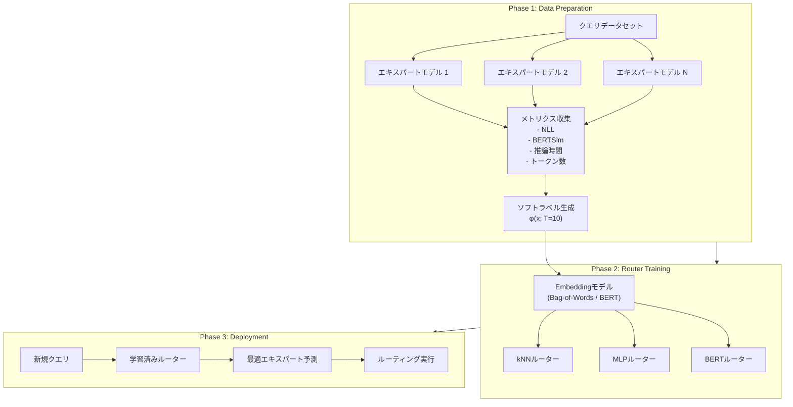

本記事は [TensorOpera Router: A Multi-Model Router for Efficient LLM Inference (arXiv:2408.12320)](https://arxiv.org/abs/2408.12320) の解説記事です。

## 論文概要（Abstract）

TensorOpera Router（PolyRouter）は、複数の特化型LLM（エキスパートモデル）を統合管理し、受信クエリごとに最適なモデルへ動的にルーティングするフレームワークである。kNN・MLP・BERTの3種類のルーター分類器を提案し、7つのエキスパートモデル（BioLlama-8B、CodeLlama-7B、MathDeepSeek-7B等）を対象とした実験で、ランダムルーティング比でコスト30%削減、スループット40%向上、品質指標BERTSim 11%改善を達成したと報告されている。

この記事は [Zenn記事: Portkey AI Gatewayで複数LLMを統合管理する実践ガイド](https://zenn.dev/0h_n0/articles/eeae51b7540bcf) の深掘りです。

## 情報源

- **arXiv ID**: 2408.12320
- **URL**: [https://arxiv.org/abs/2408.12320](https://arxiv.org/abs/2408.12320)
- **著者**: Dimitris Stripelis, Zijian Hu, Jipeng Zhang, et al.
- **発表年**: 2024（初版 August 2024、v3 October 2024）
- **分野**: cs.AI, cs.LG

## 背景と動機（Background & Motivation）

LLMの多様化が進む中で、特定ドメインに特化したモデル（コード生成、数学推論、医療テキスト等）が多数公開されている。しかし、単一モデルで全タスクを高精度にカバーすることは困難であり、実運用ではクエリの内容に応じて適切なモデルを選択する必要がある。

従来のアプローチとして、全クエリを単一の高性能モデル（例: GPT-4）に送る「Zero-Router」方式が一般的であった。しかし、この方式ではコストが高く、ドメイン特化タスクでは必ずしも最適な結果を得られない。著者らは「学習ベースのルーターにより、クエリごとに最適なエキスパートモデルを予測し、コスト・品質・スループットを同時に最適化できる」と主張している。この課題はPortkey等のAI Gatewayが解決しようとする問題と本質的に同一であり、PolyRouterはその理論的基盤を提供するものである。

## 主要な貢献（Key Contributions）

- **貢献1**: 3フェーズパイプライン（データ準備→ルーター学習→デプロイメント）による体系的なマルチモデルルーティングフレームワークの提案
- **貢献2**: kNN・MLP・BERTの3種類のルーター分類器を統一的に比較評価し、各手法の特性と適用条件を明らかにしたこと
- **貢献3**: ソフトラベルによる温度スケーリング手法の導入により、ハードラベル（最良モデルのみを正解とする）方式と比較して学習の安定性と汎化性能を改善したこと
- **貢献4**: Fox-1.6B（小型モデル）へのクエリ集中という発見から、エッジ-クラウドハイブリッドデプロイメントの可能性を示したこと

## 技術的詳細（Technical Details）

### 3フェーズパイプライン

PolyRouterのアーキテクチャは以下の3フェーズで構成される：



### ソフトラベル生成

各エキスパートモデルの性能メトリクスから、ハードラベル（argmax）ではなくソフトラベルを生成する。温度スケーリングされたsoftmax関数を使用する：

$$
\varphi_r(x_i; T) = \frac{\exp(x_i / T)}{\sum_{j=1}^{M} \exp(x_j / T)}
$$

ここで、
- $x_i$: エキスパートモデル$i$の性能メトリクス（BERTSimスコア等）
- $T$: 温度パラメータ（論文では$T=10$を使用）
- $M$: エキスパートモデルの総数

$T$が大きいほど確率分布が平滑化され、複数のモデルが「ほぼ同等に良い」ケースでも学習信号が保持される。$T \to 0$ではハードラベル（one-hot）に退化し、$T \to \infty$では一様分布に近づく。著者らは$T=10$が「メトリクスの差異を保持しつつ過度な集中を防ぐ」バランスであると報告している。

### kNNルーター

kNNルーターは最もシンプルな構成であり、学習フェーズが不要（訓練データの保持のみ）という利点がある：

1. 訓練クエリをembeddingモデルでベクトル化
2. 各訓練クエリに対し、最高性能を示したエキスパートモデルをラベルとして保持
3. 推論時、新規クエリのembeddingと全訓練embeddingのコサイン類似度を計算
4. 最近傍（1NN）の訓練クエリに対応するエキスパートモデルを選択

**計算量**: 推論時$O(N \cdot d)$（$N$: 訓練データ数、$d$: embedding次元数）。近似最近傍探索（FAISS等）を用いれば$O(d \cdot \log N)$に削減可能。

### MLPルーター

2層パーセプトロンによる分類器で、Bag-of-Words embeddingを入力とする：

$$
\hat{y} = \text{softmax}(\mathbf{W}_2 \cdot \text{ReLU}(\mathbf{W}_1 \mathbf{x} + \mathbf{b}_1) + \mathbf{b}_2)
$$

ここで、
- $\mathbf{x}$: Bag-of-Words embedding（入力クエリ）
- $\mathbf{W}_1 \in \mathbb{R}^{h \times d}$: 第1層の重み行列（$h$: 隠れ層次元、$d$: 入力次元）
- $\mathbf{W}_2 \in \mathbb{R}^{M \times h}$: 第2層の重み行列（$M$: エキスパートモデル数）
- $\mathbf{b}_1, \mathbf{b}_2$: バイアス項

損失関数にはBERTSimスコアのスケーリング版を用いた交差エントロピーを使用する：

$$
\mathcal{L} = -\sum_{i=1}^{M} \varphi_r(\text{BERTSim}_i; T) \cdot \log \hat{y}_i
$$

**計算量**: 推論時$O(d \cdot h + h \cdot M)$。学習済みの重みのみを保持するため、kNNと比較してメモリ効率が高い。

### BERTルーター

BERTの全パラメータをfine-tuningし、分類ヘッドを追加する構成である：

$$
\hat{y} = \text{softmax}(\mathbf{W} \cdot H_{[\text{CLS}]} + \mathbf{b})
$$

ここで、
- $H_{[\text{CLS}]}$: BERTの[CLS]トークンの最終隠れ状態（768次元）
- $\mathbf{W} \in \mathbb{R}^{M \times 768}$: 分類ヘッドの重み行列

BERTルーターは文脈を考慮したトークンレベルの表現を学習できるため、Bag-of-Words embeddingでは捉えられないクエリの意味的ニュアンスを反映できる。一方で、推論オーバーヘッドが最も大きい。

### 各ルーターの推論オーバーヘッド比較

| ルーター | 入力表現 | パラメータ数 | 推論レイテンシ | メモリ使用量 |
|---------|---------|-----------|-------------|-----------|
| kNN | 任意embedding | 0（データ保持のみ） | $O(N \cdot d)$ | $O(N \cdot d)$ |
| MLP | Bag-of-Words | $O(d \cdot h + h \cdot M)$ | $O(d \cdot h)$ | $O(d \cdot h)$ |
| BERT | トークン列 | ~110M | $O(L \cdot d^2)$ | ~440MB |

ここで$L$はトークン列長、$N$は訓練データ数である。BERTルーターは精度では最高だが、推論コストも最大である点に注意が必要である。

## 実装のポイント（Implementation）

```python
import numpy as np
from dataclasses import dataclass
from typing import Protocol


@dataclass(frozen=True)
class RoutingResult:
    """ルーティング結果を保持するイミュータブルなデータクラス

    Attributes:
        expert_id: 選択されたエキスパートモデルのインデックス
        confidence: ルーターの確信度 (0.0-1.0)
        scores: 全エキスパートに対するスコア分布
    """
    expert_id: int
    confidence: float
    scores: np.ndarray


class Router(Protocol):
    """ルーターのプロトコル定義"""
    def route(self, query_embedding: np.ndarray) -> RoutingResult: ...


def soft_label(
    metrics: np.ndarray,
    temperature: float = 10.0,
) -> np.ndarray:
    """温度スケーリングされたsoftmaxによるソフトラベル生成

    Args:
        metrics: 各エキスパートの性能メトリクス (shape: [n_experts])
        temperature: 温度パラメータ (default: 10.0)

    Returns:
        ソフトラベル分布 (shape: [n_experts])
    """
    scaled = metrics / temperature
    exp_scaled = np.exp(scaled - np.max(scaled))  # 数値安定性のためmax減算
    return exp_scaled / exp_scaled.sum()


class KNNRouter:
    """1NN-Router: コサイン類似度ベースの最近傍ルーティング

    学習データのembeddingを保持し、推論時に最近傍検索で
    最適エキスパートを選択する。

    Attributes:
        embeddings: 訓練クエリのembedding行列
        labels: 各訓練クエリの最適エキスパートID
    """
    def __init__(
        self,
        embeddings: np.ndarray,
        labels: np.ndarray,
    ) -> None:
        # L2正規化（コサイン類似度計算の高速化）
        norms = np.linalg.norm(embeddings, axis=1, keepdims=True)
        self.embeddings = embeddings / np.clip(norms, 1e-8, None)
        self.labels = labels

    def route(self, query_embedding: np.ndarray) -> RoutingResult:
        """クエリembeddingから最適エキスパートを予測

        Args:
            query_embedding: クエリのembeddingベクトル (shape: [d])

        Returns:
            RoutingResult with expert_id and confidence
        """
        query_norm = query_embedding / np.clip(
            np.linalg.norm(query_embedding), 1e-8, None
        )
        similarities = self.embeddings @ query_norm
        best_idx = int(np.argmax(similarities))
        return RoutingResult(
            expert_id=int(self.labels[best_idx]),
            confidence=float(similarities[best_idx]),
            scores=similarities,
        )
```

**実装上の注意点**:

- **embedding選択**: kNNルーターはembeddingの品質に強く依存する。論文ではBag-of-Words embeddingを使用しているが、Sentence-BERT等の文レベルembeddingに置き換えることで精度向上が見込める
- **近似最近傍探索**: 訓練データが大規模になる場合、FAISSやAnnoyを用いた近似最近傍探索への切り替えが必要。$N > 10,000$で効果が顕著になる
- **ソフトラベルの温度**: $T=10$は論文のデフォルト値であるが、エキスパートモデル間の性能差が大きい場合は$T$を小さくして差を強調し、性能差が小さい場合は$T$を大きくして平滑化する調整が有効
- **オンライン学習**: 本番環境ではクエリ分布がドリフトするため、定期的なルーター再学習（週次/月次）が推奨される

## Production Deployment Guide

### AWS実装パターン（コスト最適化重視）

PolyRouterのルーティング層 + 複数エキスパートモデルをAWSで実現する場合の構成例：

| 規模 | 月間リクエスト | 推奨構成 | 月額コスト | 主要サービス |
|------|--------------|---------|-----------|------------|
| **Small** | ~3,000 (100/日) | Serverless | $100-250 | Lambda + Bedrock + DynamoDB |
| **Medium** | ~30,000 (1,000/日) | Hybrid | $500-1,200 | Lambda (ルーター) + ECS Fargate (エキスパート) |
| **Large** | 300,000+ (10,000/日) | Container | $3,000-7,000 | EKS + Karpenter + Spot + Bedrock |

**Small構成の詳細** (月額$100-250):
- **Lambda (ルーター推論)**: 512MB RAM, 10秒タイムアウト、kNNまたはMLP分類器実行 ($15/月)
- **Bedrock (エキスパートモデル)**: Claude 3.5 Haiku / Mistral 7B等をモデルIDで切替 ($150/月)
- **DynamoDB**: ルーティングログ・embedding キャッシュ、On-Demand ($15/月)
- **S3**: 訓練データ・モデルアーティファクト保存 ($5/月)
- **CloudWatch**: 基本監視・ルーティング精度トラッキング ($5/月)

**Medium構成の詳細** (月額$500-1,200):
- **Lambda (ルーター)**: MLPルーター推論、512MB、並列実行50件 ($30/月)
- **ECS Fargate (エキスパート)**: 自前ホストモデル用、2vCPU/8GB x 3タスク ($400/月)
- **Bedrock**: 一部モデルはマネージド利用 ($300/月)
- **ElastiCache (Redis)**: embeddingキャッシュ、cache.t4g.small ($50/月)

**コスト削減テクニック**:
- Fox-1.6Bのような小型モデルへの集中ルーティング（論文の知見: 70%+のクエリが小型モデルで十分）
- Bedrock Batch API使用で非リアルタイム処理を50%割引
- Prompt Caching有効化でシステムプロンプト部分のコスト30-90%削減
- Spot Instances使用でEKS Large構成のGPUインスタンスコストを最大90%削減
- Reserved Instances 1年コミットで最大72%削減

**コスト試算の注意事項**:
- 上記は2026年5月時点のAWS ap-northeast-1（東京）リージョン料金に基づく概算値です
- 実際のコストはトラフィックパターン、エキスパートモデル数、平均トークン長により変動します
- 最新料金は [AWS料金計算ツール](https://calculator.aws/) で確認してください

### Terraformインフラコード

**Small構成 (Serverless): Lambda + Bedrock + DynamoDB**

```hcl
module "vpc" {
  source  = "terraform-aws-modules/vpc/aws"
  version = "~> 5.0"

  name = "polyrouter-vpc"
  cidr = "10.0.0.0/16"
  azs  = ["ap-northeast-1a", "ap-northeast-1c"]
  private_subnets = ["10.0.1.0/24", "10.0.2.0/24"]

  enable_nat_gateway   = false  # コスト削減: NAT Gateway不使用
  enable_dns_hostnames = true
}

resource "aws_iam_role" "router_lambda" {
  name = "polyrouter-lambda-role"
  assume_role_policy = jsonencode({
    Version = "2012-10-17"
    Statement = [{
      Action    = "sts:AssumeRole"
      Effect    = "Allow"
      Principal = { Service = "lambda.amazonaws.com" }
    }]
  })
}

resource "aws_iam_role_policy" "bedrock_invoke" {
  role = aws_iam_role.router_lambda.id
  policy = jsonencode({
    Version = "2012-10-17"
    Statement = [{
      Effect   = "Allow"
      Action   = ["bedrock:InvokeModel", "bedrock:InvokeModelWithResponseStream"]
      Resource = "arn:aws:bedrock:ap-northeast-1::foundation-model/*"
    },
    {
      Effect   = "Allow"
      Action   = ["dynamodb:PutItem", "dynamodb:GetItem", "dynamodb:Query"]
      Resource = aws_dynamodb_table.routing_log.arn
    },
    {
      Effect   = "Allow"
      Action   = ["s3:GetObject"]
      Resource = "${aws_s3_bucket.model_artifacts.arn}/*"
    }]
  })
}

resource "aws_lambda_function" "router" {
  filename      = "router.zip"
  function_name = "polyrouter-classifier"
  role          = aws_iam_role.router_lambda.arn
  handler       = "handler.route"
  runtime       = "python3.12"
  timeout       = 10
  memory_size   = 512  # MLPルーターは512MBで十分

  environment {
    variables = {
      ROUTER_TYPE       = "mlp"  # knn | mlp | bert
      MODEL_ARTIFACT_S3 = "${aws_s3_bucket.model_artifacts.bucket}/router_model.pkl"
      DYNAMODB_TABLE    = aws_dynamodb_table.routing_log.name
      EXPERT_MODELS     = "anthropic.claude-3-5-haiku,mistral.mistral-7b,meta.codellama-7b"
    }
  }
}

resource "aws_dynamodb_table" "routing_log" {
  name         = "polyrouter-routing-log"
  billing_mode = "PAY_PER_REQUEST"  # On-Demand: 低トラフィック時にコスト最適
  hash_key     = "request_id"
  range_key    = "timestamp"

  attribute {
    name = "request_id"
    type = "S"
  }
  attribute {
    name = "timestamp"
    type = "N"
  }

  ttl {
    attribute_name = "expire_at"
    enabled        = true
  }
}

resource "aws_s3_bucket" "model_artifacts" {
  bucket = "polyrouter-model-artifacts"
}

resource "aws_s3_bucket_server_side_encryption_configuration" "model_artifacts" {
  bucket = aws_s3_bucket.model_artifacts.id
  rule {
    apply_server_side_encryption_by_default {
      sse_algorithm = "aws:kms"
    }
  }
}
```

**Large構成 (Container): EKS + Karpenter + Spot**

```hcl
module "eks" {
  source  = "terraform-aws-modules/eks/aws"
  version = "~> 20.0"

  cluster_name    = "polyrouter-cluster"
  cluster_version = "1.31"
  vpc_id          = module.vpc.vpc_id
  subnet_ids      = module.vpc.private_subnets

  cluster_endpoint_public_access = false  # セキュリティ: プライベートのみ

  eks_managed_node_groups = {
    router = {
      instance_types = ["m7i.large"]    # ルーター用: CPU最適化
      capacity_type  = "SPOT"           # Spot優先: 最大90%削減
      min_size       = 1
      max_size       = 5
      desired_size   = 2
    }
    expert_gpu = {
      instance_types = ["g5.xlarge"]    # エキスパート推論用: GPU
      capacity_type  = "SPOT"
      min_size       = 0
      max_size       = 10
      desired_size   = 2
      ami_type       = "AL2_x86_64_GPU"
    }
  }
}

resource "aws_secretsmanager_secret" "bedrock_config" {
  name        = "polyrouter/bedrock-config"
  description = "Bedrock model configuration for PolyRouter experts"
}

resource "aws_budgets_budget" "monthly" {
  name         = "polyrouter-monthly-budget"
  budget_type  = "COST"
  limit_amount = "7000"
  limit_unit   = "USD"
  time_unit    = "MONTHLY"

  notification {
    comparison_operator       = "GREATER_THAN"
    threshold                 = 80
    threshold_type            = "PERCENTAGE"
    notification_type         = "ACTUAL"
    subscriber_sns_topic_arns = [aws_sns_topic.cost_alert.arn]
  }
}

resource "aws_sns_topic" "cost_alert" {
  name = "polyrouter-cost-alert"
}
```

### 運用・監視設定

**CloudWatch Logs Insights クエリ**:

```sql
-- ルーティング精度・分布監視（1時間ごと）
fields @timestamp, router_type, selected_expert, confidence, latency_ms
| stats count(*) as total,
  count_distinct(selected_expert) as unique_experts,
  avg(confidence) as avg_confidence,
  pct(latency_ms, 95) as p95_latency
  by bin(1h), router_type

-- エキスパート別コスト異常検知
fields @timestamp, selected_expert, input_tokens, output_tokens
| stats sum(input_tokens) as total_input,
  sum(output_tokens) as total_output,
  sum(input_tokens * 0.001 + output_tokens * 0.002) as estimated_cost
  by bin(1h), selected_expert
| filter estimated_cost > 10
```

**X-Ray トレーシング設定**:

```python
import boto3
from aws_xray_sdk.core import xray_recorder, patch_all

patch_all()  # boto3自動計装

@xray_recorder.capture("route_query")
def route_and_invoke(query: str) -> dict:
    """ルーティング + エキスパート推論をトレーシング付きで実行"""
    subsegment = xray_recorder.current_subsegment()
    subsegment.put_annotation("router_type", "mlp")

    result = router.route(embed(query))
    subsegment.put_metadata("routing", {
        "expert_id": result.expert_id,
        "confidence": result.confidence,
    })

    response = invoke_expert(result.expert_id, query)
    return response
```

**Cost Explorer自動レポート**:

```python
import boto3
from datetime import datetime, timedelta

def daily_cost_report() -> dict:
    """日次コストレポートを取得しSNS通知"""
    ce = boto3.client("ce")
    today = datetime.utcnow().strftime("%Y-%m-%d")
    yesterday = (datetime.utcnow() - timedelta(days=1)).strftime("%Y-%m-%d")

    response = ce.get_cost_and_usage(
        TimePeriod={"Start": yesterday, "End": today},
        Granularity="DAILY",
        Metrics=["UnblendedCost"],
        Filter={
            "Tags": {
                "Key": "Project",
                "Values": ["polyrouter"],
            }
        },
        GroupBy=[{"Type": "DIMENSION", "Key": "SERVICE"}],
    )

    total = sum(
        float(g["Metrics"]["UnblendedCost"]["Amount"])
        for group in response["ResultsByTime"]
        for g in group["Groups"]
    )
    if total > 100:
        sns = boto3.client("sns")
        sns.publish(
            TopicArn="arn:aws:sns:ap-northeast-1:ACCOUNT:polyrouter-cost-alert",
            Subject=f"PolyRouter Cost Alert: ${total:.2f}/day",
            Message=f"Daily cost exceeded $100 threshold: ${total:.2f}",
        )
    return {"total_cost": total, "date": yesterday}
```

### コスト最適化チェックリスト

**アーキテクチャ選択**:
- [ ] トラフィック量に応じた構成選択（~100/日: Serverless、~1,000/日: Hybrid、10,000+/日: Container）
- [ ] ルーターとエキスパート推論の分離デプロイ（独立スケーリング）

**リソース最適化**:
- [ ] EC2/EKS: Spot Instances優先（最大90%削減）
- [ ] Reserved Instances: 1年コミット（ベースライン負荷分、最大72%削減）
- [ ] Savings Plans: Compute Savings Plans検討
- [ ] Lambda: メモリサイズ最適化（MLPルーターは512MBで十分）
- [ ] ECS/EKS: アイドル時のスケールダウン（Karpenter consolidation policy）

**LLMコスト削減**:
- [ ] 小型モデルへの積極的ルーティング（Fox-1.6B等、70%+のクエリが対応可能）
- [ ] Bedrock Batch API使用（非リアルタイム処理で50%削減）
- [ ] Prompt Caching有効化（システムプロンプト固定で30-90%削減）
- [ ] トークン数制限（max_tokens設定による出力制御）
- [ ] モデル選択ロジック: confidence閾値以下はフォールバック先を安価なモデルに設定

**監視・アラート**:
- [ ] AWS Budgets設定（月額予算の80%で通知）
- [ ] CloudWatch アラーム（ルーティングレイテンシP95、エキスパート呼び出し失敗率）
- [ ] Cost Anomaly Detection有効化
- [ ] 日次コストレポートのSNS自動配信
- [ ] ルーティング精度の週次レビュー（ドリフト検知）

**リソース管理**:
- [ ] 未使用リソース削除（定期的なタグベース棚卸し）
- [ ] タグ戦略: `Project=polyrouter`, `Environment=prod/dev`, `CostCenter=ml-infra`
- [ ] DynamoDB TTLでルーティングログ90日自動削除
- [ ] S3ライフサイクルポリシー（古いモデルアーティファクトをGlacierへ移行）
- [ ] 開発環境の夜間停止（EKSノードグループのスケールダウン）

## 実験結果（Results）

### データセットとエキスパートモデル

著者らは4つのデータセットと7つのエキスパートモデルで評価を実施している：

**データセット**:

| データセット | サンプル数 | ドメイン | 評価形式 |
|------------|---------|--------|---------|
| Ai2-ARC | 2,590 | 科学推論 | 選択式 |
| GSM8K | 7,473 | 数学推論 | 自由記述 |
| MBPP | 974 | コード生成 | コード実行 |
| PubMedQA | 1,000 | 医療QA | Yes/No/Maybe |

**エキスパートモデル**: BioLlama-8B, BioMistral-8B, CodeLlama-7B, Fox-1.6B, MathDeepSeek-7B, MistralAI-7B, Qwen-7B の7モデル。80%/20%のtrain/test分割を使用。

### ルーター性能比較（論文Table 1相当）

| ルーター | BERTSim ↑ | NLL ↓ | コスト ($) ↓ | スループット (tok/s) ↑ |
|---------|----------|-------|-----------|-------------------|
| Zero-Router (GPT-4) | 0.707 | 3.295 | 0.161 | 153.242 |
| Random-Router | 0.715 | 3.197 | 0.135 | 201.127 |
| 1NN-Router | 0.697 | 3.208 | 0.148 | 186.654 |
| MLP-Router | 0.773 | 3.107 | 0.126 | 209.832 |
| **BERT-Router** | **0.783** | **3.091** | **0.122** | **213.145** |

BERT-Routerは全指標でZero-Router（GPT-4単独使用）を上回っており、BERTSim 11%改善、コスト30%削減、スループット40%向上を達成している（論文Table 1より）。

### エキスパートモデル選択分布

学習済みルーターの注目すべき発見として、Fox-1.6B（7モデル中最小）が全クエリの70%以上を割り当てられたことが報告されている。これは、大半のクエリが小型モデルで十分に対応可能であり、大型モデルは本当に必要なクエリにのみ使用すべきことを示唆している。このエッジ-クラウド分離の知見は、実運用でのコスト最適化に直結する。

### コスト・品質トレードオフ

| 指標 | Zero-Router比改善率 | 意味 |
|------|------------------|------|
| BERTSim | +11% (0.707→0.783) | 応答品質の向上 |
| NLL | -6% (3.295→3.091) | 予測精度の向上 |
| コスト | -30% ($0.161→$0.122) | API呼び出しコストの削減 |
| スループット | +40% (153→213 tok/s) | 推論速度の向上 |

## Zenn記事との関連

[Zenn記事: Portkey AI Gatewayで複数LLMを統合管理する実践ガイド](https://zenn.dev/0h_n0/articles/eeae51b7540bcf) で紹介されているPortkeyのルーティング機能と、PolyRouterのアプローチには以下の対応関係がある：

| Portkey機能 | PolyRouter対応 | 特徴 |
|------------|---------------|------|
| ルーティング設定（weight-based） | Random-Router | 固定重みによる確率的分配 |
| フォールバック設定 | Zero-Router | 単一モデル優先 + 障害時切替 |
| **コスト最適化ルーティング** | **MLP/BERT-Router** | クエリ内容に基づく動的選択 |

Portkeyが提供するweight-basedルーティングは、PolyRouterの用語ではRandom-Routerに相当する。PolyRouterの研究結果は、クエリの内容を分析して動的にモデルを選択する学習ベースのルーティングが、固定重み方式と比較してBERTSim +9.5%（0.715→0.783）の品質向上をもたらすことを示している。

実務的な示唆として、Portkeyのようなゲートウェイに学習ベースのルーター（MLPルーター程度でも十分）を組み込むことで、コスト削減と品質向上を同時に達成できる可能性がある。特にFox-1.6Bへのクエリ集中という発見は、「ほとんどのクエリは安価な小型モデルで十分であり、高コストな大型モデルは本当に必要な場面にのみ使う」というコスト最適化の原則を定量的に裏付けている。

## 関連研究（Related Work）

- **RouteLLM (Ong et al., 2024)**: 強モデル/弱モデルの2択ルーティングに特化したフレームワーク。PolyRouterが$M$個のエキスパートへの多クラス分類であるのに対し、RouteLLMは2クラス分類に限定される。一方で、Chatbot Arenaの人間評価データを活用した学習が特徴
- **FrugalGPT (Chen et al., 2023)**: LLM呼び出しのカスケード戦略を提案。安価なモデルから順に呼び出し、confidence閾値を超えた時点で停止する。PolyRouterの「1回の分類で最適モデルを選択」するアプローチとは異なり、レイテンシが増加する可能性がある
- **Mixture-of-Experts (MoE)**: モデル内部のエキスパート選択機構（例: Mixtral 8x7B）。PolyRouterはモデル間のルーティングであり、MoEはモデル内部のルーティングである点で相補的な関係にある

## まとめと今後の展望

PolyRouterは、複数エキスパートLLMの動的ルーティングにおいてkNN・MLP・BERTの3種ルーターを体系的に比較し、BERT-RouterがBERTSim 0.783・コスト$0.122・スループット213 tok/sで最高性能を達成したと報告されている。特にFox-1.6B（小型モデル）への70%以上のクエリ集中という知見は、エッジ-クラウドハイブリッド構成やコスト最適化に直結する実務的な示唆を提供している。今後の課題として、リアルタイムなオンライン学習によるルーターの継続的改善、ドメイン横断的な汎化性能の検証、およびPortkeyのようなAPI Gatewayとの統合が挙げられる。

## 参考文献

- **arXiv**: [https://arxiv.org/abs/2408.12320](https://arxiv.org/abs/2408.12320)
- **RouteLLM**: [https://arxiv.org/abs/2406.18665](https://arxiv.org/abs/2406.18665)
- **FrugalGPT**: [https://arxiv.org/abs/2305.05176](https://arxiv.org/abs/2305.05176)
- **Related Zenn article**: [https://zenn.dev/0h_n0/articles/eeae51b7540bcf](https://zenn.dev/0h_n0/articles/eeae51b7540bcf)
