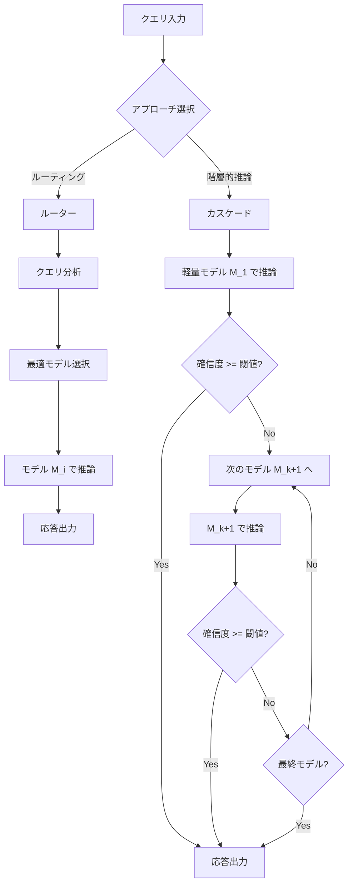

本記事は [arXiv:2506.06579](https://arxiv.org/abs/2506.06579) の解説記事です。

## 論文概要（Abstract）

本論文は、LLM推論における計算コスト・エネルギー消費・レイテンシの課題に対し、マルチLLMインテリジェントモデル選択の2大アプローチ――**ルーティング**と**階層的推論（Hierarchical Inference / カスケーディング）**――を体系的に特徴化・比較する。ルーティングはクエリ特性に基づいて最適なモデルを事前選択し、階層的推論は軽量モデルから順に試行して確信度が閾値を超えた時点で停止する。著者らは統一評価指標 Inference Efficiency Score（IES）を提案し、リソース制約環境でのデプロイメントに向けた実践的ガイドラインを提示している。

この記事は [Zenn記事: Portkey AI Gatewayで複数LLMを統合管理する実践ガイド](https://zenn.dev/0h_n0/articles/eeae51b7540bcf) の深掘りです。

## 情報源

- **arXiv ID**: 2506.06579
- **URL**: [https://arxiv.org/abs/2506.06579](https://arxiv.org/abs/2506.06579)
- **著者**: Adarsh Prasad Behera, Jaya Prakash Champati, Roberto Morabito, Sasu Tarkoma, James Gross
- **投稿日**: 2025年6月6日
- **分野**: cs.LG, cs.AI, cs.CL, cs.DC
- **ライセンス**: CC BY-NC-ND 4.0

## 背景と動機（Background & Motivation）

LLMの推論は膨大な計算リソースを必要とする。GPT-4やClaude 3のような大規模モデルは高い推論精度を示す一方で、パラメータ数に比例してFLOPs・メモリ・エネルギー消費・API課金が増大する。著者らはリソース制約を以下の7次元で整理している。

1. **計算制約**: エッジデバイスはGPU/TPUを欠く場合が多い
2. **メモリ制約**: モデル重み＋中間活性化がデバイス容量を超過
3. **エネルギー制約**: モバイル・IoTでのバッテリー枯渇
4. **レイテンシ制約**: リアルタイム応答が求められるユースケース
5. **金銭的制約**: クラウドAPIの従量課金
6. **スケーラビリティ制約**: 多ユーザー・高スループット環境
7. **モダリティ制約**: テキスト以外（画像・音声）への対応

一方、Llama 3.2（7B/11B）、Phi-3、Mistral 7Bなどの小規模言語モデル（SLM）はリソース効率が高いが、深い推論や長文脈理解では大規模モデルに劣る。この「大規模モデルの精度」と「小規模モデルの効率」のギャップを埋めるのがマルチLLMインテリジェントモデル選択戦略であり、本論文はその2大アプローチを体系的に分析している。

## 主要な貢献（Key Contributions）

著者らは以下の4点を主要な貢献として挙げている。

- **貢献1**: ルーティングと階層的推論の**デプロイメント志向の分類体系**を構築し、7次元のリソース制約との対応関係を明示
- **貢献2**: 各手法のリソース制約カバレッジを横断比較する**制約充足分析**（Constraint Coverage Analysis）を実施
- **貢献3**: 品質・応答性・コストを単一指標に統合する**Inference Efficiency Score（IES）**を提案
- **貢献4**: マルチモーダル統合、適応的ルーティング、プライバシー・セキュリティなど**5つのオープンチャレンジ**を特定

## 技術的詳細（Technical Details）

### 推論コストの定式化

著者らはモデル $M_k$ に対する総推論コストを以下のように定式化している。

$$
C(M_k) = C_{\text{compute}} + C_{\text{memory}} + C_{\text{energy}} + C_{\text{latency}} + C_{\text{financial}} + C_{\text{scalability}} + C_{\text{modality}}
$$

各コスト成分は以下の通りである。

$$
C_{\text{compute}}(M_k) = \beta_k \cdot \text{FLOPs}(M_k)
$$

$$
C_{\text{energy}}(M_k) = \delta_k \cdot P_k \cdot T_k
$$

$$
C_{\text{financial}}(M_k) = \mu_k \cdot \text{API\_Cost}(M_k)
$$

ここで $\beta_k, \delta_k, \mu_k$ は各モデル固有の重み係数、$P_k$ は消費電力、$T_k$ は推論時間である。この多次元コストモデルにより、単純なAPI課金だけでなく、エッジデプロイメントにおけるエネルギー・レイテンシ制約も統一的に扱える。

### ルーティングの定式化と代表手法

ルーティングはクエリ $q$ を受け取り、利用可能なモデル集合 $\mathcal{M} = \{M_1, M_2, \ldots, M_n\}$ から最適なモデルを選択する関数として定義される。

$$
R(q) \rightarrow M_i \in \mathcal{M}
$$

ルーティング関数 $R$ はクエリの複雑度、精度要件、レイテンシ制約に基づいてモデルを割り当てる。推論はモデル呼び出し1回のみで完了するため、レイテンシが予測しやすいという利点がある。ただし、ルーター自体の推論オーバーヘッドが発生する。

著者らが分析した代表的なルーティング手法を以下に示す。

| 手法 | 戦略 | 主な特徴 |
|------|------|----------|
| **Tryage** | Q学習による性能予測 | モデル固有の損失を教師あり学習で予測 |
| **ZOOTER** | 報酬蒸留 | 既製の報酬モデルでルーティングをガイド |
| **FORC** | メタモデルによるコスト・性能予測 | モデル呼び出しなしで性能を予測 |
| **Routoo** | LLMベースの予測器 | 数千のオープンソースモデルに対応 |
| **HybridLLM** | 品質認識型選択 | BERTエンコーダ＋BARTScore評価 |
| **OptLLM** | 多目的最適化 | ランダムフォレストで精度vsコストを予測 |
| **MetaLLM** | 多腕バンディット（MAB） | 網羅的探索なしで性能・コストを均衡 |
| **RouteLLM** | 選好ベース＋類似度重み付きランキング | 学習不要の類似度計算でルーティング |

### カスケーディング/階層的推論の定式化と代表手法

階層的推論では、モデルをコスト順（昇順）に並べた系列 $M_1, M_2, \ldots, M_n$（$C(M_1) \leq C(M_2) \leq \cdots \leq C(M_n)$）を使用する。クエリ $q$ をまず最軽量のモデル $M_1$ に投入し、応答の確信度 $\text{conf}(\cdot)$ が閾値 $\tau$ を超えるかどうかで停止判定を行う。

$$
\text{conf}(M_k(q)) \geq \tau \implies \text{stop at } M_k
$$

確信度が閾値未満の場合のみ、次のモデル $M_{k+1}$ にエスカレートする。最悪ケースでは全モデルを順に呼び出すことになるが、大半のクエリが軽量モデルで処理されるため、平均コストは大幅に削減される。

| 手法 | メカニズム | コスト削減効果 |
|------|------------|----------------|
| **FrugalGPT** | カスケーディング＋プロンプト適応＋キャッシュ | 最大98%のコスト削減 |
| **EcoAssistant** | ユーザーフィードバック＋実行チェック | 50%コスト削減、GPT-4比10%精度向上 |
| **Cache & Distil** | 師弟学習＋能動学習 | マージンサンプリング＋エントロピーベースのエスカレーション |
| **AutoMix** | SLM自己検証（POMDP） | ノイズの多い検証下でもロバストな選択 |
| **Efficient Hybrid Decoding** | トークンレベルの報酬スコアリング | SLMトークンをスコア化し閾値未満でエスカレート |

### ルーティング vs 階層的推論の比較



両アプローチの特性を以下の表で比較する。

| 比較軸 | ルーティング | 階層的推論（カスケーディング） |
|--------|-------------|-------------------------------|
| **意思決定タイミング** | 事前（クエリ分析後） | 事後（応答の確信度評価後） |
| **モデル呼び出し回数** | 1回（＋ルーターのオーバーヘッド） | 1〜N回（確信度に依存） |
| **レイテンシ特性** | 予測可能（一定） | 可変（最悪ケースで全モデル呼び出し） |
| **コスト削減メカニズム** | 不必要に大きなモデルの回避 | 大半のクエリを軽量モデルで処理 |
| **追加コンポーネント** | ルーターモデルの学習・推論 | 確信度推定器 |
| **リアルタイム適性** | 高い（レイテンシ一定） | 制約あり（エスカレーション時に遅延） |
| **代表手法** | RouteLLM, MetaLLM, FORC | FrugalGPT, AutoMix, EcoAssistant |

### 計算量・レイテンシ分析

ルーティングの総レイテンシは以下で概算される。

$$
L_{\text{route}} = L_{\text{router}} + L_{M_i}
$$

ここで $L_{\text{router}}$ はルーター自体の推論時間、$L_{M_i}$ は選択されたモデルの推論時間である。ルーターにBERTクラスの軽量モデルを使用する場合、$L_{\text{router}}$ はミリ秒オーダーに抑えられる。

一方、階層的推論のレイテンシは確率的に変動する。

$$
L_{\text{cascade}} = \sum_{k=1}^{K} L_{M_k}
$$

ここで $K$ は実際にモデルが呼び出された段数（$1 \leq K \leq n$）である。平均的には $K$ は小さいが、最悪ケースでは $K = n$ となり、全モデルの推論時間の合計がレイテンシとなる。

### Inference Efficiency Score（IES）

著者らは品質と効率のトレードオフを統一的に評価する指標として IES を提案している。

$$
\text{IES}(q) = \frac{\alpha \cdot Q(q) + (1 - \alpha) \cdot R(q)}{C(M_k)}
$$

ここで、
- $Q(q)$: タスク固有の品質指標（精度、BLEU、ROUGEなど）
- $R(q)$: 応答性指標（Time-to-First-Token、エスカレーション深度など）
- $\alpha \in [0, 1]$: 品質と応答性のトレードオフを制御するパラメータ
- $C(M_k)$: 前述の多次元推論コスト

$\alpha$ を調整することで、精度重視（$\alpha \to 1$）からレイテンシ重視（$\alpha \to 0$）まで柔軟に評価基準を切り替えられる。

## 実装のポイント（Implementation Insights）

以下に、ルーティングとカスケーディングの概念を示す擬似コードを示す。

### ルーターの擬似実装

```python
from dataclasses import dataclass
from typing import Protocol


@dataclass(frozen=True)
class Query:
    text: str
    max_latency_ms: float | None = None
    max_cost: float | None = None


@dataclass(frozen=True)
class ModelSpec:
    name: str
    cost_per_token: float
    avg_latency_ms: float
    capability_score: float  # ベンチマーク平均精度


class Router(Protocol):
    """ルーティング関数 R(q) -> M_i の抽象インターフェース."""

    def select_model(
        self, query: Query, candidates: list[ModelSpec]
    ) -> ModelSpec: ...


class CostAwareRouter:
    """コスト・品質トレードオフを考慮したルーター."""

    def __init__(self, quality_weight: float = 0.7) -> None:
        self._alpha = quality_weight

    def _estimate_complexity(self, query: Query) -> float:
        """クエリ複雑度を [0, 1] で推定（簡易版）."""
        word_count = len(query.text.split())
        return min(word_count / 200.0, 1.0)

    def select_model(
        self, query: Query, candidates: list[ModelSpec]
    ) -> ModelSpec:
        complexity = self._estimate_complexity(query)
        best_model: ModelSpec | None = None
        best_score = -float("inf")

        for model in candidates:
            # IES風のスコア: 品質と効率の加重和
            quality = model.capability_score * complexity
            efficiency = 1.0 / (1.0 + model.cost_per_token)
            score = self._alpha * quality + (1 - self._alpha) * efficiency

            # レイテンシ制約チェック
            if query.max_latency_ms and model.avg_latency_ms > query.max_latency_ms:
                continue
            if query.max_cost and model.cost_per_token > query.max_cost:
                continue

            if score > best_score:
                best_score = score
                best_model = model

        if best_model is None:
            # フォールバック: 最安モデルを選択
            return min(candidates, key=lambda m: m.cost_per_token)
        return best_model
```

### カスケードの擬似実装

```python
from dataclasses import dataclass
from typing import Protocol


@dataclass(frozen=True)
class InferenceResult:
    text: str
    confidence: float  # [0, 1]
    model_name: str
    cost: float
    latency_ms: float


class LLMClient(Protocol):
    """LLM推論クライアントの抽象インターフェース."""

    def infer(self, query: str) -> InferenceResult: ...


class CascadeInference:
    """階層的推論: 確信度ベースのエスカレーション."""

    def __init__(
        self,
        models: list[LLMClient],
        confidence_threshold: float = 0.85,
    ) -> None:
        # models はコスト昇順にソート済みと仮定
        self._models = models
        self._tau = confidence_threshold

    def run(self, query: str) -> InferenceResult:
        """
        軽量モデルから順に推論し、確信度が閾値以上なら停止.

        conf(M_k(q)) >= tau => stop at M_k
        """
        total_cost = 0.0
        total_latency = 0.0

        for model in self._models:
            result = model.infer(query)
            total_cost += result.cost
            total_latency += result.latency_ms

            if result.confidence >= self._tau:
                return InferenceResult(
                    text=result.text,
                    confidence=result.confidence,
                    model_name=result.model_name,
                    cost=total_cost,
                    latency_ms=total_latency,
                )

        # 最終モデルの結果を返す（閾値未達でも）
        return InferenceResult(
            text=result.text,
            confidence=result.confidence,
            model_name=f"cascade-final({result.model_name})",
            cost=total_cost,
            latency_ms=total_latency,
        )
```

## 実験結果（Experimental Results）

### ベンチマークと評価基盤

著者らは既存のベンチマークを以下の3つに整理している。

| ベンチマーク | 対象 | 規模 | 主要指標 |
|-------------|------|------|----------|
| **MixInstruct** | 指示追従タスク | 11モデル、多様なプロンプト | BARTScore |
| **RouterBench** | ルーティングシステム全般 | 405K+の推論出力（11 LLM, 7タスク） | レイテンシ、精度、コスト、品質 |
| **RouterEval** | ルーティング判定の正確性 | 200M+のパフォーマンスレコード（8,500+ LLM） | ルーティング判定品質 |

### 制約カバレッジ分析

著者らは各手法が7次元のリソース制約をどの程度カバーしているかを体系的に分析している。主な知見は以下の通りである。

- **FrugalGPT**が最も広範なカバレッジを示し、計算・メモリ・エネルギー・レイテンシ・金銭的コスト・スケーラビリティの6次元をカバー
- **FORC, HybridLLM, RouteLLM**は5〜6次元で強いカバレッジを持つ
- **モダリティ制約**はいずれの手法もカバーしておらず、マルチモーダルルーティングは未開拓領域

### 実運用での報告値

著者らが引用している実運用データとして、IBM Researchがハイブリッドルーティングにより「クエリあたり5セントの削減」を達成し、「GPT-4性能の約90%を維持しつつ75%のコスト削減」を実現したと報告されている。また、RouteLLMは2倍以上のコスト削減を達成しながら95%以上の品質を維持すると報告されている。

## 実運用への応用（Practical Applications）

### Portkeyとの対応関係

本論文の2大アプローチは、[Zenn記事](https://zenn.dev/0h_n0/articles/eeae51b7540bcf)で解説されているPortkey AI Gatewayの機能と以下のように対応する。

| 論文の概念 | Portkeyの機能 | 説明 |
|-----------|--------------|------|
| ルーティング $R(q) \to M_i$ | `loadbalance` / `conditional` | クエリ特性に基づいてモデルを事前選択 |
| 階層的推論 / カスケーディング | `fallback` | 軽量モデル失敗時に上位モデルへエスカレート |
| 推論コスト $C(M_k)$ | Virtual Keys + Usage Analytics | モデル別のコスト・レイテンシ計測 |
| IES指標 | Guardrails + Analytics | 品質・コストのモニタリングと閾値ベースの制御 |

Portkeyの `fallback` 設定は本論文のカスケーディングそのものであり、エラー発生時やタイムアウト時に次のプロバイダへ自動エスカレートする。一方、`conditional` ルーティングはクエリのメタデータに基づくルールベースのモデル選択であり、本論文のルーティングアプローチに対応する。

### エッジ vs クラウドでの使い分け

著者らの分析に基づくワークロード別の推奨戦略を整理すると以下のようになる。

| 環境 | 推奨アプローチ | 理由 |
|------|---------------|------|
| **エッジ / モバイル** | ルーティング | レイテンシ一定、エネルギー消費予測可能 |
| **クラウド（コスト最適化）** | 階層的推論 | 平均コスト大幅削減、レイテンシ変動は許容可能 |
| **リアルタイムAPI** | ルーティング | SLA遵守のためレイテンシ保証が必要 |
| **バッチ処理** | 階層的推論 | レイテンシ制約が緩く、コスト削減効果が大きい |
| **ハイブリッド** | 両方の組み合わせ | ルーティングで大分類→各クラス内でカスケード |

## 関連研究（Related Work）

本論文が分析対象としている代表的な関連研究を以下に示す。

- **RouteLLM** (Ong et al.): 選好データに基づくルーティングフレームワーク。類似度重み付きランキングにより学習不要でルーティングを実現し、2倍以上のコスト削減と95%以上の品質維持を報告
- **FrugalGPT** (Chen et al.): カスケーディング＋プロンプト適応＋LLM近似キャッシュを組み合わせた手法。最大98%のコスト削減を達成し、本分野の制約カバレッジが最も広範
- **AutoMix** (Madaan et al.): SLMの自己検証をPOMDP（部分観測マルコフ決定過程）として定式化し、ノイズの多い確信度推定下でもロバストなモデル選択を実現
- **GreenServ**: エネルギー効率を考慮したコンテキストアウェアなルーティング。エッジデプロイメントにおけるエネルギー制約を明示的に最適化対象とする
- **RouterBench** (Hu et al.): 405K+のプリコンピュートされた推論出力（11 LLM、7タスク）を含むベンチマークスイート。ルーティングシステムの再現可能な評価を支援
- **RouterEval**: 200M+のパフォーマンスレコード（8,500+ LLM）に基づくルーティング判定品質の評価フレームワーク

## まとめ

本論文は、マルチLLM推論におけるルーティングと階層的推論の2大アプローチを7次元のリソース制約の観点から体系的に比較・分析した。主な知見は以下の通りである。

1. **ルーティング**はレイテンシの予測可能性に優れ、リアルタイム・エッジ環境に適する。ルーター自体の学習コストとオーバーヘッドが課題となる
2. **階層的推論**は平均コスト削減効果が大きく（FrugalGPTで最大98%）、コスト重視のクラウド環境やバッチ処理に適する。最悪ケースのレイテンシ増大が課題となる
3. 両アプローチは**相補的**であり、ワークロード特性に応じた使い分けが重要である。ハイブリッド戦略（ルーティングで大分類→クラス内でカスケード）も有望な方向性として示されている
4. **IES指標**は品質・応答性・コストを統一的に評価できるが、マルチモーダル対応やプライバシー考慮など未解決のオープンチャレンジが残されている

本論文の分析は、Portkeyのような実運用AI Gatewayの設計思想――`fallback`（カスケーディング）と`conditional`/`loadbalance`（ルーティング）の併用――が理論的にも妥当であることを裏付けるものである。
