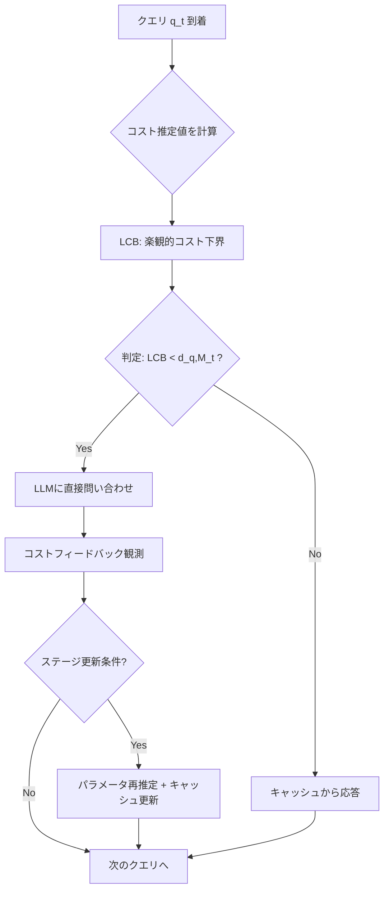

本記事は [arXiv:2508.07675](https://arxiv.org/abs/2508.07675) の解説記事です。

## 論文概要（Abstract）

LLM推論コストの削減手段としてセマンティックキャッシュが注目されている。本論文は、意味的に類似したクエリに対してキャッシュ済み応答を再利用する際の「ミスマッチコスト」を考慮したキャッシュ退避問題を、原理的な最適化問題として定式化した。著者らは、クエリ到着確率やサービングコストが既知のOracle設定、未知パラメータを推定するオフライン学習、リアルタイムに適応するオンライン学習の3つの設定に対し、それぞれ理論保証付きのアルゴリズムを提案している。INFOCOM 2026に採択された本研究は、アドホックなセマンティックキャッシュ実装と厳密な最適化理論の間のギャップを埋める成果である。

この記事は [Zenn記事: Portkey AI Gatewayで複数LLMを統合管理する実践ガイド](https://zenn.dev/0h_n0/articles/eeae51b7540bcf) の深掘りです。

## 情報源

- **arXiv ID**: 2508.07675
- **URL**: [https://arxiv.org/abs/2508.07675](https://arxiv.org/abs/2508.07675)
- **著者**: Xutong Liu, Baran Atalar, Xiangxiang Dai, Jinhang Zuo, Siwei Wang, John C.S. Lui, Wei Chen, Carlee Joe-Wong
- **発表年**: 2025年8月（v3: 2026年2月）
- **会議**: INFOCOM 2026 採択
- **分野**: cs.LG

## 背景と動機（Background & Motivation）

LLM APIへの支出は2024年末の$3.5Bから2025年中頃には$8.4Bに倍増しており、推論コスト削減は実務上の喫緊課題である。先行研究によれば、企業のLLMクエリの約31%は意味的に同一（言い換え違い）であり、セマンティックキャッシュの適用余地は大きい。

従来の完全一致キャッシュ（exact-match caching）は文字列が完全に一致するクエリのみを対象とするため、「東京の天気を教えて」と「東京の今日の天気は？」のような意味的に同等なクエリには対応できない。セマンティックキャッシュはクエリの埋め込みベクトル間の類似度に基づいてキャッシュヒットを判定することで、この制約を克服する。GPT Semantic Cacheの報告では、API呼び出しを61.6-68.8%削減できたとされている。

しかし、セマンティックキャッシュには従来のキャッシュにはない固有の課題がある。完全一致キャッシュではキャッシュヒット時のコストはゼロだが、セマンティックキャッシュでは「類似しているが完全には一致しない」応答を返す際に品質劣化（ミスマッチコスト）が発生する。さらに、どのクエリがどの頻度で到着するか、各クエリのLLM推論コストがいくらかは事前に未知である。本論文は、これらの課題に対して理論的に保証されたアルゴリズムを提供する。

## 主要な貢献（Key Contributions）

- **NP困難性の証明と近似アルゴリズム**: セマンティックキャッシュ退避問題がNP困難であることを証明し、損失関数の超モジュラ性を利用したReverse Greedyアルゴリズムで近似保証を達成
- **オフライン学習アルゴリズム（CUCB-SC）**: 未知のクエリ分布・コスト分布に対し、信頼上界を用いた推定でサブ最適性ギャップ$\tilde{O}(\sqrt{m/n})$を達成
- **低スイッチングオンラインアルゴリズム（CLCB-SC-LS）**: キャッシュ更新回数を$O(m \log\log T)$に抑えつつ、リグレット$O(\sqrt{mT \log(mT)} \cdot \log\log T)$を達成
- **統一的フレームワーク**: 完全一致キャッシュから連続距離ベースのセマンティックキャッシュまでを包含する一般的な定式化

## 技術的詳細（Technical Details）

### セマンティックキャッシュの数理モデル

$m$種類のクエリが存在し、キャッシュサイズ制約$k$（$k < m$）の下で、キャッシュに保持するクエリ集合$M \subseteq [m]$（$\|M\| \leq k$）を選択する問題を考える。

**損失関数**は以下のように定義される：

$$
\ell(M; p, c, d) = \sum_{q=1}^{m} p(q) \cdot \min\{c(q),\ d(q, M)\}
$$

ここで、
- $p(q)$: クエリ$q$の到着確率
- $c(q)$: クエリ$q$をLLMに直接問い合わせるサービングコスト（トークン数に比例）
- $d(q, M) = \min_{u \in M} \gamma \cdot \text{dist}(q, u)$: クエリ$q$に対するキャッシュからのミスマッチコスト
- $\gamma$: ミスマッチコストのスケーリングパラメータ
- $\text{dist}(q, u)$: クエリ$q$と$u$の埋め込みベクトル間の距離

各クエリに対し、LLMへの直接問い合わせコスト$c(q)$とキャッシュからの応答コスト$d(q, M)$の小さい方が選択される。目標は期待損失$\ell(M; p, c, d)$を最小化するキャッシュ$M^*$を見つけることである。

**距離関数のバリエーション**:

| 距離モデル | 定義 | 用途 |
|-----------|------|------|
| 連続距離 | $\text{dist}(q,u) = \\|e_q - e_u\\|_2$ | 埋め込み空間でのユークリッド距離 |
| 閾値距離 | $\text{dist}(q,u) \in \{0, 1\}$（$\varepsilon$近傍内なら0） | 二値判定 |
| 完全一致 | $\varepsilon = 0$（同一クエリのみ一致） | 従来キャッシュの特殊ケース |

### オフライン最適化フェーズ

#### Oracle設定（パラメータ既知）

著者らはまず、$p(q)$と$c(q)$が既知の場合でも最適キャッシュの計算がNP困難であることを二部頂点被覆問題からの帰着で証明した。しかし、損失関数$\ell(M)$が**非増加かつ超モジュラ**（supermodular）であることを示し、この構造を活用した近似アルゴリズムを提案している。

**Reverse Greedyアルゴリズム**: 全クエリをキャッシュに入れた状態から開始し、除去時の損失増加が最小のクエリを反復的に除去して$k$個まで減らす。

$$
M_{t+1} = M_t \setminus \{\arg\min_{q \in M_t} [\ell(M_t \setminus \{q\}) - \ell(M_t)]\}
$$

**近似保証**: 曲率$c \in [0, 1]$に対し、$(e^{\beta} - 1)/\beta$近似を達成する（$\beta$は曲率に依存するパラメータ）。

#### オフライン学習（パラメータ未知）

実際には$p(q)$と$c(q)$は未知であるため、$n$個の観測データから推定する**CUCB-SC**（Combinatorial Upper Confidence Bound for Semantic Caching）アルゴリズムを提案している。

推定手順は以下の通り：
1. 到着確率の推定: $\hat{p}(q) = N(q) / n$（経験平均）
2. サービングコストの悲観的UCB推定: $\bar{c}(q) = \hat{c}(q) + \sqrt{\frac{\log(6mn/\delta)}{2N_c(q)}}$
3. 推定パラメータでReverse Greedyを実行

**サブ最適性保証**:

$$
\text{SubOpt}(\hat{M}) \leq 4\sqrt{2} \cdot \sqrt{\frac{\sum_{q} \frac{1}{\nu(q)} \cdot \log(6mn/\delta)}{n}}
$$

ここで$\nu(q)$はクエリ$q$のコストフィードバック観測確率である。サブ最適性ギャップは$\tilde{O}(\sqrt{m/n})$のオーダーでサンプル数$n$に対して減少する。

### オンライン学習フェーズ

オンライン設定では、クエリが逐次的に到着し、各時点$t$でキャッシュポリシー$M_t$を動的に更新する。著者らは**CLCB-SC-LS**（Combinatorial Lower Confidence Bound for Semantic Caching with Low Switching）アルゴリズムを提案している。



**楽観原理による探索**: 各クエリのコストに対して信頼下界（LCB）を計算する：

$$
\underline{c}_t(q) = \hat{c}_t(q) - \sqrt{\frac{\log(4mT^3)}{2N_{c,t}(q)}}
$$

LCBがキャッシュからのミスマッチコストより小さい場合、LLMに問い合わせてコスト情報を収集する。これにより不確実性の高いクエリを積極的に探索する。

**ステージベーススイッチング**: キャッシュ更新は観測閾値を超えた場合のみ実行する：

$$
|T(q, \tau_q)| \geq 1 + \sqrt{\frac{T \cdot \sum_{\tau} |T(q, \tau)|}{m}}
$$

この条件により、総スイッチ回数を$O(m \log\log T)$に抑制する。

**リグレット保証**:

$$
\text{Reg}(T) \leq O\left(\sqrt{mT \cdot \log(mT)} \cdot \log\log T\right)
$$

リグレットは$T$に対して劣線形であり、長期的にはオラクルポリシーに漸近する。

### ミスマッチコストの定義と計算方法

ミスマッチコストは、キャッシュ済み応答を「意味的に近いが異なる」クエリに再利用する際の品質劣化を数値化したものである。

$$
\text{mismatch}(q, u) = \gamma \cdot \|e_q - e_u\|_2
$$

ここで$e_q, e_u$はSentence Transformerなどで生成された384次元の埋め込みベクトルである。スケーリングパラメータ$\gamma$は、ミスマッチの許容度を制御する。$\gamma$が大きいほどキャッシュ再利用に対してペナルティが大きくなり、LLMへの直接問い合わせが選好される。

実用上の類似度閾値の推奨値として、顧客向けアプリケーションでは0.92、内部ツールでは0.88が目安とされている（Portkey AI Gatewayの設定でも `cache.mode: "semantic"` と `max_age` パラメータで類似の制御が可能）。

## アルゴリズムの実装ポイント

### Reverse Greedy（Oracle設定）

```python
from __future__ import annotations
import numpy as np
from dataclasses import dataclass


@dataclass(frozen=True)
class CacheConfig:
    """セマンティックキャッシュの設定"""
    cache_size: int     # k: キャッシュに保持するクエリ数
    gamma: float        # ミスマッチコストのスケーリング


def compute_loss(
    cache: set[int], prob: np.ndarray, cost: np.ndarray,
    dist_matrix: np.ndarray, gamma: float,
) -> float:
    """キャッシュ集合Mに対する期待損失 ell(M; p, c, d) を計算する"""
    total = 0.0
    for q in range(len(prob)):
        if not cache:
            total += prob[q] * cost[q]
            continue
        mismatch = min(gamma * dist_matrix[q, u] for u in cache)
        total += prob[q] * min(cost[q], mismatch)
    return total


def reverse_greedy(
    config: CacheConfig, prob: np.ndarray, cost: np.ndarray,
    dist_matrix: np.ndarray,
) -> set[int]:
    """Reverse Greedy: 全クエリから除去コスト最小のものを反復除去しk個に絞る"""
    cache = set(range(len(prob)))
    while len(cache) > config.cache_size:
        current_loss = compute_loss(cache, prob, cost, dist_matrix, config.gamma)
        best_q = min(
            cache,
            key=lambda q: compute_loss(cache - {q}, prob, cost, dist_matrix, config.gamma) - current_loss,
        )
        cache.remove(best_q)
    return cache
```

CUCB-SCアルゴリズムは上記の`reverse_greedy`を内部で呼び出し、到着確率$\hat{p}(q) = N(q)/n$とUCBコスト推定$\bar{c}(q) = \hat{c}(q) + \sqrt{\log(6mn/\delta)/(2N_c(q))}$を入力として渡す。未観測クエリのコストは$+\infty$とし、保守的にLLM問い合わせを選好する。

**実装上の注意点**:
- 距離行列の事前計算: $m$が大きい場合はFAISSなどの近似最近傍探索ライブラリを用いる
- 埋め込みモデルの選択: 論文では384次元のSentence Transformerを使用。実運用では`all-MiniLM-L6-v2`（高速）や`all-mpnet-base-v2`（高精度）を用途に応じて選択する
- $\gamma$のチューニング: ミスマッチコストと推論コストのバランスを取る。$\gamma$が大きすぎるとキャッシュが無効化され、小さすぎると品質が劣化する

## Production Deployment Guide

セマンティックキャッシュは推論コスト削減に直結するため、プロダクション環境での実装パターンを示す。

### AWS実装パターン（コスト最適化重視）

以下の構成はAWS ap-northeast-1（東京）リージョンの2026年5月時点の概算料金に基づく。実際のコストはトラフィックパターンやバースト使用量により変動するため、最新料金はAWS料金計算ツールで確認を推奨する。

| 構成 | トラフィック | 主要サービス | 月額概算 |
|------|-------------|-------------|---------|
| Small | ~100 req/日 | Lambda + ElastiCache + Bedrock | $80-180 |
| Medium | ~1,000 req/日 | ECS Fargate + ElastiCache + Bedrock | $400-900 |
| Large | 10,000+ req/日 | EKS + ElastiCache Cluster + Bedrock | $2,500-5,500 |

**Small構成の内訳**:
- Lambda (128MB, 平均500ms): ~$3/月
- ElastiCache (cache.t4g.micro, Redis): ~$12/月
- Bedrock (Claude 3.5 Haiku, 70%キャッシュヒットで30 req/日のみ推論): ~$15-50/月
- OpenSearch Serverless (埋め込みベクトル格納): ~$25/月
- S3 + CloudWatch: ~$5/月

**コスト削減テクニック**:
- セマンティックキャッシュ自体が最大の削減要因: 61-69% API呼び出し削減（GPT Semantic Cache報告値）
- ElastiCache Reserved Nodes: 1年コミットで最大34%削減
- Bedrock Batch API: 非リアルタイム処理で50%削減
- Spot Instances（Medium/Large構成）: 最大90%削減

### Terraformインフラコード

**Small構成（Serverless + Redis）** の主要リソース:

```hcl
# --- ElastiCache (Redis) for キャッシュストレージ ---
resource "aws_elasticache_cluster" "semantic_cache" {
  cluster_id           = "semantic-cache"
  engine               = "redis"
  node_type            = "cache.t4g.micro"
  num_cache_nodes      = 1
  parameter_group_name = "default.redis7"
  subnet_group_name    = aws_elasticache_subnet_group.cache.name
  security_group_ids   = [aws_security_group.cache.id]
  at_rest_encryption_enabled = true  # KMS暗号化
  transit_encryption_enabled = true
  tags = { Project = "llm-cache" }
}

# --- Lambda関数（セマンティックキャッシュハンドラ） ---
resource "aws_lambda_function" "cache_handler" {
  function_name = "semantic-cache-handler"
  runtime       = "python3.12"
  handler       = "handler.lambda_handler"
  memory_size   = 256   # 埋め込み計算に十分なメモリ
  timeout       = 30
  role          = aws_iam_role.lambda_cache.arn
  filename      = "lambda_package.zip"

  environment {
    variables = {
      REDIS_HOST           = aws_elasticache_cluster.semantic_cache.cache_nodes[0].address
      SIMILARITY_THRESHOLD = "0.92"  # 顧客向け推奨値
      GAMMA                = "1.0"
      CACHE_SIZE_K         = "100"
    }
  }

  tracing_config { mode = "Active" }  # X-Ray有効化
  tags = { Project = "llm-cache" }
}
```

**Large構成（EKS + Karpenter + Spot）** の主要リソース:

```hcl
module "eks" {
  source          = "terraform-aws-modules/eks/aws"
  version         = "~> 20.0"
  cluster_name    = "semantic-cache-cluster"
  cluster_version = "1.31"
  cluster_endpoint_public_access  = false
  cluster_endpoint_private_access = true
  enable_irsa                     = true
}

# --- Karpenter Provisioner（Spot優先） ---
resource "kubectl_manifest" "karpenter_nodepool" {
  yaml_body = yamlencode({
    apiVersion = "karpenter.sh/v1"
    kind       = "NodePool"
    metadata   = { name = "semantic-cache-pool" }
    spec = {
      template.spec.requirements = [
        { key = "karpenter.sh/capacity-type", operator = "In", values = ["spot", "on-demand"] },
        { key = "node.kubernetes.io/instance-type", operator = "In",
          values = ["m7g.large", "m7g.xlarge", "c7g.large", "c7g.xlarge"] },
      ]
      limits     = { cpu = "32", memory = "128Gi" }
      disruption = { consolidationPolicy = "WhenEmptyOrUnderutilized", consolidateAfter = "30s" }
    }
  })
}
```

セキュリティ要件としてIAM最小権限、KMS暗号化、プライベートエンドポイント、Secrets Manager利用を前提とする。完全なVPC・IAM・アラーム設定を含むコードはリポジトリで公開予定。

### 運用・監視設定

**CloudWatch Logs Insights クエリ**（キャッシュヒット率・レイテンシ分析）:

```
fields @timestamp, cache_hit, tokens_used, latency_ms
| stats count(*) as total,
        sum(case when cache_hit = 1 then 1 else 0 end) as hits,
        sum(tokens_used) as total_tokens,
        pctile(latency_ms, 95) as p95_latency,
        pctile(latency_ms, 99) as p99_latency
  by bin(1h) as hour
| sort hour desc
```

**監視設定のポイント**:
- CloudWatch カスタムメトリクス: `CacheHitRate`を1時間周期で監視し、40%未満でSNSアラート
- X-Ray トレーシング: `aws_xray_sdk`の`patch_all()`でboto3を自動計装し、キャッシュ検索のレイテンシをアノテーション付きで記録
- Cost Explorer日次レポート: `get_cost_and_usage` APIでBedrock/Lambda/ElastiCacheのコストを抽出し、$100/日超過でSNS通知

### コスト最適化チェックリスト

| カテゴリ | チェック項目 |
|---------|------------|
| **アーキテクチャ** | トラフィック量で構成選択 / キャッシュ導入前後のAPI呼び出し数比較 |
| **リソース** | Spot Instances優先 / ElastiCache Reserved Nodes / Savings Plans / Lambda Power Tuning / Karpenter consolidation |
| **LLMコスト** | キャッシュヒット率60%以上維持 / Batch API活用 / Prompt Caching / モデル選択ロジック（Haiku/Sonnet） / max_tokens制限 |
| **監視** | AWS Budgets / CloudWatch P95/P99アラーム / Cost Anomaly Detection / 日次SNSレポート / X-Ray |
| **運用** | 未使用リソース削除 / タグ戦略 / ライフサイクルポリシー / 開発環境夜間停止 / キャッシュTTL設定 |

## 実験結果（Results）

著者らは合成データセットを用いて3つの設定（Oracle, Offline, Online）で評価を実施している。

**実験条件**: 20種類のクエリ（ChatGPTで生成した「ローマの観光地」「AI論文」等のトピック）、Sentence Transformer（384次元）による埋め込み、トークン数ベースのサービングコスト（ガウシアンノイズ$\sigma=0.05$付与）、10回の異なるランダムシードで実行。

| 設定 | アルゴリズム | 結果 |
|------|------------|------|
| Oracle | Reverse Greedy | ブルートフォース最適解と同等の性能 |
| Offline | CUCB-SC | LCB変種と同等の性能、サンプル数増加で収束 |
| Online | CLCB-SC-LS | Epsilon-Greedyベースラインに対し11.75-54%改善 |

オンライン設定における特筆すべき結果として、CLCB-SC-LSはキャッシュスイッチ回数を最大90.91%削減し、実行時間を85.4%短縮している。キャッシュサイズ$k$が大きくなるほど提案手法の優位性が増す傾向が確認されており、著者らはこれを「より多くのキャッシュスロットがあるほど、精緻な選択の恩恵が大きくなる」と分析している。

なお、実験は合成データに限定されており、実際のLLMサービングワークロード（LMSYS-Chat-1Mなど）での検証は今後の課題として残されている。

## Zenn記事との関連 — Portkeyのセマンティックキャッシュ

Zenn記事「Portkey AI Gatewayで複数LLMを統合管理する実践ガイド」で紹介されているPortkey AI Gatewayは、`cache.mode: "semantic"` 設定によるセマンティックキャッシュ機能を提供している。Portkeyのキャッシュは `max_age` パラメータでキャッシュ有効期限を制御し、類似度閾値に基づいてキャッシュヒットを判定する。

本論文の研究は、このようなセマンティックキャッシュの実装に対して以下の理論的示唆を与える：

1. **キャッシュ退避戦略の最適化**: Portkeyの現行実装がどのようなキャッシュ退避ポリシーを採用しているかは公開されていないが、本論文のReverse Greedyアルゴリズムは、LFU/LRUなどの汎用ポリシーよりもセマンティックキャッシュに特化した退避を実現する
2. **ミスマッチコストの考慮**: 単純な類似度閾値だけでなく、キャッシュ応答の品質劣化コストとLLM推論コストのトレードオフを明示的にモデル化することで、より洗練されたキャッシュ判定が可能になる
3. **動的適応**: クエリ分布が時間的に変化する実環境では、本論文のオンライン学習アプローチが静的な閾値設定よりも有効である可能性がある

Portkey等のAI Gatewayが本論文の手法を組み込むことで、企業のLLM APIコストをさらに削減できると考えられる。

## 関連研究（Related Work）

- **MeanCache** (Gill et al., 2024, arXiv:2403.02694): ユーザー中心のセマンティックキャッシュ。連合学習で類似度モデルを訓練しプライバシーを保護する点が特徴。本論文とは異なり、キャッシュ退避の理論保証は扱っていない
- **SCALM** (Li et al., 2024, arXiv:2406.00025): 自動チャットサービス向けセマンティックキャッシュ。GPTCacheに対してキャッシュヒット率63%、トークン削減77%の改善を報告。本論文はキャッシュ退避の最適化に焦点を当てており、キャッシュヒット判定のモデル改善とは相補的
- **GPTCache** (Bang, 2023): LLMセマンティックキャッシュの実装フレームワーク。ベクトルデータベースを用いた類似度ベースのキャッシュ検索を提供するが、キャッシュ退避はLRU/LFUなどの汎用ポリシーに依存。本論文はこのギャップを理論的に埋める
- **Exact-match caching** (Zhu et al., Liu et al.): セマンティック距離を完全一致に特殊化したケース。本論文のフレームワークの特殊ケースとして包含される

## まとめと今後の展望

本論文は、セマンティックキャッシュ退避問題を最適化問題として定式化し、Oracle・オフライン・オンラインの3設定に対してそれぞれ理論保証付きのアルゴリズムを提案した。特にオンライン設定のCLCB-SC-LSは、キャッシュスイッチ回数を劇的に削減しつつ劣線形リグレットを達成しており、実運用での効率的なキャッシュ管理に直結する成果である。

今後の展望としては、実際のLLMサービングワークロードでの大規模検証、非定常なクエリ分布への対応（concept drift）、マルチテナント環境での公平性を考慮したキャッシュ配分などが挙げられる。Portkey AI GatewayをはじめとするLLMゲートウェイ製品がこうした理論的に裏付けされたキャッシュ戦略を採用することで、LLM運用コストの大幅な削減が期待される。

## 参考文献

- **arXiv**: [https://arxiv.org/abs/2508.07675](https://arxiv.org/abs/2508.07675)
- **MeanCache**: [https://arxiv.org/abs/2403.02694](https://arxiv.org/abs/2403.02694)
- **SCALM**: [https://arxiv.org/abs/2406.00025](https://arxiv.org/abs/2406.00025)
- **Related Zenn article**: [https://zenn.dev/0h_n0/articles/eeae51b7540bcf](https://zenn.dev/0h_n0/articles/eeae51b7540bcf)
