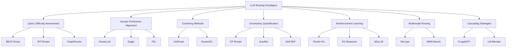
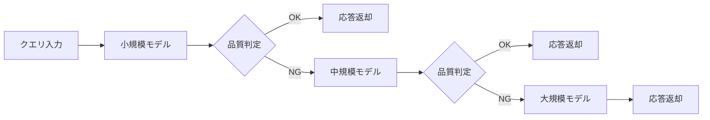
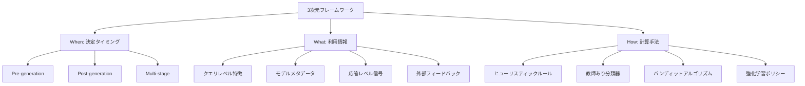

本記事は [arXiv:2603.04445](https://arxiv.org/abs/2603.04445) の解説記事です。

## 論文概要（Abstract）

LLMの急速な発展に伴い、性能・コスト・得意分野が異なる多数のモデルが利用可能になっている。静的なモデルデプロイメントではクエリの複雑さに応じた柔軟な対応ができないため、推論時にクエリ特性に基づいてモデルを動的に選択するルーティングシステムへの需要が高まっている。本サーベイは、独立に訓練された複数LLM間のルーティングおよびカスケーディング手法を体系的に分析し、7つのルーティングパラダイムに分類した上で、決定タイミング・利用情報・計算手法の3次元からなる概念フレームワークを提示している。

この記事は [Zenn記事: Portkey AI Gatewayで複数LLMを統合管理する実践ガイド](https://zenn.dev/0h_n0/articles/eeae51b7540bcf) の深掘りです。

## 情報源

- **arXiv ID**: 2603.04445
- **URL**: [https://arxiv.org/abs/2603.04445](https://arxiv.org/abs/2603.04445)
- **著者**: Yasmin Moslem, John D. Kelleher
- **発表年**: 2026（v1: 2026年2月23日、v2: 2026年4月21日改訂）
- **分野**: cs.NI, cs.CL, cs.PF
- **助成**: ADAPT Centre（Trinity College Dublin）および Huawei Ireland

## 背景と動機（Background & Motivation）

LLMの推論コストはモデルサイズに比例して増大する。GPT-4クラスの大規模モデルは高い汎用性を持つ一方で、単純なクエリに対してもフルスケールの計算リソースを消費する。著者らはこの問題に対し、「すべてのクエリに最強モデルを使う」アプローチが非効率であることを指摘している。

一方、小規模・特化型モデルは特定タスクで大規模モデルに匹敵する性能を発揮する場合がある。このモデル間の性能・コスト特性の多様性を戦略的に活用するのがルーティングシステムの基本思想である。本サーベイはMixture-of-Experts（MoE）のような単一モデル内のルーティングとは異なり、**独立に訓練・デプロイされた複数LLM間のルーティング**に焦点を当てている。この区別は実務上重要であり、AIゲートウェイ（Portkey等）が扱うのはまさにこの外部ルーティングの領域である。

## 主要な貢献（Key Contributions）

- **貢献1**: 独立訓練された複数LLM間のルーティング・カスケーディング手法を7つのパラダイムに体系的に分類
- **貢献2**: ルーティングシステムを「決定タイミング」「利用情報」「計算手法」の3次元で特徴付ける概念フレームワークの提案
- **貢献3**: 適切に設計されたルーティングシステムは、専門能力の戦略的活用により最も強力な個別モデルをも上回る性能を達成できるという知見の提示
- **貢献4**: RouterBench（405K+クエリ）やRouterEval（200M+レコード）等の評価基盤の体系的整理

## 技術的詳細（Technical Details）

### ルーティングパラダイムの分類体系

著者らは既存のルーティング手法を以下の7つのパラダイムに分類している。

### 1. Query Difficulty Assessment（クエリ難易度評価）

クエリの複雑さを事前に推定し、難易度に応じて適切なモデルを選択するアプローチである。

**代表手法**:
- **BEST-Route**: DeBERTa分類器を用いてクエリの難易度を評価し、適切なLLMに動的に割り当てる
- **IRT-Router**: 教育測定理論のItem Response Theory（IRT）を適用し、モデルの能力パラメータとクエリの難易度パラメータの相互作用をモデル化する
- **GraphRouter**: GNN（Graph Neural Network）を用いてタスク・クエリ・LLMの三者間関係を異種グラフとしてモデル化する

ルーティング決定は以下の形式で定式化される：

$$
m^* = \arg\max_{m \in \mathcal{M}} \; s(q, m)
$$

ここで、
- $q$: 入力クエリ
- $\mathcal{M}$: 利用可能なモデルの集合
- $s(q, m)$: クエリ$q$に対するモデル$m$の適合スコア
- $m^*$: 選択されるモデル

**利点**: 推論前にルーティング決定が完了するため、追加レイテンシが小さい。
**欠点**: 難易度推定器自体の訓練データが必要であり、未知のドメインへの汎化が課題。

### 2. Human Preference Alignment（人間嗜好アライメント）

人間の嗜好データ（Chatbot Arenaの投票等）やLLMジャッジの評価を利用してルーティング分類器を訓練するアプローチである。

**代表手法**:
- **RouteLLM**: Chatbot Arenaの嗜好データとLLMジャッジによる合成ラベルから、行列分解またはBERTベースのルーターを訓練する
- **Eagle**: ELOランキングシステムを基にしたトレーニング不要のルーティング
- **P2L**: プロンプト固有のBradley-Terry係数を生成し、カスタマイズされたランキングを実現

RouteLLMのルーティング関数は以下で近似される：

$$
P(\text{route to strong} \mid q) = \sigma\left(\mathbf{u}_q^T \mathbf{W} \mathbf{v}_m + b\right)
$$

ここで、
- $\mathbf{u}_q$: クエリの埋め込み
- $\mathbf{v}_m$: モデルの埋め込み
- $\mathbf{W}$: 学習された重み行列
- $b$: バイアス項
- $\sigma$: シグモイド関数

**利点**: 人間の主観的品質基準を直接反映できる。
**欠点**: 嗜好データの収集コストが高く、ドメイン固有の嗜好を捕捉するにはドメイン特化データが必要。

### 3. Clustering Methods（クラスタリング手法）

クエリの意味空間でクラスタリングを行い、各クラスタに最適なモデルを割り当てるアプローチである。

**代表手法**:
- **UniRoute**: K-meansクラスタリングで代表的なクエリクラスタを同定し、新規モデルの追加時にも再訓練が不要
- **RouterDC**: 双対対照学習によりクエリとモデルの表現を同一空間に埋め込み、最近傍探索でルーティング

**利点**: 教師なしで実装でき、新規モデルの追加が容易。
**欠点**: クラスタ数の設定が性能に影響し、クラスタ境界付近のクエリの扱いが困難。

### 4. Uncertainty Quantification（不確実性定量化）

モデル出力の不確実性（信頼度）を推定し、確信度が低い場合により強力なモデルにエスカレートするアプローチである。

**代表手法**:
- **CP-Router**: Conformal Prediction（共形予測）を用いて統計的に妥当な信頼区間を構築し、ルーティング決定の信頼性を保証する
- **AutoMix**: Few-shot自己検証とPOMDPルーターを組み合わせ、ファインチューニング不要で動作する
- **Self-REF**: モデルをファインチューニングして信頼度トークンを生成させ、ダウンストリームのルーティングに活用する

エスカレーション判定の基本形式：

$$
\text{route}(q) = \begin{cases} m_{\text{small}} & \text{if } \; c(q, m_{\text{small}}) \geq \tau \\ m_{\text{large}} & \text{otherwise} \end{cases}
$$

ここで、
- $c(q, m)$: クエリ$q$に対するモデル$m$の信頼度スコア
- $\tau$: エスカレーション閾値

**利点**: 応答品質の保証が可能であり、カスケーディングとの親和性が高い。
**欠点**: 信頼度推定自体の精度がルーティング性能のボトルネックになりうる。

### 5. Reinforcement Learning（強化学習）

ルーティング決定をRL問題として定式化し、報酬信号に基づいてルーティングポリシーを最適化するアプローチである。

**代表手法**:
- **Router-R1**: 推論（think）とルーティング（route）アクションを交互に実行するPPOベースの手法
- **R2-Reasoner**: タスクを分解し、サブタスクごとにGRPOで最適モデルを割り当て。著者らによると84.46%のAPIコスト削減を達成
- **MixLLM**: ドメイン認識型クエリ埋め込みとバイナリユーザーフィードバックを用いた文脈的バンディット
- **PILOT**: オフライン嗜好事前情報とオンラインフィードバックを予算制約下で統合
- **GreenServ**: LinUCBベースのエネルギー効率重視ルーティング。精度22%向上とエネルギー31%削減を両立

RLベースのルーティングポリシーは以下で最適化される：

$$
\pi^* = \arg\max_{\pi} \; \mathbb{E}_{\tau \sim \pi}\left[\sum_{t=0}^{T} \gamma^t r_t\right]
$$

ここで、
- $\pi$: ルーティングポリシー
- $\tau$: トラジェクトリ（クエリ列とルーティング決定の系列）
- $r_t$: 時刻$t$の報酬（品質、コスト、レイテンシ等の複合指標）
- $\gamma$: 割引率

**利点**: 複数の最適化目標（品質・コスト・レイテンシ）を統一的に扱える。
**欠点**: 訓練に大量のインタラクションデータが必要であり、報酬設計の難易度が高い。

### 6. Multimodal Routing（マルチモーダルルーティング）

テキストだけでなく、画像・音声等の複数モダリティを含むクエリに対するルーティングである。

**代表手法**:
- **ReLope**: Vision-Languageタスクにおけるルーティング最適化
- **MMR-Bench**: マルチモーダルルーティングの評価ベンチマーク

**課題**: モダリティ間の統一的な表現学習と、モダリティ固有のコストモデリングが未解決。

### 7. Cascading Strategies（カスケーディング戦略）

安価な小規模モデルから順に推論を試み、応答品質が閾値を下回った場合に次のモデルへエスカレートする逐次的アプローチである。

**代表手法**:
- **FrugalGPT**: ルーター、品質推定器（DistilBERT）、停止判定器の3コンポーネントで構成。著者らはコスト最大98%削減を報告
- **LM-Blender**: ペアワイズランキングとフュージョンによるアンサンブルアプローチ
- **AutoMix**: Few-shot自己検証による判定で、ファインチューニング不要

カスケーディングの期待コストは以下で表される：

$$
C_{\text{cascade}} = c_1 + (1 - p_1) \cdot c_2 + (1 - p_1)(1 - p_2) \cdot c_3
$$

ここで、
- $c_i$: モデル$i$の推論コスト（$c_1 < c_2 < c_3$）
- $p_i$: モデル$i$での停止確率（品質閾値を満たす確率）

停止確率$p_i$が高いほど（小規模モデルで品質を満たすクエリが多いほど）、期待コストは$c_1$に近づく。

**利点**: 実装が直感的であり、既存のモデルAPIをそのまま利用できる。
**欠点**: エスカレーション時のレイテンシ累積が問題になりうる。

### ルーティング vs カスケーディングの比較

| 特性 | ルーティング（直接選択） | カスケーディング（逐次試行） |
|------|----------------------|--------------------------|
| 決定タイミング | Pre-generation（推論前） | Multi-stage（逐次） |
| レイテンシ | 低（1回の推論） | 可変（エスカレーション回数に依存） |
| コスト効率 | クエリ難易度推定の精度に依存 | 停止確率が高ければ非常に高い |
| 実装複雑性 | ルーター訓練が必要 | 品質判定器の設計が必要 |
| 品質保証 | ルーターの精度に依存 | 最終段で最強モデルが保証 |
| 代表手法 | RouteLLM, Router-R1 | FrugalGPT, AutoMix |

### 3次元概念フレームワーク

著者らはルーティングシステムを3つの独立した次元で特徴付けている。

**When（決定タイミング）**:
- **Pre-generation**: 推論前にクエリ特徴のみでルーティング決定。レイテンシ追加が最小
- **Post-generation**: モデルの出力品質を評価してから決定。品質保証が可能だが追加推論コスト
- **Multi-stage**: カスケーディングのように逐次判定。品質とコストのバランス

**What（利用情報）**:
- **クエリレベル**: 語彙的特徴、意味的埋め込み、トピック分類
- **モデルメタデータ**: コスト、レイテンシ、専門分野、コンテキスト長
- **応答レベル**: 出力確率、信頼度スコア、自己検証結果
- **外部フィードバック**: ユーザー評価、タスク完了率

**How（計算手法）**:
- **ヒューリスティック**: 閾値ベースのルール（単純だが柔軟性に欠ける）
- **教師あり分類器**: BERT/DeBERTa等による分類（精度が高いが訓練データ必要）
- **バンディット**: LinUCB等（オンライン学習、探索と活用のバランス）
- **強化学習**: PPO/GRPO等（多目的最適化が可能だが訓練コスト高）

著者らは、プロダクション向けには3段階パイプライン（Pre-router → Post-generation verifier → Escalation policy）を提案している。FrugalGPTはこの3段階すべてを実装した代表例である。

## 実験結果（Results）

本論文はサーベイであり独自の実験は行っていないが、既存手法の報告値を体系的に整理している。

### 代表的手法のコスト・品質トレードオフ

| 手法 | 報告された成果 | 出典 |
|------|--------------|------|
| **FrugalGPT** | コスト最大98%削減、品質維持 | Chen et al., 2023 |
| **MixLLM** | GPT-4品質の97.25%を24.18%のコストで達成 | サーベイ内引用 |
| **R2-Reasoner** | APIコスト84.46%削減 | サーベイ内引用 |
| **GreenServ** | 精度22%向上 + エネルギー31%削減 | サーベイ内引用 |
| **RouteLLM** | 軽量な行列分解ルーターで競争力のある性能 | Ong et al., 2024 |

### 評価基盤

| ベンチマーク | 規模 | 特徴 |
|------------|------|------|
| **RouterBench** | 405K+クエリ、11 LLM、7タスク | 推論出力ベースの評価 |
| **RouterEval** | 200M+レコード、8,500+ LLM、12ベンチマーク | 大規模モデル性能データベース |
| **LLMRouterBench** | 400K+インスタンス、21データセット、33モデル、10ベースライン | 統一評価プロトコル |
| **MixInstruct** | 110K instruction-following例 | 嗜好監督付きデータ |

### 評価メトリクス

著者らは評価メトリクスを4カテゴリに整理している：
- **性能**: ルーティング精度、タスク性能（accuracy, exact match, pass@k, COMET）
- **効率**: レイテンシ（TTFT, TPOT）、スループット（TPS/QPS）、制約下のgoodput
- **コスト**: API課金、トークンあたりエネルギー消費、カーボンフットプリント
- **トレードオフ**: 性能-コストのPareto frontierによる可視化

## Zenn記事との関連

Zenn記事「Portkey AI Gatewayで複数LLMを統合管理する実践ガイド」では、Portkeyの3つのルーティング戦略（Fallback、LoadBalance、Conditional Routing）が紹介されている。これらは本サーベイの分類体系と以下のように対応する。

| Portkey機能 | サーベイのパラダイム | 対応手法 | 備考 |
|-------------|-------------------|---------|------|
| **Fallback** | Cascading Strategies | FrugalGPT, AutoMix | ステータスコードベースのエスカレーション。サーベイの品質推定器を導入すれば応答品質ベースのカスケーディングも実現可能 |
| **LoadBalance** | (インフラレベルの分散) | - | サーベイの範囲外だが、ルーティングの前段として機能。レート制限回避やコスト分散に有効 |
| **Conditional Routing** | Query Difficulty Assessment / Human Preference Alignment | RouteLLM, BEST-Route | メタデータ（ユーザープラン等）による条件分岐。サーベイの手法を統合すれば、クエリ内容ベースの動的ルーティングへ拡張可能 |

Zenn記事のConditional Routingの例では、`metadata.user_plan`に基づいてenterprise向けにGPT-4o、free向けにGPT-4o-miniを振り分けている。これは本サーベイの分類では静的なメタデータルーティングに相当するが、RouteLLMやRouter-R1のような手法をPortkeyのルーティングロジックに組み込むことで、クエリの意味的な複雑さに基づく動的選択へと発展させられる。

また、Portkeyのセマンティックキャッシュは、ルーティングの文脈では「同一クエリの再処理回避」としてコスト削減に寄与する。サーベイで報告されているMixLLMの97.25%品質/24.18%コストのようなトレードオフは、キャッシュとルーティングを組み合わせることでさらに改善できる可能性がある。

## 関連研究（Related Work）

- **RouteLLM (Ong et al., 2024)**: Chatbot Arenaの嗜好データから軽量ルーター（行列分解、BERT）を訓練する手法。本サーベイではHuman Preference Alignmentの代表手法として位置づけられている。Portkeyの条件付きルーティングに学習ベースのルーターを組み込む際の有力な選択肢
- **FrugalGPT (Chen et al., 2023)**: カスケーディング戦略の代表手法。ルーター・品質推定器・停止判定器の3コンポーネント構成で、コスト最大98%削減を報告。Portkeyのfallback機能に品質推定器を追加する設計の参考になる
- **Router-R1**: 推論とルーティングを交互に行うRLベース手法。PPOで最適化され、クエリの複雑さに応じた推論深度の調整が可能。サーベイではRLパラダイムの代表例として分析されている
- **RouterBench**: 405K+のクエリ-レスポンスペアを含む評価基盤。11 LLMの推論出力を含み、ルーティング手法の公平な比較を可能にする

## まとめと今後の展望

本サーベイは、LLMルーティング・カスケーディング手法を7つのパラダイムに分類し、3次元フレームワークで体系的に整理した。著者らは、適切に設計されたルーティングシステムが個別の最強モデルを上回る性能を達成しうることを複数の事例から示している。

今後の研究課題として、著者らは以下を挙げている：
1. **汎化**: 新規モデル・新規ドメインへの転移。現行手法の多くは固定のモデル集合に対して訓練されている
2. **多段カスケード**: 単一段ルーティングから、構成的なマルチモデルパイプラインへの発展
3. **マルチモーダル統合**: テキスト以外のモダリティに対する統一的なルーティング手法
4. **応答レベル信号とオンライン適応の統合**: 現行手法には、応答品質の事後評価と継続学習を組み合わせたものがない
5. **多目的最適化**: 品質・レイテンシ・コスト・安全性を統一的に最適化するフレームワーク

Portkeyのようなプロダクション向けAIゲートウェイが、これらの研究成果をどの程度取り込めるかは今後の注目点である。現時点ではメタデータベースの静的ルーティングが主流だが、サーベイで紹介されている学習ベースのルーターとの統合により、クエリ内容に基づく動的ルーティングが実用化される可能性がある。

## 参考文献

- **arXiv**: [https://arxiv.org/abs/2603.04445](https://arxiv.org/abs/2603.04445)
- **RouteLLM**: [https://arxiv.org/abs/2406.18665](https://arxiv.org/abs/2406.18665)
- **FrugalGPT**: [https://arxiv.org/abs/2305.05176](https://arxiv.org/abs/2305.05176)
- **Related Zenn article**: [https://zenn.dev/0h_n0/articles/eeae51b7540bcf](https://zenn.dev/0h_n0/articles/eeae51b7540bcf)
