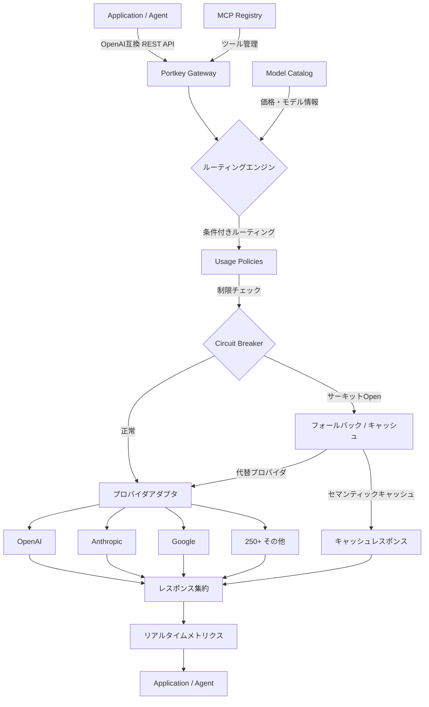
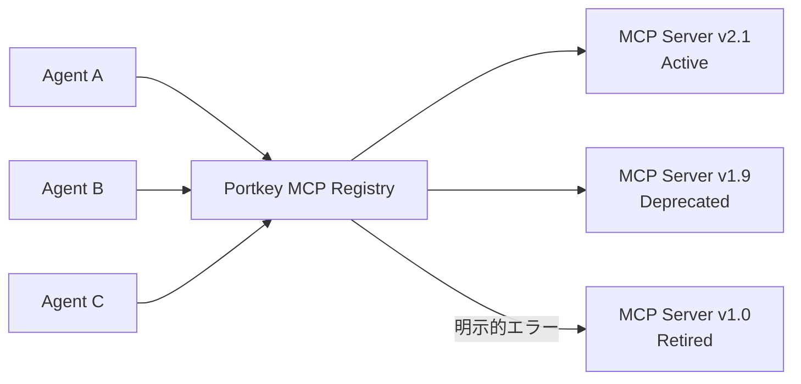
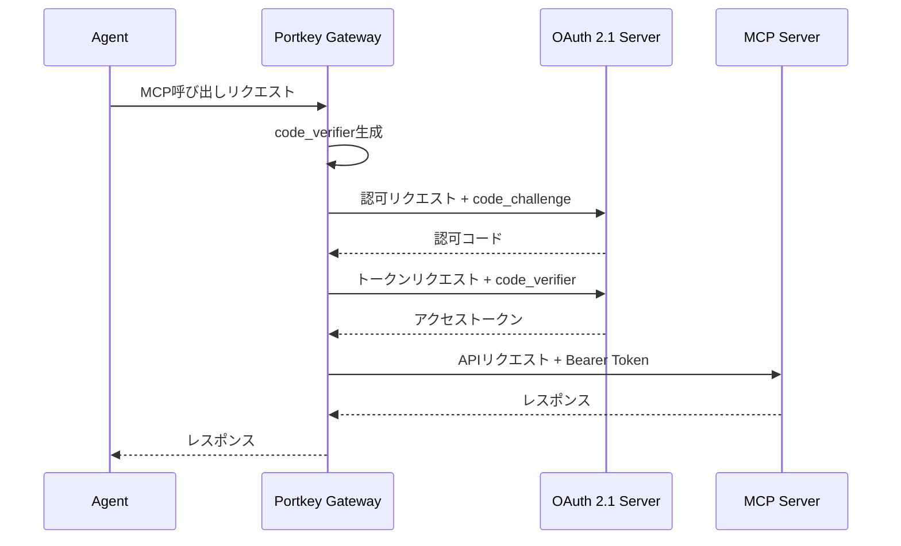
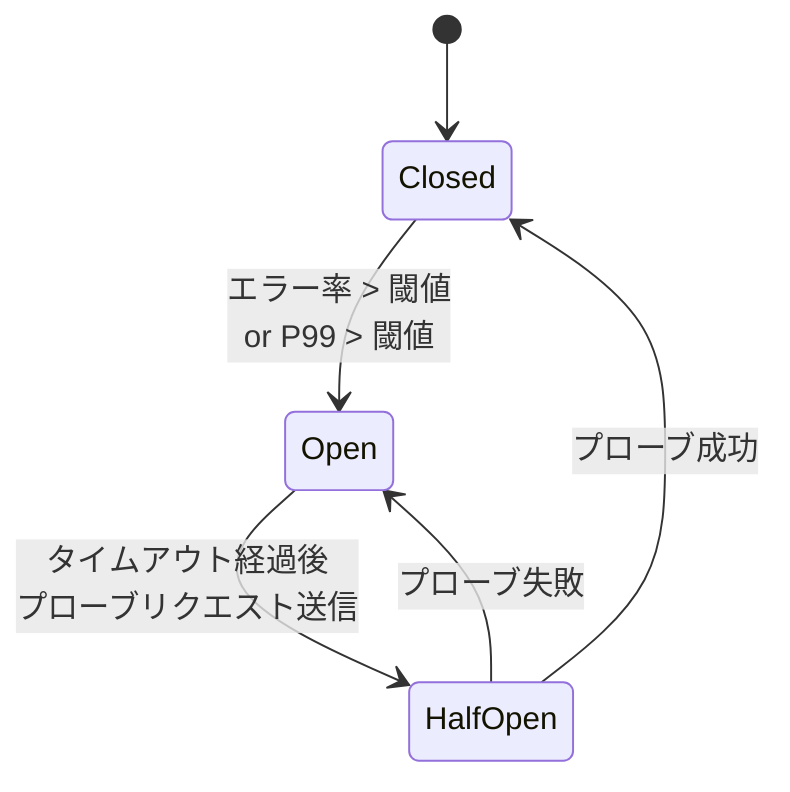

本記事は [The Gateway Grew Up — Portkey Blog](https://portkey.ai/blog/gateway-2-0/) の解説記事です。

## ブログ概要（Summary）

Portkey AIが2026年3月に公開した「The Gateway Grew Up」は、同社のAIゲートウェイ製品であるPortkey Gatewayのメジャーアップデート（Gateway 2.0）を発表するブログ記事である。Portkeyの公式ブログによると、3年間の本番運用で24,000以上の組織、1日あたり1兆トークンの処理、1.8億ドル以上のAI支出管理を経て培ったインフラを、Apache 2.0ライセンスでフルOSS化した。MCP Registry、OAuth 2.1 for MCP、サーキットブレーカー、Usage Policies等、従来SaaS限定だった機能群がすべてオープンソースとして提供される。

この記事は [Zenn記事: Portkey AI Gatewayで複数LLMを統合管理する実践ガイド](https://zenn.dev/0h_n0/articles/eeae51b7540bcf) の深掘りです。

## 情報源

- **種別**: 企業テックブログ
- **URL**: [https://portkey.ai/blog/gateway-2-0/](https://portkey.ai/blog/gateway-2-0/)
- **組織**: Portkey AI
- **発表日**: 2026年3月

## 技術的背景（Technical Background）

### AIゲートウェイが必要になった背景

LLMプロバイダの増加に伴い、企業のAIインフラは複雑化の一途を辿っている。OpenAI、Anthropic、Google、Mistral、Cohere等、各プロバイダがそれぞれ独自のAPIフォーマット、認証方式、レート制限、エラーハンドリングを持つ。複数プロバイダを活用する本番システムでは、以下の課題が顕在化する。

1. **APIフォーマットの分断**: プロバイダごとにリクエスト/レスポンス形式が異なり、クライアント側で個別対応が必要
2. **障害耐性の確保**: 単一プロバイダ依存では、障害発生時にサービス全体が停止する
3. **コスト管理の困難**: モデル選択・トークン使用量・プロバイダ間の価格差を横断的に把握することが難しい
4. **エージェント時代の新要件**: MCP（Model Context Protocol）の普及により、ツール呼び出しの管理・認証・バージョン管理が新たな課題に

Portkeyの公式ブログでは、Gateway 2.0を「全てのAIリクエストが通過する単一の信頼性の高いレイヤー」と位置づけている。3年間の本番運用を通じて、当初はルーティングとフォールバックの基盤だったゲートウェイが、ガバナンス・オブザーバビリティ・認証・コスト管理を統合したプラットフォームへと発展した経緯が記されている。

### Portkeyの3年間の成長

ブログの記載によると、Portkey Gatewayは以下の規模に成長している。

| 指標 | 数値 |
|------|------|
| 利用組織数 | 24,000+ |
| 管理AI支出 | $180M+ |
| 日次処理トークン | 1兆（1T） |
| 対応プロバイダ/モデル | 250+プロバイダ、1,600+モデルバリアント |
| GitHubスター数 | 11,700+ |

GitHubリポジトリ（[portkey-ai/gateway](https://github.com/portkey-ai/gateway)）によると、コードベースの96%がTypeScriptで書かれており、122KBの軽量フットプリントで1ms未満のレイテンシオーバーヘッドを実現している。

## 実装アーキテクチャ（Architecture）

### Gateway 2.0のアーキテクチャ全体像

Portkey Gatewayは、アプリケーションとLLMプロバイダの間に配置されるリバースプロキシとして機能する。OpenAI互換のREST APIを単一エントリポイントとして公開し、バックエンドで250以上のプロバイダへリクエストをルーティングする。



### OpenAI互換API設計の仕組み

Portkey Gatewayの設計上の要となるのが、OpenAI互換のユニバーサルAPIである。アプリケーション側は常にOpenAI形式でリクエストを送信し、Gateway内部のプロバイダアダプタが各プロバイダ固有のフォーマットに変換する。

この設計の利点は以下の通りである。

- **プロバイダ切り替えの透明性**: アプリケーションコードを一切変更せずにバックエンドのモデル/プロバイダを切り替え可能
- **SDK互換性**: OpenAI SDKをそのまま使用でき、エンドポイントURLの変更のみで導入可能
- **エージェントフレームワーク統合**: LangChain、LlamaIndex、CrewAI、AutoGen等のフレームワークがOpenAI互換APIを前提としているため、追加統合コードが不要

```python
from openai import OpenAI

# Portkey Gateway経由でリクエストを送信
# エンドポイントURLの変更のみで導入可能
client = OpenAI(
    api_key="your-portkey-api-key",
    base_url="https://ai-gateway.example.com/v1",  # Portkey Gatewayのエンドポイント
    default_headers={
        "x-portkey-provider": "anthropic",  # バックエンドプロバイダを指定
        "x-portkey-config": "production-config-id",  # ルーティング設定
    },
)

response = client.chat.completions.create(
    model="claude-sonnet-4-20250514",
    messages=[{"role": "user", "content": "Hello"}],
    max_tokens=1024,
)
```

### 250+プロバイダ接続の技術的課題

GitHubリポジトリの構成から、各プロバイダはアダプタパターンで実装されていることがわかる。プロバイダアダプタが担う変換処理には以下が含まれる。

1. **リクエスト変換**: OpenAI形式のリクエストボディを各プロバイダ固有の形式に変換（パラメータ名の違い、ストリーミングプロトコルの差異等）
2. **レスポンス正規化**: プロバイダ固有のレスポンスをOpenAI互換形式に統一（usage情報のマッピング、finish_reason の正規化等）
3. **認証処理**: プロバイダごとに異なる認証方式（Bearer Token、API Key Header、OAuth等）の抽象化
4. **ストリーミング変換**: SSE（Server-Sent Events）形式の差異を吸収し、統一的なストリーム配信

設定はJSON形式で管理され、リトライポリシー（指数バックオフ、最大5回）、重み付きロードバランシング、ガードレール（コンテンツフィルタリング等50種以上）をルーティング設定として定義する。

## 新機能の技術的詳細

### MCP Registry: バージョン管理とエージェント間連携

MCP（Model Context Protocol）は、LLMがツールやデータソースにアクセスするための標準プロトコルとして急速に普及している。しかし、エージェントが利用するMCPサーバーが増加すると、以下の管理課題が生じる。

- MCPサーバーのバージョン管理（どのバージョンがどのエージェントで使用されているか）
- 非推奨エンドポイントの検出（サイレントに失敗するのではなく明示的にエラーを返す）
- エージェント間でのMCPサーバー共有と設定管理

Portkeyの公式ブログによると、MCP Registryは「MCPサーバーを中央で追跡・バージョン管理し、非推奨エンドポイントをサイレントに失敗させるのではなく明示的に検出する」機能を提供する。



これにより、複数のエージェントが共通のMCPサーバーインベントリを参照しつつ、バージョン不整合やエンドポイント廃止に起因する障害を予防できる。

### OAuth 2.1 for MCP: PKCE認証フロー

従来のMCP認証では、各MCPサーバーのAPIキーを環境変数にハードコードする方式が一般的だった。この方式には以下の問題がある。

- APIキーの漏洩リスク（環境変数の意図しない公開）
- キーローテーションの運用負荷
- 細粒度のアクセス制御が困難

Gateway 2.0では、OAuth 2.1のPKCE（Proof Key for Code Exchange）フローをMCP認証に導入した。PKCEは元来モバイル/SPAアプリ向けに設計された認証方式で、以下のフローで動作する。

$$
\text{code\_verifier} \xrightarrow{\text{SHA-256}} \text{code\_challenge}
$$

1. クライアントがランダムな`code_verifier`を生成
2. `code_verifier`のSHA-256ハッシュである`code_challenge`を認可リクエストに含める
3. 認可コード取得後、トークンエンドポイントに`code_verifier`を送信
4. サーバー側で`code_verifier`からハッシュを再計算し、`code_challenge`と一致を検証



この方式により、APIキーのハードコードが不要になり、トークンの有効期限管理とスコープベースのアクセス制御が可能になる。

### Circuit Breakers: P99レイテンシベースの設計

サーキットブレーカーパターンは、障害が発生したサービスへのリクエスト送信を一時的に遮断し、障害の連鎖的な伝播を防止する設計パターンである。Portkey Gateway 2.0のサーキットブレーカーは、以下の特徴を持つ。

**設定可能なトリガー条件**:
- **P99レイテンシ閾値**: 例えば、P99レイテンシが5秒を超えた場合にサーキットをOpenにする
- **エラー率閾値**: 例えば、直近100リクエスト中のエラー率が20%を超えた場合にトリガー

**状態遷移モデル**:

サーキットブレーカーは3状態のステートマシンとして動作する。



- **Closed（通常状態）**: リクエストを通常通りプロバイダに転送。エラー率・レイテンシを継続的に監視
- **Open（遮断状態）**: プロバイダへのリクエストを遮断し、フォールバック処理を実行。選択肢は3つ:
  - キャッシュからのレスポンス返却（セマンティックキャッシュ）
  - 代替プロバイダへのルーティング
  - クリーンなエラーレスポンスの返却
- **Half-Open（回復テスト状態）**: プローブリクエスト（少量のテストリクエスト）をプロバイダに送信し、復旧を確認

```python
from dataclasses import dataclass, field
from enum import Enum
from time import time


class CircuitState(Enum):
    """サーキットブレーカーの3状態"""
    CLOSED = "closed"
    OPEN = "open"
    HALF_OPEN = "half_open"


@dataclass
class CircuitBreakerConfig:
    """サーキットブレーカーの設定

    Attributes:
        error_rate_threshold: サーキットをOpenにするエラー率閾値（0.0-1.0）
        p99_latency_threshold_ms: P99レイテンシ閾値（ミリ秒）
        window_size: 判定に使用するリクエスト数
        recovery_timeout_s: Open→Half-Open遷移までの秒数
        probe_count: Half-Open状態で送信するプローブリクエスト数
    """
    error_rate_threshold: float = 0.2
    p99_latency_threshold_ms: float = 5000.0
    window_size: int = 100
    recovery_timeout_s: int = 30
    probe_count: int = 3


@dataclass
class CircuitBreaker:
    """Portkey Gateway 2.0スタイルのサーキットブレーカー（概念実装）"""

    config: CircuitBreakerConfig
    state: CircuitState = CircuitState.CLOSED
    _latencies: list[float] = field(default_factory=list)
    _errors: int = 0
    _total: int = 0
    _opened_at: float = 0.0

    def record(self, latency_ms: float, is_error: bool) -> None:
        """リクエスト結果を記録し、状態遷移を判定"""
        self._latencies.append(latency_ms)
        self._total += 1
        if is_error:
            self._errors += 1

        # ウィンドウサイズを超えたら古いデータを削除
        if len(self._latencies) > self.config.window_size:
            self._latencies = self._latencies[-self.config.window_size :]

        self._evaluate()

    def _evaluate(self) -> None:
        """閾値に基づく状態遷移の評価"""
        if self.state == CircuitState.CLOSED and self._total >= self.config.window_size:
            error_rate = self._errors / self._total
            p99 = sorted(self._latencies)[int(len(self._latencies) * 0.99)]

            if (
                error_rate > self.config.error_rate_threshold
                or p99 > self.config.p99_latency_threshold_ms
            ):
                self.state = CircuitState.OPEN
                self._opened_at = time()

    def should_allow_request(self) -> bool:
        """リクエストを許可するか判定"""
        if self.state == CircuitState.CLOSED:
            return True
        if self.state == CircuitState.OPEN:
            if time() - self._opened_at > self.config.recovery_timeout_s:
                self.state = CircuitState.HALF_OPEN
                return True  # プローブリクエストを許可
            return False
        # HALF_OPEN: プローブリクエストを制限数だけ許可
        return True
```

### Usage Policies: リクエスト前制限の仕組み

Usage Policiesは、モデル呼び出しの**前段階**で制限を適用する機能である。従来のレート制限がリクエスト処理後に適用されるのに対し、Usage Policiesはインジェスト段階（Gateway受信直後）でチェックを行う。

この設計により、制限超過時にプロバイダへのリクエスト送信自体を回避でき、不要なAPI課金を防止できる。

**制限レベル**:

| レベル | 適用対象 | ユースケース |
|--------|---------|-------------|
| リクエスト数 | 単位時間あたりのリクエスト数 | バーストアクセスの抑制 |
| トークン数 | 入力/出力トークンの上限 | コスト管理、長文入力の制限 |
| コスト | ドル建ての予算上限 | 部門別予算管理 |

Usage PoliciesはVirtual APIキーと組み合わせて使用する。Virtual APIキーは、実際のプロバイダAPIキーをラップし、キーごとに予算・レート制限を設定できる仕組みである。

## Production Deployment Guide

### AWS実装パターン（コスト最適化重視）

Portkey Gatewayをセルフホストする場合のAWS構成パターンを示す。Gateway自体はTypeScript製の軽量プロセスであるため、コンテナ化してデプロイする。

| 規模 | 日次リクエスト | 推奨構成 | 月額コスト概算 | 主要サービス |
|------|--------------|---------|-------------|------------|
| **Small** | ~1,000 | Serverless | $80-200 | Lambda@Edge + API Gateway + DynamoDB |
| **Medium** | ~10,000 | Hybrid | $400-1,000 | ECS Fargate + ALB + ElastiCache |
| **Large** | 100,000+ | Container | $2,500-6,000 | EKS + Karpenter + ElastiCache Cluster |

**Small構成の特徴**:
- Lambda@EdgeでGatewayプロキシを実行（Node.js 22ランタイム）
- API GatewayでOpenAI互換エンドポイントを公開
- DynamoDBでルーティング設定・Usage Policies・メトリクスを管理
- コールドスタートは122KBのフットプリントにより1ms未満

**Medium構成の特徴**:
- ECS Fargate（2 vCPU、4GB RAM、最小2タスク）でGatewayコンテナを実行
- ALBでヘルスチェック付きロードバランシング
- ElastiCache（Redis）でセマンティックキャッシュとサーキットブレーカー状態を管理
- Auto Scaling: CPU使用率70%をターゲットに2-10タスクでスケール

**Large構成の特徴**:
- EKS + Karpenter（Spot Instances優先）でコスト最適化
- ElastiCache Clusterモードでキャッシュの高可用性確保
- Secrets ManagerでプロバイダAPIキーを集中管理
- CloudFront経由でグローバルエッジキャッシュ

**コスト試算の注意事項**:
- 上記は2026年5月時点のAWS ap-northeast-1料金に基づく概算値です
- LLMプロバイダへのAPI課金は別途発生します（Gatewayはプロキシのみ）
- 最新料金は [AWS料金計算ツール](https://calculator.aws/) で確認してください

### Terraformインフラコード

**Small構成（Serverless）**:

```hcl
# Portkey Gateway - Small構成 (Serverless)
# Lambda + API Gateway + DynamoDB

resource "aws_dynamodb_table" "gateway_config" {
  name         = "portkey-gateway-config"
  billing_mode = "PAY_PER_REQUEST"
  hash_key     = "config_id"

  attribute {
    name = "config_id"
    type = "S"
  }

  server_side_encryption {
    enabled = true
  }

  point_in_time_recovery {
    enabled = true
  }

  tags = {
    Service     = "portkey-gateway"
    Environment = "production"
  }
}

resource "aws_iam_role" "gateway_lambda" {
  name = "portkey-gateway-lambda"

  assume_role_policy = jsonencode({
    Version = "2012-10-17"
    Statement = [{
      Action = "sts:AssumeRole"
      Effect = "Allow"
      Principal = { Service = "lambda.amazonaws.com" }
    }]
  })
}

resource "aws_iam_role_policy" "gateway_lambda" {
  name = "portkey-gateway-lambda-policy"
  role = aws_iam_role.gateway_lambda.id

  policy = jsonencode({
    Version = "2012-10-17"
    Statement = [
      {
        Effect = "Allow"
        Action = [
          "dynamodb:GetItem",
          "dynamodb:Query",
        ]
        Resource = aws_dynamodb_table.gateway_config.arn
      },
      {
        Effect = "Allow"
        Action = [
          "secretsmanager:GetSecretValue",
        ]
        Resource = "arn:aws:secretsmanager:*:*:secret:portkey/*"
      },
      {
        Effect = "Allow"
        Action = [
          "logs:CreateLogGroup",
          "logs:CreateLogStream",
          "logs:PutLogEvents",
        ]
        Resource = "arn:aws:logs:*:*:*"
      },
    ]
  })
}

resource "aws_lambda_function" "gateway" {
  filename      = "portkey-gateway.zip"
  function_name = "portkey-gateway"
  role          = aws_iam_role.gateway_lambda.arn
  handler       = "index.handler"
  runtime       = "nodejs22.x"
  timeout       = 120
  memory_size   = 512

  environment {
    variables = {
      GATEWAY_CONFIG_TABLE = aws_dynamodb_table.gateway_config.name
      NODE_ENV             = "production"
    }
  }

  tracing_config {
    mode = "Active"  # X-Ray有効化
  }
}

resource "aws_apigatewayv2_api" "gateway" {
  name          = "portkey-gateway-api"
  protocol_type = "HTTP"

  cors_configuration {
    allow_origins = ["*"]
    allow_methods = ["POST", "GET", "OPTIONS"]
    allow_headers = ["*"]
  }
}
```

**Large構成（Container）**:

```hcl
# Portkey Gateway - Large構成 (EKS + Karpenter)

module "eks" {
  source  = "terraform-aws-modules/eks/aws"
  version = "~> 20.31"

  cluster_name    = "portkey-gateway"
  cluster_version = "1.31"

  vpc_id     = module.vpc.vpc_id
  subnet_ids = module.vpc.private_subnets

  # Karpenterに必要なIAM設定
  enable_cluster_creator_admin_permissions = true

  cluster_endpoint_public_access = false  # プライベートアクセスのみ

  # コントロールプレーンのログ
  cluster_enabled_log_types = ["api", "audit", "authenticator"]
}

# Karpenter Provisioner（Spot優先で最大90%コスト削減）
resource "kubectl_manifest" "karpenter_nodepool" {
  yaml_body = yamlencode({
    apiVersion = "karpenter.sh/v1"
    kind       = "NodePool"
    metadata   = { name = "portkey-gateway" }
    spec = {
      template = {
        spec = {
          requirements = [
            { key = "karpenter.sh/capacity-type", operator = "In", values = ["spot", "on-demand"] },
            { key = "node.kubernetes.io/instance-type", operator = "In",
              values = ["c7g.xlarge", "c7g.2xlarge", "c6g.xlarge", "c6g.2xlarge"] },
          ]
          nodeClassRef = { group = "karpenter.k8s.aws", kind = "EC2NodeClass", name = "default" }
        }
      }
      limits   = { cpu = "64", memory = "128Gi" }
      disruption = {
        consolidationPolicy = "WhenEmptyOrUnderutilized"
        consolidateAfter    = "30s"
      }
    }
  })
}

# ElastiCache (Redis) - セマンティックキャッシュ + サーキットブレーカー状態
resource "aws_elasticache_replication_group" "gateway_cache" {
  replication_group_id = "portkey-gateway-cache"
  description          = "Portkey Gateway cache (semantic cache + circuit breaker state)"
  engine               = "redis"
  engine_version       = "7.1"
  node_type            = "cache.r7g.large"
  num_cache_clusters   = 2
  at_rest_encryption_enabled = true
  transit_encryption_enabled = true
  automatic_failover_enabled = true

  subnet_group_name = aws_elasticache_subnet_group.gateway.name
}

# AWS Budgets - 月額予算アラート
resource "aws_budgets_budget" "gateway" {
  name         = "portkey-gateway-monthly"
  budget_type  = "COST"
  limit_amount = "6000"
  limit_unit   = "USD"
  time_unit    = "MONTHLY"

  notification {
    comparison_operator       = "GREATER_THAN"
    threshold                 = 80
    threshold_type            = "PERCENTAGE"
    notification_type         = "ACTUAL"
    subscriber_email_addresses = ["infra-alerts@example.com"]
  }
}
```

### 運用・監視設定

**CloudWatch Logs Insights クエリ**:

```
# Gatewayのプロバイダ別レイテンシ分析（P50/P95/P99）
fields @timestamp, provider, latency_ms
| filter @message like /provider_response/
| stats percentile(latency_ms, 50) as p50,
        percentile(latency_ms, 95) as p95,
        percentile(latency_ms, 99) as p99,
        count() as total
  by provider
| sort total desc
```

```
# サーキットブレーカー発動イベントの監視
fields @timestamp, provider, circuit_state, error_rate, p99_latency
| filter circuit_state = "OPEN"
| sort @timestamp desc
| limit 50
```

**CloudWatch アラーム設定（Python）**:

```python
import boto3


def create_gateway_alarms(
    cloudwatch: boto3.client,
    sns_topic_arn: str,
) -> None:
    """Portkey Gateway用のCloudWatchアラームを作成

    Args:
        cloudwatch: CloudWatch client
        sns_topic_arn: アラート通知先のSNSトピックARN
    """
    # Gateway ECSタスクのCPU使用率スパイク検知
    cloudwatch.put_metric_alarm(
        AlarmName="portkey-gateway-cpu-high",
        MetricName="CPUUtilization",
        Namespace="AWS/ECS",
        Statistic="Average",
        Period=300,
        EvaluationPeriods=2,
        Threshold=80.0,
        ComparisonOperator="GreaterThanThreshold",
        Dimensions=[
            {"Name": "ClusterName", "Value": "portkey-gateway"},
            {"Name": "ServiceName", "Value": "portkey-gateway-service"},
        ],
        AlarmActions=[sns_topic_arn],
    )

    # サーキットブレーカーOpen頻度の監視
    cloudwatch.put_metric_alarm(
        AlarmName="portkey-gateway-circuit-breaker-opens",
        MetricName="CircuitBreakerOpens",
        Namespace="PortkeyGateway",
        Statistic="Sum",
        Period=300,
        EvaluationPeriods=1,
        Threshold=5.0,  # 5分間に5回以上OpenならアラートA
        ComparisonOperator="GreaterThanThreshold",
        AlarmActions=[sns_topic_arn],
    )
```

**X-Ray トレーシング設定（Python）**:

```python
from aws_xray_sdk.core import xray_recorder, patch_all

# boto3, requests, httplib を自動計装
patch_all()


@xray_recorder.capture("gateway_proxy_request")
def proxy_to_provider(
    provider: str,
    model: str,
    payload: dict,
) -> dict:
    """Gatewayプロキシリクエストのトレーシング

    Args:
        provider: LLMプロバイダ名
        model: モデル名
        payload: リクエストペイロード

    Returns:
        プロバイダからのレスポンス
    """
    subsegment = xray_recorder.current_subsegment()
    if subsegment:
        subsegment.put_annotation("provider", provider)
        subsegment.put_annotation("model", model)
        subsegment.put_metadata("token_count", payload.get("max_tokens", 0))

    # ... プロバイダへのリクエスト処理 ...
    return {}
```

**Cost Explorer 日次レポート（Python）**:

```python
from datetime import date, timedelta

import boto3


def get_daily_gateway_cost(ce_client: boto3.client) -> dict:
    """Portkey Gateway関連の日次コストを取得

    Returns:
        サービス別のコスト辞書
    """
    today = date.today()
    yesterday = today - timedelta(days=1)

    response = ce_client.get_cost_and_usage(
        TimePeriod={
            "Start": yesterday.isoformat(),
            "End": today.isoformat(),
        },
        Granularity="DAILY",
        Metrics=["BlendedCost"],
        Filter={
            "Tags": {
                "Key": "Service",
                "Values": ["portkey-gateway"],
            }
        },
        GroupBy=[{"Type": "DIMENSION", "Key": "SERVICE"}],
    )

    costs = {}
    for group in response["ResultsByTime"][0]["Groups"]:
        service = group["Keys"][0]
        amount = float(group["Metrics"]["BlendedCost"]["Amount"])
        costs[service] = amount

    return costs
```

### コスト最適化チェックリスト

**アーキテクチャ選択**:
- [ ] 日次1,000リクエスト以下 → Serverless（Lambda + API Gateway）
- [ ] 日次1,000-100,000 → Hybrid（ECS Fargate + ALB）
- [ ] 日次100,000以上 → Container（EKS + Karpenter）

**リソース最適化**:
- [ ] EKS: Karpenter + Spot Instancesで最大90%コスト削減
- [ ] Fargate: ARM64（Graviton）を指定して20%コスト削減
- [ ] ElastiCache: Reserved Nodeで最大55%削減（1年コミット）
- [ ] Lambda: メモリサイズ512MB（Gateway軽量フットプリントに最適）
- [ ] NAT Gateway: VPCエンドポイント活用で不要化

**LLMプロバイダコスト削減**（Gateway機能で実現）:
- [ ] セマンティックキャッシュ有効化（同一クエリのAPI呼び出し削減）
- [ ] Usage Policiesで部門別予算上限を設定
- [ ] Model Catalogの価格情報を参照し最適モデルを自動選択
- [ ] Virtual APIキーで個別ユーザー/チームのトークン上限を設定

**監視・アラート**:
- [ ] AWS Budgets: 月額予算の80%到達でアラート
- [ ] CloudWatch: サーキットブレーカーOpen頻度の監視
- [ ] Cost Anomaly Detection: 日次コストの異常検知
- [ ] Cost Explorerレポート: サービス別日次コスト可視化
- [ ] X-Ray: プロバイダ別レイテンシトレーシング

**リソース管理**:
- [ ] 未使用のVirtual APIキーの定期削除
- [ ] タグ戦略: `Service=portkey-gateway`, `Environment`, `Team` 必須
- [ ] ElastiCache: TTL設定でキャッシュ肥大化を防止
- [ ] CloudWatch Logs: 保持期間を90日に設定
- [ ] 開発環境: 夜間・休日はECS/EKSタスク数を0にスケールダウン

## パフォーマンス（Performance）

### 1T tokens/day の処理規模

ブログの記載によると、Portkey Gatewayは1日あたり1兆トークンを処理している。この規模感を理解するために数値を分解する。

$$
\frac{10^{12} \text{ tokens/day}}{86400 \text{ s/day}} \approx 11.6 \times 10^6 \text{ tokens/s}
$$

秒間約1,160万トークンの処理となる。仮に1リクエストあたり平均1,000トークン（入力+出力）とすると、秒間約11,600リクエストを処理している計算になる。

GitHubリポジトリによると、Gatewayのレイテンシオーバーヘッドは「1ms未満」であり、122KBの軽量フットプリントがこの高スループットに寄与している。TypeScript（Node.js）の非同期I/Oモデルにより、プロバイダへのHTTPリクエスト待ち時間中にイベントループが他のリクエストを処理できるため、少ないコンピュートリソースで高い並行性を実現している。

### セマンティックキャッシュの効果

Gateway 2.0はSimple Cache（完全一致キャッシュ）とSemantic Cache（意味的類似度に基づくキャッシュ）の2種類を提供する。セマンティックキャッシュでは、入力テキストの埋め込みベクトルを計算し、類似度が閾値を超える過去のリクエストのレスポンスを再利用する。

キャッシュヒット時はプロバイダへのAPIリクエストが発生しないため、以下の効果が得られる。
- **レイテンシ**: プロバイダのレスポンス時間（通常500ms-5s）をスキップし、キャッシュからの応答（数ms）で完結
- **コスト**: キャッシュヒット分のAPIトークン課金がゼロ

## 運用での学び（Production Lessons）

### 3年の本番運用から得た知見

Portkeyの公式ブログでは、3年間の本番運用から以下の知見が共有されている。

**1. エージェントエコシステムの進化速度**:
ブログでは「エージェントエコシステムの進化が速い」ことがOSS化の主な理由として挙げられている。新しいモデルやプロバイダが頻繁にリリースされるため、プロプライエタリなSaaS製品ではアップデートが追いつかない。OSS化により、コミュニティが新プロバイダのアダプタを迅速に追加できる体制を整えた。

**2. 以前SaaS限定だった機能のOSS化**:
ブログによると、以下の機能が今回のアップデートでOSS化された。
- ガバナンス（RBAC、監査ログ）
- オブザーバビリティ（リアルタイムメトリクス）
- 認証（OAuth 2.1 for MCP）
- コスト管理（Usage Policies、予算制限）
- サーキットブレーカー
- セマンティックキャッシュ
- モデルカタログ
- メタデータガバナンス
- 設定管理

ブログでは「ライセンスキー不要、アップグレード催促なし」と明記されている。

**3. エンタープライズ要件への対応**:
オンプレミスデプロイメント向けに、gRPC、SSO、SCIM、AWS KMS、RBAC、JWT、監査ログ、マルチワークスペースサポート、SOC2/GDPR/HIPAA準拠が提供されている。これらはエンタープライズ版（有償）として提供される。

### ルーティング戦略の実践パターン

Gateway 2.0が提供するルーティング戦略を、ユースケース別に整理する。

| ルーティング戦略 | ユースケース | 動作 |
|----------------|-------------|------|
| 条件付きルーティング | リクエスト属性によるモデル選択 | ヘッダー/ペイロードの条件でルーティング先を決定 |
| 重み付きロードバランシング | コスト分散・A/Bテスト | 複数プロバイダに重み比率で分配 |
| フォールバック | 障害耐性 | プライマリ失敗時にセカンダリへ自動切替 |
| リトライ | 一時的エラー対応 | 指数バックオフで最大5回リトライ |
| サーキットブレーカー | 障害伝播防止 | P99/エラー率の閾値超過で自動遮断 |

## OSS化の意義と学術研究との関連（Academic Connection）

### フルOSS化の技術的意義

Gateway 2.0のApache 2.0ライセンスでのフルOSS化は、AIインフラの標準化という観点で重要な意味を持つ。

学術研究においては、LLMベースの実験パイプラインで複数モデルの比較評価を行う際に、統一的なAPIインターフェースが必要となる。Portkey Gatewayをローカルで実行することで、プロバイダ間の差異を吸収しつつ、コスト管理・レート制限・障害耐性を研究インフラに組み込める。

**関連する学術的トピック**:
- **Multi-LLM Routing**: 入力特性に基づいてリクエストを最適なモデルにルーティングする研究。Portkey Gatewayの条件付きルーティングと重み付きロードバランシングは、この分野の実装基盤として活用できる
- **LLM Cascading**: 小型モデルで応答を試み、品質が不十分な場合に大型モデルにフォールバックする手法。サーキットブレーカーとフォールバック機能で実現可能
- **Cost-Aware Inference**: Model Catalogの価格情報を活用し、品質制約の下でコストを最小化するルーティング最適化

### MCPの標準化と今後

MCP（Model Context Protocol）はAnthropicが2024年に発表したプロトコルであり、LLMとツール/データソースの接続を標準化する。Gateway 2.0のMCP RegistryとOAuth 2.1 for MCPは、MCPの本番運用における管理・認証の課題に対する実装解の一つである。MCPサーバーの数が増加し、マルチエージェントシステムが複雑化する中で、中央集権的なレジストリによるバージョン管理と認証管理の重要性は今後さらに高まると考えられる。

## まとめと実践への示唆

Portkey Gateway 2.0は、3年間の本番運用（24,000組織、1日1兆トークン、$180M+のAI支出管理）で培ったAIゲートウェイインフラをApache 2.0ライセンスでフルOSS化した。MCP Registry、OAuth 2.1 for MCP、サーキットブレーカー、Usage Policies等の新機能は、エージェント時代のLLMインフラに求められるガバナンス・認証・障害耐性を統合的に提供する。TypeScript製の軽量ゲートウェイ（122KB、1ms未満のオーバーヘッド）をセルフホストすることで、プロバイダロックインを回避しつつ、250+プロバイダ・1,600+モデルへの統一アクセスを実現できる。複数LLMを活用するシステムのインフラ標準化に向けた実践的な基盤である。

## 参考文献

- **Blog URL**: [https://portkey.ai/blog/gateway-2-0/](https://portkey.ai/blog/gateway-2-0/)
- **GitHub**: [https://github.com/portkey-ai/gateway](https://github.com/portkey-ai/gateway)
- **Documentation**: [https://portkey.ai/docs/product/ai-gateway](https://portkey.ai/docs/product/ai-gateway)
- **Related Zenn article**: [https://zenn.dev/0h_n0/articles/eeae51b7540bcf](https://zenn.dev/0h_n0/articles/eeae51b7540bcf)
